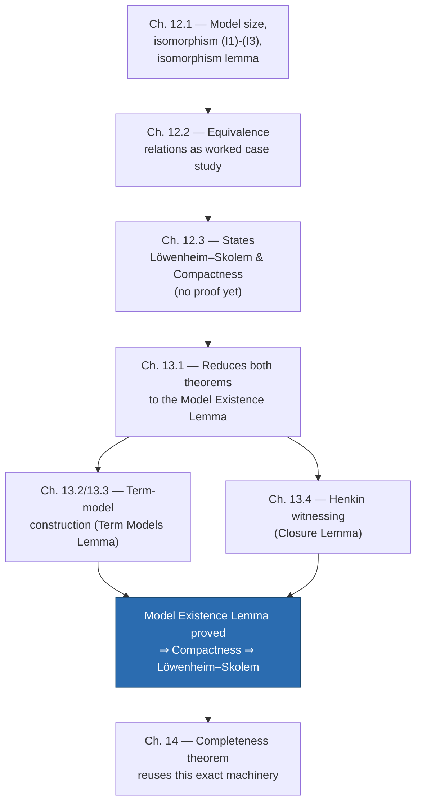
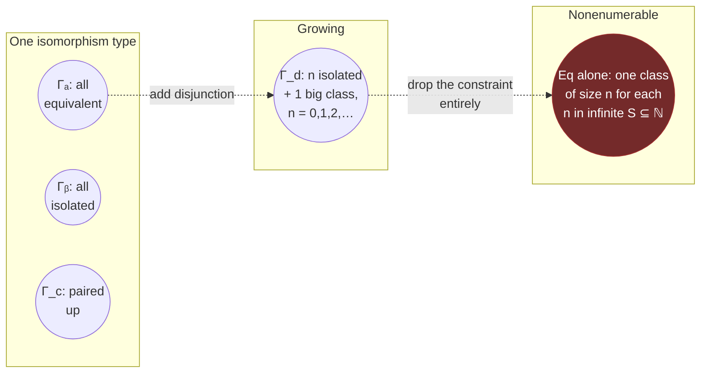
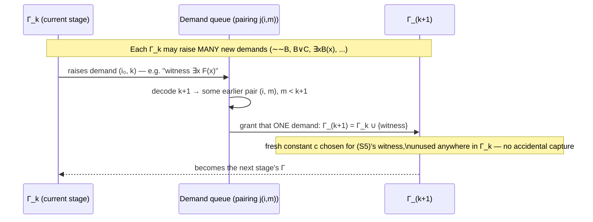

# Models, Isomorphism, and Cardinality

[[book-guidelines|↩ Back to guidelines]]

## Why this layer exists

Up to this point in the book you've had a recursive definition of truth-in-an-interpretation, $M \models F$, and (from [[Metalogical-Notions]]) the semantic vocabulary built on top of it — implication, validity, satisfiability. All of that machinery treats "an interpretation" as a black box: some domain, some assignment of denotations to the nonlogical symbols. Chapter 12 opens up that box and asks the questions a type-checker author asks about *models of a specification* rather than about a single derivation: How big can a model be? How many models does a sentence have? When are two models "the same" in the only sense that matters logically — not literally identical, but structurally indistinguishable? And, most consequentially: is there ever a set of sentences that is satisfiable in principle (every finite piece of it has a model) but has no model at all?

That last question is the one the whole two-chapter unit is really building toward. Chapter 12 states the answer — no, this never happens; that's the **compactness theorem** — along with its close cousin the **Löwenheim–Skolem theorem** (every satisfiable set of sentences has a model no bigger than countably infinite). Chapter 13 is where you actually pay for those theorems: a full, constructive proof by building an explicit model out of the syntax itself — a **term model** — using a technique called **Henkin witnessing** that manufactures witnesses for every existential claim a theory is forced to make. This is where the book's own "verification engine" first appears in full: everything from Chapter 14's completeness theorem onward *is* this construction, retooled.

**What breaks without this layer:** without isomorphism, "how many models does a theory have" has a useless answer — always either zero or a nonenumerable infinity, no matter what the theory says (Section 12.1 proves this directly). You need isomorphism *type* to ask an informative question. And without compactness, you have no general tool for showing a theory has an infinite model except by exhibiting one by hand each time — which is exactly the kind of ad hoc reasoning [[Nonstandard-Models-of-Arithmetic#The overspill principle|the overspill principle]] (Corollary 12.16) replaces with a two-line argument.



## Models and model size

The book's definition (p. 137) is almost tautological on purpose: **a model of a sentence or set of sentences is any interpretation in which the sentence, or every sentence in the set, comes out true.** The **size** of a model is the size of its domain — finite, denumerable, or nonenumerable, tracking whatever the domain's cardinality is.

The first question worth asking is: can a *single* sentence pin down the exact size of its models? Yes, easily, even in the barest possible language (identity only, no predicates or function symbols). For each $n$, the book defines:

$$I_n \;=\; \forall x_1 \forall x_2 \cdots \forall x_{n-1} \, \exists x_n \, (x_n \neq x_1 \,\&\, \cdots \,\&\, x_n \neq x_{n-1})$$

which is true in an interpretation iff the domain has **at least** $n$ elements. From it: $J_n = {\sim}I_{n+1}$ (at most $n$ elements) and $K_n = I_n \,\&\, J_n$ (exactly $n$ elements). So finite model sizes are entirely expressible — nothing surprising yet.

The more interesting fact (Example 12.2) is that a **single sentence can force every model to be infinite.** Take a two-place predicate $R$ and the sentence

$$A \;=\; \forall x\exists y\, Rxy \;\&\; \forall x\forall y\, {\sim}(Rxy \,\&\, Ryx) \;\&\; \forall x\forall y\forall z\,((Rxy \,\&\, Ryz) \rightarrow Rxz)$$

("$R$ is a strict, irreflexive, transitive order in which everything has an $R$-successor"). $A$ is true of the naturals under $<$, so it's satisfiable — but if $M$ were a *finite* model of $A$, you could chase successors $n_0, n_1, n_2, \dots$ forever (each guaranteed distinct from all previous ones by antisymmetry + transitivity) and eventually exceed $|M|$'s size, a contradiction. So $A$ has a denumerable model but *no* finite model at all.

**What breaks without this:** if every satisfiable sentence had only finite models (or only models of bounded size), first-order logic would be far too weak to axiomatize anything genuinely infinite — no theory of arithmetic, no theory of an unbounded stack, nothing your elaborator would recognize as "a recursive datatype has infinitely many possible values." Example 12.2 is the two-line proof that first-order logic clears that bar.

### Grounding: "at least $n$ distinct elements" as a Lean proposition

Since this material is directly set-theoretic, Lean is the primary grounding language throughout this article (per the style guide's own rule: promote Lean over Rust whenever the source is itself proof/set-theoretic). $I_n$'s semantic content is almost literally a cardinality proposition:

```lean
-- "the domain has at least n distinct elements", as a first-order sentence's *meaning*,
-- not its syntax — this is what I_n asserts under any interpretation M.
def hasAtLeast (M : Type) (n : Nat) : Prop :=
  ∃ f : Fin n → M, Function.Injective f

-- Example 12.2's sentence A, semantically: R is a strict order with no top element.
structure NoMaxOrder (M : Type) (R : M → M → Prop) : Prop where
  succ_exists : ∀ x, ∃ y, R x y
  irrefl_pair : ∀ x y, ¬ (R x y ∧ R y x)
  trans       : ∀ x y z, R x y → R y z → R x z

-- The book's argument that NoMaxOrder forces an infinite domain, as a proof sketch:
-- build the successor sequence n_0, n_1, n_2, ... and show pairwise distinctness
-- follows from trans + irrefl_pair, then note a Fin-valued domain can't host an
-- injective ℕ-indexed sequence — Mathlib's `Set.Infinite` machinery does this directly.
```

This is worth pausing on: a Lean structure like `NoMaxOrder` is *exactly* the kind of thing a proof-search engine needs to recognize as "this type class has no finite model" before it can safely assume decidability or generate exhaustive test cases — the same failure mode that trips up naive property-based testers over unbounded recursive types.

## Isomorphism and isomorphism type

Here's the disappointing fact the book leads with (p. 139): **if a sentence has any models of a given size at all, it has a nonenumerable infinity of them.** Trivial example: $\exists x \forall y (y = x)$ (there's exactly one thing) has a model for literally every possible singleton set $\{a\}$ — one per real number, if you like. Counting models "literally" is a useless measure.

The fix is to count not models but **isomorphism types** — models "up to looking exactly alike." Two interpretations $\mathcal{P}, \mathcal{Q}$ of the same language are **isomorphic** iff there's a correspondence (bijection) $j : |\mathcal{P}| \to |\mathcal{Q}|$ satisfying, for every $n$-place predicate $R$, constant $c$, and $n$-place function symbol $f$:

$$
\begin{aligned}
\text{(I1)}\quad & R^{\mathcal{P}}(p_1,\dots,p_n) \iff R^{\mathcal{Q}}(j(p_1),\dots,j(p_n)) \\
\text{(I2)}\quad & j(c^{\mathcal{P}}) = c^{\mathcal{Q}} \\
\text{(I3)}\quad & j(f^{\mathcal{P}}(p_1,\dots,p_n)) = f^{\mathcal{Q}}(j(p_1),\dots,j(p_n))
\end{aligned}
$$

In other words: $j$ is a bijection that commutes with every piece of nonlogical structure in the language. Example 12.3 (inverse order / mirror arithmetic) makes this concrete: the naturals under $<$ and the nonpositive integers under $>$ are isomorphic via $n \mapsto -n$; extend the language with $0$, successor $'$, $+$, and a "mirror multiplication" $\cdot$ defined as $x \cdot y = -xy$, and the same map still satisfies (I3) because $-x-1 = -(x+1)$, $(-x)+(-y) = -(x+y)$, and $-(-x)(-y) = -xy$ all check out as equations. The isomorphism doesn't care that the mirror structure "looks weird" — only that the algebraic relationships transfer.

Two structural results carry all the weight:

**Proposition 12.4.** Given any bijection $j : X \to Y$ and any interpretation $\mathcal{Y}$ with domain $Y$, you can *manufacture* an interpretation $\mathcal{X}$ with domain $X$ isomorphic to $\mathcal{Y}$ — just push every relation/constant/function backward through $j$. This means every finite model of size $n$ has an isomorphic copy with domain exactly $\{0, \dots, n-1\}$, and every denumerable model has an isomorphic copy with domain exactly $\mathbb{N}$. (This is the **canonical-domains lemma**, 12.6, once you combine it with the next result.)

**Proposition 12.5 (Isomorphism Lemma).** If $\mathcal{P} \cong \mathcal{Q}$, then for *every* sentence $A$ of the language, $\mathcal{P} \models A \iff \mathcal{Q} \models A$. The proof is a straightforward induction on the complexity of $A$ — atomic case falls out of (I1)/(I2) directly, negation/disjunction are immediate from the truth clauses, and the quantifier case uses that $j$ is onto (every element of $|\mathcal{Q}|$ is $j(p)$ for some $p$) to swap "for all $p$ in $\mathcal{P}$" with "for all $q$ in $\mathcal{Q}$."

**What breaks without the isomorphism lemma:** without it, "isomorphic" would just be a bijection-with-nice-properties — a purely structural notion with no guaranteed *logical* payoff. The isomorphism lemma is what promotes isomorphism from "these look alike" to "these are logically indistinguishable — no sentence in the language can tell them apart." That's the property that makes isomorphism type a meaningful thing to count, and it's the property Vaught's test (below) leans on entirely.

### Grounding: isomorphism as a structure-preserving equivalence, in Lean

This is precisely what Lean/Mathlib calls a **structure isomorphism**, and if you've touched `Equiv` or algebraic isomorphisms in Mathlib you've already used this idea:

```lean
structure Interp (L : Language) where
  dom   : Type
  rel   : L.Rel → (List dom → Prop)     -- schematic: real version tracks arity
  const : L.Const → dom
  func  : L.Func → (List dom → dom)

structure IsIso (L : Language) (P Q : Interp L) where
  j        : P.dom ≃ Q.dom                       -- a bijection, i.e. `Equiv`
  rel_iff  : ∀ (R : L.Rel) (args : List P.dom),
               P.rel R args ↔ Q.rel R (args.map j)      -- (I1)
  const_eq : ∀ (c : L.Const), j (P.const c) = Q.const c  -- (I2)
  func_eq  : ∀ (f : L.Func) (args : List P.dom),
               j (P.func f args) = Q.func f (args.map j) -- (I3)

-- The isomorphism lemma, 12.5, as a theorem type — note it quantifies over ALL sentences:
theorem iso_lemma {L : Language} {P Q : Interp L} (h : IsIso L P Q) :
    ∀ A : Formula L, satisfies P A ↔ satisfies Q A := by
  intro A
  induction A with
  | atomic R args => exact h.rel_iff R args  -- roughly; real proof threads j through terms
  | «not» F ih     => simp [satisfies, ih]
  | «or» F G ihF ihG => simp [satisfies, ihF, ihG]
  | «exists» x F ih => constructor
      -- forward: pick p witnessing F in P, push through j.toFun, use ih
      -- backward: pick q witnessing F in Q, pull back through j.symm, use ih
      <;> sorry -- the real proof is exactly the book's five-case induction, spelled out
```

The `Equiv` bundling (a function, an inverse, and proofs they cancel) is doing the same job as the book's "correspondence" — a total, one-to-one, onto function — and Lean's kernel checking `j.left_inv`/`j.right_inv` at every use site is a machine-checked version of the book's remark that being "one-to-one" is exactly what's needed for the identity-sentence case of the induction.

## Equivalence relations as a model-theoretic case study

Section 12.2 is the book's worked example, and it earns its place: it's the single clearest illustration of how many isomorphism types a theory can have, ranging from "exactly one" through "exactly $n$," "denumerably many," all the way to "nonenumerably many" — all from *variations on one sentence*.

The base theory lives in a language with one two-place predicate $\equiv$, and consists of the sentence

$$\mathrm{Eq} \;=\; \forall x\, x \equiv x \;\&\; \forall x\forall y(x \equiv y \rightarrow y \equiv x) \;\&\; \forall x\forall y\forall z((x \equiv y \,\&\, y \equiv z) \rightarrow x \equiv z)$$

— reflexivity, symmetry, transitivity: the three familiar equivalence-relation axioms. The book also proves the standard correspondence: every equivalence relation on $X$ arises from a unique **partition** of $X$ into disjoint, exhaustive nonempty pieces (the equivalence classes), and vice versa. A denumerable model of $\mathrm{Eq}$ can therefore be completely described by its **signature**: an infinite sequence whose 0th entry counts the infinite equivalence classes and whose $n$th entry ($n>0$) counts the classes with exactly $n$ elements.

The examples then dial the signature up and down to control the isomorphism-type count:

| Added sentence | Signature shape | # isomorphism types (denumerable models) |
|---|---|---|
| $E_a: \forall x\forall y\, x \equiv y$ | one infinite class | 1 |
| $E_b: \forall x\forall y\,(x \equiv y \leftrightarrow x = y)$ | all singleton classes | 1 |
| $E_a \lor E_b$ | either of the above | 2 |
| $E_c$ (each element paired with exactly one other) | all classes of size 2 | 1 |
| $E_a \lor E_b \lor E_c$ | any of the three | 3 |
| $E_d$ (non-isolated elements are all mutually equivalent) | $n$ isolated + 1 big class, for any $n$ | denumerably many |
| $\mathrm{Eq}$ alone, unconstrained | one class of size $n$ for each $n$ in an arbitrary infinite set $S \subseteq \mathbb{N}$ | nonenumerably many (one per infinite $S$) |

The last row (Example 12.13) is the sharpest illustration of the whole chapter's opening warning: *without* isomorphism type to organize the count, "how many models does $\mathrm{Eq}$ have" was always going to be "nonenumerably many, full stop" — but "how many isomorphism types" turns out to distinguish a spectrum from "exactly one" all the way to "as many as there are infinite subsets of $\mathbb{N}$," and that distinction is exactly what a theory's expressive power buys you.

**What breaks without this:** the isomorphism lemma is what makes each row of that table legitimate — e.g. it's why a model satisfying $E_a$ can never be isomorphic to one satisfying $E_b$ ($E_a$ is true in one, false in the other, so the isomorphism lemma forbids an isomorphism). Without it, "these two pictures are structurally different" would be an intuition about the pictures, not a theorem about the sentences.



## Denumerable categoricity and Vaught's test

This is where the chapter turns the isomorphism-type count into a *tool*. A set of sentences $\Gamma$ is:

- **(implicationally) complete** if for every sentence $A$ in its language, either $A$ or $\sim A$ is a consequence of $\Gamma$;
- **denumerably categorical** if any two denumerable models of $\Gamma$ are isomorphic — i.e. $\Gamma$ has *exactly one* isomorphism type among its denumerable models (assuming it has at least one).

**Vaught's test (Corollary 12.17):** if $\Gamma$ is denumerably categorical and has no finite models, then $\Gamma$ is complete.

The proof is a clean four-line contradiction, and it's worth walking through because the pattern — "assume incompleteness, derive two non-isomorphic models that categoricity says must be isomorphic" — recurs throughout model theory:

> Suppose $\Gamma$ is *not* complete: some $A$ has neither $A$ nor ${\sim}A$ as a consequence. Then both $\Gamma \cup \{{\sim}A\}$ and $\Gamma \cup \{A\}$ are satisfiable (if $\Gamma \cup \{{\sim}A\}$ weren't satisfiable, $A$ would be a consequence of $\Gamma$ — contradiction; symmetrically for the other). By the Löwenheim–Skolem theorem both have enumerable models $\mathcal{P}^-, \mathcal{P}^+$; since $\Gamma$ has no finite models, both are actually *denumerable*. By denumerable categoricity, $\mathcal{P}^- \cong \mathcal{P}^+$. But $A$ is false in one and true in the other, so by the isomorphism lemma they *cannot* be isomorphic. Contradiction — $\Gamma$ must be complete.

This single corollary retroactively explains why Examples 12.7, 12.8, 12.10 (one isomorphism type of denumerable model each) become genuinely useful once you add $I_1, I_2, I_3, \dots$ to rule out finite models: the resulting theories are all complete, purely as a consequence of counting isomorphism types — no proof search, no syntax, needed.

**What breaks without Vaught's test:** proving a theory complete "by hand" means showing every sentence or its negation is provable — a syntactic, potentially infinite undertaking. Vaught's test replaces that with a purely semantic, often one-paragraph argument (count isomorphism types, check for finite models) — the same trade a type-system designer makes when they prove decidability of type inhabitation via a semantic model instead of by exhibiting an algorithm.

## The Löwenheim–Skolem theorem

Stated (12.14) with almost no fanfare, because its proof is deferred to Chapter 13:

> **If a set of sentences has a model, then it has an enumerable model.**

Two immediate corollaries the book draws out:

- **Overspill principle (12.16):** if $\Gamma$ has arbitrarily large finite models, it has a denumerable model. (Proof: add all the $I_m$ sentences to $\Gamma$; every finite subset is still satisfiable because $\Gamma$'s finite models get arbitrarily large; apply compactness to get a model of the whole enlarged set, which must be infinite, then Löwenheim–Skolem to shrink it to enumerable size.) This is the theorem that turns "no upper bound on finite model size" into "an honest infinite model exists" — a jump that set-theoretic bookkeeping alone cannot make.
- **Canonical-domains theorem (12.18):** you can always find a model whose domain is literally an initial segment of $\mathbb{N}$, or all of $\mathbb{N}$ — never mind what "size" the original models seemed to have. This sharpens Lemma 12.6 using Löwenheim–Skolem itself.

## The compactness theorem

Stated in the same breath (12.15):

> **If every finite subset of a set of sentences has a model, then the whole set has a model.**

This is the harder-earning, more surprising of the pair — it says local satisfiability (every *finite piece* is fine) forces global satisfiability, with no bound at all on how large the whole set is. Note the logical relationship: compactness in the strong "enumerable model" form used in Chapter 13 (Lemma 13.3) actually *implies* Löwenheim–Skolem as a corollary, since a model of a set is trivially a model of every subset, in particular every finite subset.

The book flags (p. 148) that there's a second, more standard route to both theorems via soundness + Gödel completeness for a syntactic deduction system — but chooses to prove compactness *first*, directly, with no notion of deduction anywhere in the proof. That choice matters for the book's later goals: it means the compactness/Löwenheim–Skolem pair is established independently of which particular proof calculus you go on to adopt in Chapter 14 — you get "any sound-and-complete deduction system will do" for free, rather than being married to one specific rule set.

## The model-existence and term-model construction

Chapter 13 is entirely the proof of compactness. The strategy (13.1) is to bottleneck everything through one lemma:

> **Model Existence Lemma (13.3).** Let $L^+$ extend $L$ with infinitely many new constants. If $S^*$ is a set of sets of $L^+$-sentences with the **satisfaction properties**, then every $L$-sentence-set in $S^*$ has a model in which *every domain element is the denotation of some closed term of $L^+$*.

That last clause — every element named by a term — is the whole trick: it guarantees the model's domain is enumerable "for free," because $L^+$ is enumerable, which is exactly why this one lemma delivers both compactness *and* Löwenheim–Skolem simultaneously.

### Satisfaction properties → closure properties

The proof is a two-lemma pincer. First, the target set $S$ (all satisfiable sets of sentences) obviously has eight closure-under-syntax properties — (S0) subsets of satisfiable sets are satisfiable; (S1) no set contains both $A$ and ${\sim}A$; and (S2)–(S8), one for each connective/quantifier/identity axiom, each saying "if a formula of this shape is in a satisfiable set, you can add a specific consequence and stay satisfiable" (e.g. (S5): if $\exists x B(x) \in \Gamma$ and $c$ is a fresh constant, $\Gamma \cup \{B(c)\} \in S$). These were already established piecemeal back in Chapter 10's worked implication examples — Chapter 12/13 is where they get assembled and named as one package.

The **finite character lemma (13.2)** extends these from $S$ to $S^*$ — the set of sentence-sets whose *every finite subset* is satisfiable — with no new ideas, just careful bookkeeping (e.g. for (S3): if some finite subset of $\Gamma \cup \{B\}$ fails to be in $S$, it must contain $B$ itself, so trace it back through the disjunction).

Second, dually, any *actual* term-generated model $M$ has eight **closure properties** (C1)–(C8) on the set $\Gamma^*$ of sentences true in it — e.g. (C5): if $\exists x B(x) \in \Gamma^*$, then $B(t) \in \Gamma^*$ for *some* closed term $t$ (because some domain element, which is some term's denotation, witnesses the existential). This is Proposition 13.4, and it's easy — reading off what "true in a term model" already forces.

The genuinely useful direction is the **converse**, the **Term Models Lemma (13.5)**: given *any* set $\Gamma^*$ with the closure properties, you can *build* a term model in which $\Gamma^*$ is exactly the true-sentence set. This is the construction, and it comes in three increasingly complex layers matching sections 13.2–13.3:

**Layer 1 — no identity, no function symbols.** Pick a distinct domain object $c^M$ for each constant $c$; define $R^M(c_1^M, \dots, c_n^M) \iff R(c_1,\dots,c_n) \in \Gamma^*$. Truth-in-$M$ then matches membership-in-$\Gamma^*$ by construction for atomic sentences, and the five closure properties (C2)–(C6) are *exactly* what's needed to push this up through negation, disjunction, and the quantifiers by induction on formula complexity — the correspondence is not a coincidence, the closure properties were reverse-engineered from what the induction needs.

**Layer 2 — add identity.** You can no longer give each constant its own domain object, because $\Gamma^*$ might force $c = d$ for distinct constants $c, d$. Fix: define $t \equiv s$ to mean "$t = s \in \Gamma^*$" and prove (Lemma 13.7) this is genuinely an equivalence relation on closed terms, using (C7)/(C8) for reflexivity/substitution. Then let the domain be the set of **equivalence classes** $[t]^*$, with $c^M = [c]^*$. This is the term-model construction proper — the model's individuals literally *are* provable-equal-to-each-other bundles of syntax.

**Layer 3 — add function symbols.** Extend the same equivalence-class trick to *all* closed terms (not just constants), and define $f^M([t_1]^*, \dots, [t_n]^*) = [f(t_1,\dots,t_n)]^*$ — well-defined precisely because (E5′) says provable equality of arguments gives provable equality of the compound term.

**What breaks without the term-model construction:** without it, "the model existence lemma" would need to *find* a model in some other model of set theory — a nonconstructive existence proof with no visible relationship between the model's structure and the theory's syntax. The term model is deliberately the *cheapest possible* model: its elements are (equivalence classes of) the theory's own closed terms. This is the direct ancestor of the "canonical model" construction used in every subsequent completeness proof you'll meet — including Chapter 14's for the book's own sequent calculus.

### Grounding: the term model as a Rust-shaped data structure

This is the point in the topic where the *mechanism* — not just the semantics — is load-bearing, so it's worth grounding concretely in Rust as well as Lean: a term model is a genuinely implementable data structure, not just a mathematical abstraction.

```rust
use std::collections::{HashMap, HashSet};

/// A closed term of L+ (constants and function applications, no free variables).
#[derive(Clone, PartialEq, Eq, Hash)]
enum Term {
    Const(String),
    App(String, Vec<Term>),
}

/// The term model built from a maximal, closure-complete set Γ* of ground atoms.
/// Domain elements are literally equivalence classes of closed terms under Γ*'s
/// provable-equality relation (Lemma 13.7) — represented here via union-find.
struct TermModel {
    reps: HashMap<Term, Term>,             // union-find: term -> representative
    relations: HashMap<String, HashSet<Vec<Term>>>, // R^M, indexed by representative tuples
}

impl TermModel {
    /// (E1)-(E3): ≡ is an equivalence relation — this is exactly union-find's contract.
    fn find(&mut self, t: &Term) -> Term { /* path-compressed lookup, per (E1)-(E3) */ todo!() }

    /// cM = [c]* — a constant's denotation IS its equivalence class representative.
    fn denote_const(&mut self, c: &str) -> Term {
        self.find(&Term::Const(c.to_string()))
    }

    /// R^M(c1M,...,cnM) iff R(c1,...,cn) ∈ Γ* — membership test against the closure set.
    fn holds(&mut self, r: &str, args: &[Term]) -> bool {
        let reps: Vec<Term> = args.iter().map(|t| self.find(t)).collect();
        self.relations.get(r).map_or(false, |set| set.contains(&reps))
    }
}
```

If you've built a union-find-backed congruence closure algorithm before (the core of most SMT solvers' equality reasoning), you've already implemented the load-bearing part of Lemma 13.7 — "term equivalence classes as domain elements" *is* congruence closure, just stated model-theoretically instead of algorithmically.

## The Henkin witnessing method

The Term Models Lemma assumed you already *had* a $\Gamma^*$ with the closure properties. Section 13.4's **Closure Lemma (13.6)** is where that set actually gets built — and this is the part of the proof that most resembles an *algorithm*, in the sense of a term a proof-search or elaborator engine would recognize immediately.

The construction builds $\Gamma^*$ as $\bigcup_n \Gamma_n$, an increasing chain $\Gamma_0 \subseteq \Gamma_1 \subseteq \cdots$ with $\Gamma_0 = \Gamma$ and each $\Gamma_{k+1} = \Gamma_k \cup \{B_k\}$ for a single well-chosen sentence $B_k$. (C1) — no set ever contains both $A$ and ${\sim}A$ — falls out automatically from the chain structure plus (S1) (finite stages can't clash, and anything in $\Gamma^*$ appears at some finite stage). The real content is (C2)–(C8), and the book frames each one as a **demand**:

> If $\sim\sim B \in \Gamma_m$ (C2's antecedent), a *demand for $B$'s admission* is **raised** at stage $m$. It is **granted** at stage $k$ if $\Gamma_{k+1} = \Gamma_k \cup \{B\}$.

Property (S2) *promises* that any single demand, raised at any stage, *can* be granted at any later stage without leaving satisfiability's ballpark ($S^*$). But that's not enough on its own: at every stage, potentially infinitely many demands are raised at once (every $\sim\sim B$, every disjunction, every existential in $\Gamma_k$), and the construction only gets to grant *one sentence per step*. The book names this explicitly: "our situation is like that of Herakles fighting the hydra: every time we chop off one head (grant one demand), multiple new heads appear."

The fix is a scheduling trick, not a new mathematical idea: since the language is enumerable, the demands raised at any one stage form an enumerable set, so **every demand ever raised, across all stages, can be indexed by a pair of numbers $(i, m)$** — "the $i$-th demand raised at stage $m$." A pairing function $j(i,m)$ (with $j(i,m) > m$, guaranteeing later processing) linearizes this two-dimensional grid of demands into a single queue: at stage $k$, decode which pair $(i,m)$ it encodes, and grant that demand. Every demand, however late it's raised, eventually gets its turn — this is a **fair scheduler** over a countable set of obligations, expressed sixty years before "fair scheduling" was a term anyone used for concurrent systems.



**What breaks without the pairing-function scheduler:** if you tried to grant demands "as they come" in a naive breadth-first way (all of stage $m$'s demands before any of stage $m{+}1$'s), you could stall forever if any single stage raises infinitely many demands — exactly the hydra problem. The diagonal/pairing trick from Chapter 1's enumerability toolkit (reused verbatim here) is what turns an unbounded 2D grid of obligations into a single well-ordered queue with a guarantee that *every* cell eventually gets visited.

### Grounding: Henkin witnessing as goal-directed metavariable resolution, in Lean

This is the single most load-bearing connection in the whole topic for an elaborator-building reader (see closing synthesis below), so it's worth making the correspondence to Lean's own elaborator explicit rather than gestural.

```lean
-- A "demand" is exactly an unresolved existential obligation in a proof state.
-- (S5)'s promise — "if ∃x B(x) is admitted, some FRESH constant can witness it" —
-- is precisely what a metavariable-instantiation step does: introduce a fresh
-- metavariable/skolem constant, defer its concrete value, keep going.

inductive Demand where
  | witnessExists (F : Formula) (freshConst : Nat)   -- (C5)/(S5): ∃x F(x) needs a witness
  | resolveDoubleNeg (B : Formula)                     -- (C2)/(S2)
  | splitOr (B C : Formula)                            -- (C3)/(S3)
  -- ... one constructor per (C2)-(C8)

-- The fair scheduler, as a function from stage number to which demand gets granted —
-- this IS a Henkin construction, and it is also, structurally, a round-robin metavariable
-- solver: given an unbounded stream of not-yet-discharged obligations, guarantee every
-- one is eventually addressed, using a pairing function to linearize the (obligation, stage)
-- grid rather than processing strictly in FIFO stage order.
def scheduleDemand (k : Nat) : Nat × Nat := unpair k  -- j(i,m) ↦ (i,m), the book's coding
```

Lean's own elaborator does not use *this exact* pairing-function scheduler (it has more structure — dependency ordering, postponement queues keyed on metavariable readiness) but the underlying obligation is identical: **an existential claim in the theory ($\exists x\, F(x)$) becomes a fresh constant/metavariable plus a deferred proof obligation ($F(c_F)$), and the construction must guarantee every such obligation is eventually discharged, however many others arrive first.** Reading (S5) — "if $\exists x B(x) \in \Gamma$ and $c$ doesn't occur in $\Gamma$, then $\Gamma \cup \{B(c)\}$ stays consistent" — is reading the *soundness condition* for metavariable/Skolem-constant introduction: freshness (no occurrence in $\Gamma$) is exactly what stops the introduced witness from accidentally capturing or over-constraining anything already committed to.

### Nonenumerable languages (13.5, optional)

The book's starred final section is brief and worth only a light pass here, since it's explicitly optional and the exam-relevant content is the enumerable case above. The punchline: compactness *still* holds for nonenumerable languages, but the proof above breaks — the pairing-function scheduler needs the language (hence the demand set) to be enumerable, and that's exactly what fails. The fix replaces the demand-and-grant construction with a **maximal-element** argument: build the **Henkin axioms** $\exists x F(x) \rightarrow F(c_F)$ for every formula up front (rather than incrementally), then invoke the **maximal principle** (equivalent to the axiom of choice) to find a *maximal* satisfiable extension in one shot, with no need to enumerate a construction sequence. One consequence falls out immediately: the **upward Löwenheim–Skolem theorem (13.9)** — any theory with an infinite model has a nonenumerable one too — a genuine asymmetry with the downward direction, which fails once languages go nonenumerable (Example 13.8: one constant per real number forces every model to be uncountable).

## Where this leads

Structurally, this topic is a hinge in the book, not a side branch:

- **Downstream, immediately:** Chapter 14's completeness theorem for the book's sequent calculus is obtained by reusing the Model Existence Lemma almost verbatim, substituting "derivability" reasoning for the semantic (S0)–(S8) properties — the book says so explicitly (p. 148–149). If you understood the term-model construction here, Chapter 14's proof is mostly bookkeeping on top of a machine you've already built.
- **Downstream, later:** every subsequent argument in the book that says "WLOG the model is enumerable" or "WLOG the domain is $\mathbb{N}$" is quietly invoking the canonical-domains theorem (12.18) from this chapter.
- **Upstream:** everything here depends on Chapter 10's truth definition and Chapter 1's pairing/enumerability toolkit (reused directly for the demand scheduler) — nothing here is self-contained machinery.

For the standing goals of this workbench, the **Henkin witnessing construction is the single most load-bearing piece of this topic.** The demand-and-grant scheduler is a historical ancestor of exactly the obligation-discharge problem a bidirectional elaborator faces when it hits an existential/implicit-argument goal: introduce a fresh metavariable, defer, keep elaborating, and — critically — *guarantee* the deferred obligation gets resolved eventually rather than silently dropped, no matter how many other obligations pile up first. The book's fairness argument (linearizing an unbounded 2D grid of demands via a pairing function) is worth remembering by name the next time a metavariable-postponement queue in your own elaborator needs a termination/fairness argument — it's the same shape of problem, solved the same way, seventy-odd years before Lean existed to need it.

The term-model construction itself (Layers 1–3 above) is the other load-bearing half: it's a direct blueprint for building a *minimal witness model* out of nothing but a theory's own syntax — exactly the kind of "smallest model that could possibly satisfy these constraints" a constraint-solving verifier wants when it needs to demonstrate satisfiability concretely, not just assert it.
