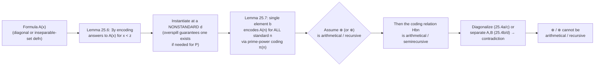
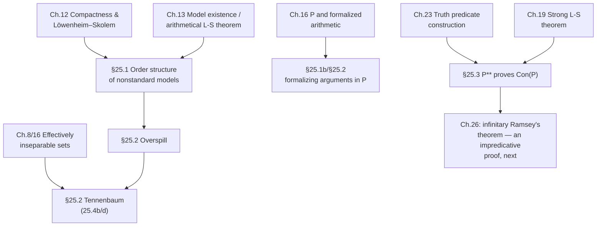

# Nonstandard Models of Arithmetic

[[book-guidelines|↩ Back to guidelines]]

## Why this chapter has to exist

Every earlier chapter of the book quietly assumes that when you write down a sentence like $\forall x\,\exists y\,(x < y)$ "about the natural numbers," there's exactly one structure you could mean: $\mathcal{N}$, the set $\{0,1,2,\dots\}$ with the usual $0, {}', <, +, \cdot$. [[Models-Isomorphism-and-Cardinality#The compactness theorem|The compactness theorem]] (Chapter 12) blows that assumption up. Add a fresh constant symbol $\infty$ to the language of arithmetic and consider the theory

$$\text{arithmetic} \cup \{\infty \neq 0, \infty \neq 0', \infty \neq 0'', \dots\}$$

Every finite subset of this is satisfiable in $\mathcal{N}$ itself (just interpret $\infty$ as some sufficiently large number). By compactness, the whole infinite theory is satisfiable — in some model $M$. But $M$ satisfies *every* true sentence of arithmetic, while also containing an element $\infty^M$ that isn't the denotation of any numeral. $M$ agrees with $\mathcal{N}$ on every first-order sentence you could ever write, yet $M \not\cong \mathcal{N}$.

This is not a curiosity to be filed away — it's a structural fact you have to reckon with any time you build a machine (a proof checker, a model-checker, a theorem prover) that reasons about "the natural numbers" purely by manipulating first-order sentences. First-order Peano-style induction is a *schema* — one axiom per formula $F(x)$ — not a single second-order statement quantifying over all subsets. That weakness is exactly the gap nonstandard models slip through. The book calls the general result a **model of (true) arithmetic**: any model of the full set of $L$-sentences true in the standard interpretation $\mathcal{N}$. A **nonstandard model** is one not isomorphic to $\mathcal{N}$.

This chapter asks three increasingly sharp questions about these otherwise-invisible imposters:

1. **What do they look like, structurally?** (§25.1 — order)
2. **Can a computer ever build one and compute with it faithfully?** (§25.2 — Tennenbaum's theorem)
3. **Does the same phenomenon strike one level up, at the level of sets of numbers?** (§25.3 — analysis and predicativity)

---

## 25.1 — The order structure of enumerable nonstandard models

### Setup: NUMBERS in small caps

Let $M$ be a nonstandard model of true arithmetic. Boolos–Burgess–Jeffrey adopt a typographic convention worth keeping, because it does real work: the *actual* natural numbers are written in lowercase (0, 1, 2, …), while the elements of $M$'s domain — which only *behave like* natural numbers from inside the model — are called **NUMBERS** and written in small caps. $M$ assigns:

- a NUMBER $O$ (ZERO) as the denotation of $0$,
- a function $\dagger$ (SUCCESSOR) as the denotation of $'$,
- a relation $\prec$ (LESS THAN) as the denotation of $<$,
- functions $\oplus, \otimes$ (ADDITION, MULTIPLICATION) as the denotations of $+, \cdot$.

The whole chapter's method is a single move, repeated: *observe a fact about ordinary numbers, note that it's expressed by a sentence of $L$ true in $\mathcal{N}$, conclude the same sentence is true in $M$ (since $M \models$ true arithmetic), then decipher what that sentence says about NUMBERS.* For instance, $\forall x \sim x < x$ is true in $\mathcal{N}$, hence true in $M$, hence no NUMBER is LESS THAN itself. Applied systematically, this shows $\prec$ is a linear order, ZERO is least, and every NUMBER is LESS THAN its SUCCESSOR with nothing between.

**What breaks without this technique:** you cannot inspect $M$ directly — it's an abstract model, possibly with an exotic domain. The only handle you have on its internal structure is *which sentences are true in it*, and by construction that's identical to which sentences are true in $\mathcal{N}$. Every single fact proved about $M$ in this chapter is smuggled in through this one door.

### Standard vs. nonstandard elements

Define $h(n) = O^{\dagger\cdots\dagger}$ ($n$ applications of $\dagger$) — the denotation in $M$ of the numeral $\underline{n}$. The **standard NUMBERS** are exactly the $h(n)$; everything else is **nonstandard**. A short argument (the sentence $\forall z(z\ne 0 \wedge \dots \wedge z \ne n \to n < z)$ is true in $\mathcal{N}$) shows every standard NUMBER is LESS THAN every nonstandard one — the standard part sits as an initial segment, order-isomorphic to $\mathbb{N}$ itself.

Nonstandard NUMBERS are guaranteed to exist in any nonstandard $M$: if they didn't, $h$ would be onto, and a short argument using the truth-in-$\mathcal{N}$-implies-truth-in-$M$ technique shows $h$ would then be an isomorphism $\mathcal{N} \cong M$ — contradicting nonstandardness.

### Blocks: the equivalence relation $\approx$

Define a predecessor-like operation $\ddagger$ (the "un-successor": $O^\ddagger = O$, and otherwise $m^\ddagger$ is the unique NUMBER whose SUCCESSOR is $m$), and then an equivalence relation:

$$a \approx b \iff \exists \text{ standard } c.\ (a \oplus c = b \ \text{or}\ b \oplus c = a)$$

Intuitively: $a \approx b$ iff you can walk from $a$ to $b$ using finitely many $\dagger$/$\ddagger$ steps — "finite distance apart." The equivalence class of $a$, its **block**, is

$$\{\dots, a^{\ddagger\ddagger\ddagger}, a^{\ddagger\ddagger}, a^\ddagger, a, a^\dagger, a^{\dagger\dagger}, a^{\dagger\dagger\dagger}, \dots\}$$

The standard NUMBERs form exactly one block (the standard block — the least block, since it's an initial segment). Every *nonstandard* block is infinite in both directions and order-isomorphic to $\mathbb{Z}$: no least element, no greatest, discretely ordered.

Three structural facts about how blocks sit relative to each other, each proved by the same true-in-$\mathcal{N}$-hence-true-in-$M$ technique plus arithmetic on $\oplus$:

- **No least nonstandard block.** Given nonstandard $b$, there's an $a \prec b$ with $a \oplus a = b$ or $a \oplus a \oplus I = b$ (the "halving" argument: every $b > 0$ has such an $a$ in $\mathcal{N}$). This $a$ is nonstandard and in a strictly lower block than $b$'s.
- **No greatest block**, symmetrically.
- **Density: between any two blocks lies a third.** Given block $A \prec$ block $C$, take an "average" $b$ (existing because averages, to within $\tfrac12$, always exist in $\mathcal{N}$) landing strictly between.

Putting this together: the blocks themselves form a **dense linear order without endpoints** — and by the back-and-forth argument from Chapter 12's problems, *any* countable dense linear order without endpoints is isomorphic to $(\mathbb{Q}, <)$. So:

**Theorem 25.1a.** *The order relations on any two enumerable nonstandard models of arithmetic are isomorphic* — to the fixed structure $K$: $\mathbb{N}$, followed by $\mathbb{Q}$-many $\mathbb{Z}$-blocks.

**Theorem 25.1b** extends this from models of *true* arithmetic to models of $P$ (Peano-style first-order arithmetic, Chapter 16): the proof is identical, except every "$S$ is true in $\mathcal{N}$" step is replaced by "$S$ is a theorem of $P$" — which requires *formalizing* the ordinary mathematical argument inside $P$ (a task the book had already done, in Chapter 16, for exactly the pieces needed here — e.g. the existence-of-averages fact).

<div align="center">

<svg viewBox="0 0 760 220" xmlns="http://www.w3.org/2000/svg" role="img" aria-label="Order structure of an enumerable nonstandard model: an initial segment isomorphic to N, followed by densely-ordered Z-blocks">
  <rect x="0" y="0" width="760" height="220" fill="none"/>
  <!-- standard segment -->
  <text x="10" y="24" font-family="sans-serif" font-size="14" fill="#8a8a8a">standard block (≅ ℕ)</text>
  <g stroke="#6b6b6b" stroke-width="2">
    <circle cx="20" cy="60" r="5" fill="#4a90d9"/>
    <circle cx="45" cy="60" r="5" fill="#4a90d9"/>
    <circle cx="70" cy="60" r="5" fill="#4a90d9"/>
    <circle cx="95" cy="60" r="4" fill="none"/>
    <circle cx="110" cy="60" r="4" fill="none"/>
    <circle cx="125" cy="60" r="4" fill="none"/>
    <line x1="20" y1="60" x2="130" y2="60"/>
  </g>
  <text x="0" y="80" font-family="sans-serif" font-size="12" fill="#8a8a8a">O  O†  O††  …</text>

  <!-- arrow into nonstandard region -->
  <line x1="150" y1="60" x2="740" y2="60" stroke="#6b6b6b" stroke-width="2" marker-end="url(#arrow)"/>
  <defs>
    <marker id="arrow" markerWidth="10" markerHeight="10" refX="8" refY="3" orient="auto" markerUnits="strokeWidth">
      <path d="M0,0 L0,6 L9,3 z" fill="#6b6b6b"/>
    </marker>
  </defs>

  <text x="330" y="100" font-family="sans-serif" font-size="14" fill="#8a8a8a">ℚ-many blocks, each ≅ ℤ, densely ordered, no endpoints</text>

  <!-- three representative Z-blocks -->
  <g font-family="sans-serif" font-size="11" fill="#8a8a8a">
    <g transform="translate(210,140)">
      <line x1="-60" y1="0" x2="60" y2="0" stroke="#c9822e" stroke-width="2"/>
      <circle cx="-40" cy="0" r="4" fill="#c9822e"/>
      <circle cx="-15" cy="0" r="4" fill="#c9822e"/>
      <circle cx="15" cy="0" r="4" fill="#c9822e"/>
      <circle cx="40" cy="0" r="4" fill="#c9822e"/>
      <text x="0" y="-10" text-anchor="middle">block A</text>
      <text x="0" y="22" text-anchor="middle">…a‡ a a† a††…</text>
    </g>
    <g transform="translate(420,175)">
      <line x1="-60" y1="0" x2="60" y2="0" stroke="#5cab6a" stroke-width="2"/>
      <circle cx="-40" cy="0" r="4" fill="#5cab6a"/>
      <circle cx="-15" cy="0" r="4" fill="#5cab6a"/>
      <circle cx="15" cy="0" r="4" fill="#5cab6a"/>
      <circle cx="40" cy="0" r="4" fill="#5cab6a"/>
      <text x="0" y="-10" text-anchor="middle">block B (between A and C)</text>
    </g>
    <g transform="translate(620,140)">
      <line x1="-60" y1="0" x2="60" y2="0" stroke="#c9482e" stroke-width="2"/>
      <circle cx="-40" cy="0" r="4" fill="#c9482e"/>
      <circle cx="-15" cy="0" r="4" fill="#c9482e"/>
      <circle cx="15" cy="0" r="4" fill="#c9482e"/>
      <circle cx="40" cy="0" r="4" fill="#c9482e"/>
      <text x="0" y="-10" text-anchor="middle">block C</text>
    </g>
  </g>
</svg>

</div>

### What computability *does* let you have (25.2 / 25.3)

Because this argument fixes the order type completely, the book immediately extracts a computability payoff:

**Corollary 25.2.** *There is a nonstandard model of arithmetic with domain $\mathbb{N}$ in which $\prec$ (and successor) is a **recursive** relation/function.* The proof transports the concretely-constructed recursive copy of $K$ back along the isomorphism $h$ guaranteed by Theorem 25.1a, using the same relabeling trick as the canonical-domains lemma (Corollary 12.6) from earlier in the book.

**Corollary 25.3** goes further, via the **arithmetical Löwenheim–Skolem theorem** (any axiomatizable theory with an infinite model has a model on domain $\mathbb{N}$ whose *every* nonlogical symbol is arithmetical): there's a nonstandard model of $P$ on domain $\mathbb{N}$ where $0, {}', <, +, \cdot$ are *all* arithmetical relations/functions.

So far, nonstandard models look computationally tame — order and successor can be made fully computable. That makes what comes next land as a genuine surprise.

**Lean/Rust/Python grounding.** The cleanest way to see the block structure is to notice it's exactly the *quotient construction* you'd reach for to build $\mathbb{Z}$ out of $\mathbb{N} \times \mathbb{N}$, run one level up. In Lean, `Int` is literally defined (up to the actual `Int.ofNat`/`Int.negSucc` encoding) as a quotient of pairs of naturals under "same difference"; the book's $\approx$ relation is doing the identical job — quotienting $M$'s domain by "same *finite* difference" — except the "whole" being quotiented, $M$, might itself be enormous and non-effective. A small illustrative Lean sketch of the idea (not a literal transcription of $M$, which can't be written down concretely as data):

```lean
-- The book's "block" relation, mirrored on a toy quotient.
-- (a, n) represents "a displaced by finite offset n"; this is exactly
-- the shape of Lean's own Int quotient, applied one level up.
def FiniteOffset (α : Type) := α × ℤ

def sameBlock (α : Type) (x y : FiniteOffset α) : Prop :=
  x.1 = y.1  -- same underlying nonstandard "anchor" element
```

Rust is the better fit for Corollary 25.2's *computational* content — actually building the recursive order $\prec$ on $\mathbb{N}$ that realizes the order type $K$ (a finite initial run, then $\mathbb{Q}$-indexed $\mathbb{Z}$-chains) is a concrete data-structure design problem: you need a computable pairing/ranking function from $\mathbb{N}$ onto $\{$standard tag$\} \cup (\mathbb{Q} \times \mathbb{Z})$ and a decidable comparison on it — precisely the kind of "encode a dense order as an efficiently comparable key" problem that shows up in, e.g., fractional-indexing schemes for collaborative editors.

---

## 25.2 — Tennenbaum's theorem and the overspill principle

Corollaries 25.2–25.3 showed order and successor *can* be recursive in a nonstandard model. Section 25.2's results are the opposite kind of statement, and they're much deeper:

> **25.4a.** No nonstandard model of true arithmetic on $\mathbb{N}$ has $\oplus$ **arithmetical**.
> **25.4b (Tennenbaum–Kreisel).** No nonstandard model of $P$ on $\mathbb{N}$ has $\oplus$ **recursive**.
> **25.4c.** No nonstandard model of true arithmetic on $\mathbb{N}$ has $\otimes$ **arithmetical**.
> **25.4d (Tennenbaum–McAloon).** No nonstandard model of $P$ on $\mathbb{N}$ has $\otimes$ **recursive**.

This is the chapter's headline result. **What breaks without it:** it says you cannot ever hand a computer a nonstandard model of arithmetic *as data* together with computable addition/multiplication procedures and have it be faithful to $P$'s axioms — any implementation of "$+$ over the naturals, satisfying Peano's axioms" that you can actually execute is secretly talking about the standard model, whether you intended that or not. Nonstandard models are real, but they are inherently *non-effective* objects at the level of arithmetic operations, even though (as §25.1 showed) their *order* can be made perfectly computable. Order alone doesn't leak enough information to build a "fake" arithmetic on top of it; $+$ and $\cdot$ do.

### The coding trick

Notation used throughout: $M \models F[a,b]$ abbreviates "elements $a, b$ satisfy $F$ in $M$." Write $\pi(n)$ for the $n$-th prime (0-indexed: $\pi(0)=2$), with a formula $\varrho(x,y)$ representing $\pi$ in $Q$ (hence in $P$/arithmetic, per §16.2), and $x \mid y$ for "$x$ divides $y$."

**Lemma 25.5a.** $M \models \forall x\, (m \cdot x = \underbrace{x + \cdots + x}_{m})$ for each standard $m>0$ — true in $\mathcal N$, hence in $M$.

**Lemma 25.6a.** For any formula $A(x)$, there's a *nonstandard* $d$ with

$$M \models \exists y\, \forall x{<}z\,(\exists w(\varrho(x,w) \wedge w \mid y) \leftrightarrow A(x))\ [d]$$

Proof idea: $\forall z\,\exists y\,\forall x{<}z(\dots)$ is true in $\mathcal N$ — for each finite bound $z$, just let $y$ be the product of the primes $\pi(x)$ for those $x<z$ with $A(x)$ true. Since it's true in $\mathcal N$, it's true in $M$, and it must hold in particular of *some* $d$ — and any $d$ witnessing it must be nonstandard (only a nonstandard $d$ can be "past" every standard bound in the intended sense used next).

**Lemma 25.7a (the punchline).** For any formula $A(x)$, there's a single NUMBER $b$ such that for *every* natural number $n$:

$$M \models A(\underline{n}) \iff \exists a.\ b = \underbrace{a \oplus \cdots \oplus a}_{\pi(n)}$$

This is Tennenbaum's central idea, stated plainly in the book: Lemma 25.6a says that for every (nonstandard) bound $z$ there's a $y$ encoding the yes/no answers to "$A(x)$?" for all $x < z$, via prime-power divisibility. Apply it at a *nonstandard* $d$: since every standard numeral is LESS THAN $d$, the resulting code $b$ secretly encodes the answer to $A(n)$ for **every** standard $n$ at once — infinitely much information, compressed into one element of $M$, by exploiting that $d$ outruns every finite bound. This single move — *one nonstandard element can carry infinite information via prime-power coding* — is what makes the whole family of theorems go through.

**Proof of Theorem 25.4a (diagonalization).** Suppose $\oplus$ *were* arithmetical. Then $f(a,n) = \underbrace{a \oplus \cdots \oplus a}_{n}$ is arithmetical (primitive recursion from $\oplus$), so is $g(a,n) = \underbrace{a \oplus \cdots \oplus a}_{\pi(n)}$ (composition with $\pi$), so is the relation $Hbn \iff \exists a.\, b = g(a,n)$ (existential quantification over an arithmetical graph). Let $B(x,y)$ arithmetically define $H$, and set $A(x) :\equiv {\sim}B(x,x)$ — a diagonal formula built *from* $H$'s own defining formula. Lemma 25.7a hands us a $b$ with: $M \models A(\underline n) \iff Hbn$ for every $n$. Since $M$ and $\mathcal N$ agree on all sentences, this transfers to $\mathcal N \models A(\underline n) \iff Hbn$. Instantiate $n := b$: $\mathcal N \models A(\underline b) \iff Hbb$, i.e. $\mathcal N \models {\sim}B(b,b) \iff Hbb$ — but $B$ *arithmetically defines* $H$, so also $\mathcal N \models B(b,b) \iff Hbb$. Contradiction. This is the liar/Cantor/Gödel diagonal pattern once more, now weaponized against the hypothesis "$\oplus$ is arithmetical."

### The overspill principle

Extending 25.4a to $P$ (25.4b) needs the lemmas re-derived with "true in $\mathcal N$" replaced by "provable in $P$" — routine but tedious for 25.5b/25.7b, except one step (25.6b) needs a genuinely new tool:

**Lemma 25.8 (Overspill).** *Let $M$ be a nonstandard model of $P$, and $B(x)$ a formula true of every standard element of $M$. Then $B(x)$ is also satisfied by some **nonstandard** element.*

*Proof.* Suppose not — every $d$ satisfying $B$ is standard. Then $d$ standard $\Rightarrow d^\dagger$ standard $\Rightarrow d^\dagger$ also satisfies $B$ (by the standing assumption). So $M \models \forall x (B(x) \to B(x'))$, and $M \models B(0)$ (0 is standard). By the induction axiom of $P$ for $B$: $M \models \forall x\, B(x)$ — *every* element satisfies $B$, contradicting that $B$ was only assumed true of the standard ones (there are nonstandard elements). $\square$

This is a beautifully compact use of the induction schema *turned against itself*: induction is normally how you prove something holds for **all** naturals from "holds at 0, propagates under successor." Here the same axiom is used as a diagnostic — if a property provably "overspills" past the standard elements once you have induction and it holds cofinally on the standard part, then it holds somewhere nonstandard too, because $P$ cannot see a boundary between "standard" and "not" (there is no formula of $L$ that carves out exactly the standard elements — if there were, its negation would violate this exact lemma). Overspill is the tool that gets Lemma 25.6b (the coding lemma, now needed for $P$ rather than true arithmetic) without formalizing the whole infinite-conjunction proof of 25.6a directly in $P$: it suffices to show the *finite* approximations $(1)$ — $\exists y\,\forall x{<}n(\dots)$ — are each individually theorems of $P$ (a purely finitary, combinatorial fact about disjunctions of the $2^n$ possible answer-patterns), then overspill promotes "true at every standard bound" to "true at some nonstandard bound."

**Theorem 25.4b** then follows by choosing $A, B$ *not* as an internal diagonal formula but as $\Delta$-rudimentary definitions of a concrete pair of **effectively inseparable** semirecursive sets (Chapter 8/16's construction: disjoint semirecursive $A, B \subseteq \mathbb{N}$ with no recursive set separating them). Lemma 25.7b produces $b^+, b^-$ coding, respectively, membership in $A^\*$ and its negation; if $\oplus$ were recursive, both $Y^+ = \{n : \exists a.\ b^+ = g(a,n)\}$ and its complement $Y^-$ would be semirecursive, forcing $Y^+$ recursive — but $Y^+ \supseteq A$ and $Y^+ \cap B = \emptyset$, contradicting inseparability. **Theorem 25.4c** is the multiplication analogue, using $x \downarrow y$ ("$y$ is a perfect $x$-th power") in place of divisibility and $2^y$ as a bridge between "$w \mid y$" and "$w \downarrow 2^y$" — the same coding architecture, ported from an additive to a multiplicative code.



**Rust grounding — this is the checker-shaped half of the chapter.** The proof of 25.4a is, structurally, a *reduction*: "if $\oplus$ were computable, I could build a decision procedure for something I already know is undecidable/non-arithmetical." That's exactly the shape of an undecidability reduction you'd write to show some checker-relevant problem (e.g. "does this Hoare-triple obligation reduce to a trivial one") is out of reach. A skeletal Rust sketch of the *reduction structure* (not a literal Tennenbaum implementation, which isn't executable since $M$ isn't effective — that's the whole point):

```rust
// The shape of Tennenbaum's reduction, abstracted:
// IF we had a computable `oplus` for a nonstandard model M,
// THEN we could decide membership in Y+, which we know is impossible
// because Y+ would have to separate two effectively inseparable sets.

fn nth_prime(n: u64) -> u64 { /* π(n) */ unimplemented!() }

// Hypothetical: addition in the nonstandard model, if computable.
fn oplus(a: u64, b: u64) -> u64 { unimplemented!() }

/// g(a, n) = a ⊕ a ⊕ ... ⊕ a, π(n) times — computable IF `oplus` is.
fn g(a: u64, n: u64) -> u64 {
    let reps = nth_prime(n);
    (0..reps).fold(0, |acc, _| oplus(acc, a))
}

/// H(b, n) := exists a. b == g(a, n) — semirecursive IF `oplus` is recursive.
/// Tennenbaum's theorem: this can never be assembled consistently with M
/// being a nonstandard model of P, because it would separate two
/// effectively inseparable semirecursive sets. So `oplus` above can never
/// actually be filled in for a real nonstandard M — it's an *existence
/// proof of an obstruction*, not a spec you can implement.
fn h(b: u64, n: u64, search_bound: u64) -> bool {
    (0..search_bound).any(|a| g(a, n) == b)
}
```

The point of writing it out in Rust is precisely to feel *why* it can't be filled in: `oplus` has no total, terminating, correct implementation once $M$ is required to be a genuine nonstandard model of $P$ — Tennenbaum's theorem is a proof that this function signature is uninhabited by anything both total and faithful.

**Lean grounding.** This is also the sharpest illustration in the whole chapter of a fact worth naming explicitly for anyone building a kernel or elaborator: Lean's `Nat` is *not* susceptible to this problem, but not because Lean is smarter than $P$ — it's because Lean's inductive type gives you a genuinely different (stronger) induction principle than $P$'s first-order schema. `Nat.rec`'s motive `C : Nat → Sort u` ranges over the type theory's own universe of predicates, which is a far richer collection than "one predicate per first-order formula of $L$." That extra strength is precisely what rules out nonstandard elements *inside Lean's Nat* — but it comes at the cost of living in a much stronger metatheory than $P$, and it says nothing about whether *Lean's own metatheory* (the system used to justify that `Nat.rec` is sound) itself has nonstandard models when viewed from outside. There is no level at which this problem is dissolved for good — only pushed up.

---

## 25.3 — Nonstandard models of analysis and predicativity

Section 25.3 is explicitly flagged in the book as a semi-independent appendix, moving from arithmetic to **analysis**: the two-sorted language $L^{**}$ that can talk about numbers *and* sets of numbers directly, rather than only through arithmetic coding.

### Two-sorted logic

$L^{**}$ has **lower variables** $x, y, z, \dots$ (numbers) and **upper variables** $X, Y, Z, \dots$ (sets), plus a new relation symbol $\in$ taking a lower argument then an upper one — so $x \in Y$ is atomic, but $x \in y$, $X \in Y$, $X \in y$ are not even well-formed. An interpretation has two domains; $\forall x$ ranges over the lower domain, $\forall X$ over the upper. Everything else (compactness, Löwenheim–Skolem, the isomorphism lemma) transfers unchanged, with the caveat that "enumerable" now requires *both* domains countable.

**Standard interpretation** $\mathcal N^{**}$: lower domain $= \mathbb N$ (as usual), upper domain $=$ *all* sets of naturals, $\in$ its literal meaning. **(True) analysis** $=$ the $L^{**}$-sentences true in $\mathcal N^{**}$.

Two useful restrictions on interpretations:

- **$\in$-model**: upper-domain elements really *are* sets of lower-domain elements, and $\in$ is genuine membership. (Any model of the extensionality axiom $\forall X\forall Y(\forall x(x\in X \leftrightarrow x \in Y) \to X=Y)$ is isomorphic to an $\in$-model, by collapsing each upper element $\alpha$ to $\{a : a \in^M \alpha\}$ — so restricting attention to $\in$-models loses no generality once extensionality is assumed.)
- **$\omega$-model**: an $\in$-model whose *lower part* (its $L^{*}$-reduct) is standard, i.e. isomorphic to $\mathcal N^{*}$.

**Proposition 25.9.** Both kinds of nonstandard model of analysis exist: (a) one with a *nonstandard lower part* — same $\infty$-constant compactness trick as before, now run over analysis; (b) a nonstandard **$\omega$-model** — take an enumerable elementary substructure of $\mathcal N^{**}$ via [[Normal-Forms-and-Elimination-Techniques#The strong Löwenheim–Skolem theorem|the strong Löwenheim–Skolem theorem]] (Chapter 19); it must be an $\omega$-model (its lower part, being a substructure of $\mathcal N^*$ with the same theory, is standard) but can't be isomorphic to the full standard model, whose upper domain is uncountable and hence can't match a countable one.

So nonstandardness at the level of analysis can come from *either* direction: exotic numbers, or an incomplete (but numerically faithful) collection of "sets."

### Axiomatic and predicative analysis

$P^{**}$ ("axiomatic analysis") axiomatizes $L^{**}$ with:

- **(0)** the finitely many axioms of $Q$,
- **(1\*)** induction: $\forall X(0\in X \wedge \forall x(x\in X \to x'\in X) \to \forall x\, x\in X)$ — now a *single second-order-flavored sentence* quantifying over all of $X$'s upper domain, not a schema,
- **(2)** extensionality,
- **(3)** comprehension: for every $L^{*}$-formula $F(x)$, $\exists X\,\forall x(x\in X \leftrightarrow F(x))$ — "every definable condition on numbers determines a set."

Since $(1)$ (ordinary $P$-induction for a given $F$) follows from $(1^*)+(3)$, every $P$-theorem is a $P^{**}$-theorem, and the lower part of any $P^{**}$-model is a $P$-model. Call a $P$-model **expandable** if it *is* such a lower part.

**Proposition 25.10.** Not every model of $P$ is expandable to a model of $P^{**}$. Sketch: let $A$ be $P$'s consistency sentence (or Gödel/Rosser sentence) — not a $P$-theorem, so $P \cup \{{\sim}A\}$ has a model. That model can't expand, because **$P^{**}$ proves $A$**: comprehension lets you form the set coded by "sentences of $L^*$ true in the lower part" (the $L^{**}$-formula $F(X)$ from Chapter 23's truth-definition construction), abbreviate $\mathrm{True}(x) :\equiv \exists X(F(X)\wedge x \in X)$, and formalize the naive soundness argument ("every axiom is true, truth is deduction-closed, $0{=}1$ isn't true, so $P \nvdash 0{=}1$") using that single formalized truth predicate. Terminology: $P^{**}$ is therefore **not a conservative extension** of $P$ — it proves strictly more $L^*$-sentences than $P$ does (a two-sorted theory $T_2 \supseteq T_1$ is *conservative* if every $L_1$-theorem of $T_2$ is already a $T_1$-theorem).

The culprit is comprehension applied to a formula $F(X)$ with a **bound upper variable** — an *impredicative* specification: a set defined by a condition that quantifies over "all sets" (including, circularly, the very set being defined). $\mathrm{True}(x)$ is built exactly this way. **Predicative analysis** $P^+$ forbids this: comprehension is restricted to formulas with no bound upper variables (free upper parameters $U, V, \dots$ are still allowed). The book flags that impredicative specification is *not* some exotic edge case — it's implicit in ordinary inductive definitions: defining $S = S_0 \cup S_1 \cup \cdots$ where membership in $S_{i+1}$ depends on $S_i$ unrolls into "$\exists$ a finite sequence of sets $U_0,\dots,U_n$ such that…", and eliminating the "finite sequence of sets" quantifier in favor of a single "$\exists$ a set" quantifier reintroduces exactly the offending pattern.

**Proposition 25.11.** $P^+$ *is* a conservative extension of $P$ — every $P$-model expands to a $P^+$-model. Proof idea: given $M \models P$, take as the upper domain all **parametrically definable** subsets of $|M|$ — sets of the form $\{b : M \models F[b, a_1,\dots,a_m]\}$ for some $L^*$-formula $F$ and parameters $\vec a$ — with $\in$ as literal membership. Comprehension for a predicative $F$ (upper variables only free, never bound) then reduces to a purely syntactic substitution argument: any parametrically-definable $U_i$'s defining formula $G_i$ can be substituted in for occurrences of $U_i(w)$ inside $F$, producing a single new $L^*$-formula $H$ that parametrically defines the required witness set $T$. No genuine appeal to "all sets" is needed anywhere in the construction — which is exactly why it costs nothing beyond $P$ itself.

**Lean/type-theory grounding — this is where the chapter's material is most directly load-bearing for anyone thinking about kernels.** The predicative/impredicative distinction the book draws for $P^+$ vs. $P^{**}$ is *the same axis* that separates Lean's (and Coq's) `Prop`/`Type` universes. Lean's `Prop` is **impredicative**: `∀ (X : Prop), F X` is itself a `Prop`, quantifying over a universe that includes itself — exactly comprehension-(3)'s "$\exists X \forall x(x \in X \leftrightarrow F(x))$" shape, where $F$ may itself quantify over all $X$. Lean's `Type u` universes, by contrast, are **predicative** — `Type u` cannot be an element of its own quantification without bumping to `Type (u+1)`; this is precisely $P^+$'s discipline of "no bound upper variables of the same or higher sort inside the defining formula." Two consequences the book's Proposition 25.10/25.11 make vivid: (1) an impredicative comprehension principle can prove things a predicative one provably cannot (here, consistency of the base theory) — which is the model-theoretic mirror of why `Prop`'s impredicativity is powerful (it's what lets you encode `And`, `Exists`, and general inductive-in-Prop constructions compactly) but also delicate; (2) Proposition 25.11's parametric-definability trick — build the "upper domain" *after the fact*, purely from what's already expressible in the base language — is structurally the same move as an elaborator restricting itself to *definitionally* eliminable constructs rather than assuming a genuinely new universe of "arbitrary propositions" exists.

```python
# Illustrative only: a *predicative* comprehension-style set builder.
# Every "upper" set here is defined purely from lower-domain data and a
# first-order-style predicate — no set quantifies over "all sets" (itself
# included) the way P**'s True(x) does. This is the P+ discipline.

def parametrically_definable_subset(domain, predicate, *params):
    """predicate(b, *params) -> bool, referring only to lower-domain
    elements — never to 'the collection of all definable subsets'."""
    return {b for b in domain if predicate(b, *params)}

# An IMPREDICATIVE analogue (P**-style) would instead need something like:
#   True = {n for n in domain if n codes a sentence true of ALL subsets S
#           in some collection that True itself is a member of}
# which cannot be phrased this way without already assuming the full
# upper domain exists.
```

---

## Where this leads

Chapter 25 sits at a hinge point in the book's second half. Structurally:



The very next chapter leans directly on §25.3's predicativity vocabulary — the book flags in passing that the "infinitary Ramsey's theorem" it proves next is a textbook example of a theorem provable in $P^{**}$ but *not* formalizable in $P^+$.

A note worth being honest about rather than stretching: this chapter is largely orthogonal to a Rust verifier or a Miller-pattern-style Lean elaborator as *implementation targets* — you will not literally build a nonstandard model. Where it *does* bear directly on that work is conceptual, and it's worth stating plainly rather than gesturing at it: **Tennenbaum's theorem is the formal reason a proof checker built from first-order axioms cannot "know" it's reasoning about the standard natural numbers.** Any kernel that checks $P$-style induction proofs is, from the outside, equally consistent with every nonstandard model of $P$ simultaneously — its symbol-pushing can never distinguish them, precisely because (25.4a–d) any *computable* witness to a difference would itself become the undecidable oracle the diagonal argument rules out. The one way out, illustrated by §25.3's predicative/impredicative axis, is to strengthen the induction principle itself past what a first-order schema can state — which is exactly what an inductive type's eliminator (`Nat.rec`) does, at the cost of moving the same question up one level, to the metatheory that justifies the eliminator's soundness.
