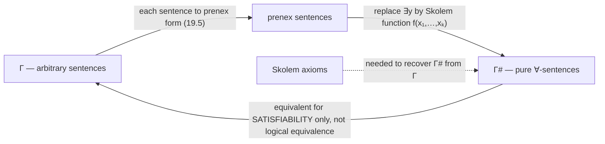
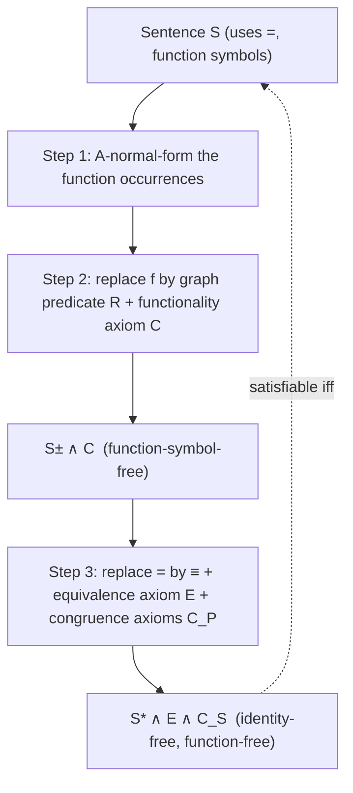

# Normal Forms and Elimination Techniques

[[book-guidelines|↩ Back to guidelines]]

## Why normal forms at all

Every automated reasoner faces the same problem a compiler faces: the input language is far richer than the language the back end actually knows how to process. A compiler solves this with a pipeline of desugaring passes — `for` loops become `while` loops, pattern matches become decision trees, closures become explicit environment structs — each pass provably preserving the meaning of the program while shrinking the grammar the next pass has to handle. First-order logic needs exactly the same thing before you can search for proofs or models mechanically. A raw formula can nest quantifiers and connectives in arbitrarily many ways; a proof-search procedure that had to handle every possible nesting directly would be unmanageably complex. Chapter 19 of Boolos, Burgess, and Jeffrey is the logical analogue of a compiler's front-end normalization pipeline: a sequence of *normal form theorems*, each one saying "every formula (or every set of sentences) is equivalent to one in this restricted shape," with an accompanying constructive procedure for producing that shape.

Crucially, the book distinguishes two different notions of "equivalent" that these passes preserve, and the distinction matters as much as it does in compiler correctness proofs:

- **[[Metalogical-Notions#Logical equivalence|Logical equivalence]]** ($A \dashv\vdash A^*$): $A$ and $A^*$ have exactly the same truth value in *every* interpretation. This is the strong guarantee — like an optimization pass that provably doesn't change program behavior.
- **Equivalence for satisfiability**: $\Gamma$ and $\Gamma^*$ are either *both* satisfiable or *both* unsatisfiable, but individual sentences in $\Gamma^*$ need not be logically equivalent to anything in $\Gamma$ — the new set may even mention new nonlogical symbols. This is weaker, more like a program transformation that's only guaranteed to preserve "does this program terminate/crash," not full observational equivalence.

The prenex and disjunctive normal form results (§19.1) use the strong, logical-equivalence notion. Skolemization (§19.2) and the function/identity elimination results (§19.4) use the weaker satisfiability-preserving notion — and understanding *why* that weakening is necessary, and exactly what extra machinery (the Skolem axioms) is needed to claw back an implication in the other direction, is the technical heart of the chapter.

## What breaks without normal forms

If you tried to write a resolution-style or tableau-style theorem prover directly on arbitrary first-order formulas — quantifiers freely interleaved with $\land, \lor, \lnot$ in any pattern — every inference rule would need special-case logic for every possible local shape of subformula. Real provers instead run a fixed pipeline: convert to negation normal form, then prenex, then Skolemize away the existentials, then work purely with $\forall$-formulas over quantifier-free matrices (clauses). Each step is a compiler pass with its own correctness obligation. This chapter proves those obligations one at a time.

---

## 19.1 Prenex and disjunctive normal form: pushing structure to the edges

### Negation-normal form

The first pass is the simplest: push $\lnot$ all the way down to the leaves. A formula is **negation-normal** if it's built from atomic and negated-atomic formulas using only $\lor, \land, \exists, \forall$ — no other occurrences of $\lnot$.

**Proposition 19.1.** Every formula is logically equivalent to a negation-normal one.

The proof is induction on complexity, and it is literally the algorithm: rewrite $\lnot(B \lor C)$ as $\lnot B \land \lnot C$ (De Morgan), $\lnot(B \land C)$ as $\lnot B \lor \lnot C$, $\lnot\lnot B$ as $B$, $\lnot\exists x\,B$ as $\forall x\,\lnot B$, and $\lnot\forall x\,B$ as $\exists x\,\lnot B$, recursively. This is exactly the structure of a recursive-descent AST rewrite pass.

```rust
// A minimal formula AST — negation is a first-class node so we can
// eliminate it structurally, mirroring the book's induction.
#[derive(Clone, Debug)]
enum Formula {
    Atom(String, Vec<Term>),
    Not(Box<Formula>),
    And(Box<Formula>, Box<Formula>),
    Or(Box<Formula>, Box<Formula>),
    ForAll(String, Box<Formula>),
    Exists(String, Box<Formula>),
}

fn negation_normal(f: Formula) -> Formula {
    use Formula::*;
    match f {
        Atom(..) => f,
        Not(inner) => match *inner {
            Atom(..) => Not(inner),                       // base case: leave ~atomic alone
            Not(g) => negation_normal(*g),                 // ~~B -> B
            And(b, c) => Or(                                // ~(B & C) -> ~B v ~C
                Box::new(negation_normal(Not(b))),
                Box::new(negation_normal(Not(c))),
            ),
            Or(b, c) => And(                                // ~(B v C) -> ~B & ~C
                Box::new(negation_normal(Not(b))),
                Box::new(negation_normal(Not(c))),
            ),
            Exists(x, b) => ForAll(x, Box::new(negation_normal(Not(b)))), // ~Ex B -> Ax ~B
            ForAll(x, b) => Exists(x, Box::new(negation_normal(Not(b)))), // ~Ax B -> Ex ~B
        },
        And(b, c) => And(Box::new(negation_normal(*b)), Box::new(negation_normal(*c))),
        Or(b, c) => Or(Box::new(negation_normal(*b)), Box::new(negation_normal(*c))),
        ForAll(x, b) => ForAll(x, Box::new(negation_normal(*b))),
        Exists(x, b) => Exists(x, Box::new(negation_normal(*b))),
    }
}
```

Note the book's own worked example (Ex. p. 244): $\lnot(P \lor (\lnot Q \land R))$ successively becomes $\lnot P \land \lnot(\lnot Q \land R)$, then $\lnot P \land (\lnot\lnot Q \lor \lnot R)$, then $\lnot P \land (Q \lor \lnot R)$ — precisely the trace this function would produce.

### Disjunctive and full disjunctive normal form

Once negation is pinned to the leaves, apply the distributive laws — $(B \land (C \lor D)) \dashv\vdash ((B\land C) \lor (B \land D))$ and its dual — to "push conjunction inside, pull disjunction outside." The result is **disjunctive normal form**: a disjunction of conjunctions of literals (atomic formulas or their negations).

**Theorem 19.3 (Full disjunctive normal form).** Every truth-functional compound of given formulas $A_1,\ldots,A_n$ is logically equivalent to one in *full* disjunctive normal form: a disjunction of conjunctions in which every $A_i$ appears exactly once, plain or negated, in every disjunct.

This is exactly a truth table read off as a formula: each row where the compound is true contributes one conjunct-of-literals disjunct, and idempotence/absorption/contradiction laws ($B \land B \dashv\vdash B$, $B \land \lnot B \dashv\vdash \bot$, $\bot \lor D \dashv\vdash D$) clean up redundant or impossible rows. The book introduces the 0-place connectives $\top$ (constant truth) and $\bot$ (constant falsehood) for exactly this bookkeeping — the empty disjunction is $\bot$, the empty conjunction is $\top$, by the same convention that an empty sum is $0$ and an empty product is $1$.

**What breaks without this:** full DNF is the semantic ground truth of a truth-functional compound — it's literally "the set of satisfying rows, spelled out as a formula." Any SAT-solver-adjacent reasoning (and Herbrand's theorem later in this chapter) depends on being able to treat quantifier-free formulas as truth-functional objects with this clean row-based structure.

### Prenex normal form

The second axis of normalization pulls *quantifiers* out to the front, leaving a quantifier-free **matrix** behind:
$$Q_1x_1\,Q_2x_2\,\ldots\,Q_nx_n\,B$$
where each $Q_i \in \{\exists, \forall\}$ (the **prefix**) and $B$ (the **matrix**) is quantifier-free.

**Theorem 19.5 (Prenex normal form).** Every formula is logically equivalent to one in prenex form.

The proof (induction on complexity again) uses the fact that $Qx\,A(x) \mathbin{\S} B \dashv\vdash Qx\,(A(x) \mathbin{\S} B)$ when $x$ doesn't occur free in $B$ ($\S \in \{\land, \lor\}$) — after first *relettering bound variables* so no two conjuncts/disjuncts share a variable name. That relettering step is exactly alpha-renaming in a compiler's IR: you cannot hoist a binder past another expression if doing so would let its bound variable accidentally capture something. The book's own worked example (Example 19.4, $\forall x\,Fx \leftrightarrow Ga$) shows that the order in which you pull quantifiers out is a genuine *choice point* — different orders give different (but equivalent) prenex forms, exactly as different evaluation orders of independent hoistable subexpressions give different but equivalent compiler IR.

```rust
// Prenex conversion sketch: after negation_normal, repeatedly float
// the outermost quantifier of a subformula up past a & or v, after
// alpha-renaming to avoid capture. This is structurally identical to
// hoisting a `let` past a sibling expression in an IR lowering pass.
fn prenex(f: Formula, fresh: &mut impl FnMut() -> String) -> Formula {
    // 1. negation_normal(f) first (assumed already applied)
    // 2. recursively prenex both sides of And/Or
    // 3. alpha-rename so left and right prefixes share no variable
    // 4. float quantifiers: Qx A(x) & B  ~>  Qx (A(x) & B), etc.
    todo!("mechanical, but the load-bearing step is #3 — capture-avoidance")
}
```

---

## 19.2 Skolem normal form: trading existentials for functions

### The construction

A prenex formula with *only* universal quantifiers is a **$\forall$-formula**; one with only existentials is an **$\exists$-formula**. Skolemization converts an arbitrary prenex sentence into a $\forall$-formula by replacing each existentially quantified variable with a fresh function symbol applied to the universal variables to its left. The book's running example:
$$\forall x_1\,\exists y_1\,\forall x_2\,\exists y_2\; R(x_1,y_1,x_2,y_2) \quad\rightsquigarrow\quad \forall x_1\,\forall x_2\; R\bigl(x_1,\, f_1(x_1),\, x_2,\, f_2(x_1,x_2)\bigr)$$

$f_1, f_2$ are the **Skolem function symbols**. The intuitive reading: "for every $x_1$ there exists a $y_1$" becomes "there is *some function* $f_1$ that, given $x_1$, computes a witnessing $y_1$." This is choice made explicit and total — you're not just asserting a witness exists, you're naming a function that produces one uniformly.

**This is exactly what your elaborator's metavariable-solving machinery does when it turns an existential proof obligation into a function it must synthesize.** Skolemization is choice-reification: replacing "a witness exists (possibly depending on prior universals)" with "here is a concrete (possibly-uninterpreted) function computing that witness." A pattern-unification-style elaborator resolving an implicit argument that depends on earlier binders is doing the same move — introducing a metavariable applied to the enclosing context's variables, exactly mirroring $f_i(x_1,\ldots,x_k)$.

### Why only one direction holds, and what closes the gap

The Skolem form (2) *logically implies* the original (1) — trivially, since exhibiting a specific witnessing function proves existence. But the converse fails in general: knowing witnesses exist doesn't hand you a definable function computing them uniformly. What recovers the missing direction is the **Skolem axioms** — conditionals like
$$\forall x_1\Bigl(\exists y_1\,\forall x_2\,\exists y_2\,R(x_1,y_1,x_2,y_2) \to \forall x_2\,\exists y_2\,R(x_1,f_1(x_1),x_2,y_2)\Bigr)$$
which say, roughly, "*if* a witness exists at all, $f_1$ produces one." Original sentence + Skolem axioms $\Rightarrow$ Skolem form.

**What breaks without the Skolem axioms:** you cannot treat "$\Gamma$" and "$\Gamma$'s Skolem form" as *logically* equivalent — only as equivalent for *satisfiability*. This is the crux of why Skolemization is a weaker transformation than prenexing: it changes the language (adds function symbols) and only preserves the satisfiable/unsatisfiable dichotomy, not truth-value-by-truth-value equivalence.

**Lemma 19.6 (Skolemization Lemma).** Every interpretation $M$ of $L$ has an expansion to a **Skolem expansion** — an interpretation of the extended language $L^+$ that satisfies the Skolem axioms. The proof invokes the **axiom of choice** directly: given $M$, for each $a_1$ let $B_1$ be the set of witnesses satisfying the inner formula; a choice function $\varepsilon$ picks $f_1^N(a_1) = \varepsilon(B_1)$ (or an arbitrary default if $B_1$ is empty). This is choice used exactly as advertised — not as an abstract axiom but as literally the mechanism that manufactures the Skolem function's denotation.

Putting the pieces together: for any $\Gamma$, replace each sentence by its prenex form, then its Skolem form, to get $\Gamma^\#$, a set of pure $\forall$-sentences. $\Gamma$ and $\Gamma^\#$ are equivalent for satisfiability — $\Gamma^\#$ satisfiable $\Rightarrow$ (Skolem form implies original) $\Gamma$ satisfiable; $\Gamma$ satisfiable $\Rightarrow$ (Skolemization Lemma gives a Skolem expansion, and original + Skolem axioms implies Skolem form) $\Gamma^\#$ satisfiable.



### The strong Löwenheim–Skolem theorem

Skolem normal form is not just cosmetic — it's the engine behind a genuinely sharper theorem than the version proved earlier in the book by the term-model construction (Ch. 13).

First, the notion of **subinterpretation**: $B$ is a subinterpretation of $A$ if $|B| \subseteq |A|$, predicates and constants agree on $|B|$ (conditions S1–S2), and — crucially, once function symbols are in play — $|B|$ is *closed under* the functions of $A$ (condition S3): $f^B(b_1,\ldots,b_n) = f^A(b_1,\ldots,b_n)$ must again lie in $|B|$. This closure requirement is exactly the "well-formedness" condition a type checker enforces on a sub-context: you can't just take an arbitrary subset of terms/values and call it a valid sub-model — it has to be closed under every operation the signature provides, just as a valid typing context must be closed under whatever formation rules apply within it.

**Proposition 19.7.** Every $\forall$-sentence true in $A$ remains true in any subinterpretation $B$. (Quantifier-free truth transfers by induction on term/formula complexity via S1–S3; then $\forall$ only *restricts* further, so it survives shrinking the domain. $\exists$-truth, by contrast, is *not* guaranteed to transfer down — Example 19.8 shows $\forall x\forall y\exists z(x<y \to (x<z\land z<y))$, "density," holds for $\mathbb{Q}$ and $\mathbb{R}$ but fails for the sub-domain $\mathbb{Z}$: there's no integer strictly between $0$ and $1$.)

**Theorem 19.9 (Strong Löwenheim–Skolem theorem).** If a nonenumerable interpretation $A$ models an enumerable set $\Gamma$, then $A$ has an *enumerable* subinterpretation that is also a model of $\Gamma$.

*Proof sketch:* reduce to the $\forall$-sentence case via Skolemization (any model of $\Gamma$ expands to a model of $\Gamma^\#$; find an enumerable submodel of $\Gamma^\#$ by 19.7; its reduct models $\Gamma$ by the Skolem-form-implies-original direction). For $\forall$-sentences directly: take $B$ = the set of denotations of *closed terms* — enumerable since the language is, closed under the functions by construction, and hence a legitimate subinterpretation on which every $\forall$-sentence of $A$ survives by 19.7.

This is the **term model** idea again, but now doing double duty: instead of building a witness-saturated model from scratch (Ch. 13's Henkin construction), you carve an enumerable submodel *out of* an existing possibly-huge model, using exactly the machinery — closed terms as domain elements — that a term-rewriting or normal-form-based interpreter already relies on.

### Skolem's paradox

Example 19.10 works through the famous puzzle directly. Consider a language with $\in$, a pairing function symbol $J$, and predicates $N$ ("is a natural number") and $S$ ("is a set of naturals"). The sentence $\lnot\exists w\,F(w)$ — where $F(w)$ says "$w$ is a set that *codes* an enumeration of every set in $S$'s extension" — is true in the **standard interpretation** $\mathcal{J}$ (whose domain contains *all* sets of naturals), and there it genuinely means "nonenumerably many sets of naturals exist," since no enumerator-set for all of them can exist.

By the strong Löwenheim–Skolem theorem, $\mathcal{J}$ has an *enumerable* subinterpretation $K$ in which the very same sentence $\lnot\exists w\,F(w)$ is still true. So $K$ has only countably many sets in its domain, yet satisfies a sentence that "says" uncountably many exist. That's Skolem's paradox.

**The resolution is the load-bearing insight, and it generalizes far beyond set theory:** the sentence *has* an enumerator for the sets-of-naturals in $K$'s domain (since that domain is countable) — but that enumerator itself is *not a member of $K$'s domain*. Quantifiers only range over what's actually in the domain being quantified over. "Nonenumerably many sets exist" is not an intrinsic property of the string of symbols $\lnot\exists w\,F(w)$; it's a claim about *what the quantifiers range over*, which is a fact about the interpretation, not the syntax. Interpreted over $K$, the very same formula says something true but much weaker: "$K$'s domain contains no enumerator of $K$'s own sets" — which is simply true, and not paradoxical at all.

**What this teaches about model-relative semantics, directly relevant to a verifier:** a specification sentence's *meaning* is never fixed by its syntax alone — it's fixed by syntax *plus* the domain of quantification the checker is running against. A soundness proof for your Rust verifier needs to be explicit, the same way this section is, about exactly which domain/model quantifiers in a Hoare-triple specification range over — "for all states" means something different depending on whether "state" ranges over a small finite abstraction or the full concrete state space, and conflating the two is precisely the mistake Skolem's paradox warns against.

---

## 19.3 Herbrand's theorem: from models to truth tables

This optional section (independent of 19.4, building on 19.2) gives a second, more *combinatorial* route to compactness and completeness — one that trades "does a model exist" for "is some finite truth table satisfiable," which is directly implementable, unlike an abstract existence claim.

### Truth-functional valuation and satisfiability

A **valuation** $\omega$ assigns each of a stock of atomic sentences $A_1,\ldots$ a truth value, extended to quantifier-free compounds by the ordinary truth tables. A set of quantifier-free sentences is **truth-functionally satisfiable** if some valuation makes them all true. This is literally SAT over propositional atoms — and the book proves the two notions of satisfiability (via an interpretation, vs. via a valuation) coincide for quantifier-free sentences: given any $\omega$, build an interpretation whose domain is (isomorphic to) the syntactic closed terms themselves, denoting each term as itself, and reading predicate truth directly off $\omega$. This is the **Herbrand universe / term model** construction, and it's exactly the trick behind Prolog-style resolution provers: instead of searching over an abstract space of possible models, you search over syntactic instantiations of terms in the language itself.

### The theorem

**Theorem 19.11 (Herbrand's theorem).** Let $\Gamma$ be a set of $\forall$-sentences, and let $\Delta$ be the set of all substitution instances $P(t_1,\ldots,t_n)$ obtained by instantiating the universally quantified variables of sentences in $\Gamma$ with closed terms $t_1,\ldots,t_n$ of the language. Then $\Gamma$ is satisfiable **iff every finite subset of $\Delta$ is truth-functionally satisfiable.**

This is a genuinely powerful reduction: an infinitary, semantic question ("does a model exist?") collapses to an *effectively checkable, finite, purely propositional* question at every finite stage — the only remaining infinitude is *how many* finite subsets you might have to check, which is where completeness (not decidability!) comes from.

**Proof shape:** ($\Leftarrow$) if every finite subset of $\Delta$ is truth-functionally satisfiable, then (by ordinary compactness) $\Delta$ itself is satisfiable — build a term model $B$ from any model of $\Delta$ (Prop. 12.7-style subinterpretation carving), where every domain element is a term-denotation, so truth of every instance forces truth of the universally quantified original. ($\Rightarrow$) trivial — a sentence implies all its instances.

Herbrand's theorem can also be proved *without* appealing to ordinary compactness, using an easier "compactness for valuations" fact, and — pleasingly — it then runs the derivation in reverse to *reprove* ordinary compactness (via Skolemization: reduce $\Gamma$ to $\Gamma^\#$, apply Herbrand to the $\forall$-sentences in $\Gamma^\#$).

### The refutation procedure — a mechanical proof search

The chapter closes 19.3 by sketching an actual algorithm, and this is the piece most directly transferable to a Rust prover's search loop:

1. Skolemize $\Gamma$ to get finitely many $\forall$-sentences $S_1,\ldots,S_n$.
2. Enumerate closed terms $t_1, t_2, t_3, \ldots$ effectively.
3. Generate substitution instances in increasing "depth" batches (first substitute $t_1$ everywhere, then $\{t_1,t_2\}$-combinations, etc. — at stage $m$, exactly $k^m$ instances for $k$ total variables).
4. After each batch, truth-table-check whether the instances generated *so far* are truth-functionally satisfiable (finitely many atoms $\Rightarrow$ finitely many valuations to try — $2^m$ for $m$ distinct atoms).
5. If some finite batch is truth-functionally *un*satisfiable, halt: $\Gamma$ is unsatisfiable, and that batch is a **refutation**.

This terminates with a correct answer *whenever $\Gamma$ is unsatisfiable* (soundness + completeness of the procedure), but may run forever if $\Gamma$ is satisfiable — which is exactly the semi-decidability signature you'd expect from Church's theorem (undecidability of validity), covered elsewhere in the book. This is, essentially, unit propagation plus systematic term enumeration — a primitive ancestor of the instantiation loops inside real SMT solvers (E-matching, trigger-based quantifier instantiation) and of Prolog's SLD-resolution search. If you're building a Rust automated prover, this refutation procedure — Skolemize, enumerate ground instances, run a SAT check on each growing batch — is close to the simplest correct proof-search loop you could implement, and it's worth prototyping directly before reaching for anything fancier.

```rust
// Skeleton of the Herbrand refutation loop — depth-bounded ground
// instantiation feeding an incremental SAT check. A real implementation
// would swap `all_valuations_satisfy` for a proper (incremental) SAT
// solver rather than brute-force enumeration.
struct HerbrandSearch {
    skolem_forms: Vec<Formula>,   // pure ∀-sentences, S_1..S_n
    terms: TermEnumerator,        // effective enumeration t_1, t_2, ...
    instances: Vec<Formula>,      // quantifier-free instances generated so far
}

impl HerbrandSearch {
    fn step(&mut self) -> SearchResult {
        let batch = self.next_instantiation_batch(); // depth-m substitutions
        self.instances.extend(batch);
        if !truth_functionally_satisfiable(&self.instances) {
            SearchResult::Refuted(self.instances.clone()) // Γ is unsatisfiable
        } else {
            SearchResult::Continue // no verdict yet — Γ may or may not be satisfiable
        }
    }
}
```

---

## 19.4 Eliminating function symbols and identity

The final section is independent of 19.2/19.3 and answers a different question: can we get rid of function symbols and `=` entirely, at the cost (again) of only satisfiability-preservation rather than logical equivalence? Yes — and the two eliminations later power the Craig interpolation theorem (Ch. 20) and undecidability results for restricted-arity logics (Ch. 21), which explicitly build on *this section's* machinery.

### Function symbols → a graph predicate

Step 1 (normalize occurrence position): any sentence is equivalent to one where every occurrence of a function symbol $f$ is immediately to the right of `=`, i.e. every occurrence is of the shape $v = f(u_1,\ldots,u_n)$. Proof: repeatedly replace $A(t)$ (an atomic subformula containing a "buried" occurrence of $f$-headed term $t$) with $\exists v\,(v = t \land A(v))$ for fresh $v$ — this is exactly **A-normal form conversion** in compiler terms: hoisting every non-trivial subexpression into its own named binding before use, so that no compound expression appears nested inside another position. If you've implemented ANF or SSA lowering, you've implemented this step already.

Step 2 (eliminate $f$ itself): introduce a fresh $(n{+}1)$-place predicate $R$ standing in for "$f$'s graph" — $R(x_1,\ldots,x_n,y)$ means "$f(x_1,\ldots,x_n) = y$." Replace every $v = f(u_1,\ldots,u_n)$ with $R(u_1,\ldots,u_n,v)$, giving $S^{\pm}$. This alone loses information — $R$ could be interpreted as a relation that isn't functional (missing or multi-valued outputs) — so we add the **functionality axiom**
$$C:\quad \forall x_1\ldots\forall x_n\,\exists y\,\forall z\,\bigl(R(x_1,\ldots,x_n,z) \leftrightarrow z=y\bigr)$$
which forces $R$ to behave like a total function's graph (exactly the axiom that would let you *recover* a function from a relation, i.e. "$R$ is total and single-valued").

**Proposition 19.12.** $S$ is satisfiable iff $S^{\pm} \land C$ is satisfiable.

*Proof idea:* any model of $S$ extends *uniquely* to a model of the "auxiliary axiom" $D$ (defining $R$ literally as $f$'s graph); any model of $S^{\pm}\land C$ extends *uniquely* to a model of $D$ (define $f$ as the unique $b$ with $R(a_1,\ldots,a_n,b)$ — functionality guarantees existence and uniqueness). Since $D$ implies both $C$ and $S \leftrightarrow S^{\pm}$, the two directions round-trip.

This "replace a function with its graph relation plus a totality/functionality constraint" move is precisely what you do when lowering a pure function into a relational or SSA/dataflow representation for analysis — e.g. representing a function call as a relation between argument and return registers plus a side constraint that the relation is deterministic. It's also structurally how you'd represent a partial function symbolically in an SMT-style encoding: an uninterpreted function `f : Int -> Int` really *is* a functionality-constrained binary relation under the hood.

### Identity → a congruence-respecting equivalence predicate

With function symbols gone, only predicates and `=` remain. Introduce a fresh 2-place predicate $\equiv$, and:

- the **equivalence axiom** $E$: reflexivity, symmetry, transitivity of $\equiv$;
- for every predicate $P$ in the language, a **congruence axiom** $C_P$: $\equiv$-related tuples agree on $P$.

$S^*$ is $S$ with every `=` replaced by $\equiv$; $C_S$ is the conjunction of all relevant $C_P$.

**Proposition 19.13.** $S$ is satisfiable iff $S^* \land E \land C_S$ is satisfiable.

The forward direction is immediate (interpret $\equiv$ as literal identity). The reverse direction is the genuinely clever part: given a model $A$ of $S^*\land E\land C_S$, $\equiv^A$ is a bona fide equivalence relation (by $E$), so **quotient by it** — build $B$ whose domain is the set of $\equiv^A$-equivalence classes, with $P^B$ holding of classes iff $P^A$ holds of *some* representatives (well-defined precisely because $C_S$ guarantees $P^A$'s truth value doesn't depend on which representative you pick). The quotient map $j : A \to B$ satisfies every condition of an isomorphism *except injectivity* — and re-examining the isomorphism lemma's proof (Ch. 12) shows injectivity was only ever used to handle identity-sentences, so for the identity-free $S^*$, truth transfers across $j$ exactly as if it *were* an isomorphism. Since $\equiv^B$ is now literal identity, $S^*$-true-in-$B$ transfers straight back to $S$-true-in-$B$.

**This is quotient-type construction, stated with total precision, decades before type theory needed the name.** If you've built (or plan to build) a Lean-style elaborator, this is *exactly* the setoid/quotient-type pattern: a relation proved to be an equivalence relation, a congruence requirement (every operation/predicate must respect it — the `Setoid`/`QuotLift` obligation), and a quotient construction that's only valid because congruence was established first. Lean's `Quot` and `Quot.lift` require precisely the analogue of $C_S$ — you cannot lift a function/predicate to the quotient unless it respects the relation on the nose. Boolos–Burgess–Jeffrey are proving, in first-order-logic terms, that the identity predicate itself can always be *simulated* by a congruence and a quotient — identity is not logically primitive, it's the *finest* congruence, reconstructible whenever you're willing to quotient.



Both eliminations generalize from single sentences to whole sets $\Gamma$: $\Gamma$ is satisfiable iff $\Gamma^{\pm}$ (all the $S^\pm$, plus all functionality axioms) is; and (for function-free $\Gamma$) $\Gamma$ is satisfiable iff $\Gamma^*$ (all the $S^*$, plus $E$ and all congruence axioms) is.

---

## Where this leads

Within the book, this chapter is pure infrastructure for what follows immediately: Chapter 20's proof of the Craig interpolation theorem explicitly reduces the identity/function-symbol case to the identity-free case *using this chapter's elimination results*, and Chapter 21's undecidability results for dyadic and monadic logic build directly on "predicate logic without identity is undecidable" (an immediate corollary of §19.4 combined with Church's theorem from Chapter 11). Herbrand's theorem's ground-instantiation refutation procedure is also the book's second, independent, thesis-free proof route to compactness and Gödel completeness — a genuine alternative to the Henkin-witnessing construction of Chapter 13.

For the standing projects this workbench is built around: Skolemization is the formal justification for turning existential proof obligations into metavariables/witness-functions — the exact move an elaborator's implicit-argument resolver performs, and pattern unification is best understood as unification restricted to the case where those Skolem-style metavariable applications are applied only to *distinct bound variables*. Herbrand's theorem and its refutation procedure are close to a minimal-viable proof-search loop for a Rust-based prover — Skolemize, enumerate ground instances, incrementally SAT-check — worth prototyping directly rather than starting from a heavier resolution/superposition framework. And the identity-elimination construction (§19.4) is, verbatim, the quotient-type/setoid pattern your Lean-style kernel will need to get right: a congruence requirement is not a formality, it's the exact condition that makes "lifting a predicate to the quotient" well-defined at all.
