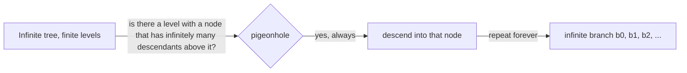
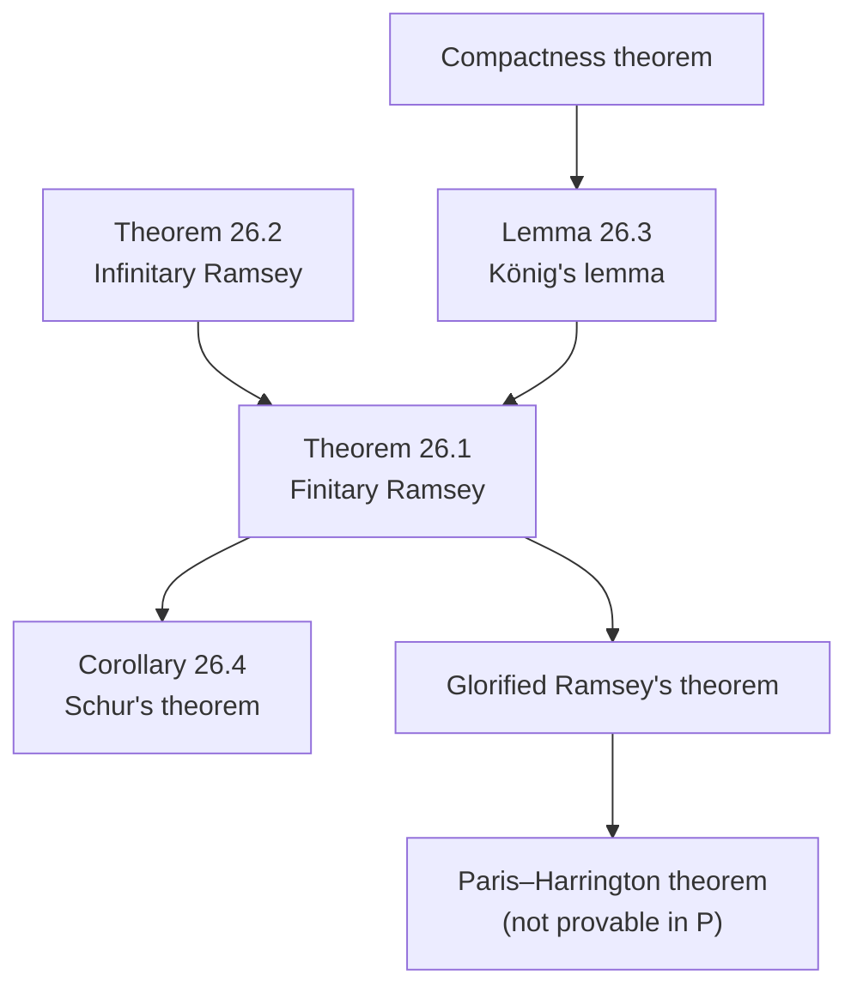

# Ramsey's Theorem and Combinatorics

[[book-guidelines|↩ Back to guidelines]]

## Why this chapter exists here

Every other limitative result in this book — undecidability of logic, Gödel's incompleteness theorems, Chaitin's theorem — is *about* logic and computation: the undecidable or unprovable sentences talk about provability, satisfiability, or program behavior. They're "metamathematical" objects. Chapter 26 exists to show that the phenomenon of **unprovability in a fixed formal system** is not a quirk of self-reference — it shows up in ordinary, elementary combinatorics too, in a statement any working mathematician would recognize as "just math," no logic required to state it. That's the payoff at the end of the chapter (the Paris–Harrington theorem), and everything before it builds the combinatorial machinery needed to state that payoff precisely.

Structurally, the chapter is also a case study in a proof strategy worth internalizing on its own: prove the *infinite* version of a statement first, then use a bridge lemma (König's lemma, via [[Models-Isomorphism-and-Cardinality#The compactness theorem|the compactness theorem]]) to pull a *finite* consequence back out of it. The book calls this "a detour through the infinite," and it's a genuinely different kind of argument from direct finite combinatorics — one with a real cost, which we'll flag when we get there.

## The motivating puzzle

The book opens with the classic party problem: at a party of six people, where every pair either likes or dislikes each other, show there are always three mutual likers or three mutual dislikers ("a clique or an anticlique of size three").

The proof is a clean pigeonhole argument. Pick a person $a$. Of the other five, either at least three are liked by $a$ or at least three are disliked by $a$ (pigeonhole: 5 people split two ways, one side has $\geq 3$). Say $a$ likes $b, c, d$. If any two of $b,c,d$ like each other, that pair plus $a$ is a clique of three. If none of the three pairs like each other, then $b,c,d$ themselves form an anticlique of three. Either way, done.

Five people is *not* enough — there's a 5-person configuration (Figure 26-1 in the book) with no clique or anticlique of size three. So six is the exact threshold for this particular problem ($r=2$ people per relation, $s=2$ colors — like/dislike, $n=3$ the target homogeneous size).

**What breaks without a general theorem:** the six-person case yields to a five-line pigeonhole argument. The next natural question — eighteen people, cliques/anticliques of size *four* — already needs a much harder argument, and the book notes that finding the exact threshold for even slightly larger parameters is "hopelessly infeasible" by brute enumeration: you'd have to search all colorings of all pairs among $m$ people, for a sequence of increasing $m$, watching for the first $m$ where no coloring escapes a homogeneous set. The interesting content of Ramsey's theorem is that *some* such $m$ always exists — long before anyone can compute what it is.

## Partitions, colorings, and homogeneous sets

The book's formal vocabulary, which the rest of the chapter is built on:

- A **partition** of a nonempty set is a family of nonempty, pairwise-disjoint, jointly-exhaustive subsets (the *classes*).
- $[X]^r$ denotes the collection of all size-$r$ subsets of $X$.
- A partition of $[X]^r$ into $s$ classes is represented as a **coloring function** $f : [X]^r \to \{1, \ldots, s\}$ — the $i$-th class is $\{x \in [X]^r : f(x) = i\}$.
- $Y \subseteq X$ is **homogeneous** for $f$ if all of $[Y]^r$ maps to the *same* color under $f$.

This is exactly the abstraction that makes "clique/anticlique" a special case: $r = 2$ (pairs of people), $s = 2$ (like/dislike), and a homogeneous set is a clique (if the shared color is "like") or an anticlique (if "dislike"). The generalization to arbitrary $r$ and $s$ is what turns a party trick into a theorem.

```rust
/// A coloring of the size-r subsets of {0, ..., n-1} into s classes,
/// represented directly as the book's f : [X]^r -> {1, ..., s}.
/// Subsets are represented as sorted Vec<usize> for a canonical form.
struct Coloring<'a> {
    r: usize,
    s: usize,
    color: Box<dyn Fn(&[usize]) -> usize + 'a>, // returns a value in 0..s
}

fn is_homogeneous(c: &Coloring, y: &[usize]) -> bool {
    let mut subsets = combinations(y, c.r);
    let first_color = subsets.next().map(|x| (c.color)(&x));
    match first_color {
        None => true, // vacuously homogeneous if |y| < r
        Some(col) => subsets.all(|x| (c.color)(&x) == col),
    }
}
# fn combinations(_y: &[usize], _r: usize) -> impl Iterator<Item = Vec<usize>> { std::iter::empty() }
```

**What breaks without this vocabulary:** without a coloring function and a crisp definition of "homogeneous," you can state the six-person puzzle but you can't state, let alone prove, a theorem that covers *all* $(r, s, n)$ simultaneously — you'd be stuck re-deriving a fresh pigeonhole argument by hand for every new party size and every new number of "moods."

## Theorem 26.1 — the finitary Ramsey theorem

> **26.1 Theorem (Ramsey's theorem).** Let $r, s, n$ be positive integers with $n \geq r$. Then there exists a positive integer $m \geq n$ such that for $X = \{0, 1, \ldots, m-1\}$, no matter how the size-$r$ subsets of $X$ are partitioned into $s$ classes, there will always be a size-$n$ subset $Y$ of $X$ such that all size-$r$ subsets of $Y$ belong to the same class.

For $r = s = 2$, $n = 3$: $m = 6$ (the party puzzle). For $n = 4$: $m = 18$, and 18 is exactly optimal (the book leaves the harder direction as a problem). Small Ramsey numbers like these are famously hard to compute — $R(5,5)$ is still unknown, bracketed only between 43 and 46 (as of when the book and, still, today).

The theorem only asserts *existence* of $m$ — it says nothing constructive about how large $m$ needs to be. A brute-force check is a legitimate way to *verify* small cases, though:

```rust
/// Exhaustively verify: does every 2-coloring of the edges of K_n
/// contain a monochromatic triangle? (r = 2, s = 2, n = 3 instance
/// of Theorem 26.1.)
fn every_2coloring_has_mono_triangle(n: usize) -> bool {
    let edges: Vec<(usize, usize)> =
        (0..n).flat_map(|a| ((a + 1)..n).map(move |b| (a, b))).collect();
    let m = edges.len();
    (0u32..(1 << m)).all(|mask| {
        let color = |a: usize, b: usize| -> bool {
            let idx = edges.iter().position(|&e| e == (a, b)).unwrap();
            (mask >> idx) & 1 == 1
        };
        has_mono_triangle(n, color)
    })
}

fn has_mono_triangle(n: usize, color: impl Fn(usize, usize) -> bool) -> bool {
    for a in 0..n {
        for b in (a + 1)..n {
            for c in (b + 1)..n {
                let ab = color(a, b);
                if ab == color(a, c) && ab == color(b, c) {
                    return true;
                }
            }
        }
    }
    false
}

fn main() {
    assert!(!every_2coloring_has_mono_triangle(5)); // the counterexample from Figure 26-1
    assert!(every_2coloring_has_mono_triangle(6));  // Theorem 26.1's m = 6
}
```

This brute force is a $2^{\binom{n}{2}}$-time check — fine at $n=6$, already awkward well before $n=18$. That gap between "exists" and "computably checkable at scale" is exactly the gap the book flags as the reason to seek a *proof*, not a search.

## Theorem 26.2 — the infinitary Ramsey theorem, and why prove it first

Rather than attack Theorem 26.1 head-on, the book proves an infinite analogue first:

> **26.2 Theorem (Infinitary Ramsey's theorem).** Let $r, s$ be positive integers. Then no matter how $[\omega]^r$ (the size-$r$ subsets of $\omega = \{0,1,2,\ldots\}$) is partitioned into $s$ classes, there is an infinite $Y \subseteq \omega$ homogeneous for the partition. Formally: if $f : [\omega]^r \to \{1, \ldots, s\}$ then there is an infinite $Y \subseteq \omega$ and $j$, $1 \le j \le s$, with $f : [Y]^r \to \{j\}$.

The proof is by induction on $r$, defining an operation $\Phi$ that, given $f$, produces such a $(j, Y)$.

- **Basis, $r = 1$:** this is just the infinite pigeonhole principle. Each singleton $\{b\}$ gets one of finitely many colors $f(\{b\}) \le s$; since there are infinitely many singletons and only finitely many colors, some color $j$ is used infinitely often — let $Y$ be the (infinite) set of $b$ with $f(\{b\}) = j$.
- **Induction step, $r+1$ from $r$:** given $f : [\omega]^{r+1} \to \{1,\ldots,s\}$, build a nested sequence of infinite sets $Y_0 = \omega \supseteq Y_1 \supseteq Y_2 \supseteq \cdots$. At each stage, peel off the least element $b_i$ of $Y_i$, and define a *derived* coloring $f_i$ on $r$-subsets of the remaining elements by "add $b_i$ back in": $f_i(\{k_1,\ldots,k_r\}) = f(\{b_i, a_{i,k_1}, \ldots, a_{i,k_r}\})$, where $a_{i,0} < a_{i,1} < \cdots$ enumerate $Y_i - \{b_i\}$. Apply the induction hypothesis to $f_i$ to get a color $j_i$ and infinite homogeneous $W_i$, then let $Y_{i+1}$ be the corresponding subset of $Y_i - \{b_i\}$. Since only finitely many colors $j_i$ occur, some color $j$ recurs at infinitely many stages $i \in E_j$; take $Y = \{b_i : i \in E_j\}$. A size-$(r+1)$ subset of $Y$ then has color $j$ by construction, since it decomposes as "least element $b_i$, plus an $r$-subset of $Y_{i+1} \subseteq W_i$," which $f_i$ colors $j_i = j$ by hypothesis.

This is genuinely a *nested pigeonhole*: you can't get $r+1$-dimensional homogeneity from a single pigeonhole application — you need one pigeonhole application per "layer," each layer building the next infinite set to pigeonhole inside of. This doesn't have a natural finite-runtime Rust translation (it manipulates literally infinite sets and an unbounded induction), but the shape is worth stating precisely as a type because it's exactly the shape Mathlib-style Lean libraries use for this kind of theorem — an existential witness built by well-founded recursion on $r$ rather than a closed formula:

```lean
-- Illustrative shape only (not claiming an exact Mathlib name/signature):
-- a coloring of r-subsets of ℕ into Fin s classes always has an infinite
-- homogeneous set. The existence proof is by induction on r, and Lean
-- would naturally mark the extraction of Y as noncomputable, because the
-- induction hypothesis is used through classical choice (picking "some j
-- with infinitely many i in E_j", not a computed one).
theorem infinite_ramsey (r s : ℕ) (f : Finset.powersetCard r (Set.univ : Set ℕ) → Fin s) :
    ∃ (Y : Set ℕ), Y.Infinite ∧ ∃ j : Fin s, ∀ x ∈ Finset.powersetCard r Y, f x = j :=
  sorry
```

**What breaks without the infinitary version:** you could try to prove Theorem 26.1 directly by finite combinatorics (and Ramsey's own original proof did exactly that), but the book's route — infinite first, then transfer down — turns out to be *shorter and more uniform* across all $r$, at the cost of losing all constructive content about $m$. That tradeoff is the chapter's central methodological point, and it's made explicit two sections later.

### A tempting but false strengthening

It's natural to wonder whether one homogeneous set $Y$ could work *simultaneously for every $r$* — i.e., could you find one infinite $Y$ such that for every $r$, $[Y]^r$ is monochromatic (possibly with different colors for different $r$)? The book proves this is false even for $s=2$, with a sharp counterexample: color a finite set $x \subseteq \omega$ color $1$ if $x$ contains $|x|$ (its own size) as a member, color $2$ otherwise. For any candidate infinite $Y$, pick $r \in Y$ and let $b_2, \ldots, b_r$ be $r-1$ other members of $Y$: then $\{r, b_2, \ldots, b_r\}$ has size $r$ and contains $r$, so it's color 1, while a size-$r$ subset of $Y$ avoiding $r$ entirely gets color 2. No single $Y$ can be homogeneous for every $r$ at once.

**What breaks:** this shows homogeneity is inherently a property *relative to a fixed $r$* — the theorem doesn't hand you one master partition of $\omega$, and any attempt to build "one $Y$ to rule them all" is asking for more structure than colorings on subsets of different sizes actually carry.

## König's lemma — the bridge back to the finite

To pull Theorem 26.1 back out of Theorem 26.2, the book proves a second, independently useful result about **trees**:

- A tree is $(T, R)$ where $T = T_0 \cup T_1 \cup T_2 \cup \cdots$ partitions the nodes into **levels**, and $R$ (read "immediately below") satisfies: nothing is below a $T_0$-node, and every node in $T_{n+1}$ is immediately below exactly one node in $T_n$.
- A **branch** is an infinite sequence $b_0, b_1, b_2, \ldots$ with each $b_n$ immediately below $b_{n+1}$.

> **26.3 Lemma (König's lemma).** An infinite tree, all of whose levels are finite, has an infinite branch.

This is intuitive but not obvious — "infinitely many nodes total, spread over finitely-sized levels" only tells you there are infinitely many *levels*; it doesn't automatically hand you a single coherent path through all of them (a tree could have infinitely many finite branches, each stopping, without any of them being infinite — the theorem rules that out for trees with finite levels, but the ruling-out needs an argument).

**The book's proof runs through the compactness theorem.** Build a language $L_T$ with one predicate $B$ (informally, "is on the branch") and one constant per node. Let $\Gamma$ contain:
1. $Bs_1 \lor \cdots \lor Bs_k$ for $s_1,\ldots,s_k$ the nodes of $T_0$ (something at level 0 is on the branch),
2. $\sim(Bs \& Bt)$ for every pair $s, t$ at the *same* level (at most one node per level is on the branch),
3. $\sim Bs \lor Bu_1 \lor \cdots \lor Bu_m$ for every node $s$ with immediate successors $u_1,\ldots,u_m$ (if $s$ is on the branch, so is one of its successors — and if $s$ has no successors, this degenerates to $\sim Bs$).

Any *finite* subset of $\Gamma$ only mentions nodes below some level $k$, and is satisfiable by the model where $B$ picks out a single finite chain from level $0$ up to level $k$ (which exists precisely because the tree is infinite — some node exists at every level). By compactness, $\Gamma$ itself has a model $M$. Reading off the (unique, by clause 2) node at each level with $B$ true in $M$ traces out an infinite branch.

**What breaks without König's lemma:** without it, an infinite-but-finitely-branching tree could, for all we know, only have branches that die out at every finite level, never assembling into one infinite path — you'd have no license to talk about "the" limit object the finite stages are approximating. This is precisely the same shape of argument used elsewhere for *proof search termination*: a resolution or tableau procedure explores a finitely-branching search tree, and completeness arguments for such procedures often hinge on exactly this kind of König's-lemma/compactness reasoning to justify that an infinite unsuccessful search would have to contain a coherent infinite "failure path" corresponding to a genuine countermodel. If you're building a proof search engine, this is the mechanism that turns "search never finds a proof" into "here is an actual failing interpretation" — the same move made explicit in the completeness theorem for first-order logic.

**A genuinely constructive alternative exists and is worth knowing about**, even though the book doesn't take this route: let $T^*$ be the subtree of nodes with *infinitely many* nodes above them. $T^*$'s root level is nonempty (since $T$ is infinite and finitely branching, by pigeonhole some level-0 node has infinitely many descendants), and from any node in $T^*$, since it has infinitely many descendants spread over its finitely many immediate successors, at least one successor is again in $T^*$ — so you can walk up $T^*$ one explicit step at a time, forever, with no appeal to compactness. (The book leaves this as Problem 26.6.) The contrast matters: the book's proof is a **nonconstructive existence proof** — it proves *a* branch exists via a model-existence argument, without ever producing one — while the $T^*$ argument is **constructive**, producing the branch by an explicit (if unbounded) choice procedure. In Lean terms, the compactness-theorem route would naturally be `noncomputable` (it goes through a model existence argument, i.e., classical logic plus something choice-like), while the $T^*$ route is the kind of argument you could in principle extract an actual `Stream`/`CoInductive` witness from.



## Deriving the finitary theorem: the tree of "bad" partitions

Now the two pieces combine to prove Theorem 26.1, by contradiction. Suppose it fails for some $r, s, n$: then for *every* $m \geq n$ there's a "bad" partition $f : [\{0,\ldots,m-1\}]^r \to \{1,\ldots,s\}$ with *no* size-$n$ homogeneous set. Let $T_k$ be the set of bad partitions with $m = n+k$, and let one bad partition be "immediately below" another if the second extends the first (same values on the smaller domain). Because there are only finitely many functions between finite sets, each $T_k$ is finite — so this is a tree with finite levels, and by hypothesis every level is nonempty, so it's infinite.

König's lemma hands us an infinite branch: an infinite sequence of bad partitions $f_0, f_1, f_2, \ldots$, each extending the last, agreeing wherever both are defined. Glue them into a single infinite coloring $F : [\omega]^r \to \{1,\ldots,s\}$ (well-defined because for any fixed size-$r$ set $x$, all the $f_k$ with $k$ large enough agree on $x$). By the *infinitary* Ramsey theorem, $F$ has an infinite homogeneous set $Y$; take $Z$, the first $n$ elements of $Y$ — a finite, size-$n$ homogeneous set that lives inside some $f_k$'s domain, and is homogeneous for $f_k$ too, since $F$ and $f_k$ agree there. But $f_k$ was supposed to be *bad* (no size-$n$ homogeneous set) — contradiction.



**What breaks without this whole apparatus:** this is the "detour through the infinite" the book advertises up front, and it has a real, stated cost — the resulting proof of Theorem 26.1 gives **no effective bound whatsoever** on $m$. The argument is by contradiction against an assumed infinite family of counterexamples; nothing in it computes a number. Contrast this with a direct finite pigeonhole-style proof (which Ramsey's own original proof was), which — however much more casework it needs — at least produces an explicit (if huge) bound. This is the sharpest illustration in the chapter of a recurring theme in this book: existence proofs and constructive/computable content are genuinely different things, and a proof can settle the former while telling you nothing about the latter.

## Schur's theorem — a quick payoff

> **26.4 Corollary (Schur's theorem).** If every natural number is colored with one of finitely many colors, there exist same-colored positive integers $x, y, z$ with $x + y = z$.

Proof: with $s$ colors, color each pair $\{i,j\}$ ($i<j$) by the color of $j - i$. Apply Ramsey's theorem with $r=2, n=3$: there's an $m$ and a homogeneous triple $\{i,j,k\}$ ($i<j<k$) — so $j-i$, $k-j$, and $k-i$ are all the same color. Set $x = j-i$, $y = k-j$, $z = k-i$; then $x+y=z$ and all three share a color.

```rust
/// Brute-force check of Schur's theorem for a fixed number of colors and range,
/// to make the corollary concrete: exhaustively verify that some Schur triple
/// exists in {1, ..., n} for every coloring into `colors` classes.
fn every_coloring_has_schur_triple(n: usize, colors: usize) -> bool {
    let total = colors.pow(n as u32);
    (0..total).all(|mut code| {
        let mut color_of = vec![0usize; n + 1];
        for i in 1..=n {
            color_of[i] = code % colors;
            code /= colors;
        }
        (1..=n).any(|x| {
            (1..=n - x).any(|y| {
                let z = x + y;
                z <= n && color_of[x] == color_of[y] && color_of[y] == color_of[z]
            })
        })
    })
}
```

Schur's theorem is a good sanity check that the machinery of Theorem 26.1 is doing real work: it's a statement about *addition*, with no combinatorial coloring language in its own hypotheses, derived purely by choosing the right encoding into Ramsey's theorem.

## Glorious sets and the glorified Ramsey's theorem

Call a nonempty finite set $Y \subseteq \omega$ **glorious** if $|Y| > \min(Y)$ — it has more elements than its own smallest element. (Every infinite set is trivially glorious, so this refinement is invisible at the infinitary level — it only bites in the finite theorem.)

The **glorified Ramsey's theorem** strengthens Theorem 26.1 by requiring the homogeneous set $Y$ to be glorious, not just size-$n$. Essentially the same proof goes through (take $T$ to be partitions with no *glorious* size-$n$ homogeneous set, and at the end take $Z$ to be the first $q = \max(n, \min(Y))$ elements of $Y$, so that $Z$ is both large enough and glorious).

Here is the chapter's real destination:

- **Ramsey's theorem (26.1) is provable in $P$** — the book's formal first-order theory of arithmetic (essentially Peano arithmetic, developed and analyzed via nonstandard models in earlier chapters). Ramsey's own original finite combinatorial proof formalizes directly.
- **The glorified Ramsey's theorem, though expressible in the language of arithmetic, is *not* provable in $P$.** This is the **Paris–Harrington theorem**. The book is explicit that it does not prove this: establishing it requires a deeper analysis of [[Nonstandard-Models-of-Arithmetic|nonstandard models of arithmetic]] than the book undertakes, and is stated as beyond its scope. No proof sketch is given here either, for the same reason — the honest summary is: *this is a real, celebrated theorem, its proof genuinely requires machinery (about nonstandard models of $P$) beyond what this chapter builds, and asserting otherwise would misrepresent the source.*

What makes this example striking, and why the book bothers with the whole chapter, is *naturalness*. Gödel's undecidable sentence and Chaitin's incompleteness results are unprovable-in-$P$ statements that are *about* provability or program behavior — self-referential, metamathematical. The glorified Ramsey's theorem is an unprovable-in-$P$ statement that is *purely combinatorial* — no coding, no self-reference, nothing about $P$ itself anywhere in its statement. It shows that Gödelian incompleteness is not a phenomenon confined to sentences deliberately engineered to talk about themselves; ordinary mathematics, pursued far enough, runs into the same wall on its own.

If you've worked through the earlier incompleteness material in this book ([[Gödel's-Second-Incompleteness-Theorem-and-the-Logic-of-Provability|Ch. 18]], [[The-Diagonal-Lemma-and-the-Limitative-Theorems|Ch. 17]]), the shape here should feel familiar even though the mechanism is different: both are "true (in the standard model) but not provable in $P$" results, but Gödel's sentence gets its unprovability from *encoding provability itself*, while glory gets its unprovability from *combinatorial growth rate* — a glorious homogeneous set of size $n$ has to be enormous relative to $n$ (far larger than the ordinary, non-glorious Ramsey bound), fast enough growth to outrun what $P$ can certify. That's a genuinely different independence mechanism worth knowing exists, even though this book (correctly) doesn't hand you its proof.

## Where this leads

This chapter is largely a terminus within the book, not a load-bearing prerequisite for later chapters — it's presented as a worked illustration of two ideas the book cares about generally: (1) the "detour through the infinite" as a proof strategy (infinite existence + compactness/König as a bridge, at the cost of losing computable content), and (2) natural, non-metamathematical independence from $P$, as a capstone to the incompleteness theme running through the book's final chapters.

For the combinatorics itself — Ramsey numbers, König's lemma, Schur's theorem — this is closer to classical background than a direct mechanism for a type-checker or elaborator. The one piece worth carrying forward deliberately: König's lemma via compactness is the same *shape* of argument (finite-approximation → infinite object, nonconstructively) that underlies completeness proofs for proof-search procedures, so if your verifier's proof search ever needs a termination or completeness argument phrased as "no infinite failing search ⟹ (by contrapositive) a bound exists," this chapter is where you saw that move done explicitly and slowly.
