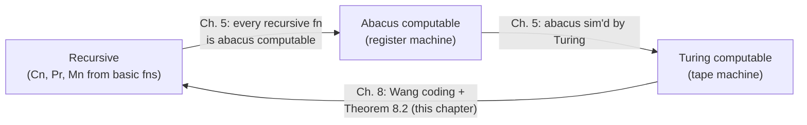
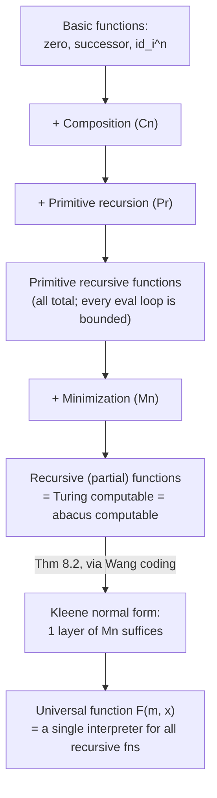

# Recursive Function Theory

[[book-guidelines|↩ Back to guidelines]]

## Why build functions instead of machines?

The two previous families of chapters in this book approach "effectively computable" from the outside: a Turing machine is a physical-looking device pushed around a tape, an abacus machine is registers you increment and test. Both are *operational* — you compute by tracing execution.

This chapter (and the two that follow it in the source) approaches the same intuitive notion from the inside, algebraically. Instead of asking "what device could compute this," it asks "what is the smallest toolbox of function-building operations, starting from functions so trivial they're obviously computable, that generates every function anyone would agree is effectively computable?" The payoff of doing this a *third*, independent way is evidential: if three people, working from three different starting intuitions (tape-pushing, register-juggling, equation-building), all land on exactly the same class of functions, that convergence is the best evidence available that the class is the "right" one — that it really does capture the pre-theoretic idea of "there's a definite, finite, mechanical procedure for this." Chapter 8 makes this convergence a theorem, not a coincidence: the three classes literally coincide.

There's also a practical reason to want the equational approach even after you have machines: equations are compositional in a way flow charts are not. Once you know `sum` is recursive and `sum` embeds into the definition of `prod`, you never again have to think about tape symbols. This is precisely the ergonomic advantage a type checker or interpreter gets from working over an abstract syntax tree instead of over raw bytecode — and it's why this chapter is the direct ancestor of "define an interpreter as a small inductively-defined language of combinators," a pattern you'll be building over and over.

## The basic functions

Everything starts from three families of functions so simple that no one could deny they're computable in one step:

- **Zero**: $z(x) = 0$ for every $x$.
- **Successor**: $s(x) = x + 1$ (in the book's own tally notation: $s(0)=0', s(0')=0'', \ldots$).
- **Identity / projection**: for each $n$ and each $1 \le i \le n$, the function $\mathrm{id}_i^n(x_1,\ldots,x_n) = x_i$ picks out the $i$-th of $n$ arguments and discards the rest.

These are called the **basic functions**. Note what's *not* here: no addition, no case-splitting, nothing that looks like a "real" program. The entire rest of the theory is about what operations you're allowed to apply to basic functions (and to functions already built from them) to reach everything else.

**Rust grounding.** The cleanest way to make this concrete is not to write `zero`, `succ`, `id1_of_2` as literal Rust functions (that's a dead end — you'd need a different Rust function for every arity and every projection index). Instead, represent a recursive-function *definition* as data — an enum — and write one `eval` function that interprets it. This is exactly the "AST + interpreter" shape you already use for expression languages, and it will carry through the rest of this article:

```rust
/// A recursive-function expression, exactly the grammar the book builds:
/// basic functions, composition (Cn), primitive recursion (Pr), minimization (Mn).
#[derive(Clone)]
enum RecFn {
    Zero,
    Succ,
    /// id_i^n : the i-th of n arguments (0-indexed here).
    Proj(usize),
    /// Cn[f, g_1, ..., g_m]: h(xs) = f(g_1(xs), ..., g_m(xs))
    Comp(Box<RecFn>, Vec<RecFn>),
    /// Pr[f, g]: h(x, 0) = f(x); h(x, y+1) = g(x, y, h(x, y))
    /// `x` here stands for zero or more leading arguments.
    PrimRec(Box<RecFn>, Box<RecFn>),
    /// Mn[f]: least y such that f(x, y) = 0, undefined if no such y
    /// (or if some f(x, t) for t < y is itself undefined).
    Minimize(Box<RecFn>),
}
```

`Zero`, `Succ`, and `Proj` need no interpreter logic beyond a direct readout — they *are* the one-step-computable functions the rest of the enum is built from.

## Composition (Cn): the "obviously fine" combinator

If $f$ takes $m$ arguments and each $g_1,\ldots,g_m$ takes the same $n$ arguments, composition builds

$$h(x_1,\ldots,x_n) = f(g_1(x_1,\ldots,x_n),\ldots,g_m(x_1,\ldots,x_n)) \qquad \text{(Cn)}$$

written in shorthand $h = \mathrm{Cn}[f, g_1,\ldots,g_m]$ (the book also calls this *substitution*). The computability argument is almost too obvious to state: run each $g_i$ to get $y_i$, then run $f$ on $y_1,\ldots,y_m$; the total step count is just the sum of the pieces. This is the "obviously fine" combinator — nothing about it should worry you, and indeed by itself it's too weak: **Proposition 7.24** in the book proves that composition alone, applied only to $z$, $s$, and the $\mathrm{id}_i^n$, can *never* produce the addition function. (Sketch: every function built by composition alone from the basic functions is bounded by $x + a$ for some fixed constant $a$, where $x$ is the largest argument — an easy induction on the shape of the composition tree. But $(a+1)+(a+1) > (a+1)+a$ for any $a$, so addition breaks every such bound.) This is the chapter's first "what breaks without this": composition gives you *plumbing*, not *growth*. You need a genuinely different combinator to get iteration.

```rust
fn eval(f: &RecFn, xs: &[u64]) -> Option<u64> {
    match f {
        RecFn::Zero => Some(0),
        RecFn::Succ => Some(xs[0] + 1),
        RecFn::Proj(i) => Some(xs[*i]),
        RecFn::Comp(f, gs) => {
            let ys: Option<Vec<u64>> = gs.iter().map(|g| eval(g, xs)).collect();
            eval(f, &ys?)
        }
        // filled in below
        RecFn::PrimRec(_, _) => todo!(),
        RecFn::Minimize(_) => todo!(),
    }
}
```

## Primitive recursion (Pr): the combinator that actually iterates

The operation that supplies genuine growth is **(primitive) recursion**. Given $f$ (the base case) and $g$ (the step), it defines $h$ by

$$h(x, 0) = f(x), \qquad h(x, y') = g(x, y, h(x,y)) \qquad \text{(Pr)}$$

(here $x$ abbreviates $x_1,\ldots,x_n$ and $y'$ is the successor of $y$), shorthand $h = \mathrm{Pr}[f,g]$. Computing $h(x,y)$ takes the sum of the steps to compute $f(x)=h(x,0)$, then $g(x,0,h(x,0))=h(x,1)$, then $g(x,1,h(x,1))=h(x,2)$, and so on up to $h(x,y)$ — always finitely many steps, because $y$ is a fixed finite number. This is why Pr never introduces partiality on its own: if $f$ and $g$ are total, so is $h$.

The book works this format hard on real examples, and preserving the *exact derivations* matters because they show the discipline of forcing an informal recurrence into the rigid two-equation shape:

- **Sum**: informally $x+0=x$, $x+y'=(x+y)'$. Formally, $\mathrm{sum} = \mathrm{Pr}[\mathrm{id}_1^1, \mathrm{Cn}[s,\mathrm{id}_3^3]]$ — the step function needs to ignore $x$ and $y$ and just apply successor to the running total, which is exactly what $\mathrm{Cn}[s, \mathrm{id}_3^3]$ does to the triple $(x,y,h(x,y))$.
- **Product**: $x \cdot 0 = 0$, $x \cdot y' = x + (x \cdot y)$, formally $\mathrm{prod} = \mathrm{Pr}[z, \mathrm{Cn}[\mathrm{sum}, \mathrm{id}_1^3, \mathrm{id}_3^3]]$ — multiplication is recursion whose step function calls the *previously built* addition function.
- **Factorial**: $0!=1$, $y'! = y! \cdot y'$. This one needs a dummy leading argument (Pr is stated for $n \ge 1$ leading arguments plus the recursion variable, so a genuinely 0-argument recursion like the factorial needs a spare argument bolted on and then projected away by composition afterward): $\mathrm{dummyfac}(x,0)=\mathrm{const}_1(x)$, $\mathrm{dummyfac}(x,y') = \mathrm{prod}(\mathrm{dummyfac}(x,y), y')$, then $\mathrm{fac}(y) = \mathrm{dummyfac}(y,y)$.
- **Exponentiation and beyond**: $x^0=1$, $x^{y'}=x\cdot x^y$; and then super-exponentiation $x\Uparrow 0 = 1$, $x\Uparrow y' = x \uparrow (x \Uparrow y)$, each level of the tower reusing the previous level as its step function. This *hierarchy* — sum built from successor, product built from sum, power built from product, tower built from power — is the book's running illustration that "one more layer of Pr" is a real increase in expressive/computational power, a point that becomes load-bearing in the "recursive but not primitive recursive" section below.

**Rust grounding.** The step-by-step unfolding described above (compute $h(x,0)$, then $h(x,1)$, …, up to $h(x,y)$) is literally an iterative loop, not a recursive call — which is a nice thing to notice about "primitive recursion" as a *name*: implemented directly, it's a `for` loop with an accumulator, not Rust-level recursion.

```rust
RecFn::PrimRec(base, step) => {
    let (x, y) = (&xs[..xs.len() - 1], xs[xs.len() - 1]);
    let mut acc = eval(base, x)?;
    for i in 0..y {
        let mut args = x.to_vec();
        args.push(i);
        args.push(acc);
        acc = eval(step, &args)?;
    }
    Some(acc)
}
```

Every argument list you can build using only `Zero`, `Succ`, `Proj`, `Comp`, and `PrimRec` is called **primitive recursive**. This `eval` never fails to terminate for these five constructors — the loop bound `y` is a plain natural number fixed before the loop starts, so termination is structural. That's exactly the property that will break in the next section, and exactly the property a proof assistant's kernel insists on when it accepts a definition "by structural recursion" without asking you to separately prove termination: primitive recursion is the fragment where the termination proof is free, built into the shape of the definition itself.

## Minimization (Mn): the combinator that can fail to halt

Primitive recursion, no matter how many layers you stack, cannot express "search until you find it" — unbounded search. The book's second combinator supplies that:

$$\mathrm{Mn}[f](x_1,\ldots,x_n) = \begin{cases} y & \text{if } f(x_1,\ldots,x_n,y)=0,\text{ and for all } t<y,\ f(x_1,\ldots,x_n,t) \text{ is defined and} \ne 0 \\ \text{undefined} & \text{if there is no such } y \end{cases}$$

Operationally: compute $f(x,0), f(x,1), f(x,2),\ldots$ in order, stop at the first $y$ with $f(x,y)=0$. If $x$ is not in the domain of $h=\mathrm{Mn}[f]$, that's for one of two reasons: either every $f(x,t)$ is defined but always nonzero (the search runs forever finding nothing), or some $f(x,i)$ is itself undefined partway through (the search gets stuck evaluating a step). Either way, the attempted computation of $h(x)$ "goes on forever without producing a result" — this is the book's own characterization of effective computability for **partial** functions, and it's the first place in the chapter where partiality becomes unavoidable rather than a technicality.

A total function $f$ is called **regular** if for every $x$ there *is* some $y$ with $f(x,y)=0$; for regular $f$, $\mathrm{Mn}[f]$ is guaranteed total. The book's own contrast pair is instructive: $\mathrm{prod}$ is regular (since $x \cdot 0 = 0$ always), so $\mathrm{Mn}[\mathrm{prod}]$ is simply the zero function; but $\mathrm{sum}$ is *not* regular ($x+y=0$ only when $x=y=0$), so $\mathrm{Mn}[\mathrm{sum}]$ is defined only at $0$ and undefined everywhere else — a genuine partial function born from a perfectly innocent-looking total one.

The functions obtainable from the basic functions by $\mathrm{Cn}$, $\mathrm{Pr}$, and now $\mathrm{Mn}$ are called the **recursive (total or partial) functions** — note the book's terminological aside: in much of the literature "recursive function" means specifically *total*, and "partial recursive function" covers the total-or-partial case; this article follows the book's own usage.

```rust
RecFn::Minimize(f) => {
    let mut y = 0u64;
    loop {
        let mut args = xs.to_vec();
        args.push(y);
        match eval(f, &args) {
            Some(0) => return Some(y),
            Some(_) => y += 1,
            None => return None, // f(x, y) itself undefined: stuck, not just "not yet found"
        }
    }
}
```

This is the one branch of `eval` that can genuinely fail to terminate — `loop` with no bound, matching the book's own description exactly. That asymmetry between `PrimRec` (a `for` loop, always terminates if its pieces do) and `Minimize` (a `loop`, may run forever) *is* the mechanism-level content of "primitive recursive vs. general recursive": it's not a difference in notation, it's the difference between a definition whose termination is structurally guaranteed and one whose termination is a substantive claim that might be false.

## Church's thesis

Every recursive function (built by $\mathrm{Cn}$, $\mathrm{Pr}$, $\mathrm{Mn}$ from the basic functions) is effectively computable — that direction is just an induction on how the function was built, following the step-counting arguments sketched above for each combinator. **Church's thesis** is the converse hypothesis: that *every* effectively computable total function is recursive (the "extended" version of the thesis covers partial functions too). Like [[Turing-and-Abacus-Computability#Turing's thesis|Turing's thesis]], it cannot be proved — "effectively computable" is an informal, pre-theoretic notion, not a mathematical object with a rigorous definition to prove things about. What can be done, and what the book spends two full chapters doing, is accumulate examples: every function anyone has ever exhibited as intuitively computable — sums, products, coding functions, Turing-machine simulators — turns out to be recursive. The thesis matters because it licenses an inference the book will need repeatedly later: *proving* a function nonrecursive (a purely mathematical fact) lets you *conclude* it is not effectively computable (an informal, practically consequential fact) — for instance, that logicians would be wasting their time hunting for an algorithm to compute it.

One explicit caution from the text: it would be simply **wrong** to strengthen Church's thesis to "every effectively computable total function is *primitive* recursive." The next section is the book's proof that this strengthening fails.

## Functions recursive but not primitive recursive

Primitive recursion, for all its hierarchy-building power (sum → product → power → tower → …), still cannot reach every recursive function. The book's witness is an **Ackermann-type function**. Fix a family of operations $\ll 0 \gg\ =$ addition, $\ll 1 \gg\ =$ multiplication, $\ll 2 \gg\ =$ exponentiation, $\ll 3 \gg\ =$ super-exponentiation, and so on (exactly the hierarchy built in the Pr section above), and define

$$\alpha(x,y,z) = x \ll y \gg z, \qquad \gamma(x) = \alpha(x,x,x)$$

so that $\gamma(0)=0$, $\gamma(1)=1$, $\gamma(2)=2^2=4$, $\gamma(3) = 3\uparrow\uparrow 3 = 7\,625\,597\,484\,987$, after which $\gamma$ explodes. Each individual level $\ll n \gg$ is primitive recursive (it's exactly one more layer of Pr on top of the last), but $\gamma$ **diagonalizes across the whole hierarchy** — reading off level $x$ evaluated at $(x,x)$ — and no *fixed*, finite number of Pr-layers can catch up to a function that keeps climbing to a new, higher level at every argument. The book's closely related companion example is $\delta(x)=\beta(x,x)$, built from $\beta_0(0)=2,\ \beta_0(y')=(\beta_0(y))',\ \beta_{x'}(0)=2,\ \beta_{x'}(y')=\beta_x(\beta_{x'}(y))$ — each $\beta_x$ individually primitive recursive, $\delta$ not.

Why is $\gamma$ still *recursive* (just not *primitively* so)? Because you're always allowed to reach for minimization: informally, "search through candidate build-sequences (of composition/recursion steps) until you find one that computes $\gamma(x)$, then run it" is exactly the kind of unbounded search $\mathrm{Mn}$ was built for. Primitive recursion is finite iteration with a *known* bound baked into the loop; $\gamma$ needs a search whose length isn't fixed in advance by any Pr-nesting depth.

The proof that composition alone (no recursion at all) can't even reach *addition* — **Proposition 7.24**, sketched above under the composition combinator — is the seed of the general argument: it's proved by an induction showing every composition-only function is bounded by (largest argument) $+\ a$ for a fixed $a$. The full Ackermann argument (left mostly to the problems in the source) generalizes this: it shows that reaching level-$n$ growth requires at least $n$ *nested* applications of Pr, so no fixed nesting depth reaches every level — exactly what $\gamma$, ranging over all levels at once, requires. This is the chapter's headline "what breaks without minimization": primitive recursion gives you an entire, endlessly extensible *hierarchy* of fast-growing functions, but never a function that outpaces the whole hierarchy simultaneously. Minimization is what lets the toolbox do that.

## Closing the circle: Turing, abacus, and recursive computability coincide

By the end of Chapter 5, the book had already shown recursive $\Rightarrow$ abacus computable $\Rightarrow$ Turing computable. Chapter 8 supplies the missing arrow, Turing computable $\Rightarrow$ recursive, which **closes the circle**: all three notions pick out exactly the same class of functions.



The proof strategy is to make the *entire running history* of a Turing computation into arithmetic, so that "simulate one more step" becomes a primitive recursive function of a number coding the current tape/state, and "the machine has halted" becomes a condition you search for by minimization.

**The Wang coding.** Treat the (two-way infinite) tape as two binary numerals meeting at the scanned square: everything left of the scanned square, read as binary (blanks = 0, strokes = 1), is the **left number** $p$; everything from the scanned square rightward, read backwards, is the **right number** $r$ (written backwards specifically so all the action stays near the units digit of both numerals). A blank tape is $p=r=0$. At the start of a computation of $f(x)$ from a block of $x+1$ strokes, $p=0$ and $r = \mathrm{strt}(x) = 2^{(x+1)} \dot- 1$ — already a primitive recursive function of $x$.

**One machine step is primitive recursive.** Reading the scanned symbol off $r$ is just parity: $\mathrm{scan}(r) = \mathrm{rem}(r,2)$. Erasing, printing, moving left, moving right each update $(p,r)$ by simple arithmetic (halving, doubling, adjusting by the remainder) — the book derives all four cases explicitly and every one is primitive recursive; they're bundled into a single $\mathrm{newleft}(p,r,a)$ / $\mathrm{newrght}(p,r,a)$ pair keyed by an act number $a \in \{0,1,2,3\}$. Coding the machine's *program* itself as a number $m$ (a finite sequence recording, for each state/symbol pair, what act to perform and what state to enter next) gives primitive recursive lookup functions $\mathrm{actn}(m,q,r)$ and $\mathrm{newstat}(m,q,r)$. Bundling $(p,q,r)$ (left number, state, right number) into a single configuration code via $\mathrm{trpl}(p,q,r) = 2^p 3^q 5^r$, the whole "advance one step" operation becomes one composed primitive recursive function $\mathrm{newconf}(m,c)$.

**The whole computation history is primitive recursive.** Define $\mathrm{conf}(m,x,t)$, the coded configuration after $t$ steps of machine $m$ on input $x$, by ordinary primitive recursion on $t$:

$$\mathrm{conf}(m,x,0) = \mathrm{inpt}(m,x), \qquad \mathrm{conf}(m,x,t') = \mathrm{newconf}(m, \mathrm{conf}(m,x,t))$$

— note this is *exactly* the (Pr) schema from earlier in the chapter, with $t$ playing the role of the recursion variable $y$. Whether the machine has halted in standard position by time $t$ is $\mathrm{stdh}(m,x,t)=0$, itself primitive recursive; if so, the output is read off by another primitive recursive function $\mathrm{otpt}(m,x,t)$.

**Only "does it ever halt" needs minimization.** Everything above is primitive recursive — no unbounded search anywhere. The *one* place unboundedness genuinely enters is asking *when* (if ever) the machine halts:

$$\mathrm{halt}(m,x) = \text{the least } t \text{ such that } \mathrm{stdh}(m,x,t)=0 \quad \text{(undefined if no such } t \text{ exists)}$$

— literally $\mathrm{Mn}$ applied to the primitive recursive function $\mathrm{stdh}$. Then $F(m,x) = \mathrm{otpt}(m,x,\mathrm{halt}(m,x))$ is a recursive (in general partial) function, and by construction, for any Turing machine $M$ with code $m$ computing some function $f$, $f(x) = F(m,x)$ for every $x$. Since $F$ is recursive and $f$ is literally a restriction of $F$ to a fixed first argument, $f$ is recursive too:

> **Theorem 8.2.** A function is recursive if and only if it is Turing computable.

This is the moment Turing's thesis and Church's thesis become *provably equivalent* to each other (not merely both plausible): "every effectively computable function is Turing computable" and "every effectively computable function is recursive" now stand or fall together, because Turing-computable and recursive are the same class. Neither thesis is thereby proved — both are still appeals to the informal notion — but their mutual entailment, arrived at from two completely independent starting points, is exactly the kind of convergence evidence the introduction to this article promised.

*(The book also uses this equivalence to show the specific machine model doesn't matter either: Theorem 8.3 shows one-way vs. two-way tapes, and two vs. more tape symbols, all yield the same computable functions — the class is "stable under perturbations of definition," which the book calls a mark of a natural class.)*

## The Kleene normal form theorem

The Wang-coding proof has a striking structural corollary. Look again at $F(m,x) = \mathrm{otpt}(m,x,\mathrm{halt}(m,x))$: everywhere in its construction *except* the single call to $\mathrm{halt}$, every function used is primitive recursive, and $\mathrm{halt}$ itself is $\mathrm{Mn}$ applied once to a primitive recursive function. Since $f(x) = F(\mathrm{const}_m(x), \mathrm{id}(x))$ for the appropriate constant $m$, and $\mathrm{const}_m$ and $\mathrm{id}$ are themselves primitive recursive, **every** recursive function factors as a primitive recursive "wrapper" around exactly one bottom-level minimization:

> **Theorem 8.4 (Kleene normal form theorem).** Every recursive total or partial function can be obtained from the basic functions by composition, primitive recursion, and minimization, using minimization no more than once.

This is a genuinely surprising economy result. A priori, the definitions in this chapter let you nest $\mathrm{Mn}$ inside $\mathrm{Mn}$ inside $\mathrm{Mn}$ arbitrarily deeply — search for a $y$ such that (search for a $z$ such that (search for a $w$ such that …) $=0$) $=0$. Kleene's theorem says that nesting is never *necessary*: any such tower can be flattened into "run a single primitive recursive step function until a single primitive recursive stopping condition fires." Put in the vocabulary of the Rust `eval` sketch above: however deeply an arbitrary `RecFn` nests `Minimize` inside itself, there is an equivalent `RecFn` of the shape `Comp(wrapper, [Minimize(step_and_check)])` where `wrapper` and `step_and_check` never themselves contain `Minimize`. **This is exactly the shape of a general-purpose interpreter loop**: one primitive recursive "step" function plus one primitive recursive "have I found the answer yet" predicate, iterated by a single unbounded search. That shape — a decidable transition function plus a decidable acceptance test, wrapped in one unbounded search — is precisely the architecture of an abstract machine with an unrestricted step count, which is the next section's payoff.

## Universal Turing machines and universal functions

Because Kleene normal form isolates *all* the potential nontermination of *every* recursive function into that single $\mathrm{halt}(m,x)$ call, the coding number $m$ starts to look less like "an encoding trick" and more like "a program you can hand to a single fixed interpreter." That intuition is exactly Theorem 8.5:

> **Theorem 8.5.** For every $k$ there exists a **universal** $k$-place recursive function — one $(n{+}1)$-place recursive $F$ such that for every $n$-place recursive $f$ there is some $m$ with $f(x_1,\ldots,x_n) = F(m,x_1,\ldots,x_n)$ for all $x_1,\ldots,x_n$.

We already built one: the very $F(m,x) = \mathrm{otpt}(m,x,\mathrm{halt}(m,x))$ from Theorem 8.2 *is* a universal function — feed it a code number $m$ for any machine, plus an argument $x$, and it reproduces exactly what machine $m$ computes on $x$. A Turing machine that computes a universal function is called a **universal Turing machine**: give it a code $m$ for machine $M$ as one input alongside the "real" argument $x$, and it reproduces $M$'s behavior on $x$. This is, historically, the theoretical seed of the stored-program computer: a *single* machine, built once, that can be made to behave as any other machine simply by being handed a description of that machine as data rather than being physically rewired. The book is explicit that this result predates general-purpose programmable computers by a decade or more, and is part of their theoretical ancestry.

One more fact about $F$ is worth keeping, because it will matter for the next chapter's [[Uncomputability|uncomputability]] results: $F(m,x)=y$ if and only if $\exists t\, \big(\mathrm{stdh}(m,x,t)=0 \ \&\ \mathrm{otpt}(m,x,t)=y\big)$, an *existentially quantified primitive recursive relation*. So the **graph** of the universal function — the set of triples $(m,x,y)$ where $F(m,x)=y$ — is semirecursive even though $F$ itself is only partial recursive (undefined wherever machine $m$ doesn't halt on $x$). That single observation is enough, via a diagonal argument directly parallel to the halting-problem argument from Chapter 4, to produce the book's first example of a recursively enumerable set that is not recursive — but that's the next topic's story.

## Synthesis

**Structural map of the chapter.**



**What this depends on.** Composition and primitive recursion reuse nothing from the Turing/abacus chapters — this is a genuinely independent characterization, which is the whole point. The one place it *reaches back* is the equivalence proof: it needs the abacus-computes-recursive-functions result from Chapter 5 (recursive ⟹ abacus ⟹ Turing) to make Theorem 8.2's "if and only if" complete, since this chapter only proves the Turing ⟹ recursive direction directly.

**What depends on this.** Almost everything downstream. Chapter 4's halting problem gets recast here as "$\mathrm{halt}(m,x)$ needs one genuinely unbounded search" — Kleene normal form says that's the *only* kind of unboundedness recursive functions ever have, which is what makes the diagonal argument for a non-recursive r.e. set (Corollary 8.8, using the same universal function $F$) so clean. Later, Chapter 15's arithmetization of syntax leans directly on the primitive-recursiveness of the coding machinery built here (sequence coding, $\mathrm{trpl}$, $\mathrm{ent}$/$\mathrm{lh}$) to show that syntactic operations on formulas and proofs are themselves recursive — which is the technical engine behind Gödel's theorems.

**Where this bears on the standing project.** This chapter is close to maximally load-bearing for the Rust-verifier goal. The `RecFn` enum and its `eval` above are a minimal, honest model of "a language whose termination is not guaranteed in general, but whose *primitive-recursive fragment* is guaranteed to terminate by construction" — which is exactly the shape a checker/verifier needs to reason about: accept `PrimRec`-only definitions unconditionally (their termination proof is structural, free), and treat any use of `Minimize` (or, in a real language, unbounded `while`/general recursion) as a proof obligation, not a given. The Kleene normal form theorem is the deeper payoff: it says that no matter how tangled a computable function's use of unbounded search looks, it is always equivalent to *one* primitive recursive step function plus *one* primitive recursive halting test wrapped in *one* outer search — in other words, every computable function can be realized as a single abstract-machine loop with a decidable transition relation and a decidable stop condition. That's precisely the architecture you'd reach for when building an interpreter/evaluator core for the elaborator: a decidable one-step reduction function, iterated by an outer driver whose termination (in general) you don't get for free and must either prove or bound with fuel — which is exactly why real proof assistants restrict user-facing recursion to structurally-decreasing (primitive-recursive-flavored) definitions, and quarantine genuine unbounded search behind an explicit `partial def` or a termination-proof obligation.
