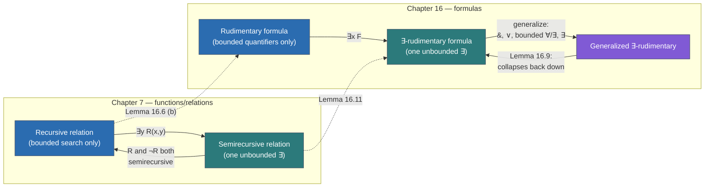
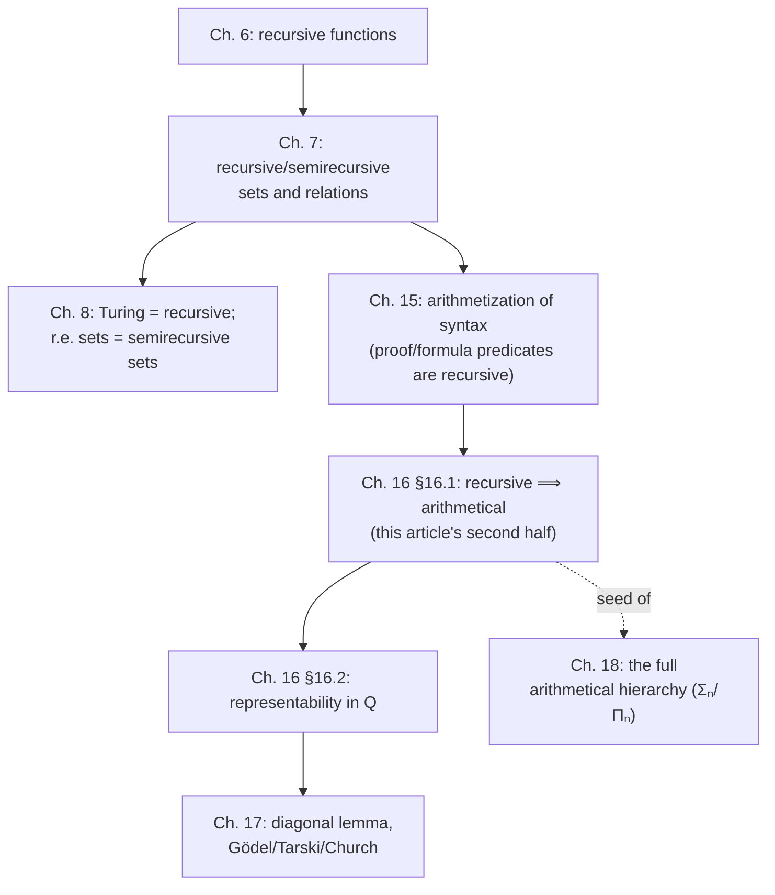

# Recursive, Semirecursive, and Arithmetical Sets and Relations

[[book-guidelines|↩ Back to guidelines]]

## Why sets and relations need their own theory

Chapter 6 built up the recursive functions: zero, successor, projections, composition, primitive recursion, minimization. That machinery answers "which *functions* are effectively computable?" But most of the questions you actually care about in logic aren't function questions — they're membership questions. Is this number prime? Is this string a well-formed formula? Is this sequence of formulas a valid proof? Those are questions about *sets* and *relations*, not functions, and the book needs a way to plug them into the same machinery it just spent a whole chapter building.

The move is almost too simple to be called a move: attach to every set $S$ its **characteristic function** $c_S$, defined by $c_S(x) = 1$ if $x \in S$ and $c_S(x) = 0$ otherwise. A set is then *recursive* exactly when its characteristic function is recursive — decidability is defined entirely in terms of a function you already know how to reason about. This single definitional trick is what lets every closure property already proved for recursive functions (closure under composition, under primitive recursion) transfer immediately to sets and relations, and it's why the chapter can move so fast: almost nothing needs to be reproved from scratch.

**What breaks without this indirection:** if "decidable" were defined directly (e.g., "there exists a terminating algorithm that outputs yes/no"), you'd need to build a whole separate closure theory for it — separately prove that the intersection of two decidable sets is decidable, that quantifying a decidable relation over a bounded range stays decidable, and so on, each time reasoning about "algorithms" as a primitive, informal notion. By routing everything through characteristic functions, all of that becomes a corollary of function-level facts you already have (e.g., $\min(c_1, c_2)$ is recursive if $c_1, c_2$ are), which is exactly the kind of "everything is secretly the same primitive" simplification a language's type system exploits by representing many features as trait implementations rather than special-cased compiler logic.

```rust
// The book's characteristic-function move, made literal.
// A "recursive set" just *is* a computable predicate.
type Nat = u64;

trait Decidable {
    fn decide(&self, x: Nat) -> bool; // must always terminate
}

struct Primes;
impl Decidable for Primes {
    fn decide(&self, x: Nat) -> bool {
        x > 1 && !(2..x).any(|d| x % d == 0 && d > 1 && d < x)
    }
}
```

Here `decide` *is* the characteristic function, just written to return `bool` instead of `{0, 1}` — same content, different encoding. The book's careful insistence that "recursive" always means the characteristic function is *total and recursive* (as opposed to merely partial) is exactly the invariant Rust's type signature `fn decide(&self, x: Nat) -> bool` enforces structurally: this function cannot fail to return, cannot panic without violating the contract, and cannot return "don't know." A set for which you can only write a function that sometimes loops forever is not recursive in this sense — it may, at best, be *semirecursive*, which is the whole point of §7.2 below.

## Building new recursive relations from old (§7.1)

Once decidability of a relation is a fact about its characteristic function, "is this relation recursive?" becomes a compositional question, and Theorem 7.4 hands you the whole toolkit at once. Given recursive relations $R, R_1, R_2$ and recursive total functions $f_i$, the following are again recursive:

- **Substitution**: $R^*(x_1,\ldots,x_n) \leftrightarrow R(f_1(x_1,\ldots,x_n),\ldots,f_m(x_1,\ldots,x_n))$ — the characteristic function of $R^*$ is $c(f_1(\vec x),\ldots,f_m(\vec x))$, obtained by plain composition.
- **Graph relations**: $G(x_1,\ldots,x_n,y) \leftrightarrow f(x_1,\ldots,x_n) = y$ is recursive whenever $f$ is — a function is, in effect, a special case of a relation, and this equivalence between "$f$ is recursive" and "the graph of $f$ is recursive" will matter a great deal once we reach the *graph principles* below.
- **Negation** ($c^* = 1 \mathbin{\dot{-}} c$), **conjunction** ($c^* = \min(c_1, c_2)$), **disjunction** ($c^\dagger = \max(c_1, c_2)$) — Boolean combination of decidable relations stays decidable, and the proof is literally arithmetic on 0/1 values.
- **Bounded quantification**: $\forall v < u\, R(\vec x, v)$ and $\exists v < u\, R(\vec x, v)$ are recursive, because checking them only ever requires evaluating $c(\vec x, i)$ for $i = 0, \ldots, u-1$ — finitely many calls, known in advance. The book writes the characteristic functions as a bounded product ($u(\vec x, y) = \prod_{i \le y} c(\vec x, i)$) and a bounded sum-then-signum ($e(\vec x, y) = \mathrm{sg}(\sum_{i \le y} c(\vec x, i))$) respectively.

This is where the phrase "closure under bounded quantification" earns its keep: *bounded* is doing all the work. An unbounded $\exists y\, R(\vec x, y)$ cannot be decided this way — you'd need to know in advance how far to search, and nothing in the definition tells you. That gap is precisely where semirecursive relations live, in the next section.

**What breaks without bounded quantification:** almost every interesting recursive relation in the chapter is built by bounding an otherwise-unbounded search. Primality (Example 7.5) is $1 < x \mathrel{\&} \forall u < x\, \forall v < x \sim(u \cdot v = x)$ — without the bound $u, v < x$, "there's no factorization" would be an infinite check. Bounded minimization/maximization (Corollary 7.6, $\mathrm{Min}[R]$ / $\mathrm{Max}[R]$) generalizes this into a reusable pattern: "search up to a known ceiling $w$, and if nothing is found, return a fixed sentinel." This is exactly the shape of a `for i in 0..bound { if cond(i) { return Some(i) } } None` loop — it terminates by construction, unlike a `while` loop searching an unbounded range.

```rust
// Corollary 7.6, Min[R]: search bounded by a known ceiling.
fn min_r(w: Nat, holds: impl Fn(Nat) -> bool) -> Nat {
    for y in 0..=w {
        if holds(y) { return y; }
    }
    w + 1 // sentinel: "no such y ≤ w"
}
```

The finite `for` loop over `0..=w` is what makes this function structurally total — the Rust compiler doesn't need to prove termination because the iteration count is bounded by data already in hand, exactly as the book's proof reduces $\mathrm{Min}[R]$ to a bounded sum. Compare this to minimization $\mathrm{Mn}[f]$ from Chapter 6 (the operator that makes *partial* recursive functions possible) — that one uses an unbounded `while`, and it is precisely the operator that can fail to terminate. Corollary 7.8 gives the escape hatch: if you can show a primitive recursive *bound* $g$ on how far the search has to go, bounded minimization recovers primitive recursiveness even for a search that looks unbounded on its face (used later for "the next prime," Example 7.10, via a factorial bound from Euclid's theorem).

The chapter also develops **sequence coding**: $(a_0,\ldots,a_{n-1})$ is coded as $2^n 3^{a_0} 5^{a_1}\cdots \pi(n)^{a_{n-1}}$ (prime-power coding), with primitive recursive length ($\mathrm{lh}$) and entry-extraction ($\mathrm{ent}$) functions built from the logarithm-style function $\mathrm{lo}$. This is not a detour — it is infrastructure the book will reuse repeatedly (Turing-machine configuration coding in Chapter 8, sequence coding again in Chapter 16's β-function lemma below) any time it needs to talk about "a finite sequence of numbers" as a single number a recursive function can take as input.

## Semirecursive relations: decidable up to "yes" (§7.2)

Some relations resist a two-sided decision procedure but still admit a one-sided one: an effective procedure that, given $x$, *eventually says yes if $x$ is in the set*, but is allowed to run forever without ever saying no if $x$ is not. This is **semidecidability**, and its formal counterpart is:

$$S(x_1,\ldots,x_n) \leftrightarrow \exists y\, R(x_1,\ldots,x_n,y)$$

for some *recursive* (fully decidable) relation $R$. A number $y$ witnessing $R(\vec x, y)$ is called a **witness** to $S(\vec x)$. The intuition matches the formula exactly: to semidecide $S$, try $R(\vec x, 0)$, then $R(\vec x, 1)$, then $R(\vec x, 2)$, ... — if $\vec x \in S$ you eventually hit a witness and halt with "yes"; if not, you search forever. The canonical example the book opens with: the domain of a partial computable function $f$ is always semidecidable, because "is $n \in \mathrm{dom}(f)$?" is answered by "try to compute $f(n)$" — success means yes, non-termination means (silently) no.

**What breaks without the "recursive" in "∃y R"**: if $R$ itself were only semirecursive, unwinding the search over $y$ wouldn't correspond to any effective procedure, because you couldn't even effectively check a single instance $R(\vec x, y)$. The whole scheme depends on the *inner* check being fully decidable — only the *outer* search is allowed to be open-ended.

Corollary 7.15 gives semirecursive relations their own closure theorem, deliberately parallel to Theorem 7.4 but with one asymmetry worth noticing:

- closed under substitution by recursive total functions, conjunction, disjunction, bounded universal quantification, and (unbounded!) existential quantification;
- **but the book does not claim closure under negation.** That omission is not an oversight — it's the entire content of the next result.

The proofs are dovetailing arguments in disguise: e.g. for conjunction, $R_1(\vec x) \leftrightarrow \exists y\, S_1(\vec x, y)$ and $R_2(\vec x) \leftrightarrow \exists y\, S_2(\vec x, y)$ combine into $\exists w\, (\exists y_1 {<} w\, S_1(\vec x, y_1) \mathrel{\&} \exists y_2 {<} w\, S_2(\vec x, y_2))$ — search for a single bound $w$ large enough to have found witnesses for *both* conjuncts. This "search for a common bound" trick is the workhorse of the whole section; it reappears for disjunction, bounded quantification, and existential quantification alike.

```rust
// A semirecursive relation: a search that halts on "yes", may loop on "no".
fn semidecide(x: Nat, r: impl Fn(Nat, Nat) -> bool) -> ! {
    let mut y = 0;
    loop {
        if r(x, y) { println!("yes, witness = {y}"); std::process::exit(0); }
        y += 1;
    }
}
```

There is no way to give this function the signature `fn(Nat) -> bool` and have it be honest — the "no" branch genuinely may never be reached. This is the same shape as an SMT solver or a Prolog-style resolution prover: a `SAT`/proof-found answer terminates the search, but `UNSAT`/no-proof is, in general, only detectable if the search space itself is guaranteed finite or the logic is decidable. **This is exactly the situation a proof-search-based verifier or elaborator finds itself in by default** — see the closing synthesis.

### Kleene's complementation principle (Proposition 7.16)

Here is the payoff for tracking the "recursive vs. semirecursive vs. not even semirecursive" distinction so carefully. If a set $R$ *and* its complement $\sim R$ are both semirecursive — say via witness relations $R(\vec x) \leftrightarrow \exists y\, S^+(\vec x, y)$ and $\sim R(\vec x) \leftrightarrow \exists y\, S^-(\vec x, y)$ — then $R$ is fully recursive.

The proof is the formalization of an idea every engineer already has intuition for: **run both semidecision procedures at once, alternating steps, and race them.** Exactly one of them is guaranteed to halt (since every $\vec x$ is in exactly one of $R$, $\sim R$), and whichever halts first tells you the answer. Formally: $S^*(\vec x, y) \leftrightarrow (S^+(\vec x,y) \lor S^-(\vec x,y))$ is recursive (disjunction of recursive relations), so $f(\vec x) = $ least $y$ with $S^*(\vec x, y)$ is a recursive *total* function (its search is guaranteed to terminate, by the halting guarantee just given), and then $R(\vec x) \leftrightarrow S^+(\vec x, f(\vec x))$ — a recursive relation substituted with a recursive total function — is recursive.

```rust
// Kleene's complementation principle: dovetail two semidecision
// procedures for R and ¬R; whichever halts first decides R.
fn dovetail_decide(
    x: Nat,
    s_plus: impl Fn(Nat, Nat) -> bool,  // recursive witness check for R
    s_minus: impl Fn(Nat, Nat) -> bool, // recursive witness check for ¬R
) -> bool {
    let mut y = 0;
    loop {
        if s_plus(x, y) { return true; }
        if s_minus(x, y) { return false; }
        y += 1;
    }
}
```

Note that `dovetail_decide` *is* total precisely because the theorem's hypothesis guarantees one of the two branches fires for every `y`-search — the totality isn't something Rust's type system can see (this loop is not structurally bounded), it's a semantic fact borrowed from the mathematics, same as `Mn[f]` back in Chapter 6 being total only under a regularity hypothesis. This is the recurring shape of "recursive but not obviously so": termination is guaranteed by a proof, not by the syntax of the loop.

### The first graph principle (Proposition 7.17)

A second payoff: if the *graph relation* of a function $f$ is merely semirecursive (not assumed recursive), $f$ is already fully recursive. The proof again exploits *bounded* search: define $g(\vec x) = $ least $w$ such that some $y, z < w$ witness $f(\vec x) = y$, then $h(\vec x, w) = $ the actual $y < w$ found — both $g$ and $h$ only involve *bounded* existential quantification of the underlying recursive witness relation $S$ (recursive, by Theorem 7.4(f)/(g)), so both are recursive, and $f(\vec x) = h(\vec x, g(\vec x))$. The trick — turn one unbounded search into a bounded search for a joint pair, then a bounded search within that bound — is the same "search for a common witness bound" idea used throughout Corollary 7.15's proofs.

### A glance at §7.3: recursive functions beyond primitive recursion (optional)

The chapter closes with an optional demonstration that "recursive" is a strictly larger class than "primitive recursive." The Ackermann-style function $\gamma(x) = \alpha(x,x,x)$, built from an operation hierarchy $\ll 0 \gg\, = {+}$, $\ll 1 \gg\, = {\times}$, $\ll 2 \gg\, = {\uparrow}$ (exponentiation), $\ll 3 \gg\, = $ super-exponentiation, ..., grows faster than any primitive recursive function can. Proposition 7.24 supplies the key lemma: any function built from zero/successor/identity by *composition alone* (no recursion at all) satisfies $f(\vec x) < x + a$ for some fixed $a$ depending only on $f$ — a linear growth cap that addition itself already violates. The proof is a clean induction on the structure of the composition, propagating growth bounds upward through each composition step. This isn't the primary focus of this topic (it's marked optional in the book, and mainly matters for the "recursive $\supsetneq$ primitive recursive" story from Chapter 6), but it's worth knowing it exists: it is the chapter's demonstration that minimization is a genuinely more powerful tool than primitive recursion, not just a syntactic convenience.

## From semidecidability to arithmetical definability (Chapter 16, §16.1)

Chapters 7 and 16 are separated by nine chapters, but they're doing structurally the same thing to two different target languages. Chapter 7 asks: which relations can a *recursive function* decide (or semi-decide)? Chapter 16 asks the dual question: which relations can a *formula of the language of arithmetic* define — i.e., pin down using $=, <, +, \cdot, \forall, \exists, \sim, \&, \lor$ — such that the formula comes out true in the standard interpretation exactly on the members of the relation? The guidelines' phrase "arithmetical definability and the arithmetical hierarchy" for this topic points here; the book itself develops only the *base layer* of what becomes, in the much later Chapter 18, a full-blown hierarchy indexed by quantifier alternation ($\Sigma_n / \Pi_n$) — that indexed hierarchy is out of scope for this topic and belongs to Chapter 18. What §16.1 establishes is the load-bearing fact the later hierarchy is built on top of: **every recursive function/relation is arithmetically definable**, and moreover definable by a formula of a very restricted shape.

A formula $F(x)$ **arithmetically defines** a set $S$ if for every natural number $a$: $S(a)$ holds iff $F(a)$ is *correct* (true in the standard interpretation $N^*$). This extends to relations ($F(x,y)$ defines $R$) and to functions (a function is arithmetical iff its graph relation is). Simple examples: $y = x_i$ defines a projection, $y = x'$ defines successor, $y = x_1 + x_2$ and $y = x_1 \cdot x_2$ define addition and multiplication (built into the language), while the predecessor function needs a small case split, $(x_1 = 0 \mathrel{\&} y = 0) \lor x_1 = y'$, since the language has no primitive predecessor symbol.

The hard part is exponentiation and everything built on top of sequence-coding, since the base language has no exponentiation symbol. The book's strategy is a two-stage relaxation:

**Stage 1 (Lemma 16.4):** temporarily *add* an exponentiation symbol $\uparrow$ to the language (giving "$\uparrow$-arithmetical" definability), and show every recursive function is $\uparrow$-arithmetical. This is a direct transcription of the three recursive-function-building operations into logical form:
- **composition** $h = g \circ f$ becomes $\exists y\,(\varphi_f(x,y) \mathrel{\&} \varphi_g(y,z))$ — "there is something that is $f(x)$, and $g$ of it is $z$";
- **primitive recursion** becomes a statement about the existence of a *coded sequence* $\sigma$ satisfying a base case and a step relation ("entry $0$ of $\sigma$ is $f(a)$; each entry $i'$ is $g$ applied to entry $i$; entry $b$ of $\sigma$ is $c$") — this is exactly why sequence coding (§7.1's prime-power coding, reused here via the pair-coding function $\mathrm{entry}$) has to exist first: primitive recursion talks about *a whole sequence of intermediate values*, and a formula can only quantify over *numbers*, so the sequence itself has to be codeable as a number;
- **minimization** becomes $\varphi_f(x,y,0) \mathrel{\&} \forall z {<} y\, \exists u\,(\varphi_f(x,z,u) \mathrel{\&} u \ne 0)$ — "$f(x,y)=0$, and $f$ is defined and nonzero everywhere below $y$" — a direct transcription of "least $y$ such that."

**Stage 2 (Lemma 16.5, the β-function lemma):** eliminate the need for $\uparrow$ entirely, by finding a coding of finite sequences by *pairs* $(s,t)$ whose entry-extraction needs only $+, \cdot,$ and $\mathrm{rem}$ — no exponentiation:
$$\mathrm{entry}(i,s,t) = \mathrm{rem}(s,\, t(i{+}1){+}1).$$
The proof stitches together two classical number-theory facts: the **Chinese remainder theorem** (given pairwise-coprime moduli $t_i$ and residues $a_i < t_i$, some $s$ realizes $\mathrm{rem}(s,t_i)=a_i$ for all $i$ simultaneously) and **Euclid's proof of the infinitude of primes** (used to manufacture enough pairwise-coprime moduli $t_i = t(i{+}1)+1$ on demand, via $t = N!$ for $N$ large enough). Once $\mathrm{entry}$ is expressible without $\uparrow$, every use of $\uparrow$-arithmeticity in Lemma 16.4's proof can be replaced, and the temporary symbol is discharged: **Lemma 16.6 — every recursive function, and every recursive set, is arithmetical**, full stop, in the unextended language.

**What breaks without the β-function lemma:** without it, "arithmetical" would silently mean "$\uparrow$-arithmetical," a strictly richer language than plain first-order arithmetic — and the representability results of §16.2 (that every recursive function is not just *true*-definable but *provable*-definable inside the weak theory $Q$) depend on staying inside the base language, since $Q$'s axioms don't mention $\uparrow$ at all. The β-function lemma is the unglamorous number-theoretic fact that keeps the whole representability program (feeding directly into Chapter 17's diagonal lemma and Gödel's theorems) from needing a stronger base language than it can afford.

### Rudimentary and ∃-rudimentary formulas

Having shown recursive things are arithmetical *at all*, the book asks how syntactically simple the defining formula can be made — this is the seed of the arithmetical hierarchy proper (Chapter 18), even though the hierarchy's Σ/Π indexing isn't introduced yet here.

- A **rudimentary formula** is built from atomic formulas using only negation, conjunction, disjunction, and *bounded* quantification ($\forall x {<} t$, $\exists x {<} t$, for any term $t$ not containing $x$) — no unbounded quantifiers at all. This is the formula-level mirror of §7.1's recursive relations: everything decidable "locally," with no unbounded search.
- An **∃-rudimentary formula** has the shape $\exists x\, F$ with $F$ rudimentary — one unbounded existential wrapped around an otherwise bounded formula. This is the formula-level mirror of §7.2's semirecursive relations: exactly the shape $\exists y\, R(\vec x, y)$ with $R$ decidable.
- A **generalized ∃-rudimentary formula** is anything obtainable from rudimentary formulas by conjunction, disjunction, bounded quantification, and unbounded existential quantification (in any combination/order).

Lemma 16.9 proves generalized ∃-rudimentary formulas collapse back down to plain ∃-rudimentary ones — "the ∃'s can always be pulled out to the front" — via the *exact same* "find a common bound $w$" trick used in Corollary 7.15's proof of semirecursive closure. Compare the two side by side:

| Corollary 7.15 (relations) | Lemma 16.9 (formulas) |
|---|---|
| conjunction of two $\exists y\, S_i(\vec x, y)$ becomes $\exists w\, (\exists y_1{<}w\, S_1 \mathrel{\&} \exists y_2{<}w\, S_2)$ | conjunction of two $\exists u\, \varphi(u)$ becomes $\exists w\, \exists u{<}w\, \exists v{<}w\,(\varphi(u)\mathrel{\&}\psi(v))$ |
| same trick for disjunction, bounded ∀, bounded ∃, unbounded ∃ | same trick, same order, same proofs |

The book itself flags this parallel explicitly ("bears more than a passing resemblance to Corollary 7.15") — it is not a coincidence, it's the same theorem proved twice at two different levels of the same correspondence ([[Recursive-Function-Theory|recursive function theory]] and arithmetical definability are, as the guidelines' own summary puts it, "two faces of a single subject"). The payoff, Lemma 16.11: **every recursive function is arithmetically definable by a single ∃-rudimentary formula** — no "generalized" needed. And Lemma 16.12 sharpens this once more into a *compositional* fact rather than a purely logical one: every recursive function is a *composition of rudimentary functions* (functions definable by a plain rudimentary formula, no unbounded quantifier at all) — echoing, again explicitly per the book, Proposition 7.17's graph-relation trick: turn one unbounded search into a bounded search for a pair, then a bounded search within that pair.



Finally, the book distinguishes **definability** from the stronger notion of **representability** in a formal theory $T$: $F(x,y)$ *defines* $f$ in $T$ if each particular instance $F(a,b)$ (true value) and each $\sim F(a,c)$ (false value) is a theorem of $T$; $F$ *represents* $f$ in $T$ if the single universally quantified statement $\forall y\,(F(a,y) \leftrightarrow y=b)$ is a theorem, for each $a$ with $f(a)=b$. In *true arithmetic* these coincide (§16.1's whole result is stated as "definable/arithmetical"), but for a genuinely weaker deductive theory like the minimal arithmetic $Q$ of §16.2, representability is strictly stronger — and it is representability in $Q$, built on exactly the ∃-rudimentary machinery of this section, that ultimately powers Chapter 17's diagonal lemma and Gödel's incompleteness theorems.

## Where this leads



Within the book, Kleene's complementation principle (7.16) is the tool Chapter 15 explicitly reuses to argue that certain sets built from decidable proof-checking must be fully recursive, not just semirecursive; the sequence-coding machinery of §7.1 (prime-power codes) reappears both for Turing-machine configurations in Chapter 8 and, in its pair-coding form, inside the β-function lemma here in §16.1; and the entire ∃-rudimentary apparatus of §16.1 is the direct prerequisite for representability in $Q$ (§16.2), which is in turn the engine behind the diagonal lemma and Gödel's theorems in Chapter 17.

For the standing project of building a Rust proof/type verifier and a Lean-style elaborator, this topic is close to load-bearing rather than merely background:

- **Recursive relations are exactly "what your verifier can decide as a pure function."** Any typing judgment, well-formedness check, or Hoare-triple side condition you can implement as a total Rust function that always returns `true`/`false` corresponds precisely to a recursive relation, and Theorem 7.4's closure properties (negation, conjunction, disjunction, bounded quantification) tell you *in advance* which combinators are safe to compose without accidentally losing decidability — e.g., a bounded `∀v < u` search over a decidable subgoal stays decidable, but an *unbounded* search does not, and that boundary is precisely where a naive typechecker's proof search risks non-termination.
- **Semirecursive relations are exactly "what a proof search can find but not refute."** A tactic-driven or unification-based prover that searches for a derivation and halts on success but may loop on failure is implementing a semidecision procedure in the book's exact technical sense — $\exists (\text{proof term})\, \mathrm{Checks}(\text{term}, \text{goal})$, with $\mathrm{Checks}$ itself decidable (a type/proof checker is always total) and the outer search over proof terms unbounded.
- **Kleene's complementation principle is the precise condition under which "search for a proof" and "search for a refutation," run in parallel, together give you a genuine decision procedure** rather than just a best-effort search — which is exactly the situation for any fragment of your logic where both provability and refutability are separately semidecidable (e.g., a decidable subset of Hoare-triple specifications, or a syntactically restricted unification fragment in the Miller-pattern sense).
- **The rudimentary/∃-rudimentary formula hierarchy is a syntactic complexity metric for judgment forms** — a useful diagnostic when designing which fragments of your specification language should be decidable-by-construction (rudimentary — bounded search only) versus merely semidecidable (∃-rudimentary — one unbounded search, e.g. "does there exist a proof/witness"), directly informing where in the elaborator's pipeline a bidirectional inference-vs-checking split is even possible.
