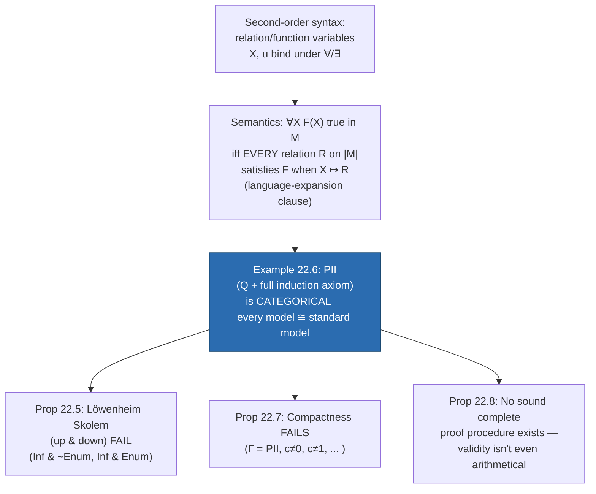

# Second-Order Logic

[[book-guidelines|↩ Back to guidelines]]

## Why this layer exists

[[Models-Isomorphism-and-Cardinality|Chapters 12–13]] built the whole apparatus of first-order model theory — compactness, the downward and upward Löwenheim–Skolem theorems, the term-model construction — and [[Sequent-Calculus-and-Formal-Deduction|Chapter 14]]'s completeness theorem crowned it: every valid first-order sentence has a finite derivation, and the search for that derivation is at worst semirecursive. That whole package is what makes first-order logic *usable* as a foundation for a proof assistant: you get a sound and complete proof procedure, model existence for anything finitely-satisfiable, and a guarantee that "big enough" models come in every infinite cardinality.

Chapter 22 asks a natural next question: first-order logic only lets you quantify over *individuals* in the domain. What if you also let $\forall$ and $\exists$ bind variables that range over *relations and functions on the domain* — not just "for all $x$," but "for all sets $X$," "for all functions $u$"? This is second-order logic, and the book's answer is blunt: it is far more *expressive*, but it destroys almost every one of the metatheorems that made first-order logic well-behaved. Compactness fails. Both Löwenheim–Skolem theorems fail. There is no sound and complete proof procedure, even in principle — not "we haven't found one yet," but a theorem that none can exist. The whole chapter is a demonstration that these losses are not independent accidents; they all trace back to a single phenomenon, **categoricity**, which is also the chapter's one genuinely positive result.

**What breaks without this chapter's warning:** if you didn't know this, you might assume that adding second-order quantifiers to a proof system is a free expressiveness upgrade — "more quantifiers, more power, why not." Chapter 22 is the record of exactly what you pay for that power, and it is the single clearest illustration in the book of why a working proof assistant's core logic is deliberately kept first-order (or a restricted, well-behaved fragment of higher-order logic) rather than full unrestricted second-order logic.



## Syntax: a new kind of variable, not a new kind of logic

The book is careful to say what does *not* change (p. 279): a language is still an enumerable set of nonlogical symbols, and an interpretation is still just a domain plus a denotation for each symbol. What's added is purely on the syntax and truth-definition side. Alongside individual variables, we get **relation variables** and **function variables**, one-, two-, three-, and more-place, exactly mirroring the arities of ordinary predicate and function symbols (one-place relation variables — ranging over sets — are also called *set variables*). These new variables can appear wherever predicate/function symbols could appear, and can be bound by $\forall$/$\exists$. A **second-order formula** is one containing at least one relation or function variable; a **second-order sentence** is a second-order formula with no free variables of any sort.

Example 22.1 shows the expressive jump concretely. In first-order logic you can only talk about *a particular* function being the identity: $\forall x\, f(x) = x$. In second-order logic you can assert that an identity function *exists*, without naming it:

$$\exists u\, \forall x\, u(x) = x$$

Likewise, first-order logic lets you say two named individuals share a named property, $Pc \,\&\, Pd$; second-order logic lets you say any two individuals share *some* property, without saying which: $\forall x \forall y \exists X (Xx \,\&\, Xy)$. And where first-order logic can only assert Leibniz's law for one particular property at a time, second-order logic quantifies over *all* properties at once — this is the mechanism behind defining identity itself, covered below.

## Semantics: truth-in-an-interpretation via language expansion

The truth definition for second-order quantifiers is the chapter's real technical hinge, and it's worth reading closely because it's exactly what breaks compactness and completeness later. For a universal quantification $\forall X F(X)$ over a relation variable, the book defines it in two steps (p. 280):

1. A relation $R$ (of the matching arity) on $|M|$ **satisfies** $F(X)$ if: expand the language with a brand-new relation symbol $P$, expand $M$ to $M^R_P$ by letting $P$ denote $R$, and check that $F(P)$ — now an ordinary first-order-shaped sentence in the expanded language — comes out true.
2. $\forall X F(X)$ is true in $M$ iff **every** relation $R$ of the right arity on $|M|$ satisfies $F(X)$ this way.

The clauses for $\exists X$ and for function variables are the mirror images. Validity, satisfiability, and implication keep their old definitions verbatim (valid = true in every interpretation, etc.) — nothing changes there.

The critical word is "every." $\forall X$ doesn't range over some enumerable list of definable relations, or over relations expressible in some fixed vocabulary — it ranges over the full power set of $|M|^n$, for whatever arity $n$ is at hand. If $|M|$ is infinite, $\mathcal{P}(|M|)$ is a strictly larger infinity (Cantor's theorem, from [[Enumerability-and-the-Infinite]]), so $\forall X$ is quantifying over a genuinely uncountable space of possible denotations even when the individual domain itself is only countably infinite. That gap between "the domain" and "the space the second-order quantifier ranges over" is the single fact everything else in this chapter derives from.

**What breaks without this exact semantics:** the book flags (p. 281) that some presentations use "general" (Henkin) semantics, where relations and functions live in their own separate, possibly *proper* sub-collection of $\mathcal{P}(|M|^n)$ rather than the full power set. Under that semantics second-order logic *does* regain compactness and a complete proof procedure — but at the cost of no longer pinning down $\mathcal{P}(|M|)$ exactly, which is precisely the power the chapter is about to exploit. This chapter uses only the standard, full-power-set semantics throughout; the tradeoff itself is the chapter's whole point.

### Grounding: this is exactly `∀ (X : Set M)` in Lean, not `∀ (X : DefinableSet M)`

This chapter is second-order logic proper — set-theoretic and proof-theoretic material — so per the style guide's promotion rule, Lean is the primary grounding language here, not Rust.

The truth clause for $\forall X F(X)$ is, almost word for word, what it means to quantify over `Set M` (equivalently `M → Prop`) in Lean:

```lean
-- A first-order predicate P is a fixed, named relation.
-- A second-order ∀X quantifies over the entire type of such relations.
def SecondOrderForall (M : Type) (F : (M → Prop) → Prop) : Prop :=
  ∀ X : M → Prop, F X

-- Example 22.1's "some property is shared by any two individuals":
-- ∀x∀y∃X (Xx & Xy)
def sharedPropertyExists (M : Type) : Prop :=
  ∀ x y : M, ∃ X : M → Prop, X x ∧ X y
```

The load-bearing word "every" in the book's semantics is exactly Lean's `∀ X : M → Prop` — quantifying over the *entire* function space `M → Prop`, which by Lean's own axiom of propositional extensionality plus classical choice is (semantically) as large as the full power set of `M`. There is no way in Lean's core type theory to quantify over only the *definable* subsets of `M` without introducing a separate inductive type of "formulas" and a satisfaction relation — which is exactly the Henkin/general-semantics escape hatch the book mentions and sets aside. This is also, not coincidentally, why Lean's kernel elaborator does not attempt full unification against arbitrary `Prop`-valued metavariables: doing so is exactly the "quantify over everything" move this chapter shows becomes intractable. More in the closing synthesis below.

## Defining identity: the Whitehead–Russell trick

Example 22.2 gives the chapter's most elegant worked proof, and it's a genuine payoff of second-order quantification: identity, ordinarily a primitive logical symbol, becomes *definable*. Leibniz's law (Example 22.1) states it with a biconditional:

$$c = d \leftrightarrow \forall X (Xc \leftrightarrow Xd)$$

but Boolos–Burgess–Jeffrey show (p. 281) the one-directional Whitehead–Russell version suffices:

$$c = d \leftrightarrow \forall X (Xc \to Xd)$$

The proof is short and worth internalizing because it's a template for how second-order quantifiers get used throughout the rest of the chapter: to prove $\forall X(Xc \to Xd)$ implies $c=d$, take the *specific* set $X = \{c\}$ — the singleton containing (the denotation of) $c$. This $X$ satisfies $Xc$ trivially; if $\forall X(Xc \to Xd)$ holds, it holds for *this particular instantiation* of $X$, forcing $Xd$, i.e., $d \in \{c\}$, i.e., $d = c$. The direction $c = d \to \forall X(Xc \to Xd)$ is immediate substitution. The pattern — "the universal $\forall X$ statement holds for every $X$, so in particular for this one cleverly chosen $X$" — is exactly how Examples 22.3–22.6 all proceed: each existence/universality proof about second-order sentences works by exhibiting one witnessing instantiation of the quantified relation or function variable.

## `Enum` and `Inf`: structural properties no first-order sentence can pin down

Examples 22.3 and 22.4 give two "axioms" — really, single second-order *sentences* — that each characterize a global structural property of the domain that no first-order sentence, or even infinite set of first-order sentences, can pin down exactly.

**Enum** (enumerability):
$$\exists z\,\exists u\,\forall X\big((Xz \,\&\, \forall x(Xx \to Xu(x))) \to \forall x\, Xx\big)$$

This is true in $M$ iff $|M|$ is enumerable. Read it as: "there's a starting point $z$ and a successor function $u$ such that every set $X$ closed under $u$ and containing $z$ is the whole domain" — i.e., the domain is exactly $\{z, u(z), u(u(z)), \dots\}$. The proof (pp. 281–282) runs both directions: if `Enum` holds, instantiate $X$ at the specific enumerable set $\{a, f(a), f(f(a)), \dots\}$ and use the induction-shaped implication to force that set to be everything; conversely, if $M$ actually is enumerable, exhibit the witnessing $z, u$ from the enumeration and check every $X$ satisfying the antecedent must be the whole domain by ordinary induction on the enumeration index.

**Inf** (infinity):
$$\exists z\,\exists u\big(\forall x\, z \ne u(x) \,\&\, \forall x\forall y(u(x)=u(y) \to x=y)\big)$$

True in $M$ iff $|M|$ is infinite — $u$ is an injective function whose range misses $z$, which is only possible on an infinite domain (this is essentially Dedekind's characterization of infinite sets). The book leaves the proof as an exercise, but the shape is the same Dedekind-infinite argument.

**What breaks without second-order quantifiers here:** a first-order sentence can only ever pin down cardinality from below ("at least $n$ elements," as in $I_n$ from [[Models-Isomorphism-and-Cardinality]]) or force infiniteness as a side effect of an unbounded chain condition. It can *never* force "exactly enumerable" as opposed to "enumerable or bigger," because by the upward Löwenheim–Skolem theorem any first-order sentence with an infinite model has models of every infinite cardinality. `Enum` and `Inf`, and their conjunction/negation-combinations, are second-order logic's way of *directly asserting* a cardinality fact that first-order logic can only gesture at asymptotically.

## The centerpiece: categoricity of $PII$ (Example 22.6)

Everything converges here. Let $PII$ (second-order Peano arithmetic, informally "$PA_2$") be the axioms of $Q$ (minimal/Robinson arithmetic, from [[Recursive-Semirecursive-and-Arithmetical-Sets-and-Relations|Ch. 16]]) conjoined with the **full second-order induction axiom**:

$$Ind: \quad \forall X\big((X0 \,\&\, \forall x(Xx \to Xx')) \to \forall x\, Xx\big)$$

Contrast this with first-order Peano arithmetic's induction *scheme* — one axiom per first-order formula $F(x)$, i.e., "induction holds for every property expressible in this language." $Ind$ instead says: induction holds for *every subset of the domain whatsoever*, definable or not. That's the whole difference, and it is decisive.

**22.6 Proposition (Categoricity).** *Every model of $PII$ is isomorphic to the standard interpretation $\mathcal{N}$.*

The proof (p. 283) has two halves:

- *Domain is exhausted by numerals.* Because $M \models Ind$, instantiating $X$ at the set of denotations of $0, 0', 0'', \dots$ (the numerals) forces — exactly as in the `Enum` proof — every element of $|M|$ to be the denotation of *some* numeral. Because $M \models Q$, the axioms of $Q$ force $m \ne n$'s denotations to differ whenever $m \ne n$ as natural numbers, so it's the denotation of *at most one*. So the map $j: |M| \to \mathbb{N}$ sending each element to "which numeral it's the denotation of" is a well-defined bijection.
- *It's an isomorphism, not just a bijection.* $Q$'s axioms also pin down how $<, +, \cdot$ behave on numerals exactly (the six biconditionals on p. 283, reused from [[Recursive-Semirecursive-and-Arithmetical-Sets-and-Relations]]), so $j$ preserves every relation and function symbol of the language — it's a full isomorphism.

The converse — every interpretation isomorphic to $\mathcal{N}$ models $PII$ — reuses [[Models-Isomorphism-and-Cardinality|the isomorphism theorem]] (Prop 12.5), which the book notes "goes through essentially unchanged for second-order logic."

**This is genuinely striking against the first-order backdrop.** First-order $PA$ (with the induction *scheme*, not $Ind$) has nonstandard models in every infinite cardinality — models with "numbers" beyond every standard natural number, by an overspill/compactness argument almost identical to Proposition 22.7 below. $PII$ has *no* nonstandard models at all: fixing the truth of finitely many arithmetic axioms plus one second-order sentence completely determines the model up to isomorphism, at a single fixed cardinality ($\aleph_0$). A theory that pins down its models up to isomorphism this way is called **categorical**. Second-order logic can achieve categoricity for an infinite structure; first-order logic provably cannot (this is essentially a restatement of the upward Löwenheim–Skolem theorem: any first-order theory with one infinite model has models of every infinite cardinality, hence cannot be categorical).

## Why categoricity is a wrecking ball: three failed theorems

The chapter's punchline is that $PII$'s categoricity is not just "one interesting example" — it's a single counterexample that simultaneously refutes three separate first-order metatheorems, because each of those theorems, if it held for second-order logic, would force $PII$ to have models it provably cannot have.

**Both Löwenheim–Skolem theorems fail (Prop 22.5).** $Inf \,\&\, {\sim}Enum$ is a second-order sentence with an infinite model (any nonenumerable one) but, by definition of `Enum`, no enumerable model — contradicting the *downward* Löwenheim–Skolem theorem ("any satisfiable set has an enumerable model"). Symmetrically, $Inf \,\&\, Enum$ has only denumerable models, contradicting the *upward* theorem ("any set with an infinite model has a nonenumerable model"). And since $PII$ pins its models to exactly one isomorphism type at exactly one cardinality ($\aleph_0$), it immediately refutes the corollary that every first-order theory with an infinite model has *nonisomorphic* infinite models too — $PII$'s infinite models are all isomorphic to each other, full stop.

**Compactness fails (Prop 22.7).** Add a fresh constant $c$ and consider
$$\Gamma = \{PII,\; c \ne 0,\; c \ne 1,\; c \ne 2,\; \dots\}$$
Every finite subset $\Gamma_0$ has a model: take the standard interpretation and let $c$ denote any number larger than every number mentioned in $\Gamma_0$. But $\Gamma$ as a whole has no model — because *every* model of $PII$ is isomorphic to $\mathcal{N}$ (categoricity!), and in $\mathcal{N}$, $c$ must denote *some* natural number $k$, which directly contradicts the sentence $c \ne k \in \Gamma$. Finite satisfiability without full satisfiability is exactly what compactness rules out — and here it happens. Compare this to the standard first-order construction of a *nonstandard* model of arithmetic (via [[Models-Isomorphism-and-Cardinality|compactness]] itself, applied to first-order $PA$): the identical-looking $\Gamma$ *does* have a model there, precisely because first-order $PA$ isn't categorical, so there's room for $c$ to denote a genuinely nonstandard element. Second-order categoricity removes that room.

**The abstract Gödel completeness theorem fails (Prop 22.8) — this is the sharpest one.** The proof (pp. 283–284) is a clean reduction: a first-order sentence $A$ of arithmetic is true in $\mathcal{N}$ iff it's true in every interpretation isomorphic to $\mathcal{N}$ (trivial) iff, by categoricity, it's true in *every model of $PII$* iff $PII \to A$ is second-order-valid. The map $A \mapsto (PII \to A)$ is recursive. So *if* the set of valid second-order sentences were semirecursive, then — running this reduction — the set of first-order arithmetic truths would be semirecursive too. But [[The-Undecidability-of-First-Order-Logic|Tarski's theorem]] (Thm 17.3, covered in Ch. 17) already shows that set isn't even *arithmetical*, let alone semirecursive. So second-order validity can't be semirecursive either — it's strictly harder than the halting problem, harder than arithmetic truth itself.

The book is emphatic about the correct phrasing here (p. 284): it's imprecise to say "second-order logic is incomplete" — the *logic* (its semantic notion of validity) is perfectly well-defined. What's impossible is a *sound and complete proof procedure* for it: no recursively-enumerable set of second-order-derivable sentences can coincide with the (non-arithmetical) set of second-order-valid sentences. "It's not the logic that's incomplete, but candidate proof procedures" (p. 284).

## The single underlying mechanism

All three failures are the *same* fact wearing different hats:

$$\text{categoricity of } PII \;\Longrightarrow\; \text{Löwenheim–Skolem fails, compactness fails, no complete proof procedure exists}$$

The reasoning chain is genuinely one chain, not three coincidences: a theorem that pins its models to a single isomorphism type at a single cardinality is a theorem *rich enough to internally define what "true in the standard model" means* — because "true in the standard model" and "true in every model of $PII$" become the same predicate. But truth-in-the-standard-model is already known (Tarski, Ch. 17) to be undefinable by any recursive or even arithmetical means. So anything that lets you *reduce* to "true in every model of $PII$" — which second-order validity does — inherits that same undefinability. Compactness and Löwenheim–Skolem are, from this angle, just the model-existence-flavored symptoms of the same underlying rigidity; completeness-failure is the proof-theoretic symptom.

## Where second-order logic *is* useful: the preview of arithmetical/analytical definability

The chapter closes (pp. 284–285) by turning the failure into a tool, previewing [[Interpolation-and-Definability|Chapter 23]]. A set $S \subseteq \mathbb{N}$ is **arithmetical** if some first-order formula $F(x)$ defines it in $\mathcal{N}$; it's **analytical** if some first- *or second*-order formula $\varphi(x)$ does. Lifting one level: a class of sets of numbers is **arithmetical** if some second-order formula $F(X)$ *with no bound relation/function variables* defines it (only the one free $X$), and **analytical** if an arbitrary second-order $\varphi(X)$ (bound second-order variables allowed) does.

The book flags, as a teaser for Ch. 23, that the set $V$ of true first-order arithmetic sentences — not arithmetical, by Tarski — *is* analytical: Ch. 23 will show the singleton class $\{V\}$ is arithmetical (definable by one $F(X)$ with no bound second-order variables, characterizing $V$ as the unique fixed point of the truth recursion), from which $V = \{m : \exists X (F(X) \,\&\, Xm)\}$ falls out as analytical. So second-order quantification, precisely because it can reach past what first-order definability can express, becomes the natural home for *defining* the semantic notion of arithmetic truth itself — even though (per Prop 22.8) it can never let you *decide* or *completely axiomatize* that same notion.

## Where this leads

Chapter 22 doesn't feed forward into later machinery the way Chapters 12–14's model theory does — the book explicitly says "the results of the present chapter will not be presupposed by later ones" (p. 279) — but its *definitions* (arithmetical/analytical sets and classes) are picked up immediately by [[Interpolation-and-Definability|Chapter 23]]'s forcing construction, and second-order-style quantification over sets resurfaces informally whenever the book discusses definability limits. Its real payload is conceptual: it's the book's demonstration that the metatheorems of Chapters 12–17 ([[Models-Isomorphism-and-Cardinality|compactness, Löwenheim–Skolem]], [[Sequent-Calculus-and-Formal-Deduction|completeness]]) are not generic facts about "logic" — they are *first-order-specific* facts, purchased precisely by first-order logic's restriction to quantifying over individuals only.

**Synthesis for the elaborator project:** this chapter is the theoretical justification, not just a historical footnote, for why a Lean-style elaborator's kernel type theory is *not* full unrestricted second-order (or higher-order) logic. Full second-order quantification over `Prop`/`Set` buys categoricity-strength expressiveness — enough to pin down arithmetic up to isomorphism with a single finite axiom — but Proposition 22.8 is the proof that this power is inherently incompatible with *any* mechanizable, sound-and-complete proof search: validity itself stops being even arithmetical, let alone semirecursive. A metavariable-unification engine that had to search over "which relation does $X$ denote" in full generality would be searching a space with no recursively enumerable structure to exploit at all. This is exactly why real elaborators restrict to well-behaved fragments: Lean's kernel uses definitional/judgmental equality checking (a decidable, first-order-flavored relation) rather than second-order-strength quantification, and its unifier is deliberately confined to *pattern unification* (Miller patterns) — a fragment chosen precisely because it stays decidable and syntax-directed rather than requiring a search over "every possible relation/function on the domain," which Chapter 22 shows has no algorithmic handle at all. The categoricity that makes $PII$ so mathematically elegant is the same categoricity that makes second-order logic computationally hopeless as a proof-search target — expressive power and proof-search tractability trade off directly, and that tradeoff is the chapter's real lesson for anyone building a checker rather than just admiring a theorem.
