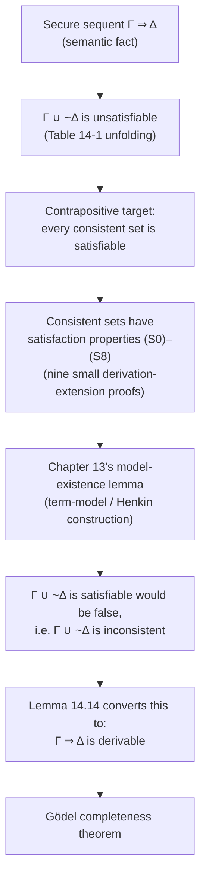

# Sequent Calculus and Formal Deduction

[[book-guidelines|↩ Back to guidelines]]

> **Load-bearing note.** This chapter is the direct ancestor of any proof checker or automated theorem prover you build. Rules (R0)–(R9) are literally the search space a proof-search engine has to explore; soundness is the property that makes "the checker accepted it" mean something; completeness is the property that makes "the checker will eventually find a proof if one exists" true; cut elimination is the property that makes that search *tractable* rather than merely possible. If you are building a Rust verifier with an embedded prover, this chapter is close to a spec.

## Why this chapter has to exist

Chapters 9–13 gave you two separate stories about first-order logic. One is *semantic*: an interpretation $M$, a satisfaction relation $M \models F$, and a notion of logical consequence built entirely out of "every interpretation that makes the premisses true makes the conclusion true." The other, arriving in this chapter, is *syntactic*: a finite, checkable, symbol-pushing procedure that never mentions interpretations at all — just formulas and rules for rewriting sequences of formulas into other sequences of formulas.

These two stories have to agree, and *why* they have to agree is not obvious in advance. The semantic notion of consequence quantifies over an unbounded, generally uncountable collection of interpretations — there is no way to "check all of them" in finite time. The syntactic notion of derivability, by contrast, is exactly the kind of thing a machine can check: a derivation is a finite object, and whether a given finite object counts as a derivation is decided by finitely many local, mechanical tests (does this line match the shape of some rule, applied to some earlier lines?). If these two notions come apart — if there are true-in-every-model sequents with no derivation, or derivable sequents that aren't actually secure — then either the semantic notion is capturing something the syntax can't reach, or the syntax is proving things that aren't actually valid. Both are catastrophic for the enterprise of building automated reasoning tools: you'd have either an incomplete prover (misses real theorems) or an unsound one (proves false things).

**What breaks without this.** Every later "there is no proof of X" result in the book — the undecidability results in Chapter 15–17, the incompleteness theorems — has content only because a sound-and-complete deducibility relation exists and is known to coincide with truth in every model. If deducibility and consequence could silently diverge, "no formal deduction of [[The-Diagonal-Lemma-and-the-Limitative-Theorems#The Gödel sentence|the Gödel sentence]] exists" wouldn't tell you anything about whether the Gödel sentence is *true*. Soundness and completeness are the load-bearing beams under everything that follows; this is the chapter that pours the concrete.

The book's approach: define a specific proof system — a **Gentzen system** or **sequent calculus** — prove it sound (derivable $\Rightarrow$ secure) and complete (secure $\Rightarrow$ derivable), and then largely never look at the system's specific rules again. What matters for the rest of the book is not *this particular* system but the fact that *some* sound-and-complete system exists.

## Security: one relation, three special cases

Before defining derivations, the book first generalizes the semantic side. Instead of separately tracking "consequence," "unsatisfiability," and "validity," it defines a single relation, **security**, and shows the other three are special cases.

$\Gamma$ **secures** $\Delta$ if and only if every interpretation making all sentences in $\Gamma$ true makes some sentence in $\Delta$ true.

Read $\Gamma$ as a conjunction of premisses and $\Delta$ as a disjunction of alternative conclusions — securing means "you can't make all of $\Gamma$ true while making all of $\Delta$ false." The vacuous cases matter and are used constantly below: if $\Delta$ is empty, "makes some sentence in $\Delta$ true" is impossible to satisfy, so $\Gamma$ secures $\emptyset$ exactly when $\Gamma$ is unsatisfiable. If $\Gamma$ is empty, every interpretation vacuously "makes all sentences in $\Gamma$ true," so $\emptyset$ secures $\Delta$ exactly when every interpretation makes some sentence of $\Delta$ true.

| Semantic notion | Restated as security |
|---|---|
| $D$ is a consequence of $\Gamma$ | $\Gamma$ secures $\{D\}$ |
| $\Gamma$ is unsatisfiable | $\Gamma$ secures $\emptyset$ |
| $D$ is valid | $\emptyset$ secures $\{D\}$ |

**What breaks without this unification.** If you tried to state soundness and completeness three separate times — once for deduction, once for refutation, once for demonstration — you'd triple the proof obligations and obscure that they're really one theorem in three costumes. Security is the move that lets one soundness proof and one completeness proof cover all three at once.

## Sequents and derivations

A **sequent** $\Gamma \Rightarrow \Delta$ pairs a finite set of sentences $\Gamma$ (left side) with a finite set of sentences $\Delta$ (right side). A sequent is **secure** if its left side secures its right side. The entire project of the chapter is to define *derivable* so that it coincides with *secure*.

A **derivation** is a finite sequence of sequents (its *steps* or *lines*), where each step either has the trivial form $\{A\} \Rightarrow \{A\}$ or follows from one or more earlier steps by one of the rules of inference below. A derivation *of* a sequent is one whose last step is that sequent; a sequent is **derivable** if some derivation ends in it.

Deduction, refutation, and demonstration — the three syntactic notions matching the three semantic ones above — are just derivations of particular sequent shapes:

| Syntactic notion | Is a | Matching semantic notion |
|---|---|---|
| Deduction of $D$ from $\Gamma$ | derivation of $\Gamma \Rightarrow \{D\}$ | $D$ is a consequence of $\Gamma$ |
| Refutation of $\Gamma$ | derivation of $\Gamma \Rightarrow \emptyset$ | $\Gamma$ is unsatisfiable |
| Demonstration of $D$ | derivation of $\emptyset \Rightarrow \{D\}$ | $D$ is valid |

A set is **consistent** if it is irrefutable, **inconsistent** if it is refutable. Once soundness and completeness are proved, the left column and right column of this table become provably interchangeable — that's the whole payoff.

**Rust grounding — the shape of a proof-search engine.** A sequent is exactly the state a backward-chaining prover carries around, and a derivation is exactly the proof object it emits:

```rust
use std::collections::BTreeSet;

#[derive(Clone, PartialEq, Eq, PartialOrd, Ord)]
struct Sentence(/* AST of a first-order sentence */ String);

#[derive(Clone)]
struct Sequent {
    left: BTreeSet<Sentence>,   // Gamma
    right: BTreeSet<Sentence>,  // Delta
}

enum Rule { R0, R1, R2a, R2b, R3, R4, R5, R6, R7, R8a, R8b, R9a, R9b }

// A derivation is a proof tree: each node names the rule used and the
// (already-derived) premisses it was applied to.
struct Step {
    conclusion: Sequent,
    rule: Rule,
    premisses: Vec<usize>, // indices of earlier steps in a flat derivation
}

struct Derivation(Vec<Step>);
```

A checker (as opposed to a prover) just needs to walk this `Vec<Step>` and confirm each step's shape actually matches its claimed rule applied to its claimed premisses — precisely the "finitely many possibilities to check at each step" the book invokes to argue derivations are mechanically verifiable (p. 168–169). A prover has the harder job of *finding* the `Derivation`, working backward from a goal sequent by trying rules in reverse; that search space *is* rules (R0)–(R9), which is why the shape of those rules matters so much to anyone implementing one.

## The rules of inference (R0)–(R9)

Each rule has a premiss or premisses (above the line) and a conclusion (below the line). A sentence appearing in a premiss but not the conclusion is **exiting**; one in the conclusion but not the premisses is **entering**; one in both is **standing**. (R0) is a zero-premiss rule, and by convention its sentence $A$ counts as entering.

The book works with a minimal official language — only $\sim$ (not), $\vee$ (or), $\exists$ (exists), and $=$ are primitive; $\&$, $\forall$, $\to$, $\leftrightarrow$ are unofficial abbreviations built from these. That's a deliberate economy: fewer primitives means fewer rules to prove sound, at the cost of more steps in any individual derivation.

| Rule | Name | Pattern |
|---|---|---|
| R0 | Identity | $\{A\}\Rightarrow\{A\}$ (zero premisses) |
| R1 | Weakening | $\Gamma\Rightarrow\Delta$ entails $\Gamma'\Rightarrow\Delta'$ for any supersets $\Gamma'\supseteq\Gamma$, $\Delta'\supseteq\Delta$ |
| R2a | Right negation intro | $\Gamma\cup\{A\}\Rightarrow\Delta$ gives $\Gamma\Rightarrow\{\sim A\}\cup\Delta$ |
| R2b | Left negation intro | $\Gamma\Rightarrow\{A\}\cup\Delta$ gives $\Gamma\cup\{\sim A\}\Rightarrow\Delta$ |
| R3 | Right $\vee$ intro | $\Gamma\Rightarrow\{A,B\}\cup\Delta$ gives $\Gamma\Rightarrow\{(A\vee B)\}\cup\Delta$ |
| R4 | Left $\vee$ intro (cases) | $\Gamma\cup\{A\}\Rightarrow\Delta$ and $\Gamma\cup\{B\}\Rightarrow\Delta$ give $\Gamma\cup\{A\vee B\}\Rightarrow\Delta$ |
| R5 | Right $\exists$ intro | $\Gamma\Rightarrow\{A(s)\}\cup\Delta$ gives $\Gamma\Rightarrow\{\exists x\,A(x)\}\cup\Delta$ |
| R6 | Left $\exists$ intro | $\Gamma\cup\{A(c)\}\Rightarrow\Delta$ gives $\Gamma\cup\{\exists x\,A(x)\}\Rightarrow\Delta$, **provided $c$ occurs in none of $\Gamma$, $\Delta$, $A(x)$** |
| R7 | Reflexivity of $=$ | $\Gamma\cup\{s=s\}\Rightarrow\Delta$ gives $\Gamma\Rightarrow\Delta$ |
| R8a/b | Substitution of identicals | from $s=t$ and $A(t)$, infer $A(s)$ (on either side) |
| R9a/b | Cases on $A$ vs $\sim A$ | $\Gamma\cup\{\sim A\}\Rightarrow\Delta$ gives $\Gamma\Rightarrow\{A\}\cup\Delta$, and conversely |

Two of these deserve special attention.

**(R6), left existential introduction, and the side condition.** This rule formalizes a move you already do informally in mathematical proof: "suppose there is something satisfying $A$; call it $c$; now argue from $A(c)$." The side condition — $c$ must not occur in $\Gamma$, $\Delta$, or $A(x)$ — is exactly the "fresh variable" or "fresh constant" discipline that makes the move legitimate. Skip the side condition and you can derive nonsense: **Example 14.10** in the book shows $\exists x\,Fx \Rightarrow \forall x\,Fx$ falling out of a misapplication of (R6) where the "fresh" constant $c$ actually already occurs in $\Gamma$ (namely in $\sim Fc$). This is precisely the same discipline as **variable capture avoidance** in substitution — the exact plumbing your learning goals flag as recurring under both Hoare-triple soundness and elaboration. A checker that doesn't enforce this side condition is unsound; a prover that doesn't track which constants are "used" will happily manufacture a derivation of a falsehood.

**(R9), reductio.** (R9a)/(R9b) formalize proof by contradiction in its "case split on $A$ or $\sim A$" form. Historically some mathematicians (constructivists) have rejected the informal counterpart of this rule — Boolos, Burgess & Jeffrey note this explicitly (p. 175) as the reason a soundness proof, however careful, will never convince a determined skeptic of classical logic itself; the proof's only job is to catch accidental slips, not settle that philosophical dispute.

**Lean grounding — rules as inference, not tactics-on-goals.** Because this material *is* proof theory, Lean is the more literal target here, promoted ahead of Rust per the style convention for proof-theoretic content. A sequent calculus derivation and a Lean proof term serve the same role — a checkable certificate that a conclusion follows from premisses — but they are built in opposite directions. Sequent calculus (R1)–(R9), read top-to-bottom, is *forward*: you already have derivations of the premisses and you combine them. Read bottom-to-top, exactly as a Lean tactic script is read, each rule is a **goal-reduction step**:

```lean
-- Right-disjunction introduction (R3), read as a tactic: reduces the goal
-- Γ ⊢ (A ∨ B) to the goal Γ ⊢ A ∨ B  — i.e. `apply Or.inl` / `Or.inr`
-- after first showing you have A or B available on the right.
example (h : A) : A ∨ B := Or.inl h   -- the R3 "conclusion" as a proof term

-- Left-disjunction introduction (R4), proof by cases, is literally Or.elim:
example (hab : A ∨ B) (ha : A → C) (hb : B → C) : C :=
  Or.elim hab ha hb

-- Left-∃ introduction (R6) is existential elimination — Lean's kernel
-- enforces the same "c fresh" discipline via the binder in `Exists.elim`:
example (h : ∃ x, P x) (k : ∀ c, P c → C) : C :=
  Exists.elim h k   -- `c` is scoped to `k`'s body — cannot escape, by construction
```

The correspondence is exact and worth dwelling on: (R6)'s side condition ("$c$ not in $\Gamma$ or $\Delta$ or $A(x)$") is not a bookkeeping nuisance the book imposes by fiat — it is the same constraint Lean's kernel enforces *structurally*, by scoping the witness variable to the continuation `k` inside `Exists.elim` so it's impossible for it to leak into the conclusion `C`. Where BB&J have to state and verify a side condition by hand at every application, Lean's binder discipline makes the mistake in Example 14.10 literally inexpressible as a term — this is what "the kernel is the most literal translation of the book's formalism" (per the style convention) looks like concretely.

## Worked example: the derivation tree

Here is Example 14.9 from the book — a genuine two-quantifier derivation of $\exists x(Fx \vee Gx) \Rightarrow \exists x Fx \vee \exists x Gx$ — laid out as a derivation tree rather than a flat numbered list, to make the rule dependencies visible:

<svg viewBox="0 0 900 480" xmlns="http://www.w3.org/2000/svg" font-family="Georgia, 'Times New Roman', serif" font-size="15">
  <style>
    .box { fill: none; stroke: #8a8a8a; stroke-width: 1.2; }
    .seq { fill: #d8542f; font-family: 'Cambria Math', Georgia, serif; }
    .rule { fill: #6a6a6a; font-size: 12px; font-style: italic; }
    .line { stroke: #8a8a8a; stroke-width: 1.2; }
  </style>

  <!-- Line 1: Fc => Fc (R0) -->
  <text x="60" y="40" class="seq">Fc ⇒ Fc</text>
  <text x="60" y="56" class="rule">(R0)</text>

  <!-- Line 3: Gc => Gc (R0) -->
  <text x="440" y="40" class="seq">Gc ⇒ Gc</text>
  <text x="440" y="56" class="rule">(R0)</text>

  <line x1="10" y1="70" x2="180" y2="70" class="line"/>
  <!-- Line 2: Fc => Fc,Gc (R1) -->
  <text x="20" y="100" class="seq">Fc ⇒ Fc, Gc</text>
  <text x="20" y="116" class="rule">(R1)</text>

  <line x1="400" y1="70" x2="580" y2="70" class="line"/>
  <!-- Line 4: Gc => Fc,Gc (R1) -->
  <text x="410" y="100" class="seq">Gc ⇒ Fc, Gc</text>
  <text x="410" y="116" class="rule">(R1)</text>

  <line x1="10" y1="130" x2="590" y2="130" class="line"/>
  <!-- Line 5: Fc v Gc => Fc, Gc (R4) -->
  <text x="230" y="160" class="seq">Fc ∨ Gc ⇒ Fc, Gc</text>
  <text x="230" y="176" class="rule">(R4) — case split on the two premisses above</text>

  <line x1="220" y1="190" x2="480" y2="190" class="line"/>
  <!-- Line 6: Fc v Gc => ∃xFx, Gc (R5) -->
  <text x="230" y="220" class="seq">Fc ∨ Gc ⇒ ∃x Fx, Gc</text>
  <text x="230" y="236" class="rule">(R5) — generalize Fc to ∃x Fx</text>

  <line x1="220" y1="250" x2="510" y2="250" class="line"/>
  <!-- Line 7: Fc v Gc => ∃xFx, ∃xGx (R5) -->
  <text x="220" y="280" class="seq">Fc ∨ Gc ⇒ ∃x Fx, ∃x Gx</text>
  <text x="220" y="296" class="rule">(R5) — generalize Gc to ∃x Gx</text>

  <line x1="210" y1="310" x2="560" y2="310" class="line"/>
  <!-- Line 8: Fc v Gc => ∃xFx v ∃xGx (R3) -->
  <text x="215" y="340" class="seq">Fc ∨ Gc ⇒ ∃x Fx ∨ ∃x Gx</text>
  <text x="215" y="356" class="rule">(R3) — collapse the two alternatives into one disjunction</text>

  <line x1="200" y1="370" x2="600" y2="370" class="line"/>
  <!-- Line 9: ∃x(Fx v Gx) => ∃xFx v ∃xGx (R6) -->
  <text x="190" y="400" class="seq">∃x(Fx ∨ Gx) ⇒ ∃x Fx ∨ ∃x Gx</text>
  <text x="190" y="418" class="rule">(R6) — c fresh in Γ, Δ, and Fx∨Gx: safe to abstract Fc∨Gc to ∃x(Fx∨Gx)</text>

  <rect x="150" y="378" width="440" height="46" class="box" rx="4"/>
</svg>

Reading this tree, notice the shape that recurs constantly in sequent-calculus derivations: build up "loose" alternatives on the right with (R1)/(R5), collapse them into one disjunction with (R3), and only apply the *left*-introduction rule (R4) or (R6) once, at a point where the side conditions are guaranteed to hold. The single boxed step at the bottom is the only one where a side condition needed checking — and it's exactly the step Examples 14.10–14.11 show going wrong when that check is skipped.

## Soundness: every derivable sequent is secure

Soundness (Theorem 14.1) is proved by structural induction on derivations: (R0)-sequents are trivially secure, and each rule is shown individually to preserve security — "if the premiss(es) are secure, so is the conclusion." The book works through all nine rules; two representative cases:

- **(R1), weakening.** If $\Gamma\Rightarrow\Delta$ is secure and $\Gamma\subseteq\Gamma'$, $\Delta\subseteq\Delta'$, take any interpretation making all of $\Gamma'$ true. It makes all of $\Gamma$ true (subset), so by security some sentence of $\Delta$ is true, hence some sentence of $\Delta'$ is true (superset). Done — weakening can't destroy security because it only ever adds options.
- **(R6), left $\exists$-intro.** This is the one that actually uses the side condition. Given $\Gamma\cup\{A(c)\}\Rightarrow\Delta$ secure and an interpretation making $\Gamma\cup\{\exists x A(x)\}$ true, some domain element $i$ satisfies $A(x)$. Because $c$ occurs nowhere in $\Gamma$, $\Delta$, or $A(x)$, you're free to *re-point* $c$'s denotation to $i$ without disturbing the truth value of anything in $\Gamma$ or $\Delta$ (this is exactly the **extensionality lemma** from Chapter 10 doing the work). In the adjusted interpretation $A(c)$ is now true, so by security of the premiss some sentence of $\Delta$ is true — and since $\Delta$'s truth values were untouched by the re-pointing, that sentence was already true in the *original* interpretation. This is the semantic mirror of the "fresh name" discipline: the side condition is precisely what licenses treating $c$ as a genuinely arbitrary witness.

**What breaks without this.** A rule that isn't sound corrupts the whole system: a single unsound rule application anywhere in a derivation makes the "derivable $\Rightarrow$ secure" guarantee worthless, because you can no longer trust *any* derivation's conclusion without re-checking it semantically — which defeats the entire point of having a syntactic, mechanically-checkable notion of proof in the first place.

## Completeness: every secure sequent is derivable

Completeness (Theorem 14.2, the **Gödel completeness theorem**) is the hard direction, and the book's strategy is to reduce it entirely to work already done in Chapter 13.

**Step 1 — reduce derivability of a sequent to inconsistency of a set.** Write $\sim\!\Delta$ for the set of negations of sentences in $\Delta$. **Lemma 14.14:** $\Gamma\Rightarrow\Delta$ is derivable iff $\Gamma\cup\sim\!\Delta$ is inconsistent. The proof is mechanical rule-shuffling: repeated (R2b) moves sentences from the right side (negated) onto the left until the right side is empty, and the reverse direction runs (R9a) repeatedly to move them back.

**Step 2 — reduce "secure implies derivable" to "consistent implies satisfiable."** Since $\Gamma$ secures $\Delta$ iff $\Gamma\cup\sim\!\Delta$ is unsatisfiable (an easy semantic fact), and by Lemma 14.14 $\Gamma\Rightarrow\Delta$ is derivable iff $\Gamma\cup\sim\!\Delta$ is inconsistent, the whole completeness theorem collapses to one statement: **every consistent set of sentences is satisfiable.**

**Step 3 — this is exactly what Chapter 13 proved, abstractly.** Chapter 13's **model-existence lemma** says: if a class $S$ of sets of sentences has the nine **satisfaction properties (S0)–(S8)** (closure conditions like "subsets of members of $S$ are in $S$," "if $\sim\!\sim\!B\in\Gamma\in S$ then $\Gamma\cup\{B\}\in S$," and so on through the connective and quantifier cases), then every member of $S$ is satisfiable — via the term-model construction built in that chapter's Henkin-style "demand and grant" argument. Chapter 14 doesn't re-derive that construction; it just has to check one thing: **that the class $S$ of all *consistent* sets has properties (S0)–(S8).** And that check, for each of the nine properties, is a small derivation-extension exercise — e.g. for (S1) ("if $A,\sim A\in\Gamma$ then $\Gamma\Rightarrow\emptyset$ is derivable"), you just chain $\{A\}\Rightarrow\{A\}$ by (R0), then (R2a) to get $\{A,\sim A\}\Rightarrow\emptyset$, then (R1) to weaken up to $\Gamma\Rightarrow\emptyset$. Each of (S2)–(S8) is the same pattern: given a derivation witnessing the "smaller" fact, add one or two more lines using the connective/quantifier rule matching the case, to derive the "larger" fact.

The elegance of this design is worth pausing on: Chapter 13 built the model-existence machinery *without knowing yet* what "consistent" would mean — it stated (S0)–(S8) as abstract closure conditions on an arbitrary class $S$. Chapter 14 supplies exactly one instance (the consistent sets), does nine small syntactic checks, and completeness for the *entire* first-order logic falls out. This article treats the model-existence lemma only at the level Chapter 14 itself uses it — citing it as the engine, not re-deriving its term-model construction; that construction is the proper subject of a dedicated article on Chapter 12–13's model theory.



**What breaks without the model-existence lemma.** Without Chapter 13's abstract machinery, you'd have to build a term model *from scratch* for the specific class of consistent sets, re-deriving Henkin witnessing and the equality-quotient construction inline in this chapter — exactly the "hard work" the book says was "done in the previous chapter" (p. 167). The modularity is itself a design lesson: separate the *syntactic* closure conditions a model-building method needs from the *semantic* class you eventually apply it to, and the same construction pays for completeness proofs of many different logics.

## Cut elimination and the shape of proof search

Section 14.3 asks a practical question: which rules are actually *necessary*? Two results bookend the answer.

**The inversion lemma (14.15) and dispensability of (R9).** This lemma shows any use of (R9a)/(R9b) can be eliminated: if $\Gamma\cup\{\sim A\}\Rightarrow\Delta$ is derivable using (R0)–(R8), so is $\Gamma\Rightarrow\{A\}\cup\Delta$ (and symmetrically). The proof is by **strong induction on derivation length** — assume a shortest counterexample exists, case-split on which rule produced its last line, and show each case either can't be the source of a counterexample or reduces to a shorter one. This is a genuinely **constructive** proof: it hands you an explicit algorithm for rewriting a derivation, roughly preserving its length. Corollary 14.16–14.17: (R0)–(R8) alone is already sound and complete; (R9) is redundant.

**Cut elimination (Lemma 14.18) and the cost of adding (R10).** Now consider adding the opposite kind of rule — a **cut rule** (R10), which lets you combine a derivation of $\Gamma\Rightarrow\{A\to B\}\cup\Delta$ with one of $\Gamma\Rightarrow\{A\}\cup\Delta$ to conclude $\Gamma\Rightarrow\{B\}\cup\Delta$ directly, without re-deriving $B$ from scratch. The book proves cut is *derivable* from (R0)–(R9) — but by a strikingly different, **nonconstructive** argument: since (R0)–(R9) is already complete and adding a rule can't break completeness or soundness, (R0)–(R10) proves exactly the same sequents as (R0)–(R9); therefore whatever (R10) lets you conclude was already derivable without it. That argument proves existence of a cut-free derivation but gives *no algorithm* for finding it. Gentzen's own original proof is constructive, but "very much more complicated," and the resulting cut-free derivation can be **astronomically longer** than the cut-using one it replaces (p. 182).

**What breaks without cut elimination.** This is the single most consequential fact in the chapter for anyone building a prover. A cut-free calculus like (R0)–(R9) has the **subformula property**: every sentence appearing anywhere in a derivation of $\Gamma\Rightarrow\Delta$ is a subformula of some sentence already in $\Gamma$ or $\Delta$. That means backward proof search from a goal sequent only ever needs to consider finitely many, syntactically-determined candidate sentences at each step — the search space is bounded by the goal itself. Add cut (or work in a calculus without an eliminated-cut theorem) and this guarantee vanishes: a cut step can introduce an arbitrary sentence $A$ that appears *nowhere* in the goal, meaning a naive prover would have to guess which auxiliary lemma to cut in from an unbounded space of possibilities. This is exactly the difference between "your Rust prover's proof search is a bounded, terminating exploration of subformulas" and "your prover needs a lemma-guessing heuristic with no principled bound." Cut elimination is what makes systematic (even if expensive) backward search possible at all — the astronomical blowup in derivation length is the price paid for that tractability of *search*, as opposed to tractability of the resulting proof's size.

## Alternative proof procedures and Hilbert's thesis

The chapter closes by demonstrating — quite deliberately — that the specific rules (R0)–(R9) don't matter, only the soundness/completeness *properties* they jointly have. It sketches a genuinely different-looking system (Table 14-5, rules Q0–Q8) built on $\sim,\to,\forall,=$ instead of $\sim,\vee,\exists,=$, working with sequents of the simpler shape $\Gamma\Rightarrow D$ (a single conclusion, no alternatives) rather than $\Gamma\Rightarrow\Delta$. Example 14.21 derives $\sim A\to\sim B \Rightarrow B\to A$ in this system; Figure 14-1 redisplays the *same* derivation in the familiar "natural deduction" layout found in introductory textbooks, where vertical spatial position (rather than an explicit left-hand set $\Gamma$) tracks which hypotheses are in scope. The book's point: these are the same proof procedure wearing different clothes, and *any* two sound-and-complete systems prove exactly the same sequents as each other — a fact that only becomes available once you have completeness theorems for both.

This equivalence-of-formalisms observation sets up **Hilbert's thesis**: the claim that whenever there is a proof of a theorem from axioms *in the ordinary mathematician's sense*, there is also a formal deduction of it in the logician's restrictive sense. One direction (formal deduction $\Rightarrow$ ordinary proof) is easy, since each rule corresponds to a recognizable pattern of ordinary argument. The converse is the substantive claim, and — since "proof in the ordinary sense" is inherently informal — it cannot be given a rigorous proof, only evidence. Before completeness was known, the evidence was empirical: large compendia of formalized ordinary proofs, and independently-designed formal systems turning out equivalent to each other. **The completeness theorem upgrades this to a much sharper argument**: if mathematical proof methods are sound (which working mathematicians must presume), an ordinary proof of a theorem from axioms establishes that the theorem really is a semantic consequence of the axioms — and *then the completeness theorem itself guarantees* a formal deduction exists. This is why the book calls completeness "much stronger evidence" than mere inter-system equivalence: it connects the *semantic* fact of consequence, established however you like informally, directly to the *existence* of a formal deduction, without needing to exhibit one. It's also the hinge the rest of the book depends on: later chapters proving "no formal deduction of $X$ exists" only tell you something about *ordinary* mathematical provability of $X$ because Hilbert's thesis, backed by completeness, licenses that inference in reverse.

## Where this leads

Soundness and completeness make "derivable" and "secure" interchangeable for the rest of the book — Chapter 15's undecidability-of-logic results, and the incompleteness theorems in Chapters 16–17, all state limits on *formal deducibility* and rely on completeness to make those limits mean something about truth and about ordinary mathematical provability (Hilbert's thesis). The next chapter's arithmetization of syntax will show *derivability itself* can be coded as an arithmetical (in fact recursively enumerable) relation — turning "$D$ is a theorem" into a statement expressible inside arithmetic, which is the technical device the diagonal lemma and Gödel sentences depend on.

For the standing projects: the rules (R0)–(R9), together with the subformula property that cut elimination secures, are close to a direct specification for the proof-search core of a Rust verifier — bounded, syntax-directed backward search is exactly what a cut-free sequent calculus supports, and the side-condition discipline on (R6)/(R8) is exactly the fresh-variable and substitution bookkeeping a checker must get right to stay sound. The Lean correspondences drawn above (disjunction rules as `Or.inl`/`Or.elim`, (R6) as `Exists.elim`'s binder-scoped witness) are the concrete bridge from this chapter's formalism to how a kernel actually enforces these same constraints structurally rather than by hand-checked side conditions — worth revisiting once the elaborator project reaches the point of encoding its own inference rules as proof-term constructors.
