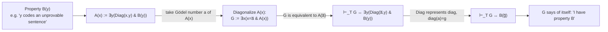
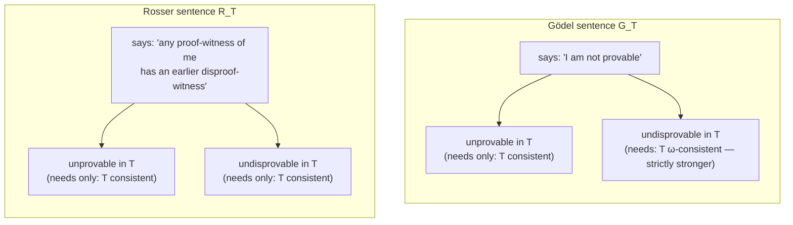

# The Diagonal Lemma and the Limitative Theorems

[[book-guidelines|↩ Back to guidelines]]

## Why this chapter exists: making self-reference *rigorous*, not just clever

Every account of Gödel's theorem eventually gestures at a sentence that "talks about itself" — something in the spirit of the Liar paradox ("this sentence is false"), except aimed at *provability* instead of *truth*. The gesture is easy. The hard part, and the actual content of this chapter, is showing that a formal system of arithmetic — a system whose only vocabulary is $0$, $S$ (successor), $+$, $\cdot$, $<$, and $=$ — can build a sentence that genuinely refers to its own Gödel number, without smuggling in anything like quotation marks or a `self` keyword.

What breaks without this: without a rigorous self-reference mechanism, "this sentence is unprovable" is just wordplay — you can say it in English, but you cannot point to an actual first-order formula in the language of arithmetic that has this property, and so you cannot *prove* anything about formal systems from it. The entire content of the chapter is the machinery that turns an informal paradox into a formal theorem.

Two earlier results are the prerequisites this chapter assembles:

- **Arithmetization of syntax** (Ch. 15): every expression, sentence, and proof of the language of arithmetic can be coded as a natural number — its **Gödel number** — via a computable coding scheme, so that syntactic properties ("is a proof of," "is a well-formed formula") become *recursive relations on numbers*.
- **Representability in $Q$** (Ch. 16): every recursive function is *representable* — there is a formula of arithmetic that, provably in $Q$ (Robinson arithmetic, a famously weak but computationally adequate base theory), computes exactly that function's graph.

Put those two together and you get the sentence this article is about: a formal system of arithmetic can encode facts about *its own* sentences and proofs as facts about *numbers*, and — because representability lets it *prove* things about those numbers — it can therefore prove things about its own syntax. That closes the loop. Self-reference stops being metaphor and becomes an actual, constructible formula.

This article presupposes Ch. 15–16 as background (Gödel numbering, representability in $Q$) rather than re-deriving them — see the companion article on arithmetization and representability if you need that groundwork restated.

## The diagonalization trick

### The idea, before the symbols

Suppose you have a formula $A(x)$ with one free variable, and you want to build a sentence that says "$A$ holds of *my own* Gödel number." The obvious approach — write down $A$, compute its Gödel number $a$, then plug the numeral $\overline{a}$ in for $x$ — doesn't quite work, because the *result* of that substitution, $A(\overline{a})$, is a *new* expression with its *own*, different Gödel number. You'd be chasing your tail: the number $a$ was the code for $A(x)$, not for $A(\overline{a})$.

The book's fix is the **diagonalization** operation. Given any expression $A$, define its diagonalization as

$$\exists x\, (x = \overline{A} \;\&\; A)$$

(where $\overline{A}$ is the *Gödel numeral* for $A$ — literally the numeral $0$ with $a$ accent marks, where $a$ is $A$'s Gödel number; think of it as "the digit-string spelling of $A$'s code number, written inside the object language"). When $A$ is a one-variable formula $A(x)$, this diagonalized sentence is logically equivalent to $A(\overline{A})$ — but crucially it is built compositionally, so we can talk about *its own* Gödel number using a computable function, without a chicken-and-egg problem. If $a$ is $A$'s Gödel number, there is a **recursive function** `diag` such that `diag(a)` is the Gödel number of $A$'s diagonalization. That's the technical hinge: diagonalization is a *computable operation on codes*, so — by representability — the formal system can reason about it internally.

If you've worked with quoted/quasi-quoted code (Lisp's `` ` `` and `,`, or a macro system that needs to build an AST node representing "a call to myself"), this is the same shape of problem: you can't just paste your own source text into itself naively, because the paste site changes the numbering/structure. Diagonalization is the disciplined version of "quote yourself, then splice."

### The Diagonal Lemma itself

> **17.1 Lemma (Diagonal lemma).** Let $T$ be a theory containing $Q$. Then for any formula $B(y)$ there is a sentence $G$ such that
> $$\vdash_T G \leftrightarrow B(\overline{G})$$

Read this as: **for any property $B$ you can express, you can construct a sentence $G$ that (provably, in $T$) asserts "I have property $B$."** $B$ is arbitrary — "is unprovable," "is not self-applicable," "denominates a huge number" — the lemma manufactures a witness for *any* such $B$.

**Proof sketch (the book's construction).** Let $A(x) := \exists y\, (\mathrm{Diag}(x,y) \;\&\; B(y))$, where $\mathrm{Diag}(x,y)$ represents the `diag` function in $T$ (this is where representability from Ch. 16 does the work). Let $a$ be $A(x)$'s Gödel number and let $G$ be $A(x)$'s diagonalization, i.e. $\exists x (x=\overline a \;\&\; A(x))$. By construction $G$ is logically equivalent to $A(\overline a)$, i.e. to $\exists y(\mathrm{Diag}(\overline a, y) \;\&\; B(y))$. But $\mathrm{Diag}$ represents `diag`, and $\mathrm{diag}(a)$ is by definition $g$, the Gödel number of $G$ itself — so $T$ proves $\mathrm{Diag}(\overline a, y) \leftrightarrow y = \overline g$. Substituting collapses the existential to $B(\overline g)$, i.e. $B(\overline G)$. The chain of equivalences is entirely mechanical once representability is granted; nothing in it depends on knowing what $B$ *means*.

The key move to hold onto: $G$ doesn't get built by "solving an equation for a self-referential sentence" the way you might picture a fixed-point combinator. It's built by encoding the diagonalization operation itself as a formula, then diagonalizing *that*. This is structurally identical to Curry's paradox / the Y-combinator trick in lambda calculus — a fixed point is manufactured, not found. If you know `Y f = f (Y f)`, the diagonal lemma is arithmetic's version of the same self-application move, except every step has to survive being expressed in a first-order theory with only $+, \cdot, <$.

**What breaks without this lemma:** every result in the rest of the chapter — Tarski's theorem, essential undecidability, Gödel's first incompleteness theorem, the Gödel and Rosser sentences — is a specific instantiation of $B(y)$ plugged into this one construction. Without the lemma, each of those would need its own bespoke, ad hoc self-referential gadget (and historically, before Gödel, no one had one). The lemma is the reusable engine; the rest of the chapter is choosing which $B$ to feed it.

**Rust/Lean grounding.** This construction *is* a quine-generator, formalized. A quine is a program $p$ such that running $p$ prints $p$'s own source; the diagonal lemma is the proof-theoretic analogue: a sentence $G$ such that $T$ proves $G$ is (materially) equivalent to whatever $B$ says about $G$'s own code. In Lean, this maps almost literally onto how a self-referential term is built via `Nat.rec`/well-founded recursion over an encoding of terms — you don't get self-reference by naming things circularly in the syntax; you get it by having a total, computable encode/decode pair (here, Gödel numbering) and then applying a function to *its own code*. If you were implementing a toy version of this in Rust, the closest shape is: given a function `fn make_self_ref(b: impl Fn(u64) -> Formula) -> Formula` that, given a *property-of-codes* closure, returns a formula whose code, when fed to `b`, yields something provably equivalent to the formula itself — this is exactly a fixed-point combinator specialized to the "quote your own encoding" domain, and it only type-checks (so to speak) because `diag` is representable, i.e. total and computable.

## The engine's first product: no formula defines "is a theorem of T"

The chapter's actual sequence of results is a cascade — each theorem is a two- or three-line corollary of the one before it, because the diagonal lemma has already done the hard work. Boolos, Burgess & Jeffrey structure it exactly that way ("the limitative theorems come tumbling out in rapid succession"), and it's worth preserving that structure rather than treating each theorem as an independent achievement.

### Lemma 17.2 — undefinability of the theorem set

> **17.2 Lemma.** Let $T$ be a consistent theory extending $Q$. Then the set of Gödel numbers of theorems of $T$ is not definable in $T$.

**Proof idea.** Suppose, for contradiction, that some formula $\theta(y)$ *defined* $T$'s theorem set — i.e. $\theta(\overline n)$ is a theorem of $T$ exactly when $n$ is the code of a theorem of $T$. Apply the diagonal lemma to $B(y) := \sim\theta(y)$: you get a sentence $G$ with $\vdash_T G \leftrightarrow \sim\theta(\overline G)$ — $G$ says "*I am not a theorem*." Now run the two cases:

- If $G$ *is* a theorem of $T$, then (since $\theta$ defines the theorem set) $\theta(\overline G)$ is provable — but $G \leftrightarrow \sim\theta(\overline G)$ is also provable, so $\sim G$ is provable, and $T$ is inconsistent.
- If $G$ is *not* a theorem, then $\sim\theta(\overline G)$ is provable (since $\theta$ correctly defines the *non*-membership too, given the biconditional is a theorem), which by the equivalence makes $G$ itself provable — contradiction again.

Either way you get an inconsistency, so no such $\theta$ can exist, *provided $T$ is consistent*. This is the Liar paradox, precisely defanged: instead of concluding "contradiction, something is wrong with the world," we conclude "contradiction, therefore our assumption (that $\theta$ defines provability) was false." The paradox becomes a proof by contradiction against a specific hypothesis, which is exactly how you turn a philosophical puzzle into a mathematical theorem.

**What breaks without this:** if a theory's own provability predicate were internally definable and *complete* with respect to that theory's own judgments, the theory could reflect perfectly on itself — and Lemma 17.2 says this is never possible for anything containing $Q$. This is the seed of every impossibility result that follows; it's worth sitting with before moving on, because everything else in the chapter is a corollary of it or a direct sibling construction.

### Theorem 17.3 — Tarski's theorem (indefinability of truth)

> **17.3 Theorem (Tarski's theorem).** The set of Gödel numbers of sentences of the language of arithmetic that are correct (true in the standard interpretation) is not arithmetically definable.

The proof is almost free: take $T$ to be *true arithmetic* itself (the theory whose theorems are exactly the sentences true in the standard interpretation of $\mathbb{N}$). It's consistent and extends $Q$; "arithmetically definable" just means "definable in this theory." Lemma 17.2 then says directly: the theorem-set of true arithmetic (= the set of true sentences) is not definable within arithmetic.

**Why this matters, in plain terms:** there is no formula $\mathrm{True}(x)$ in the language of arithmetic such that, for every sentence $A$, $\mathrm{True}(\overline{\ulcorner A \urcorner})$ is true exactly when $A$ is true. Truth about arithmetic cannot be captured *inside* arithmetic. Any attempt to define such a predicate would let you build a Liar sentence ("I am not true") and derive a contradiction from the definition itself — Tarski's theorem is the formal version of "the Liar paradox proves that no consistent formal system can contain its own, fully general truth predicate."

**What breaks without this:** if $\mathrm{True}$ *were* definable, you could add axioms schemas about it and reason about semantics as freely as you reason about syntax — arithmetic would be semantically self-sufficient. It isn't, and this is precisely why the book had to route provability through a separate, syntactic route (proofs as finite objects, coded and reasoned about combinatorially) rather than ever trying to formalize "truth" directly — provability and truth are forced apart from the very start of the enterprise.

### Theorem 17.4 — undecidability of arithmetic; 17.5 — essential undecidability; 17.6 — Church's theorem

Three more corollaries fall out fast:

- **17.4:** since every *recursive* set is definable in arithmetic (a fact from earlier chapters), and the set of true sentences is *not* definable (17.3), the set of true sentences cannot be recursive. Assuming [[Recursive-Function-Theory#Church's thesis|Church's thesis]], there is **no algorithm** that decides, given an arithmetic sentence, whether it's true.
- **17.5 (essential undecidability):** apply Lemma 17.2 directly to *any* consistent extension $T$ of $Q$ (not just true arithmetic) — the theorem set of $T$ is not definable in $T$, hence (again via "recursive $\Rightarrow$ definable") not recursive. **No consistent extension of $Q$ is decidable — including $Q$ itself.** This is the strongest form: it isn't a fact about one particular theory, it's a structural fact that *infects every extension*, however you strengthen $Q$ (short of inconsistency). That's the sense of "essential" — undecidability is not a fixable defect of a badly-chosen axiom set; it is unavoidable for *any* theory that says at least as much as $Q$ does.
- **17.6 (Church's theorem):** by reducing "$A$ is a theorem of $Q$" to "$(\sim C \lor A)$ is valid" (where $C$ is the conjunction of $Q$'s axioms) via a *recursive* translation, undecidability of $Q$'s theorem set transfers to undecidability of **logical validity itself** — first-order validity is not decidable. (This chapter re-derives Church's theorem as a clean corollary of the diagonal-lemma machinery; the book proves it independently in Ch. 11 too, via a direct reduction from the halting problem — seeing both routes is instructive, since 17.6 shows the *arithmetic* route arrives at the same destination.)

Note the contrast the book is careful to flag: the theorem sets in question are all **semirecursive** (recursively enumerable) — in principle you can search forever through all proofs and eventually confirm a true theorem or a valid sentence. What's impossible is a procedure that also correctly reports "no" in finite time on the non-theorems. Semi-decidability survives; full decidability doesn't.

### Theorem 17.7 — Gödel's first incompleteness theorem

> **17.7 Theorem (Gödel's first incompleteness theorem).** There is no consistent, complete, axiomatizable extension of $Q$.

The proof, now, is a one-liner given the machinery already built: any *complete* axiomatizable theory is automatically decidable (from an earlier chapter — completeness plus semi-decidability of both "provable" and "refutable" gives you a terminating decision procedure: search proofs of $A$ and of $\sim A$ in parallel, one of the two searches must terminate). But Theorem 17.5 says no consistent extension of $Q$ is decidable. So no consistent extension of $Q$ can be complete either.

This is the headline result, but notice how little independent content it has *at this point in the chapter* — it's essentially "decidability's corollary, contraposed." The genuinely hard mathematical work was building the diagonal lemma and proving Lemma 17.2; incompleteness itself falls out for free once you have essential undecidability plus the completeness-implies-decidability fact.

**"Sufficiently strong" formal systems.** The book is precise about what generality this buys you: any axiomatizable theory (one whose axiom set is at least *recursively* specifiable — "formal system" is defined to mean exactly this) that extends $Q$, or that merely has a *translation* of $Q$'s vocabulary and axioms into it (so that ordering, successor, etc. are expressible and $Q$'s axioms provable under translation), inherits incompleteness if consistent. This covers essentially every serious foundational system, including ZFC — "sufficiently strong" is not a vague slogan, it cashes out as "interprets $Q$."

**The deepest one-sentence upshot** the book offers: *truth and provability are not the same notion, in any formal system*. That's really what 17.3 through 17.7 jointly establish — provability is always a strictly smaller, syntactically-generated approximation to truth, and no amount of adding axioms closes that gap (short of inconsistency, at which point everything is "provable" and the notion becomes worthless anyway).

## Naming names: explicit undecidable sentences (§17.2)

Theorem 17.7 is an *existence* proof — it shows undecidable sentences must exist for any consistent axiomatizable $T \supseteq Q$, but the proof (via decidability-of-complete-theories) doesn't hand you one. Section 17.2 fixes that by constructing two named examples directly via the diagonal lemma.

First, some vocabulary: a sentence is **disprovable in $T$** if its negation is a theorem of $T$; it's **undecidable for $T$** if it's neither provable nor disprovable. (Don't confuse this with an **undecidable theory** — true arithmetic is a theory with *no* undecidable sentences at all, since every sentence is either true-hence-provable or false-hence-disprovable *in that theory specifically* — yet as Theorem 17.4 showed, true arithmetic is still an undecidable theory in the algorithmic sense, because there's no procedure that sorts sentences into the two piles.)

Because "$y$ codes a proof of $x$ in $T$" is a rudimentary (hence representable) relation when $T$'s axioms are recursive, we get formulas
$$\mathrm{Prv}_T(x) := \exists y\, \mathrm{Prf}_T(x,y), \qquad \mathrm{Disprv}_T(x) := \exists y\, \mathrm{Disprf}_T(x,y)$$
where $\mathrm{Prf}_T(x,y)$ reads "$y$ is a witness to the provability of $x$ in $T$" — think of it as `verify_proof(claim: u64, proof: u64) -> bool`, a decidable checker, existentially quantified over "some proof exists" to get semi-decidable provability.

### The Gödel sentence

Apply the diagonal lemma with $B(y) := \sim \mathrm{Prv}_T(y)$:
$$\vdash_T G_T \leftrightarrow \sim\exists y\, \mathrm{Prf}_T(\overline{G_T}, y)$$
$G_T$ **says of itself that it is unprovable in $T$.**

> **17.9 Theorem.** For $T$ consistent, axiomatizable, extending $Q$: $G_T$ is unprovable in $T$; if $T$ is also **$\omega$-consistent**, $G_T$ is also undisprovable in $T$.

The unprovability half is clean: if $G_T$ were provable, the ∃-rudimentary "witness exists" sentence would be true and hence provable, but that's exactly $\sim G_T$ by the biconditional — inconsistency. So $\not\vdash_T G_T$, period, for any consistent $T$.

The undisprovability half needs an extra hypothesis. A theory is **$\omega$-inconsistent** if it proves $\exists x\, F(x)$ while also proving $\sim F(\overline 0), \sim F(\overline 1), \sim F(\overline 2), \dots$ for *every* individual numeral — it claims "some number has property $F$" while separately refuting every specific candidate. This is a strictly stronger defect than ordinary inconsistency: the individual claims $\sim F(0), \sim F(1), \ldots$ are all jointly compatible, but they clash with the existential in the *standard model*, even though no finite subset of them derives a literal contradiction. The book supplies a genuine example: $T = Q + \sim G_Q$ is consistent (since $G_Q$ isn't already a theorem of $Q$) but $\omega$-inconsistent, because it proves $\exists y\, \mathrm{Prf}_Q(\overline{G_Q}, y)$ while every individual $\sim \mathrm{Prf}_Q(\overline{G_Q}, \overline n)$ remains provable too. If $G_T$ *were* disprovable, you'd be able to derive exactly this pathological shape — so ruling it out requires the extra assumption.

**What breaks without $\omega$-consistency:** you lose the guarantee that $G_T$ is genuinely undecided rather than outright false-and-refutable. $\omega$-consistency is the assumption that closes that gap, and it's *stronger* than mere consistency — this is precisely why the Rosser sentence (below) is the more celebrated technical achievement: it gets full undecidability from consistency alone.

### The Rosser sentence — trading a stronger hypothesis for a smarter formula

Apply the diagonal lemma to a cleverer $B$:
$$\vdash_T R_T \leftrightarrow \forall y\,(\mathrm{Prf}_T(\overline{R_T}, y) \to \exists z<y\, \mathrm{Disprf}(\overline{R_T}, z))$$
$R_T$ **says: "for any witness to my provability, there's an *earlier* witness to my disprovability."** This is the "earlier witness" trick: instead of a flat denial of provability, $R_T$ races proof against disproof and bets that disproof always wins if provability ever shows up.

> **17.8 Theorem.** For $T$ consistent, axiomatizable, extending $Q$: $R_T$ is undecidable for $T$ — **full stop, no $\omega$-consistency needed.**

**Proof shape (both halves are symmetric race arguments):**

- Suppose $R_T$ is provable, witnessed by some number $a$. Consistency means $R_T$'s negation isn't also provable, so nothing witnesses disproof — in particular nothing *before* $a$ does. That fact ("$a$ proves it, and no disproof-witness precedes $a$") is itself a *rudimentary*, hence decidable-and-true-hence-$Q$-provable, statement. But that statement directly contradicts the defining biconditional of $R_T$ (which says: *any* proof-witness must have an *earlier* disproof-witness) — forcing $\vdash_T \sim R_T$, so $T$ is inconsistent. Contradiction; so $R_T$ isn't provable.
- Symmetrically, suppose $R_T$ is disprovable, witnessed by $m$. No proof-witness exists at all (by consistency), certainly none $\le m$. Again this fact is rudimentary and provable in $T$, and pure logic combined with $Q$'s ordering axioms ($\forall y (y<m \lor y=m \lor m<y)$) forces the universal biconditional defining $R_T$ to hold — so $\vdash_T R_T$, contradiction again.

Both directions only need *consistency*, never $\omega$-consistency, because the "earlier witness" clause converts the argument into a purely finitary race that Q's ordering axioms can settle outright, sidestepping the need to reason about *all* numerals simultaneously the way the plain Gödel sentence's undisprovability argument did.

**Historical note the book flags explicitly:** $G_T$ came first (hence "Gödel sentence"), and $R_T$ was Rosser's later refinement — so $R_T$ is sometimes called the **Gödel–Rosser sentence**. The refinement matters practically: it strips out an unnecessary hypothesis ($\omega$-consistency) via a more careful formula design, which is a recurring shape of progress in this area — the *result* stays the same, but a smarter construction gets there under weaker assumptions.

## Beyond the diagonal lemma: paradox-shaped constructions (§17.3, optional)

The diagonal lemma is, in the book's words, "the cleverest idea in the proof" and the one popular accounts fixate on — but it isn't the *only* route to an unprovable truth, once arithmetization and representability are in place. Section 17.3 works through three more, each adapting a *different* classical semantic paradox by substituting "provable" for the paradox's original semantic notion (truth, self-applicability, nameability). This substitution is the recurring trick across the whole section: take a paradox that's contradictory when phrased in terms of *truth*, replace "true" with "provable," and the same argument shape that produced a contradiction instead produces a **true-but-unprovable** sentence, because provability (unlike truth) is not forced to coincide with the semantic fact.

- **Gödel–Grelling** (from the *heterological paradox* — "is 'heterological' heterological?"): define $m$ to be **self-applicable in $Q$** if $m$ codes a formula $\mu(x)$ such that $\mu(\overline m)$ is provable. Build $GG(x)$ expressing "$x$ is not self-applicable," let $m$ be $GG$'s own code. If $m$ were self-applicable, $GG(\overline m)$ would be provable-hence-true, contradicting what it says. So $m$ is *not* self-applicable — meaning $GG(\overline m)$ is **true but unprovable** (if it were provable, that itself would make $m$ self-applicable).

- **Gödel–Berry** (from *Berry's paradox* — "the least integer not nameable in under nineteen syllables," itself just named in eighteen): a number $n$ is **denominable in $Q$** by $\varphi(x)$ if $\forall x(\varphi(x) \leftrightarrow x=\overline n)$ is *provable*. Every number is trivially denominable (worst case, by $x = \overline n$ itself), but only finitely many numbers under any fixed symbol-count bound $k$ can be denominated by formulas shorter than $k$ symbols (finitely many formulas exist below that length, up to [[Metalogical-Notions#Logical equivalence|logical equivalence]]). So for the specific bound $10\Uparrow 10$ (super-exponentiation — vastly larger than the particle count of the visible universe, yet nameable in a formula no longer than "an ordinary homework assignment," since it's just $\varphi(10,10,x)$ for the super-exponential-representing formula), there is some *least* number $n$ not denominable by any formula shorter than $10\Uparrow 10$ symbols. The Gödel–Berry formula $GB(x,y)$ expresses exactly "$x$ is that least non-denominable number relative to bound $y$." $GB(\overline n, \overline{10})$ is true, but if it (or its defining biconditional) were provable, that proof would itself denominate $n$ by a formula far shorter than the bound — contradiction. True but unprovable again.

- **Gödel–Chaitin** (complexity-theoretic, foreshadowing Kolmogorov/Chaitin complexity): define the **complexity** of $n$ as the length of the shortest formula denominating it. $GC(x)$ expresses "$x$'s complexity exceeds $10\Uparrow 10$" — true of all but finitely many $n$. **Chaitin's theorem:** *no specific instance* $GC(\overline n)$ is ever provable. Sketch: if any instance were provable, there'd be a *least* proof-witness overall (a "lead witness"), identifying some specific $n$; but the very fact "$m$ is the lead witness, and identifies $n$" is itself expressible by a short (∃-rudimentary, hence provable-when-true) formula — which would denominate $n$ using a formula far shorter than $10\Uparrow 10$ symbols, contradicting $GC(\overline n)$'s own content. So the bound can never be certified for any concrete number, however large that number actually is. The book notes the Turing-machine version of this (complexity = minimum states needed to output $n$ from a blank tape) is the one usually labeled "Chaitin's theorem" in the literature, using computability (not just representability) as the extra ingredient — but the underlying argument shape is identical.

**What these three constructions share, structurally, with the Gödel sentence:** every one of them is a **fixed-point-flavored diagonal argument dressed as a semantic paradox**, but note carefully — §17.3's whole point is that you don't need to invoke the *diagonal lemma itself* to get these; the finiteness/counting arguments (only finitely many short formulas exist) manufacture the needed witness directly, without going through `diag`. A diagonal argument is still buried in there (the book flags this explicitly for the "no semirecursive-non-recursive-set" route in Problem 17.1), but it's not the *packaged* diagonal lemma — it's the raw pigeonhole/counting argument that the diagonal lemma itself is built from. This is a useful thing to notice: the diagonal lemma is a convenient, reusable *packaging* of a self-reference technique, not the only possible source of unprovable truths.

## Where this leads

**Backward dependency.** This chapter is the payoff of the entire arithmetization + representability apparatus (Ch. 15–16): those chapters exist *for* this one. Everything here in turn depends on nothing past Ch. 16 — it's a clean, self-contained capstone on that machinery.

**Forward dependency.** Gödel's *second* incompleteness theorem (Ch. 18, next) reuses the diagonal lemma one more time — applying it to a formula built from an abstracted "provability predicate" $B(x)$ satisfying three formal properties (P1–P3), to prove that a consistent, sufficiently strong theory cannot prove its own consistency statement. Löb's theorem, in that chapter, is *also* just the diagonal lemma applied to $B(y) \to A$. In other words: everything in this article is a warm-up for one more diagonal-lemma application, not a closed chapter of results — the diagonal lemma is the single reusable tool underlying essentially all of the book's "limitative" metatheorems, including (much later) the arithmetical soundness/completeness results connecting the modal logic of provability (GL) back to $P$.

**Bearing on the reader's Rust verifier / Lean elaborator project.** This is worth stating plainly rather than leaving implicit: **this chapter is the formal reason a general-purpose self-verifying theorem prover cannot exist.** Concretely —

- If your Rust verifier's specification language (its clause/Hoare-triple language) is expressive enough to *interpret* $Q$ — i.e. it can encode natural numbers, successor, and enough arithmetic to represent recursive functions (which almost any realistic Hoare-logic or dependent-contract language will, once you allow integers and loops/recursion) — then **Theorem 17.7 applies to it directly**: your verifier's own proof system, if consistent, is *necessarily incomplete*. There will be true program properties it can neither prove nor refute, no matter how many valid inference rules you add — short of making the system inconsistent, which is worse. This isn't a bug to eventually engineer away; it's a mathematical ceiling on the entire category of system.
- More sharply: **Lemma 17.2 says your verifier cannot even internally *define* its own "is provable" predicate** in a way that agrees with its actual provability relation — which is precisely why real proof assistants (Lean's kernel included) keep the *trusted checker* (a small, terminating, purely syntactic proof-checking function — analogous to $\mathrm{Prf}_T(x,y)$'s decidable "$y$ is a witness" role here) strictly separate from any *internal* reflection or meta-reasoning the system does about itself. The chapter is the theoretical justification for the standard "small trusted kernel + untrusted elaborator/tactics" architecture: you cannot get a system to fully certify its own soundness from the inside (this sharpens further into Gödel's *second* theorem next chapter — a system that could prove its own consistency would, by Löb's theorem, prove anything).
- The Rosser-sentence technique — win undecidability from bare consistency by racing a proof-search against a disproof-search and committing to "whichever finishes with an earlier witness" — is a genuinely reusable proof-engineering pattern, not just a historical curiosity: whenever you're designing a decision procedure or completeness argument for a fragment of your verifier's logic, and a naive semi-decidability argument needs an unavailable extra hypothesis (like $\omega$-consistency here), asking "can I convert this into a race between two finitary, rudimentary-decidable searches instead" is exactly the move Rosser made, and it's the kind of trick worth having on hand.

The upshot for the project: your verifier should be architected around a small, complete-*for-its-own-narrow-checking-job* trusted kernel (checking `Prf(x, y)`-style witnessed proofs is exactly the finitary task that stays decidable, per this chapter) rather than aimed at a self-certifying, fully self-reflective ideal — the latter is not an engineering shortfall, it is provably unattainable for any system with this chapter's minimal expressive power.
