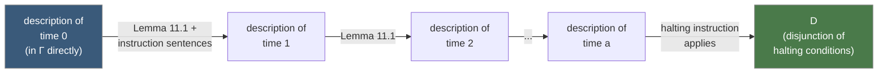

# The Undecidability of First-Order Logic

[[book-guidelines|↩ Back to guidelines]]

## Why this chapter has to exist

Chapters 9–10 gave you first-order logic as a formal system: a precise syntax, a precise semantics (truth in an interpretation), and — eventually — a proof calculus. Chapter 4 gave you the halting problem as a hard limit on computation. This chapter's entire job is to slam those two things together: it shows that **the decision problem for logical implication** — "given a finite set of sentences $\Gamma$ and a sentence $D$, does $\Gamma$ imply $D$?" — is *itself* algorithmically unsolvable. Not merely hard. Unsolvable, in exactly the sense the halting problem is unsolvable, because it turns out to literally *be* an encoding of the halting problem (and, independently, of another uncomputable problem about primitive recursive functions).

This matters because first-order logic looks, on the surface, like it should be the friendliest possible target for automation. It's finitary, its rules are combinatorial, and (as later chapters show) it even has a complete proof procedure — every implication that holds has a finite proof. "Complete" sounds like it should mean "and therefore checkable by machine." **Church's theorem is the statement that completeness and decidability are different properties, and first-order logic has the first without the second.** You can search for a proof and you'll find it if one exists (that's semidecidability — proof search terminates on the "yes" instances). But there is no algorithm that, given an arbitrary $\Gamma$ and $D$, always terminates with a correct yes-or-no answer. If $\Gamma$ does *not* imply $D$, an algorithm that only searches for proofs will search forever, and nothing about first-order logic gives you a way to know in advance that it should stop.

The chapter proves this twice, independently, using two different reductions:

1. **§11.1 — reduce the halting problem to it.** Given any Turing machine $M$ and input $n$, effectively construct a finite $\Gamma$ and sentence $D$ such that $\Gamma \vDash D$ iff $M$ halts on $n$. A decision procedure for implication would give you a decision procedure for halting — impossible, by [[Turing-and-Abacus-Computability#Turing's thesis|Turing's thesis]] (Chapter 4).
2. **§11.2 — reduce the nullity problem for primitive recursive functions to it.** Given a two-place primitive recursive $f$, effectively construct a $\Gamma$ and formula $D(x)$ such that $\Gamma \vDash D(m)$ iff $\exists n.\ f(m,n) = 0$. A decision procedure for implication would give you a decision procedure for nullity — impossible for some $f$, by [[Recursive-Function-Theory#Church's thesis|Church's thesis]] (Chapter 8).

Both proofs conclude the same theorem, **Church's theorem**, by two genuinely different routes, and the book flags both as strictly "optional" for the reader in a hurry — a *third*, thesis-independent proof arrives later (Chapter 15, via arithmetization). But the two reductions here are worth understanding on their own terms, because the *technique* — encoding a computation's behavior as a set of logically-entailing sentences — is a reusable pattern, not just a proof you take on faith.

**What breaks without this.** If logical implication *were* decidable, you'd have, for free, a decision procedure for the halting problem (run the reduction, then the decider). Since Chapter 4 already proved no such halting-decider exists, something upstream has to give — and it's the assumption that logic is decidable. This is the general shape of every undecidability transfer in the book: you don't re-prove undecidability from scratch each time, you build a *reduction* from a problem you already know is undecidable.

## §11.1: encoding a Turing machine's run as a set of sentences

### The setup: a language that talks about tape history

The construction needs a first-order language whose standard interpretation $\mathcal{M}$ literally *is* the running history of the machine. The domain is all the integers (positive, negative, and zero) — doing double duty as both **time steps** ($t \geq 0$) and **tape square positions** (squares numbered $\ldots, -2, -1, 0, 1, 2, \ldots$, with the machine starting on square $0$).

The vocabulary:

| Symbol | Arity | Meaning in $\mathcal{M}$ |
|---|---|---|
| $0$ | constant | the integer zero |
| $S$ | 2-place | successor: $Suv$ iff $v = u+1$ |
| $<$ | 2-place | the usual integer order |
| $Q_i$ | 1-place (one per nonhalted state $i$) | $Q_i t$ iff at time $t$ the machine is in state $i$ |
| $@$ | 2-place | $@tx$ iff at time $t$ the machine is scanning square $x$ |
| $M$ | 2-place | $Mtx$ iff at time $t$, square $x$ is marked (has a stroke) |

Note what's *not* here: no direct arithmetic, no "plus," nothing beyond successor and order. Every fact about the machine's run — where it is, what state it's in, what's written where — has to be spelled out using only these predicates. That constraint is exactly what forces the encoding to be interesting.

**What breaks without this.** If you allowed richer machinery (say, full Peano arithmetic already baked in), you'd be smuggling in computational power you haven't justified yet — the whole point is to build the encoding out of a minimal, purpose-built vocabulary and show the reduction still goes through.

### Background axioms and derived shorthand

$\Gamma$ opens with three "background" sentences, true under any machine/input, pinning down $S$ and $<$ as functional successor and strict total order:

$$
\begin{aligned}
&(1)\quad \forall u\forall v\forall w\big(((Suv \mathbin{\&} Suw) \to v=w) \mathbin{\&} ((Svu \mathbin{\&} Swu) \to v=w)\big) \\
&(2)\quad \forall u\forall v(Suv \to u<v) \mathbin{\&} \forall u\forall v\forall w((u<v \mathbin{\&} v<w) \to u<w) \\
&(3)\quad \forall u\forall v(u<v \to u \neq v)
\end{aligned}
$$

From these, the book derives (as pure *logical consequences*, not new axioms) an $m$-fold successor predicate $S^m$, defined recursively: $S^0uv$ abbreviates $u=v$, $S^1uv$ abbreviates $Suv$, $S^2uv$ abbreviates $\exists y(Suy \mathbin{\&} Syv)$, and so on. This lets the theory talk about "$v$ is $m$ steps after $u$" without a general addition symbol — you build exactly as much arithmetic as the proof needs and no more. Numerals for specific integers ($\overline{2}$, $\overline{-1}$, etc.) are then just abbreviations for $S^m(0, y)$, so a sentence like $\overline{p} = \overline{q}$ (for numerically distinct $p, q$) is *provably* true whenever $p = q$ and provably false-implying otherwise — this bookkeeping (facts (4)–(11) in the text) is what makes it possible to write compact, numeral-indexed sentences later.

**Rust grounding.** This layered "define richer relations as syntactic sugar over a minimal kernel, then prove sugar-level facts as consequences of kernel axioms" move is precisely what you do when you build a small logic kernel and grow a surface language on top of it without enlarging the trusted core:

```rust
// Kernel vocabulary: only successor and order are primitive.
enum Atom {
    Succ(Term, Term),   // S u v
    Lt(Term, Term),     // u < v
}

// S^m is *not* a new primitive predicate — it's an iterated
// existential built purely from `Succ`, exactly like the book's (S^2), (S^3), ...
fn nth_successor(m: u32, u: Term, v: Term) -> Formula {
    match m {
        0 => Formula::Eq(u, v),
        _ => {
            let y = Term::fresh_var();
            Formula::Exists(y.clone(), Box::new(Formula::And(
                Formula::Atom(Atom::Succ(u, y.clone())),
                nth_successor(m - 1, y, v),
            )))
        }
    }
}
```

Nothing about `nth_successor` extends the kernel's proof rules — every formula it produces is checked with the same three inference facts baked into `Succ`. That's the discipline the book is modeling: derived notation, not derived trust.

### The description of a configuration

The single most important idea in §11.1 is the **description of time $a$**: one sentence that pins down the *entire* machine configuration at time $a$ — current state, current square, and every marked square, with an explicit closing clause saying "and nothing else is marked":

$$
Q_i a \mathbin{\&} @ap \mathbin{\&} Ma\overline{q_1} \mathbin{\&} \cdots \mathbin{\&} Ma\overline{q_m} \mathbin{\&} \forall x\big((x\neq \overline{q_1} \mathbin{\&} \cdots \mathbin{\&} x \neq \overline{q_m}) \to \neg Max\big)
$$

That last conjunct is doing real work: without it, the sentence would only assert which squares *are* marked, leaving every square's blank-ness unconstrained — and the whole reduction depends on being able to derive, from the description alone, whether the machine is currently scanning a blank or a stroke (needed to know which instruction applies next).

The set $\Gamma$ contains exactly *one* configuration sentence outright: the **description of time 0**, encoding "state 1, scanning square 0, squares $0$ through $n$ marked (the unary-coded input $n$), everything else blank." Every other configuration — time $1$, time $2$, …, — is never asserted directly; it's *derived*.

### Instructions become implications; Lemma 11.1 does the induction

Each nonhalting instruction of the machine — "if in state $i$ scanning $e$, do (something) and go to state $j$" — becomes a universally quantified sentence in $\Gamma$ of the shape

$$
\forall t\forall x\big((Q_it \mathbin{\&} @tx \mathbin{\&} M_e tx) \to \exists u(Stu \mathbin{\&} \text{[effect]} \mathbin{\&} Q_ju \mathbin{\&} \text{[frame conditions]})\big)
$$

where "[effect]" fills in printing a symbol or moving a square, and the frame conditions assert that every square other than the one touched keeps its old marking. This is the same **frame problem** every state-transition formalization runs into — you have to say explicitly what *doesn't* change, or the sentence underdetermines the next configuration.

Halting instructions get no implication; instead each contributes a disjunct $\exists t\exists x(Q_it \mathbin{\&} @tx \mathbin{\&} M_e tx)$ to the target sentence $D$ — "the machine reaches a configuration where a halting instruction applies."

The engine that makes the whole thing work is:

> **Lemma 11.1.** If $a \geq 0$ and $b = a+1$ is a time at which the machine has not yet halted, then $\Gamma$ together with the description of time $a$ implies the description of time $b$.

This is a one-step **soundness** lemma for the encoding — "if the instruction-sentence is true and the current configuration is exactly this, the next configuration is exactly that" — proved case-by-case over the four instruction shapes (print blank, print stroke, move left, move right). What makes it earn the name "lemma" rather than "obvious fact" is precisely the frame-condition bookkeeping: showing that the untouched squares' markings really do survive the implication, using facts (9)–(11) about numeral inequality derived earlier.

Chaining Lemma 11.1 is where the induction happens: the description of time $0$ is *in* $\Gamma$; if the machine hasn't halted by time $1$, the description of time $1$ follows; if it hasn't halted by time $2$, the description of time $2$ follows from that; and so on. If the machine ever halts — say at time $a+1$ — then the description of time $a$ (now known to follow from $\Gamma$) makes the halting instruction's antecedent true, so $D$ follows. If the machine never halts, no finite chain of applications of Lemma 11.1 ever forces $D$, and indeed there's a genuine interpretation (the standard one, run forever) where every sentence of $\Gamma$ is true and $D$ is false — so $\Gamma \not\vDash D$.



**What breaks without this.** Lemma 11.1 is the entire reason the encoding is *finite*. Without an inductive step that lets one configuration's description entail the next, you'd need to bake the machine's whole (potentially unbounded) run directly into $\Gamma$ — which defeats the purpose, since $\Gamma$ has to be a *fixed, finite* set of sentences decided before you know whether or when the machine halts. The lemma is what turns "the machine happens to halt after $10^6$ steps" into "$D$ is a logical consequence of a $O(1)$-sized theory," by pushing all the step-count-dependent work into the length of a *proof* search, not the size of the *theory*.

**Rust grounding — the encoding as a compiler pass.** If you were implementing this reduction as code, it looks exactly like compiling a machine's instruction table into logical formulas, one instruction at a time:

```rust
enum Instruction {
    Print { state: StateId, scanned: Symbol, write: Symbol, next: StateId },
    Move   { state: StateId, scanned: Symbol, dir: Direction, next: StateId },
    Halt   { state: StateId, scanned: Symbol },
}

fn compile_instruction(instr: &Instruction) -> CompiledSentence {
    match instr {
        Instruction::Halt { state, scanned } =>
            // contributes one disjunct to D, not a Γ-sentence
            CompiledSentence::HaltDisjunct(halting_condition(*state, *scanned)),
        Instruction::Print { state, scanned, write, next } =>
            CompiledSentence::GammaAxiom(transition_axiom(
                *state, *scanned, Effect::Print(*write), *next,
            )),
        Instruction::Move { state, scanned, dir, next } =>
            CompiledSentence::GammaAxiom(transition_axiom(
                *state, *scanned, Effect::Move(*dir), *next,
            )),
    }
}
```

Every instruction compiles to exactly one formula, independent of every other instruction and independent of the input $n$ — the only input-specific part is the description-of-time-0 sentence. This is a genuine "reduction as compiler" — the machine table is the source program, $\Gamma \cup \{D\}$ is the target, and the compilation is total and effective (you never need to *run* the machine to produce it).

### Church's theorem, first proof (Theorem 11.2)

Putting the two directions together: $\Gamma \vDash D$ iff $M$ halts on $n$. So an oracle deciding logical implication would decide the halting problem — contradicting Chapter 4's result (given Turing's thesis). Hence:

> **Theorem 11.2 (Church's theorem).** The decision problem for logical implication is unsolvable.

## §11.2: encoding a primitive recursive build sequence instead

The second proof is independent of Turing machines entirely — it reduces a different uncomputable problem, phrased purely in terms of primitive recursive functions, and only needs Chapters 6–7 (primitive recursion) and 9–10 (first-order logic) plus one fact borrowed on faith from Chapter 8.

### The nullity problem

For a two-place primitive recursive $f$, the **nullity problem** asks: given $m$, is there some $n$ with $f(m,n)=0$? Chapter 8's apparatus shows (Problem 11.11 in the text) that there exists a primitive recursive $f$ for which this is *not* recursively decidable — a genuinely different uncomputable problem from halting, though it smells similar (it's an unbounded existential search with no a priori stopping bound).

### Build sequences become axioms, not tape configurations

Because $f$ is primitive recursive, it has a **build sequence**: a finite list $f_0, f_1, \ldots, f_r = f$ where each $f_i$ is either a basic function (zero function, successor, or a projection/identity function $\mathrm{id}^n_k$) or is obtained from strictly earlier functions in the list by composition or primitive recursion. Introduce one function symbol $\mathsf{f}_i$ per list entry, and let $\Gamma$ consist of a direct axiomatization of each step:

$$
\begin{aligned}
(1)&\quad \forall x\, \mathsf{f}_i(x) = 0 &&\text{[$f_i$ is the zero function]}\\
(2)&\quad \forall x\, \mathsf{f}_i(x) = x' &&\text{[$f_i$ is successor]}\\
(3)&\quad \forall x_1\cdots\forall x_n\, \mathsf{f}_i(x_1,\ldots,x_n) = x_k &&\text{[$f_i = \mathrm{id}^n_k$]}\\
(4)&\quad \forall \mathbf{x}\, \mathsf{f}_i(\mathbf{x}) = \mathsf{f}_k(\mathsf{f}_{j_1}(\mathbf{x}),\ldots,\mathsf{f}_{j_p}(\mathbf{x})) &&\text{[$f_i$ by composition]}\\
(5a)&\quad \forall \mathbf{x}\, \mathsf{f}_i(\mathbf{x},0) = \mathsf{f}_j(\mathbf{x}) &&\text{[primitive recursion, base case]}\\
(5b)&\quad \forall \mathbf{x}\forall y\, \mathsf{f}_i(\mathbf{x},y') = \mathsf{f}_k(\mathbf{x},y,\mathsf{f}_i(\mathbf{x},y)) &&\text{[primitive recursion, step case]}
\end{aligned}
$$

Notice the shape: **every one of the two defining clauses of primitive recursion turns directly into a first-order axiom.** There's no need for an analogue of "description of time $a$" or a step-by-step simulation lemma here, because primitive recursion's definition is already, structurally, a recursive equation — the logic doesn't have to *simulate* anything, it just has to *state* the defining equations and let implication do the unfolding.

Set $D(x) \equiv \exists y\, \mathsf{f}_r(x,y) = 0$. Then $D(\overline{m})$ is true in the standard interpretation iff $\exists n.\ f(m,n)=0$ — by construction, since $\mathsf{f}_r$ denotes $f$.

### Adequacy and Lemma 11.3

Call $\Gamma$ **adequate for $f_i$** if, whenever $f_i(\mathbf{a}) = b$ is *true*, then $\mathsf{f}_i(\overline{\mathbf a}) = \overline{b}$ is a *logical consequence* of $\Gamma$. Axioms (1)–(3) make $\Gamma$ trivially adequate for every basic function. The load-bearing result is:

> **Lemma 11.3.** (a) If $\Gamma$ is adequate for $f_k, f_{j_1}, \ldots, f_{j_p}$, then $\Gamma$ is adequate for any $f_i$ obtained from them by composition. (b) If $\Gamma$ is adequate for $f_j, f_k$, then $\Gamma$ is adequate for any $f_i$ obtained from them by primitive recursion.

The book proves (b) by exactly the induction you'd expect: define $c_p = f_i(\mathbf{a}, p)$ for $p \leq b$; adequacy for $f_j$ gives $\mathsf{f}_j(\overline{\mathbf a}, \overline 0) = \overline{c_0}$ as a $\Gamma$-consequence via (5a); adequacy for $f_k$ combined with (5b) gives each step $\mathsf{f}_i(\overline{\mathbf a},\overline p) = \overline{c_p} \to \mathsf{f}_i(\overline{\mathbf a},\overline{p'}) = \overline{c_{p'}}$; chaining these $b$ times (an *external*, meta-level induction on $p$, not a first-order induction axiom) reaches $\mathsf{f}_i(\overline{\mathbf a},\overline b) = \overline c$.

Since every function on the build sequence is either basic or built by one of the two processes Lemma 11.3 covers, $\Gamma$ is adequate for *all* of them, including $f_r = f$ itself. In particular if $f(m,n)=0$, then $\Gamma \vDash \mathsf{f}_r(\overline m,\overline n)=\overline 0$, hence $\Gamma \vDash \exists y\, \mathsf{f}_r(\overline m, y) = 0$, i.e. $\Gamma \vDash D(\overline m)$.

**What breaks without this.** Lemma 11.3 is doing exactly the job Lemma 11.1 did in §11.1 — it's the induction that converts a *finite, static* set of defining axioms into entailment of arbitrarily deep *computed facts*. Without it, adequacy for basic functions wouldn't propagate to composite ones, and $\Gamma$ would only ever entail facts about the primitive building blocks, never about $f$ itself.

**Lean grounding.** This section is, structurally, exactly what a Lean-style equation compiler does when it turns a recursive `def` into a set of defining equations plus an induction principle. Axioms (5a)/(5b) are the base case and step case of a structural recursion; Lemma 11.3(b) is precisely the statement that the equation compiler's output is *sound with respect to the intended semantics* — every concrete instance $f(a,b)$ you could compute by unfolding the recursion is provably equal (definitionally, in Lean's case) to what the equations say:

```lean
-- Compare to (5a)/(5b): Lean's structural recursion on ℕ generates
-- exactly this base/step equational shape as `@[simp]` lemmas.
def fi : ℕ → ℕ → ℕ
  | x, 0     => fj x            -- (5a)
  | x, y + 1 => fk x y (fi x y) -- (5b)

-- Lemma 11.3(b) is the semantic content of: these equations, applied
-- repeatedly, compute the *same* function fi is defined to be — i.e.
-- `fi x n` reduces (by rfl / unfolding) to the value you'd get by
-- literally chaining the equations n times, exactly as the book's
-- c_0, c_1, ..., c_b chain does.
example (x n : ℕ) : fi x n = fi x n := rfl
```

The book's adequacy argument is doing by hand, at the level of first-order provability, what Lean's kernel does automatically at the level of definitional equality (`rfl`/`isDefEq`) for structurally recursive definitions — same inductive unfolding, different formal home.

### Church's theorem, second proof (Theorem 11.4)

$\Gamma \vDash D(\overline m)$ iff $\exists n.\ f(m,n)=0$ (the "only if" direction is the usual soundness observation: every $\Gamma$-sentence is true in the standard interpretation, so if there's no witness $n$, the standard interpretation itself is a countermodel to $D(\overline m)$). Since some primitive recursive $f$ has an undecidable nullity problem (Church's thesis, borrowing Chapter 8), a decider for implication would decide that nullity problem too — impossible. Hence, again:

> **Theorem 11.4 (Church's theorem).** The decision problem for logical implication is unsolvable.

## Comparing the two reductions

| | §11.1 (Turing machines) | §11.2 (primitive recursive functions) |
|---|---|---|
| Source problem | halting problem | nullity problem for some p.r. $f$ |
| Underlying thesis | Turing's thesis | Church's thesis |
| What's encoded | a full run history (state, position, tape contents over time) | a build sequence's defining equations |
| The inductive engine | Lemma 11.1 (one configuration implies the next) | Lemma 11.3 (adequacy propagates through composition/recursion) |
| $D$'s shape | disjunction over halting instructions | single existential, $\exists y\, f_r(x,y)=0$ |

Both constructions are instances of the same underlying idea — *represent a computational process as a first-order theory whose entailments track the process's behavior step by step* — but they attack it from opposite ends: §11.1 simulates an operational, step-indexed machine; §11.2 axiomatizes a purely equational, recursion-scheme definition. That the same conclusion falls out of two structurally unrelated encodings is itself evidence the result isn't an artifact of one formalism's quirks — which is exactly why the book still gestures toward a *third*, thesis-independent proof later (via direct arithmetization in Chapter 15), rather than resting on either of these.

## Where this leads

Church's theorem is a hard boundary the rest of the book has to route around, not through. Chapter 12 onward develops the *positive* side of first-order logic (models, compactness, completeness) fully aware that "complete" (every valid entailment has a finite proof) and "decidable" (an algorithm always terminates with yes/no) are separate properties — completeness is what makes semidecidable proof search work at all, and Church's theorem is the reason it can never be upgraded to a full decision procedure for arbitrary $\Gamma \vDash D$. The specific encoding technique here — configurations of a Turing-machine run turned into logical sentences via a "description of time $a$" and a one-step entailment lemma — reappears in heavier form in Chapter 15's arithmetization of syntax (Gödel numbering), which is the machinery behind the incompleteness theorems.

**For your standing project:** this is the theorem that tells you, in advance and with certainty, that a general-purpose first-order theorem prover embedded in your Rust verifier *cannot* be both complete and always-terminating. Proof search over unrestricted first-order specifications is exactly the semidecidable procedure Church's theorem predicts is the best available — it will find a proof whenever $\Gamma \vDash D$, but on a non-entailment it may run forever, because a terminating decider for that case would (via precisely the reduction in §11.1) decide the halting problem. This is not a gap you can close with a smarter search heuristic; it's the same wall as the halting problem, wearing first-order clothing. The two practical ways out — both of which real verifiers take — are visible directly in the structure of this chapter's own proof: restrict to a decidable fragment (bounded quantifiers, linear arithmetic — trading expressiveness for termination, à la Chapter 13's decidable fragments), or accept incompleteness/non-termination on the general case and design the prover to time out and hand control back to the human, rather than promising an answer it cannot deliver.
