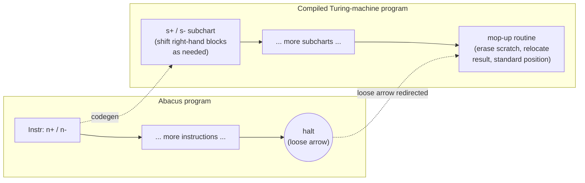

[[book-guidelines|↩ Back to guidelines]]

## Why a machine model at all

Chapter 2 ended with a genuinely alarming fact: most sets of positive integers can't be listed by *any* rule, however clever (Cantor's diagonal argument). That result only bites if "rule" has been pinned down precisely — otherwise a skeptic can always claim you just haven't found the right rule yet. So before the book can say anything sharp about what computation *can't* do (Chapter 4's halting problem), it has to say precisely what computation *can* do. That's the job of this chapter pair.

The book's working notion is **effective computability**: a function is effectively computable if there's a list of instructions, fully explicit, requiring no outside information and no ingenuity, that determines the output for any input in finitely many steps (p. 23). That's an intuitive notion — it describes a property of *procedures in general*, not a mathematical object you can prove theorems about. You cannot diagonalize against "cleverness." What Turing did (and what Boolos–Burgess–Jeffrey formalize in Chapter 3) was propose a specific, austere, mathematically precise device — the **Turing machine** — and then defend the claim, `Turing's thesis`, that this device captures effective computability exactly. Chapter 5 then introduces a second device, the **abacus machine**, which looks like it should be strictly more powerful (random-access memory instead of a tape you crawl along one square at a time) — and proves it isn't. That convergence of two independently-motivated formalisms onto the same class of functions is itself evidence for the thesis, and it's the load-bearing result of this pair of chapters.

If you've ever written a bytecode interpreter, this whole chapter pair is going to feel like a visit to a very minimalist ancestor of your own code. That's not a coincidence, and it's worth leaning into: a Turing machine table *is* an instruction-dispatch loop, and an abacus program *is* a register machine — the thing your compiler's backend probably targets. Below, every construct gets a direct Rust rendering for exactly this reason: not decoration, but the claim that "Turing computable" literally means "there exists a program for this minimal machine," and writing that machine as an interpreter makes the definition concrete instead of ceremonial.

## The Turing machine model

**What breaks without it.** Before formalizing, notice what an *informal* notion of "mechanical procedure" leaves open: How much can the device remember at once? Can it look arbitrarily far ahead? Does it need to understand what the symbols *mean*? If any of these questions is answered generously, "effectively computable" risks becoming "computable by something smart enough to figure it out" — which smuggles back in the very ingenuity the definition was supposed to rule out. Turing's move was to make the device almost insultingly dumb, and then show that dumbness costs nothing in computational power.

The machine (p. 24–26):

- An **unbounded two-way tape**, divided into squares, each holding either a blank ($S_0$, written `B` or `0`) or a stroke ($S_1$, written `1`).
- A **finite set of internal states** $q_1, \ldots, q_m$.
- At each step, the machine reads the symbol under its head and, depending on the pair (current state, symbol read), performs exactly one of five **overt acts**: erase, print, move right, move left, or halt — and (unless it halted) transitions to a new state.

That's the entire vocabulary. No indexed memory, no arithmetic primitives, no lookahead. Composability entirely from `(state, symbol) → (action, next state)`.

```rust
#[derive(Clone, Copy, PartialEq, Eq, Debug)]
enum Symbol { Blank, Stroke }              // S0, S1

#[derive(Clone, Copy, PartialEq, Eq, Debug)]
enum Action { Erase, Print, Right, Left }  // the five acts, minus Halt

type State = usize;                        // q1, q2, ... — just labels

/// The "machine table": exactly the book's rule
///     (q_i, S_j) -> perform action, go to q_l
/// Absence of an entry for a (state, symbol) pair *is* the halt instruction —
/// there's no separate Halt variant needed once you use a partial map.
type Table = std::collections::HashMap<(State, Symbol), (Action, State)>;

struct TuringMachine {
    table: Table,
    tape: std::collections::HashMap<i64, Symbol>, // sparse: unlisted = Blank
    head: i64,
    state: State,
}

impl TuringMachine {
    fn read(&self) -> Symbol {
        *self.tape.get(&self.head).unwrap_or(&Symbol::Blank)
    }

    /// One step. Returns false exactly when there's no instruction for
    /// (state, symbol read) — i.e. the machine halts, per act (5).
    fn step(&mut self) -> bool {
        let Some(&(action, next)) = self.table.get(&(self.state, self.read())) else {
            return false;
        };
        match action {
            Action::Erase => { self.tape.insert(self.head, Symbol::Blank); }
            Action::Print => { self.tape.insert(self.head, Symbol::Stroke); }
            Action::Right => { self.head += 1; }
            Action::Left  => { self.head -= 1; }
        }
        self.state = next;
        true
    }

    fn run(&mut self) { while self.step() {} }
}
```

Notice the small design decision that mirrors the book exactly: halting isn't a fifth *action* you execute, it's the *absence of an instruction* for the current `(state, symbol)` pair. That's precisely how the book phrases it too — "the machine halts when it is in state $q_3$ scanning $S_1$, for there is no table entry... telling it what to do in such a case" (p. 27).

### Machine table, flow chart, quadruple: three views of one `Table`

The book insists these are interchangeable notations for the same object (p. 26), and the `HashMap<(State, Symbol), (Action, State)>` above is quietly already all three at once:

- **As a table**, it's a grid indexed by state (rows) and symbol (columns).
- **As a flow chart**, each key-value pair is a labeled arrow: node `q_i`, edge labeled by the symbol read and the action, target node `q_l`.
- **As a quadruple**, $q_iS_jS_kq_l$ (print) or $q_iS_jRq_l$/$q_iS_jLq_l$ (move) is literally one entry of the `HashMap`, serialized as a 4-tuple instead of a map lookup.

Worked example: the book's own "write three strokes and halt" machine (Fig. 3-2, p. 26–27) — three states, each writes a stroke and moves left, except the last, which halts right after writing (no instruction exists for $q_3$ scanning a stroke):

$$q_1S_0S_1q_1 \quad q_1S_1Lq_2 \quad q_2S_0S_1q_2 \quad q_2S_1Lq_3 \quad q_3S_0S_1q_3$$

```rust
let mut table = Table::new();
table.insert((1, Symbol::Blank),  (Action::Print, 1)); // q1 S0 S1 q1
table.insert((1, Symbol::Stroke), (Action::Left,  2)); // q1 S1 L  q2
table.insert((2, Symbol::Blank),  (Action::Print, 2)); // q2 S0 S1 q2
table.insert((2, Symbol::Stroke), (Action::Left,  3)); // q2 S1 L  q3
table.insert((3, Symbol::Blank),  (Action::Print, 3)); // q3 S0 S1 q3
// no entry for (3, Stroke) => the machine halts there, as the book says
```

Run this from state 1 on a blank tape and it writes exactly three strokes and stops, scanning the leftmost one — a direct transcription, not a reinterpretation.

The book's own **configuration** notation for tracing execution — e.g. $1_2100111$, meaning tape contents `1100111` with the machine in state 2 scanning the leftmost `1` — is worth preserving exactly as written rather than translated into code; it's compact precisely because it packs "what's written / what state / where the head is" into one line, which is exactly the three fields of `TuringMachine` above, read off at a glance.

### Standard initial and final configuration

A single machine, run from different starting tapes, computes a *family* of functions — one for each arity $k$. To make "the function this machine computes" well-defined, the book fixes a convention (p. 31–32):

- **(a)** Arguments $m_1, \ldots, m_k$ go on the tape in monadic (tally) notation — blocks of that many strokes, one blank between blocks, tape otherwise blank.
- **(b)** The machine starts scanning the leftmost stroke, in state $q_1$. This is a **standard initial configuration**.
- **(c)–(d)** If the function is defined at those arguments, the machine halts on a tape holding a single block of $n$ strokes (the value), scanning the leftmost one. This is a **standard final configuration**.
- **(e)** If undefined, the machine either never halts, or halts in a *nonstandard* configuration (extra blocks left lying around) — which the convention treats as "no value," not as an answer.

This convention is what turns "a machine" into "a function": *the* function a machine computes, at arity $k$, is read off by feeding it every possible standard initial configuration of $k$ blocks and recording where it lands. The book makes the family-of-functions point vivid with two trivial machines: the single quadruple $q_11q_1q_2$ computes the identity at arity 1, but the empty (nowhere-defined) function at every arity $\ge 2$, because two or more blocks on the tape guarantee a *nonstandard* final configuration once the machine halts immediately (p. 32). In Rust terms, "the function computed by this table" isn't a property of the `Table` alone — it's a property of `Table` *together with* the arity you choose to interpret it at, exactly as `Arn` will reappear for abacus machines below.

```rust
/// Runs `table` at arity k on arguments `args`, per the standard-position
/// convention, and returns Some(value) iff it halts in standard final position.
fn run_standard(table: &Table, args: &[u64]) -> Option<u64> {
    let mut tape = std::collections::HashMap::new();
    let mut pos = 0i64;
    for (i, &m) in args.iter().enumerate() {
        for _ in 0..m { tape.insert(pos, Symbol::Stroke); pos += 1; }
        if i + 1 < args.len() { pos += 1; } // single blank separator
    }
    let mut tm = TuringMachine { table: table.clone(), tape, head: 0, state: 1 };
    tm.run();
    // standard final position: one contiguous block, head on its left end,
    // rest of the tape blank
    let mut n = 0u64;
    while tm.tape.get(&(tm.head + n as i64)) == Some(&Symbol::Stroke) { n += 1; }
    let clean_left  = (1..).take_while(|&i| tm.head - i >= i64::MIN)
        .all(|i| tm.tape.get(&(tm.head - i)).unwrap_or(&Symbol::Blank) == &Symbol::Blank);
    // (a full implementation would also check nothing follows the block;
    //  elided here for brevity — see Problem set 3.1-3.6 for exactly this
    //  kind of "well-formedness of the final tape" reasoning)
    if clean_left { Some(n) } else { None }
}
```

That last function is deliberately a *sketch*, not production code — the point isn't to write a bulletproof checker but to make visible that "standard position" is a genuine, checkable predicate on tapes, not a hand-wave.

### Turing's thesis

**Turing's thesis**: every effectively computable function is Turing computable. Unlike the definitions above, this is not a theorem — "effectively computable" is deliberately left as an *intuitive* notion, so nothing rigorous could be proved equivalent to it (p. 33). The book is candid about the epistemic status: the only argument available is heuristic ("surely writing and erasing symbols can be done stroke by stroke, and moving from one place to another can be done step by step," p. 33) plus an accumulating pile of positive examples — every function anyone tries to compute by "obviously effective" means turns out, after enough work, to be Turing computable too. Chapter 3 itself only manages a handful of these (identity, the constant-1 function, addition, multiplication via the "leapfrog" routine described below) precisely because direct table-writing is laborious — which is exactly the gap Chapter 5's abacus machines exist to close.

**What breaks without it.** If Turing's thesis were false, there would be some function everyone agrees is computable "in principle, by explicit rule" that provably has no Turing machine — meaning the class of Turing-computable functions would be too narrow to serve as *the* formal stand-in for "computable" in the rest of the book (the halting problem, Gödel's theorems, and all the undecidability results in Chapters 10–17 are stated and proved about Turing/recursive computability, and only inherit their intuitive force from the thesis). Historically the pressure runs the other way — every proposed liberalization (more symbols, two-dimensional tape, random access) has been shown *not* to add power, which is the evidence, not proof, that the thesis is on solid ground; the abacus-machine equivalence below is the book's first and most concrete instance of exactly this pattern.

## Abacus (register) machines

Direct table-writing tops out fast — the book's own multiplication machine already needs a "leapfrog" routine (repeatedly shuttling a block of $q$ strokes $q$ places right, using the untouched part of the block as its own counter, Fig. 3-8, p. 30–31) just to get to $p \cdot q$. Chapter 5 sidesteps this by introducing a machine that looks strictly more powerful: instead of one linear tape you crawl along a square at a time, you get **unboundedly many registers** $R_0, R_1, R_2, \ldots$, each holding an arbitrarily large natural number, addressable directly — "go to register $R_n$" instead of "walk there." This is, in miniature, exactly the leap from a Turing tape to RAM.

The instruction set is deliberately just as austere as the Turing machine's, though — only two elementary operations (p. 47):

- $n{+}$: add one stone to box $n$, unconditionally, then go to the next instruction.
- $n{-}$: if box $n$ is nonempty, remove one stone and go to instruction $r$; if empty, go to instruction $s$ instead (a conditional branch).

```rust
use std::collections::HashMap;

type RState = usize;

enum Instr {
    Inc    { box_: usize, next: Option<RState> },
    DecOrGo { box_: usize, if_nonempty: Option<RState>, if_empty: Option<RState> },
}

struct Abacus {
    program: HashMap<RState, Instr>,
    registers: Vec<u64>,   // registers[n] == [n] in the book's notation
    state: RState,
}

impl Abacus {
    /// One step. Returns false when `state` has no instruction —
    /// exactly the "arrow leading nowhere" that marks halting in a
    /// flow chart (p. 47).
    fn step(&mut self) -> bool {
        let Some(instr) = self.program.get(&self.state) else { return false };
        let next = match *instr {
            Instr::Inc { box_, next } => {
                self.registers[box_] += 1;
                next
            }
            Instr::DecOrGo { box_, if_nonempty, if_empty } => {
                if self.registers[box_] > 0 {
                    self.registers[box_] -= 1;
                    if_nonempty
                } else {
                    if_empty
                }
            }
        };
        match next {
            Some(s) => { self.state = s; true }
            None    => false,
        }
    }

    fn run(&mut self) { while self.step() {} }
}
```

**Example 5.1 (emptying box $n$), transcribed directly** (p. 47): a single instruction, "if box $n$ is nonempty, subtract 1 and stay at instruction 1; if empty, halt":

```rust
let mut program = HashMap::new();
program.insert(1, Instr::DecOrGo { box_: n, if_nonempty: Some(1), if_empty: None });
```

Composite programs are then built the way you'd expect from an instruction set this small — the book chains flow charts together as *block diagrams* labeled by their net effect (e.g. `[m] + [n] → n` then `0 → m` for "empty $m$ into $n$," Example 5.2), the same way you'd document a subroutine by its calling contract rather than re-reading its body every time it's called. Multiplication (Example 5.4) is then literally "dump `[m2]` stones into box `n`, `[m1]` times, using `m1` as a decrementing loop counter" — a for-loop over a register, exactly as you'd write it imperatively:

```rust
// sketch of Example 5.4's structure, not a literal state-numbered program:
// while m1 != 0 { m1 -= 1; add_box_into(m2_copy, n) }  (m2 must be preserved,
// hence "copy m2 into an auxiliary register, then empty the auxiliary into n"
// each iteration — see Example 5.3's "addition without loss")
```

and exponentiation (Example 5.5) is the same trick one level up: repeated multiplication, with `n` initialized to a single stone rather than zero — which is exactly the classical justification for $x^0 = 1$ falling out of the *base case of the loop*, not a special-cased definition.

### Standard format, and the same family-of-functions move as before

Exactly as with Turing machines, one abacus flow chart yields a whole family of functions $A^r_n$ — arguments in the first $r$ registers, value read out of register $n$ at halting time, all other registers starting empty (p. 51). Nothing new here conceptually; it's worth noting only because it means "abacus computable" and "Turing computable" are being compared *fairly* — same convention for turning a static program into a numerical function.

## Equivalence of Turing and abacus computability

> **Theorem 5.6.** Every abacus-computable function is Turing computable.

The proof (§5.2, pp. 51–56) is a genuine compilation — from a register machine down to a machine with no random access at all — and it is worth understanding as *exactly that*, because it's the same problem you'd face implementing a growable array of growable arrays on top of a flat byte buffer.

**The encoding.** Lay the registers out left to right on the tape, each register's contents represented by a block of strokes (a nonempty register holding $k$ stones becomes a block of $k{+}1$ strokes; an empty register becomes a single square, blank or holding one stroke depending on what's needed to keep neighboring blocks distinguishable), separated by single blanks. This is a completely ordinary "serialize a resizable-array-of-resizable-arrays into one flat buffer" scheme — the kind of thing you'd write for a bump-allocated arena — with one wrinkle a real allocator normally avoids: **there is no free space reserved between blocks.** Every increment to a register is a potential buffer overflow into its right-hand neighbor's territory.

**What breaks without care.** This is exactly why the translation needs machinery beyond "just simulate `n+` and `n-` directly": incrementing register $n$ (an $s{+}$ node) may need to **shift every block to its right one square rightward** to make room, the same way inserting into the middle of a packed array forces a `memmove` of everything after the insertion point. The book's $s{+}$ flow chart (Fig. 5-9, p. 53) does precisely this: walk right past the first $s{-}1$ blocks (converting any empty-register placeholder it passes into the "occupied" 1-representation as needed), write the new stroke at the target block, and — only if there turns out to be more tape to the right — shift every subsequent block one square over by erasing its leading stroke and appending one at its new right edge, continuing until a genuinely empty stretch of tape is found. The $s{-}$ node (Fig. 5-11, p. 55) is the mirror image: find the target block, remove one stroke (checking first whether the register was already empty, which is its own branch), and return to standard position.

Two further steps are needed to finish the compilation, and both are exactly the kind of "shim" gap you'd expect between two calling conventions:

1. **Halting representation mismatch.** An abacus flow chart marks halting with an arrow to nowhere; a Turing machine halts by simply having no instruction for a `(state, symbol)` pair. So every "loose arrow" produced by steps 1–2 needs to be redirected into...
2. **...a mop-up routine** (Fig. 5-13, p. 55–56), because the abacus's designated output register $n$ is very unlikely to be the *only* thing left on the tape (registers $n{+}1, n{+}2, \ldots$ used as scratch space are still sitting there). Mop-up erases everything except the block for register $n$, relocates it to start where the very first stroke on the tape used to be, and halts in standard position. This is precisely the difference between "the return value is in some register" and "the return value is on the top of the stack, everything else popped" — an ABI-normalization step, not a computational one.

Put together, the translation is a genuine three-part compiler pass: **codegen for `n+`/`n-` nodes** (the $s{+}$/$s{-}$ subcharts), **calling-convention fixup** (loose-arrow redirection), and **epilogue** (mop-up) — which is a much more informative way to hold the proof in your head than "somehow simulate registers on a tape."



The converse — every recursive function (built from basics by composition, primitive recursion, and minimization; formalized in Chapter 6) is abacus computable — is:

> **Theorem 5.8.** All recursive functions are abacus computable (and hence Turing computable, by 5.6).

which the chapter proves constructively, and which is worth walking through because each construction is a small, recognizable piece of compiler engineering:

- **Composition** ($h(\vec x) = f(g_1(\vec x), g_2(\vec x))$, Example in §5.3, p. 58): given abacus programs for $f$, $g_1$, $g_2$, build $h$'s program by computing $g_1$ into a scratch register, computing $g_2$ into another scratch register, stashing the original arguments in more scratch registers (because $g_1$'s and $g_2$'s subprograms will clobber registers 1 through $r$), restoring the arguments, calling $f$ on the two results, and finally tidying up. This is exactly a **calling convention**: caller-saved registers, argument marshaling, and a return-value slot — nothing more.

  ```mermaid
  flowchart TD
      S["save args 1..r into q1,q2,q3"] --> G1["run g1's program\n(args)->4, store into p1"]
      G1 --> G2["run g2's program\n(args)->4, store into p2"]
      G2 --> R["restore p1,p2 into 1,2;\nrestore q1,q2,q3 into 1,2,3"]
      R --> F["run f's program\n(1,2)->3"]
      F --> T["move box3 -> box4;\nrefill 1,2,3 from saved args"]
      T --> H(("halt"))
  ```

- **Primitive recursion** ($h(x,0)=f(x)$, $h(x,y{+}1) = g(x,y,h(x,y))$, Fig. 5-16, p. 60): copy $y$ into a fresh counter register $p$; compute $f(x)$ into the result register as the base case; then loop — while $p \ne 0$, decrement $p$ and apply $g$ to (original $x$, how far along we are, the running result) to update the result register. **This is a `for` loop compiled straight to a register machine**, with $p$ as the loop counter — the most direct possible reading of the two recursion equations as an imperative program.

  ```mermaid
  flowchart TD
      Init["p := y (copy);\nresult := f(x)  (base case)"] --> Check{"p = 0?"}
      Check -- yes --> H(("halt: result = h(x,y)"))
      Check -- no --> Dec["p := p - 1"]
      Dec --> Step["result := g(x, y-p, result)"]
      Step --> Check
  ```

- **Minimization** ($h(x) = $ least $i$ with $f(x,i)=0$, given all of $f(x,0),\ldots,f(x,i)$ defined, Fig. 5-17, p. 60–61): a `while`-loop searching upward from 0, calling $f$ at each candidate and halting the moment it returns 0. This is the one operation of the three that can fail to terminate — exactly the operation that later (Chapter 6) is flagged as the source of *partial* recursive functions, and it maps onto an unbounded search loop for the same reason a `while true { if f(x, i) == 0 { break } ; i += 1 }` in Rust can fail to terminate: nothing in the syntax of the loop bounds it.

None of the three constructions needs anything beyond `n+`/`n-` and sequencing/branching — which is the entire content of Theorem 5.8: the "high-level" operations that build up the recursive functions compile down to this minimal register machine with no loss, exactly as they compile down to Turing machines by Theorem 5.6. A quick formal gesture at the ADT these programs are built from, for anyone who wants to eventually *prove* Theorem 5.6 rather than just implement its recipe — this is close to the literal type signature the proof needs:

```lean
inductive Instr where
  | inc   (box : Nat) (next : Option Nat)
  | decOr (box : Nat) (ifNonempty ifEmpty : Option Nat)

def Program := Nat → Option Instr   -- state ↦ instruction (partial: `none` = no state defined)
```

`Program` here is exactly the abacus half of the Rust `HashMap` above, restated as pure data — the natural starting point if this proof (or Theorem 5.8's three constructions) is ever something you want machine-checked rather than merely trusted, since "does compiling this abacus program via the $s{+}$/$s{-}$/mop-up recipe preserve the computed function" is a genuine, statable theorem about two interpreters agreeing on all inputs.

## Where this leads

This chapter pair is the foundation the rest of Part I stands on. Chapter 4's uncomputable functions (the diagonal function, the halting function) are proved uncomputable *for Turing machines specifically* — a claim only interesting because Turing's thesis says that's the same as uncomputable *by any effective procedure*. Chapter 6 defines the recursive functions purely syntactically (composition, primitive recursion, minimization, no machine in sight), and Chapter 5's Theorem 5.8 is half of what closes the loop between that syntactic definition and the machine-based ones — Chapter 8 finishes the job with the converse direction (Turing computable $\Rightarrow$ recursive) via the Wang coding of tape configurations, at which point "Turing computable," "abacus computable," and "recursive" are provably three names for one class of functions, which is the technical notion of "computable" the rest of the book — arithmetization of syntax, the undecidability of first-order logic, both incompleteness theorems — is built on.

For the standing project: this pair of chapters is the most direct "build a tiny VM" material in the book, and it's worth taking seriously as exactly that. A Turing machine table is a dispatch loop over `(state, symbol)`; an abacus program is a register machine; the equivalence proof is a compiler pass with a real ABI mismatch to paper over (halting convention, calling convention, register layout) — all of which is the same shape of problem your Rust verifier's interpreter and the elaborator's reduction machinery will eventually have to solve for whatever intermediate representation they settle on. The minimization construction is also worth flagging explicitly: it's the chapter's only source of possible nontermination, and it is the mechanical seed of every later result about undecidability and partiality in the book — the same "unbounded search with no syntactic termination guarantee" shape that shows up wherever a type checker's algorithm needs a decidability argument rather than getting one for free from the grammar.
