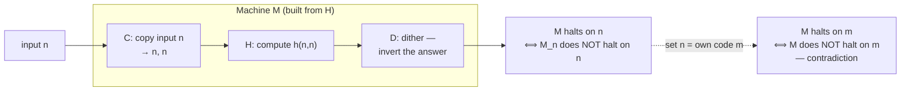
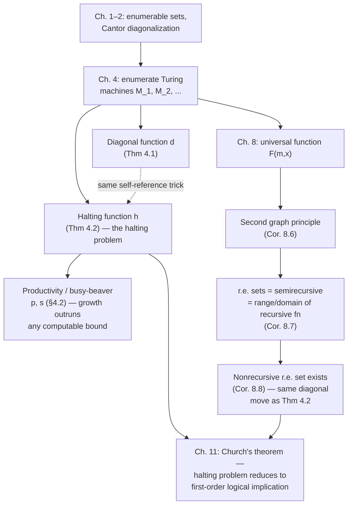

# Uncomputability

[[book-guidelines|↩ Back to guidelines]]

## Why this chapter has to exist

Chapter 3 gave you a precise, mechanical notion of "computable": a function is Turing computable if some Turing machine, started in a fixed standard position, eventually halts with the answer written on the tape. That's a satisfying definition right up until you ask the obvious next question: does it capture *every* function from positive integers to positive integers? The book's answer is a flat no, and it doesn't just assert this — it hands you an actual function, in closed form, that provably cannot be computed by any Turing machine, no matter how cleverly programmed. That's the whole point of this short chapter: not "computation has limits" as a slogan, but a specific, exhibited counterexample.

The counting argument that motivates it is almost too easy: the set of *all* functions from positive integers to positive integers is nonenumerable (Cantor, Chapter 1–2 territory), but the set of Turing machines is enumerable — every machine has a finite quadruple representation, hence a code number, so you can list them $M_1, M_2, M_3, \ldots$ and get a corresponding list of computable functions $f_1, f_2, f_3, \ldots$. An enumerable list can never exhaust a nonenumerable collection, so *some* function must be missing from the list. But "some function is missing" is an existence proof, not a specimen. The chapter's real achievement is producing the specimen.

If you're used to thinking about computation from the programming side, this chapter is where "some programs never terminate" stops being an annoying edge case and becomes a hard mathematical wall: no amount of cleverness — not smarter static analysis, not more compute, not a bigger training run — can build a general halt-checker. This is directly relevant to why an automated theorem prover (the kind of thing a Rust verifier's proof search needs) can never be a complete decision procedure for arbitrary claims: if it were, you could use it to solve the halting problem. Keep that in your back pocket; the closing section makes it explicit.

## Enumerating Turing machines: the setup for diagonalization

Before you can diagonalize over "all Turing machines," you need them in a list, and the list itself needs to be *canonical* — every machine appears, and appears in a computably-determined position. The book gets there with two normalizing conventions:

1. **Every state has instructions for every symbol.** If a machine previously had "no instruction for $q_iS_j$" (interpreted as an implicit halt), that gets replaced by an explicit instruction to keep the symbol and jump to a new highest-numbered state — the *designated halted state*. No more implicit halts; halting means "reached state $q_{n+1}$," full stop.
2. **Quadruples become integers.** Representing state $q_i$ by the number $i$, symbol $S_j$ by $j+1$, and $L/R$ by $3/4$, a machine becomes a finite sequence of positive integers, and that sequence becomes a single number via prime-power coding: $2^{a_0} \cdot 3^{a_1} \cdot 5^{a_2} \cdots$.

Not every positive integer decodes to a valid machine (the sequence needs length a multiple of 4, with entries in the right ranges), but that's fine — you get a *gappy* listing where every machine appears somewhere, and filling the gaps gives a clean, gapless enumeration $M_1, M_2, M_3, \ldots$, hence functions $f_1, f_2, f_3, \ldots$ where $f_i$ is whatever $M_i$ computes (possibly a partial function, possibly the empty function if $M_i$ never reaches standard halting position on any input).

**Rust grounding.** This enumeration is exactly what you get for free if you define your machine representation as a `Vec<u32>` or a fixed-shape struct and then enumerate *all syntactically valid encodings* in order of code number:

```rust
// A Turing-machine "program" is a flat sequence of quadruple fields.
// Each valid program has length divisible by 4, decodable into instructions.
struct Program(Vec<u32>);

fn decode(n: u64) -> Option<Program> {
    // inverse of prime-power coding: read off the exponents of 2, 3, 5, 7, ...
    // return None if the resulting sequence isn't a well-formed program
    todo!()
}

// M_1, M_2, M_3, ... as a lazy iterator over positive integers, skipping gaps
fn enumerate_machines() -> impl Iterator<Item = Program> {
    (1u64..).filter_map(decode)
}
```

The crucial fact your enumerator inherits for free: this is a *total, computable* function from $\mathbb{N}$ to (possibly-partial) machines. You can always ask "what is machine #47,392?" and get an answer in finite time — you just can't always ask "does machine #47,392 halt on input 5?" and get one.

## The diagonal function: uncomputability by direct construction

With the enumeration $f_1, f_2, f_3, \ldots$ fixed, define the **diagonal function**:

$$
d(n) = \begin{cases} 2 & \text{if } f_n(n) \text{ is defined and } = 1 \\ 1 & \text{otherwise} \end{cases}
$$

Read $d$ as: "run machine $n$ on input $n$; if it halts with output exactly $1$, answer $2$; in every other case (halts with a different output, halts in a nonstandard position, or never halts) answer $1$." Note the name "diagonal" is literal, not just evocative — if you imagine an infinite table where row $n$ lists the values $f_n(1), f_n(2), f_n(3), \ldots$, then $d$ is built by walking the diagonal entry $f_n(n)$ of that table and deliberately flipping it. This is the exact same move as Cantor's antidiagonal construction from Chapter 2, just now over a table of *functions* instead of a table of *sets*.

**Theorem 4.1.** $d$ is not Turing computable.

*Proof sketch (reductio).* Suppose $d = f_m$ for some $m$ in the list. Instantiate the definition at $n = m$:

$$
f_m(m) = d(m) = \begin{cases} 2 & \text{if } f_m(m) \text{ is defined and } = 1 \\ 1 & \text{otherwise} \end{cases}
$$

Check every case: if $f_m(m)$ is undefined, the right side says it's defined (value $1$) — contradiction. If $f_m(m)$ is defined and $\neq 1$, the right side says it equals $1$ — contradiction. If $f_m(m) = 1$, the right side says it equals $2$ — contradiction. Every branch self-destructs, so $d$ cannot appear anywhere in the list. $\blacksquare$

**What breaks without this.** If $d$ *were* computable, you'd have a function that provably disagrees with every function in an exhaustive list of all computable functions — which is simply incoherent, since $d$ would itself have to be one of them. The contradiction isn't a technical accident; it's forced by definition, the same way "the barber who shaves everyone who doesn't shave themselves" collapses. The diagonal function is a controlled, useful version of that same self-reference trick, aimed at a specific target instead of at natural language.

**Rust grounding — why this isn't just abstract nonsense.** Suppose you tried to actually implement $d$:

```rust
fn d(n: u64) -> u32 {
    match run_machine(n, n) {  // simulate M_n on input n
        Some(1) => 2,
        _ => 1,  // includes: halts with other output, or never halts
    }
}
```

The type signature lies. `run_machine` cannot be `fn run_machine(m: u64, x: u64) -> Option<u32>` with a *guaranteed* return — to return `None` for "never halts" you'd need to first *decide* that it never halts, which is exactly the halting problem below. Any real implementation either loops forever on some input (violating totality) or is wrong (violating correctness). There is no third option. This is worth sitting with: it's not that nobody has been clever enough yet, it's that Theorem 4.1 is a proof that no such function exists in the computable universe at all.

## The halting function and the halting problem

Theorem 4.1 gives you *a* function that isn't computable, but it's a somewhat artificial one, defined by explicit self-reference over an enumeration. The book's second, more important target is a function you'd actually want in practice: the **halting function**

$$
h(m,n) = \begin{cases} 1 & \text{if machine } M_m, \text{ started on input } n, \text{ eventually halts} \\ 2 & \text{otherwise} \end{cases}
$$

Note $h$ is total by definition (every machine either halts on a given input or doesn't) — the question is purely whether it's *Turing computable*, i.e., whether some machine can decide it.

The book first gives you the *informal* connection to $d$: if $h$ were computable, you could compute $d$ too — feed $h(n,n)$; if it says "never halts," you know $d(n)=1$; if it says "halts," actually run $M_n$ on $n$ (safe now, since you know it terminates) and read off $d(n)$ from the output. Since $d$ is *not* computable (Theorem 4.1), $h$ can't be either — contrapositive.

But the book then gives the much stronger, self-contained **Theorem 4.2**, proved directly by reductio, with no appeal to $d$ at all. This is the argument worth internalizing, because its structure — build a machine that inspects its own behavior and does the opposite — recurs constantly in computability theory (and in the Church's-theorem reduction later in the book, Chapter 11).

**Proof sketch.** Suppose a machine $H$ computes $h$. Build three pieces and glue them together:

- **A copying machine $C$**: given $n$ strokes, produces two blocks of $n$ strokes side by side.
- **$H$ itself**, renumbered to run right after $C$. Chaining $C$ then $H$ gives a machine $G$ that, started on $n$, computes $g(n) = h(n,n)$ — "does machine $n$ halt on input $n$?"
- **A dithering machine $D$**: given $1$ stroke, loops forever; given more than $1$ stroke, halts promptly. $D$ is the "answer inverter": it turns $g(n)=1$ (halts) into "loop forever" and $g(n)=2$ (doesn't halt) into "halt."

Chain $G$ then $D$ to get a machine $M$. By construction: $M$ halts on input $n$ if and only if $M_n$ *does not* halt on input $n$. Now ask what $M$ does when started on its *own* code number $m$ (recall $M$ is itself some $M_m$ in the enumeration, since every machine is): $M$ halts on $m$ iff $M_m$ does not halt on $m$ — but $M$ *is* $M_m$, so $M$ halts on $m$ iff $M$ does not halt on $m$. Contradiction, for every possible outcome. So no such $H$ can exist. $\blacksquare$



This is the **halting problem**, in the form Boolos–Burgess–Jeffrey state it: there is no Turing machine that, given the code of any machine $m$ and any input $n$, decides whether $M_m$ halts on $n$. Assuming [[Turing-and-Abacus-Computability#Turing's thesis|Turing's thesis]], there is no effective procedure at all that solves this — not "no one has found one yet," but "none exists."

**Rust grounding — the diagonal trick as an actual program.** This is worth writing out because the self-application (`M` run on its own code) is exactly the Y-combinator-adjacent move that trips people up on paper but is completely mechanical in code:

```rust
// Suppose (for contradiction) this exists and is total & correct:
fn h(machine: u64, input: u64) -> bool { /* true = halts */ unreachable!() }

// G(n) = h(n, n)
fn g(n: u64) -> bool { h(n, n) }

// M(n): loop forever if g(n), halt immediately otherwise — the "dither" inversion
fn m(n: u64) -> ! /* diverges */ {
    if g(n) {
        loop {}          // g(n) true  ⇒ M(n) does NOT halt
    }
    // g(n) false ⇒ M(n) halts, falls through and returns
}

// m is itself some code number, say CODE_OF_M. Evaluate:
//   m(CODE_OF_M) halts  ⟺  g(CODE_OF_M) is false
//                        ⟺  h(CODE_OF_M, CODE_OF_M) is false
//                        ⟺  M_{CODE_OF_M} does not halt on CODE_OF_M
//                        ⟺  m does not halt on CODE_OF_M     (since m IS M_{CODE_OF_M})
// i.e. m(CODE_OF_M) halts ⟺ m(CODE_OF_M) doesn't halt. Contradiction.
```

The "own code number" step is what a real implementation would need `quine`-style self-reference to realize concretely, but you don't actually need to build it — the *type* of contradiction it would produce, if it existed, is the whole proof. This is precisely why `rustc`'s borrow checker, a SAT solver, or your future verifier's proof search can be sound and can be practically strong, but cannot be a complete oracle for arbitrary termination or arbitrary validity: any such oracle could be wired up exactly like $H$ above to build a contradiction.

## The productivity and busy-beaver functions (§4.2, optional in the book)

The halting function is the headline result, but the book gives a second family of uncomputable functions with a different flavor: not built from self-reference, but from unbounded growth outrunning any computable bound.

Define, for a $k$-state Turing machine started on a block of $k$ strokes: its **score** is the length of the output block if it halts in standard position, $0$ otherwise. Then

$$
s(k) = \text{the highest score achieved by any } k\text{-state machine.}
$$

**Proposition 4.3.** $s$ is not Turing computable.

*Proof idea.* First, if $s$ were computable, so would be $t(k) = s(k)+1$ — just append one state to whatever machine computes $s$, so that on halting it takes two extra steps (move left, print a stroke) before actually stopping. But now $t$ can't be computable either: if some $k$-state machine computed $t$, then running it on $k$ would itself be a $k$-state machine achieving score $t(k)$ — yet $t(k) = s(k)+1 > s(k)$, the *maximum* possible score for $k$-state machines. A machine cannot outscore the maximum score achievable by machines of its own size. Contradiction, so neither $t$ nor $s$ is computable.

The tempting "obvious" algorithm for $s(k)$ — enumerate all $k$-state machines, run them all in parallel, wait for each to either halt or not, keep the running maximum score once everyone that's ever going to halt has halted — fails for exactly one reason: **you don't know when to stop waiting**, because that requires already knowing which of the still-running machines will eventually halt. The scoring problem *presupposes* a solution to the halting problem. This is the recurring shape of uncomputability arguments in this book: strip away the specific trick, and almost every one bottoms out at "this would require deciding whether some machine halts."

The **Rado / busy-beaver function** $p(n)$ is the more famous cousin: start a machine on a *blank* tape (not on $n$ strokes) instead, and define $p(n)$ as the length of the longest block of strokes any $\le n$-state machine can produce before halting. The book proves its uncomputability via three growth facts:

- $p(1) = 1$ (worked out by direct case analysis on all 25 single-state machines).
- $p(n+1) > p(n)$ (append one state to any maximal $n$-state machine to strictly increase productivity).
- There's a fixed $i$ (the book gets $i = 11$) with $p(n+i) \ge 2p(n)$ (chain a "write $n$ strokes" machine into a "double the block" machine).

Then, by reductio: if a $j$-state machine $BB$ computed $p$, chaining two copies of $BB$ after an $n$-stroke writer gives $p(n+2j) \ge p(p(n))$. Combined with monotonicity, this forces $n + 2j \ge p(n)$ for *all* $n$ — but the doubling fact forces $p(n) \ge 2n - O(1)$ for infinitely many $n$, i.e. $p$ eventually outgrows any function of the form $n + c$. Setting $k = i+2j$, the two bounds collide into $m + k \ge 2m$ for all $m$, which is false for any $m > k$. **Theorem 4.7**: $p$ is Turing uncomputable — not because of self-reference this time, but because $p$ provably grows faster than any computable function possibly can (a computable machine of bounded size can't out-write its own upper bound on writable output).

**Why this matters beyond a curiosity:** $p(n)$ (or $s(n)$) is a real number for small $n$ — $p(1)=1$, and known lower bounds exist for $p(2), p(3), \ldots$ — but *no algorithm* can compute $p(n)$ for general $n$, and $p$ grows faster than every computable function, including towers of exponentials. If your future verifier ever needs to bound "how long could this loop possibly run before terminating," recognize that a busy-beaver-style function is the theoretical ceiling on what "possibly could" even means — there's no computable function that dominates it.

## Recursively enumerable sets (§8.3) and the existence of a nonrecursive r.e. set

Chapter 8 closes the loop between Turing computability and recursive-function computability (Theorem 8.2: recursive $\Leftrightarrow$ Turing computable) and builds a **universal function** $F(m,x)$ — a single recursive function such that for every $m$, the one-place function $F(m, -)$ equals $f_m$, the function computed by machine $m$. Section 8.3 uses this universal function to place the halting-problem phenomenon into a cleaner, more general framework: not "one specific uncomputable function" but "an entire natural *class* of sets that sits strictly above the recursive (decidable) sets."

Recall from Chapter 7 the notion of a **semirecursive relation**: $S(x) \leftrightarrow \exists y\, R(x,y)$ for some recursive $R$ — a set with a "yes, and here's the proof (witness $y$)" search procedure that halts on members but may run forever on non-members. The book now defines, independently:

> A set of natural numbers $A$ is **recursively enumerable (r.e.)** if $A$ is the range of some (total or partial) recursive function.

**Corollary 8.7** (the payoff): *range*, *domain*, and *semirecursive* are all the same class of sets.

- *semirecursive $\Rightarrow$ range and domain of a recursive function:* Given $S(x) \leftrightarrow \exists y\, R(x,y)$ semirecursive, the "restricted identity" $\mathrm{id}_A(x) = x$ if $x \in A$, undefined otherwise, has semirecursive graph (by closure of semirecursive relations under conjunction with $x=y$), hence is recursive by Proposition 7.17 (the *first graph principle*: semirecursive graph $\Rightarrow$ recursive function). $A$ is both the domain and the range of $\mathrm{id}_A$.
- *range or domain of a recursive function $f$ $\Rightarrow$ semirecursive:* by **Corollary 8.6** (the *second graph principle*, a direct consequence of the universal function's existence), the graph of any recursive $f$ is itself semirecursive; existentially quantifying it (semirecursive relations are closed under $\exists$) gives that both $\{y : \exists x\, f(x)=y\}$ (the range) and $\{x : \exists y\, f(x)=y\}$ (the domain) are semirecursive.

So "recursively enumerable" is just a friendlier name — closer to the historical Chapter 1 sense of "enumerable" (listable, possibly with repeats, possibly never finishing the list) — for exactly the class you already met as "semirecursive." Every recursive (decidable) set is trivially r.e. (its own characteristic function witnesses it), but the book has, up to this point, given you no example of an r.e. set that *isn't* recursive. That gap closes immediately:

**Corollary 8.8.** There exists a recursively enumerable set that is not recursive.

*Proof.* Let $F$ be the universal function, and define $A = \{x : F(x,x) = 0\}$ — machine $x$ run on its own code, output $0$. Since $F$'s graph is semirecursive (Corollary 8.6), $A$ is semirecursive, hence r.e. Now suppose, for contradiction, $A$ were recursive. Then its complement would be recursive too, with some recursive characteristic function $c$ of the complement. Since $F$ is universal, $c = F(m, -)$ for some $m$. Evaluate at $x = m$:
$$
c(m) = 0 \iff m \notin A \iff F(m,m) \neq 0.
$$
But $c(m) = F(m,m)$ by choice of $m$. So $F(m,m) = 0 \iff F(m,m) \neq 0$ — contradiction. So $A$ is not recursive. $\blacksquare$

Notice the shape: this is the *same* diagonal-self-application move as Theorem 4.1 and Theorem 4.2, just relocated from "functions $f_n$" to "sets defined via the universal function." The book is explicit that this parallel is not a coincidence — Corollary 8.8 is the halting problem's diagonal argument, now stated in the vocabulary of sets and semi-decidability rather than machines and halting.

**What r.e.-but-not-recursive *means* operationally**, which is worth pinning down precisely because it's easy to blur: $A$ has a procedure that **confirms membership** — run $F(x,x)$; if it halts with output $0$, you now know $x \in A$, in finite time. What $A$ lacks is a procedure that also **confirms non-membership** in finite time — if $x \notin A$, either $F(x,x)$ halts with a nonzero output eventually (fine, you'll find out) or it runs forever, and you can never distinguish "still running, will find out eventually" from "still running, and always will be" without... deciding a halting-problem-shaped question. This is Kleene's Complementation Principle (Prop. 7.16) turned around: if both $A$ and its complement were semirecursive, $A$ would be recursive — so a set being r.e.-but-not-recursive is *exactly* a certificate that its complement fails to be semirecursive too.

**Rust grounding.** The distinction between "recursive" and "r.e." is precisely the distinction between a function `fn decide(x: u64) -> bool` that always returns, and a function that only promises to return `true` when the answer *is* true:

```rust
// Recursive / decidable: total, always terminates, always correct.
fn is_in_recursive_set(x: u64) -> bool { /* always returns */ todo!() }

// r.e. / semidecidable: a search that halts and confirms membership,
// but may run forever if x is NOT a member — never returns `false`.
fn semi_decide(x: u64) -> SearchOutcome {
    // e.g. try F(x, x) — search for a witness that machine x halts on x with output 0
    for steps in 0.. {
        match simulate_steps(x, x, steps) {
            Halted(0) => return SearchOutcome::Confirmed,
            Halted(_) => return SearchOutcome::NotAMember, // this branch IS decidable here
            Running   => continue,                          // keep searching — may never stop
        }
    }
    unreachable!()
}
```

Anything shaped like "search for a proof/witness of bounded size $k$, for $k = 0, 1, 2, \ldots$, and stop as soon as you find one" — which is *exactly* the shape of unbounded proof search in an automated theorem prover — is semidecidable by construction, and Corollary 8.8 is the guarantee that this is the best you can generally do: for genuinely undecidable theories, no amount of search-procedure cleverness turns a semidecider into a decider.

## Where this leads



This chapter's results are load-bearing for the rest of the book in a very direct sense. Chapter 5–8 build up the *positive* theory (what abacus machines, recursive functions, and Turing machines can compute, and that they all agree) — Chapter 4 and §8.3 are where the book earns the right to say "and here is exactly where that positive theory runs out." The halting problem specifically gets **reused, not just referenced**, in Chapter 11: Church's theorem (the undecidability of first-order logical implication) is proved by literally encoding "does machine $m$ halt on $n$" as a question about logical implication — so that a decision procedure for logic would yield a decision procedure for halting, which Theorem 4.2 already ruled out. The r.e.-but-not-recursive phenomenon from §8.3 likewise reappears as the general shape of "provable" sets in later chapters (the set of theorems of a consistent, axiomatizable theory is always r.e., and Gödel's first incompleteness theorem is precisely the statement that for sufficiently strong theories, it's r.e. but not recursive — truth outruns provability in exactly the sense $A$ outran decidability here).

For your own standing project: this is the theoretical ceiling on what a general-purpose automated theorem prover embedded in a verifier can be. Proof search over a Turing-complete specification language is inherently semidecidable at best — it can confirm "provable" by finding a proof, the same way `semi_decide` above confirms membership by finding a witness, but it cannot in general confirm "unprovable" in finite time, because doing so for arbitrary inputs would solve the halting problem. This isn't a limitation of any particular implementation choice (SMT solver, tactic engine, whatever) — it's the same wall Theorem 4.2 proves, just wearing a different name. Practical verifiers live with this by restricting to decidable fragments (bounded quantification, linear arithmetic, Presburger arithmetic — Chapter 19 territory) or by accepting incompleteness and asking the human for help exactly when the prover times out. Knowing *why* that boundary is there, rather than just empirically bumping into it, is what this chapter buys you.
