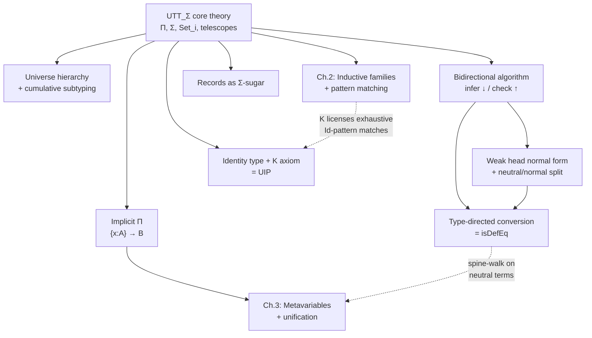

# Dependent Type Theory Foundations

[[book-guidelines|↩ Back to guidelines]]

## Why types need to talk about terms

Ordinary type systems keep two separate worlds: terms (the things that run) and types (the classifications those things get sorted into). A function's type — say `List Int -> Int` — is fixed at compile time and never looks at what the function is actually going to be called with. That buys you a lot, but it caps how precise a specification can be. "Takes a list, returns an int" is compatible with `sum`, with `length`, with a function that ignores its argument and returns `42`. The type doesn't distinguish a *correct* sorting function from a function that merely has the right shape.

Norell opens the thesis with exactly this observation: a type system becomes genuinely more expressive the moment types are allowed to mention terms — for instance, "takes a list of elements with a total order, and returns a permutation of that list which is sorted." That's not a shape constraint anymore; it's close to a full specification. The type checker, in verifying that a program has this type, is doing something close to proof-checking.

**What breaks without this:** without term-dependent types, "verified sorting" and "well-typed sorting" are different claims, and closing the gap between them requires an external proof obligation (Hoare triples, a separate verification tool, hand-written invariants) bolted onto a type system that structurally can't express the property. Dependent types fold the specification *into* the type itself — this is the entire premise the rest of the thesis, and your refinement-type compiler, builds on. When you later write a refinement type like `{x : Int | x > 0}`, or a Hoare-style contract `requires n >= 0 ensures result >= n`, you are writing a dependent type in disguise: a type indexed by a term-level proposition about a term-level value.

This is the load-bearing idea. Everything else in this chapter — telescopes, universes, the bidirectional algorithm, inductive families, the identity type — is machinery built to make that one idea *checkable* by an algorithm rather than just statable on paper.

## The core theory: $UTT_\Sigma$

Norell doesn't invent a new theory from scratch; he takes Luo's UTT (Unified Theory of dependent Types) and extends it with $\Sigma$-types and $\eta$-laws, naming the result $UTT_\Sigma$. Its entire grammar fits in one figure:

$$
s, t, A, B ::= x \mid (x:A) \to B \mid \lambda x.\, t \mid s\, t \mid (x:A) \times B \mid \langle s, t\rangle \mid \pi_1 t \mid \pi_2 t \mid \mathrm{Set}_i \mid 1 \mid \langle\rangle
$$

Notice something structural before anything else: there is no separate "type" syntax category. $A$, $B$, $s$, $t$ all range over the *same* grammar of terms. A type is just a term that happens to classify other terms — this is what "types can depend on terms" cashes out to syntactically. In Rust or Lean terms: you don't have a `Type` AST and a disjoint `Expr` AST that occasionally reference each other through an escape hatch (like Rust's `const N: usize` generics do); there's one AST, and *judgments* decide which terms are being used as types.

### Dependent function types ($\Pi$-types)

$(x:A) \to B$ generalizes the ordinary arrow $A \to B$ by letting $B$ mention $x$. If $B$ doesn't actually use $x$, it degenerates back to $A \to B$, so the non-dependent function type isn't a separate primitive — it's a special case you get for free.

**Rust grounding.** Rust's closest approximation is a generic function whose return type is computed from a *value*, not just a type parameter — something Rust's trait system fakes via associated types and const-generics but can't express in general (`fn f<const N: usize>(x: [i32; N]) -> [i32; N+1]` is legal only because array-length arithmetic is a special-cased const-eval path, not because Rust has real $\Pi$-types). A closer picture is a typestate-encoded API where the *return type itself* varies with a runtime tag — which is exactly what a `match` on a `Fin n` or a length index would need to do, and which Rust can only simulate through enums plus unsafe casts, never verify statically the way $UTT_\Sigma$ does.

**Lean grounding.** This is Lean's `∀ x : A, B x` (definitionally `Pi`), stated with zero translation cost — `(x : A) → B` *is* the same syntax Lean uses, because Lean's kernel is essentially $UTT_\Sigma$ with more bells attached. When you write `id : {A : Type} → A → A` in Lean, you are writing Norell's example verbatim (implicit-argument syntax included — see below).

### Dependent pair types ($\Sigma$-types)

$(x:A) \times B$ generalizes the product $A \times B$: the type of the second component can depend on the *value* of the first. Elements are built with $\langle s, t \rangle$ and taken apart with $\pi_1$, $\pi_2$, with the expected computation rules $\pi_1 \langle s,t\rangle \to_\beta s$ and $\pi_2\langle s,t\rangle \to_\beta t$.

This is the single most versatile piece of machinery in the chapter — Norell uses it later (section 1.5.3, and Chapter 4) to encode *record types* wholesale, without adding a primitive record construct to the core theory at all.

**Rust grounding.** Think of a `Vec<T>` paired with a compile-time-checked length claim: `(n: usize) × Array<T, n>` says "a length together with an array *of that exact length*" — the second component's type literally mentions the first component's value. Rust cannot express this pairing without external tooling (a proof-carrying wrapper, or a verifier like Prusti/Creusot bolted on) because `usize` values aren't available at the type level.

**Lean grounding.** `Σ x : A, B x` (or `PSigma`), used constantly for "existence with witness" — `⟨w, proof⟩ : Σ x, P x` is `⟨s,t⟩ : (x:A) × B` with identical projection behavior (`.1`/`.2` vs. $\pi_1/\pi_2$).

### Telescopes

A **telescope** $\Delta = (x_1:A_1)\ldots(x_n:A_n)$ is just a dependency-ordered sequence of typed variables — later types may mention earlier variables. It's notation, but load-bearing notation: contexts $\Gamma$ *are* telescopes, so "well-formed context" and "well-formed telescope" are the same judgment, and Norell overloads arrow notation so that $\Delta \to B$ means $(x_1:A_1) \to \cdots \to (x_n:A_n) \to B$, and $\lambda\Delta.\, t$ abstracts over the whole telescope at once.

**What breaks without this:** without a first-class notion "sequence of types where later ones may depend on earlier ones," every multi-argument dependent function (`comp` below has four arguments where each can mention the previous) needs to be written out as nested nullary abstractions with no shared name for "the whole parameter list." Telescopes are what let Chapter 4's [[Module-Systems-for-Dependently-Typed-Languages|module system]] talk about "the parameters of this module" as a single object, and what let a Rust implementation represent a typing context as one indexed `Vec<(Name, Term)>` where index $i$'s type is only allowed to reference indices $< i$ — a de Bruijn-friendly invariant your elaborator's context representation will want directly.

### Universes: the hierarchy, cumulativity, and subtyping

Types themselves need types (otherwise "is this thing a valid type?" has no answer), so $UTT_\Sigma$ stratifies types into a hierarchy $\mathrm{Set}_0, \mathrm{Set}_1, \mathrm{Set}_2, \ldots$, with

$$
\Gamma \vdash \mathrm{Set}_i : \mathrm{Set}_{i+1}
$$

**What breaks without this:** if you tried $\mathrm{Set} : \mathrm{Set}$ (one universe containing itself), you get Girard's paradox — an inconsistent theory where every type is inhabited, which is fatal the moment your type theory is also supposed to be a proof system (as this thesis's later FOL-integration chapter requires). Stratification is the tax paid to keep the theory consistent. Norell doesn't dwell on *how* to stratify (he cites Martin-Löf's own treatments and says the exact mechanism isn't crucial to the thesis) but commits to the hierarchy being:

- **cumulative**: each universe is closed under $\Pi$ and $\Sigma$ (build a function/pair type at level $i$ from components at level $i$, get back something at level $i$), and
- **embedded in higher universes by subtyping**, not just by an explicit lifting operator.

That second point is the interesting design choice, formalized as a genuine subtyping judgment $\Gamma \vdash A \leqslant B$ with:

$$
\Gamma \vdash \mathrm{Set}_i \leqslant \mathrm{Set}_{i+1}
$$

and then *structural* rules lifting $\leqslant$ through $\Pi$ and $\Sigma$:

$$
\frac{\Gamma \vdash A_1 : \mathrm{Set}_i \quad \Gamma \vdash A_2 : \mathrm{Set}_i \quad \Gamma \vdash A_1 \simeq A_2 : \mathrm{Set}_i \quad \Gamma, x{:}A_1 \vdash B_1 \leqslant B_2}{\Gamma \vdash (x:A_1) \to B_1 \leqslant (x:A_2) \to B_2}
$$

(and the identical-shaped rule for $\Sigma$), transitivity, and a rule promoting definitional equality $\simeq$ to subtyping. The one design point Norell flags explicitly as a choice, not a necessity: $\Pi$ and $\Sigma$ are **invariant** in their domain $A$ (the premise demands $A_1 \simeq A_2$, equality, not $A_1 \leqslant A_2$) — he notes covariance in $\Pi$'s domain and contravariance would also be conceivable, but invariance is what $UTT_\Sigma$ commits to. This is one of the thesis's own flagged "Key Questions" (why invariant rather than co/contravariant) — the practical answer is that variance in dependent function domains interacts badly with subject reduction and with later metavariable/unification machinery (Chapter 3), so invariance keeps subtyping simple enough to implement soundly.

Subtyping then combines with the ordinary typing rule

$$
\frac{\Gamma \vdash t:A \quad \Gamma \vdash A \leqslant B}{\Gamma \vdash t : B}
$$

so "$t$ has type $B$" doesn't require literally deriving $t:B$ from the introduction rules — it's enough that $t$ has *some* subtype of $B$.

**Rust grounding.** There's no real Rust analogue — Rust's type universe is unstratified and doesn't need to be, because Rust types can't quantify over types-of-types the way `Set_i : Set_{i+1}` does. The closest gesture is trait-object erasure boundaries, but that's not actually the same phenomenon; better to be honest that this doesn't transfer to Rust and instead treat it as pure elaborator-design knowledge.

**Lean grounding.** This is exactly Lean's `Sort u` hierarchy (`Type = Sort 1`, `Type 1 = Sort 2`, …) with universe polymorphism (`Type u`) as the mechanism that lets one definition be reused at every level — and Lean, notably, does *not* have cumulative subtyping between `Type u` and `Type (u+1)` by an implicit coercion the way Norell's $\leqslant$ does; Lean instead uses explicit `ULift`. Norell's cumulative-subtyping choice is closer to Coq's universe design. This is a genuine implementation fork you'll face directly in a Rust elaborator: cumulativity (implicit, handled by the subtyping judgment during checking) versus strict universes with explicit lifting (simpler metatheory, more annotation burden on the user).

### Conversion: $\beta\eta$-equality

The theory's notion of "these two terms are the same" ($\Gamma \vdash s \simeq t : A$) is $\beta\eta$-equality: $\beta$-reduction ($(\lambda x.s)\,t \to_\beta s[x:=t]$, and the analogous projection rules for pairs) is a *reduction relation*, while $\eta$-equality (a function is convertible to its own eta-expansion, $t \simeq \lambda x.\, t\,x$; a pair is convertible to $\langle \pi_1 t, \pi_2 t\rangle$) is *judgemental* — asserted directly as an axiom of the conversion relation rather than derived from a rewrite step. Norell flags this distinction because it foreshadows exactly how the algorithm in section 1.4 is structured: $\beta$ gets computed away by reduction to weak head normal form, while $\eta$ has to be actively driven by the *type* during conversion checking (see below) — you can't discover an $\eta$-redex by looking at a term in isolation.

### Worked example: the theory is honest about being thin

With only $\Pi$, $\Sigma$, $\mathrm{Set}_i$, and a unit type $1$, there isn't much to program yet — no naturals, no booleans, nothing recursive. Norell's own examples are deliberately small:

```
id : (A : Set) → A → A
id = λA x . x

comp : (A B : Set)(C : B → Set) →
       ((x : B) → C x) → (g : A → B)(x : A) → C (g x)
comp = λA B C f g x . f (g x)
```

`comp`'s type is worth reading closely: `f : (x : B) → C x` is dependently typed in `B`, and the composed function's result type `C (g x)` is computed by substituting the *term* `g x` into `C`. This is the whole "types depend on terms" premise, made concrete: you cannot write this signature in a language where types can only depend on other types.

## Type checking as an algorithm: bidirectional typing

The typing rules of Figure 1.2 (the ones stated declaratively, mirroring the grammar) are not directly an algorithm — they're not syntax-directed the way an implementation needs. In particular the subtyping rule

$$
\frac{\Gamma \vdash t:A \quad \Gamma \vdash A \leqslant B}{\Gamma \vdash t:B}
$$

can apply at any point, so naively you don't know *when* to invoke it while walking a term. Norell's fix — standard by now, but presented here as the concrete instance your own elaborator will be built on — is **bidirectional typing**: split one big "has type" judgment into two mutually recursive judgments with opposite information flow.

$$
\Gamma \vdash e \downarrow A ; t \qquad \text{inference: } \Gamma, e \text{ in} \to A, t \text{ out}
$$
$$
\Gamma \vdash e \uparrow A ; t \qquad \text{checking: } \Gamma, e, A \text{ in} \to t \text{ out}
$$

The mnemonic — arrows describe the *direction the type flows* through the derivation tree. Inference ($\downarrow$) computes the type bottom-up from the leaves (variables, applications — things whose type is determined by their subterms). Checking ($\uparrow$) pushes an *expected* type down from the root (lambdas, pairs — things where the type disambiguates an otherwise-underdetermined term). Both judgments additionally elaborate the user-facing surface expression $e$ into a *core* term $t$ — this is the source/core split ("the user language should be friendly to the user, the core language should be friendly to the type checker") that becomes essential once Chapter 3 adds metavariables, because at that point $t$ is only an *approximation* of what the user wrote until unification finishes filling in the blanks.

**Why checking mode exists at all — the load-bearing asymmetry.** The rules that must live in checking mode:

$$
\frac{A \to_{whnf} (x:B)\to C \quad \Gamma, x{:}B \vdash e \uparrow C ; t}{\Gamma \vdash \lambda x.\,e \uparrow A ; \lambda x.\,t}
\qquad
\frac{A \to_{whnf} (x:B)\times C \quad \Gamma \vdash e_1 \uparrow B; s \quad \Gamma \vdash e_2 \uparrow C[x:=s]; t}{\Gamma \vdash \langle e_1,e_2\rangle \uparrow A ; \langle s,t\rangle}
$$

A bare $\lambda x.\, e$ carries no information about what type $x$ ranges over — you *must* be told the expected type $A$, whnf-normalize it to expose a $\Pi$-shape, and read $x$'s type off of it. Symmetrically, a pair $\langle e_1, e_2\rangle$ can't have its *second* component's type inferred bottom-up, because that type depends on the *value* of the first component, which you don't have compositionally without already knowing $A$. **Key consequence, flagged explicitly by the thesis's own Key Questions:** since $\beta$-redexes are exactly "a lambda applied to something," and lambdas can only be *checked*, not *inferred*, the algorithm as stated **cannot type-check a $\beta$-redex directly** — $(\lambda x.\,e)\,e'$ has no inference rule, because application's premise `Γ ⊢ e1 ↓ A` demands the function position be *inferable*, and a raw lambda isn't. Any completeness argument about the algorithm therefore has to be stated relative to $\beta$-normal source terms. This is a genuinely sharp edge worth internalizing early, since a naive bidirectional elaborator you write will hit the same wall the moment someone writes `(fun x => x) 5` and expects it to just work — Lean's actual elaborator handles this by inserting an explicit synthesize-then-check step, essentially unifying the redex against a fresh metavariable first.

The "switch modes" rule ties the two together:

$$
\frac{\Gamma \vdash e \downarrow B; t \quad \Gamma \vdash A \leqslant B}{\Gamma \vdash e \uparrow A; t}
$$

Checking mode's fallback, whenever a term isn't one of the syntax-directed checking forms, is: infer its type, then subtype-check the inferred type against the expected one. This is precisely where the earlier subtyping judgment gets *used* algorithmically rather than floating free.

### Weak head normal form: normalizing just enough

Types in this algorithm are arbitrary — possibly unevaluated — terms, so every rule that needs to pattern-match on a type's *shape* (is this a $\Pi$? a $\Sigma$? a $\mathrm{Set}_i$?) has to first reduce it just enough to expose that shape, without over-computing. That's **weak head normal form** (whnf), written $t \to_{whnf} nf$:

$$
nf ::= ne \mid \lambda x.\,t \mid \langle s,t\rangle \mid \langle\rangle \mid (x:A)\to B \mid (x:A)\times B \mid 1 \mid \mathrm{Set}_i
$$
$$
ne ::= ne\,s \mid \pi_1\,ne \mid \pi_2\,ne
$$

Two term categories fall out: **normal** forms (whnf where the head genuinely can't reduce further at the top — a constructor, a lambda, a $\Pi$-type) and **neutral** terms $ne$ (a variable applied to stuff, or a projection off a variable-headed thing — something stuck *because* a variable is blocking further reduction, not because reduction is finished). Every application rule uses whnf, not full normal form: `A →whnf (x:B)→C` reduces $A$ *only until* a $\Pi$-head is visible, leaving $B$ and $C$ themselves potentially unevaluated. This is a genuine algorithmic-efficiency decision, not an afterthought — full normalization before every type-shape check would be wasteful and, once you add general recursion or large inductive computations, potentially non-terminating for no benefit.

**Rust grounding.** This maps directly onto how you'd structure a Rust term-reduction pass: a `fn whnf(t: &Term, env: &Env) -> Term` that reduces redexes at the head only, versus a separate (rarely-called) `fn normalize` that recurses into subterms — exactly the split you want for performance in a real type checker, where whnf gets called constantly (every application, every projection, every subtype check) and full normalization is reserved for cases like `Eq.refl`-style definitional-equality checks that must go all the way down.

**Lean grounding.** This is precisely Lean's `whnf` function inside its kernel/elaborator — the same name, the same job: reduce a term just enough to see its head constructor for a `match`/`isDefEq` step, without paying for full normalization. When Norell's algorithm writes `A →whnf (x:B)→C`, that's the same call Lean's `isDefEq`/`whnf` makes internally when it needs to decide "is this a function type."

### Conversion checking: bidirectional again, at the term level

Subtyping and conversion checking mirror the type-checking split exactly, with the *same* motivating asymmetry: three layers —

$$
\Gamma \vdash A \leqslant B \quad (\text{arbitrary terms}) \;\to\; \Gamma \vdash A \leqslant^0 B \quad (\text{whnf terms})
$$
$$
\Gamma \vdash s \simeq t \uparrow A \quad (\text{arbitrary}) \;\to\; \Gamma \vdash s \simeq^0 t \uparrow A \quad (\text{whnf}) \;\to\; \Gamma \vdash s \equiv t \downarrow A \quad (\text{neutral, type-inferring})
$$

Both first whnf-normalize, then dispatch on shape. Conversion is *type-directed*: $\Gamma \vdash s \simeq t \uparrow A$ takes the type $A$ as an input, because that's what drives $\eta$-expansion decisions — e.g. checking $(x:A)\to B$-typed terms for equality recurses as $\Gamma, x{:}A \vdash s\,x \simeq t\,x \uparrow B$, which is exactly the $\eta$-law for functions applied structurally rather than rewritten away first. Every type $\mathrm{Set}_\alpha$ gets treated generically (the specific universe *level* doesn't matter for conversion purposes — only that both sides are types). And, mirroring the checking/inference split above, conversion of **neutral** terms is where type *inference* re-enters: you can't push a type down into a stuck variable-application chain the way you can into a constructor, so $\Gamma \vdash s \equiv t \downarrow A$ infers $A$ bottom-up while comparing spines structurally — variable-against-variable, argument-by-argument, with the argument comparison itself falling back to type-directed (checking-mode) conversion.

**This is, almost verbatim, `isDefEq`.** If you've used Lean or read about its elaborator, this three-layer structure (whnf-reduce both sides, dispatch on the resulting shapes, fall back to comparing neutral spines by inferring their types) *is* what Lean's `isDefEq` does. Definitional equality checking in any real dependently-typed kernel is this algorithm, not a naive "compute both sides to full normal form and compare syntactically" — full normalization is both slower and, in the presence of non-terminating extensions, unsound to rely on as a decision procedure. This is one of the clearest points in the chapter where "the book's own equality machinery is doing unification's job without naming it as such" (per your standing thread): conversion checking on neutral terms — walking two spines and recursively demanding their arguments match — is structurally identical to first-order syntactic unification with no metavariables yet in play. Chapter 3's actual unification algorithm is this same spine-walk, generalized to also solve for metavariables when a mismatch is hit rather than just failing.

## Extensions previewed: what UTT_Σ still needs

Section 1.3–1.4's theory is deliberately thin — Norell explicitly defers real datatypes to Chapter 2, so section 1.5 previews four extensions the rest of the thesis develops in full.

### Inductive families

A `data` declaration

```
data D Δ : Γ → Seti where
   c1 : Θ1 → D Δ t̄1
   ..
   cn : Θn → D Δ t̄n
```

introduces a family $D$ **parameterised** by $\Delta$ (fixed across all constructors and all uses) and **indexed** by $\Gamma$ (can vary per constructor). This parameter/index distinction is easy to gloss over but matters a lot algorithmically (Chapter 2 exploits it heavily): parameters never need to be unified away during pattern matching because they're structurally guaranteed identical everywhere, while indices are exactly what pattern matching *refines*. The canonical example is `Fin`:

```
data Nat : Set where
  zero : Nat
  suc : Nat → Nat

data Fin : Nat → Set where
  fzero : (n : Nat) → Fin (suc n)
  fsuc : (n : Nat) → Fin n → Fin (suc n)
```

`Fin n` — "naturals strictly below `n`" — is a *type family indexed by a term* (`n`), which is only expressible because the theory already has term-dependent types. `Vec A n` (vectors of statically-known length) is the immediate generalization.

**Rust grounding.** `Fin`/`Vec` are exactly the shapes the Rust ecosystem fakes with const generics and phantom types — `[T; N]` gives you `Vec A n` for a *fixed compile-time* `n`, but nothing in Rust gives you `Fin n` (a value-indexed subrange type checked against a *runtime* `n`) without hand-rolled unsafe bounds-checking, because Rust's const-generic parameters aren't full dependent-type indices — they're a narrow, closed special case (arithmetic on `usize` only). This is precisely the gap a dependent-type-checker-in-Rust project has to fill by *interpreting* index terms rather than delegating to `rustc`'s const-eval.

**Lean grounding.** This is `Fin n`, `Vector α n`, and every `inductive ... : IndexType → Type` declaration in Lean, unchanged.

### Uniqueness of identity proofs and the K axiom

The identity type — equality-as-a-type, the mechanism by which "these two terms are propositionally equal" itself becomes a first-class type you can pattern-match on — is presented as an inductive family:

```
data Id (A : Set)(x : A) : A → Set where
  refl : Id A x x
```

$\mathrm{Id}\ A\ x$ is a family indexed over $A$, empty everywhere except at index $x$, where it has exactly one canonical inhabitant, $\mathrm{refl}$. The subtle question is whether it has *only* $\mathrm{refl}$ — whether every proof of `Id A x x` is *provably* equal to `refl`, not merely inhabited by it. That's **uniqueness of identity proofs (UIP)**, and it's not free: the ordinary elimination rule for `Id` (essentially `J`, the induction principle any inductive family gets automatically) is *not* strong enough to derive it — this is a genuine theorem (Hofmann & Streicher, cited by Norell) about what `J` alone can and can't prove, not a matter of someone not having tried hard enough.

Streicher's fix is to add **the K axiom** as an extra primitive:

$$
K : (A:\mathrm{Set})(x:A)(P: \mathrm{Id}\ A\ x\ x \to \mathrm{Set}) \to P\ \mathrm{refl} \to (p : \mathrm{Id}\ A\ x\ x) \to P\ p
$$

Read K as: "to prove a property $P$ of *every* proof $p$ of `x = x`, it suffices to prove $P$ for `refl`" — i.e., you're licensed to treat `p` as if it *were* `refl`, no matter how it was actually constructed. Under pattern matching this looks entirely unremarkable — Norell shows the "obvious" definition:

```
K A x P pr refl = pr
```

— matching `p` against the single constructor `refl` and returning `pr` directly, exactly as you'd expect from an exhaustive one-constructor match. The subtlety the thesis flags as a genuine open question (its own "Key Question" #2) is that this pattern-matching-derived K is *stronger* than what the ordinary elimination rule alone licenses — McBride's later work (cited here) shows K is precisely the *one* extra axiom needed, beyond standard elimination rules, to justify [[Pattern-Matching-over-Inductive-Families|pattern matching over inductive families]] in general. This connects forward to Chapter 2's coverage-checking machinery, where K is what licenses treating `Id`-typed pattern matches as *exhaustive* and *definitional* rather than merely propositionally true.

**Why this matters for your project, explicitly:** this is the fork in the road between **Martin-Löf-style intensional type theory with K/UIP** (Agda's classical setting, Coq's default) and **theories without K** (needed for HoTT-style univalence, where distinct paths between the same two points must be distinguishable, which UIP forbids by construction). If your compiler's refinement-type layer ever wants "proof-irrelevant" propositions (any two proofs of the same proposition are interchangeable — the natural reading of a Hoare-logic side condition, where you don't care *how* a precondition was established, only *that* it holds), K is exactly the axiom licensing that irrelevance for the identity type specifically, and it's worth deciding early whether your kernel bakes it in (simpler, Agda/Coq-classical) or leaves it out (needed if you ever want univalence-flavored reasoning about type equivalence, at real implementation cost).

### Record types as $\Sigma$-type sugar

Rather than adding a record primitive to the core theory, Norell shows records are just notation for nested $\Sigma$-types:

```
record R : Set where
  x : A
  y : B x
  z : C x y
```

desugars to

$$
R = (x:A) \times (y : B\ x) \times C\ x\ y
$$

with named field-projection functions defined directly via $\pi_1/\pi_2$ composition (`x r = π₁ r`, `y r = π₁ (π₂ r)`, `z r = π₂ (π₂ r)`). This is a clean illustration of a recurring move in the thesis: keep the *core* theory minimal, and get record types, modules (Chapter 4), and much of the surface language "for free" as elaboration targets rather than new primitives — fewer things the trusted kernel has to get right. The one caveat Norell adds immediately: in practice each `record` declaration should generate a genuinely *new* type (nominal, not merely the same $\Sigma$-type shape) — otherwise checking two record types for equality means recursively comparing every field's type, whereas nominal records reduce that to comparing *names*, a real efficiency win, and it also keeps intentionally-distinct domain types from being silently interchangeable.

**Rust grounding.** This is close to how a Rust compiler might treat a `struct` as sugar over a tuple internally, except Rust's `struct` really is nominal from the start (two structurally-identical structs are still distinct types) — so Rust already makes the choice Norell recommends as "good practice" the *default*, for the same reason: nominal typing gives you cheap equality checks and prevents accidental interchangeability.

### Implicit function spaces

A new arrow $\{x:A\} \to B$, semantically identical to $(x:A)\to B$ but where the argument can be *omitted* at the call site — `id : {A : Set} → A → A` applied as `id x`, no explicit type argument. Norell is explicit that this is a *preview* — the real content (how do you infer the omitted argument, and prove that inference sound) is Chapter 3's job, built on metavariables. The design choice flagged here: no syntactic restriction on *where* implicit arrows may appear; instead the algorithm reports an error whenever it can't actually infer the argument in context. This is a direct preview of your elaborator project's core mechanism — [[Metavariables-and-Implicit-Arguments|implicit arguments]] are metavariables inserted automatically at elaboration time, solved by unification, and this section is the thesis's promise that Chapter 3 will make that promise-keeping actually sound (not just "usually works").

## How the pieces fit together



## Where this leads

Chapter 2 takes the "inductive families" preview from 1.5.1 and builds the real pattern-matching algorithm on top of it — including the coverage checker that needs the K axiom to justify treating `Id`-matches as exhaustive. Chapter 3 takes the "implicit arguments" preview from 1.5.4 and builds the metavariable/unification algorithm that makes it sound — and that algorithm's spine-comparison step for neutral terms is a direct generalization of the conversion-checking rule $\Gamma \vdash s \equiv t \downarrow A$ from this chapter, now allowed to *solve* a mismatch by instantiating a metavariable instead of just failing. Chapter 4's module system takes the "records as $\Sigma$-sugar" idea and scales it up to whole parameterised modules. In short: this chapter is the trusted kernel every later algorithm in the thesis either extends conservatively (pattern matching, records, modules) or extends by adding a genuinely new judgment form on top of the same bidirectional skeleton (metavariables). For your own compiler, this chapter is close to a direct blueprint for the innermost, must-be-correct layer: term representation, whnf, bidirectional check/infer, and type-directed `isDefEq` — everything else (refinement inference, CHC generation, the CSP kernel) sits *outside* this trusted core and can afford to be heuristic, because it only has to produce inputs this core layer verifies.
