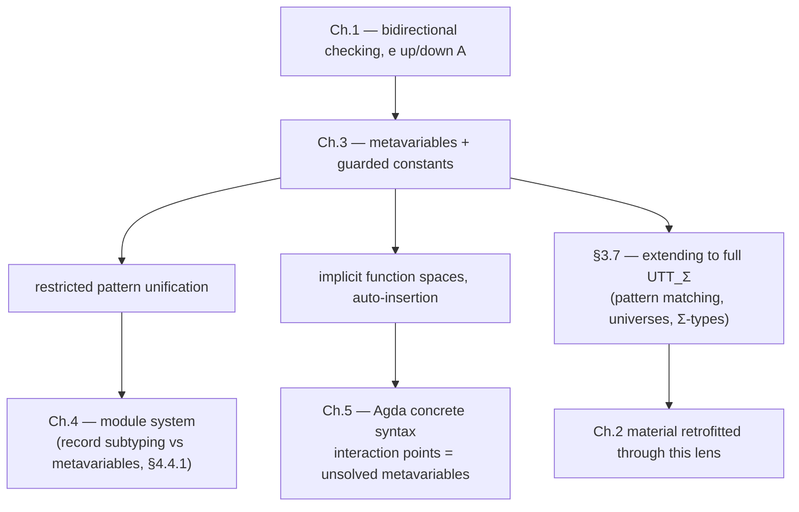

# Metavariables and Implicit Arguments

[[book-guidelines|↩ Back to guidelines]]

## The problem: what does it even mean to type-check a hole?

Suppose you're writing a bidirectional type checker. Every construct either *infers* a type (`↓`) or is *checked against* one (`↑`), and the two modes talk to each other through a conversion check: "does the inferred type equal the expected type?" That conversion check is where everything about dependent types gets hard, because types can contain arbitrary terms, and comparing two types means normalizing and comparing those terms.

Now add elaboration. The user writes `_` somewhere — an omitted implicit argument, an unsolved goal, a piece of information the checker is supposed to recover from context. You represent that `_` internally as a **metavariable**: a placeholder standing for a term that hasn't been determined yet. This is completely standard — every practical dependently typed elaborator (Coq, Agda, Lean) does it. The question Norell's Chapter 3 is actually about is: *what happens to [[Dependent-Type-Theory-Foundations#Conversion checking: bidirectional again, at the term level|conversion checking]] once terms can contain unknowns?*

Here's the concrete trap (§3.1, p.50). Take a signature

$$
\begin{aligned}
\alpha &: \mathrm{Bool} \\
0 &: \mathrm{Nat} \\
F &: \mathrm{Bool} \to \mathrm{Set} \\
F\;\mathrm{false} &= \mathrm{Nat} \\
F\;\mathrm{true} &= \mathrm{Bool}
\end{aligned}
$$

and try to check

$$
\lambda g.\, g\;0 \;:\; ((x : F\,\alpha) \to F(\lnot x)) \to \mathrm{Nat}
$$

Checking the type itself is fine, but it generates a side constraint $F\,\alpha = \mathrm{Bool}$ (because `¬ x` forces `x : Bool`, but `x : F α`). Checking the body then produces $F\,\alpha = \mathrm{Nat}$ and $F(\lnot 0) = \mathrm{Nat}$. That last one is nonsense — `¬ 0` applies a `Bool → Bool` function to a `Nat`. It's an **ill-typed term**, sitting right there in a "constraint" the checker is supposed to reason about later. And dependent-type conversion checking works by *normalizing* terms — which is only safe to do on well-typed terms. Feed it `¬ 0` and, in the best case, normalization gets stuck; in the worst case (as the chapter shows with a genuine example) the checker can be tricked into looping forever, because the *safety net that guarantees termination — "well-typed terms in a strongly-normalizing calculus reduce to a normal form" — has a hole in it exactly where you need it.*

This is the load-bearing insight of the whole chapter: **you cannot let ill-typed intermediate terms exist, even transiently, in a system that relies on well-typedness for termination.** Prior systems (Alf, early Agda) accepted this risk and lived with "partial correctness" — if everything eventually resolves, you're fine, but nothing stops you from looping in the meantime. Norell's algorithm instead guarantees every intermediate term is well-typed *by construction*, at the cost of a new piece of machinery: **guarded constants**.

**What breaks without this:** in a checker/elaborator you're building in Rust, if you ever call `whnf()` (weak-head-normal-form reduction) on a term built from partially-elaborated pieces without this discipline, you risk feeding it a genuinely ill-typed subterm — e.g. a function applied to an argument of the wrong (not-yet-unified) type — and your reduction engine has no contract to rely on. It might infinite-loop, might panic, might silently produce garbage. This is precisely the class of bug that "just call normalize and see what happens" elaborators run into once implicit arguments and unification enter the picture.

## MLF: the minimal theory the algorithm is proved over

Norell doesn't prove the algorithm sound directly for the full dependent theory $UTT_\Sigma$ from Chapter 1 (Π-types, Σ-types, universes, [[Dependent-Type-Theory-Foundations#Inductive families|inductive families]]). Instead he strips down to Martin-Löf's **logical framework MLF** — just `Set`, a base type former $(x:A) \to A$, application, and non-recursive definitions in the signature — proves everything there, and later (§3.7) sketches how to re-add the missing features (Σ-types, universes, pattern matching, function types as first-class terms). This is a good engineering move to imitate: prove the hard metatheory (soundness, termination) on the smallest calculus that exhibits the phenomenon, then argue extensions are orthogonal.

MLF's judgement forms:

$$
\vdash \Sigma \qquad \Gamma \vdash_\Sigma \mathrm{valid} \qquad \Gamma \vdash_\Sigma A\ \mathrm{type} \qquad \Gamma \vdash_\Sigma M : A \qquad \Gamma \vdash_\Sigma A = B \qquad \Gamma \vdash_\Sigma M = N : A
$$

— a signature judgement, a context-validity judgement, a type-formation judgement, typing, type equality, and term equality. Standard, and it's taken for granted along with the usual structural lemmas: uniqueness of types, constructor inversion, substitution, subject reduction under $\to_{whnf}$, and strengthening (dropping an unused variable from the context). These lemmas are the load-bearing metatheoretic API the soundness proof calls into — worth noting, in Rust terms, as exactly the kind of invariant you'd encode as `unsafe`-adjacent preconditions on your own `Context`/`Term` types, checked once and relied on everywhere after.

## Guarded constants: the mechanism

Here's the key move. The checker extends $\mathrm{MLF}$'s signature with a new kind of entry:

$$
p : A = s \;\text{when}\; C
$$

Read: "$p$ is a constant of type $A$; its *candidate value* is $s$; it computes to $s$ only once the constraint set $C$ becomes empty (i.e. is fully solved)." Until then, $p$ is opaque — it doesn't reduce, so it can never leak an ill-typed reduct into the term being built.

Go back to the `¬ α` example. Instead of literally substituting `¬ x` for `x` (which produces an ill-typed subterm once `x`'s type doesn't yet match), the checker replaces the *problematic subterm* with a guarded constant:

$$
(x : F\,\alpha) \to F(p\,x), \qquad p\,x : \mathrm{Bool} = \lnot x \;\text{when}\; F\,\alpha = \mathrm{Bool}
$$

$p\,x$ has an honest, currently-uncontroversial type (`Bool`), and it carries its risky computation (`¬ x`, which needs `x : Bool`) as a *suspended candidate* gated on the very constraint that would justify it. The overall term is well-typed in MLF *right now*, with no metatheoretic hand-waving about "it'll be fine once things get solved." Once $\alpha \mapsto \mathrm{true}$ is chosen, $F\,\alpha \to \mathrm{Bool}$ becomes provable, the guard discharges, and $p\,x$ can finally reduce to $\lnot x$ — which is now safe because $x$ really is a `Bool`.

The general recipe, stated in the chapter's own words: for a type-checking problem $t : C$, the algorithm produces a **well-typed approximation** $t'$ of $t$. Whenever the checker needs $s : B$ for a subterm $s : A$ of $t$ and can't yet establish $A = B$, it swaps $s$ for a fresh guarded constant $p$ of type $B$, with candidate value $s$ and guard $A = B$. $t'$ is *trivially* well-typed in plain MLF (no metavariable-aware reasoning needed to see that) because every hazard has been walled off behind an opaque constant.

```rust
// A sketch of how you'd represent this in a Rust elaborator.
// `TermId` indexes into an arena; constraints reference metavariable ids.

enum SigEntry {
    Const   { ty: TermId },
    Def     { ty: TermId, value: TermId },
    Meta    { ty: TermId, solution: Option<TermId> },
    Guarded { ty: TermId, candidate: TermId, guard: Vec<Constraint> },
}

// whnf() only ever unfolds a Guarded entry once its guard is empty —
// this is the single place the "no ill-typed reduction" invariant is enforced.
fn whnf(sig: &Signature, t: TermId) -> TermId {
    match sig.head_entry(t) {
        Some(SigEntry::Def { value, .. }) => whnf(sig, *value),
        Some(SigEntry::Guarded { candidate, guard, .. }) if guard.is_empty() => {
            whnf(sig, *candidate)
        }
        // Guarded with a nonempty guard, or Meta with no solution: stuck. Return as-is.
        _ => t,
    }
}
```

This `whnf` is exactly what Definition 3.3.1's **MLF restriction** $|\Sigma|$ formalizes: erase the metavariable/guarded-constant bookkeeping by treating a solved guarded constant as an ordinary definition and an unsolved one as an ordinary axiom (type only, no body). All the "is this well-typed" reasoning throughout the chapter happens by reference to $|\Sigma|$, plain MLF — the metavariable machinery is scaffolding around a theory that never itself needs to know metavariables exist.

## Signature operations: metavariables and guarded constants as extensible state

The type checker threads a signature $\Sigma$ through every rule, written $\langle \Sigma \rangle\, J \Rightarrow \langle \Sigma' \rangle$ — "starting from $\Sigma$, judgement $J$ succeeds and yields the (possibly extended) signature $\Sigma'$." Figure 3.1 defines the primitive operations:

- `Lookup(c : A)` — read a constant's type out of $\Sigma$.
- `AddMeta(α : A)` — append a fresh metavariable $\alpha : A$ (uninstantiated) to $\Sigma$.
- `α := s` — *instantiate* $\alpha$ in place: find where $\alpha : A$ sits in $\Sigma = \Sigma_1, \alpha:A, \Sigma_2$ and replace it with $\alpha : A = s$.
- `AddConst(p : A = s\ \text{when}\ C)` — append a fresh guarded constant.
- `InScope_\alpha(s)` — check that every constant free in $s$ already appears earlier in $\Sigma$ than $\alpha$'s declaration site. This is the scope-check that instantiation must respect.

Two design points worth dwelling on, because they generalize past this thesis into any unification-based elaborator:

**1. Signature order is a dependency order, and it's the entire occurs-check.** Because MLF's signature entries are non-recursive definitions listed left-to-right, "$c$ is in scope for $\alpha$" literally means "$c$ appears before $\alpha$ in the list." The chapter makes this explicit in a footnote (p.59): *"scope checking subsumes the usual occurs check, since constants are non-recursive."* You don't need a separate occurs-check pass walking the candidate solution looking for `α` — if `α` could occur in its own candidate, that candidate constant would have to be declared *after* `α`, and `InScope_α` would reject it outright. This is a genuinely elegant simplification: representing metavariables as ordinary signature entries (rather than a side table) turns the occurs-check into a scope-check you already need for other reasons.

**2. Instantiation looks up definitions rather than aliasing.** The worked example (§3.4, p.60–61) is explicit about why: checking `id _ 0 : α` against signature `Nat`, `0`, `id : (A:Set)→A→A`, `α : Set` infers `id`'s applied type as a fresh metavariable `β`, unifies `α` with `β`'s *value* (`Nat`), not with `β` itself — because `β` is declared *after* `α`, so `α := β` would be an out-of-scope reference. The chapter's phrasing: *"it would not be correct to instantiate α to β, since β is not in scope at the point where α is declared."* This is the same discipline every metavariable-based unifier needs: instantiate to normal forms (or at least scope-respecting terms), never to a raw pointer to a later, possibly-not-yet-existing variable.

```python
# Toy illustration of the scope discipline (not load-bearing, just intuition-building)
class Meta:
    def __init__(self, mid, ty):
        self.id, self.ty, self.solution = mid, ty, None

def in_scope(term_consts, meta_decl_index, sig_order):
    # every constant in `term_consts` must have been declared *before* meta_decl_index
    return all(sig_order.index(c) < meta_decl_index for c in term_consts)

def instantiate(sig, alpha, candidate):
    if not in_scope(free_consts(candidate), sig.index_of(alpha), sig.order):
        raise UnificationFailure("out of scope")
    sig.set_solution(alpha, candidate)
```

## The bidirectional algorithm, extended

The judgement forms from Chapter 1 carry over almost unchanged, but two of them now *produce constraints* instead of just succeeding or failing:

$$
\Gamma \vdash e\ \mathrm{type} ; A \qquad \Gamma \vdash e \uparrow A ; s \qquad \Gamma \vdash e \downarrow A ; s \qquad \Gamma \vdash A \simeq B ; C \qquad \Gamma \vdash s \simeq t \uparrow A ; C
$$

Type-formation, checking, and inference behave as before — they consume a *user expression* $e$ (which may contain literal `_` placeholders) and produce an MLF term. The two conversion judgements ($A \simeq B$, and $s \simeq t$ at type $A$) are where the new behavior lives: instead of a yes/no answer they return a **constraint set $C$**, which is empty exactly when conversion actually succeeded outright.

The maintained invariant (stated explicitly, p.55) is the crux of the whole soundness argument: whenever $\Gamma \vdash e \uparrow A ; s$ succeeds, $s$ really is a well-typed term of type $A$ *in the MLF restriction of the resulting signature* $|\Sigma'|$ — not "will be, once constraints resolve," but *right now*. That's the invariant guarded constants exist to preserve.

**Checking a metavariable placeholder** (Figure 3.4):

$$
\frac{\mathrm{AddMeta}(\alpha : \Gamma \to A)}{\Gamma \vdash \_ \uparrow A ; \alpha\,\Gamma}
$$

Every metavariable is created applied to the *entire ambient context* $\Gamma$ (all the variables currently in scope) — this is because metavariables live in the signature (a fixed top-level list), not in the local context, so they have to be **lifted to top level** and take the context as explicit arguments, the way lambda-lifting turns a nested closure into a top-level function plus a captured-environment argument. This is exactly the "context [[Dependent-Type-Theory-Foundations#Telescopes|telescope]] as explicit parameters" trick a Rust elaborator would implement by storing each metavariable's *creation context* and generating one implicit parameter per bound variable.

**The two conversion-checking outcomes** for `e ↑ A`:

$$
\frac{\Gamma \vdash e \downarrow B ; s \quad \Gamma \vdash A \simeq B ; \emptyset}{\Gamma \vdash e \uparrow A ; s}
\qquad\qquad
\frac{\Gamma \vdash e \downarrow B ; s \quad \Gamma \vdash A \simeq B ; C \neq \emptyset \quad \mathrm{AddConst}(p : \Gamma \to A = \lambda\Gamma.s \;\text{when}\; C)}{\Gamma \vdash e \uparrow A ; p\,\Gamma}
$$

Infer $e$'s type as $B$, compare against the expected $A$. If conversion succeeds cleanly ($C = \emptyset$), just use the inferred term $s$. If conversion instead leaves residual constraints, **don't fail** — wrap $s$ in a fresh guarded constant $p$ (again lifted over the whole context) whose guard is exactly the leftover constraint, and hand back $p\,\Gamma$ instead. This is the single rule that turns "conversion is undecided" from a hard failure into a deferred obligation, which is the entire point of the chapter.

**What breaks without guarded constants here:** you'd have to either (a) reject the program outright the moment any constraint can't be solved immediately — hopeless for implicit arguments, since most of them only become solvable after later arguments are processed — or (b) substitute the unverified term anyway and hope, which is exactly the ill-typed-intermediate-term trap from §3.1.

## Conversion checking: where constraints are actually born

**Type conversion** (Figure 3.5) is syntax-directed on the shape of $A$ and $B$. The interesting rule is comparing two function types $(x:A_1)\to B_1$ and $(x:A_2) \to B_2$ when the domains $A_1, A_2$ don't convert outright:

$$
\frac{\Gamma \vdash A_1 \simeq A_2 ; C,\ C \ne \emptyset \quad \mathrm{AddConst}(p : \Gamma \to A_1 \to A_2 = \lambda\Gamma x. x \;\text{when}\; C) \quad \Gamma, x:A_1 \vdash B_1 \simeq B_2[x := p\,\Gamma\,x] ; C'}{\Gamma \vdash (x:A_1)\to B_1 \simeq (x:A_2) \to B_2 ; C \cup C'}
$$

Why the substitution $B_2[x := p\,\Gamma\,x]$ instead of just comparing $B_1$ against $B_2$ under $x : A_1$? Because $B_2$ was only well-formed under $x : A_2$, and until $A_1 = A_2$ is actually established you cannot legally treat $x : A_1$ as inhabiting $B_2$'s domain — that would violate the invariant "$\Gamma \vdash A\ \mathrm{type}$" the algorithm maintains at every step. The fix: coerce through a guarded constant $p$ whose *type signature* claims $A_1 \to A_2$ (trivially well-formed — it's just a function type between two known types) and whose *candidate value* is the identity function, gated on $A_1 = A_2$ actually holding. Once that guard clears, $p$ genuinely is the identity (both domains are the same type), so substituting $p\,\Gamma\,x$ for $x$ was harmless all along — but crucially, the well-formedness of $B_2[x := p\,\Gamma\,x]$ never depended on that guard clearing, because $p\,\Gamma\,x : A_2$ regardless.

**Term conversion** normalizes both sides to weak-head-normal form first, then compares heads (Figure 3.7):

- Same head (variable, constant) $h : \Delta \to A$ on both sides → recursively compare the argument spines under $\Delta$.
- One head is a **guarded constant** → give up immediately, return the whole comparison as one constraint. (There's no point trying to look inside — the guarded constant might unfold to anything once its guard clears.)
- One head is a **metavariable** applied to a spine of variables, $\alpha\,\bar x$ — this is where **pattern unification** happens.

## Restricted pattern unification

$$
\frac{\bar x\ \text{distinct} \quad s \to_{nf} s' \quad \mathrm{FV}(s') \subseteq \bar x \quad \mathrm{InScope}_\alpha(\lambda\bar x. s') \quad \alpha := \lambda\bar x. s'}{\Gamma \vdash \alpha\,\bar x \simeq' s \uparrow A ; \emptyset}
$$

This is a **restricted** case of what the literature calls Miller pattern unification: it only fires when a metavariable is applied to a spine of *distinct bound variables* $\bar x$ (a "pattern"), never to an arbitrary term. Given $\alpha\,\bar x = s$, the natural guess is $\alpha := \lambda\bar x.\,s$ — abstract the free occurrences of $\bar x$ out of $s$. Three side conditions have to hold simultaneously for this to be sound:

1. **$\bar x$ are distinct** — if the same variable occurred twice, $\lambda \bar x. s$ wouldn't determine a unique solution (this is exactly why *non-pattern* unification is undecidable in general — Huet's higher-order unification problem).
2. **$\mathrm{FV}(s') \subseteq \bar x$** — $s$ (normalized to $s'$) can't mention any *other* variable from the local context, or the abstraction $\lambda\bar x.s'$ wouldn't be closed / well-scoped.
3. **$\mathrm{InScope}_\alpha(\lambda\bar x.s')$** — no constant occurring in $s'$ was declared *after* $\alpha$ (this is the occurs-check-via-scope-check described above, applied here specifically to instantiation).

Why normalize $s$ to $s'$ before checking these conditions rather than working with $s$ directly? Because $s$ might mention *other* metavariables introduced after $\alpha$ but already solved — normalizing unfolds those solutions, and the actual (post-substitution) content of $s'$ is what has to respect scoping, not its unexpanded surface syntax. The chapter flags a possible refinement — allowing a controlled reordering of consecutive metavariable declarations so more instantiations become legal — but notes it's unclear how much this buys in practice, since usually you'd just solve the later metavariable first anyway.

If any of these three conditions fails, or the head simply isn't a metavariable-applied-to-a-pattern at all, unification doesn't try harder — it just **returns the whole equation as a constraint** to be retried later. That's the "restricted" in restricted pattern unification: it's a fast, decidable, easily-proved-sound fragment, deliberately incomplete, with graceful fallback to postponement rather than failure.

```rust
// The core of pattern unification's success/postpone decision.
fn try_solve_pattern(sig: &mut Signature, alpha: MetaId, spine: &[TermId], rhs: TermId)
    -> Result<(), Constraint>
{
    // Condition 1: spine must be distinct local variables.
    let vars: Option<Vec<VarId>> = spine.iter().map(as_local_var).collect();
    let Some(vars) = vars.filter(|v| all_distinct(v)) else {
        return Err(Constraint::eq(app(alpha, spine), rhs));
    };
    let rhs_nf = normalize(sig, rhs);
    // Condition 2: rhs, normalized, only mentions those variables.
    if !free_vars(&rhs_nf).is_subset(&vars) {
        return Err(Constraint::eq(app(alpha, spine), rhs));
    }
    // Condition 3: every constant in rhs is declared before alpha (scope = occurs-check).
    if !in_scope(sig, alpha, free_consts(&rhs_nf)) {
        return Err(Constraint::eq(app(alpha, spine), rhs));
    }
    sig.instantiate(alpha, lambda_abstract(&vars, rhs_nf));
    Ok(())
}
```

**This is precisely the fragment your project's own elaborator will need to implement** for implicit-argument resolution in the spirit of Miller pattern unification — Norell's version is the historically direct ancestor of how Agda (and, downstream, much of the design space Lean's `isDefEq`/unifier occupies) actually resolves metavariables in practice. In Lean's elaborator, the analogous move is: `isDefEq` normalizes both sides to whnf, and when it hits a metavariable applied to a spine of distinct free/local variables, it performs exactly this pattern-unification assignment; anything outside that fragment gets deferred as a *postponed unification problem*, resumed later once more metavariables are solved — the same postponement discipline as Norell's "return the constraint as-is."

## Argument-list conversion and why order matters

Comparing two argument spines $\bar s \simeq \bar t$ against a telescope $\Delta$ (Figure 3.8) has to handle dependency between arguments carefully:

$$
\frac{\Gamma \vdash s \simeq t \uparrow A ; \emptyset \quad \Gamma \vdash \bar s \simeq \bar t \uparrow \Delta[x := s] ; C}{\Gamma \vdash s;\bar s \simeq t;\bar t \uparrow (x:A)\Delta ; C}
\qquad
\frac{\Gamma \vdash s \simeq t \uparrow A ; C \ne \emptyset \quad x \in \mathrm{FV}(\Delta)}{\Gamma \vdash s;\bar s \simeq t;\bar t \uparrow (x:A)\Delta ; \{\Gamma \vdash s;\bar s = t;\bar t : (x:A)\Delta\}}
$$

If the first pair converts cleanly, substitute and recurse — routine. But if comparing the *first* arguments leaves an unsolved constraint **and** later argument types actually depend on that first argument ($x \in \mathrm{FV}(\Delta)$), the algorithm doesn't try to push forward piecewise — it bundles the *entire remaining spine* into one constraint. Why not just keep going with a guarded constant standing in for the unresolved first argument? Because $\Delta$'s later types genuinely need to know *which* value $x$ takes to even be well-formed — you can't type-check $t_2 : \Delta_2[x := ?]$ without committing to something for $x$, and a guarded constant that might reduce to anything doesn't give you a stable type to check $t_2$ against. Only when later types are *independent* of the first argument ($x \notin \mathrm{FV}(\Delta)$) can the algorithm process each argument pair separately and just union the constraint sets — this is the third rule, comparing independently and merging $C_1 \cup C_2$.

This is a nice, concrete illustration of a general elaboration principle worth internalizing for a Rust-based dependent checker: **dependency in the telescope forces sequential, coupled constraint generation; independence permits parallel, decoupled constraint generation.** Anywhere your own checker processes argument lists for a dependently-typed function application, this same fork applies.

## Soundness and termination (§3.5)

The proof is staged in two parts, and the staging itself is instructive.

**Stage 1 — soundness *without* constraint solving (Theorem 3.5.5).** First, ignore entirely the question of *whether* guards ever get solved; prove only that at every step, the algorithm (a) produces well-typed terms of the right type in the current $|\Sigma|$, (b) produces *well-formed* (not necessarily *true*) constraints, and (c) only ever extends the signature — never invalidates earlier entries. "Extends" is made precise:

> **Definition (Signature extension).** $\Sigma'$ extends $\Sigma$ if every MLF judgement provable under $\Sigma$ is also provable under $\Sigma'$.

Two lemmas justify the two ways the algorithm grows a signature: **weakening** (appending a fresh constant is always an extension — trivial, nothing about the past changes) and **refinement** (turning an axiom $c : A$ into a definition $c : A = s$ is *also* an extension, precisely because any derivation valid under the axiom stays valid once you additionally know what $c$ equals). Instantiating a metavariable and solving a guarded constant's guard are both instances of refinement. This "extension" framing is the load-bearing abstraction that makes the whole proof compositional: instead of re-proving global well-typedness after every single elaboration step, you just have to show each individual signature-mutating operation is one of these two safe shapes.

Because $|\Sigma'|$ terms stay well-typed in strongly-normalizing MLF at every step, they have normal forms, and every operation in the algorithm other than normalization itself is structurally recursive — hence **Corollary 3.5.6: the algorithm terminates**, always answering "yes," "no," or "maybe, pending metavariable instantiation" — never looping. This directly closes the trap from §3.1: the ill-typed-intermediate-term hazard that could make normalization loop is designed away *before* getting anywhere near normalization.

**Stage 2 — soundness of constraint solving.** Now bring guards back into the picture: what happens when you actually go solve them (by rechecking a guard's constraint and simplifying it)? This needs a stronger signature invariant than mere well-formedness, because a guarded constant's *existence* in the signature was only ever justified conditionally:

> **Definition (Consistent signature).** $\Sigma$ is consistent if for every guarded constant $p : A = s\ \text{when}\ C$ in $\Sigma_1, p:A=s\ \text{when}\ C, \Sigma_2$, the constraint $C$ **ensures** $\vdash s : A$ in $\Sigma_1$ — meaning: in *any* extension of $\Sigma_1$ where $C$ becomes solved, $s : A$ genuinely holds.

This is the formal contract every guarded constant has to satisfy at the moment it's created, and **Lemma 3.5.11 (soundness of generated constraints)** proves conversion checking always manufactures constraints meeting that contract. **Lemma 3.5.13** then shows type checking preserves consistency across the board, and **Lemma 3.5.14** concludes constraint solving is itself sound and is a signature extension in the Definition-3.5.1 sense — meaning **type checking and constraint solving can be freely interleaved**, in any order, and you can solve guards eagerly the instant a relevant metavariable gets instantiated, which is exactly what you want for good elaboration-error locality and for producing the tightest possible "type-correct approximation" of the user's program early.

**The closing theorem (3.5.18)** ties it together: if you run the algorithm to completion — every metavariable instantiated, every guard solved — the resulting term, after unfolding all the metavariable/guarded-constant scaffolding via a substitution $\sigma$, is provably well-typed *in the original signature $\Sigma$*, with no leftover trace of the elaboration machinery, and it is a genuine **refinement** of the user's original expression (Definition 3.5.16: obtained from $e$ purely by filling in the `_`s with concrete terms — nothing else was silently changed). Definitions 3.5.15/3.5.16 (**approximation** and **refinement**) formalize the two, and only two, operations the checker is ever allowed to perform when building a term: replace a hole with something concrete (refinement of the user expression), or replace a risky subterm with a guarded constant carrying that same subterm as its candidate (approximation of the checker's own output). Everything the algorithm does decomposes into these two moves — which is a clean informal specification of elaboration correctness worth carrying over verbatim into your own compiler's trusted-kernel boundary: *the elaborator's output, after fully unfolding metavariables, must be indistinguishable from a term the user could have written by hand.*

## What could go wrong without guarded constants — a concrete diverging term

The chapter doesn't leave the danger abstract. Given `Nat`, `0 : Nat`, and

$$
\mathrm{coerce} : (F : \mathrm{Nat} \to \mathrm{Set}) \to F\,0 \to F\,0 = \lambda F\,x.\,x
$$

for *any* well-typed $t : B$ and *any* type $A$, checking $\mathrm{coerce}\ t$ against $A$ produces two unsolvable constraints ($\alpha\,0 = B$ and $A = \alpha\,0$, for fresh $\alpha$) — `coerce` is a generic "trust me" cast. If the checker naively let `coerce t` reduce to `t` before those constraints were discharged, `coerce` would silently be able to give *any* term *any* type — including terms that don't have that type at all. Concretely:

$$
\omega : (\mathrm{Nat}\to\mathrm{Nat}) \to \mathrm{Nat} = \lambda x.\, x\,(\mathrm{coerce}\ x) \qquad \Omega : \mathrm{Nat} = \omega\,(\mathrm{coerce}\ \omega)
$$

Without guarded constants, $\Omega$ reduces straight to the untyped $\Omega$-combinator $(\lambda x.\,x\,x)(\lambda x.\,x\,x)$ — a term with **no normal form**, injected into a supposedly strongly-normalizing calculus at type `Nat`. This is *the* concrete demonstration of why the danger in §3.1 isn't hypothetical: unchecked coercion through unsolved equality constraints is enough to break normalization outright, at the very heart of the property the whole type theory depends on for decidability. With guarded constants, `coerce`'s argument and the application itself both get wrapped: $p = \mathrm{coerce}\ \alpha\ q\ \text{when}\ \alpha\,0 = \mathrm{Nat}\to\mathrm{Nat}$, and since that guard is never actually solvable, $p$ (and hence $\Omega \equiv \omega\,p$) simply never reduces further — the type-correct approximation stays stuck forever, which is the *correct* outcome for an ill-typed program.

## Implicit arguments (§3.6): metavariables put to work

Everything above builds the *mechanism*; implicit arguments are the payoff — "once we have metavariables, adding implicit arguments is simply a matter of inserting them at the right places."

A new function-space former, the **implicit Π-type** $\{x:A\}\to B$, is added purely as a *hint to the elaborator about where to auto-insert metavariables*. Semantically it is **identical** to the ordinary $(x:A)\to B$ — same typing, same reduction. This is a deliberate and important design choice, contrasted explicitly against the implicit calculus of constructions, where implicit function types are **intersection types**: $\{x:A\}\to B$ there means something semantically different (roughly, a term inhabiting $B$ *for every* instantiation of $x$ simultaneously), which forces implicit arguments to be *computationally irrelevant* — they can never affect the run-time behavior of the term, only its type.

Norell's `downFrom` example shows why that restriction would be too strong for a practical language:

```
data Vec (A : Set) : Nat → Set where
  ε  : Vec A zero
  _::_ : {n : Nat} → A → Vec A n → Vec A (suc n)

downFrom : {n : Nat} → Vec Nat n
downFrom {zero}  = ε
downFrom {suc n} = n :: downFrom n
```

`n` is safe to leave implicit — the caller's expected type always pins it down — but it is emphatically **not** computationally irrelevant: the body pattern-matches on it (`zero` vs `suc n`) and produces genuinely different vectors depending on its value. An intersection-type reading of `{n : Nat}` would forbid this. Norell's product-type reading — "implicit is purely a *syntactic* convenience for omitting arguments the elaborator can recover, with zero semantic difference from writing them explicitly" — allows exactly this pattern, at the cost of losing the (stronger, more restrictive) irrelevance guarantee intersection types would have given you for free. This is a real design tradeoff, not a free simplification, and worth flagging explicitly if your own compiler's implicit-argument feature needs to decide between the two readings: product-style implicits are strictly more expressive (you can pattern-match on them) but give you weaker erasure/irrelevance guarantees than intersection-style implicits.

The new rules (extending Figure 3.4's checking rules, plus a new application judgement):

$$
\frac{\Gamma, x:A \vdash e \uparrow B ; s}{\Gamma \vdash \lambda\{x\}.e \uparrow \{x:A\}\to B ; \lambda\{x\}.s}
\qquad\qquad
\frac{\Gamma, x:A \vdash e \uparrow B ; s \qquad e \ne \lambda\{x\}.e'}{\Gamma \vdash e \uparrow \{x:A\}\to B ; \lambda\{x\}.s}
$$

The second rule is the auto-insertion rule: checking an expression that *doesn't itself start with an explicit implicit-lambda* against an implicit function type just goes ahead and inserts $\lambda\{x\}$ automatically — the user never had to write it.

Application dispatch introduces $\Gamma \vdash A\, @\, \bar e \downarrow B ; \bar s$ — "a function of type $A$ applied to user-argument-list $\bar e$ produces type $B$ with type-correct-approximation argument list $\bar s$":

$$
\frac{\Gamma \vdash e \uparrow A ; s \qquad \Gamma \vdash B[x:=s]\, @\, \bar e \downarrow B' ; \bar s}{\Gamma \vdash (x:A)\to B\, @\, e;\bar e \downarrow B' ; s;\bar s}
\qquad
\frac{\Gamma \vdash e \uparrow A ; s \qquad \Gamma \vdash B[x:=s]\, @\, \bar e \downarrow B' ; \bar s}{\Gamma \vdash \{x:A\}\to B\, @\, \{e\};\bar e \downarrow B' ; s;\bar s}
$$

$$
\frac{\Gamma \vdash \{x:A\}\to B\, @\, \{\_\};e;\bar e \downarrow B' ; \bar s}{\Gamma \vdash \{x:A\}\to B\, @\, e;\bar e \downarrow B' ; \bar s}
\qquad
\frac{\Gamma \vdash \{x:A\}\to B\, @\, \{\_\} \downarrow B' ; \bar s}{\Gamma \vdash \{x:A\}\to B\, @\, \varepsilon \downarrow B' ; \bar s}
\qquad
\frac{A \ne \{x:A_1\}\to A_2}{\Gamma \vdash A\, @\, \varepsilon \downarrow A ; \varepsilon}
$$

Read this as a small state machine walking down the function's type against the remaining user-supplied argument list: explicit argument against explicit Π — consume both; explicit `{e}` against implicit Π — consume both; a *plain* (non-`{}`) argument or **no arguments left at all** against a remaining implicit Π — **synthesize a `_`** for that slot and recurse (this is the actual auto-insertion of metavariables the topic is named for); and finally, once the arguments run out and the remaining type isn't an implicit Π, stop. The elaboration-friendly upshot: a user calling `downFrom` never has to write `downFrom {5}`-style boilerplate the type could reconstruct on its own — the checker inserts the metavariable, and pattern unification (from the section above) usually pins it down for free from the expected result type.

## Extending past MLF (§3.7) — and where the story gets genuinely open

Four extensions are sketched, of increasing difficulty, because MLF's soundness proof doesn't automatically transfer to $UTT_\Sigma$:

1. **Σ-types and the unit type** are easy and *useful beyond expressiveness*: given $\alpha : \Gamma \to (x:A)\times B$, you can always instantiate by **η-expansion**, $\alpha := \lambda\Gamma.\langle \beta\,\Gamma, \gamma\,\Gamma\rangle$ for fresh $\beta : \Gamma \to A$, $\gamma : \Gamma \to B[x := \beta\,\Gamma]$ — you never actually need to *know* the pair's components to know *that* it's a pair, so a metavariable of Σ-type can always be split. Symmetrically, $\alpha : \Gamma \to 1$ solves trivially to $\lambda\Gamma.\langle\rangle$ — meaning **any argument of the unit type can always be safely omitted**, since there's only one possible value. Norell's `div` example exploits exactly this: a safe-division function `div : (n m : Nat){p : NonZero m} → Nat` where `NonZero` is a computed empty-or-unit type — when `NonZero m` happens to reduce to the unit type (i.e. `m` is syntactically a nonzero literal), the proof obligation discharges itself automatically via this η-rule, with zero user annotation. This is a genuinely elegant preview of refinement-type-flavored proof automation riding entirely on the Σ/unit metavariable-solving machinery — worth flagging for your own refinement-type compiler, since automatically-discharged unit-typed proof obligations are a cheap, sound source of "free" verification-condition closure.
2. **Function types as terms** (first-class Π at the term level) is harder: now a metavariable's *type itself* might turn out to be a function type once instantiated, so every site expecting a function type (checking a λ, inferring an application) has to consider "this might currently be an unresolved metavariable" and, if the metavariable isn't applied to a clean pattern, **postpone the whole type-checking problem**, not just a constraint — meaning the signature needs a new kind of entry for "elaboration obligations still pending," beyond plain metavariables and guarded constants.
3. **Universe hierarchy** interacts badly with metavariables at the level type: instantiating a metavariable to a function type leaves you not knowing what universe *levels* the newly-minted argument/result metavariables should live at, and the natural fix (level metavariables) generates *inequality* constraints rather than equality ones — a strictly harder constraint-solving problem the thesis admits is unresolved: the shipped implementation just collapses inequalities to equalities (unsound-in-general but pragmatic — it rejects some valid programs rather than accepting invalid ones), and solving the inequalities properly is flagged as "potentially very costly."
4. **Pattern matching** interacts with metavariables the same way it interacts with everything else that relies on weak-head-normal-form: reduction of a pattern-matching definition can get **stuck** on an uninstantiated metavariable in scrutinee position (`¬ α` can't reduce until `α` is known to be `true` or `false`), so conversion checking again has to fall back to producing a constraint rather than forcing a reduction.

## Where this leads



This chapter is the technical hinge the rest of the thesis's *practicality* claims lean on. Chapter 5's Agda syntax describes interaction points (`?`, `{! !}`) as literally *unsolved metavariables surfaced to the user* — the entire interactive editing story is this chapter's machinery viewed from the outside. Chapter 4 explicitly flags (§4.4.1) that naive record-subtyping-by-coercion interacts badly with metavariable-based implicit arguments, and chooses its module-system design specifically to sidestep that interaction — i.e., a design decision elsewhere in the thesis is directly downstream of a soundness concern raised here. And §3.7's list of unfinished extensions (universe-level inequality constraints above all) is presented candidly as open engineering debt the actual Agda implementation had to absorb.

For the standing project of building a Rust elaborator with Lean-style bidirectional typing and Miller-pattern-based metavariable resolution: this chapter *is* the blueprint for the unification/elaboration core. The signature-as-append-only-extension discipline (Definition 3.5.1), the guarded-constant representation of "risky, not-yet-justified computation," and the pattern-unification success/postpone fork are not incidental historical details — they're close to the actual architecture you'd want for `isDefEq` plus a metavariable context in a from-scratch Rust kernel, and they come with a from-scratch soundness and termination proof you can adapt rather than reinvent. The universe-level-inequality gap flagged in §3.7.3 is also a fair warning: if your compiler's universe hierarchy needs metavariables at the level (not just term) level, expect that to be the genuinely open research corner, not a solved problem you can copy verbatim.
