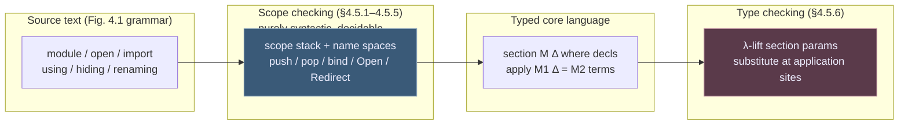

[[book-guidelines|↩ Back to guidelines]]

# Module Systems for Dependently Typed Languages

## Why this chapter exists: the problem a type checker should never have to solve

Every module system answers one question: *how do names resolve to definitions?* In an ordinary, simply typed language that question is basically independent of typing — you can imagine compiling `import numpy as np; np.array(...)` without knowing a single thing about arrays, dtypes, or shape inference. The module system just needs to know that `np.array` denotes some entity, and hand its resolved identity to the type checker.

Dependent types make it tempting to break this independence. Once types can mention terms — `Vec A n` depends on the value `n`, `IsEven n` depends on `n` — it's natural to reach for the type system itself as your modularity mechanism: encode a "module" as a big dependent record, encode "module application" as record projection plus substitution, and let the elaborator sort it out. Coq's and Cayenne's module systems each go some distance down this road, splitting a module into a *signature* (a type — the interface) and a *structure* (a term — the implementation), and using the theory's own subtyping and unification machinery to check that a structure matches a signature.

Norell's chapter makes an explicit, opinionated bet against this: **decouple the module system completely from the type checker.** A module is defined solely by its implementation — there is no separate interface language, no functor calculus, no module-level subtyping. The module system's entire job is *name-space management*: given a hierarchical program text with `module`, `open`, `import` declarations, rewrite it into a flat, unambiguous set of fully-qualified definitions. Type checking never sees a "module" as a first-class notion at all — after scope checking, only two module-shaped constructs survive into the typed language: **sections** (which are just [[Dependent-Type-Theory-Foundations#Telescopes|telescopes]] of variables shared by a block of definitions) and **applications** (which are just calls that get compiled to new definitions by direct substitution). Algebraic structure — the actual "interface implemented by structure" pattern other systems bake into their module calculus — is instead modeled with ordinary Σ-types (records), which the type checker already knows how to handle.

**What breaks without this separation.** If module resolution is entangled with type checking, then to know what `Sort.insert` refers to you may need to *elaborate* the module `Sort`, which may require solving metavariables, which may require normalizing terms that themselves mention module-qualified names — a chicken-and-egg dependency that makes separate compilation (type-check module `A` once, reuse the result when type-checking `B` that imports it) fragile, and makes the checker's termination and complexity harder to reason about. By making scope checking a *pure, decidable, syntactic* pass that runs to completion before a single typing judgment is invoked, Norell buys: separate compilation, a much smaller trusted surface for the "structuring" part of the language, and (his headline claim) a system that stays independent of *which* dependently typed language it's bolted onto — this recipe would slot onto Lean's kernel, Rust's trait system, or (as the thesis literally does) onto Agda's `UTT_Σ` with no changes to the core idea.

This is exactly the "separate a feature cleanly from the core type checker" principle that recurs across the whole thesis (pattern matching compiles away to a case tree before the checker sees it; metavariables get resolved by a constraint layer around the checker) — modules are the fourth and final instance of it.



This is the map for the whole chapter: everything in §4.2–§4.4 is *surface syntax* that scope checking (§4.5.1–§4.5.5) reduces to two primitives, `section` and `apply`, which §4.5.6 then compiles away entirely by the time the type checker's output signature is produced. We'll walk it in that order: surface features first (with the "why," grounded concretely), then the two-pass compiler that implements them.

## 1. Hierarchical modules, qualified names, and opening

The syntax (Figure 4.1, p. 76) is:

$$
\begin{aligned}
\mathit{decl} &::= [\,\mathbf{private}\,]\ \mathbf{module}\ M\ \Delta\ \mathbf{where}\ \mathit{decls} \\
&\mid [\,\mathbf{private}\,]\ \mathbf{module}\ M_1\ \Delta = M_2\ \mathit{terms}\ \mathit{mods} \\
&\mid \mathbf{open}\ M\ [\,\mathbf{public}\,]\ \mathit{mods} \\
&\mid \mathbf{import}\ M_1\ [\,\mathbf{as}\ M_2\,]\ \mathit{mods} \\
&\mid [\,\mathbf{private}\,]\ \mathit{defn} \\
\mathit{mod} &::= \mathbf{using}\ (\mathit{atom}; \ldots) \mid \mathbf{hiding}\ (\mathit{atom}; \ldots) \mid \mathbf{renaming}\ (\mathit{atom}\ \mathbf{to}\ \mathit{name}; \ldots)
\end{aligned}
$$

Two pieces of terminology the book is careful to pin down, because the rest of the chapter leans on the distinction: a **definition** is the syntactic thing that introduces an entity (a function clause, a datatype declaration); a **name** is a string used to refer to a definition. The same definition can have many names (that's what `open` and `renaming` are for), and it's legal — not an error — for two *different* definitions to momentarily share a name, as long as that ambiguous name is never actually *used*. Ambiguity is a property of a use site, not of the namespace.

Programs are structured as a hierarchy of modules:

```
module Main where
 Nat : Set
 module B where
   f : Nat → Nat
 g : Nat → Nat → Nat
```

Here `f` lives in `Main.B`, `g` lives in `Main`. From outside a module you reach into it with a **qualified name**: `B.f`. From *inside* an enclosing module you can already use the short name of anything declared directly in that module (`g`'s type can just say `Nat`, not `Main.Nat`). To get `B.f`'s short name `f` available at the `Main` level too, you `open` the module:

```
module Main where
 Nat : Set
 module B where f : Nat → Nat
 open B
 ff x = f (f x)
```

The semantics of `open A` is purely additive: **if `A.qname` refers to a definition `d`, then after `open A`, `qname` also refers to `d` — the qualified name is never removed.** This is the load-bearing invariant behind the "ambiguity is a use-site property" rule above: opening two modules that happen to define a colliding short name is fine right up until you try to use the colliding name unqualified.

**Rust grounding.** This is precisely Rust's own name-resolution model, not an analogy stretched to fit: a fully qualified path (`std::collections::HashMap`) always resolves; a `use std::collections::HashMap;` statement is exactly `open` — it introduces the short name `HashMap` as an *additional* alias for the same item, without deleting the long path. And Rust's "ambiguous glob import" diagnostic — `use a::*; use b::*;` compiles fine until you actually write the bare identifier both modules define — is exactly Norell's "give an error if an ambiguous name is used" policy, not "give an error at open time." A Rust name-resolution pass (`rustc_resolve`) is architecturally the same two-namespace, path-interning machine described in §4.5 below, just with more surface syntax (traits, macros) glued on.

**Lean grounding.** Lean's `namespace`/`open` behave identically: `open Nat in theorem foo := ...` brings unqualified names into scope for that scope only, without ever making the qualified name `Nat.foo` stop working. Lean's elaborator resolves an identifier by first checking whether it's already fully qualified, then walking the currently-open namespaces — a direct instance of `Lookup(z, S) = Smash(S)(z)` from §4.5.2 below.

## 2. Private definitions, and the honesty of the "leading dot" display

Making a definition inaccessible outside its module is `private`:

```
module Main where
 module A where
   private IsZero₀ : Nat → Set
            IsZero₀ zero    = ⊤
            IsZero₀ (suc n) = ⊥
   IsZero : Nat → Set
   IsZero n = IsZero₀ n
 open A
 prf : (n : Nat) → IsZero n
 prf n = ?0
```

**What breaks without care here.** Consider the goal `?0`. Its type is `IsZero n`, and if the elaborator normalizes it (say, to display it in an interaction point, or because the checker's whnf machinery unfolds it while unifying against something else), it reduces to `IsZero₀ n`. But `IsZero₀` is private — there is, from the user's point of view, no name that refers to it. Folding the term back to `IsZero n` is undecidable in general (that's essentially higher-order unification against an arbitrary definition body). Norell's answer is not to fold, but to be honest about the situation: print the goal as `.Main.A.IsZero₀ n`, with a **leading dot marking the entity as out of scope**. The same device handles definitions that only ever have ambiguous names.

The subtler point, stated almost in passing but important for anyone building an elaborator: *from the user's perspective, this means we do not have subject reduction* — a well-typed term can normalize to something containing a name you cannot write. This is "just an illusion," because the type checker itself has unrestricted access to every definition; it's purely a *presentation* boundary between the trusted kernel's view of the world and the surface syntax the user is allowed to type back in. This is a genuinely useful discipline to import into any elaborator you build: separate the *kernel's* term representation (which can freely reference anything, private or not) from the *pretty-printer's* obligation to never emit something the parser can't round-trip. Lean's own pretty-printer does exactly this with `protected` and section-local names — a term can contain a reference the current `open`/`namespace` state can't re-elaborate, and Lean falls back to a fully qualified (occasionally `_root_`-prefixed) name rather than lying about accessibility.

**Rust analogue.** `private` here is `pub(self)`/module-private visibility. Rust has no direct analogue of the "leading dot" trick because `rustc`'s diagnostics don't normalize types through private items the way a dependently typed normalizer must — but the general problem (an internal representation refers to something the current scope can't name) shows up whenever a Rust macro-generated or `#[doc(hidden)]` item leaks into an error message, and `rustc` handles it the same way: print a name, mark it as inaccessible in the diagnostic, don't try to hide the fact.

## 3. Name modifiers: `using`, `hiding`, `renaming`

Rather than making a definition private outright, you can control *what a given `open` brings into scope*, per use site:

$$
\mathbf{open}\ A\ \mathbf{using}\ (\bar x)\ \mathbf{renaming}\ (\bar y\ \mathbf{to}\ \bar z)
$$

introduces the names $\bar x$ and $\bar z$, where $x_i$ refers to the same definition as $A.x_i$, and $z_i$ refers to $A.y_i$. Norell is precise about the corner cases: $\bar x$ and $\bar y$ are allowed to overlap (you'd get two names for the same definition — legal, if slightly redundant), but $\bar x$ and $\bar z$ are *not* allowed to overlap (that would be introducing the same new name twice for possibly different definitions). `using` and `hiding` are mutually exclusive but each can be combined with `renaming`.

The other forms are defined *in terms of* this one — a nice minimality property, the kind of thing you want when specifying a language feature you intend to prove things about later:

$$
\mathbf{open}\ A\ \mathbf{renaming}\ (\bar y \to \bar z) \;\equiv\; \mathbf{open}\ A\ \mathbf{hiding}\ ()\ \mathbf{renaming}\ (\bar y \to \bar z)
$$
$$
\mathbf{open}\ A\ \mathbf{hiding}\ (\bar x)\ \mathbf{renaming}\ (\bar y \to \bar z) \;\equiv\; \mathbf{open}\ A\ \mathbf{using}\ (\overline{A} - \bar x - \bar y)\ \mathbf{renaming}\ (\bar y \to \bar z)
$$

where $\overline{A}$ denotes *all* the public names of $A$. So `hiding` desugars to a `using` of the complement set, and a bare `renaming` desugars to `hiding ()` (i.e., the union of everything not renamed, plus the renamed set under new names).

**Rust grounding.** This is `use module::{a, b as c};` (using + renaming) versus... Rust actually has *no* `hiding` form — you cannot import "everything except `x`." That gap is a real, sometimes-felt limitation (`use foo::*` then manually shadowing one name is the usual workaround), and it's worth noticing precisely because Norell's `hiding` is defined as sugar over `using` the complement — a Rust-style resolver *could* support it cheaply by computing $\overline{A} - \bar x$ at resolve time, since the full public name set of a module is already known once that module's own scope checking has finished (§4.5, below). If you were designing the surface syntax of your own Rust-hosted checker's module layer, this is a one-line addition once you have the name-space data structure in place.

## 4. Re-exporting names: `open ... public`

To *forward* a module's contents through another module — e.g. gathering several library modules behind a single `Prelude` — qualify the `open` with `public`:

```
module Nat where
  Nat : Set
module Bool where
  Bool : Set
module Prelude where
  open Nat public
  open Bool public
  isZero : Nat → Bool
```

This makes `Prelude.Nat` and `Prelude.Bool` visible from *outside* `Prelude`, not just inside it — an ordinary (non-public) `open` only affects the current module's internal name resolution. This is the module-system analogue of `pub use` in Rust (a *re-export*), and it's the mechanism the chapter's lattice-theory example (§5, below) leans on heavily to assemble a public API for a record type out of several private helper modules.

## 5. Parameterised modules: sections, done right

Coq offers two ways to "work temporarily under a fixed signature": *functors* (functions between modules — first-class, but heavyweight) and *sections* (which abstract a shared telescope of variables over several definitions at once, without being first-class themselves). Norell adopts the section idea as the *only* form of parameterisation, and this is the single design decision from which everything downstream in §4.5 falls out.

```
module Sort (A : Set)(⩽ : A → A → Bool) where
 insert : A → List A → List A
 insert x ε          = x :: ε
 insert x (y :: ys) with x ⩽ y
 insert x (y :: ys) | true  = x :: y :: ys
 insert x (y :: ys) | false = y :: insert x ys
   sort : List A → List A
   sort ε         = ε
   sort (x :: xs) = insert x (sort xs)
```

Declaring a **telescope of module parameters** `(A : Set)(⩽ : A → A → Bool)` abstracts those parameters over *every* definition in the module. Seen from outside `Sort`, the parameters have literally become extra leading arguments:

$$
\mathrm{Sort.insert} : (A : \mathrm{Set})(\mathord{\leqslant} : A \to A \to \mathrm{Bool}) \to A \to \mathrm{List}\ A \to \mathrm{List}\ A
$$

**What breaks without care here** is a small but sharp asymmetry: for *function* definitions, an explicit module parameter becomes an explicit argument and an implicit one stays implicit; but for *constructors* of a datatype declared inside the section, the module parameters are **always [[Metavariables-and-Implicit-Arguments|implicit arguments]]**, regardless of how they were declared at the module head. Why: module parameters compile down to *datatype parameters*, and by the theory's own convention (Chapter 1's inductive-family treatment), datatype parameters are always implicit at the constructors — the constructor's job is to build a value of the family, not to force the caller to redundantly restate which family it belongs to. This is exactly the same asymmetry Lean and Coq have between a parametrised inductive's implicit type parameters and the explicit-vs-implicit choices you make for a plain function.

**Rust grounding.** A parameterised module is a monomorphization-generating `impl<A: Ord> Sort<A>` block, if you squint — except Agda's sections are untyped-in-the-*module-system* sense (the "interface" is just whatever telescope you wrote, no trait bound checking happens at the module layer) and get *specialized by direct substitution*, not by trait dispatch. The closer Rust analogue is actually a **generic function with the type parameters made syntactically explicit at every call site** — which is precisely what happens after scope checking turns `Sort` into a `section` and the type checker λ-lifts it (§7 below).

## 6. Module application, and the "you can do what Coq can't" shorthand

Coq famously does *not* let you apply a section to concrete arguments and get a reusable module back — a section is closed once, and its definitions get λ-lifted in place at the point of closing; there's no way to name "the sorting library instantiated at `Nat`" as a first-class thing without hand-writing a functor. Norell's module system explicitly allows this:

```
module SortNat = Sort Nat leqNat
```

which elaborates to a fresh module whose definitions are literally the applied ones:

```
module SortNat where
 insert : Nat → List Nat → List Nat
 insert = Sort.insert Nat leqNat
   sort : List Nat → List Nat
   sort = Sort.sort Nat leqNat
```

The general form is `module M₁ Δ = M₂ terms mods` — the new module `M₁` can itself be parameterised by a further telescope `Δ`, and `mods` (the `using`/`hiding`/`renaming` machinery from §3) controls exactly which of `M₂`'s definitions get re-exposed and under what names. Because "apply, then immediately open the result" is such a common idiom, there's dedicated shorthand:

$$
\mathbf{open}\ \mathbf{module}\ M_1\ \Delta = M_2\ \mathit{terms}\ [\mathbf{public}]\ \mathit{mods}
\quad\equiv\quad
\begin{aligned}
&\mathbf{module}\ M_1\ \Delta = M_2\ \mathit{terms}\ \mathit{mods}\\
&\mathbf{open}\ M_1\ [\mathbf{public}]
\end{aligned}
$$

Norell explicitly stakes out the claim that **this — parameterised modules plus application — subsumes most of what you'd otherwise reach for first-class modules or functors to do**, and the lattice-theory example (§8 below) is the chapter's evidence for that claim: deriving the entire dual (join) semilattice theory from the meet semilattice theory *by application and renaming*, with zero functor machinery.

## 7. Splitting a program across files: `import`

Large programs need to be split across files without re-type-checking everything on every edit. The rule: **the top-level module `A.B.C` must live in file `C.agda` under directory `A/B/`** — the module hierarchy and the filesystem hierarchy are forced to coincide, so `import M` can locate `M`'s file without any separate build-manifest or `-I` include-path negotiation. (Norell notes the alternative — attaching an explicit filename to the import statement — was rejected precisely because it "clutters the program with details about the filesystem.")

```
import M            -- brings M and its contents into scope, qualified
open import M        -- shorthand for: import M ; open M
import M as M'       -- renaming a module to avoid a local clash
```

This convention is the direct ancestor of what Rust does with `mod foo;` resolving to `foo.rs`/`foo/mod.rs`, and of what Python does with package/module paths mapping onto directory structure — the same bet that a rigid filesystem convention is worth it for the compile-time win of never having to search.

## 8. Records as parameterised projection modules — modules and Σ-types meet

This is the chapter's cleanest piece of design, and the place where "keep modules and type theory decoupled" pays for itself the most visibly. A record

$$
\mathbf{record}\ R\ \Delta : \mathrm{Set}\ \mathbf{where} \quad x_1 : A_1,\ \ x_2 : A_2[x_1],\ \ \ldots,\ \ x_n : A_n[x_1,\ldots,x_{n-1}]
$$

is, underneath, just a nested $\Sigma$-type — but compared *by name*, not by structure (two records with the same field types are still different types if declared separately; this matters for the subtyping discussion in §9). What you actually want from a record in practice is (a) named projection functions, and (b) a way to open a record value and bring its fields into unqualified scope at once. Norell's observation: **the module system already gives you both, for free**, by auto-generating a parameterised module

$$
\mathbf{module}\ R\ \{\Delta\}(r : R\ \Delta)\ \mathbf{where}\quad
x_1 = \pi_1\, r,\quad x_2 = \pi_1(\pi_2\, r),\ \ldots,\ x_n = \pi_2(\cdots(\pi_2\, r))
$$

i.e. one nested-projection definition per field, all abstracted over an implicit record parameter. Two consequences fall straight out of this encoding: the record's own parameters $\Delta$ become *implicit* to the projections (you never want to restate the carrier type at every field access — `R.x₂ : {Δ}(r : R Δ) → A₂[R.x₁ r]`, so what other languages write `r.x2` becomes `R.x2 r`), and — this is the "for the price of one" part — **opening a record value is just applying its projection module and opening the result**:

```
open module M = R r
```

This single line both projects every field out of `r` at once *and* introduces short names for them — exactly what a `let { x1, x2, .. } = r` destructuring pattern gives you in other languages, except derived compositionally from two features (module application + open) that already existed for unrelated reasons, rather than being a third bespoke mechanism.

**Rust grounding.** This is worth pausing on precisely because it's *not* how Rust does it: Rust structs get field access (`r.x2`) built into the language as a primitive, and destructuring (`let R { x1, x2 } = r;`) is a second, separate primitive. Norell's design instead **derives both from generic machinery** — this is closer in spirit to how a small dependently typed kernel (or your own Rust-hosted elaborator) should think about minimizing the trusted core: don't add a bespoke "record projection" AST node if applying an auto-generated module already gives you the same term.

**Lean grounding.** Lean 4's structures generate exactly this shape of API — `Structure.field` accessor functions plus dot-notation `r.field` sugar that's literally `Structure.field r` under the hood — and Lean's `open` on a namespace of accessors is the same mechanism as Norell's `open module M = R r`. When you eventually write your own elaborator's record/struct handling, generating one λ-abstracted, section-parameterised projection per field (rather than a special-cased "field access" term former) is directly this idea.

## 9. The lattice-theory example: getting a whole theory dual "for free"

Section 4.4 is the chapter's worked proof that the module system is expressive enough to replace ad hoc code duplication. Sketch of the structure (full names and proofs elided; the pattern is what matters):

- `PartialOrder A` is a record with an equality `==`, an order `⩽`, and the laws relating them.
- `PartialOrderOps` is a parameterised module built on top: `private open module PO = PartialOrder po public` re-exports the projections, then *adds derived operations* — including `dualOrder`, the order with `⩽` and `⩾` swapped.
- `IsSemiLattice` packages the join-semilattice laws for a meet operation `⊔`, itself defined inside a `private` parameterised module `IsSemiLatticeDef` (private, because only the resulting record, re-opened with `open IsSemiLatticeDef public`, is meant to be the public API).
- `SemiLatticeOps` bundles the partial order operations and the semilattice laws together, deriving commutativity, associativity, idempotence of `⊔`.
- Finally, `Lattice` requires a `SemiLattice A` *and* a proof that the same carrier, with the meet's `dualOrder`, forms a semilattice under a join operation `⊓`. And here's the payoff:

```
module LatticeOps {A : Set}(L : Lattice A) where
 private
   module LL = Lattice L
   open module SLL = SemiLatticeOps LL.sl public hiding (dualOrder)
   sl' : SemiLattice A
   sl' = record { po = dualOrder LL.sl; ⊔ = LL.⊓; prf = LL.prf }
   open module SLL' = SemiLatticeOps sl' public
     using ()
     renaming (⩽−refl to ⩾−refl; ⩽−trans to ⩾−trans; ⊔ to ⊓;
               ⊔−lbL to ⊓−ubL; ⊔−commute to ⊓−commute; ...)
```

By applying `SemiLatticeOps` a *second* time to the dual partial order, and then `renaming` every generated lemma name (`⊔−commute` becomes `⊓−commute`, etc.), the entire body of join-semilattice theorems — proved once, for `⊔` — is obtained *for the meet's dual* without re-proving a single lemma. This is the concrete cash-out of "parameterised modules subsume functors": the same section, instantiated twice at two different arguments (`po` versus `dualOrder po`), yields two independently named theories that are provably the same proof term underneath.

**What decision this raises, explicitly flagged by the book:** should the carrier `A` be a *parameter* to a record, or a *field* inside it? Norell's rule of thumb — used to justify folding `IsSemiLattice`'s laws as a field inside `SemiLattice` rather than leaving it a bare parameter — is that **it's easy to turn a parameter into a field, but hard to go the other way** (the reverse direction needs something like Pollack's manifest fields to recover definitional transparency). This is a genuinely reusable heuristic for anyone designing record/struct-based APIs in a dependently typed setting: when unsure, keep it a parameter as long as possible, because promotion later is cheap and demotion is not.

## 10. Record subtyping and why it's poison near metavariables

§4.4.1 is short but it's the chapter's most important negative result for anyone building an elaborator with implicit-argument inference (i.e., exactly the project the learning goals here are aimed at). The temptation: give record types a subtyping relation — a `Field` "is a" `Ring` with extra structure, so a `Field` value should be usable anywhere a `Ring` is expected, via a checker-inserted coercion (Coq's approach). Norell shows this interacts *badly* with metavariable-based implicit-argument elaboration:

```
record Plus (A : Set) : Set where
  plus : A → A → A
record Zero (A : Set) : Set where
  zero    : A
  hasPlus : Plus A
```

`Zero A` is a subtype of `Plus A` (it has a `Plus A` embedded, plus `zero`). Now suppose `x : α` where `α` is an unresolved metavariable, and elaborate

$$
z : \mathrm{Nat} \qquad z = \mathrm{Plus.plus}\ x\ (\mathrm{Zero.zero}\ x)\ (\mathrm{Zero.zero}\ x)
$$

From the *first* occurrence of `x` (as an argument to `Plus.plus`) the checker derives the constraint `x : Plus Nat`. Naively, that looks like enough information to instantiate `α := Plus Nat` right there — first constraint wins, standard unification-driven metavariable solving. But the *other* two occurrences of `x` require `x : Zero Nat`, a strictly more specific type; committing to `α := Plus Nat` early is now simply wrong, and there's no way to discover that without looking ahead at uses the checker hasn't reached yet.

This is a sharp, concrete instance of a general danger in bidirectional elaboration with subtyping: **greedy metavariable instantiation from the first available constraint is unsound whenever the constraint you used could later be tightened by subtyping.** Norell names two ways out, and rejects both as impractical for this system: (1) row polymorphism [Rémy] — but that needs *structural* equality on record types, contradicting the chapter's whole "records compared by name" design; (2) deferring all metavariable instantiation until every constraint is collected — sound, but "potentially very inefficient," since it forecloses the early-solving that makes bidirectional checking fast in the first place. The module system's actual answer, consistent with the "turn a parameter into a field" heuristic from §9, is: **don't use coercive subtyping for algebraic structure at all — flatten what you need into explicit fields instead.**

This is directly load-bearing for the compiler project in view here. If your elaborator's unifier is going to support any notion of record/structural subtyping (width subtyping on refinement records, say, or subtyping between Hoare-style pre/postcondition bundles), this example is the textbook case you need your constraint-generation-and-solving design (cf. Chapter 3's guarded constants — §3.3–3.5 of the thesis) to handle correctly: a metavariable's "current best type" from unification cannot be treated as final the moment it's first derived if a subtyping lattice is in play; you need either full constraint collection before commitment, or a *lattice-aware* instantiation rule that only commits a metavariable to the meet of everything it's been constrained by so far — which is exactly the abstract-interpretation-style "propagate to a fixed point over a lattice" machinery named in this project's learning goals, applied here to type inference rather than program invariants.

## 11. Implementation, part one: the scope-checking algorithm

Everything above is surface sugar over one purely syntactic pass. §4.5 defines it as a state-passing (monadic) transformation from the surface grammar (Figure 4.1) down to a two-construct core language:

$$
\mathit{decl} ::= \mathbf{section}\ M\ \Delta\ \mathbf{where}\ \mathit{decls} \;\mid\; \mathbf{apply}\ M_1\ \Delta = M_2\ \mathit{terms} \;\mid\; \mathit{defn}
$$

Everything else — `open`, `using`/`hiding`/`renaming`, `import`, `private` — has been compiled away by the time this core language is produced; only parameterisation (`section`) and application (`apply`) survive, because those two *do* need type information (abstracting/applying a telescope requires knowing its types) and so are deliberately left for the type checker rather than desugared away syntactically — Norell notes this is purely a performance decision (desugaring them away with explicit λ/application terms would force re-type-checking the same telescope once per use site).

**The state.** A scope stack, one scope per enclosing module:

$$
S ::= \varepsilon \mid S \bullet \sigma \qquad
\sigma ::= \langle M, \mathit{ns}_{\mathrm{pub}}, \mathit{ns}_{\mathrm{pri}} \rangle \qquad
\mathit{ns} ::= \langle \rho_x, \rho_M \rangle
$$

A scope has a (locally unqualified) module name and a public/private pair of **name spaces**. A name space is a pair of finite maps — one from user-level definition names to *sets* of unique fully-qualified names, one similarly for module names — because, as §1 above established, the same short name can validly denote several different definitions simultaneously (that only becomes an error if actually used ambiguously). Fully-qualifying a name relative to the whole stack just concatenates every enclosing module name: `FullName z (ε • ⟨M₁,_,_⟩ • ... • ⟨Mₙ,_,_⟩) = M₁. ... .Mₙ.z`.

**Core operations**, each a small state transformer `State → State` (or `State → A × State`):

- `Lookup(z, S) = Smash(S)(z)` — look up a name against the *union* of every enclosing scope's public and private name spaces (`Smash` flattens the stack into one name space). This is name resolution in the ordinary sense: walk outward through lexical scope.
- `bind_pub`/`bind_pri (z ↦ w)` — add a binding to the top scope's public or private name space, per whether the enclosing declaration was marked `private`.
- `push M` — enter a module: push a fresh, empty scope for it.
- `pop_α` — exit a module: take the *public* contents of the popped scope, qualify every name in it by the module's own name (`qualify_M`, which rewrites `z ↦ M.z` and drops anything not already of that shape), and fold the result into the *next* scope down, as either its public or private name space (α again tracks whether the enclosing declaration was `private`).
- `Open M α mods` — implements `open`: take the union of every name space currently visible (`Smash`), restrict to names of the form `M.x` (`Match_M`), run the `using`/`hiding`/`renaming` modifiers over that restricted name space, and fold the result into the current scope's public or private part.
- `Redirect(Q₂ ↦ Q₁)` — the subtlety unique to module *application*: because `module M₁ = M₂ ...` effectively creates fresh definitions that logically belong to `M₁`, but they were computed by re-scoping `M₂`'s definitions, every name that resolved to `Q₂.q` (something inside `M₂`) has to be rewritten to point at `Q₁.q` instead, so that the public interface of `M₁` genuinely denotes `M₁`'s own (newly generated) definitions rather than leaking pointers back into `M₂`.

**This is, almost verbatim, a symbol-table / name-resolution pass in an ordinary compiler**, and worth naming precisely because it's the part of this chapter most directly transferable to a Rust implementation with zero adaptation:

```rust
// A name space: short user names -> sets of fully-qualified names.
// (Sets, not single names, because the same short name can validly
// denote several different definitions until it's actually *used*.)
struct NameSpace {
    defs:    HashMap<UserDefName, HashSet<QualifiedName>>,
    modules: HashMap<UserModName, HashSet<QualifiedModName>>,
}

struct Scope {
    name: UserModName,      // not itself qualified
    public: NameSpace,
    private: NameSpace,
}

// The scope stack IS the resolver's mutable state, threaded through
// scope-checking exactly the way Norell's monadic `State -> A x State`
// arrows thread it.
struct Resolver {
    stack: Vec<Scope>,
}

impl Resolver {
    fn push(&mut self, m: UserModName) {
        self.stack.push(Scope { name: m, public: NameSpace::empty(), private: NameSpace::empty() });
    }

    fn lookup(&self, z: &UserDefName) -> HashSet<QualifiedName> {
        // Smash: union across the whole visible stack (innermost wins on
        // shadowing only insofar as `open` explicitly re-adds a name --
        // otherwise all bindings simply accumulate).
        self.stack.iter()
            .flat_map(|s| s.public.defs.get(z).into_iter().chain(s.private.defs.get(z)))
            .flatten().cloned().collect()
    }

    fn pop(&mut self, private_decl: bool) {
        let popped = self.stack.pop().unwrap();
        let qualified = popped.public.qualify(&popped.name); // prefix every name with popped.name
        let parent = self.stack.last_mut().unwrap();
        let target = if private_decl { &mut parent.private } else { &mut parent.public };
        target.extend(qualified);
    }
}
```

The one place a real Rust `use` resolver diverges from Norell's algorithm is `Redirect`: Rust re-exports (`pub use other::Item;`) don't rewrite the *identity* of `Item` — a path through the re-export and a path through the original module both resolve to the exact same `DefId`. Norell's module-application `Redirect` is doing something stronger, because module application in his system genuinely mints *new* definitions (new λ-lifted closures over the application's arguments, per §12 below) rather than merely aliasing old ones — closer to what a Rust *macro* that expands `Sort!(Nat, leqNat)` into a fresh set of monomorphized `fn`s would need to do to its own generated `DefId`s.

## 12. Implementation, part two: type-checking sections and applications

After scope checking, only `section` and `apply` remain, and the type checker's whole job with respect to the module system is to eliminate *those* too, leaving a flat signature of ordinary typed definitions.

**Sections λ-lift.** The context is annotated with the stack of enclosing sections and their (possibly still partially-checked) parameter telescopes: $M_1(\Delta_1)\ldots M_n(\Delta_n)\,\Gamma$. A definition written inside a section

```
section M (X : Set) where
  M.id : X → X
  M.id x = x
```

is checked as if the section parameters were an extra prefix of arguments — it is compiled to

```
M.id : (X : Set) → X → X
M.id X x = x
```

The typing rule for a section makes this precise:

$$
\frac{Q(\Gamma) \vdash_\Sigma \Delta\ \mathrm{ctx} ; \Delta' \qquad Q(\Gamma)\,M(\Delta') \vdash_\Sigma \mathit{decls} ; \Sigma'}
{Q(\Gamma) \vdash_\Sigma \mathbf{section}\ Q.M\ \Delta\ \mathbf{where}\ \mathit{decls} ; \Sigma', Q.M(\Gamma\Delta')}
$$

Read right to left: having checked the section's telescope $\Delta$ against the *outer* context to get an internal $\Delta'$, the inner declarations are checked in a context extended by *both* the outer sections and this new one, and the result records, in the signature, that $Q.M$ is a section over the combined telescope $\Gamma\Delta'$ — i.e., every definition made under $Q.M$ implicitly carries $\Gamma\Delta'$ as a hidden prefix. And correspondingly, a reference to a name defined *inside* the section it's used in doesn't need those arguments restated:

$$
\frac{Q_1.q : \Delta_1 \to A \in \Sigma}{Q_1(\Delta_1)\,Q_2(\Delta_2)\,\Gamma \vdash_\Sigma Q_1.q \downarrow A ; Q_1.q\ \Delta_1}
$$

— inside $Q_1$'s own scope, uses of $Q_1$'s definitions are automatically re-applied to $Q_1$'s own parameters $\Delta_1$; the type only picks up the *further* enclosing section's arguments once you leave $Q_1$. This is exactly why the earlier example of `A.B.f`'s type genuinely differs by *where you're standing* — inside `A.B` it's `X → Y → X`; outside `A.B` but inside `A` it's `(Y : Set) → X → Y → X`; fully outside it's `(X : Set)(Y : Set) → X → Y → X` — the section parameters get progressively re-exposed as you cross each section boundary, which is precisely $\lambda$-lifting performed lazily, one enclosing scope at a time, rather than all at once at the point of declaration.

**Applications substitute.** `apply M' = M Nat` generates one new definition per definition of the applied module, by direct substitution of the applied arguments:

```
M'.id : Nat → Nat
M'.id = M.id Nat
```

— even for definitions that were `private` or `hidden` in the applied module (Norell notes this is "unnecessary but harmless," a direct side effect of keeping scope checking oblivious to typing: the scope checker's `Redirect` doesn't know which names are actually reachable from outside, so it redirects *all* of them, and the type checker just generates the corresponding new definitions uniformly). The general rule (§4.5.6) is a substitution-and-signature-extension operation: for every definition $Q_1.Q_4.f_i : \Gamma_1\Gamma_4 \to A_i$ in the applied module, generate $Q_1.Q_2.Q_3.f_i := \lambda\Gamma_1\Gamma_2\Delta'.\, Q_1.Q_4.f_i\ \Gamma_1\ \bar t$ — i.e. literally: partially apply the original definition to the supplied arguments $\bar t$, re-abstract over the surrounding context, and file the result under the new module's qualified name.

**Lean grounding — this is elaboration, named plainly.** Both rules above are instances of a pattern this thesis's learning-goals thread cares about directly: a *judgment form* (here, $Q(\Gamma)\vdash_\Sigma \mathit{decl} ; \Sigma'$, a signature-extension judgment) computing a translation from a high-level surface form (sections) to a low-level core form (plain, fully-applied definitions) by threading an explicit context of "what's implicitly available here." This is structurally identical to what Lean's elaborator does when it inserts `@`-explicit instance and universe arguments at every use of a `variable`-scoped hypothesis inside a `section ... variable (n : Nat) ...` block — Lean's `section`/`variable` mechanism *is* Norell's parameterised module, down to the "which variables are actually mentioned get auto-abstracted, in the order first used" behavior, and the elaboration step that inserts them at every reference is exactly the rule $Q_1.q : \Delta_1 \to A \in \Sigma \;\Rightarrow\; Q_1.q \downarrow A ; Q_1.q\ \Delta_1$ above.

## Where this leads

The chapter's own summary states the payoff precisely: after scope checking, the module system reduces to **name-space management plus λ-lifting** [Johnsson 1985], and both are independent of the underlying type theory — the same recipe would bolt onto any typed core language, not just $UTT_\Sigma$. Structurally, within this thesis:

- It depends on **Chapter 1's** basic theory only inasmuch as sections/applications need *some* notion of telescope, context, and typed substitution to λ-lift and instantiate against — the module layer adds no new typing rules of its own, only signature bookkeeping.
- It deliberately does *not* depend on **Chapter 3's** metavariable machinery for its own operation (scope checking is metavariable-free by construction) — but §4.4.1's record-subtyping warning is a direct, explicit collision point with that machinery, and is the chapter's clearest bridge to the elaborator-design concerns raised there.
- **Chapter 5** ([[The-Agda-Language|the Agda language]]) is where this becomes load-bearing in practice: the entire commutative-monoid solver example is organized module-by-module using exactly the private-open-public and parameterised-module idioms developed here, and Agda's own `record` syntax is literal sugar for the projection-module construction of §8.

For the compiler-and-elaborator project this vault is tracking: the scope-checking algorithm of §11 is close to directly transcribable into a Rust name-resolution pass, and can be built and tested *completely independently* of the constraint-generation/metavariable-solving machinery from Chapter 3 — which is exactly the architectural boundary Norell is arguing for. The one place the two layers *must* talk to each other is precisely the subtyping-vs-metavariables trap in §10: if your refinement-type compiler ever gives record/struct-shaped refinement contracts a subtyping lattice, revisit that example before wiring coercions into your unifier's constraint solver.

