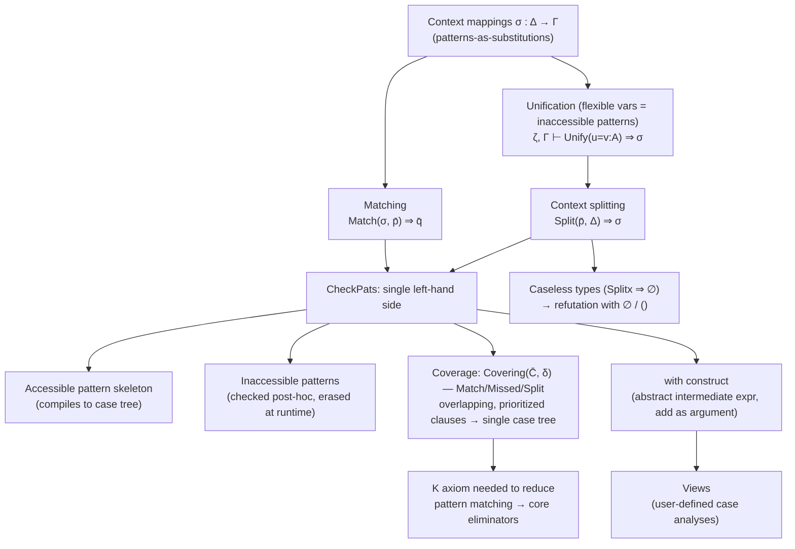

# Pattern Matching over [[Dependent-Type-Theory-Foundations#Inductive families|Inductive Families]]

[[book-guidelines|↩ Back to guidelines]]

## Why `case` is not enough once types depend on values

In a simply typed language, pattern matching is just sugar for repeated `case` analysis: you look at the shape of a value, branch, and each branch gets to assume nothing about anything *else* in scope. A `match` on a `List<T>` tells you nothing about some unrelated `n: usize` sitting next to it in the function's arguments.

That stops being true the moment the *type itself* can mention a value — the defining feature of an inductive family (an indexed datatype, in Norell's terminology). Consider the classic example the thesis opens with: natural numbers, and a strict ordering relation on them.

```
data Nat : Set where
  zero : Nat
  suc  : Nat → Nat

data ⩽ : Nat → Nat → Set where
  leqZero : (n : Nat) → zero ⩽ n
  leqSuc  : (n m : Nat) → n ⩽ m → suc n ⩽ suc m
```

`⩽` is a *family* of types indexed by two naturals — `zero ⩽ n` and `suc n ⩽ suc m` are different types for different `n`/`m`. A proof `p : n ⩽ m` isn't just "evidence of some abstract order fact" — its very shape (which constructor built it) constrains what `n` and `m` can possibly be. So when you pattern-match on `p`, you're not just learning about `p`; you're learning about `n` and `m` too, and the type checker needs to *instantiate the context itself*, not just the scrutinee.

Here's what breaks if you try to model this with a plain `case`/`match` expression, as in ML or Haskell: a `case` binds no relationship between the scrutinee's shape and the types of other bound variables. If pattern matching on `p : n ⩽ m` should let you conclude "`n` is `zero`," there is nowhere in a `case`-expression's semantics for that fact to live. This is why Norell says plainly: **"this makes case-expressions unsuitable for pattern matching"** over inductive families — you need something structurally different, where the act of matching threads new type information back through the whole context, not just refines a local scrutinee's type.

Walking through the transitivity proof for `⩽` makes the mechanism concrete:

```
trans : (k m n : Nat) → k ⩽ m → m ⩽ n → k ⩽ n
trans zero    m           n       (leqZero m)      mn                = leqZero n
trans (suc k) (suc m) (suc n) (leqSuc k m km) (leqSuc m n mn) =
   leqSuc k n (trans k m n km mn)
```

Matching on the first `⩽` proof forces `k` and `m` into the shapes `zero`/`m` or `suc k`/`suc m` — even though we *never wrote an explicit pattern for `k` or `m`* — because those are the only shapes consistent with the constructors of `⩽`. Then, matching `mn : suc m ⩽ n` against the (now-refined) type forces `n` itself to become `suc n`. The patterns end up mentioning `k`, `m`, `n` multiple times each: **the patterns become non-linear**, but only in exactly the places necessary to keep the left-hand side well-typed.

> **Rust framing.** Think of the difference between an `enum` (a plain sum type) and a GADT-like encoding using phantom types plus a witness, e.g. `enum Leq<K, M> { LeqZero(PhantomData<K>), LeqSuc(K2, M2, Box<Leq<K2,M2>>) }` where the type parameters are compile-time naturals via type-level programming. In ordinary Rust, `match`ing on an `enum Leq` variant tells you *only* about that value's own runtime shape — it can't retroactively narrow `K` and `M` to more specific compile-time types, because Rust's `match` has no mechanism for a pattern match to *refine an ambient context of type parameters*. That mechanism is precisely what dependent pattern matching adds, and precisely what a GADT-encoding in Rust (or a real GADT in Haskell) has to fake through explicit type-equality witnesses. This is the whole reason a checker for dependent pattern matching is nontrivial engineering, and the subject of this chapter.

## Accessible vs. inaccessible patterns

There's a second complication once matching on one variable can instantiate others: sometimes the instantiated value isn't even a legal *pattern* at all — it can be an arbitrary term. Take the "in the image of `f`" family:

```
data Imf : B → Set where
  imf : (x : A) → Imf (f x)

invf : (y : B) → Imf y → A
invf (f x) (imf x) = x
```

Pattern matching on the `Imf y` argument forces `y` to become `f x` — but `f x` is a general term, not a constructor pattern. There is no runtime way to "check that the first argument matches `f x`" — you can't `match` a value against an arbitrary function application. Norell's fix (borrowed from Goguen, McBride, and McKinna) is to split patterns into two roles:

- **Accessible patterns** — arise from *explicit* matching by the user; must form a genuine, linear, constructor-headed pattern; these are the ones a compiled case-expression actually inspects at runtime.
- **Inaccessible (dotted) patterns**, written $\lfloor t \rfloor$ — arise purely from *index instantiation*; can be arbitrary terms; guaranteed to match "for free" because the program is well-typed, so runtime never needs to check them.

$$\text{pat} ::= x \mid c\ \overline{\text{pat}} \mid \lfloor t \rfloor$$

Rewriting the earlier examples with this distinction explicit:

```
trans ⌊zero⌋ ⌊m⌋       n (leqZero m)     mn                      = leqZero n
trans ⌊suc k⌋ ⌊suc m⌋ ⌊suc n⌋ (leqSuc k m km) (leqSuc m n mn) =
   leqSuc k n (trans k m n km mn)

invf ⌊f x⌋ (imf x) = x
```

This is the theoretical payoff of the whole chapter's design: **the accessible parts of a pattern form an ordinary, well-formed linear pattern** — exactly the shape simply-typed pattern-compilation algorithms already know how to compile to efficient decision trees. All the "scary" dependent-type reasoning is pushed into a *separate, purely type-theoretic* correctness check on the inaccessible parts, decoupled from the compiled runtime code. In Agda's concrete syntax this is the dot pattern: `.t`.

> **Why this matters for a checker/elaborator (Rust/Lean).** This split is exactly the "erase the proof-relevant part, keep the computationally relevant part" move you'll want in a refinement-type or dependently-typed compiler: inaccessible patterns are proof obligations discharged once, at check time, and never re-examined by the compiled matcher. In Lean's kernel, the analogous move shows up in how `match` compiles to `rec`/`casesOn` applications plus definitional-equality side conditions that don't survive into the compiled term's runtime behavior — the "this is guaranteed by typing" content is squeezed out before code generation, just as Norell squeezes dotted patterns out of the compiled case tree.

## External vs. internal: two ways to trust a pattern-matching checker

Before diving into the algorithm, the thesis makes an important trusted-computing-base decision. There are two known strategies for making pattern matching over inductive families sound:

1. **External approach** (Coquand) — a separate, dedicated checker verifies that a system of pattern-match equations is well-formed, working directly in the *metatheory* about the core type theory, without ever literally translating the definition into more primitive core-theory terms.
2. **Internal approach** (Goguen, McBride, McKinna) — pattern matching is *translated* into the core theory's own eliminators (e.g. `Nat`'s or `Id`'s recursor), so its correctness is inherited automatically from the correctness of those primitive eliminators.

Norell picks the **external** approach — not because it's more trustworthy (the internal approach arguably has a smaller kernel, since the translation *is* the proof of soundness), but because working in the metatheory rather than the theory itself makes the type-checking *algorithm* easier to state and reason about directly. This is a real, deliberate tradeoff, and it's worth naming for your own compiler design: an external checker is a bigger trusted component (you have to trust the checker's metatheoretic argument, not just a small elaboration-to-primitives step), but it buys you an algorithm you can describe and implement much more directly, without first designing an internal translation target rich enough to host it (Section "Reduction to elimination rules" below revisits when such a translation is even possible).

## The three-part machinery: context mappings, matching, unification, splitting

The chapter's algorithm decomposes checking one left-hand side into building a **context mapping** — a substitution $\sigma : \Delta \to \Gamma$ that is a list of patterns, one per variable of $\Gamma$, linear in the variables of the *new* context $\Delta$. Concretely: each variable of $\Delta$ occurs exactly once in an *accessible* position somewhere in $\sigma$ (inaccessible occurrences are unrestricted). Given $\Gamma \vdash v : A$, applying $\sigma$ gives $\Delta \vdash v\sigma : A\sigma$ — this is just ordinary substitution, but tracked as a first-class object because the algorithm needs to compose, invert, and lift these substitutions repeatedly.

Two auxiliary operations on context mappings matter:

- **Lifting** $\sigma \uparrow \Theta$: extend $\sigma$ to act on a bigger telescope by leaving the extra variables alone.
- **Composition** $\delta \circ \sigma = \delta\sigma$ for $\delta : \Gamma \to \Delta$, $\sigma : \Theta \to \Gamma$.

> **Rust framing.** A context mapping is structurally close to a *substitution map* you'd build while type-checking a `match` arm in a compiler with refinement types — think of `HashMap<VarId, Pattern>` plus a companion telescope tracking each variable's (possibly-just-refined) type. The "linear in $\Delta$" condition is your compiler's analogue of "each new binder gets bound exactly once" — a basic well-formedness invariant you'd assert with a debug-only linearity check while building the substitution.

### Matching: checking against an existing shape

$\mathrm{Match}(\sigma, \bar p) \Rightarrow \bar q$ answers: "does the user's pattern sequence $\bar p$ fit the shape already recorded in $\sigma$, and if so, what patterns does that give the *new* variables?" It's a straightforward structural recursion, with one subtlety:

$$\mathrm{Match}(x, p) \Rightarrow [x := p] \qquad \mathrm{Match}(\lfloor u \rfloor, p) \Rightarrow \varepsilon$$
$$\frac{\mathrm{Match}(\sigma, \bar p) \Rightarrow \bar q}{\mathrm{Match}(c\,\sigma, c\,\bar p) \Rightarrow \bar q} \qquad \frac{c_1 \ne c_2}{\mathrm{Match}(c_1\,\sigma, c_2\,\bar p) \Uparrow}$$

**Anything matches an inaccessible pattern** — no check is performed there, because dotted patterns are guaranteed to match by typing, never by runtime inspection. Matching can also get *stuck* ($\mathrm{Match}(\sigma,\bar p) \stackrel{?}{\Rightarrow}$) rather than succeed or fail outright — e.g. matching a constructor pattern against a variable position that hasn't been split yet. This three-way outcome (success / definite failure / stuck) is the same shape you want for a unification or constraint-solving routine embedded in an elaborator: **"stuck" is not "failed"** — it's information that later refinement might resolve.

### Unification: solving for the flexible (inaccessible) variables

$\mathrm{Unify}$ operates relative to a set $\zeta$ of *flexible* variables — exactly the variables bound by inaccessible patterns, computed by `Flexible`. This is the key idea that makes the whole thing tractable: **only inaccessible-pattern variables are open for unification**; everything else is rigid. This is a restricted unification problem in exactly the spirit of Miller pattern unification — a small, well-scoped variable set that's allowed to be instantiated, with everything outside that set treated as opaque.

$$\zeta, \Gamma \vdash \mathrm{Unify}(u = v : A) \Rightarrow \sigma : \Delta \to \Gamma$$

Six rules govern it (Figure 2.1 of the thesis); three are singled out as most interesting:

- **(U-Var)** — if $x \in \zeta$ (flexible) and $x \notin \mathrm{FV}(v)$ (occurs check), instantiate: $[x := \lfloor v \rfloor] : \Gamma|_{x:=v} \to \Gamma$. This is the workhorse rule — pure substitution-generation, exactly what a metavariable-assignment step in an elaborator does.
- **(U-Occ)** — fails on $x = c\,\bar p$ when $x$ occurs *accessibly* in $\bar p$ (via $\mathrm{Acc}(\bar p)$, which recurses into constructor patterns but stops at inaccessible subterms). This blocks cyclic equations like $x = \mathrm{suc}\ x$ — an occurs-check, but scoped only to accessible occurrences, since an inaccessible occurrence of $x$ inside $v$ doesn't actually create a genuine self-reference at the pattern level.
- **(U-Conv)** — if $u \simeq v$ (definitionally equal, checked by conversion/whnf as in Chapter 1's bidirectional algorithm), unify by the identity substitution, no instantiation needed. This is what lets *arbitrary terms* appear in indices as long as no actual unification work is required — definitional equality subsumes unification whenever it already holds.

(U-Fail), (U-Con), (U-Tel), (U-Empty) round out the structural cases: constructor mismatch fails outright; matching constructor heads recurse into arguments; [[Dependent-Type-Theory-Foundations#Telescopes|telescopes]] unify left-to-right, threading the substitution from earlier equations into later ones' expected types.

**Failure is a third citizen here too.** Unifying `x + y` against `z + w` (with all four flexible) gets *stuck*, not failed — there's no unique solution, but it might become solvable once some variables are pinned down by other constraints. This is precisely constraint postponement, the same discipline you'd want in a bidirectional elaborator's metavariable-constraint queue: don't commit to failure just because you can't solve something *yet*.

> **Lean framing.** This restricted unification is structurally the ancestor of what `isDefEq` plus metavariable assignment does in Lean's elaborator: a designated set of "assignable" metavariables (here, the inaccessible-pattern variables), an occurs check, definitional-equality short-circuiting before attempting assignment, and a "give up, don't crash" outcome for genuinely hard unification problems (higher-order or non-pattern cases) that get deferred as unsolved goals/constraints rather than rejected outright.

### Context splitting: the operation that actually drives coverage

$\mathrm{Split}(\bar p, \Delta) \Rightarrow \sigma : \Gamma \to \Delta$ is the operation that turns "the user wrote a constructor pattern here" into an actual case split of the context. Given a context $\Delta_1 (x:A) \Delta_2$ and a constructor pattern for $x$, splitting:

1. Reduces $A$ to whnf $D\,\bar u\,\bar v$ ($\bar u$ = datatype parameters, $\bar v$ = indices).
2. Looks up the chosen constructor $c : \Theta \to D\,\bar u\,\bar w$ at parameters $\bar u$, obtaining its argument telescope $\Theta$ and target indices $\bar w$.
3. **Unifies indices against indices**: $\mathrm{Unify}(\bar v = \bar w : \Xi)$, using the flexible-variable set computed from the surrounding inaccessible patterns.
4. Instantiates $x$ with $c\,\Theta\delta$ (the constructor applied to fresh variables refined by whatever the unification determined), composing the resulting substitution with liftings so the rest of the context lines up.

This is exactly the mechanism behind the transitivity example: splitting on `mn : suc m ⩽ n` forces unifying the index `suc m` against `leqSuc`'s target index — and if that unification *fails* rather than succeeds or gets stuck, the constructor is provably **illegal** for that position, and `Split` reports failure for that specific $(pattern, constructor)$ pair rather than for the whole operation. This is what licenses writing only `leqSuc`, never `leqZero`, in the second `trans` clause — the type checker itself proves `leqZero` can't build an element of `suc m ⩽ n`, via **(U-Fail)** firing inside the index unification.

Crucially, splitting is only *sometimes* possible: if $A$'s head is a stuck, non-canonical form like $f\,n \leqslant m$ for some defined function $f$, the algorithm doesn't try to figure out which constructors are "morally" legal — it simply refuses to split. This is a deliberate incompleteness (documented explicitly, not accidental): "rather than resorting to complicated heuristics we chose the simpler approach of refusing to split." **Predictability over completeness** is a recurring design choice throughout this chapter — worth flagging, because it's the same tradeoff you'll face designing a coverage/exhaustiveness checker for a refinement-type language: a smarter-but-unpredictable heuristic is often worse for a language's users than a simpler, occasionally-incomplete, but legible rule.

`Splitx` (capital-S, no explicit user pattern) generalizes this to *the full covering*: split along `x` with respect to **every** constructor of the datatype at once, discarding branches where the per-constructor index unification fails. This is the operation coverage checking (next section) is built on, and also the operation used to detect **caseless types** (below).

## Putting it together: the type-checking algorithm

The whole left-hand-side checker is a small rewrite system on **configurations** $\langle \bar p, \sigma : \Delta \to \Gamma \rangle$ — "user patterns $\bar p$, context mapping $\sigma$ built so far":

$$\frac{\mathrm{Split}(\bar p, \Delta) \Rightarrow \delta : \Delta' \to \Delta \quad \mathrm{Match}(\delta, \bar p) \Rightarrow \bar p'}{\langle \bar p, \sigma : \Delta \to \Gamma \rangle \Rightarrow \langle \bar p', \sigma \circ \delta : \Delta' \to \Gamma \rangle}$$

Starting from $\langle \bar p, \mathrm{id} : \Gamma \to \Gamma \rangle$ and repeatedly applying this rule (its reflexive-transitive closure $\Rightarrow^*$) until $\bar p$ is nothing but variables gives `CheckPats`. One genuinely subtle engineering point the thesis flags but doesn't over-elaborate: **finding the right order in which to split may require search** — which variable you split first can determine whether later splits become possible at all (the pathological example in the coverage section, discussed below, shows a case where the *wrong* split order makes the algorithm get stuck even though a valid covering exists).

Inaccessible patterns are checked in a **second pass**, after the accessible skeleton is accepted — because dotted-pattern terms need to be type-checked in the context $\Delta$ bound by the accessible pattern, and that context doesn't exist yet until the accessible part is done:

$$\frac{\Delta \vdash e \uparrow A ; u \quad \Delta \vdash u \simeq v \uparrow A}{\Delta \vdash \mathrm{CheckInaccessible}(\lfloor e \rfloor = \lfloor v \rfloor : A)}$$

i.e. elaborate the user's dotted term $e$, then check it's definitionally equal to what the algorithm computed independently ($v$, coming from $\sigma$). This is where the "trust but verify" character of inaccessible patterns lives: the algorithm never runtime-checks a dotted pattern, but it does statically verify the user wrote something that *is* provably the value the algorithm determined.

## Refuting the impossible: caseless types and the `()` pattern

A genuinely elegant piece of design: rather than the undecidable general problem "is this coverage exhaustive, accounting for impossible cases automatically" (the approach several earlier systems took, at the cost of undecidability), Norell requires **explicit dismissal** of empty branches by the user. This needs a precise notion of "provably empty," and the thesis draws a careful distinction:

- **Empty type**: no *closed* inhabitants exist (a purely semantic, extensional notion — can be undecidable to check in general).
- **Caseless type**: no *constructor-headed, open* inhabitant exists — i.e. $\mathrm{Split}_x(\Gamma(x:A)) \Rightarrow \emptyset$, splitting along a fresh variable of that type yields *zero* legal constructors. This is a syntactic, decidable, algorithmic notion, reusing exactly the `Split` machinery already built.

$$\frac{\mathrm{Split}_x(\Gamma(x:A)) \Rightarrow \emptyset}{\Gamma \vdash \mathrm{Caseless}(A)}$$

The two notions can diverge in both directions:

- `Inf` (`data Inf : Set where inf : Inf → Inf`) is *empty* (no closed term of `Inf` can exist — every attempt to build one needs another `Inf` first, infinitely) but **not caseless** (`inf` is a syntactically legal constructor head; `Split` would happily produce one branch for it).
- $\mathrm{suc}\ n \leqslant \mathrm{zero}$, for the `⩽` family above, is caseless: splitting shows `leqZero`'s target index is always `zero ⩽ n` (never matches `suc n ⩽ zero`'s shape) and `leqSuc`'s target index `suc n ⩽ suc m` fails to unify against `suc n ⩽ zero` (`zero` vs. `suc m` — (U-Fail)). Zero legal constructors survive, so it's caseless — decided purely syntactically, no semantic argument about natural numbers required.

And deliberately, `Caseless` is **not** attempted for arbitrary defined functions' output types — the example $F$ with `F zero = ⊥`, `F (suc n) = F n` is genuinely (semantically) caseless for every `n`, but the thesis explicitly declines to try proving this algorithmically ("it is undecidable in general"). Caselessness is checked only for types convertible to datatype applications — another instance of the predictability-over-completeness principle.

Given caselessness, the right-hand-side syntax gets a second form besides `= term`:

$$\mathrm{rhs} ::= {}= \mathrm{term} \mid \mathrm{()}\ \bar x$$

`() x̄` refutes the named variables — you only strictly need to refute one, but naming several documents intent. And to spare users from inventing dummy names purely to refute them, `∅` (Agda concrete syntax: `()`) is sugar for "an anonymous variable, refuted implicitly":

```
f : (n : Nat) → suc n ⩽ zero → (A : Set) → A
f n ()A     -- sugar for: f n x A |∩ x, with x's type proved caseless
```

> **Why this is load-bearing for a Rust/Lean verifier.** This is the exact shape of "unreachable code justified by a static invariant" you want in a Hoare-logic/refinement-type verifier: a branch is provably dead not because you ran a semantic decision procedure over the full program, but because a *local, syntactic, decidable* check (here, `Split` returning the empty set) certifies it. That's the difference between a proof obligation your kernel can *discharge automatically and cheaply* versus one that needs a full external solver — and it's exactly the kind of "cheap syntactic proof, not expensive semantic search" design principle you want your own CSP/abstract-interpretation kernel to lean on wherever possible, reserving full constraint solving for cases that truly need it.

## Coverage checking: overlap, priority, and the case tree

Up to this point, checking a single clause has been the whole story. But a function definition is a *sequence* of clauses, and the thesis makes a genuinely novel move relative to prior work (Coquand; Goguen et al.): rather than requiring clauses to already form a non-overlapping covering, **it allows clauses to overlap**, with **first-match, top-to-bottom priority** — i.e. exactly ordinary functional-language pattern-matching semantics.

```
==  : Nat → Nat → Bool
zero == zero   = true
suc x == suc y = x == y
x     == y     = false
```

The catch-all last clause overlaps with both earlier ones. Allowing this cuts the number of clauses from *quadratic* in the number of constructors down to *linear* — a real practical win, not just convenience.

The catch: **once clauses can overlap and are order-dependent, the clauses as written cannot all hold as *definitional* equalities simultaneously.** `x == y = false` obviously doesn't hold definitionally for arbitrary `x, y` — it's true only in the residual cases *after* the earlier, more specific clauses have already claimed their territory. The thesis's fix is to **compile the overlapping, prioritized clauses into a single non-overlapping case tree**, and only *that* compiled tree's branches hold as definitional equalities. The user-facing clauses hold as *propositional* equalities you can prove, provable by chains of the underlying case-tree steps, but not necessarily as reduction rules the kernel fires automatically.

### Even disjoint, exhaustive clauses can fail to be definitional: Berry's majority function

The thesis's sharpest illustration that this isn't just an overlap artifact:

```
maj : Bool → Bool → Bool → Bool
maj true  true  true  = true
maj true  false z     = z
maj false y     true  = y
maj x     true  false = x
maj false false false = false
```

These five clauses are pairwise **disjoint** and *jointly exhaustive* — yet **there is no single case tree (no single sequence of context splits) that realizes all five as definitional equalities simultaneously.** Whichever argument you split on first, some later clause's pattern shape becomes unreachable in a definitionally-faithful way. This is Gérard Berry's classical example, famous in the sequential-algorithms/full-abstraction literature for showing that boolean functions can be "computable" yet not stably/sequentially realizable by any single decision procedure that respects all listed equations definitionally. Norell's point: **your covering algorithm must be honest about this** — it computes *a* covering consistent with the clause priorities, not necessarily one under which every user-written equation is definitional.

### The covering algorithm

Formally, a **clause** for `f : Γ → A` is a triple $(\Delta, \sigma : \Delta \to \Gamma, \mathrm{rhs})$ — context implicit since it's determined by $\sigma$. Given user clauses $\bar C$ and the *current neighbourhood* $\delta : \Delta \to \Gamma$ (starting at $\mathrm{id}$), $\mathrm{Covering}(\bar C, \delta) \Rightarrow \bar C'$ has three rules:

$$\frac{C_i = \langle \sigma_i, \mathrm{rhs}_i\rangle \quad \mathrm{Match}(\sigma_i,\delta) \Rightarrow \rho \quad \forall j<i.\ \mathrm{Match}(\sigma_j,\delta) \Uparrow}{\mathrm{Covering}(\bar C, \delta) \Rightarrow \langle \delta, \mathrm{rhs}_i[\rho]\rangle} \text{(Match)}$$

$$\frac{\forall i.\ \mathrm{Match}(\sigma_i, \delta) \Uparrow}{\mathrm{Covering}(\bar C, \delta) \Uparrow} \text{(Missed)}$$

$$\frac{\langle\sigma,\mathrm{rhs}\rangle \in \bar C \quad \mathrm{Match}(\sigma,\delta) \stackrel{?}{\Rightarrow} \quad x \in \mathrm{Blockers}(\sigma,\delta) \quad \mathrm{Split}_x(\Delta) \Rightarrow \{\delta_j\}_j \quad \forall j.\ \mathrm{Covering}(\bar C, \delta\delta_j) \Rightarrow \bar C_j}{\mathrm{Covering}(\bar C, \delta) \Rightarrow \bigcup_j \bar C_j} \text{(Split)}$$

In prose: at each neighbourhood, try to match every clause in order. **(Match)** fires the moment some clause $i$ matches *and every earlier clause definitely fails* — this is what implements first-match priority formally: it's not enough that clause $i$ matches, you must positively rule out all higher-priority clauses first. **(Missed)** — if the neighbourhood is stuck-or-failing against *every* clause, coverage fails outright: the clauses weren't exhaustive. **(Split)** — if matching is merely *inconclusive* (stuck, not failed) against some clause, pick one of the "blocking" variables (the ones on which matching got stuck) and split the whole context there, recursing into every resulting sub-neighbourhood.

Working the `t` (a two-argument function similar to `min`) example by hand shows the mechanics: start with neighbourhood `x;y : (x y : Nat)`, get stuck on all three clauses, split on `y` (the blocker of the first clause), landing on `δ1 = x;zero` (matches clause 1 immediately) and `δ2 = x;(suc y)` (still stuck — split again, this time on `x`), eventually bottoming out in the covering
```
x     t zero    = x
zero  t suc y   = suc y
suc x t suc y   = suc (x t y)
```
— note this differs syntactically from the user's original three clauses (the second clause's pattern changed from `zero t y` to `zero t suc y`, because it was reached only via the branch where `y = suc y` after splitting), even though it computes the same function.

### An algorithmic limitation, by design: split order is not searched

Because clause priority interacts with split order, sometimes *no* single split order realizes the user's intended shape — but the thesis's algorithm doesn't try alternate orders via backtracking; it commits to whatever order the earliest-priority clause suggests and reports an error if that gets stuck, even when some *other* order would have succeeded. The thesis gives a worked pathological example (involving an equality-type family and a derived `Even` predicate) where splitting in clause-order gets permanently stuck on a `dbl m = suc n` unification that never resolves, even though a *different* split order (starting from a different clause) would succeed. The explicit design choice — again, predictability over completeness — is: report an error rather than backtrack, because backtracking search would make it much harder for the user to predict what covering their clauses produce. The escape hatch, when you hit this limitation, is factoring through an auxiliary helper function — "we have not lost any expressivity," just some directness.

## Reduction to elimination rules, and where the K axiom hides

Section 1.5's promise gets cashed in here: McBride showed (and this is how Epigram treats pattern matching) that, **given uniqueness of identity proofs (the K axiom)**, this style of pattern matching can be reduced to ordinary structural elimination rules (recursors) over the core inductive families — i.e. the *internal* approach becomes available, post-hoc, once K is assumed.

The thesis pins down exactly where K is needed with a minimal example: checking

```
data Id (A : Set)(x : A) : A → Set where
  refl : Id A x x

K : (pr : P refl)(p : Id A x x) → P p
K pr refl = pr
```

Checking this left-hand side involves exactly one split, along `p`, with constructor `refl`. Doing so requires solving $\mathrm{Unify}(x = x : A)$ — unifying an index against *itself*. This unification succeeds trivially by **(U-Conv)** (or, structurally, is the base case that licenses discarding a reflexive equation). But — and this is the crux — **discarding a proof that `x = x` as "no information" is exactly the statement that the *only* possible proof of `Id A x x` is `refl`**, which is precisely uniqueness of identity proofs. Nothing in the ordinary elimination rule for `Id` (its recursor, J/`Id-elim`) gives you this for free — K is a strictly stronger, extra axiom, independent of `Id`'s recursor (this is the content of Hofmann–Streicher's classical independence result, cited here as `[HS94]`). So: **pattern matching over inductive families, as this chapter defines it, is only reducible to bare eliminators in a theory that also assumes K** — a theory without K (as later motivated by homotopy type theory, where `Id` is genuinely proof-relevant) cannot support this style of pattern matching without restriction. This is exactly the fork in the road that later "without-K" pattern-matching literature (and Agda's `--without-K` flag) is about.

> **Elaboration framing.** This is a genuinely important thing to internalize for an elaborator/kernel design: **dependent pattern matching, as commonly implemented, silently assumes K.** If your compiler's kernel doesn't want to bake in K (e.g. because you want compatibility with univalence/HoTT-style reasoning later), your pattern-match-to-eliminator translation needs to either restrict which matches are legal (only those that don't require discarding a nontrivial reflexivity-style equation) or explicitly thread K in as an assumed axiom at the boundary.

## The `with` construct: pattern matching on intermediate expressions

Everything above lets you pattern-match on the function's *arguments*. But often you want to case-split on the result of some intermediate computation — and doing that on the right-hand side, with a plain `case`, hits the same problem as before: the case-split can't retroactively refine the *goal type* or the surrounding context, only its own local scrutinee. `with` (McBride & McKinna) solves this by, in effect, adding the intermediate expression as an extra pattern-matchable *argument* on the left-hand side:

```
unzip : {A B : Set}{n : Nat} → Vec (A × B) n → Vec A n × Vec B n
unzip ε = ⟨ε, ε⟩
unzip (⟨x, y⟩ :: xys) with unzip xys
unzip (⟨x, y⟩ :: xys)     | ⟨xs, ys⟩ = ⟨x :: xs, y :: ys⟩
```

### Compilation: `with` becomes an auxiliary function

Given
```
f : Γ → B
f p̄ with e
f p̄1 | q1 = e1
...
f p̄n | qn = en
```
where $\bar p : \Delta \to \Gamma$ and $\Delta \vdash e : A$, the algorithm:

1. Splits $\Delta$ into $\Delta_1 \Delta_2$, where $\Delta_1$ is the *smallest* prefix sufficient to type $e$ (i.e. $e$'s free variables all live in $\Delta_1$).
2. **Abstracts every syntactic occurrence of $e$** out of $\Delta_2 \to B$, obtaining $\Delta_2' \to B'$ with $\Delta_2 = \Delta_2'[x := e]$ and $B = B'[x := e]$.
3. Checks each clause's extended pattern $\bar p_i$ is a genuine refinement of the original: $\mathrm{Match}(\bar p, \bar p_i) \Rightarrow \bar p_i'$.
4. Emits an auxiliary function $f' : \Delta_1 \to (x:A) \to \Delta_2' \to B'$ whose clauses are exactly the `with`-clauses, now ordinary pattern-matching clauses on the freshly-inserted argument $x$.

**Step 2 is the crux, and it's not always well-formed.** Abstracting an expression out of a type is only sound if the resulting type is still well-typed *after* generalizing — the thesis flags the concrete failure mode: abstracting the first projection $\pi_1$ of a dependent pair out of a type, without also abstracting the second projection, can break well-typedness, since $\pi_1$'s value may occur in $\pi_2$'s *type*. This is why multiple simultaneous `with`-abstractions (separated by `|`) exist as a primitive — you sometimes must abstract several related expressions together, or not at all:

```
many : (x : (n : Nat) × (n ⩽ zero)) → Nat
many x with π1 x | π2 x
many x | ⌊zero⌋ | leqZero = zero
```

> **Compiler framing.** This "abstract $e$ out of the goal type, insert as a fresh binder, then pattern-match on the binder" move is structurally identical to how a refinement-type or Hoare-logic verifier introduces a fresh existentially-quantified variable standing for an intermediate expression's value, then narrows it by case-splitting on a discriminant (e.g. abstracting a branch condition into a boolean flag before symbolic execution proceeds down each arm) — it's the type-theoretic analogue of introducing a "let-bound scrutinee" so that later refinement of that binder can propagate through dependent occurrences in the postcondition, exactly the plumbing you need when generating verification conditions across a branch.

### Why abstraction matters: the filter/sublist example

The payoff of abstracting $e$ out before matching, rather than after, is visible in the `sublist` proof:

```
data ⊆ {A : Set} : List A → List A → Set where
  stop : ε ⊆ ε
  keep : {x : A}{xs ys : List A} → xs ⊆ ys → (x :: xs) ⊆ (x :: ys)
  skip : {y : A}{xs ys : List A} → xs ⊆ ys → xs ⊆ (y :: ys)

sublist : {A : Set}(p : A → Bool)(xs : List A) → filter p xs ⊆ xs
sublist p ε = stop
sublist p (x :: xs) with p x
sublist p (x :: xs) | true  = keep (sublist p xs)
sublist p (x :: xs) | false = skip (sublist p xs)
```

At the `::`-case, the goal is `filter p (x :: xs) ⊆ (x :: xs)`, which reduces to `filter' p x xs (p x) ⊆ (x :: xs)` (using the compiled auxiliary `filter'`) — the occurrence of `p x` inside the goal is exactly what gets abstracted, so the generated auxiliary function is

```
sublist' : {A : Set}(p : A → Bool)(x : A)(xs : List A)
           (b : Bool) → filter' p x xs b ⊆ (x :: xs)
sublist' p x xs true  = keep (sublist p xs)
sublist' p x xs false = skip (sublist p xs)
```

Because `p x` was abstracted to `b` **everywhere it occurred, including inside the call to `filter'`**, pattern-matching on `b` makes `filter' p x xs b` genuinely reduce (to `x :: filter p xs` or `filter p xs` respectively) — this is precisely what makes the proof typecheck. If the abstraction had been done sloppily (only in the goal type, not also inside the recursive `filter'` call sitting there), the reduction wouldn't fire and the proof would get stuck.

### Rewriting with `with`: turning `==` into a splittable pattern

`with` also serves as a rewriting tool for propositional equality, exploiting exactly the same abstraction trick to dodge the unification limits from earlier:

```
assoc : (x y z : Nat) → x + (y + z) == (x + y) + z
assoc zero    y z = refl
assoc (suc x) y z with x + (y + z) | assoc x y z
assoc (suc x) y z | ⌊(x + y) + z⌋ | refl = refl
```

Ordinarily you can't pattern-match on an `eq : lhs == rhs` proof when `lhs`/`rhs` are stuck terms the unifier can't relate — but abstracting one side into a fresh variable (via `with x + (y + z)`) turns the unification problem into "unify a fresh variable against a term," which **(U-Var)** always handles.

### Views: emulating custom case analysis via `Parity`

The final and most striking application is using `with` to fabricate an entirely custom, non-constructor-based case split. The `Parity` view:

```
data Parity : Nat → Set where
  even : (k : Nat) → Parity (2 * k)
  odd  : (k : Nat) → Parity (2 * k + 1)

parity : (n : Nat) → Parity n
parity zero = even zero
parity (suc n) with parity n
parity (suc ⌊2*k⌋)     | even k = odd k
parity (suc ⌊2*k+1⌋) | odd k  = even (k + 1)

half : Nat → Nat
half n with parity n
half ⌊2*k⌋     | even k = k
half ⌊2*k+1⌋ | odd k  = k
```

`parity n` produces evidence that `n` is *either* `2*k` or `2*k+1` for some `k` — a two-way split that has nothing to do with `Nat`'s own two constructors (`zero`/`suc`). By `with`-matching on that evidence, `half` gets to pattern-match "as if" `Nat` had `even`/`odd` constructors, entirely user-definable and reusable. This is the seed of what became Agda's dedicated `view` idiom — user-defined, ad-hoc case analyses assembled from ordinary datatypes plus `with`, rather than a special built-in feature.

## Where this leads



Within the thesis, this chapter is the **first of the three core technical contributions**, and the other two lean on it directly: Chapter 3's metavariable algorithm (Section 3.7) explicitly extends the underlying theory to accommodate pattern matching, and Chapter 5's Agda examples (dotted patterns, `IsEven`, the certified monoid solver's `Chain` combinators) are this algorithm in concrete, user-facing syntax.

For the compiler/elaborator project this vault is tracking, the load-bearing pieces are:

- **Context mappings and their linearity discipline** are the direct ancestor of any substitution/telescope-management module your checker needs, wherever a pattern-matching or refinement-narrowing construct instantiates surrounding binders.
- **Restricted unification against a flexible-variable set** is Miller-pattern-style unification in miniature — the same discipline (small assignable set, occurs check, definitional-equality short-circuit, stuck-not-failed semantics) that your metavariable/implicit-argument elaborator (Chapter 3's subject) will need at a larger scale.
- **Context splitting as index-unification-gated case generation**, and its use for both coverage checking and **caseless-type refutation**, is a template for how a Hoare-logic/refinement verifier can *cheaply and syntactically* discharge "this branch is unreachable" obligations without invoking a full semantic solver — reserve the expensive machinery (SMT, CSP search) for genuinely semantic questions, and let syntactic, decidable checks like this one handle what they can.
- **The overlapping-clauses-to-case-tree compilation**, with its explicit acknowledgment that user equations may only be *propositional*, not *definitional* — is a caution for your own kernel's reduction rules: never assume a user-facing equation is a computation rule just because it typechecks; distinguish what the *compiled* decision procedure actually reduces on from what's merely *provable* about it.
