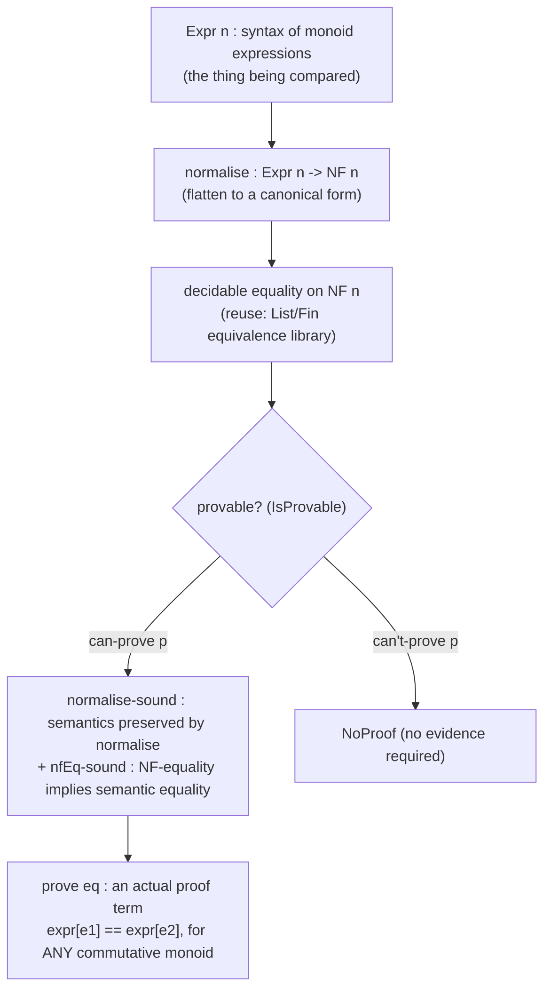

# The Agda Language

[[book-guidelines|↩ Back to guidelines]]

## Why this chapter exists: from algorithms to a language

Chapters 2–4 gave you three separately-justified *algorithms*: dependent pattern matching, metavariable-based [[Metavariables-and-Implicit-Arguments|implicit arguments]], and a [[Module-Systems-for-Dependently-Typed-Languages|module system]] decoupled from the type checker. None of that is a language yet — it's a toolkit. Chapter 5 is where Norell stops proving things and starts *showing the surface syntax a programmer actually types*, then uses that syntax to build something no simply-typed language can express as a total, checked program: an **internally certified decision procedure** for commutative-monoid equations — a function that, given two monoid expressions, either proves they're equal or refuses, and whose "proof" is a genuine term of the identity type, not a side artifact you have to trust separately.

This matters for a compiler/elaborator project in a very direct way: the chapter is Norell's own worked example of the pattern you'll want your elaborator to support end-to-end — *decide → normalize → soundness-of-normalization lemma → proof term* — with nothing but ordinary dependent function types, records, and pattern matching. There is no special "proof search" subsystem here. The type theory itself is expressive enough to host a certified decision procedure as a plain program. That's the chapter's real thesis.

## 5.1 Language description: reading Agda's concrete syntax

### Names, reserved words, and mixfix operators

Agda's name syntax has a small trick worth naming precisely, because it's the mechanism behind `if_then_else_`, `_+_`, and every other "operator" you'll see: **there is no separate operator syntax**. A *name part* is any maximal run of printable Unicode characters avoiding a small reserved set (`@.(){};_` plus keywords like `data`, `where`, `mutual`). A *name* is an alternating sequence of name parts and underscores (excluding the bare `_` itself). The underscores mark **argument slots**. `if_then_else_` is a single identifier with three holes; applying it to `x`, `y`, `z` can be written either as ordinary prefix application `if_then_else_ x y z` or, because the parser recognizes the underscore pattern, as `if x then y else z`. This is **mixfix syntax**: not just infix (`_+_`) or prefix/postfix, but arbitrary interleavings of fixed tokens and argument positions, all derived from one naming convention rather than a separate "operator declaration" grammar.

> **What breaks without this.** A conventional parser needs a hard-coded grammar production for each syntactic category — `if`/`then`/`else` as reserved keywords with their own AST node, `+` as a special infix-operator token. Every new notation a library author wants (say, a `⊢_∶_` typing-judgment notation, or a triple-bracket `⟦_⟧` denotation bracket) would require touching the parser itself. Agda's move is to make *the identifier* carry its own concrete syntax, so a library can introduce new mixfix notation as an ordinary top-level declaration plus a fixity annotation (`infixl 20 _+_`), with no parser changes. This is precisely the kind of "push a special case into ordinary data" design principle recurring throughout the thesis (records into Σ-types in Ch. 1, modules into lambda-lifting in Ch. 4) — here applied to notation itself.

> **Rust framing.** There's no clean Rust analogue for user-definable mixfix syntax (Rust's macro system is closer, but token-tree-based rather than name-based), which is worth naming as a real expressiveness gap rather than forcing an example. The closest structural cousin is a `matches!`-like declarative macro that binds slots by position — but Rust macros are a separate metaprogramming layer, not "just how you write function names," which is the point of the Agda design.

### Interaction points: holes as literal metavariables

Write `?` or `{! ... !}` anywhere an expression is expected, and Agda treats it internally as a fresh, deliberately-unsolved metavariable — the same metavariable machinery from Chapter 3, just with a policy flag telling the elaborator "don't try to solve this one automatically." The interactive environment can then query the type checker (what's the expected type here? what's the local context?) at that specific point. This is the direct ancestor of every modern proof assistant's "hole"/"sorry"/`_` placeholder workflow — Lean's `sorry` and `?_` named goals, Coq's `admit`, Idris's `?holeName` are all descendants of exactly this idea: a term-level placeholder that type-checks *as if* it denoted a real term, backed by a metavariable whose constraint set records everything the elaborator has learned about what could go there.

> **Lean framing.** This is worth being precise about, because it's a load-bearing distinction for an elaborator you'd build yourself: an interaction point and an *implicit-argument* metavariable (Section 5.1.5, next) are the **same underlying object** — a metavariable in the sense of Chapter 3 — differing only in whether the elaborator is *permitted* to solve them automatically. Lean's elaborator makes exactly this distinction internally: a `?goal` left by `sorry` and a metavariable created for an implicit argument both live in the same metavariable context (`MetavarContext`), but synthetic-opaque metavariables (goals) are never unified away by unification the way ordinary implicit-argument metavariables are. Chapter 3's soundness proof for constraint solving applies uniformly to both — the "don't auto-solve this one" flag is a policy layer on top of a single, uniform mechanism, not a separate kind of variable.

### Implicit syntax and the underscore placeholder

A second, syntactically identical but semantically different use of `_`: standing for a term the type checker should *try* to infer, reporting an error only if it can't. `id _ zero` for `id : (A : Set) → A → A` lets the first argument be recovered from the type of `zero`. Internally this desugars to inserting a fresh metavariable at that position and letting ordinary unification during type checking (Chapter 3's algorithm) solve it — no separate "underscore inference" pass exists; `_` is sugar for "elaborate against a fresh flexible metavariable here."

### Implicit function spaces `{x : A} → B`

Implicit arguments use curly braces instead of parens in both types and applications:

```
_==_ : {A : Set} -> A -> A -> Set
subst : {A : Set}(C : A -> Set){x y : A} -> x == y -> C x -> C y
```

`subst C eq cx` and `subst {_} C {_} {_} eq cx` are equivalent — the elaborator inserts a metavariable for every implicit argument not given explicitly, following the `Γ ⊢ A @ ē ↓ B; s̄` judgment from Section 3.6. Implicit arguments can also be named at the call site (`subst C {y = e} eq cx`), letting you fill in one implicit out of several without supplying the earlier ones positionally — a convenience that only makes sense once arguments are looked up by name rather than position, which the record-and-module machinery later in the chapter leans on heavily.

The chapter is explicit about a design choice with real consequences for a compiler: **there is no static guarantee that an implicit argument's metavariable will actually get solved.** Internally, implicit and explicit function spaces are typed identically; "implicit" only changes insertion behavior at elaboration time, not anything about the type theory. An unsolved implicit argument surfaces as a type-checking *error*, not a category the type system rules out in advance. Norell's justification: restricting implicit arguments to statically-guaranteed-solvable positions would rule out too many useful cases in practice. This is a genuine engineering tradeoff you'll face verbatim in your own elaborator — the alternative (a syntactic restriction guaranteeing solvability, closer to how some systems restrict unification variables to "pattern" positions only) buys you a stronger static guarantee at the cost of expressiveness.

### Datatypes, strict positivity, and functions by pattern matching

`data` declarations are unsurprising —

```
data Nat : Set where
  zero : Nat
  suc  : Nat -> Nat
```

— except for one non-negotiable well-formedness check: **strict positivity**. Every occurrence of the datatype being defined, inside the arguments of its own constructors, must appear only in strictly positive position (never to the left of an arrow feeding back into a constructor argument). The canonical rejected example:

```
data Bad : Set where
  bad : (Bad -> Bad) -> Bad
```

`Bad` occurs negatively here — as the domain of the function type inside `bad`'s argument. This is not a stylistic nicety; it's what keeps normalization (hence type checking, hence the whole system's decidability and consistency) from breaking.

> **What breaks without this.** `Bad`, if accepted, lets you construct a term isomorphic to Curry's paradox: build `f : Bad -> Bad` looping through `bad`'s own eliminator to apply a value to a modified version of itself, producing a term with no normal form (an untyped-lambda-calculus-style non-terminating reduction sequence, or worse, an inconsistency letting you prove `False`). This is the *datatype-level* twin of exactly the danger Chapter 3's `coerce`/Ω example demonstrates at the metavariable level (an ill-typed intermediate term becoming a well-typed non-normalizing loop) — both are instances of "an unchecked self-reference lets you smuggle in unbounded recursion where the theory promised none." Strict positivity is the datatype-declaration-time firewall against it, the same way Chapter 3's guarded constants are the metavariable-elaboration-time firewall.

Function definitions by pattern matching are exactly Chapter 2's algorithm, now with concrete syntax:

```
_+_ : Nat -> Nat -> Nat
zero  + m = m
suc n + m = suc (n + m)
```

Note the mixfix left-hand side (`_+_` pattern-matched via the same underscore convention that defines its application syntax) and that operator syntax works identically on the left- and right-hand sides of a clause.

### Inductive families and dotted (inaccessible) patterns, in concrete syntax

Parameterised datatypes (`data List (A : Set) : Set where ...`) generate constructors with the parameter reinstated as an *implicit* argument (`[] : {A : Set} -> List A`) — parameters are uniform across all constructors and don't need to be given explicitly at each use.

Indexed families are where Chapter 2's accessible/inaccessible distinction gets its concrete syntax: a **dot** in front of a pattern.

```
data IsEven : Nat -> Set where
  evenZ  : IsEven zero
  evenSS : (n : Nat) -> IsEven n -> IsEven (suc (suc n))

even+ : (n m : Nat) -> IsEven n -> IsEven m -> IsEven (n + m)
even+ .zero          m evenZ         em = em
even+ .(suc (suc n)) m (evenSS n en) em =
    evenSS (n + m) (even+ n m en em)
```

Pattern-matching `evenZ` against the third argument forces `n` to be `zero` — not because the user wrote `zero` as a pattern for `n`, but because it's the only value consistent with `IsEven zero`'s constructor shape. That forced value is written `.zero`: syntax marking "this position is determined by typing, not by runtime inspection." The dot is Chapter 2's $\lfloor t \rfloor$ notation, made concrete. Since the forced values of `n`, `m` here are *fully determined* by the proof arguments, this particular example can even drop them to implicit arguments entirely and let the elaborator reconstruct them:

```
even+ : {n m : Nat} -> IsEven n -> IsEven m -> IsEven (n + m)
even+ evenZ         em = em
even+ (evenSS n en) em = evenSS _ (even+ en em)
```

— collapsing dotted-explicit-index and implicit-argument syntax into the same underlying "let the elaborator fill this in" mechanism one more time.

### Records and their generated projection modules

Record declarations mirror datatypes but list *fields* instead of constructor signatures, and — the detail worth dwelling on — **later fields can refer to earlier fields by name** within the same declaration, unlike a plain non-dependent tuple:

```
record Even : Set where
  val : Nat
  prf : IsEven val
```

`record { val = suc (suc zero); prf = evenSS _ evenZ }` builds an element (fields given in any order, matched by name). Two mechanically important consequences:

1. **Records are compared by name, not by structure.** Two records with identical field lists are still distinct types unless declared with the same name — this is the same "records aren't just Σ-types with extra bookkeeping" design decision Chapter 1 makes formal (records *encode into* Σ-types, but the surface language treats the record's identity as nominal).
2. **Every `record` declaration auto-generates a same-named module of projection functions**, one per field, each typed to take the record as an explicit argument and (for later fields) the record's own type applied to earlier projections:
   ```
   Even.val : Even -> Nat
   Even.prf : (e : Even) -> IsEven (Even.val e)
   ```
   For a *parameterised* record (`record Step (A : Set) : Set where next : A -> A`), the generated module carries the record's own parameters as **implicit** parameters of the module itself:
   ```
   module Step {A : Set}(s : Step A) where
     next : A -> A
   ```
   This is the payoff of Chapter 4's "records as parameterised projection modules" design: `open Step someStepValue` brings `next` into unqualified scope exactly like opening any hand-written module, because as far as the module system is concerned, that's precisely what it is. There is no separate "record accessor" feature — it's module-system machinery, reused.

### Local (`where`) definitions versus `private` helpers

Every clause can carry a `where` block of local declarations (arbitrary top-level-legal declarations, nested), with the clause's left-hand-side variables in scope:

```
reverse : {A : Set} -> List A -> List A
reverse {A} xs = rev xs []
  where
    rev : List A -> List A -> List A
    rev []        ys = ys
    rev (x :: xs) ys = rev xs (x :: ys)
```

The chapter names the sharp edge directly: a `where`-local `rev` is *inaccessible* outside its clause, so you cannot state or prove any lemma about `rev` itself — only about `reverse`. If you need the helper to be independently provable-about (e.g. inside a solver you're building, where you want to reuse and reason about auxiliary machinery) but still want it hidden from clients of the module, the fix is `private`:

```
private
  rev : {A : Set} -> List A -> List A -> List A
  rev []        ys = ys
  rev (x :: xs) ys = rev xs (y :: ys)

reverse : {A : Set} -> List A -> List A
reverse {A} xs = rev xs []
```

`private` declarations live at module scope (so lemmas about them can be stated and proved *inside* the module) but are invisible to anything opening the module from outside — exactly the "private definitions and their effect on displayed normal forms" mechanism Chapter 4 formalizes for the module system in general, here shown as the idiomatic way to structure a proof-carrying library. You'll see this exact pattern reused twice more before the chapter ends: once for the `Chain` module's internal wrapper datatype, once implicitly throughout the monoid solver's helper modules.

### Mutual inductive-recursive definitions

A `mutual` block lets two (or more) definitions refer to each other:

```
mutual
  even : Nat -> Bool
  even zero    = true
  even (suc n) = odd n

  odd : Nat -> Bool
  odd zero    = false
  odd (suc n) = even n
```

Norell flags this as experimental support for genuinely **inductive-recursive** definitions (Dybjer–Setzer) — not just mutually recursive *functions* (which pose no special difficulty, since both are checked against already-known types) but datatypes whose constructors can depend on a recursively-defined function *over that same datatype*, and vice versa. That's a substantially harder termination/well-formedness problem than ordinary mutual recursion, and the thesis explicitly declines to develop the theory here — a clean signal, if you're scoping your own elaborator's feature set, of where "mutual functions" (easy — just delay checking termination/positivity until both signatures are known) and "mutual inductive-recursive" (hard — the datatype's strict-positivity check and the function's termination check become mutually entangled) diverge in implementation cost.

---

## 5.2 The bigger example: a certified commutative-monoid solver

The rest of the chapter is a single running literate-Agda program, built module by module, that culminates in a function

```
prove : {n : Nat}(eq : Equation n) -> Proof eq
```

which, given an equation between two monoid expressions, either returns an actual proof term of that equation (in *any* commutative monoid, not a fixed one) or — if the equation is false — a value witnessing "no proof needed." The architecture is worth holding in your head as a single shape before following the modules, because it's the shape you'll reuse for any certified decision procedure in your own compiler (e.g. deciding path-equality of two symbolic heap expressions, or two linear-arithmetic normal forms, inside a refinement-type checker):



The crucial architectural point, stated explicitly in the text: **deciding provability and constructing the proof are separate concerns**, connected by a soundness lemma. `normalise` and equality-of-normal-forms only need to be *decidable*, not *proof-relevant* — deciding is pure computation over syntax. Once decided, `normalise-sound` (a lemma proved once, up front) is what lets `prove` assemble an actual proof term *without re-deriving it from scratch* — the decision procedure and its correctness proof are two separate pieces of code, and only the second one needs to talk about the monoid's semantics at all.

### 5.2.1–5.2.3 — the supporting libraries

Three small modules set up vocabulary the solver needs, each illustrating a `module`-per-file idiom from Chapter 4 in practice:

- **`Logic`** — `False` as the *empty* datatype (no constructors — nothing can build one), `True` as a *record with no fields* (exactly one canonical inhabitant `tt = record {}`, since the empty conjunction of field-equalities is trivially satisfied — the chapter notes this relies on **η-equality for records**, meaning any two elements of `True` are automatically identified, not just provably equal after work). `_∨_`/`_∧_` as two-constructor / one-constructor datatypes, negation `¬ A = A -> False` as sugar (no primitive needed — negation *is* "a function into the uninhabited type," nothing more).
- **`Basics`** — `Bool`, `Nat` (with `BUILTIN` pragmas letting the type checker recognize `Nat` as *the* natural numbers, unlocking numeric literals and a more efficient internal representation — a pragmatic escape hatch acknowledging that a from-scratch inductive `Nat` is inefficient to compute with directly), `Fin` (the family of $n$-element finite sets, used throughout as the representation of *variables* — more on why below), `List`, and `Vec` (length-indexed lists) together with the lookup/tabulate isomorphism `Vec A n ≅ (Fin n -> A)`.
- **`Equivalence`** — a **two-stage** definition pattern used repeatedly in this chapter: first `IsEquivalence _==_` (a record of the reflexivity/symmetry/transitivity *proofs* for a *given* relation), then `Equivalence A` (a relation *plus* an `IsEquivalence` proof for it). The stated reason for splitting rather than bundling: you sometimes want to talk about "what it means for a relation to be an equivalence" independent of any specific relation, e.g. to build a `DecidableEquivalence` by adding one more field (`decide`) to the same `_==_`/`isEquiv` shape without redeclaring the axioms. The cost is that the record generated for `Equivalence` only projects out `_==_` and `isEquiv` — not `refl`/`sym`/`trans` directly — so a companion module `EquivalenceOps` is defined purely to re-export the second-stage projections flattened into one namespace. This `Ops`-module idiom (define the record, then define a module that opens both the record's own generated module *and* the nested record's generated module, `public`, to present one flat API) recurs for every layered record in the chapter (`DecidableEquivalenceOps`, `MonoidOps`, `CommutativeMonoidOps`) — it's the concrete-syntax cost of Chapter 4's decision to keep record composition purely additive rather than building in any subtyping between `Equivalence` and `DecidableEquivalence`.

  > **Why `Fin`, not `Nat`, indexes variables.** This is a design choice worth flagging on its own: representing an expression's free variables as `Fin n` (rather than, say, arbitrary strings, or naturals with a separate "in-range" side condition) means "this variable index is valid" is enforced *by the type itself*, for free, everywhere a `Fin n` is required. Compare this to a Rust compiler's typical `VarId(usize)` plus a separate bounds-checked `Vec` lookup that can panic or return `Option` at every use site — `Fin n` pushes that invariant into the type system once, at construction time, rather than re-checking it at every consumption site. This is a recurring theme for anything you build with a fixed, statically-known variable count (e.g. a De Bruijn-indexed term representation in your own elaborator).

  > **Lean framing.** `EquivalenceOps`'s job — "take a record, re-open its nested record's projections so callers see one flat namespace" — is exactly what Lean's `structure` extension (`extends`) plus dot-notation resolution does automatically via the structure's parent-field unfolding, and what a Lean `class`/instance for `Equivalence` combined with `IsEquivalence` mixins would give you without a hand-written `Ops` module at all. Seeing Norell hand-roll this by convention is a useful reminder that what feels like "just plumbing" in a 2007 dependently-typed language is, in a modern elaborator, often exactly what a well-designed typeclass hierarchy or structure-inheritance mechanism is *for*.

### 5.2.4 — Chain reasoning: solving readability with implicit-argument engineering, not new theory

Direct use of `trans` to chain several equality steps is unreadable: `trans (0 + n) (n + 0) n (commute 0 n) (pluszero n)` forces you to spell out every intermediate term positionally. The `Chain` module fixes this with three infix combinators — `chain>_`, `_===_by_`, `_qed` — parameterised over *any* reflexive-transitive relation, letting you write instead:

```
chain> 0 + n
  === n + 0 by commute 0 n
  === n     by pluszero n
qed
```

The mechanism behind this is a small, genuinely clever piece of implicit-argument engineering, and it's the chapter's own answer to Key Question 1 in the guidelines: **why does making the implicit arguments solvable require a private wrapper datatype?** If `chain>_` and `_===_by_` were typed directly in terms of the user's relation `_==_`, the intermediate endpoint of a chain (the `y` in `x == y` composed with `y == z` to get `x == z`) would have to be inferred as an *implicit argument of `_==_`'s own type* — and `_==_` is abstract (an arbitrary parameter to the whole module), so there's no guarantee the elaborator can invert it to recover `y` from context alone; unification against an opaque relation can simply fail to pin down an intermediate term.

The fix: introduce a **private** wrapper relation `_≃_` used *only* internally to the chain machinery, never exposed to the caller:

```
private
  data _≃_ (x y : A) : Set where
    prf : x == y -> x ≃ y

chain>_ : (x : A) -> x ≃ x
chain> x = prf (refl x)

_===_by_ : {x y : A} -> x ≃ y -> (z : A) -> y == z -> x ≃ z
prf p === z by q = prf (trans _ _ _ p q)

_qed : {x y : A} -> x ≃ y -> x == y
prf p qed = p
```

Because `_≃_` is a **concrete datatype** (not an abstract parameter), its own index positions are ordinary constructor arguments — exactly the accessible/inaccessible pattern-matching machinery of Chapter 2 applies to *it* even though it can't be assumed to apply to the caller's opaque `_==_`. Each step re-wraps the accumulated proof as `prf (trans _ _ _ p q)`, letting the elaborator recover `y` (the shared midpoint) by unifying against `_≃_`'s own constructor shape rather than against the caller's arbitrary relation. `_qed` unwraps the final proof. `private` is essential, not incidental — nothing about `_≃_` should leak into the type the user actually reasons about; it's pure elaborator-facing scaffolding, disposed of the moment the chain concludes.

> **Rust/Lean framing.** This is a textbook instance of a pattern you'll want available in your own elaborator's standard library: when unification can't be trusted to invert an *opaque* relation, wrap the intermediate state in a *concrete*, elaborator-transparent carrier type whose sole job is to make the thing you need inferred syntactically recoverable, then erase the wrapper at the end. Lean's own `calc` blocks solve the identical readability problem, and while Lean's elaborator handles much of the endpoint-threading via dedicated `calc`-step elaboration rather than a hand-rolled private datatype, the underlying need — "make an implicit intermediate term recoverable by unification" — is the same one Norell is solving by hand here with 2007-era Agda's plain implicit-argument mechanism. If you're implementing `calc`-like sugar for your own language, this is the minimal viable version of that idea, worth understanding before reaching for anything more elaborate.

### 5.2.5 — Monoids: the two-stage record pattern applied to algebra

`IsMonoid ∅ _+_` bundles the four monoid laws (`idL`, `idR`, `assoc`, `cong` — the last being *congruence*: `_+_` respects the equivalence relation, needed because `_==_` is abstract and might not be definitional equality, so nothing guarantees substitutivity for free the way it would for `_≡_`) as a record parameterised over a *specific* candidate identity element and operation. `Monoid` then bundles a concrete `∅`, `_+_`, and a proof they satisfy `IsMonoid` — same two-stage split as `Equivalence`/`IsEquivalence`, for the same reason (you can talk about "being a monoid" independent of committing to one). `CommutativeMonoid` adds commutativity *on top of* an existing `Monoid` field rather than repeating all four monoid fields again — the chapter is candid about the cost of this choice: referring to the underlying `_+_` now requires routing through `MonoidOps._+_ monoid`, more cumbersome than direct projection, a tradeoff the author explicitly flags as something a more expressive module system (allowing module application/opening *inside* record declarations) could fix.

### 5.2.6 — Representing expressions, normal forms, and deciding provability

The syntax of monoid expressions is a small datatype parameterised by *how many free variables are in scope*:

```
data Expr (n : Nat) : Set where
  |∅|   : Expr n
  _|+|_ : Expr n -> Expr n -> Expr n
  var   : Fin n -> Expr n
```

Normal forms are chosen to be `NF n = List (Fin n)` — ordered-by-construction-attempt (not enforced, deliberately: soundness doesn't need enforced order, only *completeness* would, and the chapter explicitly doesn't pursue completeness) lists of variable occurrences, since a commutative monoid expression's "canonical form" really is just its unordered multiset of variables with `∅` erased and associativity/commutativity quotiented away entirely by the *representation itself* — there's no explicit AC-rewriting step because the normal-form datatype doesn't have room to represent the associativity/parenthesization distinctions in the first place.

```
normalise : {n : Nat} -> Expr n -> NF n
normalise |∅|          = []
normalise (e1 |+| e2 ) = normalise e1 ⊕ normalise e2
normalise (var i)      = i :: []
```

`_⊕_` merges two normal forms (an ordered-list merge, using the earlier `Fin`-comparison helper `_⩽Fin⩽_`) and stands in for `_+_` at the syntactic level — the same replace-constructors-with-their-semantic-counterpart shape you'll see again one section later for the *actual* semantic interpretation function.

Deciding whether an equation holds reduces entirely to **deciding equality of two normal forms**, and — this is the payoff of building the `Equivalence`/`DecidableEquivalence` library earlier — that decidable equality doesn't need to be written by hand at all: `NF n = List (Fin n)`, and the chapter already has `listDecEquivalence` and `finDecEquivalence` in scope, so `nfDecEquiv = listDecEquivalence finDecEquivalence` gets decidable equality on normal forms *by instantiating generic library code*, for free. `exprDecEquiv` then defines equality-of-expressions to *be* equality-of-normal-forms (`\e1 e2 -> normalise e1 == normalise e2`), inheriting reflexivity/symmetry/transitivity and decidability entirely by composition with the already-proved `NF`-level instance — no new proof obligations at the `Expr`-level at all.

```
data IsProvable {n : Nat} : Equation n -> Set where
  can-prove   : {e1 e2 : Expr n} -> e1 =Expr= e2   -> IsProvable (e1 = e2)
  can't-prove : {e1 e2 : Expr n} -> ¬ (e1 =Expr= e2) -> IsProvable (e1 = e2)

provable : {n : Nat}(thm : Equation n) -> IsProvable thm
provable (e1 = e2) with decideExprEq e1 e2
provable (e1 = e2) | inl p = can-prove p
provable (e1 = e2) | inr p = can't-prove p
```

`IsProvable` is deliberately just a relabeling of the `∨`-shaped result `decideExprEq` already returns — introduced purely for readable constructor names (`can-prove`/`can't-prove` versus `inl`/`inr`), which is worth noting as a small but genuine engineering lesson: sometimes the right abstraction layer is *only* a naming layer, not a new logical distinction. Note also that `provable` proves **nothing about the monoid's semantics** — it's pure syntax manipulation on `Expr`/`NF`, decidable by ordinary structural recursion, no monoid-specific reasoning anywhere yet.

### 5.2.7 — Semantics, soundness of normalisation, and the proof-producing `prove`

Everything up to this point, the chapter observes explicitly, "could be done in a simply typed language" — deciding syntactic equality of normal forms needs no dependent types at all. What genuinely *requires* dependent types is the next step: **constructing an actual proof term** that the equation holds *semantically*, in an arbitrary commutative monoid, parameterised over that monoid as a module argument:

```
module Semantics {A : Set}{Eq : Equivalence A}(M : CommutativeMonoid Eq) where
```

The semantic (evaluation) function replaces syntax with the real monoid operations, given an environment `Env n = Vec A n` assigning values to the `n` free variables:

```
expr[_] : {n : Nat} -> Expr n -> Env n -> A
expr[ |∅|       ] ρ = ∅
expr[ e1 |+| e2 ] ρ = expr[ e1 ] ρ + expr[ e2 ] ρ
expr[ var i     ] ρ = ρ ! i
```

and `eq[ e1 = e2 ] ρ = expr[ e1 ] ρ == expr[ e2 ] ρ` interprets an *equation* as the corresponding *proposition* — a family of propositions indexed by environment, since the equation should hold for every possible assignment to its free variables.

**This is the load-bearing definition of the whole section**, and worth stating precisely because it's exactly the "decide, then transport the decision into a proof" pattern your own verifier's decision procedures (deciding satisfiability of a linear-arithmetic constraint, deciding two abstract-domain elements are equal, deciding two symbolic-heap predicates are logically equivalent) will need:

```
Proof : {n : Nat} -> Equation n -> Set
Proof eq with provable eq
Proof (e1 = e2) | can-prove p   = (ρ : Env _) -> eq[ e1 = e2 ] ρ
Proof (e1 = e2) | can't-prove p = NoProof
```

`Proof eq` is a *type*, computed by cases on the syntactic decision `provable eq` — when the syntax says "provable," the type demands an actual semantic proof (universally quantified over environments); when it says "not provable," the type demands nothing more than the trivial singleton `NoProof` (no counterexample is constructed — the chapter notes this as a deliberate scope cut: producing a counterexample would be strictly more work for no gain toward the stated goal). `Proof` is a genuine dependent type — *which* type you get back depends on a runtime-computed value (the result of `provable eq`), something no simply typed function signature could express.

To actually inhabit `Proof eq` in the `can-prove` case, two soundness lemmas do the real work:

- **`⊕-sound`** — merging normal forms is semantically sound: `(nf[ xs ] ρ + nf[ ys ] ρ) == nf[ xs ⊕ ys ] ρ`. Proved by structural recursion with the `Chain` combinators doing exactly the readability job Section 5.2.4 built them for — each case is a short chain of associativity/commutativity/congruence steps, and notably the chapter points out that these *equality-reasoning steps are themselves the kind of statement the solver, once finished, could discharge automatically* — a nice bit of "this proof assistant will eventually eat its own dog food" self-awareness.
- **`normalise-sound`** — the theorem the section is really building toward: `expr[ e ] ρ == nf[ normalise e ] ρ`, i.e. *normalisation preserves semantics*. Proved by structural recursion on `Expr`, reducing the `_|+|_` case to `⊕-sound` and a congruence step, and the `var` case to a single use of the right-identity law (since `normalise (var i) = i :: []` implicitly adds an identity element the raw semantics didn't have).
- **`nfEq-sound`** — a small companion lemma: equal normal forms (as data, `xs =NF= ys`) denote equal elements semantically, proved by pattern matching on the equality proof itself down to the empty-list base case (using the same dotted-pattern trick from Section 5.1.6: `(x :: xs) (.x :: ys) ...` — the equality proof forces the heads to coincide).

With both soundness lemmas in hand, `prove` assembles the final proof by a **three-step chain going through the normal forms of both sides**:

```
prove : {n : Nat}(eq : Equation n) -> Proof eq
prove (e1 = e2) | can't-prove _ = no-proof
prove (e1 = e2) | can-prove p   = \ρ ->
  chain> expr[ e1 ] ρ
     === nf[ n1 ] ρ     by normalise-sound e1 ρ
     === nf[ n2 ] ρ     by nfEq-sound n1 n2 ρ p
     === expr[ e2 ] ρ   by sym _ _ (normalise-sound e2 ρ)
  qed
  where n1 = normalise e1; n2 = normalise e2
```

This is the whole chapter's thesis compressed into five lines: `expr[e1]ρ == expr[e2]ρ` is proved by *transporting* the purely syntactic fact `p : normalise e1 =NF= normalise e2` (obtained by cheap decidable-equality comparison — no monoid semantics involved) across two applications of `normalise-sound` (a lemma proved *once*, ahead of time, independent of any particular equation). Answering the guidelines' Key Question 2 directly: the reason *deciding* provability is enough to obtain an actual proof term, with **no further computation needed at proof-construction time**, is that soundness was proved as a *general theorem about `normalise` itself*, not re-derived per equation — `prove` only has to *thread* that already-proved fact through the specific `e1`/`e2` at hand via ordinary equational chaining. This is the general shape of "decision procedure plus one soundness certificate covering the whole procedure" that scales to any syntactic normal-form-based decision procedure — Gröbner-basis normalization, linear-arithmetic Fourier–Motzkin elimination, or symbolic-heap canonicalization, all follow the identical architecture: normalize, decide equality of normal forms cheaply, and lean on one soundness lemma to convert the cheap decision into an expensive-looking semantic proof for free.

The section closes with ergonomics (`curry`/`uncurry`, `Curried`, and an `equation` helper using `tabulate` to auto-generate the free-variable vector), letting a user write

```
test : (x xs y ys : A) -> ((x + xs) + (y + ys)) == (y + ((x + xs) + ys))
test = curry (prove eq)
  where eq = equation 4 \x xs y ys -> ((x |+| xs) |+| (y |+| ys)) = (y |+| ((x |+| xs) |+| ys))
```

and flags honestly the one remaining wart: the equation must be stated *twice* — once as a real monoid equation (the type of `test`), once as syntax (`eq`) — because nothing in 2007 Agda can inspect the *goal type itself* and reflect it back into an `Expr`. The chapter names this precisely: solving it needs **reflection**, explicitly out of scope for the thesis. This is worth flagging for a modern-elaborator project, since it's exactly the gap that Lean 4's `Meta`/reflection API, and tactic-based automation like `ring`/`decide`, close directly — a `by ring`-style tactic *is* the reflection-driven version of exactly this monoid solver, automatically quoting the goal into an `Expr`-like representation instead of asking the user to write it by hand.

## Where this leads

Structurally, this chapter is the **integration point** for the whole thesis: mixfix names and interaction points are surface sugar over the metavariable machinery of Chapter 3; dotted patterns are Chapter 2's inaccessible-pattern theory made concrete; records-as-projection-modules and the `private`/`where` distinction are Chapter 4's module system exercised, not extended. Nothing new is *proved* here — the chapter's job is to demonstrate that the three preceding chapters' machinery composes into a language expressive enough to host a genuinely certified, proof-producing program (the monoid solver) using nothing beyond ordinary `data`, `record`, pattern matching, and modules.

For the standing elaborator/verifier project, three things from this chapter travel forward directly:
- The **interaction-point-as-unsolved-metavariable** design is the direct model for how a `sorry`/goal-hole mechanism should sit inside your own metavariable context — a policy flag on an otherwise ordinary metavariable, not a separate kind of term.
- The **private-wrapper-datatype trick** behind `Chain` is a general technique for engineering implicit-argument recoverability against an opaque relation — reusable anywhere your own elaborator's unification needs to invert something it can't invert against the user's own (possibly abstract) equality.
- The **normalize → decide → soundness-lemma → transport** architecture of the monoid solver is the template for *any* certified decision procedure you embed in your compiler's trusted kernel: keep the decision procedure and its correctness proof as two separate artifacts connected by one soundness theorem, so that individual proof obligations are discharged by *transport*, not by re-running an expensive proof search at every call site — precisely the "proof-producing architecture, trusted computing base kept small" discipline the project's own learning goals call for.

Chapter 6 picks up a different, complementary automation story — outsourcing first-order reasoning to an external resolution prover rather than certifying a decision procedure internally — and is worth reading against this chapter's closing remark that "internally certified provers" (what you just saw for monoids) are themselves listed there as an open alternative to external plug-ins.
