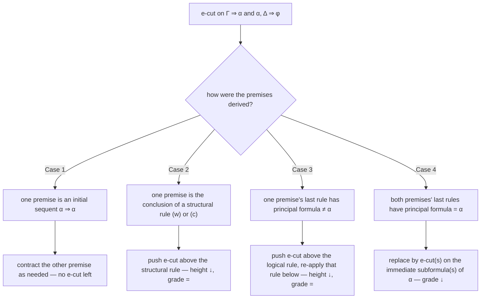

# Cut Elimination

[[book-guidelines|↩ Back to guidelines]]

## Why you'd ever want to remove a rule that makes proofs *shorter*

The cut rule is the sequent-calculus version of the most ordinary thing you do in reasoning: chain two facts together.

$$
\dfrac{\Gamma \Rightarrow \alpha \qquad \alpha, \Delta \Rightarrow \varphi}{\Gamma, \Delta \Rightarrow \varphi} \; \text{(cut)}
$$

Read it as "if $\alpha$ follows from $\Gamma$, and $\varphi$ follows from $\alpha$ together with $\Delta$, then $\varphi$ follows from $\Gamma$ and $\Delta$ directly." That's transitivity of deduction — the sequent-calculus counterpart of function composition, or of `let x = e1 in e2` where you're allowed to forget what `e1` computed once you've substituted it in. Ono opens the chapter by naming this precisely: cut formalizes "transitive deductive reasoning" (p. 23).

Cut is also indispensable for writing proofs the way mathematicians actually write them — you prove a lemma once, then reuse it, rather than inlining the lemma's whole derivation every time you need it. A **cut-free** proof, by contrast, is what Ono calls "a kind of proof without detours" — every step works directly on the target formula, with no intermediate lemma introduced and later thrown away.

**What breaks without cut elimination.** If cut is a primitive rule with no constraints on how it's used, a formula $\alpha$ appearing in a cut can be arbitrary — it doesn't have to be a subformula of anything in the end sequent $\Gamma, \Delta \Rightarrow \varphi$. That single fact is what wrecks two things you want from a proof system: (1) *decidability by proof search* — if you don't know cut-free proofs suffice, searching for a proof means guessing an arbitrary lemma $\alpha$ out of an infinite space of formulas, which is not an algorithm; (2) the **[[Subformula-Property|subformula property]]** — every formula in the proof is a subformula of something in the conclusion. Cut elimination is the theorem that licenses deleting cut without losing provability, and it's the mechanism that hands you both of those for free. This is why Ono calls it "one of the most important goals of syntactic study of logic" (p. 23) — everything in Chapter 3 (decidability, the disjunction property, Craig interpolation, Glivenko's theorem) is downstream of this one theorem.

Chapter 1 already proved cut elimination for LK *semantically*, via the invertible system $LK^*$ and a two-valued truth-table argument. That proof is a dead end for anything beyond LK: it gives you an existence proof, not a procedure, and it leans on $LK^*$'s invertibility, which most other sequent systems (LJ included) simply don't have. Chapter 2's contribution is a **syntactic** proof — an actual rewriting procedure that takes a proof-with-cut and mechanically produces a proof-without-cut, formula by formula, rule by rule. This is the version that generalizes to LJ, to modal systems, and (with adjustments) to the whole substructural family in Chapter 4.

## Measuring "simpler": grade and height

The syntactic proof is a termination argument for a rewrite system, so the first thing it needs is a measure that provably decreases. Ono introduces two, tied to the two ways a cut can be made "simpler" without eliminating it outright:

- **Grade**: the number of logical-symbol occurrences in the cut formula $\alpha$. Shrinking the grade means replacing a cut on $\alpha \wedge \beta$ with a cut on the strictly smaller $\alpha$ (or $\beta$).
- **Height**: the total number of sequents in the subproof sitting above (and including) the cut's lower sequent. Shrinking the height means pushing the cut rule *upward* in the proof tree, so it fires earlier, on a smaller subproof.

Definition 2.1 attaches a pair $(k, n)$ — grade and height — to every application of cut, and orders these pairs lexicographically:

$$
(k, n) \prec (k', n') \iff k < k' \text{, or } (k = k' \text{ and } n < n').
$$

This is a well-order (no infinite descending chain), so a rewriting procedure that strictly decreases $(k,n)$ at every step is guaranteed to terminate at a cut-free proof. Everything that follows is the case analysis showing that decrease is always achievable — with one glaring exception.

## The deadlock case: why contraction beats ordinary cut

Here's the failure mode that forces the whole chapter to happen. Suppose the cut formula $\alpha$ on the right branch was just introduced by *contraction* — i.e. $\alpha, \Delta \Rightarrow \varphi$ came from collapsing two copies of $\alpha$ into one:

$$
\dfrac{\dfrac{\alpha, \alpha, \Delta \Rightarrow \varphi}{\alpha, \Delta \Rightarrow \varphi}\;(c\Rightarrow)}{\dfrac{\Gamma \Rightarrow \alpha \qquad \alpha,\Delta \Rightarrow \varphi}{\Gamma, \Delta \Rightarrow \varphi}\;(cut)}
$$

The natural move — push the cut up past the contraction so its height drops — gives you *two* copies of $\alpha$ to eliminate, not one:

$$
\dfrac{\Gamma \Rightarrow \alpha \qquad \alpha, \alpha, \Delta \Rightarrow \varphi}{\dfrac{\Gamma \Rightarrow \alpha \qquad \alpha, \Gamma, \Delta \Rightarrow \varphi}{\Gamma, \Gamma, \Delta \Rightarrow \varphi}} \;\; \xrightarrow{\text{contract}} \;\; \Gamma, \Delta \Rightarrow \varphi
$$

The upper cut ($cut_1$) does have a smaller height — good. But the lower cut ($cut_2$) needs *another* copy of $\Gamma \Rightarrow \alpha$ to close off the second occurrence of $\alpha$, and that second cut has exactly the same height as the one you started with. Ono is blunt about it: "our primary idea reaches a deadlock" (p. 25). Ordinary cut, applied once, cannot always be eliminated in a single reduction step — contraction is precisely the rule that can regenerate the cut formula faster than a naive induction can shrink it away. (Notice, too, that this deadlock requires contraction specifically — Ono flags that for structural systems *without* contraction, the naive push-up already works, which is exactly why Chapter 4's substructural logics get an easier cut-elimination story.)

## The fix: extended cut (e-cut)

The resolution isn't to abandon the idea, it's to generalize the rule so it can absorb exactly the situation that broke it. The **extended cut rule (e-cut)** is:

$$
\dfrac{\Gamma \Rightarrow \alpha \qquad \alpha, \Delta \Rightarrow \varphi}{\Gamma, \Delta_\alpha \Rightarrow \varphi} \;\text{(e-cut)}
$$

where $\Delta_\alpha$ is $\Delta$ with **some** (possibly none, possibly all) occurrences of $\alpha$ deleted. Ordinary cut is the special case $\Delta_\alpha = \Delta$ (delete nothing); one application of e-cut can always be simulated by several applications of ordinary cut. The point of the generalization is that e-cut can now *delete just one* of the two copies of $\alpha$ in the deadlock case:

$$
\dfrac{\Gamma \Rightarrow \alpha \qquad \alpha, \alpha, \Delta \Rightarrow \varphi}{\Gamma, \Delta_\alpha \Rightarrow \varphi} \;\text{(e-cut)}
$$

This single e-cut, applied directly to $\alpha, \alpha, \Delta \Rightarrow \varphi$ (skipping the contraction entirely), has strictly smaller height than the original — no second cut, no deadlock. This is the crux move of the whole chapter: ordinary cut can only eliminate cut formulas uniformly, all-or-nothing, from $\Delta$; e-cut can eliminate *a chosen subset* of the occurrences, which is exactly the flexibility needed to absorb what contraction does to the antecedent.

To make this rigorous, Ono defines a variant system $LJ_e$ (LJ with cut replaced by e-cut) and proves the extended cut elimination theorem for $LJ_e$: a proof with one e-cut as its last rule can be turned into an e-cut-free proof of the same end sequent (statement $(*)$, p. 27). A short induction on the number of e-cuts in a proof then bootstraps this into full cut elimination for ordinary LJ — since every ordinary cut is a degenerate e-cut, an LJ-proof is automatically an $LJ_e$-proof, and eliminating all e-cuts from it (bottom-up, one at a time via $(*)$) leaves a genuinely cut-free LJ-proof.

## The double induction: four cases, always decreasing

Statement $(*)$ is proved by induction on $(grade, height)$ under $\prec$. Given a proof ending in one e-cut, look at how its two upper sequents were derived, and case-split:



**Case 1 — initial sequent.** If $\Gamma \Rightarrow \alpha$ is itself the axiom $\alpha \Rightarrow \alpha$, the whole cut is redundant: the right premise $\alpha, \Delta \Rightarrow \varphi$ (already e-cut-free, by the induction hypothesis) just needs some contractions applied to get $\alpha, \Delta_\alpha \Rightarrow \varphi$. No cut survives at all.

**Case 2 — structural rule.** If the cut formula is untouched by the last structural rule, push the cut above it (height drops, grade unchanged — same trick as the ordinary-cut argument). If the cut formula *is* the principal formula of that structural rule, this is where contraction lived — and it's now handled directly: e.g. if $\alpha, \Delta \Rightarrow \varphi$ came from contracting $\alpha, \alpha, \Delta \Rightarrow \varphi$, replace the whole thing with a single e-cut against $\alpha, \alpha, \Delta \Rightarrow \varphi$ directly (this is exactly the deadlock-fix from the previous section, now folded into the general procedure).

**Case 3 — non-principal logical rule.** If $\Gamma \Rightarrow \alpha$ was derived by a logical rule whose principal formula *isn't* $\alpha$ (e.g. $\beta \wedge \gamma, \Gamma' \Rightarrow \alpha$ came from $\beta, \Gamma' \Rightarrow \alpha$ via $(\wedge_1 \Rightarrow)$), push the e-cut above that rule and reapply the rule below the (now smaller-height) cut. Same idea as Case 2, just for logical rather than structural rules.

**Case 4 — both sides principal.** This is the genuinely new content, and it's where the grade actually shrinks. Both premises end in a logical rule *introducing* $\alpha$ as principal formula — say $\alpha = \beta \wedge \gamma$, with $\Gamma \Rightarrow \beta \wedge \gamma$ from $(\Rightarrow \wedge)$ and $\beta \wedge \gamma, \Delta \Rightarrow \varphi$ from $(\wedge_1 \Rightarrow)$. Unpacking one step on each side gives $\Gamma \Rightarrow \beta$ and $\beta, \Delta \Rightarrow \varphi$ directly, so a single e-cut on the strictly smaller formula $\beta$ replaces the original — grade strictly decreases. When $\Delta$ contains further occurrences of $\beta \wedge \gamma$ to absorb, Ono needs *two* e-cuts (one same-grade-smaller-height, one strictly-smaller-grade) plus a contraction to reassemble the result, but the induction hypothesis covers both because each individually is $\prec$ the original pair.

Since these four cases are exhaustive — every premise of a cut was derived by *some* rule, and it's either an axiom, a structural rule, or a logical rule either principal or not on $\alpha$ — the induction closes, giving:

> **Theorem 2.1.** Cut elimination holds for LJ.
> **Theorem 2.2.** Cut elimination holds for LK (the $\Delta_\alpha, \Lambda_\alpha$-generalized e-cut, symmetric on both sides since LK allows multi-formula succedents).

Theorem 2.3 then revisits LJ's single-succedent restriction and shows Case 3 needs extra care when the *right* premise's last rule is $(\Rightarrow\!\to)$ or $(\Rightarrow\!\neg)$ — those rules require an *empty* extra succedent in LJ, so naively pushing the cut up can produce a succedent that's no longer empty and thus an inference LJ doesn't allow. Ono works around it with a substitution trick using the *cut formula's own immediate subformula* $\gamma$ as an auxiliary cut (pp. 31–32) — a nice illustration that "cut elimination holds" is never one clean argument reused verbatim per system; single-succedent restrictions like LJ's cost you real proof-engineering, even once the double-induction skeleton is in place.

### Gentzen's original approach, and why Ono's is different (Remark 2.1)

Gentzen's 1935 proof used a rule called **mix** instead of e-cut:

$$
\dfrac{\Gamma \Rightarrow \Theta \qquad \Sigma \Rightarrow \Pi}{\Gamma, \Sigma^{*}_\alpha \Rightarrow \Theta^{*}_\alpha, \Pi} \;\text{(mix)}
$$

where $\Sigma, \Theta$ both contain at least one $\alpha$, and $\Sigma^{*}_\alpha, \Theta^{*}_\alpha$ delete **all** occurrences of $\alpha$ from each side — mix is "all-or-nothing" where e-cut is "choose which occurrences." Mix is a special case of e-cut. But because mix deletes uniformly, Gentzen found that height alone sometimes fails to decrease across a mix-replacement step, forcing him to invent a separate measure called *rank* to patch the induction — genuine extra bookkeeping. Ono's point (and the reason this chapter uses e-cut rather than reproducing Gentzen verbatim) is that e-cut's finer-grained "delete some occurrences" freedom is exactly what keeps height monotonically well-behaved, so the height-based double induction goes through cleanly without a third measure. This is a good example of a recurring theme in proof theory: generalizing a rule (making cut "more permissive" via e-cut) can make its own elimination *easier* to prove, even though the generalized rule looks more complicated on paper.

## The payoff: subformula property

Once cut is gone, Definition 2.2 gives you exactly what was promised at the top: a proof $P$ of $S$ has the **subformula property** if every formula occurring anywhere in $P$ is a subformula of some formula in $S$. Theorem 2.4 gets this almost for free: every LK/LJ rule *except cut* already has the property that every formula in an upper sequent is a subformula of something in the lower sequent — cut was the only rule allowed to introduce an unrelated formula $\alpha$ that then vanishes from the conclusion. Remove cut, and a trivial induction on proof length gives the subformula property for the whole proof.

Two immediate consequences Ono draws out (and flags as consequential enough to name):

- **Corollary 2.5**: for any sequent $S$ not mentioning a connective $\otimes$, if $S$ is provable at all, it has a proof using *no rules for $\otimes$*. This is the formal statement of "sequent calculus doesn't need detours through irrelevant connectives" — and Ono contrasts it explicitly with Hilbert-style systems, where implication is forced to play "a special and multiple role" in essentially every derivation (axiom schemes, modus ponens chains) even when the target formula doesn't mention implication at all.
- **Remark 2.3 — conservative extension**: if you extend LK/LJ with a new logical constant $0$ (axiom $0 \Rightarrow$) and prove cut elimination for the extended system the same way, then any $0$-free sequent provable in the extension was already provable without it. This is exactly the kind of "adding machinery doesn't secretly let you prove more of the old language" guarantee you want from any conservative extension.

## Grounding: cut elimination as a terminating rewrite engine

This chapter is a specification for an algorithm, so the most faithful grounding is to actually write it.

**Rust — the case-analysis engine.** The four-case structure (Section 2.2) is a textbook terminating-rewrite-system, and Rust's `enum` + exhaustive `match` is close to a direct transcription. You'd represent a proof tree as something like:

```rust
enum Proof {
    Initial(Formula),                 // α ⇒ α
    Weaken(Box<Proof>, Formula),
    Contract(Box<Proof>, Formula),
    LeftRule(Rule, Vec<Proof>),       // e.g. (∧ ⇒), (→ ⇒), …
    RightRule(Rule, Vec<Proof>),
    ECut { left: Box<Proof>, right: Box<Proof>, cut_formula: Formula, delete: DeleteSet },
}

fn measure(p: &Proof) -> Option<(usize, usize)> {
    // (grade, height) of the outermost e-cut, if there is one
    match p {
        Proof::ECut { cut_formula, left, .. } =>
            Some((grade(cut_formula), height(left) + height_of(p))),
        _ => None,
    }
}

fn eliminate_one_cut(p: Proof) -> Proof {
    match p {
        Proof::ECut { left, right, cut_formula, delete } => match (*left, *right) {
            // Case 1: initial sequent on either side
            (Proof::Initial(_), r) => contract_into(r, &delete),
            // Case 2: structural rule is the last step on either side
            (Proof::Contract(inner, f), r) if f == cut_formula => /* absorb, no deadlock */,
            (l, r) if principal_matches(&l, &cut_formula) == false => push_cut_up(l, r),
            // Case 4: both sides principal on the cut formula
            (l, r) => split_on_subformula(l, r, &cut_formula),
            // ... remaining structural/logical-rule cases
        },
        other => other,
    }
}
```

The important property to actually check (e.g. with `debug_assert!` or a property test) isn't just "this compiles" — it's that `measure` strictly decreases in the pair-lexicographic order on every recursive call, i.e. `(grade', height') < (grade, height)` under `Ord` on `(usize, usize)`'s derived lexicographic comparison, which is literally $\prec$ from Definition 2.1. That's the part of this chapter that transfers directly to a verifier's proof-normalization pass: any time your checker needs to simplify a derivation before checking a target property (subformula-bounded search, decidability procedures), this same shape — generalize the elimination rule until the case analysis has a strictly-decreasing measure — is the pattern to reach for.

**Lean — well-founded recursion is the same argument, machine-checked.** Lean's own recursive-function elaborator needs exactly this kind of justification whenever a recursive call isn't obviously structural, and it does it the same way Ono does: define a well-founded relation and show every recursive call decreases under it. The $(grade, height)$ lexicographic order Ono uses by hand is precisely `Prod.Lex` / `WellFoundedRelation` on `ℕ × ℕ` in Lean — you'd write `termination_by (grade cutFormula, height leftPremise)` and Lean would generate (and check) exactly the descent obligations Ono verifies case-by-case in prose. There's also a deeper correspondence worth naming explicitly: under Curry-Howard, cut elimination in a sequent calculus corresponds to **beta-reduction / normalization** of proof terms in a natural-deduction or type-theoretic system — the case where "both premises are principal on the cut formula" (Case 4) is the proof-theoretic mirror of a redex `(λx. e) v` reducing to `e[v/x]`. Lean's kernel performs exactly this kind of reduction (via `whnf`/`isDefEq`) when it checks definitional equality — so the double induction here is the same *kind* of termination argument that ultimately justifies why Lean's type-checking loop is guaranteed to terminate on well-typed terms, just phrased for sequents-and-rules instead of terms-and-types.

## Where this leads

Cut elimination is the load-bearing result the rest of Part I stands on. Concretely, within this book: Chapter 3 derives decidability of LJ (proof search only needs to explore subformulas — no guessing an arbitrary cut formula), the disjunction property, Craig interpolation (via Maehara's method, which operates directly on cut-free proofs), and Glivenko's theorem, all *because* cut-free proofs obey the subformula property proved here. Chapter 4 revisits this exact double-induction machinery for modal logics (where it succeeds for K, D, T, 4, B, S4 but *fails* for S5 — the axiom B breaks it, motivating the weaker "analytic cut" substitute) and for substructural logics (where dropping contraction removes the deadlock case entirely, making cut elimination easier, not harder).

For the standing project: this is the proof-theoretic ancestor of any "does my checker's derivation reduce to a normal form" question. A theorem prover that performs backward proof search (Chapter 3's decision procedure) is *relying* on cut elimination to know the search space is subformula-bounded rather than open-ended — so if a future Rust-based automated prover embeds sequent-style backward search, this chapter is the correctness argument for why that search terminates and doesn't need to guess lemmas. And the Case-4 principal/principal reduction is worth remembering by name the next time a Lean-style definitional-equality check "unfolds both sides and matches head symbols" — it's the same move, just running on terms instead of sequents.
