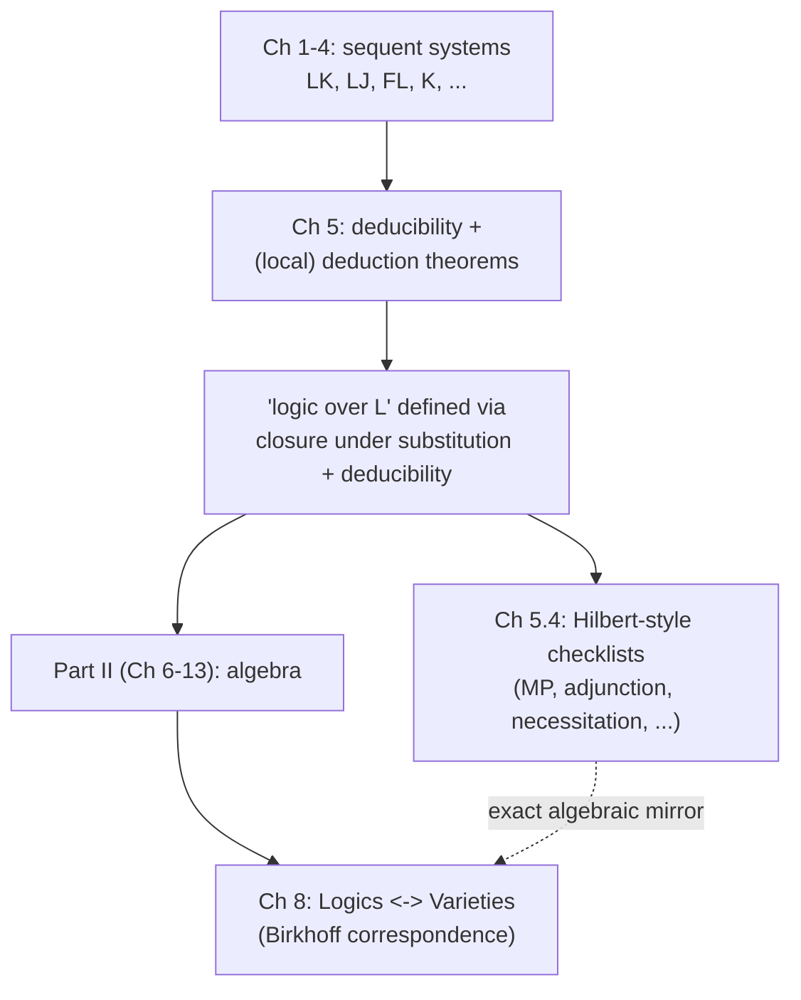

[[book-guidelines|↩ Back to guidelines]]

## Why this chapter exists

Every logic system you've met so far in the book — LK, LJ, the modal sequent systems, the substructural systems FL through FLec — answers one question well: is a *given, fixed* formula $\varphi$ provable from *no* assumptions? That's provability. But almost nothing you'd want to do with a logic stops there. "If I already know $\alpha$, can I get $\beta$?" is a different, more useful question, and it's the one mathematicians, programmers, and (as we'll see at the end) type-checkers actually ask constantly. That's **deducibility**: provability relative to a background set of assumptions.

The chapter's deeper motive, though, is architectural. Ono is about to pivot the whole book from Part I (proof theory: sequent calculi, [[Cut-Elimination|cut elimination]], decidability) to Part II (algebra: lattices, Boolean and Heyting algebras, varieties). To ask a genuinely general question like "how many logics are there over intuitionistic logic?" you first need a *definition of "a logic"* that doesn't secretly assume a specific proof system. A logic defined as "the set of theorems of sequent system LJ" is too concrete — it doesn't let you talk about *arbitrary* extensions of Int uniformly. Chapter 5 builds that abstract definition, and deducibility is the tool that makes it precise rather than hand-wavy. This is why the chapter is subtitled, in effect, a bridge between Part I and Part II.

What breaks without this: without a proof-system-independent definition of "logic," a claim like "there are continuum-many superintuitionistic logics" would be meaningless — you'd have to ask "continuum-many *what*, exactly?" Deducibility plus closure conditions gives the "what."

## 1. Deducibility: provability with a persistent context

### The definition

Fix a logic like classical logic $\mathrm{Cl}$, presented by the sequent system LK. Let $S$ be a set of formulas — the assumptions. A **deduction of $\Gamma \Rightarrow \Delta$ from $S$** in LK is a proof-figure with end-sequent $\Gamma \Rightarrow \Delta$, where in addition to LK's usual initial sequents ($\alpha \Rightarrow \alpha$), any sequent $\Rightarrow \sigma$ with $\sigma \in S$ is also allowed as an initial sequent. In other words: you get to freely assert any member of $S$ at any leaf of the proof tree, as many times as you like, and then reason from there with the ordinary LK rules.

$\Gamma \Rightarrow \Delta$ is **deducible from $S$** (written informally "$S \vdash_{\mathrm{Cl}} \varphi$" when $\Delta$ is a single formula $\varphi$ and $\Gamma$ is empty) iff such a deduction exists. When $S = \emptyset$, deducibility from $S$ collapses to ordinary provability — so deducibility is a strict generalization, not a different concept bolted on.

One subtlety Ono is careful about, and that a programmer's intuition should flag immediately: **only literal members of $S$ are extra initial sequents — not their substitution instances.** If $S = \{P(x)\}$, you may *not* freely use $P(y)$ or $P(f(x))$ as an assumption unless it's literally in $S$. This is exactly the distinction between a **free variable held fixed** (an assumption) and a **schema variable** (an axiom scheme, which *is* closed under substitution). Get this backward and you silently prove things that don't follow — this is the same trap a type-checker falls into if it doesn't distinguish a bound type variable from a metavariable that unification is allowed to instantiate.

$S \vdash_{\mathrm{Cl}} \alpha$ and $S \vdash_{\mathrm{Int}} \alpha$ denote deducibility in classical and intuitionistic logic respectively (using LK, LJ). Crucially, this notion is proof-system-agnostic in spirit: "α is deducible from S in Cl" just means "α is provable in classical logic once every member of S is granted as an extra axiom (not axiom scheme)" — you could reformulate it with a Hilbert system and get the same relation.

**Rust grounding.** A `Deduction` is naturally a proof search where the assumption set is carried as immutable *context*, distinct from the rule set:

```rust
struct Deduction<'a> {
    assumptions: &'a HashSet<Formula>,  // S — literal formulas only
    goal: Formula,
}

// An assumption is usable as a leaf ONLY by exact structural equality —
// never up to substitution/unification. This mirrors the book's warning
// that σ* ∉ S even if σ* is an instance of some σ ∈ S.
fn is_initial(node: &Formula, ctx: &HashSet<Formula>) -> bool {
    ctx.contains(node)   // exact match, not "unifies with some member of ctx"
}
```
This is precisely the difference between a typing context `Γ` (fixed hypotheses, checked by exact/definitional equality) and a set of axiom *schemes* (which a metaprogram may instantiate freely) — a distinction load-bearing for a Hoare-triple checker, where you must not let it silently generalize a hypothesis.

### Consequence relations: the abstract shape underneath

Rather than talk about "deducibility in LK" specifically, Ono immediately abstracts to **consequence relations**, the basic object of algebraic logic:

> **Definition 5.1.** For a set $X$, a relation $\vdash$ between $\wp(X)$ and $X$ is a *consequence relation over $X$* if:
> 1. $S \vdash x$ for every $x \in S$ (reflexivity),
> 2. for every $x \in X$: if $S \vdash y$ for every $y \in T$, and $T \vdash x$, then $S \vdash x$ (a cut/transitivity condition — you can compose deductions through an intermediate assumption set $T$).

From these two axioms alone, monotonicity falls out as a theorem (Exercise 5.1): if $S \subseteq T$ and $S \vdash x$, then $T \vdash x$ — having *more* assumptions never loses a conclusion (there's no assumption-retraction in classical/intuitionistic deducibility; that's a feature that fails for genuinely nonmonotonic logics, which this framework isn't trying to capture).

Two extra properties matter for the rest of the book:

- **Finitary (compact):** if $S \vdash x$, some *finite* $S' \subseteq S$ already gives $S' \vdash x$. Any deduction is a finite proof tree, so it only ever touches finitely many assumptions — this is essentially free for sequent-calculus deducibility, but it's worth stating because it's exactly the property that will later let you reduce "is $\varphi$ a consequence of an infinite axiom set" to a search over finite subsets.
- **Substitution-invariant (structural):** if $S \vdash x$, then $\sigma(S) \vdash \sigma(x)$ for every substitution $\sigma$. Uniformly substituting into both the assumptions and the conclusion preserves deducibility.

Both $\vdash_{\mathrm{Cl}}$ and $\vdash_{\mathrm{Int}}$ over the set of all formulas are finitary, substitution-invariant consequence relations (Exercise 5.2) — this is the concrete instance that motivates the abstract definition.

**What breaks without finitarity/substitution-invariance:** these two properties are exactly what later let Ono define "a logic" as a set closed under substitution and deducibility (Section 5.3) and have that definition behave sensibly — without substitution-invariance, "closed under substitution" wouldn't even interact coherently with the consequence relation; without finitarity, "finitely axiomatizable" wouldn't correspond to anything computationally meaningful.

## 2. The deduction theorem: converting assumptions into implications

### The classical/intuitionistic case (full strength)

This is the familiar fact that licenses "assume $\alpha$, derive $\beta$, conclude $\alpha \to \beta$" reasoning:

> **Theorem 5.1 (Deduction theorem).** Let $\vdash$ denote either $\vdash_{\mathrm{Cl}}$ or $\vdash_{\mathrm{Int}}$. Then $S \cup \{\alpha\} \vdash \beta$ iff $S \vdash \alpha \to \beta$.

The ($\Leftarrow$) direction is a one-liner: since $\alpha, \alpha \to \beta \Rightarrow \beta$ is provable (in both LJ and LK — it's just modus ponens as a sequent), take a deduction of $\Rightarrow \alpha \to \beta$ from $S$, cut it against that sequent to get a deduction of $\alpha \Rightarrow \beta$ from $S$, then cut against $\Rightarrow \alpha$ (an assumption of $S \cup \{\alpha\}$) to reach $\Rightarrow \beta$.

The ($\Rightarrow$) direction is the interesting one, and it's a genuine structural induction over the deduction tree — worth internalizing because the *shape* of this proof is the template for every "local" variant that follows. Given a deduction $P$ of $\Rightarrow \beta$ from $S \cup \{\alpha\}$, prove by induction on the length of each subderivation that **$\alpha, \Gamma \Rightarrow \Delta$ is deducible from $S$ alone**, for every sequent $\Gamma \Rightarrow \Delta$ occurring in $P$ — i.e., you push a copy of $\alpha$ into the antecedent of *every* node of the tree, discharging it as an explicit hypothesis instead of a free-floating assumption. Base case: initial sequents get $\alpha$ added by left-weakening (harmless — LK/LJ have unrestricted weakening); the case $\Gamma \Rightarrow \Delta$ being literally $\Rightarrow \alpha$ becomes the initial sequent $\alpha \Rightarrow \alpha$ directly. Inductive step: whichever rule was applied to reach $\Gamma \Rightarrow \Delta$, apply the same rule to the (by hypothesis, already-augmented) premises, then use **contraction** to merge the two copies of $\alpha$ that a two-premise rule would otherwise duplicate into one. Apply this to the end-sequent $\Rightarrow \beta$ and you get $\alpha \Rightarrow \beta$ deducible from $S$, hence (by the → introduction rule) $\Rightarrow \alpha \to \beta$ deducible from $S$.

**The two structural rules doing the real work, named explicitly:** weakening (to seed $\alpha$ into every leaf, even ones that don't need it) and contraction (to collapse duplicate copies of $\alpha$ produced when a rule has two premises). Flag this now — it's the entire reason the next section exists.

A repeated application gives the familiar currying/uncurrying equivalence:

> **Corollary 5.2.** These are equivalent: (1) $\beta$ is deducible from $\{\alpha_1,\dots,\alpha_m\}$; (2) $\alpha_1 \to (\alpha_2 \to (\cdots \to (\alpha_m \to \beta)\cdots))$ is provable; (3) $(\alpha_1 \wedge \cdots \wedge \alpha_m) \to \beta$ is provable; (4) $\alpha_1,\dots,\alpha_m \Rightarrow \beta$ is provable as a sequent.

This is worth pausing on because it says something quietly important: **deducibility from a finite set of hypotheses is *the same thing* as multiset membership in a sequent's antecedent**, once you identify $\{\alpha_1,\dots,\alpha_m\}$ (a set of assumptions) with $\alpha_1,\dots,\alpha_m$ (a multiset of antecedent formulas). This identification is exactly what a Rust type-checker does implicitly every time it treats a typing context `Γ = x: T1, y: T2` as "the set of hypotheses I'm allowed to use," and it's exactly what starts to *break* once contraction/weakening aren't free — which is the whole point of the next section.

**Lean grounding.** Corollary 5.2's equivalence (1)⟺(2) is *definitionally* how a dependently-typed kernel represents "deduce β from α₁,…,αₘ": it doesn't reify "deducibility from a context" as a separate relation at all — a context entry `(h : α)` inside a proof term just *is* a bound variable, and discharging it (Lean's `fun h => ...` / the deduction-theorem direction) is literal lambda abstraction. `S ⊢ α → β` is quite literally the type of the term you get by `fun (h : α) => (proof of β using h)`. The deduction theorem for Cl/Int is, from a type theorist's vantage point, just saying "implication behaves like the function-space introduction rule" — unsurprising once you know Int's sequent calculus is the proof theory the Curry-Howard correspondence is built on, but it's worth seeing Ono derive it from scratch via cut and weakening/contraction rather than positing it as a primitive of the type theory.

## 3. Local deduction theorems: what happens when structural rules are scarce

### The failure, made concrete

Recall from Chapter 4 that FLe is LJ *without* weakening and contraction (exchange is kept). The deduction-theorem proof above used weakening (to seed $\alpha$) and contraction (to merge duplicates) essentially. Pull either away and the theorem should be expected to break — and it does:

> **Example 5.1.** The sequent $\alpha, \alpha, \alpha \to (\alpha \to \beta) \Rightarrow \beta$ is provable in FLe, but $\alpha, \alpha \to (\alpha \to \beta) \Rightarrow \beta$ is *not always* provable — FLe has no contraction, so you cannot collapse the two needed copies of $\alpha$ into one. Yet $\alpha, \alpha \to (\alpha \to \beta) \vdash_{\mathrm{FLe}} \beta$ *does* hold — a **deduction** is free to reuse the assumption $\alpha$ as many times as it likes (that's what "assumption" *means*: an item you can invoke from the context repeatedly), even though a **sequent's antecedent**, without contraction, cannot losslessly compress two occurrences into one.

This is the crux of the whole chapter's substructural material: **deducibility and provability-of-the-collapsed-sequent quietly diverge once contraction is gone.** The equivalence baked into Corollary 5.2 — "assumptions used $m$ times" = "one occurrence in the antecedent" — was silently relying on contraction the whole time; substructural logics are exactly where that silent assumption gets exposed. This is the resource-reading from Chapter 4's "$25" example again: an assumption available for reuse ad libitum is a very different resource than a formula occupying one antecedent slot.

**What breaks without local deduction theorems as a substitute:** without *some* replacement, you'd have no way to convert "β follows given α as a standing hypothesis" into an implicational formula at all for FLe/FLc/modal logics — and that conversion is exactly what's needed in Section 5.3/5.4 to characterize "logic over L" via closure under modus ponens rather than via the deducibility relation directly.

### The fix: quantify over a multiplicity

The fix is to allow the discharged hypothesis to appear with some *indeterminate finite multiplicity* $m$, using fusion ($\cdot$) to combine copies: $\gamma^1 = \gamma$, $\gamma^{k+1} = \gamma \cdot \gamma^k$.

> **Theorem 5.3 (Local deduction theorem for FLe).** $S \cup \{\alpha\} \vdash_{\mathrm{FLe}} \beta$ iff $S \vdash_{\mathrm{FLe}} (\alpha \wedge 1)^m \to \beta$ for *some* $m > 0$.

It's called *local* precisely because $m$ isn't fixed in advance — it depends on the particular deduction, unlike the classical case where "$\alpha \to \beta$" (multiplicity exactly 1, effectively) always suffices. The proof mirrors Theorem 5.1's induction exactly, with one adaptation: since FLe lacks weakening, you can't freely seed $\alpha \wedge 1$ into every leaf out of nothing. Instead, the constant $1$'s own rule (1w: $\Gamma \Rightarrow \Delta$ gives $1, \Gamma \Rightarrow \Delta$) does the seeding — recall from Chapter 4 that $1$ is the multiplicative unit, provable at any point without consuming a resource — and then $\wedge$-left produces $\alpha \wedge 1, \Gamma \Rightarrow \Delta$. And since contraction is also absent, multiple occurrences of $\alpha \wedge 1$ are simply *left as multiple occurrences* rather than merged — which is exactly why the exponent $m$ appears in the final statement instead of being fixed at 1.

The variants for the other basic substructural systems follow by the same method, differing only in how "multiplicity" gets expressed given which structural rules are present:

> **Corollary 5.4 (FLec — has contraction).** $S \cup \{\alpha\} \vdash_{\mathrm{FLec}} \beta$ iff $S \vdash_{\mathrm{FLec}} (\alpha \wedge 1) \to \beta$. Multiplicity collapses to exactly 1 — contraction is back, so the local theorem becomes a genuine (global) deduction theorem again, just with $\alpha \wedge 1$ in place of bare $\alpha$ (weakening is still missing, hence the "$\wedge 1$").
>
> **Corollary 5.5 (FLew — has weakening).** $S \cup \{\alpha\} \vdash_{\mathrm{FLew}} \beta$ iff $S \vdash_{\mathrm{FLew}} \alpha^m \to \beta$ for some $m$. Weakening is present so no "$\wedge 1$" padding is needed, but contraction is still absent, so $m$ stays indeterminate.

For FL itself (no exchange either), a further-weakened "parameterized local deduction theorem" holds; Ono defers the details to Galatos and Ono (2006) as it requires tracking not just multiplicity but *position* in the antecedent.

**What this buys you as an engineering intuition:** if you're building a resource-aware type system (linear/affine types — think Rust's own ownership discipline, which is precisely an FLew-shaped restriction: weakening allowed — you may drop a value — contraction forbidden — you may not duplicate a non-`Copy` value), the local deduction theorem is the formal answer to "how many times do I need to use this borrowed hypothesis to derive what I want," and the fact that $m$ is *existentially* quantified rather than computable is not a curiosity — see the undecidability result below.

### An undecidability sting

> **Theorem 5.6.** (1) The *provability* problem of FLe is decidable (already Theorem 4.8). (2) The *deducibility* problem of FLe — "does $S \vdash_{\mathrm{FLe}} \alpha$ hold for finite $S$?" — is **undecidable**.

This traces back to the undecidability of linear logic with exponentials (via reduction from the halting problem for Minsky machines). The consequence for Theorem 5.3 is sharp: **there is no algorithm computing the multiplicity $m$** from $S, \alpha, \beta$. If there were, you could combine "search for the right $m$" with FLe's decidable provability check to decide deducibility outright — contradiction. So local deduction theorems tell you *that* a witnessing $m$ exists, never *how big* — a genuine ineffectivity, not just a complexity gap. Worth internalizing if you're ever tempted to implement "just try increasing $m$ until it works" as a decision procedure: it's a semi-decision procedure at best (it terminates when deducibility holds, never when it doesn't), which is the FLe-deducibility analogue of general unification search not being guaranteed to terminate on failure.

### The modal case

The same inductive method, applied to normal modal logic K, gives:

> **Theorem 5.7 (Local deduction theorem for K).** $S \cup \{\alpha\} \vdash_{\mathrm{K}} \beta$ iff $S \vdash_{\mathrm{K}} (\alpha \wedge \Box\alpha \wedge \cdots \wedge \Box^m\alpha) \to \beta$ for some $m \ge 0$, where $\Box^0\alpha = \alpha$ and $\Box^{k+1}\alpha = \Box(\Box^k \alpha)$.

Here the obstruction isn't a missing structural rule but the necessitation rule ($\Box$): discharging $\alpha$ into a subproof that used necessitation forces you to also carry along $\Box\alpha, \Box^2\alpha, \dots$ up to however many nested necessitations occurred. Two clean specializations, using the axiom schemes 4 ($\Box^k\alpha \Rightarrow \Box^{k+1}\alpha$ provable in K4) and T ($\Box^{h+1}\alpha \Rightarrow \Box^h\alpha$ provable in KT):

> **Corollary 5.8.** $S \cup \{\alpha\} \vdash_{\mathrm{K4}} \beta$ iff $S \vdash_{\mathrm{K4}} (\alpha \wedge \Box\alpha) \to \beta$ — under axiom 4, the infinite tower of $\Box^k\alpha$'s collapses to just $\alpha \wedge \Box\alpha$, and for S4 (K4+T) it collapses further to a genuine (global) deduction theorem: $S \vdash_{\mathrm{S4}} \alpha \to \beta$, no conjunction needed at all.
>
> **Corollary 5.9 (KT).** $S \cup \{\alpha\} \vdash_{\mathrm{KT}} \beta$ iff $S \vdash_{\mathrm{KT}} \Box^m\alpha \to \beta$ for some $m$ — stays local since KT lacks axiom 4.

## 4. Axiomatic extensions and "a logic over L"

This is where the chapter earns its bridging role. The question is: given a base logic $L$ (Int, FL, K, …) and a set $S$ of extra axiom formulas, how do you *define*, precisely, "the logic you get by adding $S$ to $L$"?

### The construction

For a set $S$ of formulas, let $S^*$ be the set of *all substitution instances* of members of $S$ — this is where axiom schemes re-enter: $S$ gives you formulas, $S^*$ closes them into schemes. Define:

$$\mathrm{Int}[S] = \{\varphi : S^* \vdash_{\mathrm{Int}} \varphi\}$$

— the set of all formulas deducible from $S^*$ in LJ. This is called **the axiomatic extension of Int with axioms $S$**. (A sanity check worth having: $(S^*)^* = S^*$, since composing two substitutions is again a substitution — so there's no infinite regress from re-closing under substitution.)

Two closure properties fall out immediately (Lemma 5.10): $\mathrm{Int}[S]$ is closed under substitution, and closed under deducibility-in-Int (if $\alpha_1,\dots,\alpha_m \vdash_{\mathrm{Int}} \beta$ and every $\alpha_i \in \mathrm{Int}[S]$, then $\beta \in \mathrm{Int}[S]$ too). These two closure properties are then promoted to a *definition* that no longer mentions the construction $\mathrm{Int}[S]$ at all:

> **Definition 5.3 (Logics over Int).** A set of formulas is a logic over Int if it is closed under both substitution and deducibility in Int.

And the construction and the abstract definition turn out to coincide exactly:

> **Lemma 5.11.** A set of formulas is a logic over Int iff it is an axiomatic extension $\mathrm{Int}[S]$ for some $S$.

(Proof sketch: any logic $L$ over Int satisfies $L = \mathrm{Int}[L]$ — take $S = L$ itself. $L \subseteq \mathrm{Int}[L]$ is trivial reflexivity of $\vdash$; $\mathrm{Int}[L] \subseteq L$ uses exactly the two closure properties, applied to whichever finite subset of $L^*$ a given deduction touches.)

This is the payoff: **"logic over Int" now means something independent of any particular proof system or axiom presentation** — it's a purely set-theoretic/closure condition on a set of formulas. Superintuitionistic logics are, by definition, logics over Int; they form a partial order under $\subseteq$, with Int itself the smallest and the set of *all* formulas the (degenerate, inconsistent) greatest. Classical logic sits properly inside that order as a *finitely* axiomatizable logic over Int: $\mathrm{Cl} = \mathrm{Int}[p \vee \neg p] = \mathrm{Int}[\neg\neg q \to q]$.

The same machine generalizes to any logic $L$ with a sequent system $\mathrm{G}L$:

> **Definition 5.4 (Logics over $L$, general).** A set of formulas is a logic over $L$ if closed under substitution and deducibility-in-$L$. Equivalently (Lemma 5.12), it's an axiomatic extension $L[S] = \{\varphi : S^* \vdash_L \varphi\}$.

Applying this with $L = $ FL, FLe, K gives the book's standard vocabulary:

| Logics over… | conventionally called |
|---|---|
| Int | superintuitionistic logics |
| FL | substructural logics |
| FLe | commutative substructural logics |
| K (modal language) | normal modal logics |

**A composability lemma worth flagging (5.13):** if $L_1$ is an axiomatic extension of $L_0$, then "$L$ is an axiomatic extension of $L_1$" is equivalent to "$L$ is an axiomatic extension of $L_0$ that happens to include $L_1$." This is exactly transitivity-with-a-floor for the extension order — it's what makes statements like "FLe is a substructural logic" (an extension of FL) and "every commutative substructural logic is an extension of FL too, factoring through FLe" fit together coherently, rather than being two independent facts you have to separately verify.

## 5. Turning the abstract closure conditions into a checklist

Closure under "deducibility" is elegant but operationally opaque — you don't want to enumerate an entire consequence relation to check whether a candidate set of formulas is a logic. Using the (local) deduction theorems from Section 3, Ono converts each closure-under-deducibility condition into a small, explicit, checkable list:

> **Theorem 5.14.** $L$ is a superintuitionistic logic iff: every Int-theorem is in $L$; $L$ is closed under substitution; $L$ is closed under **modus ponens** ($\alpha, \alpha\to\beta \in L \Rightarrow \beta \in L$).

(Proof idea: modus ponens is literally the case $S=\{\alpha,\alpha\to\beta\}$ of $S \vdash_{\mathrm{Int}} \beta$; conversely, iterating Corollary 5.2's implicational-chain equivalence and applying modus ponens repeatedly recovers full closure under deducibility from any finite assumption set.)

> **Theorem 5.15.** $L$ is a commutative substructural logic (logic over FLe) iff: every FLe-theorem is in $L$; closed under substitution; closed under modus ponens; **and** if $\alpha \in L$ then $\alpha \wedge 1 \in L$.

That fourth condition is the direct fingerprint of the local deduction theorem's "$(\alpha \wedge 1)^m$" — and it can equivalently be strengthened to **closure under adjunction** ($\alpha, \beta \in L \Rightarrow \alpha \wedge \beta \in L$), which is the more memorable form. (For FLew specifically, drop the fourth condition entirely and just replace FLe by FLew in the first — since $\alpha \wedge 1 \equiv \alpha$ once weakening is present, the padding condition becomes vacuous, exactly as you'd expect from Corollary 5.5's cleaner statement.)

> **Theorem 5.16.** $L$ is a substructural logic (logic over FL) iff: every FL-theorem is in $L$; closed under substitution; if $\alpha, \alpha\backslash\beta \in L$ then $\beta \in L$ (modus ponens for left-division, since FL lacks exchange so there's no single implication); if $\alpha \in L$ then $\alpha \wedge 1 \in L$; and if $\alpha \in L$ then $\gamma\backslash(\alpha \cdot \gamma)$ and $(\gamma \cdot \alpha)/\gamma$ are in $L$ for *every* formula $\gamma$ — a "conjugation" closure condition needed because FL also lacks exchange, so inserting $\alpha$ at an arbitrary antecedent position (not just consing it on) has to be licensed explicitly.

> **Theorem 5.17.** $L$ (modal language) is a logic over K iff: every K-theorem is in $L$; closed under substitution; closed under modus ponens; **and closed under necessitation** ($\alpha \in L \Rightarrow \Box\alpha \in L$).

Each of these four theorems is a direct algebraic-flavored corollary of the corresponding (local) deduction theorem from Section 3 — the pattern is uniform: *the deduction theorem's exponent/side-condition becomes exactly the extra closure condition beyond "modus ponens + substitution."* This is a clean, reusable proof-engineering pattern: once you have a deduction theorem for a system, you get a checkable Hilbert-style closure characterization of "a logic over that system" essentially for free.

**Rust grounding — this is the closest thing in the chapter to "a small compiler pass."** Each characterization above is literally a closure-computation specification:

```rust
enum ClosureRule {
    ModusPonens,          // Int, FLe, K
    LeftDivisionMP,       // FL
    Adjunction,           // FLe (α∧1 ∈ L when α ∈ L)
    Necessitation,        // K
    Conjugation,          // FL: γ\(α·γ), (γ·α)/γ  for all γ
}

fn saturate(mut l: HashSet<Formula>, base_theorems: &HashSet<Formula>,
            rules: &[ClosureRule]) -> HashSet<Formula> {
    l.extend(base_theorems.iter().cloned());   // "every theorem of L belongs to L"
    loop {
        let before = l.len();
        // apply every ClosureRule once to every applicable pair/element,
        // inserting new consequences; also close under substitution instances.
        // (elided: this is exactly a fixed-point / worklist saturation loop)
        if l.len() == before { break; }        // fixed point reached
    }
    l
}
```
This is precisely the shape of a Datalog-style fixpoint computation, or of computing the closure of a set of Hoare-logic-derivable facts under a fixed rule set — recognizing "logic over L" as "the least fixed point of these closure rules containing the base theorems" is the practical, implementable reading of Definitions 5.3/5.4.

## 6. The historical zoo (Section 5.5): what falls out of this framework

Ono closes the chapter by showing that most of the "named" nonclassical logic families from the 20th century are simply particular axiomatic extensions in this framework — worth knowing by name since they recur throughout the rest of the book:

- **Lambek calculus** (Lambek 1958) — essentially FL itself (originally without $\wedge,\vee$, and antecedents restricted to nonempty sequences, for grammar-parsing reasons); FL is literally named after Lambek.
- **Linear logic** (Girard 1987) — adds exponentials (modal-like operators) to a substructural base; undecidable because of them, but its exponential-free fragment (MALL) equals $\mathrm{InFL_e}$ (the involutive multi-succedent system from Chapter 4), and the exponential-free fragment of *intuitionistic* linear logic equals FLe.
- **Relevant logics** — reject weakening, to block "falsehood implies anything." $R$ (Anderson–Belnap–Meyer–Dunn tradition) is $\mathrm{InFL_{ec}}[(\alpha \wedge (\beta \vee \gamma)) \to ((\alpha \wedge \beta) \vee (\alpha \wedge \gamma))]$ — FLec plus double negation plus distributivity; shown undecidable by Urquhart (1984).
- **Logics without contraction** — axiomatic extensions of FLew; historically tied to blocking Russell's paradox (Grishin observed contraction is essential to deriving it) and to decidability of residuated-lattice equational theory (Tamura 1974).
- **Fuzzy logics** (Hájek) — basic fuzzy logic BL is an extension of FLew.
- **Łukasiewicz's many-valued logics** — syntactically, also extensions of FLew (contraction fails over non-two-valued truth values), a subclass of logics without contraction and of fuzzy logics.
- **Johansson's minimal logic** (1936) — FLec plus left-weakening but *without* right-weakening (so it rejects ex falso quodlibet, "anything follows from a contradiction").
- **Superintuitionistic logics** — logics over Int, known since Gödel (1932) to be infinite in number, closely tied to normal modal logics over S4 (previewing the [[Gödel-Translation|Gödel translation]] of Chapter 13).

The unifying lens: nearly every one of these historically-independent research programs (grammar formalisms, resource logics, paraconsistent logics, fuzzy control theory, many-valued semantics) turns out to be "some specific structural rule removed from LJ/LK, plus some specific extra axioms" — a single closure-based framework subsuming logics that were invented for entirely unrelated reasons.

## Where this leads



This chapter is the hinge the whole book turns on. Concretely: Chapter 8's central duality — "superintuitionistic logics correspond exactly to subvarieties of Heyting algebras" — presupposes that "a logic" already means "a substitution- and deducibility-closed set of formulas," which is precisely what Chapter 5 established. Without this chapter, "how many logics are there over Int" would have no well-defined answer to count.

**Bearing on the standing project:** the closure-condition characterizations in Section 5.4 (Theorems 5.14–5.17) are the cleanest illustration in the book so far of "a logic as a saturation/fixpoint computation" — directly the shape a Rust-based theorem prover's *forward-chaining* rule engine would take when deciding whether a candidate consequence is derivable from a growing fact base, and the FLe deducibility-undecidability result (Theorem 5.6) is a concrete cautionary case study for why an automated prover working over a substructural or resource-sensitive fragment cannot always be made to terminate on *failure*, only on success — worth remembering before assuming "just add a depth bound" fixes non-termination in a resource-aware verifier.
