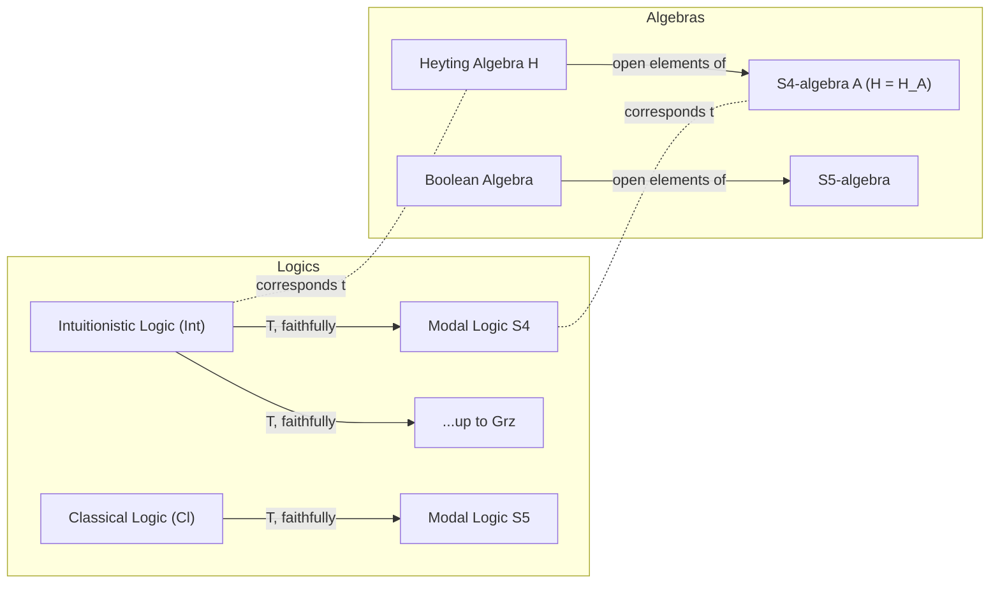

[[book-guidelines|↩ Back to guidelines]]

# Gödel Translation

## Why translate a logic into a different logic at all?

By the end of §10.3 the book has built two separate dictionaries: one between Boolean algebras and modal algebras (Jónsson-Tarski, §10.2), and one between Heyting algebras and posets/Kripke frames for superintuitionistic logics (the analogous Stone-style story, §10.3). Both dictionaries are *internal* to their own logic — they tell you how to move between an algebraic and a relational picture of the *same* system. §10.4 asks a different, sharper question: can you take a formula that lives in **one** logic (intuitionistic logic, Int) and mechanically rewrite it into a formula of a **completely different** logic (the modal logic S4), such that the rewriting preserves provability exactly?

This is not a cosmetic question. Intuitionistic implication $\alpha \to \beta$ has a genuinely different flavor from classical/modal implication — it's constructive, it doesn't validate $\neg\neg\alpha \to \alpha$, and its semantics (Kripke frames for Int) needs a monotonicity constraint that plain Boolean/modal Kripke semantics doesn't have. So there's no obvious reason a syntactic rewriting from Int into S4 should exist, let alone one that's *provability-preserving in both directions*. The **Gödel translation** (also called the **Gödel–McKinsey–Tarski translation**, after its independent discoverers — Gödel 1933, McKinsey and Tarski 1948) is exactly this rewriting, and its existence is the payoff the whole chapter has been building toward: it turns "Int and S4 feel structurally similar" into a precise theorem.

**What this buys you concretely:** once you know Int embeds into S4 via a translation you can compute, any decision procedure, proof search algorithm, or model-checking technique you have for S4 can be repurposed to decide intuitionistic validity too — you don't need to build separate machinery for Int from scratch. This is the general pattern behind embedding theorems: reduce a harder-to-handle logic to a better-understood one by a translation whose correctness is a theorem, not an assumption.

## The translation itself: reading $\to$ as "necessarily implies"

**Definition 10.4 (Gödel translation).** The translation $T$ from intuitionistic formulas to modal formulas is defined by structural recursion on the formula:

$$
\begin{aligned}
T(p) &= \Box p \quad \text{for every propositional variable } p,\\
T(0) &= 0,\\
T(\alpha \vee \beta) &= T(\alpha) \vee T(\beta),\\
T(\alpha \wedge \beta) &= T(\alpha) \wedge T(\beta),\\
T(\alpha \to \beta) &= \Box(\neg T(\alpha) \vee T(\beta)).
\end{aligned}
$$

Two clauses do all the interesting work, and it's worth pausing on *why* they're the ones that need $\Box$:

- **Every propositional variable gets boxed.** $T(p) = \Box p$, not just $p$. This is the load-bearing move: it says an intuitionistic atomic proposition is read modally as "necessarily $p$" — i.e., $p$ is *stably*, *persistently* true, not just true right now. This anticipates the semantic content below: intuitionistic truth is going to correspond to modal truth at *every accessible world*, which is exactly what $\Box$ means in S4 (where the accessibility relation is reflexive and transitive, i.e., a preorder).
- **Implication becomes $\Box(\neg T(\alpha) \vee T(\beta))$, not just $\neg T(\alpha) \vee T(\beta)$.** If you dropped the outer $\Box$, you'd just be encoding intuitionistic implication as classical material implication — which is exactly what intuitionistic logic denies is valid (that's the whole point of not having $\neg\neg\alpha \to \alpha$). The outer box forces the "if $\alpha$ then $\beta$" reading to hold not just at the current point but at every future (accessible) point, which is the Kripke-semantic content of intuitionistic $\to$ carried over into the modal setting.
- $\vee$ and $\wedge$ translate homomorphically with no $\Box$ needed — disjunction and conjunction don't carry the same "must persist into the future" content that atoms and implication do.

**What breaks without the boxes:** if you translated $p \mapsto p$ (unboxed) and $\alpha \to \beta \mapsto \neg T(\alpha) \vee T(\beta)$ (unboxed), the translation would collapse intuitionistic logic into *classical* logic, not into S4 — you'd be proving the wrong theorem. The boxes are precisely what makes S4's *strictly weaker-than-classical* modal structure do the work that Int's constructive restrictions demand.

**Theorem 10.9.** A formula $\alpha$ is provable in intuitionistic logic if and only if $T(\alpha)$ is provable in modal logic S4.

The rest of §10.4 is the algebraic proof of this theorem, split into the two directions — this is a good place to slow down, because each direction uses a genuinely different construction.

## Direction 1 (soundness of the translation): open elements

Take an S4-algebra $A = \langle A, \vee, \wedge, \to, \Box, 0\rangle$ (a modal algebra satisfying the extra inequalities for axioms T and 4 — recall from §10.1 that this means $\Box a \le a$ and $\Box a \le \Box\Box a$ for all $a$). Call an element $a \in A$ **open** if $a = \Box a$. (Both $0$ and $1$ are trivially open.) Write $H_A$ for the set of all open elements of $A$.

The key claim is that $H_A$ is closed under $\vee$ and $\wedge$, and — defining a new operation $a \rightsquigarrow b := \Box(\neg a \vee b)$ for $a, b \in H_A$ — that $\langle H_A, \vee, \wedge, \rightsquigarrow, 0\rangle$ is itself a **Heyting algebra** (Lemma 10.10). This is the crux of the whole section: *the open elements of any S4-algebra, with a modal-implication-derived $\rightsquigarrow$, automatically form a Heyting algebra.* The proof that $\rightsquigarrow$ satisfies the residuation law ($a \wedge c \le b \iff c \le a \rightsquigarrow b$) is a short chase through the S4 inequalities — the reflexivity ($\Box a \le a$) and transitivity ($\Box a \le \Box\Box a$) axioms are exactly what's needed to make $\Box(\neg a \vee b)$ behave like relative pseudo-complementation.

Lemma 10.10 also proves a compatibility fact that makes this more than a curiosity: if $h$ is an assignment on $H_A$ and $g$ is an assignment on $A$ agreeing on atoms via $h(p) = g(T(p))$, then $h(\psi) = g(T(\psi))$ for *every* intuitionistic formula $\psi$ — i.e., evaluating $\psi$ directly in the Heyting algebra of open elements gives the same answer as evaluating its translation $T(\psi)$ in the ambient S4-algebra. This is what turns "open elements form a Heyting algebra" into "the translation preserves *evaluation*, not just structure."

From this, **Corollary 10.11** falls out by contraposition: if $\phi$ is valid in every Heyting algebra, then $T(\phi)$ is valid in every S4-algebra. (If $T(\phi)$ failed at some assignment $g$ on some $A$, the induced assignment $h$ on $H_A$ would falsify $\phi$ on a genuine Heyting algebra — contradiction.)

## Direction 2 (faithfulness of the translation): every Heyting algebra *is* an $H_A$

The converse direction needs to show every Heyting algebra actually *arises* as the open elements of some S4-algebra — otherwise Direction 1's implication could be one-directional and Theorem 10.9 would fail as a biconditional.

**Lemma 10.12** supplies this: for any Heyting algebra $H$, there's an S4-algebra $C$ such that $H$ embeds into $H_C$, the Heyting algebra of $C$'s open elements. [[Deducibility-Deduction-Theorems-and-Axiomatic-Extensions#The construction|The construction]] reuses [[Lattices-and-Boolean-Algebras#Stone's representation theorem|Stone's representation theorem]] for Heyting algebras (Theorem 7.14, from Chapter 7): embed $H$ into its canonical extension $H^\delta = U(D(H))$, the upward-closed subsets of $H$'s poset of prime filters $D(H) = \langle D(H), \subseteq \rangle$. Because $\subseteq$ is reflexive and transitive, $D(H)$ is *already* a valid S4 Kripke frame, so its dual algebra $\wp(D(H))$ (with $\Box$ defined the usual Kripke way) is an honest S4-algebra $C$. The punchline: the open elements of this particular $C$ turn out to be *exactly* the upward-closed subsets $U(D(H))$ — i.e., exactly $H^\delta$. So $H$ embeds into $H_C$ for free, riding on machinery you already built in Chapter 7 for a different purpose.

From Lemma 10.12, **Corollary 10.13** gives the reverse implication: if $T(\phi)$ is valid in every S4-algebra, then $\phi$ is valid in every Heyting algebra. (Contrapositive: if $\phi$ fails on some Heyting algebra $H$, transport the counterexample through the embedding $H \hookrightarrow H_C$ to get a counterexample to $T(\phi)$ on $C$.)

**Corollaries 10.11 + 10.13 together are exactly Theorem 10.9.** This is a clean example of a proof strategy worth internalizing: prove an "if and only if" between two logics by proving each direction via a *different* algebraic construction — one direction extracts a sub-structure (open elements from a given algebra), the other direction builds a witnessing structure from scratch (the canonical S4-algebra generated by an arbitrary Heyting algebra).

## The embedding generalizes: it's not just S4

The book closes §10.4 with two extensions that matter as much as the base theorem:

1. **Int embeds into any logic between S4 and Grz**, where $\mathsf{Grz}$ is S4 extended with the Grzegorczyk axiom scheme $\Box(\Box(p \to \Box p) \to p) \to p$. So S4 is the *weakest* faithful target, not the only one — the translation still works all the way up to Grz.
2. **Classical logic embeds into S5 the same way** (Theorem 10.14): $\alpha$ is provable classically iff $T(\alpha)$ is provable in S5. The book gives a nice sanity check for this: the Gödel translation of the law of excluded middle $p \vee \neg p$ is $\Box p \vee \neg \Box p$, and adding *that* as an axiom scheme to S4 is provably equivalent to adding $\Diamond p \to \Box \Diamond p$ — which is precisely axiom 5, i.e., you land exactly on S5. This is a satisfying consistency check: "classical logic is to S5 as intuitionistic logic is to S4" isn't a slogan, it's the same translation applied one level further up the axiom hierarchy, and the axiom that forces classicality (excluded middle) maps exactly onto the axiom that forces S5 (axiom 5).



## Grounding: the translation as a syntax-directed compiler pass

Because $T$ is defined by pure structural recursion on formula shape, it is *exactly* the shape of a compiler pass that lowers one AST into another — the most natural grounding here is Rust, treating `T` as a total function over an enum:

```rust
enum IntFormula {
    Var(String),
    Bot,
    Or(Box<IntFormula>, Box<IntFormula>),
    And(Box<IntFormula>, Box<IntFormula>),
    Implies(Box<IntFormula>, Box<IntFormula>),
}

enum ModalFormula {
    Var(String),
    Bot,
    Not(Box<ModalFormula>),
    Or(Box<ModalFormula>, Box<ModalFormula>),
    And(Box<ModalFormula>, Box<ModalFormula>),
    Box_(Box<ModalFormula>), // "necessarily"
}

fn godel_translate(f: &IntFormula) -> ModalFormula {
    use IntFormula::*;
    match f {
        Var(p) => ModalFormula::Box_(Box::new(ModalFormula::Var(p.clone()))),
        Bot => ModalFormula::Bot,
        Or(a, b) => ModalFormula::Or(Box::new(godel_translate(a)), Box::new(godel_translate(b))),
        And(a, b) => ModalFormula::And(Box::new(godel_translate(a)), Box::new(godel_translate(b))),
        Implies(a, b) => {
            let not_ta = ModalFormula::Not(Box::new(godel_translate(a)));
            let tb = godel_translate(b);
            ModalFormula::Box_(Box::new(ModalFormula::Or(Box::new(not_ta), Box::new(tb))))
        }
    }
}
```

This is deliberately a one-to-one transcription of Definition 10.4 — the point of writing it out is that Theorem 10.9 is then the statement "this AST-lowering pass is *sound and complete* with respect to an S4 proof-search backend," which is precisely the kind of correctness property you'd want to state and prove about a real logic-embedding compiler pass. If your own verifier ever needs to decide an intuitionistic side-condition but you only have a modal/classical decision procedure on hand, this is the template: define the syntax-directed translation, then prove the two directions (soundness from an algebraic sub-structure argument, faithfulness from a witnessing-structure construction) exactly as the book does with open elements and canonical extensions.

The "open elements form a Heyting algebra" fact (Lemma 10.10) is better read set-theoretically than encoded as running code — it's a closure property, not an algorithm — but if you wanted a Lean sketch of what's being asserted, it would look like: given a modal algebra structure with `Box`, define `IsOpen (a : A) := Box a = a`, then prove `IsOpen (a ⊔ b)` and `IsOpen (a ⊓ b)` from the S4 inequalities `Box a ≤ a` and `Box a ≤ Box (Box a)`, and finally exhibit a `HeytingAlgebra` instance on `{a // IsOpen a}` with `himp a b := Box (¬a ⊔ b)`. This is the honest shape of the proof — a subtype-plus-closure-property construction, the same pattern Lean users reach for whenever a sub-collection of an algebraic structure happens to be closed under the operations and inherits extra structure.

## Where this leads

This section is the payoff of Chapter 10's whole modal/superintuitionistic parallel, and it closes the chapter — nothing later in the book depends on it directly, since the book moves on to substructural and many-valued material. Its real dependencies run backward: it needs the Jónsson-Tarski dual-frame construction (§10.2) to know S4-algebras and Kripke frames are interchangeable, and it needs Stone's representation theorem for Heyting algebras (Theorem 7.14, [[Heyting-Algebras-and-Algebraic-Logic|Heyting Algebras and Algebraic Logic]]) to build the witnessing S4-algebra in Lemma 10.12.

Relative to the two engineering targets this vault is tracking: this topic sits mostly as background rather than a direct prerequisite for the Rust verifier or the Lean-style elaborator — it's not about typing judgments, substitution, or unification. But the *shape* of the argument is worth keeping: a provability-preserving translation between two logics, proved sound and complete via two independent algebraic constructions, is the same proof pattern you'd reach for if you ever needed to justify discharging one logic's proof obligations by compiling them down to a decision procedure for a different, better-tooled logic (e.g., justifying that a fragment of your Hoare-triple side-conditions can be safely handed to an off-the-shelf classical/modal solver). The translation-as-AST-pass framing above is the concrete takeaway to keep, even though the source material itself doesn't connect to unification or bidirectional typing.
