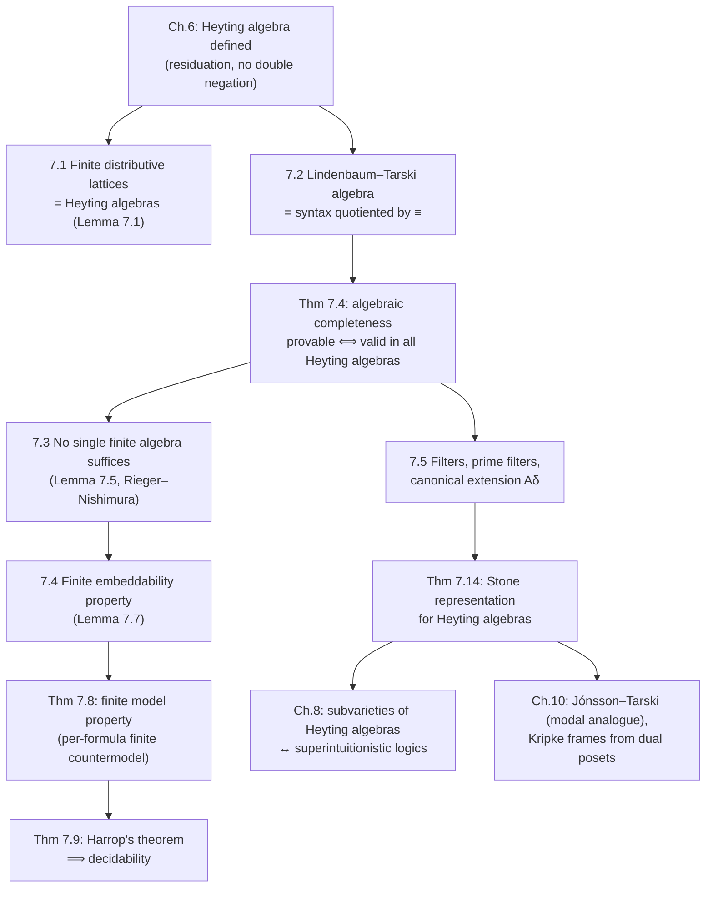

[[book-guidelines|↩ Back to guidelines]]

# Heyting Algebras and Algebraic Logic

## Why algebraize a proof system at all?

Chapters 1–5 of the book gave you intuitionistic logic as a *syntactic* object: a sequent calculus LJ, a set of inference rules, a notion of provability defined by "there exists a derivation tree." That's a perfectly good definition, but it's opaque to a certain kind of question. When you want to know whether a formula is provable, syntax gives you no shortcut except "search for a proof" — which for classical logic has a shortcut (truth tables) precisely because classical logic has a semantics with *finitely many truth values*. Two-valued Boolean algebra **is** classical logic's semantics, and checking validity in it is decidable by brute force.

Intuitionistic logic has no such two-valued semantics — that's the whole point of rejecting the law of excluded middle. So Chapter 6 built the algebraic replacement for "two values": a Heyting algebra is what you get when you keep everything about a Boolean algebra except the law of double negation ($\neg\neg x = x$). Chapter 7 is where that definition earns its keep. It answers three concrete questions that a working logician (or an engineer building a decision procedure) actually needs answered:

1. **Completeness**: is "provable in LJ" the same property as "valid in every Heyting algebra"? (Theorem 7.2/7.4 — yes.)
2. **Finiteness**: can we get away with checking validity in *one* fixed finite algebra, the way classical logic uses the two-element Boolean algebra? (Lemma 7.5 — no, provably not, but Theorem 7.8 rescues a weaker and still very useful statement.)
3. **Representation**: is every abstract Heyting algebra actually "made of" something concrete, the way every Boolean algebra is secretly a powerset algebra? (Theorem 7.14 — yes, via prime filters.)

Everything in this chapter builds toward those three answers. If you've been thinking of Heyting algebras as "just" the algebraic semantics of intuitionistic implication, this chapter is where you see the machinery — Lindenbaum-Tarski construction, local finiteness, finite embeddability, filter theory — that any nonclassical logic needs if you want to go from "here's a proof calculus" to "here's a decision procedure and a completeness proof," a machine that generalizes far beyond intuitionistic logic specifically.

## 7.1 Heyting algebras, concretely

**Definition 7.1.** An algebra $\mathbf{A} = \langle A, \vee, \wedge, \to, 0\rangle$ is a *Heyting algebra* iff:
1. $\langle A, \vee, \wedge\rangle$ is a lattice with least element $0$,
2. the **law of residuation** holds: $a \wedge b \le c \iff a \le b \to c$, for all $a,b,c \in A$.

That's it — two conditions. Every Heyting algebra automatically has a greatest element $1 = a \to a$ (for any $a$), and negation is *defined*, not primitive: $\neg a := a \to 0$. Every Boolean algebra is a Heyting algebra (residuation plus double negation gives you a Boolean algebra back — this was Chapter 6's Lemma 6.3, and Exercise 7.1 in this chapter reproves half of it: $x \le \neg\neg x$ always holds, but $\neg\neg x \le x$ only holds when $x \vee \neg x = 1$ for all $x$). Gödel chains from Chapter 6 are exactly the *totally ordered* Heyting algebras.

**What residuation actually buys you.** The clause "$a \wedge b \le c \iff a \le b \to c$" is compact to the point of opacity on first read. Read it as: *the set $\{x : x \wedge b \le c\}$ has a greatest element, and that greatest element is called $b \to c$.* In other words, $b \to c$ is the *weakest* thing you can conjoin with $b$ and still land inside $c$ — implication as "the largest safe margin." This is the algebraic mirror of the sequent-calculus fact that $\Gamma, \alpha \Rightarrow \beta$ is derivable iff $\Gamma \Rightarrow \alpha \to \beta$ is (the deduction theorem, from Chapter 5) — residuation *is* the deduction theorem, turned into an order-theoretic axiom.

**What breaks without residuation.** Not every bounded distributive lattice is a Heyting algebra — you need the *maximum* of $\{x : x \wedge b \le c\}$ to actually exist, not just an upper bound. The book gives a genuine counterexample (Remark 7.1): take $D = \{(i,m) : i \in \{0,1\}, m \ge 0\} \cup \{\omega\}$ ordered componentwise below $\omega$ sitting on top of everything. The set $M = \{x : x \wedge (1,0) \le (0,0)\}$ turns out to be exactly $\{(0,m) : m \ge 0\}$, whose only upper bound in $D$ is $\omega$ — but $\omega \notin M$ (since $\omega \wedge (1,0) = (1,0) \not\le (0,0)$), so $M$ has no maximum. This is a lattice with an *infinite ascending chain* right where you need a supremum, and it's exactly why the next fact is stated for **finite** lattices only:

**Lemma 7.1 (finite [[Lattices-and-Boolean-Algebras#Distributive lattices|distributive lattices]] are Heyting algebras).** Every finite distributive lattice $D$ can be made into a Heyting algebra by defining $b \to c := \max\{x \in D : x \wedge b \le c\}$ — and this maximum is guaranteed to exist precisely *because* $D$ is finite (you can take the join of the whole finite candidate set $U = \{x : x \wedge b \le c\}$, and distributivity is what lets you push that join back inside $U$: $w \wedge b = \bigvee_i (x_i \wedge b) \le c$). Finiteness is what rescues you from the pathology above.

A Heyting algebra validating the **prelinearity axiom** $(\alpha \to \beta) \vee (\beta \to \alpha)$ is called a **Gödel algebra**. Every Boolean algebra is a Gödel algebra, but Gödel algebras need not be totally ordered (chains) — prelinearity is strictly weaker than "is a chain."

### Grounding: Heyting algebras as a type

If you've built typecheckers or verifiers, residuation should feel familiar: it's precisely the shape of a Galois connection, the same abstraction underlying "currying is sound" in a typed setting ($A \times B \to C$ iff $A \to (B \to C)$). Here's the finite-lattice case (Lemma 7.1) as Rust, computing $\to$ by brute-force search over a finite poset — a direct executable reading of `max{x : x ∧ b ≤ c}`:

```rust
#[derive(Clone, Copy, PartialEq, Eq, Hash)]
struct Elem(usize);

struct FiniteDistributiveLattice {
    elems: Vec<Elem>,
    leq: Vec<Vec<bool>>,   // leq[i][j] == (elems[i] <= elems[j])
    meet: Vec<Vec<Elem>>,  // precomputed ∧
}

impl FiniteDistributiveLattice {
    /// b -> c := max { x : x ∧ b ≤ c }   (Lemma 7.1)
    fn implies(&self, b: Elem, c: Elem) -> Elem {
        let candidates: Vec<Elem> = self.elems.iter()
            .copied()
            .filter(|&x| self.leq[self.meet[x.0][b.0].0][c.0])
            .collect();
        // finiteness guarantees a unique maximum exists among `candidates`
        *candidates.iter()
            .find(|&&x| candidates.iter().all(|&y| self.leq[y.0][x.0]))
            .expect("Lemma 7.1: max always exists on a finite distributive lattice")
    }
}
```
The `expect` is not defensive-programming paranoia — it's a direct transcription of the theorem's guarantee. On an *infinite* poset (like Remark 7.1's counterexample), the analogous search would need to return `Option<Elem>` because the max can genuinely fail to exist.

## 7.2 The Lindenbaum-Tarski algebra: syntax builds its own semantics

This is the chapter's central engine, and it deserves to be understood as a *general technique*, not a fact specific to intuitionistic logic. The problem: prove **Theorem 7.4** — $\alpha$ is provable in intuitionistic logic iff $\alpha$ is valid in *every* Heyting algebra.

**The easy direction is a straightforward induction** (Lemma 7.3): if $\gamma_1,\dots,\gamma_m \Rightarrow \varphi$ is LJ-provable, its corresponding formula $(\gamma_1 \wedge \dots \wedge \gamma_m) \to \varphi$ is valid in *any* Heyting algebra. The key algebraic fact doing the work is that $x \to y = 1 \iff x \le y$ (an immediate consequence of residuation), so "the corresponding formula is valid" reduces to "the algebra-value of the antecedent is always $\le$ the algebra-value of the succedent" — and *that* you can prove rule-by-rule exactly like a soundness proof, because residuation is engineered to make each LJ rule's soundness a one-line inequality chase. (The book works the $(\Rightarrow\to)$ case explicitly: from $g \le a$ and $b \wedge d \le e$, chase $(a\to b) \wedge g \wedge d \le (a\to b)\wedge a \wedge d \le b \wedge d \le e$.)

**The hard direction is where the trick lives.** You need: if $\alpha$ is *not* provable, there's *some* Heyting algebra where it's *not* valid. Rather than hunting for a clever bespoke countermodel, build the algebra out of the formulas themselves.

Define $\alpha \equiv \beta$ iff both $\alpha \to \beta$ and $\beta \to \alpha$ are provable in intuitionistic logic (equivalently, both sequents $\alpha \Rightarrow \beta$ and $\beta \Rightarrow \alpha$ are LJ-provable). This is an equivalence relation (reflexivity/symmetry nearly free; transitivity uses the cut rule), and — this is the fact that makes the whole construction legal — it is a **congruence** (compatible with $\vee,\wedge,\to$) and **fully invariant** (compatible with substitution). Quotient the set of all formulas $\Phi$ by $\equiv$: the equivalence classes $\Phi/{\equiv}$, with operations defined representative-wise ($[\alpha] *_\equiv [\beta] := [\alpha * \beta]$), form a Heyting algebra $F_{\mathrm{Int}}$ — the **Lindenbaum-Tarski algebra**. Its top element $[1]$ is exactly the equivalence class of all intuitionistically provable formulas.

Now define the **canonical assignment** $g(p) := [p]$ on propositional variables. By induction, $g(\varphi) = [\varphi]$ for *every* formula $\varphi$. So if $\alpha$ is not provable, $[\alpha] \ne [1]$, i.e. $g(\alpha) \ne 1$ — $\alpha$ fails in $F_{\mathrm{Int}}$ under its own canonical assignment. Done: one algebra, built entirely from syntax, refutes every non-theorem simultaneously.

**What breaks without full invariance / congruence.** If $\equiv$ weren't a congruence, $*_\equiv$ on equivalence classes wouldn't even be *well-defined* — you'd get different answers depending which representative $\alpha \in [\alpha]$ you picked to compute $\alpha \vee \beta$. Full invariance is what lets the same construction be reused ("it is rather a routine work," the book says) for *any* logic closed under substitution — the technique is completely general; you just swap in that logic's own provable-equivalence relation.

### Grounding: quotient types as the mechanism

This is precisely a **quotient type** construction, and precisely the mechanism a proof assistant's kernel uses when it treats definitionally-equal terms as interchangeable. In Lean, `Quot` (and the derived `Quotient` over a `Setoid`) is *exactly* this pattern — you supply a relation, prove it's an equivalence (and here, additionally, a congruence for the operations you want to lift), and get a genuine new type whose elements are equivalence classes, with a `Quot.lift` principle that only accepts functions respecting the relation:

```lean
-- Sketch: the Lindenbaum–Tarski construction as a Lean quotient
def provEquiv (α β : Formula) : Prop :=
  Provable (α ⟶ β) ∧ Provable (β ⟶ α)

theorem provEquiv_equivalence : Equivalence provEquiv := ⟨refl_proof, symm_proof, trans_proof⟩

instance : Setoid Formula := ⟨provEquiv, provEquiv_equivalence⟩

def LindenbaumTarski := Quotient (inferInstance : Setoid Formula)

-- Well-definedness of ∧ on the quotient requires exactly "congruence":
-- provEquiv a a' → provEquiv b b' → provEquiv (a ∧ b) (a' ∧ b')
def LindenbaumTarski.meet : LindenbaumTarski → LindenbaumTarski → LindenbaumTarski :=
  Quotient.lift₂ (fun a b => ⟦a.and b⟧) (by
    intro a b a' b' ha hb
    exact Quotient.sound (and_congr ha hb))
```
The proof obligation Lean forces on you at `Quotient.lift₂` — that the function respects the relation on both arguments — is *exactly* Exercise 7.3's request to check congruence for $\to$. This is worth internalizing as a transferable pattern for the elaborator/verifier project: any time you're building "provable-equivalence" or "definitionally-equal" as the backbone of a semantic domain, the Lindenbaum-Tarski move — quotient the syntax by the theory's own equivalence, get a genuine algebraic (or type-theoretic) structure for free — is the general-purpose recipe, and Lean's `Quot` mechanism is its most literal formalization.

## 7.3 Locally finite algebras: why one finite algebra never suffices

Classical logic's decision procedure is truth tables: check validity in the single algebra $\mathbf{2}$. Does intuitionistic logic have an analogous single finite Heyting algebra?

**Lemma 7.5: no.** For any finite Heyting algebra $A$ with $k$ elements, the formula $\chi_k = \bigvee_{0 \le i<j\le k}(p_i \leftrightarrow p_j)$ (over $k{+}1$ distinct variables) is valid in $A$ — by pigeonhole, any assignment into a $k$-element algebra must send two of the $k{+}1$ variables to the same value, making some disjunct $= 1$. But $\chi_k$ is *not* provable intuitionistically: it fails on the $(k{+}1)$-valued Gödel chain $G_{k+1}$ under $h(p_i) = i/k$, giving value $(k-1)/k < 1$. So every finite algebra validates some non-theorem — no single finite algebra can be intuitionistic logic's truth-table.

**What breaks:** the Lindenbaum-Tarski algebra $F_{\mathrm{Int}}$ itself is the concrete witness that infinite algebras are unavoidable — it is **not locally finite**. An algebra is *locally finite* if every finitely-generated subalgebra is finite (Definition 7.3; the book shows the class of all distributive lattices, hence all Gödel chains, is locally finite via a direct combinatorial bound on how many elements a sublattice generated by $m$ elements can have — Remark 7.4). But the subalgebra of $F_{\mathrm{Int}}$ generated by a **single** equivalence class $[p]$ is the **Rieger-Nishimura lattice** — provably infinite. There are infinitely many pairwise inequivalent formulas built from one propositional variable using $\vee,\wedge,\to$: $p$, $\neg p$, $p \vee \neg p$, $\neg\neg p$, $\neg\neg p \to p$, $\neg p \vee \neg\neg p$, and on upward, each new rung strictly above the last two in a zig-zag pattern. This is a genuinely striking fact — it says that even the tiniest possible "vocabulary" (one atom) already generates unboundedly rich intuitionistic content, something classical logic (with only $4$ inequivalent unary formulas of one variable) completely lacks.

## 7.4 Rescuing finiteness: the finite embeddability property

Lemma 7.5 killed "one finite algebra for all formulas." Theorem 7.8 recovers the next best thing: "for *each* non-theorem, *some* finite algebra refutes it" — the **finite model property (FMP)**, Definition 7.2: a logic $L$ is characterized by a class $\mathcal{C}$ if provability in $L$ coincides with validity across all of $\mathcal{C}$; FMP is the special case where $\mathcal{C}$ can be taken to be finite algebras.

The proof strategy is genuinely elegant and depends on a notion pitched exactly one level below "algebra": a **partial algebra** (Definition 7.4) is a set with partial operations — $a * b$ might just be undefined for some pairs. Definition 7.5: a class $K$ has the **finite embeddability property (FEP)** when every *finite partial subalgebra* of some $A \in K$ embeds into some *finite* (total) algebra in $K$. (Local finiteness trivially implies FEP — just take the generated subalgebra — but FEP is strictly weaker and survives exactly where local finiteness failed.)

**Lemma 7.7 (Heyting algebras have FEP).** Given a finite partial Heyting algebra $B \subseteq A$, let $D$ be the sublattice of $A$ generated by $B \cup \{0,1\}$. Since distributive lattices are locally finite (Remark 7.4), $D$ is finite; by Lemma 7.1, $D$ is a Heyting algebra in its own right (with its *own* $\to_D$, computed as a max over $D$ rather than over $A$). The delicate step: showing the inclusion map $B \hookrightarrow D$ still respects $\to$ wherever $\to$ was originally defined in $B$ — this needs a genuine two-sided inequality argument ($b \to_D c \le b \to_A c$ always, but equality holds specifically when $b \to_A c \in B$), not just "restrict and hope."

**Theorem 7.8 (FMP for intuitionistic logic).** If $\alpha$ is not provable, Theorem 7.4 gives some Heyting algebra $A$ and assignment $g$ with $g(\alpha) < 1$. Take $S$ = all subformulas of $\alpha$, and $B = \{g(\beta) : \beta \in S\} \cup \{0,1\}$ — a *finite partial subalgebra* of $A$, because $B$ only records the operation-results actually needed by $\alpha$'s own subformulas. FEP embeds $B$ into a finite Heyting algebra $D$; transplant the assignment across the embedding, and by induction on subformula structure, $\alpha$'s value in $D$ matches its value in $A$ — still $< 1$. **The finite countermodel is built entirely out of $\alpha$'s own syntax tree** — this is the FMP analogue of "the Lindenbaum-Tarski algebra is built entirely out of provability," and it should feel structurally familiar: a finite model constructed from exactly the closure requirements one formula imposes, no more.

This has an immediate practical payoff: **Harrop's theorem** (Theorem 7.9) — a logic is decidable if it's finitely axiomatizable *and* has FMP. The proof is a genuinely simple dovetailing algorithm: run "enumerate provable formulas" and "enumerate finite algebras, check countermodel" in parallel; by Theorem 7.8, exactly one of them is guaranteed to eventually terminate. (The book is candid that this is a *theoretical* decidability result — "extremely inefficient and hardly usable" — not a practical decision procedure; that's exactly the gap the proof-theoretic route of Chapter 3, via [[Cut-Elimination|cut elimination]] and *bounded* proof search, closes far more usefully.)

### Grounding: partial algebras as the shape of proof-search state

The FEP proof pattern — collect only the operation values a finite piece of syntax actually needs, then complete that partial structure into a total finite one — is precisely the mental model behind building a **finite countermodel search** in a theorem prover. Sketch in Rust, where `PartialAlgebra` mirrors Definition 7.4 directly (`HashMap` entries present only where the operation is "known"), and completing it to `D` mirrors Lemma 7.7's construction:

```rust
use std::collections::HashMap;

/// Definition 7.4: a partial algebra — operations may be undefined on some inputs.
struct PartialHeyting<E: Eq + std::hash::Hash + Clone> {
    carrier: Vec<E>,
    implies: HashMap<(E, E), E>,   // -> defined only where the source Heyting algebra gave it
    meet: HashMap<(E, E), E>,
    join: HashMap<(E, E), E>,
}

/// Given the subformula-closed partial algebra witnessing g(alpha) < 1,
/// generate the finite sublattice D (Lemma 7.7) and check embeddability.
fn embed_and_check<E: Eq + std::hash::Hash + Clone>(
    partial: &PartialHeyting<E>,
    alpha_value: &E,
    top: &E,
) -> bool {
    // ... generate D as the sublattice closure of `carrier ∪ {0,1}` (Remark 7.4 bound
    // guarantees this terminates), define -> on D via Lemma 7.1's max-search, then
    // check the transplanted assignment still gives alpha_value != top in D.
    generate_finite_completion(partial).evaluate(alpha_value) != *top
}
# fn generate_finite_completion<E>(_: &PartialHeyting<E>) -> PartialHeyting<E> { unimplemented!() }
# impl<E> PartialHeyting<E> { fn evaluate(&self, _: &E) -> E { unimplemented!() } }
```
The load-bearing idea for a verifier project: a countermodel search only ever needs the *closure of the formula under its own connectives* — never the full (possibly infinite) semantic universe. That's a direct blueprint for how a from-scratch decision procedure for a Heyting-algebra-based logic (or any logic with FEP) can bound its search space.

## 7.5 Canonical extensions: what is a Heyting algebra "made of"?

Boolean algebras have a canonical concrete picture: every Boolean algebra embeds into a powerset algebra $\wp(X)$ for some set $X$ (Stone's theorem, Chapter 6). Section 7.5 builds the Heyting-algebra analogue, and [[Deducibility-Deduction-Theorems-and-Axiomatic-Extensions#The construction|the construction]] is worth following closely because it's the template Chapter 10 reuses for *modal* algebras (Jónsson-Tarski) and Kripke semantics generally.

**Step 1 — posets manufacture Heyting algebras.** Given any poset $S = \langle S, \le\rangle$, call $D \subseteq S$ **upward closed** if $a \in D, a \le b \Rightarrow b \in D$. Let $U(S)$ = all upward-closed subsets, with $\cup, \cap$ as join/meet, and implication defined pointwise:
$$D_1 \Rightarrow D_2 := \{a \in S : \forall c \ge a,\ c \in D_1 \implies c \in D_2\}.$$
This is a genuine Heyting algebra (residuation is a direct two-line check both ways). When $\le$ degenerates to equality, $U(S) = \wp(S)$ — the Boolean/powerset case is the special case where the poset has no nontrivial order. This is the deep reason Heyting algebras generalize Boolean algebras: *dropping double negation corresponds exactly to allowing genuine (non-discrete) order structure into the representing poset.*

**Step 2 — filter theory extracts the poset back out of an abstract algebra.** A **filter** (Definition 7.6) is an upward-closed, meet-closed nonempty subset — the algebraic analogue of "a consistent set of assertions I'm willing to hold simultaneously true." **Prime**: $x \vee y \in F \Rightarrow x \in F$ or $y \in F$ (disjunction property, localized to one filter). **Maximal**: no proper filter properly extends it. **Ultrafilter**: for every $x$, either $x \in F$ or $\neg x \in F$ (excluded middle, localized).

Lemma 7.10 nails down the relationships: maximal $\iff$ ultrafilter (always, in any Heyting algebra), and maximal $\Rightarrow$ prime (but *not conversely* in general — Example 7.5 exhibits a prime, non-maximal filter $F_c$ concretely). Only in **Boolean algebras** do all three notions coincide (Corollary 7.11) — because $a \vee \neg a = 1$ collapses "prime" straight into "ultrafilter." This divergence in the Heyting case is the algebraic shadow of intuitionistic logic's rejection of excluded middle: "prime" (disjunction behaves classically) and "complete" (every proposition or its negation is decided) really are different conditions once double negation is gone.

**The prime filter theorem** (Theorem 7.12, via Zorn's Lemma, stated without proof) is the linchpin: any filter avoiding a point $a$ extends to a *prime* filter still avoiding $a$. Its corollary (7.13) is the separation lemma that does all the later work: if $a \to b \notin F$, there's a prime filter $G \supseteq F$ with $a \in G$ but $b \notin G$ — i.e., prime filters can always separate an implication's antecedent from its consequent when the implication itself isn't forced.

**Step 3 — put the two directions together.** For a Heyting algebra $A$, let $D(A)$ = the poset of all prime filters ordered by $\subseteq$ (the **dual intuitionistic frame** of $A$). Form $A^\delta := U(D(A))$, the **canonical extension**. Define $\sigma(a) := \{F \in D(A) : a \in F\}$. Using Corollary 7.13 to handle the $\to$ case, $\sigma$ is a homomorphism, and prime-filter separation (again Theorem 7.12) makes it injective:

**Theorem 7.14 ([[Lattices-and-Boolean-Algebras#Stone's representation theorem|Stone's representation theorem]] for Heyting algebras).** Every Heyting algebra $A$ embeds into $A^\delta = U(D(A))$.

For Boolean algebras every prime filter is already maximal, so $D(A)$'s order collapses to equality and $A^\delta$ collapses to the ordinary powerset algebra — Chapter 6's Boolean Stone theorem is literally the special case of this one where the poset is discrete. And for a **finite** Heyting algebra, the embedding is actually a full **isomorphism** (Corollary 7.15) — finite Heyting algebras are exactly their own canonical extensions, nothing is lost. (Infinite ones can genuinely lose structure: $U(S)$ is always a *complete* lattice, but plenty of Heyting/Gödel algebras aren't complete, so $\sigma$ can fail to be surjective there.)

## Synthesis: how this chapter fits, and what to carry forward



Everything downstream of Part II leans on this chapter. Chapter 8's duality between subvarieties of $\mathbf{HA}$ and superintuitionistic logics presupposes you already know what a Heyting algebra's own internal structure (filters, congruences) looks like. Chapter 10's Jónsson-Tarski theorem for modal algebras is a near-verbatim repeat of Section 7.5's construction, with an accessibility relation bolted on. And the [[Gödel-Translation|Gödel translation]] (Chapter 13) reads intuitionistic truth as "necessarily true" precisely by picking out the *open elements* of an S4-algebra as forming a Heyting algebra — the same "Heyting algebra sitting inside a richer structure" move you just watched happen (in reverse) when $D(A)$'s prime-filter poset was extracted from $A$.

For the standing projects: the **Lindenbaum-Tarski construction is the cleanest possible worked example of "quotient syntax by its own provable-equivalence to get a genuine semantic domain"** — exactly the move a from-scratch elaborator's definitional-equality checker (or a Hoare-logic verifier's assertion algebra) will need, and Lean's `Quot`/`Quotient` is its most literal realization, not just an analogy. The **finite embeddability property proof (Theorem 7.8)** is a direct blueprint for bounded countermodel search: build only the partial algebra that a single formula's subformula-closure demands, then complete it — this is the shape a from-scratch decision procedure for any FEP logic should take, and it generalizes past intuitionistic logic to the residuated and modal algebras of Chapters 9–10. The **prime-filter separation lemma (Corollary 7.13)** — "if the implication isn't forced, some consistent completion separates antecedent from consequent" — is worth keeping in mind next to Miller pattern unification's own separation/generality reasoning: both are, at bottom, existence proofs that a "maximal consistent enough" structure can always be found to witness a negative fact.
