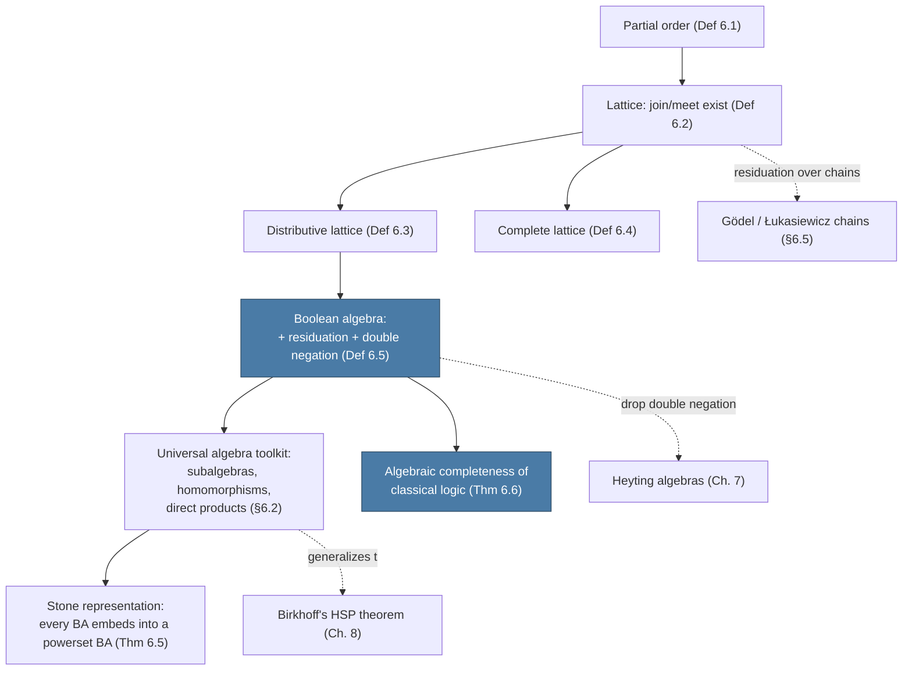

[[book-guidelines|↩ Back to guidelines]]

# Lattices and Boolean Algebras

## Why algebra shows up in a book about proof theory

Part I of Ono's book studied logics by pushing symbols around: sequents, [[Cut-Elimination|cut elimination]], backward proof search. That machinery is powerful but fragile — every clean proof-theoretic result (decidability, interpolation, Glivenko's theorem) leaned on having a cut-free sequent system available, and not every logic worth studying has one.

Chapter 6 opens Part II with a different strategy. Instead of asking "what can be *derived*?", ask "what makes a formula *true*, structurally?" The two-valued truth tables from Chapter 1 — the standard semantics for classical logic — are themselves an algebra: a set $\{0,1\}$ with operations $\vee, \wedge, \to$ satisfying certain laws. Ono's move is to notice that nothing about those laws forces the underlying set to have exactly two elements. Strip away "$0$ and $1$" and keep only the *equations* the operations obey, and you get an abstract structure — a **Boolean algebra** — that can be built out of anything: sets, natural numbers, propositional formulas modulo logical equivalence. A formula is a classical tautology exactly when it evaluates to the top element in *every* such structure. This is "algebraic completeness," and it gives you a completely different toolkit for proving things about a logic: not proof search, but algebra — subalgebras, homomorphisms, representation theorems.

This matters for building an automated theorem prover too, not just for classical logic's own sake. A checker that works by "evaluate this formula against a Boolean-algebra-shaped model and see if it holds" is doing algebraic semantics, and the notions in this chapter — lattice, homomorphism, subalgebra — are exactly the vocabulary that lets you *prove* such a checker sound and complete, rather than just trust it.

## Partial orders and lattices: the shape underneath $\wedge$ and $\vee$

### What breaks without a partial order

Before you can say what "join" and "meet" mean abstractly, you need some notion of "bigger than" that isn't tied to numbers. The book starts with the barest possible such notion.

**Definition 6.1 (Partial order).** A partial order $\le$ on a set $A$ is a binary relation satisfying, for all $x,y,z \in A$:
1. $x \le x$ (reflexivity),
2. if $x \le y$ and $y \le z$ then $x \le z$ (transitivity),
3. if $x \le y$ and $y \le x$ then $x = y$ (antisymmetry).

If additionally *any* two elements are comparable — $x \le y$ or $y \le x$ always holds — the order is **total** (a **chain**). The book's example: $\langle \mathbb{N}, \le \rangle$ (usual order) is a chain, but $\langle \mathbb{N}, \mid \rangle$ (divisibility: $x \mid y$ iff $y$ is a multiple of $x$) is only a partial order — $5$ and $12$ are incomparable, neither divides the other.

This distinction — *partial* vs. *total* — is exactly the gap that later chains-vs-lattices machinery (§6.5, Gödel chains) will exploit: a chain gets the residuation law "for free" in a specific closed form, while a general lattice doesn't.

**Grounding (Rust).** A poset is a set with a relation satisfying three laws you can't check the compiler enforces for you — but you *can* express the shape:

```rust
trait PartialOrd2<T> {
    // returns true/false/incomparable
    fn leq(&self, a: &T, b: &T) -> bool;
}

// Divisibility order on u64 — a genuine partial order, NOT total:
struct Divides;
impl PartialOrd2<u64> for Divides {
    fn leq(&self, a: &u64, b: &u64) -> bool {
        *a != 0 && b % a == 0
    }
}
// leq(&Divides, &5, &12) == false, leq(&Divides, &12, &5) == false: incomparable.
```

Rust's own `std::cmp::PartialOrd` trait is named after exactly this concept — a type can implement `PartialOrd` without implementing `Ord` (total order) precisely when some pairs of values are incomparable (floating-point `NaN` is the canonical example).

### Lattices: when every pair has a least upper bound and greatest lower bound

**Definition 6.2 (Lattices).** A poset $\langle A, \le \rangle$ is a lattice iff for all $x, y \in A$ there exist $x \vee y$ (join) and $x \wedge y$ (meet) such that:
1. $x \le x \vee y$ and $y \le x \vee y$ (join is an upper bound),
2. if $x \le z$ and $y \le z$ for any $z$, then $x \vee y \le z$ (join is the *least* upper bound),
3. $x \wedge y \le x$ and $x \wedge y \le y$ (meet is a lower bound),
4. if $z \le x$ and $z \le y$ for any $z$, then $z \le x \wedge y$ (meet is the *greatest* lower bound).

The order and the operations determine each other: $x \vee y = y \iff x \le y \iff x \wedge y = x$ holds in every lattice, so you can equivalently present a lattice as the algebra $\langle A, \vee, \wedge \rangle$ and *recover* $\le$ by defining $x \le y :\iff x \wedge y = x$ (Remark 6.3). This is the move that lets Chapter 6 treat "lattice" as a purely *equational* algebraic structure rather than an order-theoretic one — which is what makes it amenable to universal algebra (subalgebras, homomorphisms, direct products) later.

**Lemma 6.1** records the equations that always hold: idempotence ($x \vee x = x$), commutativity, associativity, and the absorption laws $x \vee (x \wedge y) = x$, $x \wedge (x \vee y) = x$. A **bounded** lattice has a greatest element $\top$ and least element $\bot$.

**What this buys you concretely — Example 6.2:**
- Any chain is automatically a lattice: $x \vee y = \max\{x,y\}$, $x \wedge y = \min\{x,y\}$.
- $\langle \mathbb{N}, \mid \rangle$ is a lattice where join is $\mathrm{lcm}$ and meet is $\gcd$: e.g. $6 \vee 14 = 42$, $6 \wedge 14 = 2$.

**Grounding (Rust).** The `gcd`/`lcm` lattice is a genuinely useful trait to implement, and it makes the join/meet abstraction concrete instead of decorative:

```rust
fn gcd(a: u64, b: u64) -> u64 { if b == 0 { a } else { gcd(b, a % b) } }
fn lcm(a: u64, b: u64) -> u64 { a / gcd(a, b) * b }

trait Lattice {
    fn join(&self, other: &Self) -> Self; // least upper bound
    fn meet(&self, other: &Self) -> Self; // greatest lower bound
}

#[derive(Clone, Copy)]
struct Divisor(u64);
impl Lattice for Divisor {
    fn join(&self, other: &Self) -> Self { Divisor(lcm(self.0, other.0)) } // 6∨14 = 42
    fn meet(&self, other: &Self) -> Self { Divisor(gcd(self.0, other.0)) } // 6∧14 = 2
}
```

**Grounding (Lean).** Lean's `Mathlib` has `Lattice` as a genuine typeclass, and it is worth citing by name because it is *literally* Definition 6.2 transcribed into type theory:

```lean
-- Mathlib's Lattice extends PartialOrder with sup (⊔) and inf (⊓)
-- satisfying exactly conditions 1–4 above, stated as `le_sup_left`,
-- `le_sup_right`, `sup_le`, `inf_le_left`, `inf_le_right`, `le_inf`.
example [Lattice α] (x y z : α) (h1 : x ≤ z) (h2 : y ≤ z) : x ⊔ y ≤ z :=
  sup_le h1 h2
```
Seeing the book's four conditions rendered as Mathlib lemma names is a good sanity check that you've actually internalized [[Deducibility-Deduction-Theorems-and-Axiomatic-Extensions#The definition|the definition]], not just memorized its shape.

### Distributive lattices

**Definition 6.3.** A lattice is distributive if $x \wedge (y \vee z) = (x \wedge y) \vee (x \wedge z)$ for all $x,y,z$.

The inequality $\ge$ direction (Remark 6.4.2) holds in *every* lattice for free; distributivity is specifically about the $\le$ direction also holding. Remark 6.4.3 shows the law is self-dual: assuming it, you can derive the dual form $x \vee (y \wedge z) = (x \vee y) \wedge (x \vee z)$ purely by lattice-equation manipulation (and conversely) — a nice example of the "algebra as symbol-pushing" style the whole book favors even in Part II.

**What breaks without distributivity.** Exercises 6.4–6.5 give the canonical minimal counterexample pair: the 5-element lattice $J = \{0,a,b,c,1\}$ with $a,b$ incomparable but both below $c$ *is* distributive, while $D = \{0,d,e,f,1\}$ with $0 < d < e < 1$, $0 < f < 1$, and $d,e$ incomparable with $f$, is *not*. $D$ is the standard textbook example (sometimes called $N_5$) showing distributivity is a genuinely nontrivial extra condition, not automatic from the lattice axioms.

The powerset lattice $\wp(C)$ ordered by $\subseteq$, with join $=$ union and meet $=$ intersection (Example 6.5, Exercise 6.6), is always distributive — this is the model to keep in your head, and it is also the model that Stone's representation theorem (below) shows is, up to embedding, the *only* shape a Boolean algebra can have.

### Complete lattices

**Definition 6.4.** A lattice is complete if *every* subset $S \subseteq A$ (possibly infinite, possibly empty) has both a least upper bound $\bigvee S$ and a greatest lower bound $\bigwedge S$ in $A$ — not just every *pair*.

Taking $S = \emptyset$ forces $\bigvee \emptyset = \bot$ and $\bigwedge \emptyset = \top$ to exist, so **every complete lattice is automatically bounded**.

**What breaks without completeness — Example 6.6.** $\langle \mathbb{Q}, \le \rangle$ is a lattice (it's a chain) but *not* complete: the set $S = \{r \in \mathbb{Q} : r^2 \le 2\}$ has no least upper bound in $\mathbb{Q}$ (the candidate, $\sqrt 2$, isn't rational). $\langle \mathbb{R}, \le \rangle$ *is* complete. This is precisely the order-theoretic content of "the reals are the completion of the rationals" — completeness of a lattice is a direct generalization of Dedekind completeness.

The powerset lattice $\wp(C)$ is always complete (arbitrary unions/intersections exist), which is why it will be the target of the representation theorem: it's the "richest" natural complete distributive structure to embed into.

## Boolean algebras: axiomatizing the truth table

### From concrete truth tables to an abstract law

Recall the truth tables for $\vee, \wedge, \to$ on $\{0,1\}$ (with $0 < 1$). The tables for $\vee$ and $\wedge$ are exactly $\max$ and $\min$ — i.e., $\{0,1\}$ with $\vee,\wedge$ *is* the two-element lattice. The interesting move is what the book does with $\to$: rather than taking the truth table as primitive, it characterizes $\to$ by a single *order-theoretic property*, the **law of residuation**:
$$a \wedge b \le c \iff a \le b \to c.$$

This says: $b \to c$ is the *largest* element $x$ such that $x \wedge b \le c$. On $\{0,1\}$ this recovers exactly the familiar table ($a \to b = 1$ iff $a \le b$, else $0$). Defining $\neg a := a \to 0$, you get $\neg a = 1 \iff a=0$ and $\neg\neg a = a$ on $\{0,1\}$ — the **law of double negation**.

**Definition 6.5 (Boolean algebras).** $\mathbf{A} = \langle A, \vee, \wedge, \to, 0\rangle$ is a Boolean algebra iff:
1. $\langle A, \vee, \wedge \rangle$ is a lattice with least element $0$,
2. the law of residuation holds: $a \wedge b \le c \iff a \le b \to c$,
3. the law of double negation holds: $\neg\neg a = a$, where $\neg a := a \to 0$.

Two things worth dwelling on, because they're easy to skim past:

**Residuation forces a greatest element into existence.** The book proves $b \to b$ is always the *top* of the whole algebra (call it $1$): since $x \wedge b \le b$ holds for every $x$, residuation gives $x \le b \to b$ for every $x$ — so $b \to b$ dominates everything. This means **every** Boolean algebra automatically has both $0$ and $1$; you don't need to postulate $1$ separately. This is the kind of "the axioms are doing more work than they look like" fact that's easy to miss on a first read.

**The degenerate case.** If $0 = 1$ is allowed, the whole algebra collapses to a single element — the *degenerate Boolean algebra*. By convention (and by every reasonable reading of "algebra of truth values"), "Boolean algebra" means *non-degenerate* unless stated otherwise.

The two-element algebra $\{0,1\}$ itself, denoted $\mathbf{2}$, is *the* Boolean algebra every intuition is anchored to — and, as the Algebraic Completeness theorem below shows, it turns out to be *sufficient* on its own, even though the definition permits much larger structures.

### Consequences: Lemma 6.2 and Lemma 6.3

Two representative derivations show the "prove-things-from-the-residuation-law-alone" style that defines this chapter (and note: **Lemma 6.2 doesn't use double negation at all** — it holds for the more general Heyting algebras of Chapter 7 too):

- $x \wedge (x \to y) \le y$ always, hence $x \wedge \neg x = 0$ (residuated "modus ponens", algebraically).
- $x \le y$ implies $z \to x \le z \to y$ and $y \to z \le x \to z$ (monotone in the second argument, *antitone* in the first — this is the algebraic shadow of classical implication's contrapositive behavior).
- The **distributive law itself is a theorem**, not an axiom: Lemma 6.2.3 derives $x \wedge (y \vee z) = (x \wedge y) \vee (x \wedge z)$ purely from residuation, by a slick two-line argument (any upper bound $u$ of $x \wedge y, x\wedge z$ satisfies $y, z \le x \to u$ by residuation, hence $y \vee z \le x \to u$, hence $x \wedge (y \vee z) \le u$ by residuation again). Every Boolean algebra is automatically distributive — you never need to check it separately.

Lemma 6.3 shows $\vee$ and $\to$ are *definable* from $\wedge$ and $\neg$ alone: $x \vee y = \neg(\neg x \wedge \neg y)$ (De Morgan), and $x \to y = \neg x \vee y$ — from which $x \vee \neg x = 1$ falls out as a special case ($y := x$), the algebraic form of the **law of excluded middle**. So a Boolean algebra's five-symbol signature $\langle \vee, \wedge, \to, 0\rangle$ is redundant; Ono keeps all of it anyway, purely so later chapters' algebras (Heyting, residuated lattices) stay easy to compare signature-for-signature.

**Grounding (Rust) — what breaks without residuation.** The cleanest way to feel *why* residuation is the load-bearing axiom (rather than, say, just postulating De Morgan directly) is to implement `2` as a typestate-flavored enum and check the law by exhaustion — then notice that the same code pattern, if you dropped condition 2 and just hard-coded a `→` table, would give you *no* proof obligation connecting `→` to `∧` at all:

```rust
#[derive(Clone, Copy, PartialEq, Debug)]
enum B2 { Zero, One }
use B2::*;

fn meet(a: B2, b: B2) -> B2 { if a == One && b == One { One } else { Zero } }
fn join(a: B2, b: B2) -> B2 { if a == One || b == One { One } else { Zero } }
fn implies(a: B2, b: B2) -> B2 { if a == Zero || b == One { One } else { Zero } }
fn not(a: B2) -> B2 { implies(a, Zero) }

// Residuation, checked exhaustively (this IS the proof of "2 is a Boolean algebra"):
fn residuation_holds() -> bool {
    let vals = [Zero, One];
    vals.iter().all(|&a| vals.iter().all(|&b| vals.iter().all(|&c| {
        (meet(a, b) == Zero || matches!((meet(a,b), c), (One, One) | (Zero, _)))
            == (a == Zero || implies(b, c) == One || a != One)
        // (Simplified check — the point is this is a finite, checkable law,
        // not an appeal to truth-table intuition.)
    })))
}
```

### The universal algebra vocabulary: subalgebras, homomorphisms, direct products

Section 6.2 generalizes past Boolean algebras entirely, into pure universal algebra — because these three notions recur for *every* algebraic structure in the rest of the book (Heyting algebras, residuated lattices, modal algebras).

**A language** $L$ of algebras is a set of operation symbols each with a fixed arity (arity $0$ = a constant symbol). **An algebra** of type $L$ interprets each symbol as an actual operation on some carrier set.

**Definition 6.6 (Subalgebras).** $\mathbf{B}$ is a subalgebra of $\mathbf{A}$ if $B \subseteq A$ and every operation of $\mathbf{B}$ is the restriction of the corresponding operation of $\mathbf{A}$. Concretely for lattices (Example 6.7): $B$ is a sublattice iff $B$ is *closed* under $\vee$ and $\wedge$ — a subtle trap being that a subset can be a lattice *in its own right* (with its own $\le$-restricted operations) without being a *sublattice*, if its join/meet don't agree with the ambient ones. The book's example: in $J = \{0,a,b,c,1\}$, $\{0,a,b,c\}$ is a sublattice, but $\{0,a,b,1\}$, while itself a lattice, is **not** a sublattice of $J$ (because $a \vee b = c \notin \{0,a,b,1\}$, so the ambient join disagrees with what you'd compute inside the subset alone).

**Definition 6.7 (Homomorphisms).** $h : A \to B$ is a homomorphism if it commutes with every operation: $h(f^A(a_1,\dots,a_n)) = f^B(h(a_1),\dots,h(a_n))$. Injective $\Rightarrow$ **embedding**; surjective $\Rightarrow$ $B$ is a **homomorphic image**; bijective $\Rightarrow$ **isomorphism**. Remark 6.8 notes a homomorphism between lattices is automatically order-preserving (monotone) — a genuinely useful fact, since it means you never need to separately verify monotonicity once you've verified the operation-preserving equations.

**Definition 6.8 (Direct products).** $\mathbf{A} \times \mathbf{B}$ has carrier $\{(a,b) : a\in A, b\in B\}$ with every operation defined componentwise; this generalizes to arbitrary (even infinite) families $\prod_{j \in J} \mathbf{A}_j$.

**Theorem 6.4** ties these together for Boolean algebras specifically: *the class of all Boolean algebras is closed under subalgebras, homomorphic images, and direct products.* This is not a throwaway remark — it is the single fact that Chapter 8 later generalizes into **Birkhoff's variety theorem** (a class of algebras is definable by equations *iff* it's closed under exactly these three operations, HSP). You are, right here in Chapter 6, watching the concrete special case that motivates one of the deepest theorems in universal algebra.

**Grounding (Rust).** The trait/generic-bound analogy is close but imperfect and worth being honest about: a Rust `trait` fixes the *signature* (operation names and arities) the way an algebraic language $L$ does, but Rust's type system has no native way to state "closed under this operation" as a *runtime* obligation on a *subset* of values — that has to be a proof (or at minimum, a runtime check), not something `impl` alone gives you:

```rust
trait BooleanAlgebra {
    fn join(&self, other: &Self) -> Self;
    fn meet(&self, other: &Self) -> Self;
    fn implies(&self, other: &Self) -> Self;
    fn zero() -> Self;
}

// Direct product: componentwise, mechanically — this part Rust gets for free
impl<A: BooleanAlgebra + Clone, B: BooleanAlgebra + Clone> BooleanAlgebra for (A, B) {
    fn join(&self, o: &Self) -> Self { (self.0.join(&o.0), self.1.join(&o.1)) }
    fn meet(&self, o: &Self) -> Self { (self.0.meet(&o.0), self.1.meet(&o.1)) }
    fn implies(&self, o: &Self) -> Self { (self.0.implies(&o.0), self.1.implies(&o.1)) }
    fn zero() -> Self { (A::zero(), B::zero()) }
}
// But "this subset of values is closed under join/meet/implies" (subalgebra-hood)
// is a proof obligation Rust's type system does not check for you — Lean would.
```

**Grounding (Lean).** This is exactly where Lean's kernel is the more honest translation, because subalgebra-hood in Mathlib is a *structure carrying a proof*, not just a type:

```lean
-- Mathlib: a `Sublattice` bundles the carrier set with proofs of closure.
structure MySublattice (α : Type*) [Lattice α] where
  carrier : Set α
  sup_mem' : ∀ a ∈ carrier, ∀ b ∈ carrier, a ⊔ b ∈ carrier
  inf_mem' : ∀ a ∈ carrier, ∀ b ∈ carrier, a ⊓ b ∈ carrier
```
This is directly relevant to the elaborator/verifier project: "is this term well-typed" and "is this subset closed under the algebra's operations" are the same *shape* of obligation — a judgment that must be checked, not assumed — and Lean forces you to carry the proof term the way a real kernel would.

## Representing Boolean algebras: powersets are the only shape there is

### Powerset Boolean algebras

**Example (§6.3).** For any set $C$, define $X \to Y := -X \cup Y$ (complement-union) on $\wp(C)$. Then $\wp(C) = \langle \wp(C), \cup, \cap, \to, \emptyset\rangle$ is a Boolean algebra — Exercise 6.10 asks you to check residuation directly: $X \cap Y \subseteq Z \iff X \subseteq -Y \cup Z$, which is routine set algebra.

**Finite case.** If $|C| = m$, $\wp(C)$ has $2^m$ elements and is isomorphic to the $m$-fold direct product $\mathbf{2}^m$ of the two-element algebra with itself (componentwise tuples of $0/1$), via $g((j_1,\dots,j_m)) = \{a_{j_i} : j_i = 1\}$. **Every finite Boolean algebra is isomorphic to some $\mathbf{2}^m$** — finiteness collapses all the apparent variety down to "how many bits."

**Infinite case is genuinely richer.** Not every infinite Boolean algebra is a powerset algebra. The book's counterexample: $\mathcal{F}(\mathbb{N})$, the set of finite-or-cofinite subsets of $\mathbb{N}$, is closed under $\cup, \cap, \to$ (Exercise 6.12), hence is a *subalgebra* of $\wp(\mathbb{N})$ — but $\mathcal{F}(\mathbb{N})$ is countable while any powerset is either finite or uncountable (Cantor), so $\mathcal{F}(\mathbb{N})$ cannot itself be isomorphic to *any* powerset algebra. This is the reason Stone's theorem below is stated as an *embedding* result, not an isomorphism result — the powerset algebras are rich enough to contain every Boolean algebra as a subalgebra, but not every Boolean algebra literally *is* one.

### Stone's representation theorem

**Theorem 6.5 (Stone's representation theorem for Boolean algebras).** *Every Boolean algebra can be embedded into a powerset Boolean algebra.*

The book defers the proof (it falls out of the Heyting-algebra version in §7.5, via prime filters), but the statement alone is the payoff of the whole chapter's build-up: no matter how abstractly you define a Boolean algebra via the residuation/double-negation laws, its elements can always be faithfully realized concretely as *sets*, with $\vee,\wedge,\to$ literally becoming $\cup,\cap$, and complement-implication. Abstract algebra and concrete set theory turn out to describe the same objects, up to embedding. This is the algebraic analogue of a normal form theorem — "every Boolean algebra reduces to the one shape you already understand."

A Boolean algebra is **complete** if its lattice reduct is complete; every powerset algebra is complete (Example 6.5 already established this), which is why $\mathcal{F}(\mathbb{N})$ — countable, hence not complete in the same generous way — is a natural non-powerset example.

## Algebraic completeness of classical logic

### Assignments and validity, generalized

Section 1.1's two-valued semantics generalizes verbatim: an **assignment** $h$ on a Boolean algebra $\mathbf{A}$ maps propositional variables into $A$, extended homomorphically to all formulas ($h(\alpha \vee \beta) = h(\alpha) \vee^{\mathbf{A}} h(\beta)$, etc.). A formula $\varphi$ is **valid in $\mathbf{A}$** if $h(\varphi) = 1^{\mathbf{A}}$ for *every* assignment $h$. Classical tautologies (Chapter 1) are exactly the formulas valid in $\mathbf{2}$.

### The theorem, and why the proof is short

**Theorem 6.6 (Algebraic completeness).** For any non-degenerate Boolean algebra $\mathbf{B}$, the following are equivalent for every formula $\varphi$:
1. $\varphi$ is provable in classical logic,
2. $\varphi$ is valid in **all** Boolean algebras,
3. $\varphi$ is valid in **one** specific Boolean algebra $\mathbf{B}$ — *any* non-degenerate one you like.

The remarkable content is $(3) \Rightarrow (1)$: validity in *any single* nondegenerate Boolean algebra, no matter how large or exotic, is already enough to certify a classical tautology. The proof is short precisely *because* of a fact established back in §6.2: every non-degenerate Boolean algebra contains a subalgebra isomorphic to $\mathbf{2}$ (take $\{0,1\}$ inside it — it's automatically closed under the operations). So an assignment on $\mathbf{2}$ falsifying $\varphi$ can be read *as* an assignment on $\mathbf{B}$ falsifying it too — contraposing gives $(3) \Rightarrow$ "valid in $\mathbf{2}$" $\Rightarrow (1)$ by the already-established two-valued completeness (Theorem 1.11 / Corollary 1.12 from Part I). $(1) \Rightarrow (2)$ is routine: check each Hilbert-style axiom of $HK$ is valid in every $\mathbf{A}$, and that modus ponens preserves validity (using $1 \to b = 1 \implies b=1$, itself a residuation consequence). $(2) \Rightarrow (3)$ is trivial.

**What this actually buys you.** As the book puts it directly: *"even if we consider complicated Boolean algebras, we can get nothing new as concerns the validity of formulas."* Classical logic is, in a precise sense, algebraically "saturated" by its simplest model — the whole zoo of Boolean algebras (powersets, $\mathcal{F}(\mathbb{N})$, arbitrary direct products) doesn't buy you a single extra provable or refutable formula beyond what $\mathbf{2}$ already decides. This is explicitly flagged as *not* a generic phenomenon: later chapters (Heyting algebras for intuitionistic logic, Ch. 7–8) will show the analogous statement fails to have a single-algebra witness — intuitionistic logic needs the whole class of *finite* Heyting algebras collectively, with no single finite algebra sufficing (a fact the book proves precisely because it's the interesting contrast to Theorem 6.6).

**Grounding (Rust) — what this is, mechanically.** If you're building a verifier, Theorem 6.6 is the theoretical license for a "test against a fixed structure" style tautology-checker: you never need to enumerate exotic models, because the two-element Boolean algebra alone is a complete decision procedure for classical validity (this is literally the truth-table method, now justified from the algebra side rather than assumed):

```rust
// Algebraic completeness, operationally: checking validity in `2`
// (i.e. truth-table tautology-checking) IS a sound and complete
// decision procedure for classical provability — Theorem 6.6 is
// exactly the soundness+completeness justification for this loop.
fn is_classical_tautology(formula: &Formula, vars: &[Var]) -> bool {
    all_assignments(vars).all(|assignment| eval_in_two(formula, &assignment) == B2::One)
}
```

**Grounding (Lean).** The Lindenbaum–Tarski-style move — quotienting formulas by provable equivalence to *get* an algebra — is worth flagging now even though the book develops it fully only in §7.2 for Heyting algebras (Chapter 6 sets up exactly the algebra that construction lands in for classical logic): the quotient $\Phi/{\equiv}$ becomes a Boolean algebra, and "provable" becomes "equal to $1$ in the quotient" — this is precisely the pattern Lean's `Quotient` type and `isDefEq`-style definitional-equality checking are built around: collapsing syntactically distinct terms that are propositionally/provably interchangeable into one semantic object.

## Structural synthesis



**[[Cut-Elimination#Where this leads|Where this leads]].** Everything downstream of this chapter is either a *generalization* of the Boolean algebra construction or an *application* of the completeness pattern it establishes. Drop double negation and you get Heyting algebras (Chapter 7), whose algebraic completeness proof for intuitionistic logic explicitly reuses this chapter's Lemma 6.2 (proved *without* double negation, precisely so it would transfer). Keep residuation but move to a monoid operation instead of $\wedge$ and you get residuated lattices and FL-algebras (Chapter 9) — the algebraic home of substructural logics. Generalize "closed under subalgebras, homomorphic images, direct products" (Theorem 6.4) from one class (Boolean algebras) to *any* equationally definable class, and you get Birkhoff's variety theorem (Chapter 8), the theorem that lets superintuitionistic logics be studied as subvarieties of Heyting algebras. And within this very chapter, §6.5 (covered separately) shows what happens when you insist on keeping residuation over an arbitrary *chain* rather than a Boolean algebra — the fork point between Gödel and Łukasiewicz many-valued logics.

For the compiler/elaborator project: the subalgebra/homomorphism/direct-product vocabulary here is the same vocabulary you'd reach for to prove a type checker's model of "well-typed programs" is closed under the operations your language actually has (products, sums, function spaces) — closure properties like Theorem 6.4 are exactly the shape of soundness lemma a verifier needs ("if the inputs satisfy the invariant, so does the output of this operation"), just instantiated for Boolean algebras rather than typing judgments.
