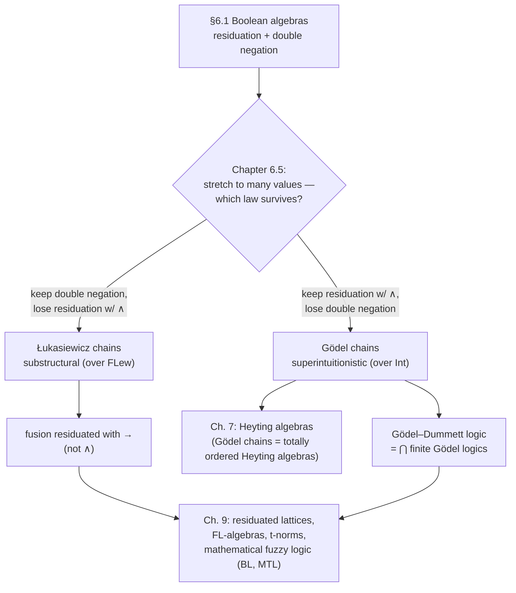

[[book-guidelines|↩ Back to guidelines]]

# Many-Valued Chains

## What breaks when you just add more truth values

Chapter 6 spends its first four sections building one very solid fact: classical logic's truth values `{0, 1}` are not just a two-element set with `∨`, `∧`, `¬` bolted on — they're a **Boolean algebra**, and a Boolean algebra is completely pinned down by two laws:

1. **The law of residuation**: $a \wedge b \le c \iff a \le b \to c$.
2. **The law of double negation**: $\neg\neg a = a$.

The residuation law is the interesting one, and it's easy to miss how strong it is. It says implication is *defined* by conjunction: $b \to c$ is required to be the single greatest element $x$ such that $x \wedge b \le c$. Once you fix $\vee, \wedge$ on a set, $\to$ isn't a free choice — it's forced, if it's going to satisfy this law at all. On $\{0,1\}$ this reproduces exactly the classical truth table you already know: $a \to b$ is $1$ unless $a=1, b=0$.

So here's the natural next question the book asks in §6.5: what happens if you keep $\vee$ and $\wedge$ as $\max$ and $\min$, but let the truth-value set grow — from two values to three, to $n$, to a continuum — while *still* trying to satisfy the residuation law? Do you get a well-defined implication out of that alone, the way you did for $\{0,1\}$?

The answer turns out to be yes, uniquely — but only if you're willing to give up double negation. And if instead you insist on keeping double negation (so that $\neg\neg a = a$ still holds at every truth value, not just at the endpoints), residuation with $\wedge$ breaks, and you need a *different* operation to be residuated with $\to$. These are the two genuinely different ways of stretching two-valued semantics into a many-valued one that Ono develops in this section: **Gödel chains** and **Łukasiewicz chains**. They are not two arbitrary examples — they are the two ways, full stop, once you fix that truth values form a chain (a totally ordered set).

## Setting the stage: chains as truth-value sets

A **chain** is just a totally ordered set — for any two elements $a, b$, either $a \le b$ or $b \le a$. Restricting to chains (rather than general lattices, which come in Chapter 7 via Heyting algebras) is what makes $\vee$ and $\wedge$ trivial: on a chain, join and meet *are* $\max$ and $\min$, no computation needed. Ono takes $A$ to be a chain with least element $0$ and greatest element $1$ — think of $\{0, \frac12, 1\}$ for a first three-valued example, where $\frac12$ reads as "halfway true."

The only genuinely open question is what $\to$ should be. That's the whole content of this section.

## Branch 1: keep residuation, get Gödel implication

Suppose you insist $\to$ satisfies the residuation law: $d \wedge a \le b \iff d \le a \to b$ for every $d \in A$. Ono's **Lemma 6.7** derives the *only* operation that can possibly work:

$$a \to b = \begin{cases} 1 & \text{if } a \le b \\ b & \text{otherwise} \end{cases}$$

The derivation is short and worth internalizing because it's a template you'll see again for residuated structures generally (Chapter 9): if $a \le b$, then $\min\{d,a\} \le a \le b$ holds for *every* $d$, so $a \to b$ — the greatest thing satisfying the inequality vacuously — must be the top element $1$. If $a > b$, then $\min\{d, a\} \le b$ holds exactly when $d \le b$ (since once $d > b$, $\min\{d,a\}$ is at least $\min\{b^+, a\} > b$ — pushing past $b$). So the greatest $d$ making it work is $b$ itself, and $a \to b = b$.

This is **Gödel implication**, and a chain equipped with it — $\mathbf{A} = \langle A, \vee, \wedge, \to, 0\rangle$ — is a **Gödel chain**. The finite case is denoted $\mathbf{G}_{n+1}$, standardly presented on $\{0, \frac1n, \frac2n, \dots, \frac{n-1}{n}, 1\}$; all $(n+1)$-valued Gödel chains are isomorphic to each other (there's essentially one $n+1$-valued Gödel logic, not a family). $\mathbf{G}_2 = \mathbf{2}$, the two-valued Boolean algebra — Gödel implication *is* classical implication once you're down to two values.

**What breaks without keeping residuation as the design constraint:** if you'd instead tried to just "interpolate" implication smoothly across $[0,1]$ by some other formula, you'd get *some* three-valued semantics, but you'd lose the property that made $\to$ special in the Boolean case — that $b \to c$ is *the* greatest solution to $x \wedge b \le c$. Gödel implication is the unique way to keep that adjunction-like property alive as you add truth values, which is exactly why it's not an ad hoc choice.

Note immediately: Gödel implication does **not** satisfy double negation. Exercise 6.13 in the text asks you to check $\neg\neg p \to p$ fails in $\mathbf{G}_3$ — take $p = \frac12$: $\neg\frac12 = \frac12 \to 0 = 0$ (since $\frac12 > 0$), so $\neg\neg\frac12 = \neg 0 = 0 \to 0 = 1$, but $\frac12 \to \frac12 = 1$... actually check directly: $\neg\neg\frac12 = 1 \ne \frac12$. Gödel negation collapses everything except $0$ to $0$, then $0$ back to $1$ — it's a "crash to classical" operation, not an involution.

### Inclusion relations, and where classical logic sits

The book proves a genuinely pretty structural fact (**Lemma 6.8**, specialized in **Theorem 6.9**): if $\mathbf{B}$ is a subalgebra of $\mathbf{A}$, then $L(\mathbf{A}) \subseteq L(\mathbf{B})$ — anything valid in the bigger algebra stays valid in the smaller one (an assignment into $\mathbf{B}$ is just a special case of an assignment into $\mathbf{A}$). Since $\mathbf{G}_m$ embeds as a subalgebra of $\mathbf{G}_{m+1}$ (drop one middle value; any subset of $\mathbf{G}_{m+1}$ containing $0,1$ is closed under $\to$), you get

$$L(\mathbf{G}_{m+1}) \subsetneq L(\mathbf{G}_m)$$

*Strictly*, not just $\subseteq$ — more truth values means *fewer* valid formulas, and the containment is proper. The proof that it's proper uses a beautifully engineered formula family:

$$\pi_1 = p_1, \qquad \pi_{k+1} = p_{k+1} \vee (p_{k+1} \to \pi_k)$$

**Lemma 6.10** pins down exactly when $\pi_n$ fails: it's invalid in $\mathbf{G}_m$ iff $\mathbf{G}_m$ contains a chain of $n$ elements below $1$ — i.e., iff $m > n$. So $\pi_m$ is valid in $\mathbf{G}_m$ but not in $\mathbf{G}_{m+1}$, which is exactly the witness that separates the two logics. ($\pi_2$, concretely, is just the law of excluded middle.)

Taking the intersection of *all* finite Gödel logics gives the **Gödel–Dummett logic**, $\mathrm{GD} = \bigcap_k L(\mathbf{G}_k)$ — and Theorem 6.9's third part shows this intersection equals $L(\mathbf{A})$ for *every* infinite Gödel chain $\mathbf{A}$, regardless of which one. So there is exactly one infinite-valued Gödel logic, obtained axiomatically from intuitionistic logic's Hilbert system $\mathrm{HJ}$ by adding one scheme: **prelinearity**, $(\alpha \to \beta) \vee (\beta \to \alpha)$ — the algebraic reflection of "the chain is totally ordered."

## Branch 2: keep double negation, get Łukasiewicz implication

Now the other fork. Łukasiewicz (1920) built his many-valued semantics wanting to keep $\neg\neg a = a$ as an unconditional law — his third value, unlike Gödel's, was meant as *indeterminate*, not "partially true," and he wanted negation to behave like a genuine involution at every value, not just flip between $0$ and $1$.

On the finite chain $L_{n+1} = \{0, \frac1n, \dots, 1\}$:

$$a \to b = \min\{1,\ 1 - a + b\} = \begin{cases} 1 & a \le b \\ 1-a+b & \text{otherwise}\end{cases}$$

and the standard (infinite) Łukasiewicz chain $\text{Ł}$ replaces this discrete set with the full unit interval $[0,1]$, same formula. Negation is $\neg a = a \to 0 = 1 - a$, so $\neg\neg a = 1-(1-a) = a$ — double negation holds *by construction*, unconditionally.

The price: residuation with $\wedge$ is now **false**. Example 6.10 exhibits the failure concretely using classical logic's own contraction axiom $(p \to (p \to q)) \to (p \to q)$ — provable in classical logic, hence you'd hope it survives in any reasonable generalization — but plugging in $a = \frac12, b=0$ into $\text{Ł}_3$ gives value $\frac12 \ne 1$. Contraction, one of the structural rules from Chapter 4/5, simply fails semantically here. This is the same phenomenon the book flagged back in §5.5: Łukasiewicz logics are *substructural* logics over FLew (full Lambek calculus with exchange and weakening, but not contraction) — this section is where you finally see the algebraic reason contraction has to go.

### Fusion rescues residuation — for a different operation

Here's the payoff move. Define **fusion**, $a \cdot b = \max\{0,\ a+b-1\}$ — commutative, and (Exercise 6.18) associative. **Lemma 6.11** shows fusion is exactly what $\to$ *is* residuated with on $\text{Ł}$:

$$a \cdot b \le c \iff a \le b \to c$$

So nothing was actually lost — residuation as a *phenomenon* survives, it just migrated off of $\wedge$ and onto a new connective. This is the moment the book earns the general definition it gives at the end of the section: an algebraic structure is **residuated** when *some* operation satisfies the law of residuation with implication — not necessarily conjunction. Fusion versus $\wedge$-conjunction is the same additive/multiplicative split you'd have met in Chapter 4 (fusion is "spend a resource," $\wedge$ is "have both resources available") — here it shows up as an algebraic fact rather than a proof-theoretic intuition. (Exercise 6.18 also gives two identities worth remembering: $x \cdot y = \neg(x \to \neg y)$, i.e. fusion is De Morgan-dual to implication, and $x \wedge y = x \cdot (x \to y)$ — meet is *recoverable* from fusion and implication, just not residuated with implication itself.)

## Gödel vs. Łukasiewicz, side by side

| | Gödel chains | Łukasiewicz chains |
|---|---|---|
| $a \to b$ (finite/std.) | $1$ if $a\le b$, else $b$ | $\min\{1, 1-a+b\}$ |
| Residuated with | $\wedge$ (meet) | fusion $a\cdot b = \max\{0,a+b-1\}$, **not** $\wedge$ |
| Double negation ($\neg\neg a = a$) | fails (e.g. $\mathbf{G}_3$) | holds, unconditionally |
| Contraction axiom | valid | fails (Example 6.10) |
| Structural home | superintuitionistic (over Int) | substructural, over FLew |
| 2-valued case | $= \mathbf{2}$, classical logic | $= \mathbf{2}$, classical logic |

Both collapse to the *same* two-valued Boolean algebra at $n=1$ — this is the reassurance that both are genuine generalizations of classical logic, not departures from it. They diverge as soon as you add a third value, and the book proves at the very end of §6.5 that they diverge *maximally*: the infinite-valued Łukasiewicz logic and Gödel–Dummett logic are mutually incomparable (neither's theorems are a subset of the other's) — double negation separates them one way, contraction the other.

## Inclusion among Łukasiewicz logics: divisibility, not just size

The Gödel case had a clean linear inclusion chain, $L(\mathbf{G}_{m+1}) \subsetneq L(\mathbf{G}_m)$, indexed simply by $m$. Łukasiewicz logics are more interesting because $\text{Ł}_{m+1}$ is a subalgebra of $\text{Ł}_{n+1}$ **iff $m$ divides $n$** — not iff $m \le n$. Example 6.11 makes this concrete: $L_4 = \{0,\frac13,\frac23,1\} \subseteq L_7 = \{0,\frac16,\dots,1\}$ *is* closed under $\to$ (because $3 \mid 6$), while the naively-plausible subset $\{0,\frac16,\frac13,\frac23,1\}$ is *not* closed under $\to$ (that gap between $\frac16$ and $\frac13$ produces a value, $\frac13\to\frac16 = \frac56$, that isn't in the set). **Theorem 6.13** (Lindenbaum) makes this an iff at the level of logics: $L(\text{Ł}_{n+1}) \subseteq L(\text{Ł}_{m+1}) \iff m \mid n$.

This divisibility structure has a clean consequence the book states as a near-immediate corollary: $L(\text{Ł}_{p+1})$ is **maximal** among finite-valued Łukasiewicz logics (nothing strictly between it and classical logic) exactly when $p$ is **prime** — a divisor-free number has nothing smaller to be "contained via." So $L(\text{Ł}_3), L(\text{Ł}_4), L(\text{Ł}_6), L(\text{Ł}_8), \ldots$ (indices one more than a prime) sit immediately under classical logic, pairwise incomparable, and there are infinitely many of them. It's a genuinely number-theoretic fact showing up as a fact about provability.

## Grounding: encoding both chains as code

**Rust** — the natural fit here is a `Chain` trait with two concrete implementations, because the whole point of the section is "same interface (`join`, `meet`, `implies`), two different laws satisfied":

```rust
trait Chain {
    /// truth values represented as rationals in [0,1], n = denominator
    fn implies(a: u32, b: u32, n: u32) -> u32; // returns k meaning k/n
}

struct Godel;
impl Chain for Godel {
    fn implies(a: u32, b: u32, _n: u32) -> u32 {
        // 1 (represented as n/n) if a <= b, else b
        if a <= b { u32::MAX } else { b } // sentinel for "top"; see note below
    }
}

struct Lukasiewicz;
impl Chain for Lukasiewicz {
    fn implies(a: u32, b: u32, n: u32) -> u32 {
        // min(n, n - a + b)   -- clamps to top, matches min{1, 1-a+b} scaled by n
        n.min(n - a + b)
    }
}
```

(The `Godel::implies` sentinel is a wart worth noticing on purpose: Gödel implication genuinely needs a real "top" value rather than a computed one — it's a case split, not a formula, which is the code-level shadow of the case split in Lemma 6.7's own statement. Łukasiewicz implication, by contrast, is a single arithmetic expression — that's the code-level shadow of it being residuated with an *additive* operation.) A small validity-checker — enumerate all assignments of propositional variables over `0..=n`, evaluate a formula tree using `implies`, check it always lands on `n` (top) — is a direct, buildable exercise from this section alone, and it's a nice sanity check to *run*: confirm $\pi_2$ fails in $\mathbf{G}_2$'s... no, confirm $\pi_m$ is valid in $\mathbf{G}_m$ but not $\mathbf{G}_{m+1}$, and confirm the contraction axiom is valid in every $\mathbf{G}_n$ but fails in $\text{Ł}_3$ (Example 6.10) — both are two or three lines of brute-force enumeration once `implies` exists.

**Lean** — the payoff of Lean here isn't building a verifier (this topic is genuinely more background than load-bearing for the unification/elaboration work), but it's a clean place to state the residuation law as an actual proposition and let `decide` or a short proof confirm it, which is a faithful mirror of what "the law of residuation holds" *means* as a mathematical claim rather than folklore:

```lean
-- residuation as a Prop over a finite chain, checked by decision procedure
def godel_impl (n a b : Fin (n+1)) : Fin (n+1) :=
  if a ≤ b then ⟨n, Nat.lt_succ_self n⟩ else b

example : ∀ d a b : Fin 4, (min d a ≤ b) ↔ (d ≤ godel_impl 3 a b) := by decide
```

This is the same shape of fact the elaborator work eventually needs — "does this candidate operation satisfy the defining law, checked exhaustively over a finite structure" — even though the *specific* law here (residuation, an adjunction between meet and implication) isn't the unification law. Worth noticing the family resemblance and not more: it's the same Galois-connection idea (`b → c` is the *greatest* solution to `x ∧ b ≤ c`) that recurs whenever "define the biggest/most general thing satisfying a constraint" — which is also the shape of most-general-unifier reasoning — but the book itself doesn't make that connection, so treat it as a structural echo, not a source claim.

**Python** — for a five-line illustrative sketch rather than anything load-bearing, checking Example 6.10's specific numeric claim is genuinely faster to eyeball in Python than to set up in Rust or Lean:

```python
def imp_luk(a, b): return min(1, 1 - a + b)
a, b = 0.5, 0
val = imp_luk(a, imp_luk(a, b))
print(imp_luk(val, imp_luk(a, b)))  # contraction axiom instance -> 0.5, not 1
```

## Where this leads



Two threads from this section get picked up explicitly later in the book. First, Gödel chains are quietly announced in Chapter 7 (§7.1) to be nothing but **totally ordered Heyting algebras** — so everything proved here about $\mathbf{G}_n$ is a special case of the general theory of residuation-without-double-negation that Chapter 7 develops for arbitrary lattices, not just chains. Second, the "residuated with something other than $\wedge$" move that fusion demonstrated here is exactly [[Deducibility-Deduction-Theorems-and-Axiomatic-Extensions#The definition|the definition]] Chapter 9 generalizes: residuated lattices and FL-algebras are built by taking *any* monoid operation and asking what's residuated with it, and t-norms over $[0,1]$ (left-continuity, specifically) turn out to be precisely the condition for "does this generalized fusion have a residual at all" — the same existence question Lemma 6.7 answered concretely for Gödel chains and Lemma 6.11 answered concretely for Łukasiewicz's fusion.

For the standing learning-goals project: this section is closer to background than to a direct prerequisite for the Rust verifier or the Lean-style elaborator — it's not building judgment forms, substitution, or unification. The one thread worth keeping in view is structural, not mechanical: the residuation law itself — "$b \to c$ is *the greatest* $x$ with $x \wedge b \le c$" — is a Galois-connection/adjunction pattern, the same shape of "compute the most general thing satisfying a constraint" that shows up later, in a different guise, wherever a most-general solution (a most general unifier, a principal type) is being characterized rather than merely produced.
