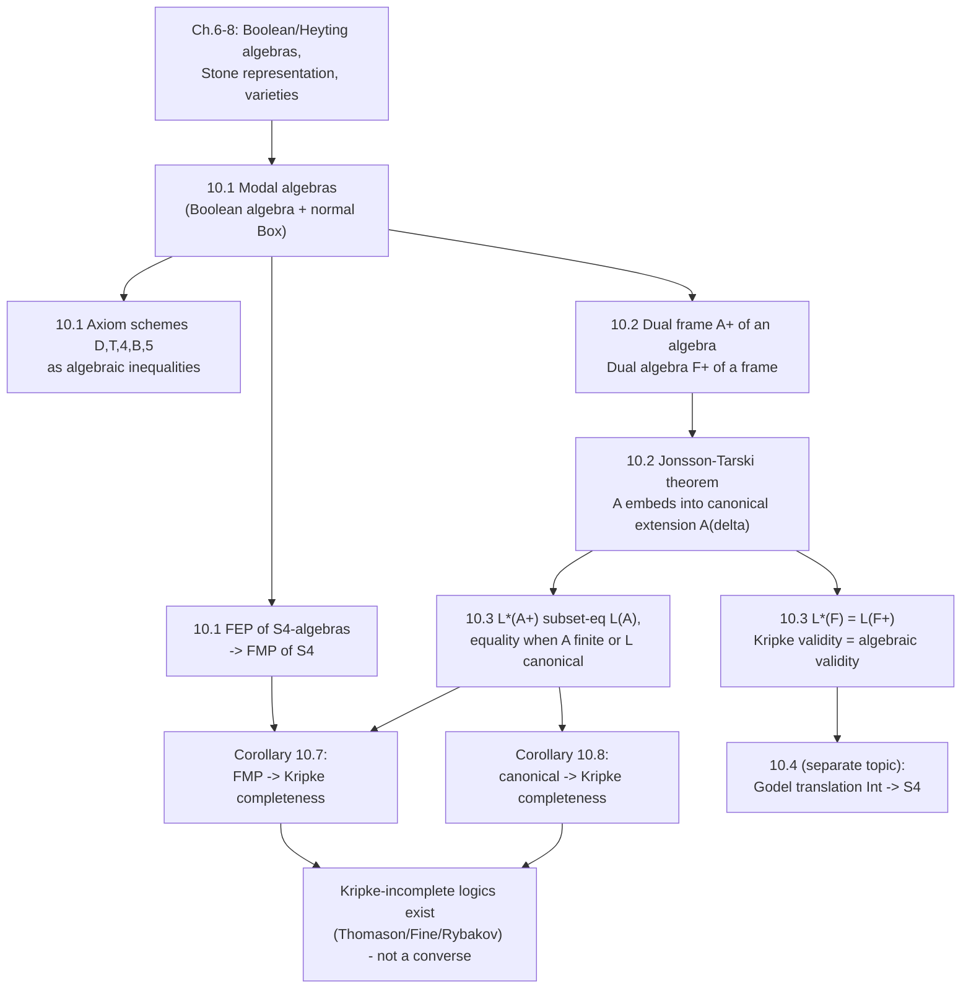

[[book-guidelines|↩ Back to guidelines]]

## Why bolt an operator onto a Boolean algebra?

By this point in the book, you already know two representation stories. Stone's theorem says: every Boolean algebra is (isomorphically) a powerset algebra of *something* — its ultrafilters. The Heyting analogue says: every Heyting algebra is representable via prime filters over a poset. Both stories are about recovering a concrete, point-based semantics (subsets of a set of "worlds") from a purely equational, algebraic one.

Modal logic has exactly this same tension, doubled. On one side you have **Kripke semantics**: a set of possible worlds $W$, an accessibility relation $R$, and truth conditions like "$\Box\alpha$ is true at $w$ iff $\alpha$ is true at every world $v$ reachable from $w$." This is intuitive, and it's what most people learn modal logic through. On the other side you have **algebraic semantics**: take a Boolean algebra and equip it with an extra unary operation $\Box$ that behaves the way "necessarily" ought to behave, and ask whether a formula evaluates to $1$ (top) under every assignment.

What breaks if you only had one of these? If you only have Kripke frames, you lose the uniform algebraic machinery — varieties, homomorphisms, subalgebras, the whole apparatus that made Stone's and Birkhoff's theorems possible for classical and intuitionistic logic — so you can't reuse those general theorems for modal logics without redoing the work relationally. If you only have modal algebras, you lose the concrete, "point-and-relation" picture that makes completeness proofs and countermodels easy to *think about* — an algebra like $\wp(W)$ with an interior-style operator is correct but faceless until you see the frame $\langle W, R\rangle$ sitting underneath it.

Chapter 10's job is to build the dictionary between the two, and the star result — the **Jónsson-Tarski theorem** — is literally "Stone's theorem, but for modal algebras": every modal algebra embeds into the dual algebra of *some* Kripke frame, constructed canonically from the algebra's own maximal filters. Once you have that dictionary, a completeness theorem proved on one side (algebraic or relational) automatically tells you something about the other.

## §10.1 — Modal algebras: Boolean algebras with one more axiom

### The definition, and what each clause buys you

A **modal algebra** (Def. 10.1) is $A = \langle A, \vee, \wedge, \to, \Box, 0\rangle$ where:

1. $\langle A, \vee, \wedge, \to, 0\rangle$ is a Boolean algebra (so you already have $\neg, 1$ derived as usual),
2. $\Box$ is a unary operator satisfying
   - $\Box 1 = 1$,
   - $\Box(x \wedge y) = \Box x \wedge \Box y$ for all $x, y \in A$.

These two clauses are not arbitrary — they are the algebraic mirror image of exactly the two things that make a modal logic **normal**: necessitation (if $\alpha$ is provable, so is $\Box\alpha$) corresponds to $\Box 1 = 1$, and the axiom scheme K, $\Box(\alpha \to \beta) \to (\Box\alpha \to \Box\beta)$, corresponds to $\Box(x \wedge y) = \Box x \wedge \Box y$. **What breaks without clause 2:** without it, $\Box$ could ignore the meet structure entirely — e.g. send everything to $1$ except some arbitrary non-monotone junk — and you'd have no guarantee that $\Box$ interacts with conjunction the way "necessarily $(P \wedge Q)$ iff necessarily $P$ and necessarily $Q$" demands. A cheap but instructive consequence (Exercise 10.1) is that $\Box$ is automatically **monotone**: $x \le y \Rightarrow \Box x \le \Box y$. The book also notes clause 2 can be replaced by the weaker inequality $\Box(x \to y) \le \Box x \to \Box y$ — equality falls out once monotonicity is available.

Because the whole definition is a finite set of equations (Boolean algebra equations, plus $\Box 1 = 1$ and $\Box(x\wedge y) = \Box x \wedge \Box y$), the class of modal algebras is an **equational class** — this is the algebraic reason modal algebras will later support the same variety-theoretic machinery (Birkhoff, subdirect representation) used for Heyting algebras in Chapter 8.

The book also records the **diamond** as a derived operator: $\Diamond z := \neg\Box\neg z$, and rewrites clause 2 in its dual form $\Diamond(x \vee y) = \Diamond x \vee \Diamond y$.

**Grounding.** In Rust, think of a modal algebra as a `trait` extending a `BooleanAlgebra` trait with one extra required method:

```rust
trait BooleanAlgebra {
    fn join(&self, a: Elem, b: Elem) -> Elem;
    fn meet(&self, a: Elem, b: Elem) -> Elem;
    fn neg(&self, a: Elem) -> Elem;
    fn top(&self) -> Elem;
}

trait ModalAlgebra: BooleanAlgebra {
    fn box_(&self, a: Elem) -> Elem;
    // law: self.box_(self.top()) == self.top()
    // law: self.box_(self.meet(a,b)) == self.meet(self.box_(a), self.box_(b))
}
```
The two commented laws are exactly what a property-based test (`proptest` in Rust, or `QuickCheck`-style) would check against random elements — they're the *executable* form of Definition 10.1's two clauses. This is a useful habit for the source material generally: an equational definition is directly a test suite.

### The axiom schemes become inequalities

Chapter 4 introduced the standard extensions of K via axiom schemes D, T, 4, B, 5 (e.g. T: $\Box\alpha \to \alpha$, "necessity implies truth"). Ono now gives each one its algebraic translation — this is the same move Chapter 6 made for classical logic's axioms, just with one more connective in play:

$$
\begin{aligned}
\text{d:}\quad & x \le \Diamond x \\
\text{t:}\quad & \Box x \le x \\
\text{4:}\quad & \Box x \le \Box\Box x \\
\text{b:}\quad & x \le \Box\Diamond x \\
\text{5:}\quad & \Diamond x \le \Box\Diamond x
\end{aligned}
$$

and each has a dual form (t$'$: $\Diamond x \le \Box x$ isn't quite it — the book's duals are: t$'$: $x \le \Diamond x$, 4$'$: $\Diamond\Diamond x \le \Diamond x$, b$'$: $\Diamond\Box x \le x$, 5$'$: $\Diamond\Box x \le \Box x$). The book works through the **b/b$'$** duality explicitly as a worked example: substitute $\neg y$ for $x$ in b ($x \le \Box\Diamond x$) to get $\neg y \le \Box\Diamond\neg y$, take contrapositive-style Boolean manipulation ($\neg\Box\Diamond\neg y \le \neg\neg y = y$), and use $\Diamond y = \neg\Box\neg y$ (a Boolean-algebra fact, Lemma 6.2, applied inside the modal signature) to rewrite $\neg\Box\Diamond\neg y$ as $\Diamond\Box y$. Result: $\Diamond\Box y \le y$, which is exactly b$'$.

**What this buys you mechanically:** it means every named modal logic $L$ (KD, KT, K4, KB, S4, S5, ...) now has a matching class of **$L$-modal algebras** — modal algebras validating exactly the inequalities corresponding to $L$'s axioms. $\mathcal V_L$, the class of all $L$-algebras, is a *variety* (closed under homomorphic images, subalgebras, direct products), exactly as $\mathcal V_L$ was for superintuitionistic logics in Chapter 8. Algebraic completeness of $L$ with respect to $\mathcal V_L$ carries over "similarly as before" — Ono is explicitly reusing Chapter 8's Lindenbaum–Tarski-algebra argument rather than re-deriving it.

Exercise 10.2 (worth internalizing): if b and 5 both hold in a modal algebra, 4 follows — a purely algebraic derivation of a fact that in Kripke-land corresponds to "symmetric + Euclidean $\Rightarrow$ transitive."

### The two-valued algebra as a cautionary example

Example 10.1 is a "what breaks without this" moment for the T/4 direction: monotonicity guarantees $\Box\Box x \le \Box x$ follows from $\Box x \le x$ holding everywhere, but *not* the reverse. The two-element modal algebra $\{0,1\}$ with $\Box 0 = \Box 1 = 1$ validates $\Box\Box x \le \Box x$ trivially (since $\Box a = 1$ for all $a$), yet $\Box 0 = 1 \not\le 0$, so t fails. This is a one-line countermodel — exactly the kind of thing you'd reach for first when checking whether an axiom is independent of another.

### The topological reading of S4 (Example 10.2)

This is the richest single example in §10.1, and it's worth sitting with because it's the historical origin of "S4 = the modal logic of topological interior." Take a topological space $\mathcal X = \langle X, \tau\rangle$ (open sets $\tau$ closed under arbitrary union and finite intersection, containing $\emptyset$ and $X$). The powerset $\wp(X)$ is a Boolean algebra as usual. Define the **interior operator**
$$
I(W) = \bigcup\{U : U \subseteq W,\ U \text{ open}\},
$$
i.e. the largest open subset of $W$. Then $\langle \wp(X), I\rangle$ is an S4-algebra: $I(W) \subseteq W$ (this *is* axiom T — "necessarily $P$" implies $P$, because interior shrinks a set toward its open core), and $I(I(W)) = I(W)$ (this *is* axiom 4 — "necessarily necessarily" collapses to "necessarily," because the interior of an open set is itself). This is why S4-algebras are also called **interior algebras** or **topological Boolean algebras** — $\Box$ *just is* topological interior, and $\Diamond$ is topological closure's complement-dual, i.e. closure. If you've ever seen "S4 is the logic of topological spaces" stated without proof, this is the actual mechanism.

### Finite embeddability property of S4-algebras (Theorem 10.1)

This is the technical high point of §10.1: **the class of all S4-algebras has the finite embeddability property (FEP)**, following McKinsey's original 1941 argument. Recall from Chapter 7 that FEP means: given any finite *partial* subalgebra $B$ of some (possibly infinite) algebra $A$, you can embed $B$ into a genuinely *finite* algebra of the same kind that agrees with $B$ on all the operations $B$ was closed under.

The proof's core trick is a **closure-style redefinition of $\Box$ on a finite sublattice**: start from $E = \{0,1\}\cup B$, let $D$ be the (finite) Boolean subalgebra generated by $E$ inside $A$'s Boolean reduct — note $D$ need not be closed under $A$'s own $\Box$, which is exactly the problem to fix. Define a *new* operator on $D$:
$$
\boxdot d = \bigvee\{z \in D : \Box z = z \text{ and } z \le d\}.
$$
In words: $\boxdot d$ is the largest **fixed point of $\Box$** below $d$ that still lives in $D$ — this is a closure-operator construction, the same shape of idea as "take the largest open subset" from Example 10.2, just relativized to fixed points of $\Box$ rather than to $\tau$ directly. The proof then grinds through three checks: $\boxdot d = \Box d$ whenever $d$ already lives in $D$'s $\Box$-image (so $\boxdot$ genuinely extends the restriction of $\Box$ where it's defined), $\boxdot(d \wedge e) = \boxdot d \wedge \boxdot e$ (clause 2 of Def. 10.1, reconstructed on $D$), and $\boxdot d \le \boxdot\boxdot d$ (axiom 4, reconstructed on $D$) — together with the easy direction $\boxdot d \le d$ (axiom T), this makes $\langle D, \boxdot\rangle$ a genuine finite S4-algebra containing $B$ as a partial subalgebra. **Corollary 10.2: S4 has the finite model property.** The book is candid that a simpler proof exists via Kripke-model filtration — it includes the algebraic proof specifically to demonstrate that algebraic methods can reach the same destination on their own steam, without borrowing the relational technique.

## §10.2 — Canonical extensions and the Jónsson-Tarski theorem

### Frames, dual algebras, dual frames

A **(modal) frame** is just $F = \langle W, R\rangle$ — a set with a binary relation, no valuation yet. From any frame you get a modal algebra "for free": take the powerset Boolean algebra $\wp(F) = \langle\wp(W), \cup, \cap, \to, \emptyset\rangle$, and define
$$
\Box U = \{x \in W : y \in U \text{ for every } y \text{ such that } xRy\}.
$$
This is exactly the Kripke truth clause for $\Box$, reified as a set operator rather than a satisfaction relation. The resulting modal algebra is called the **dual modal algebra of $F$**, written $F^+$. Exercise 10.5 confirms the expected correspondences hold *inside* $F^+$: $R$ reflexive $\iff$ t valid in $F^+$; $R$ transitive $\iff$ 4 valid in $F^+$; $R$ symmetric $\iff$ b valid in $F^+$ — this is the first half of the frame-property $\leftrightarrow$ algebraic-inequality dictionary that Kripke semantics students usually memorize without seeing the algebra behind it.

Going the other direction: given a modal algebra $A$, let $D(A)$ be the set of all **maximal filters** of $A$ (note: in a modal algebra, since the non-modal reduct is Boolean, every prime filter is already maximal — this simplifies things relative to the Heyting case in Chapter 7, where prime and maximal filters could differ). Define a relation on $D(A)$:
$$
F\,R_A\,G \iff \text{for all } x \in A,\ \Box x \in F \implies x \in G.
$$
Then $\langle D(A), R_A\rangle$ is the **dual (modal) frame of $A$**, written $A^+$.

### The canonical extension and the embedding

Compose the two directions: $(A^+)^+$ is a modal algebra again — Ono calls it the **canonical extension** of $A$, written $A^\delta$. There's a natural map $\sigma: A \to A^\delta$,
$$
\sigma(a) = \{F \in D(A) : a \in F\},
$$
the same "collect the filters containing $a$" recipe used for Stone's theorem and the Heyting representation in Chapter 7. The one genuinely new thing to check — everything else is inherited from the Boolean/Heyting case — is that $\sigma$ **commutes with $\Box$**: $\sigma(\Box a) = \Box\sigma(a)$. The book proves both inclusions directly from [[Deducibility-Deduction-Theorems-and-Axiomatic-Extensions#The definition|the definition]] of $R_A$:

- ($\subseteq$) if $F$ contains $\Box a$, then for every $G$ with $F R_A G$, $G$ contains $a$ by definition of $R_A$ — so $F \in \Box\sigma(a)$.
- ($\supseteq$) if $F \in \Box\sigma(a)$, build $U = \{x : \Box x \in F\}$, let $H$ be the filter it generates; $F R_A H$ holds by construction, so $a \in H$ by hypothesis, meaning finitely many elements $b_1,\dots,b_n \in U$ satisfy $b_1\wedge\cdots\wedge b_n \le a$; apply $\Box$ (monotone, and distributes over finite meets by Def. 10.1 clause 2) to get $\Box b_1 \wedge \cdots \wedge \Box b_n \le \Box a$, and since each $\Box b_i \in F$ (that's what $U$ means) and $F$ is a filter, $\Box a \in F$, i.e. $a \in F$.

This gives:

> **Theorem 10.3 (Jónsson–Tarski, 1951).** Every modal algebra $A$ embeds into its canonical extension $A^\delta$.

This is the chapter's namesake result, and its shape is worth stating plainly: *dualize twice and you get an embedding back into a structure built from concrete points (maximal filters) and a concrete relation ($R_A$)* — the modal-logic analogue of Stone's theorem, with the accessibility relation $R$ as the extra structure modality needs beyond what a plain topology/order supplies. **Lemma 10.4**, proved "similarly to Corollary 7.15," sharpens this for the finite case: a **finite** modal algebra is not just embeddable but **isomorphic** to its own canonical extension — finiteness collapses the distinction between the algebra and its double-dual entirely.

**Grounding (Lean).** The Jónsson–Tarski embedding is structurally the same construction as a Stone-type spectrum functor: build the space of (maximal/prime) filters, put a topology or relation on it from the algebra's structure, then show the original algebra reappears as clopen/definable subsets. If you've seen Lean's `Mathlib` treatment of `StoneSpace` or ultrafilter compactifications, this is the same categorical shape one level up — `Aᵟ` is literally "double dual," structurally parallel to `isDefEq`-style round-tripping through a normal form: you leave the algebra, land in a relational/point-set structure, and come back embedded (not necessarily surjectively) into a — generally larger — algebra built from that structure. The failure of surjectivity in general (only isomorphism in the finite case, Lemma 10.4) is the modal-algebra analogue of why a naive normalize-then-compare equality check can diverge from definitional equality on infinite/non-normalizing terms: the "completion" ($A^\delta$) can be strictly bigger than what you started with.

## §10.3 — Kripke semantics, viewed through the algebra

### Setting up Kripke semantics precisely

The book gives the standard definition, but with the algebraic connection already in view. A **Kripke frame** (for modal logics) is $\langle W, R\rangle$ — literally the same object as a "modal frame" from §10.2, just now interpreted as possible worlds and an accessibility relation. A **valuation** $V$ maps propositional variables to $\wp(W)$. This determines a truth relation $\models$ by the familiar recursion:

- $w \models p \iff w \in V(p)$
- $w \models \alpha \vee \beta \iff w \models \alpha$ or $w \models \beta$
- $w \models \alpha \wedge \beta \iff w \models \alpha$ and $w \models \beta$
- $w \models \Box\alpha \iff v \models \alpha$ for every $v$ with $wRv$
- $w \not\models 0$

A **Kripke model** is $\langle W, R, V\rangle$; $\varphi$ is *true in* the model if $V(\varphi) = W$ (true at every world); $\varphi$ is *valid in the frame* $\langle W,R\rangle$ if it's true under every valuation on that frame. Let $L^*(F)$ collect all formulas valid in frame $F$.

### Lemma 10.5: validity in a frame *is* validity in its dual algebra

$$
L^*(F) = L(F^+)
$$

for every Kripke frame $F$. The proof is a clean induction showing that valuations on $F$ and assignments on $F^+$ correspond exactly: given $V$ on $F$, define $f$ on $F^+$ by $f(p) = V(p)$; then $f(\varphi) = V(\varphi)$ for every formula, by induction on formula structure (the $\Box$-case uses precisely the definition of $\Box U$ on $F^+$, which was built to mirror the Kripke $\Box$-clause exactly). So "$\varphi$ true at every world of every valuation" (Kripke validity) and "$\varphi$ evaluates to the top element $W$ under every assignment" (algebraic validity in $F^+$) are literally the same statement viewed through two different vocabularies. **This is the payoff of Jónsson–Tarski showing up early**: it's not just an abstract representation theorem, it's the reason Kripke semantics and algebraic semantics for a *given frame* are provably interchangeable, term for term.

### Lemma 10.6: the converse direction only holds up to canonical extension

Going algebra $\to$ frame is not quite as clean. In general $L(A) \ne L^*(A^+)$ — an algebra can validate more formulas than its dual frame does — but Ono proves the inclusion that does hold:
$$
L^*(A^+) \subseteq L(A), \quad\text{hence}\quad L(A^\delta) \subseteq L(A),
$$
with **equality when $A$ is finite** (this is where Lemma 10.4 gets used: for finite $A$, $A^\delta \cong A$, so the inclusion becomes an equality by substitution). The proof constructs, from any assignment $f$ on $A$ falsifying some $\alpha$, a valuation on $A^+$ using the same maximal-filter-separation argument as the prime filter theorem (Theorem 7.12, imported directly): if $f(\alpha) \ne 1$, there's a maximal filter $G$ with $f(\alpha) \notin G$, which translates into $G \not\models \alpha$ in the Kripke frame $A^+$ — so $\alpha$ isn't valid in $A^+$ either. **What this buys you concretely**: if $A$ has the finite model property, the inclusion becomes equality "for free," which is exactly the content of the chapter's central completeness corollary.

### From finite model property to Kripke completeness

**Definition 10.2** formalizes Kripke completeness: a modal logic $L$ is Kripke complete w.r.t. a class $\mathcal C$ of frames if provability in $L$ coincides exactly with validity in every frame of $\mathcal C$.

> **Corollary 10.7.** If a modal logic has the finite model property, it is Kripke complete.

This falls straight out of Lemmas 10.4 and 10.6: FMP gives you enough *finite* algebras to separate every non-theorem from $1$; finiteness makes $L(A) = L^*(A^+)$ exact; so the finite algebras' dual frames already witness Kripke completeness. (S4 gets this for free from §10.1's Theorem 10.1/Corollary 10.2 — the FEP argument that took a full page of algebra now cashes out as a one-line Kripke-completeness proof.) The book also observes a small but useful closure fact: a logic complete w.r.t. a *set* of frames $\{\langle W_i, R_i\rangle\}$ is in fact complete w.r.t. a **single** frame, obtained by taking the disjoint union of all the $W_i$ with $R$ defined componentwise — completeness with respect to a class always reduces to completeness with respect to one (typically infinite, disconnected) frame.

**Definition 10.3 / Corollary 10.8**: $L$ is **canonical** if $\mathcal V_L$ (its variety of algebras) is closed under canonical extensions, i.e. $A \in \mathcal V_L \Rightarrow A^\delta \in \mathcal V_L$. **Every canonical modal logic is Kripke complete** — proved by chasing a non-theorem $\alpha$ down to some falsifying $A \in \mathcal V_L$ (algebraic completeness, §10.1), through to $A^+$ (Lemma 10.6), and using canonicity plus Lemma 10.5 to confirm every $L$-theorem is *still* valid in $A^+$ even though $A^+$ itself needn't be finite. This is strictly more general than the FMP route — you don't need finiteness, just closure under the canonical-extension operation. The book closes the loop with the sobering fact that neither hypothesis is free: **Kripke-incomplete modal logics exist** (Thomason 1974, Fine 1974), and in fact **uncountably many** exist as extensions of S4 (Rybakov 1977) — so canonicity and FMP are genuinely sufficient-but-not-necessary conditions, not the whole story.

### The superintuitionistic mirror (brief, by design)

The book closes §10.3 with a short remark rather than a full parallel derivation, and the article follows suit. For superintuitionistic logics, a Kripke frame is a poset $\langle S, \le\rangle$, valuations send propositional variables to **upward-closed** subsets, and the $\to$-clause is the familiar intuitionistic one: $w \models \alpha \to \beta$ iff for every $v \ge w$, $v \models \alpha \Rightarrow v \models \beta$. Everything from Lemmas 10.5/10.6 goes through verbatim, with [[Lattices-and-Boolean-Algebras#Stone's representation theorem|Stone's representation theorem]] for Heyting algebras (Theorem 7.14, from Chapter 7) standing in for Jónsson–Tarski. Ono deliberately doesn't re-derive this in full — it's presented as "the same argument, ported," which is itself a small lesson: once you have the general algebra/frame dictionary for [[Deducibility-Deduction-Theorems-and-Axiomatic-Extensions#The modal case|the modal case]], the intuitionistic case is a specialization (a poset is a modal frame where $R$ happens to be a partial order and $\Box$ is read as "$\to$'s universal quantifier"), not a new theory.

## Where this leads



Two threads worth naming explicitly against the standing project. First, **the mechanism, not just the theory**: the Jónsson-Tarski construction (build $D(A)$ from maximal filters, define $R_A$ by $\Box x \in F \Rightarrow x \in G$, dualize back) is a completion/normalization procedure in the same family as building a term's normal form or a type's canonical representative — $\sigma$ is an embedding, not generally onto, exactly the way a normalizer embeds terms into normal forms without every normal form necessarily being reachable "for free" from an arbitrary starting representation. Second, the **finite-vs-general split running through §10.2–10.3** (Lemma 10.4: isomorphism only in the finite case; Lemma 10.6: equality only in the finite or canonical case) is a recurring shape worth flagging for a verifier/elaborator context: decidable, terminating procedures (finite model search, finite embeddability) buy you completeness cheaply, while the general/infinite case needs a structural closure property (canonicity) doing the work that finiteness did for free — the same trade you hit whenever a type-checking or unification algorithm has to fall back from "search a finite space" to "prove a closure property of the whole theory" once terms/contexts are allowed to be infinite or non-normalizing.

§10.4, the Gödel (Gödel–McKinsey–Tarski) translation embedding intuitionistic logic into S4 via "open elements" of an S4-algebra, builds directly on the open/closed vocabulary from Example 10.2 and is covered separately.
