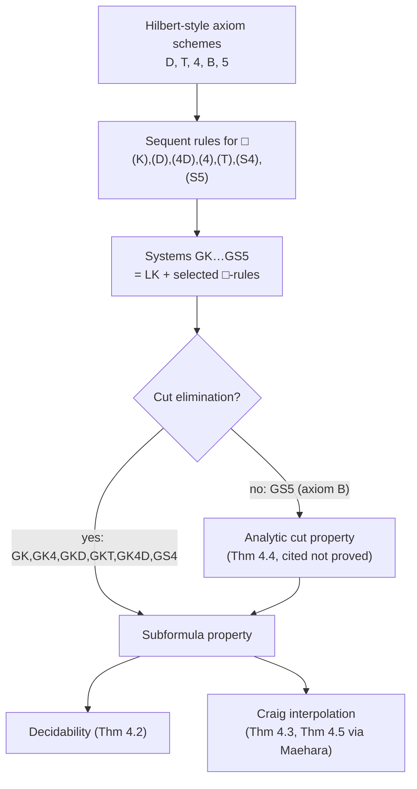

# Modal Logic Proof Theory

[[book-guidelines|↩ Back to guidelines]]

## What breaks if you just bolt $\Box$ onto LK

Classical logic's sequent calculus LK gives you a clean recipe: one left rule and one right rule per connective, each rule "unpacking" a formula into its immediate subformulas, all the way down to atoms. That recipe is *why* [[Cut-Elimination|cut elimination]] works — every rule application strictly decreases formula complexity as you read proofs bottom-up, so there's a well-founded induction to run.

Modality breaks this recipe immediately. $\Box\alpha$ ("necessarily $\alpha$") isn't built from a fixed finite set of connectives applied to $\alpha$'s immediate parts the way $\alpha \land \beta$ is built from $\alpha$ and $\beta$. It's a single unary operator whose meaning depends on an entire *relational structure* (in Kripke semantics, "true in all accessible worlds") that the propositional syntax doesn't mention at all. So the question the book is actually answering in §4.1 is: **can you still write down left/right-style sequent rules for $\Box$ that (a) are sound and complete for a given axiomatic modal logic, and (b) still admit cut elimination** — or does modality quietly poison the machine that made Chapters 1–3 work?

The answer, it turns out, is "yes, for most of the standard modal logics — but not for S5." That failure, and the weaker substitute the book reaches for instead (*analytic cut*), is the real payoff of this section.

## The starting point: modal logics as Hilbert-style extensions

Before touching sequents, Ono fixes what a "normal modal logic" even *is*, axiomatically. Modal logic K is Hilbert-style classical logic (HK) plus:

- the axiom scheme **K**: $\Box(\alpha \to \beta) \to (\Box\alpha \to \Box\beta)$,
- the **rule of necessitation**: from $\alpha$, infer $\Box\alpha$.

$\Diamond$ ("possibly") is not primitive — it's defined as $\Diamond\varphi \equiv \neg\Box\neg\varphi$, exactly the way $\exists$ is often defined from $\forall$ and $\neg$ in first-order logic. Keep that analogy in mind; it recurs below.

A **normal extension of K** is any modal logic containing all instances of K and closed under both modus ponens and necessitation. The book restricts attention entirely to normal modal logics — this is a real restriction (it rules out, e.g., logics that don't validate K itself), but it's the setting in which essentially all the standard modal systems (K, T, S4, S5, ...) live.

The five axiom schemes that generate the familiar systems:

$$
\begin{aligned}
\text{D:}\ & \alpha \to \Diamond\alpha \\
\text{T:}\ & \Box\alpha \to \alpha \\
\text{4:}\ & \Box\alpha \to \Box\Box\alpha \\
\text{B:}\ & \alpha \to \Box\Diamond\alpha \\
\text{5:}\ & \Diamond\alpha \to \Box\Diamond\alpha
\end{aligned}
$$

Logics are named by which schemes they add to K: KD, KT, K4, KB, and combinations like KTB. Two combinations get special names because they turn out to be forced into each other by interderivability: **KT4 = S4** and **KT5 = S5**. (Exercise 4.1 in the book has the reader prove, e.g., that KB4 and KB5 define the same logic, and that KDB4 collapses down to S5 — a nice worked illustration that these axiom schemes aren't independent once you start combining them.)

**Rust framing.** If you've ever implemented a rule engine or a constraint solver, this axiomatic layer is exactly a *closure specification*: "the smallest relation containing these base facts and closed under these inference rules" — the same shape as a Datalog fixpoint or a trait's default-method closure. Necessitation in particular is unusual for a rule: it says nothing about hypotheses, only about *theorems* — you can `Box`-wrap anything you've proved outright, but never anything merely assumed. That's the proof-theoretic seed of why $\Box$ later needs its own dedicated sequent rules rather than being definable from $\land, \lor, \to$.

## From axioms to sequent rules for $\Box$

This is the section's central technical move: instead of writing $\Box$'s meaning as an axiom scheme (a fact about which formulas are provable), write it as a **structural sequent rule** — a rule about how $\Box$ passes through the turnstile $\Rightarrow$. Six candidate rules are given (writing $\Box\Gamma$ for $\Box\alpha_1, \ldots, \Box\alpha_n$ when $\Gamma$ is $\alpha_1, \ldots, \alpha_n$):

$$
\frac{\Gamma \Rightarrow \alpha}{\Box\Gamma \Rightarrow \Box\alpha}\,(K)
\qquad
\frac{\Gamma \Rightarrow}{\Box\Gamma \Rightarrow}\,(D)
\qquad
\frac{\Gamma, \Box\Gamma \Rightarrow}{\Box\Gamma \Rightarrow}\,(4D)
$$

$$
\frac{\Gamma, \Box\Gamma \Rightarrow \alpha}{\Box\Gamma \Rightarrow \Box\alpha}\,(4)
\qquad
\frac{\alpha, \Gamma \Rightarrow \Delta}{\Box\alpha, \Gamma \Rightarrow \Delta}\,(T)
$$

$$
\frac{\Box\Gamma \Rightarrow \alpha}{\Box\Gamma \Rightarrow \Box\alpha}\,(S4)
\qquad
\frac{\Box\Gamma \Rightarrow \Delta, \alpha}{\Box\Gamma \Rightarrow \Delta, \Box\alpha}\,(S5)
$$

Read each of these as "how does $\Box$ propagate across the sequent arrow." Rule (K) is the barest possible version: if you can derive $\alpha$ from premises $\Gamma$, you can derive $\Box\alpha$ from $\Box\Gamma$ — necessitation, generalized to work under hypotheses that are *themselves* already boxed. Rule (T) says an assumed $\Box\alpha$ is at least as strong as assuming $\alpha$ outright (this is the sequent-level shadow of the axiom $\Box\alpha \to \alpha$). Rule (4) lets you *keep* $\Gamma$ un-boxed on the premise side while boxing it on the conclusion side, letting the same undischarged assumptions be reused at both levels — the proof-theoretic shadow of $\Box\alpha \to \Box\Box\alpha$.

Ono is explicit that these six rules aren't independent: (D) follows from (4D); both (K) and (S4) follow from (4) plus weakening; and if a system already has (T), then (4) follows from (S4) plus contraction. This redundancy matters practically — it's exactly the kind of thing Exercise 4.3 asks you to verify directly (show (K) is derivable in GK4 and in GS4), and it's the proof-theoretic analogue of a minimal trait bound: you don't need every rule as primitive if some are provably consequences of the others plus the structural rules you already have.

The resulting **sequent systems**, each built by adding rules to LK:

$$
\begin{aligned}
\text{GK} &= \text{LK} + (K) \\
\text{GKD} &= \text{LK} + (K) + (D) \\
\text{GKT} &= \text{LK} + (K) + (T) \\
\text{GK4} &= \text{LK} + (4) \\
\text{GK4D} &= \text{LK} + (4) + (4D) \\
\text{GS4} &= \text{LK} + (T) + (S4) \\
\text{GS5} &= \text{LK} + (T) + (S5)
\end{aligned}
$$

Each of GK, GKD, ..., GS5 is proved (in later exercises, e.g. Exercise 4.2's derivation of $\Box((\alpha \land \beta) \to \gamma) \Rightarrow \Box(\alpha \land \beta) \to \Box\gamma$ in GK) to match its Hilbert-style counterpart exactly — same theorems, different proof format, same relationship LK already had to HK in Chapter 1.

**Grounding this in Rust.** Think of the base sequent calculus as an `enum Formula` with a fixed, finite set of variants (`And`, `Or`, `Implies`, `Not`, `Atom`), each with a matching pair of left/right proof-search rules that pattern-match on that variant and recurse into strictly smaller subterms. Adding $\Box$ is adding one more variant, `Box(Box<Formula>)` — but its proof rule *doesn't just recurse into the argument*, it also has to inspect and filter the entire multiset of hypotheses (keep only the ones already wrapped in `Box`, as (K) and (4) do). That's a strictly more expensive shape of rule: not "match on this node," but "partition the whole context by a predicate on each formula's top-level constructor." If you were writing a proof-search engine, this is precisely where a modal fragment stops being a straightforward recursive-descent match and starts needing a context-filtering pass — worth knowing before you get there, because it changes the complexity of your `apply_rule` dispatcher.

## Cut elimination holds — for six of the seven systems

**Theorem 4.1.** Cut elimination holds for GK, GK4, GKD, GKT, GK4D, and GS4.

The book states this follows "in the same way as Chap. 2" — i.e., the double induction on grade and height from Chapter 2's e-cut argument extends to these systems once you check that each modal rule is well-behaved with respect to the induction (Exercise 4.5 asks the reader to actually carry this out for GS4). From cut elimination, the usual consequences (Chapter 3's toolkit) transfer directly:

**Theorem 4.2.** K, K4, KD, KT, K4D, and S4 are decidable.
**Theorem 4.3.** Craig's interpolation property (CIP) holds for K, K4, KD, KT, K4D, and S4.

The CIP argument is a direct extension of Maehara's method from §3.3: you just need to check, rule by rule, that if the *upper* sequent of a modal rule has an interpolant for every partition, the *lower* sequent does too. Since the modal rules only ever move a $\Box$ across the arrow without otherwise restructuring the sequent, this check goes through cleanly for these six systems.

## Where it breaks: S5 and the axiom B

Here's the section's punchline. **GS5 does not admit cut elimination.** The book gives a concrete witness: the sequent $p \Rightarrow \Box\Diamond p$ (for propositional variable $p$) is provable in GS5 *with* cut —

$$
\frac{
  \dfrac{\neg p \Rightarrow \neg p}{\Rightarrow \neg\neg p, \neg p}
  \qquad
  \dfrac{p \Rightarrow p}{\neg p, p \Rightarrow}
}{
  \dfrac{\Rightarrow \neg\neg p, \neg p \qquad \neg p, p \Rightarrow}{p \Rightarrow \neg\neg p}\ (\text{cut})
}
$$

— but has **no cut-free proof**: check every rule that could produce this sequent as a conclusion, and none of them apply. This sequent is essentially expressing the axiom **B** ($\alpha \to \Box\Diamond\alpha$), and the book flags this as the general pattern: any modal logic built on axiom B tends to run into the same obstruction for simple cut-free sequent systems.

**What breaks, mechanically.** Cut elimination's whole argument (Chapter 2) relies on being able to push a cut application upward past the last rule used, case by case, shrinking grade or height each time. For B/S5, there's no way to do that reduction — the axiom entangles $\Box$ and $\Diamond$ (equivalently, the modal accessibility relation being *symmetric*, in Kripke-semantic terms) in a way that the (T)/(S5) rules alone can't locally simulate. The book is candid that this isn't a minor gap: *no simple cut-free sequent system is known for S5 at all* — cut elimination doesn't merely fail for GS5 as presented, it resists every straightforward fix, which is why the literature developed heavier machinery (hypersequents, labelled/nested sequents, display calculi) that the book explicitly sets aside as out of scope.

## The fallback: analytic cut property

If you can't eliminate cut entirely, the next best thing is to control *which* cuts you're stuck with. Call an application of cut **analytic** if the cut formula is a subformula of some formula in the sequent below it (equivalently, cut isn't smuggling in "new" material — everything involved was already implicit in the conclusion). The proof of $p \Rightarrow \Box\Diamond p$ above is actually already analytic in this sense: the cut formula $\neg p$ is a subformula of $\Box\Diamond p = \Box\neg\neg p$.

A system has the **analytic cut property** if *every* provable sequent has some proof where every cut used is analytic. Ono states (citing Takano 1992, proof omitted as "a bit complicated"):

**Theorem 4.4.** GS5 has the analytic cut property.

This matters because analytic cut, combined with each logical rule being "acceptable" (every formula in a rule's premises is a subformula of something in its conclusion — true of (T) and (S5)), still delivers the **[[Subformula-Property|subformula property]]**: every formula anywhere in the proof is a subformula of something in the end sequent. That's the actual load-bearing fact — cut elimination was never the goal in itself, it was always a *means* to the subformula property, which is what actually powers decidability and interpolation arguments. Analytic cut gets you the subformula property by a different route, without needing cut gone entirely.

**Theorem 4.5.** Craig's interpolation property holds for modal logic S5.

The proof (worked out in detail in the source, pp. 51–52) again runs Maehara's method, but now with one extra case to handle: an analytic cut application itself. Given
$$
\frac{\Gamma \Rightarrow \Lambda, \alpha \qquad \alpha, \Delta \Rightarrow \Pi}{\Gamma, \Delta \Rightarrow \Lambda, \Pi}
$$
where $\alpha$ is (by analyticity) guaranteed to be a subformula of something already in $\Gamma, \Delta \Rightarrow \Lambda, \Pi$, you can route the partition through whichever side of the cut $\alpha$'s subformula sits on, get interpolants $\beta$ and $\gamma$ for the two premises by induction, and combine them as $\beta \lor \gamma$. The analyticity assumption is exactly what guarantees $\alpha$'s variables are already "covered" by one side of the partition or the other — without it, this step wouldn't go through, and this is precisely why the general (non-analytic) cut rule is hostile to interpolation arguments in the first place.

## What this section is actually teaching, structurally

The diagram makes the point of the whole section visible: **cut elimination was never load-bearing in itself — the subformula property is.** Two different roads (full cut elimination, or the weaker analytic cut property) both arrive at the same destination, and everything downstream (decidability, interpolation) only cares that you got there, not which road you took. This is a genuinely useful proof-engineering lesson independent of modal logic: when a strong property you want turns out to be unreachable, ask what you actually needed it *for*, and see if there's a weaker property that supplies exactly that and nothing more.

## Where this leads

Section 4.2 immediately generalizes the lesson from the *modal* structural story to structural rules themselves — exchange, contraction, weakening — examined one at a time rather than assumed wholesale, which is the seed of substructural logics (FL and its extensions) in §4.3. More distantly, Chapter 10 revisits everything here from the algebraic side: modal algebras, the Jónsson–Tarski representation theorem, and Kripke semantics recovered as the dual-frame construction — so the sequent-level story of $\Box$ told here is the syntactic half of a semantic story told later.

For the standing project: the pattern "prove a strong global property (cut elimination) fails, isolate the exact weaker property you actually needed (subformula property, via analytic cut), and re-derive your consequences from that instead" is directly the shape of a real proof-engineering decision — e.g., in a Rust verifier's proof-search backend, discovering that full cut elimination for some extension you've added is intractable doesn't mean giving up decidability; it means finding the local, checkable restriction (an analytic-cut-style discipline on your own search procedure) that still gives you termination and the properties you actually need downstream.
