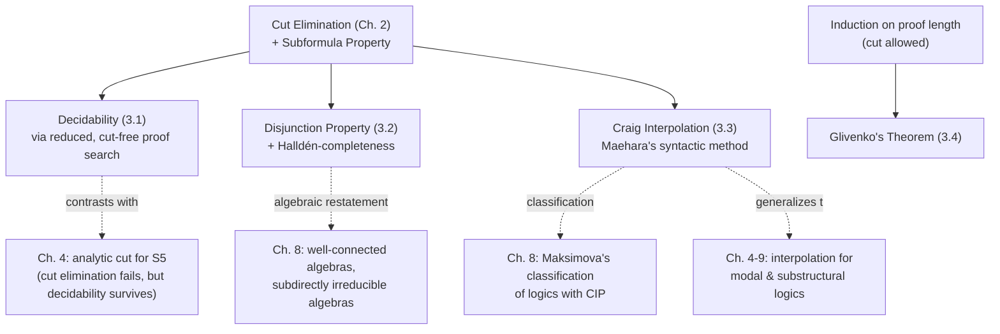

# Proof-Theoretic Consequences of [[Cut-Elimination|Cut Elimination]]

[[book-guidelines|↩ Back to guidelines]]

## Why this chapter exists

Chapter 2 spent its entire budget proving one theorem: every LK/LJ-provable sequent has a cut-free proof, and every cut-free proof has the **subformula property** — nothing appears in the proof that isn't a piece of the thing being proved. That's a strange thing to grind through unless it *pays for something*. This chapter is the payoff. It takes that one structural fact — cut-free proofs are made only of subformulas — and turns it into four separate, substantial theorems about intuitionistic and classical logic: decidability, the disjunction property, Craig interpolation, and Glivenko's theorem. None of these are proof-theoretic curiosities; they're properties you'd otherwise have to establish semantically, formula by formula, model by model. Ono's point in this chapter is that proof theory gets them "for free" once cut elimination is in hand — and gets them *constructively*, with actual algorithms and actual formula-building recipes attached, not just existence proofs.

Think of it from the compiler-writer's side: cut elimination is the analogue of a normalization/confluence result for a rewrite system. Once you know every derivation reduces to a canonical, structurally bounded form, you can build a *terminating search procedure* over that canonical form — this is exactly what backward proof search for a theorem prover or a typechecker needs. The subformula property is what makes the search space finite. Everything in this chapter is what you get once your search space is finite.

---

## 3.1 Decidability: turning "provable" into "searchable"

**The problem cut elimination solves.** Without cut elimination, proof search in LJ or LK would have to guess arbitrary cut formulas — formulas that don't have to appear anywhere in the sequent you're trying to prove. That's an unbounded search space; you can't decide termination by looking at the goal alone. Cut elimination removes cut from the picture entirely: if a sequent is provable, it has a cut-free proof, and by the subformula property that proof is built entirely out of subformulas of the goal sequent. Suddenly the search space is finite — bounded by the (finite) set of subformulas of what you're trying to prove.

**What breaks without it.** Even with cut eliminated, LJ isn't as clean as the invertible system LK* used in Chapter 1's completeness proof for LK. Two problems remain:
1. Some LJ rules (like $(\wedge_1\Rightarrow)$, $(\wedge_2\Rightarrow)$) are **not invertible** — a wrong backward choice can turn a provable lower sequent into an unprovable upper sequent, forcing real backtracking.
2. **Contraction** is the serious one. The premise of a contraction rule isn't syntactically smaller than its conclusion — so naive backward search over LJ isn't obviously terminating, even bounded to subformulas, because you could apply contraction indefinitely without shrinking anything.

**Ono's fix — the reduced proof.** Fix $n > 0$. A sequent is **$n$-reduced** if every formula occurs at most $n$ times in the antecedent (for LK, in antecedent *and* succedent). Given any sequent $\Gamma \Rightarrow \varphi$, its **1-reduced contraction** is the (unique, since antecedents are multisets) sequent you get by contracting every repeated formula down to one occurrence. A proof is **reduced** if every sequent appearing in it is at most 3-reduced.

The key result (Lemma 3.1 / Lemma 3.2) is:

$$\Gamma \Rightarrow \varphi \text{ is provable in LJ} \iff \text{its 1-reduced contraction has a cut-free, reduced proof}$$

and moreover that reduced, cut-free proof can additionally be taken **without redundancy** — no path in the proof tree revisits the exact same sequent twice (if it did, you could splice out the loop and get a strictly shorter proof of the same end sequent).

Put those together: a provable sequent has a proof built only from subformulas of the goal (subformula property), where every sequent occurring is at most 3-reduced (so there are only *finitely many distinct sequents* that can appear at all, since the subformula set is finite and 3-reducedness caps multiplicities), and no sequent repeats along a path (so the tree can't loop). Finitely many possible sequents, no repeats — the search tree is finite, full stop.

**The algorithm.** Backward proof search in LJ, restricted to 3-reduced sequents built from subformulas of the goal, with a loop-check that aborts a branch the moment a sequent reappears on its own path. Exhaustive search of this now-finite tree either finds a successful proof-search tree (all leaves initial sequents — provable) or exhausts every branch (not provable). This gives:

> **Theorem 3.3.** Both classical logic and intuitionistic logic are decidable, and moreover the decision algorithm produces an actual cut-free proof when the sequent is provable.

The two remaining engineering concerns Ono flags (Remark 3.1) are exactly what you'd expect from implementing a prover: prioritize *invertible* rules first in the backward search (for LJ: $(\Rightarrow\to)$, $(\Rightarrow\neg)$, $(\Rightarrow\wedge)$, $(\vee\Rightarrow)$) so you never have to backtrack over them, and note that a system without explicit contraction (like LK*, where contraction is absorbed into each connective rule) sidesteps the loop-check machinery entirely — which is exactly why invertible calculi are so attractive for building real theorem provers.

**Grounding — this is literally your search loop.** If you're building a sequent-calculus or tableau-based prover, this section *is* the termination argument for your prover's main loop, not an analogy for it.

```rust
// Sketch: backward proof search bounded by the subformula set + reduced-sequent cap.
// The "3-reduced" cap and the visited-set loop-check are what make this terminate —
// remove either and this becomes an unbounded search over an infinite state space.
use std::collections::HashSet;

#[derive(Clone, PartialEq, Eq, Hash)]
struct Sequent { antecedent: Multiset<Formula>, succedent: Multiset<Formula> }

fn prove(goal: &Sequent, subformulas: &HashSet<Formula>, visited: &mut HashSet<Sequent>) -> bool {
    if is_initial(goal) { return true; }
    if !visited.insert(goal.clone()) { return false; } // loop-check: seen this sequent on this path
    // try invertible rules first (no backtracking cost), then non-invertible ones
    for rule in applicable_backward_rules(goal, subformulas) {
        let premises = rule.premises();
        if premises.iter().all(|p| prove(p, subformulas, visited)) {
            visited.remove(goal);
            return true;
        }
    }
    visited.remove(goal);
    false
}
```

In Lean, the corresponding statement is a **well-founded recursion**: you'd want a measure (e.g. total size of the multiset of 3-reduced sequents reachable from a finite subformula set) that strictly decreases, or — more faithfully to Ono's actual argument — an explicit finiteness proof that the reachable-sequent set is a `Finset` and search is exhaustive enumeration over it, which is precisely how you'd formalize "decidable" (`Decidable` instance via `Finset.decidableBAll` over that finite search space) rather than via an ad hoc termination metric.

---

## 3.2 The Disjunction Property

**Definition 3.1.** A logic $L$ has the **disjunction property** iff whenever $\alpha \vee \beta$ is provable in $L$, so is $\alpha$ or $\beta$ individually.

**What breaks without cut elimination — and what's true without it.** Classical logic conspicuously *lacks* this property: $p \vee \neg p$ is a theorem, but neither $p$ nor $\neg p$ is. This isn't a defect of classical logic's proof theory; it's a real semantic fact (classical logic proves things true in *every* valuation, and $p \vee \neg p$ is such a thing without either disjunct being one). So the disjunction property is a genuine dividing line, not a technical artifact — and intuitionistic logic's possession of it is one of the properties that makes it "constructive": a proof of a disjunction really does hand you a proof of one side.

**The proof (Theorem 3.4) is a one-paragraph argument once cut-free proofs and the subformula property are available**, and it's worth seeing in full because it's the template for the whole chapter's proof style:

Suppose $\alpha \vee \beta$ is provable in LJ. Take a cut-free proof of $\Rightarrow \alpha \vee \beta$. This sequent isn't an initial sequent (an initial sequent is $\varphi \Rightarrow \varphi$; this one has empty antecedent). So look at the *last* rule applied. It can't be cut (there are none — cut-free). Given the succedent is the single formula $\alpha \vee \beta$, the last rule must be one of: right weakening (upper sequent $\Rightarrow$, empty), $(\Rightarrow\vee_1)$, or $(\Rightarrow\vee_2)$. The weakening case is ruled out immediately by the subformula property: a proof of the empty sequent $\Rightarrow$ would need its initial sequents' formulas to be subformulas of *nothing*, which is impossible. So the last rule is $(\Rightarrow\vee_1)$ or $(\Rightarrow\vee_2)$ — meaning the *upper* sequent is $\Rightarrow \alpha$ or $\Rightarrow \beta$ outright. Done.

Notice what did the work: the subformula property eliminated an entire case (weakening) by a global argument about the whole proof, not a local inspection — that's the payoff of Chapter 2's investment.

**Halldén-completeness (Definition 3.2)** is a weaker cousin: same statement, but only required when $\alpha$ and $\beta$ share **no propositional variables**. Disjunction property $\Rightarrow$ Halldén-completeness trivially (it's a special case), but not conversely — classical logic is Halldén-complete (Exercise 3.2: if $\alpha \vee \beta$ is a tautology and they share no variables, one of them must already be a tautology, by a valuation-splitting argument) while lacking the disjunction property outright. So Halldén-completeness measures something strictly weaker: not "disjunctions decompose," but "disjunctions of *logically independent* things decompose." The algebraic characterization of both properties (via subdirectly irreducible / well-connected algebras) is deferred to Chapter 8 — this is a case where Part I gets there first, syntactically, and Part II later gives the same fact a structural, algebra-theoretic explanation.

**Grounding.** For a Rust-side verifier, the disjunction property is the guarantee that a constructive `Or` proof term genuinely comes with a tag telling you *which* side holds — this is exactly the difference between Curry-Howard's `Either<ProofOfA, ProofOfB>` and classical logic's "one of these types is inhabited, I just won't tell you which." In Lean, this is why `Or.elim`/pattern-matching on an intuitionistic disjunction proof is total and computable, while classical `Or` reasoning (via `Classical.byCases`, `em`) produces a non-computable proof term that can't be pattern-matched into an actual witness — the disjunction property is precisely the theorem that says LJ never needs that escape hatch for *provable* disjunctions.

---

## 3.3 Craig's Interpolation Property (CIP)

**Definition 3.3.** $L$ has CIP if whenever $\alpha \to \beta$ is provable, there's an **interpolant** $\gamma$ — provable as both $\alpha \to \gamma$ and $\gamma \to \beta$ — whose propositional variables are confined to $\mathrm{Var}(\alpha) \cap \mathrm{Var}(\beta)$.

This is a real constraint: $\gamma$ has to be expressible using *only* the vocabulary the two sides share. If $\alpha$ and $\beta$ share no variables at all, an interpolant can only be built from logical constants — which is why Ono works with a language containing an explicit constant $0$ (falsum) throughout this section, patching up the vocabulary-starved edge case afterward (Corollary 3.9).

Ono gives **two independent proofs**, and the gap between them is the chapter's most important methodological point.

### (1) The semantic proof (classical logic only)

This proof builds two canonical interpolants directly from truth tables. Split the shared variables out: write $\alpha(\mathbf{p}, \mathbf{r})$, $\beta(\mathbf{q}, \mathbf{r})$ where $\mathbf{r}$ is the shared vocabulary. Define the **post-interpolant**
$$\alpha^*[\mathbf{r}] = \bigvee_{\mathbf{e}\in\{0,1\}^m} \alpha(\mathbf{e}, \mathbf{r})$$
— disjoin over every possible truth-assignment to $\alpha$'s private variables. Since $\alpha\to\beta$ is a tautology, this instantiated disjunction is provably an interpolant, and moreover it's the **strongest** one (up to logical equivalence) — every other interpolant $\gamma$ satisfies $\alpha^*[\mathbf{r}] \to \gamma$. Dually, the **pre-interpolant** $\beta^*[\mathbf{r}] = \bigwedge_{\mathbf{e}'} \beta(\mathbf{e}', \mathbf{r})$ (conjoin over $\beta$'s private variables) is the **weakest** interpolant. Since both extremes exist for *any* formula and *any* finite variable set — not just for an existing implication — classical logic actually has the stronger **uniform interpolation property** (Theorem 3.5).

This is elegant, but notice it's fundamentally a two-valued-semantics argument: it manipulates truth assignments directly. It gives you existence and even the two extremal interpolants, but it gives you no proof-search algorithm and, crucially, **it does not generalize** — the moment you move to a logic without two-valued truth tables (intuitionistic logic, substructural logics, many-valued logics), this technique has nothing to say.

### (2) Maehara's method (syntactic, generalizes)

Maehara (1960) proves interpolation by induction on the *length of a cut-free proof* — a purely proof-theoretic argument that transplants to any logic with cut elimination. The technical device is a **partition** of a sequent: split $\Gamma\Rightarrow\Delta$ into $(\Gamma_1:\Delta_1\,,\,\Gamma_2:\Delta_2)$, and prove the stronger statement:

> **Theorem 3.6.** If $\Gamma\Rightarrow\Delta$ is provable in $\mathrm{LK}_0$ and $(\Gamma_1:\Delta_1, \Gamma_2:\Delta_2)$ is any partition of it, there's $\sigma$ with $\Gamma_1\Rightarrow\Delta_1,\sigma$ and $\sigma,\Gamma_2\Rightarrow\Delta_2$ both provable, and $\mathrm{Var}(\sigma)\subseteq \mathrm{Var}(\Gamma_1,\Delta_1)\cap\mathrm{Var}(\Gamma_2,\Delta_2)$.

The induction is structural on the cut-free proof: base case is an initial sequent $\varphi\Rightarrow\varphi$, where depending on which side of the partition $\varphi$ falls on, the interpolant is simply $0$, $\varphi$, $\neg\varphi$, or $1$ — four mechanical cases. The inductive step processes the *last rule* of the proof and shows how to **combine the interpolants of the premises** into an interpolant for the conclusion, connective by connective. For example, for $(\vee\Rightarrow)$ splitting into premises $\alpha,\Sigma\Rightarrow\Delta$ and $\beta,\Sigma\Rightarrow\Delta$, if $\sigma$ and $\delta$ interpolate the two premises (for a partition putting $\alpha\vee\beta$ on the left side), the new interpolant is simply $\sigma\vee\delta$. For $(\Rightarrow\to)$ and $(\to\Rightarrow)$, the interpolant combinator is correspondingly $\to$-shaped or $\wedge$-shaped depending on which side of the partition the principal formula lands on.

This is doing something you should recognize immediately if you've thought about type-directed program synthesis: **the interpolant is being synthesized compositionally from the proof term, rule by rule, exactly like a recursive translation over a derivation tree.** Cut elimination is what guarantees the induction terminates cleanly (no cut means every rule strictly decreases proof length, and the interpolant-combination step is well-defined at every rule) — this is precisely why the syntactic method needs cut-free proofs and the semantic method doesn't need proofs at all.

Because Maehara's method is purely syntactic and proof-length-inductive, it transplants to LJ almost verbatim (Theorem 3.7, using one-sided partitions since LJ succedents are singletons), giving Craig interpolation for intuitionistic logic (Corollary 3.8) — a result the semantic method, tied to two-valued truth tables, simply has no route to.

**Corollary 3.9** patches the language-without-constants case: when the shared vocabulary is empty, no interpolant *formula* over shared variables can exist (there's nothing to build it from), so the theorem statement degrades gracefully to "either $\neg\alpha$ or $\beta$ is outright provable."

**Why this section is load-bearing for your projects.** Maehara's method is a genuine *algorithm* for synthesizing an interpolant from a derivation — this is the mechanism behind interpolation-based invariant generation and CEGAR-style verification loops (a Rust-side automated verifier that needs to synthesize loop invariants or refine an abstraction from a spurious counterexample proof is doing exactly this induction). It's also a clean illustration of proof-relevant reasoning: the interpolant isn't just asserted to exist, it's read off structurally from the shape of the proof, the same way a bidirectional type-elaborator reads off a metavariable solution from the shape of a typing derivation rather than guessing it up front.

---

## 3.4 Glivenko's Theorem — induction on proof length *with* cut

Every previous result in this chapter depended on having a **cut-free** proof. Glivenko's theorem is the odd one out: it's proved by induction on proof length, but the proof is allowed to contain cut. This matters methodologically — it shows the chapter's toolkit (cut elimination, subformula property) isn't the *only* proof-theoretic technique; plain induction on derivation length is independently useful, and Ono includes this section specifically to make that point.

**Theorem 3.10 (Glivenko).** $\alpha$ is provable in classical logic iff $\neg\neg\alpha$ is provable in intuitionistic logic.

Since LJ-provability implies LK-provability but not conversely, classical logic is strictly stronger. Glivenko's theorem says precisely *how much* stronger, in a specific, checkable sense: double-negating collapses the gap. You never need classical logic itself to check classical provability — you can check it inside the (weaker, but decidable and constructive) intuitionistic system, just by prepending $\neg\neg$.

Ono proves this via a generalized sequent-level statement:

> **Theorem 3.11.** For all multisets $\Gamma,\Delta$: $\Gamma\Rightarrow\Delta$ is provable in LK iff $\neg\Delta,\Gamma\Rightarrow$ is provable in LJ (where $\neg\Delta$ negates every formula in $\Delta$).

The "if" direction is nearly immediate. The "only if" direction is the real content: given an LK-proof $P$ of $\Gamma\Rightarrow\Delta$ (which may use cut freely), you build, by induction on the length of $P$, an actual LJ-proof $Q$ of $\neg\Delta,\Gamma\Rightarrow$ — a **constructive transformation of proofs**, not merely an existence claim. Instantiating with $\Gamma=\emptyset$, $\Delta=\{\alpha\}$ recovers Theorem 3.10, using the fact that $\neg\alpha\Rightarrow$ is LJ-provable iff $\Rightarrow\neg\neg\alpha$ is.

**Grounding.** This is a genuine proof-translation procedure — the proof-theoretic analogue of a compiler pass that rewrites a classical-logic proof term into a double-negation-translated constructive one, which is exactly what the Gödel-Gentzen negative translation does for full first-order/higher-order logic (this chapter's version is the propositional special case). If your verifier ever needs to borrow a classically-proved lemma inside a constructive kernel, this is the mechanism: wrap it in $\neg\neg$, translate the proof, done — no need to extend the kernel's trusted computing base to admit classical axioms directly.

---

## Where this leads



Every later chapter that revisits decidability, interpolation, or the disjunction property (modal logics in Ch. 4, algebraic logic in Ch. 8) either (a) tries to recover this chapter's proof-theoretic route when cut elimination fails outright — e.g. S5's **analytic cut** substitute in Chapter 4 exists precisely because full cut elimination breaks there, and analytic cut is engineered to still deliver the subformula property this chapter's arguments all lean on — or (b) gives the *same* facts an independent algebraic proof (Chapter 8's treatment of the disjunction property via well-connected algebras is explicitly contrasted by Ono against this chapter's proof-theoretic route). That contrast is the book's central thesis in miniature: proof theory and algebra are two roads to the same destination, and this chapter is where you first see proof theory get there alone.

For the standing projects: **Maehara's method (3.3) is the most directly load-bearing piece here** — it's a concrete recipe for synthesizing an auxiliary formula (an invariant, a refinement predicate, an interface contract) compositionally from a derivation, which is the same shape of problem as synthesizing a metavariable solution or a loop invariant from a typing/proof derivation. The **decidability proof (3.1)** is the closest thing in the chapter to source code for a theorem prover's search loop, complete with its termination argument spelled out. Glivenko's theorem (3.4) is the smallest possible example of the proof-translation technique you'd need if a Rust verifier's trusted kernel is constructive but wants to reuse classically-proved lemmas.
