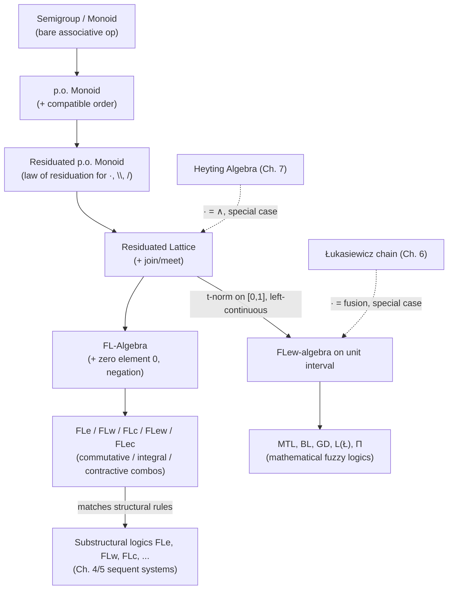

# Residuated Lattices and FL-Algebras

[[book-guidelines|↩ Back to guidelines]]

## The problem: implication keeps needing a new home

By the time Ono reaches Chapter 9, he's already built implication three separate times, and each time it lived in a different algebraic operation:

- In **Boolean and Heyting algebras** (Chapter 6–7), implication $\to$ is glued to *meet* $\wedge$ by the law of residuation: $a \wedge b \le c$ iff $a \le b \to c$.
- In **Łukasiewicz chains** on $[0,1]$ (Chapter 6), ordinary implication is *not* residual to $\wedge$ — but it turns out to be residual to a completely different operation, *fusion* $\cdot$, defined by $a \cdot b = \max\{0, a+b-1\}$.

So "implication" isn't one fixed algebraic gadget — it's whatever operation satisfies a residuation equation relative to *some* underlying multiplication. That's the "what breaks" moment this chapter opens with: if you want a single theory that covers Heyting algebras, Łukasiewicz chains, Gödel chains, and — as we'll get to in Part I's Chapter 4/5 material — the full zoo of substructural logics (logics missing exchange, contraction, or weakening), you cannot keep re-deriving implication ad hoc for each case. You need the residuation law stated for an *arbitrary* monoid operation, with $\wedge$ demoted to just one instance among many. That generalization is exactly what a **residuated lattice** is, and adding a distinguished "false" element on top of it gives an **FL-algebra** — the precise algebraic counterpart of substructural logic, the way Boolean algebras are the algebraic counterpart of classical logic and Heyting algebras of intuitionistic logic.

If you've been tracking the proof-theoretic side of this book (Chapter 4/5's sequent system FL and its extensions FLe, FLw, FLc, ...), this chapter is where that machinery gets its Lindenbaum–Tarski-style semantic mirror: FL-algebras are to FL what Heyting algebras were to Int.

## Semigroups and monoids: the bare minimum for "multiplication"

Ono builds up in careful stages. First, strip "multiplication" down to its absolute minimum requirement.

**Definition 9.1.** An algebra $A = \langle A, \cdot \rangle$ is a **semigroup** if $\cdot$ is associative: $x \cdot (y \cdot z) = (x \cdot y) \cdot z$. It's a **monoid** $\langle A, \cdot, 1\rangle$ if additionally there's a unit element $1$ with $x \cdot 1 = 1 \cdot x = x$ for all $x$. A semigroup/monoid is *commutative* when $x \cdot y = y \cdot x$.

This is deliberately weak — no order yet, no distributivity, nothing lattice-like. Ono's own examples (9.1) are concrete and worth holding onto: $\langle \mathbb{N}, + \rangle$ and $\langle \mathbb{N}, \times, 1\rangle$ are commutative monoids; and — the one that matters for logic — the set $\Sigma^*$ of finite strings over an alphabet $\Sigma$, under concatenation with the empty string $\varepsilon$ as unit, is a **non-commutative** monoid. Keep that string-concatenation example in mind: it's the intuition pump for why fusion (the monoid operation used for substructural logic) doesn't have to commute, and concatenation not commuting is precisely the algebraic shadow of a sequent calculus without the exchange rule.

**What this buys you if you're thinking like a compiler engineer:** a monoid is exactly the interface `trait Monoid { fn combine(&self, other: &Self) -> Self; fn identity() -> Self; }` with the associativity law as an unchecked (but assumed) invariant — the same trait shape Rust's own `std::ops` conventions nudge you toward for anything "combinable," and the same structure that shows up as `Monoid` in any Haskell-flavored type class hierarchy. Fusion, when we get to it, will be *this* trait's `combine`, not `&&`.

Then order gets bolted on:

**Definition 9.2.** $\langle A, \cdot, \le\rangle$ is a **partially ordered semigroup (p.o. semigroup)** if $\langle A, \le \rangle$ is a poset and $\cdot$ is *monotone*: $x \le y$ implies both $x \cdot z \le y \cdot z$ and $z \cdot x \le z \cdot y$. Add a unit and you get a **p.o. monoid**.

Example 9.2 upgrades the string-concatenation monoid to a p.o. monoid by defining $\vec c \le^* \vec d$ componentwise (same length, each entry $\le$) — a natural first guess at "ordering sequences," and one that will matter later for anyone who has implemented list/vector orderings in a proof assistant.

## The law of residuation, stated for an arbitrary monoid

Now the actual definition this whole chapter is built around.

**Definition 9.3 (Residuated p.o. semigroups/monoids).** A p.o. semigroup $A$ with operation $\cdot$ is **residuated** if there exist two operations $\backslash$ and $/$ satisfying
$$x \cdot y \le z \iff y \le x\backslash z \iff x \le z / y.$$
$\backslash$ and $/$ are the **left** and **right residual** (or left/right division) of $\cdot$.

When $\cdot$ is commutative, left and right residuation collapse into each other ($x\backslash y = y/x$ for all $x,y$), so a single symbol $\to$ suffices, and this is called simply *the* residual.

**Why does this need to split into two operations at all?** Because if $\cdot$ isn't commutative — as with string concatenation, or as with fusion once you drop the exchange rule from your sequent calculus — then "$x$ multiplied on the left by something" and "$x$ multiplied on the right by something" are genuinely different questions, so "the thing you need to append on the right to reach $z$" ($x \backslash z$, i.e. $x \cdot ? \le z$, solve for $?$ from the right slot) and "the thing you need to prepend on the left" ($z / y$, i.e. $? \cdot y \le z$) have to be tracked separately. This is exactly the reason, from Chapter 4's proof-theoretic side, that a substructural logic without exchange needs *two* implication-like connectives instead of one — Ono is retroactively cashing that observation out algebraically here.

**Remark 9.3 gives the cleanest possible intuition, and it's worth internalizing before anything else in this chapter:** residuation is just "the inverse operation, made order-aware."
- $\langle \mathbb{Z}, +, 0, \le\rangle$: the residual of $+$ is $-$ (subtraction), because $x + y \le z \iff y \le z - x$.
- $\langle \mathbb{R}^+, \times, 1, \le\rangle$: the residual of $\times$ is $/$ (division), because $x \times y \le z \iff y \le z/x$.

So "residual" is the order-theoretic generalization of "inverse" to settings where you can't always solve equations exactly (there's no exact multiplicative inverse constraint here, only an inequality), and where the "closest you can get without overshooting" is well-defined because of the lattice/order structure. If you've ever implemented interval arithmetic or worked with Galois connections, this is precisely a Galois connection: $(x \cdot -)$ and $(x \backslash -)$ are adjoint monotone maps. That's not incidental — residuated lattices *are* a special case of Galois connections dressed up with lattice and monoid structure, and if you've internalized adjunctions from category-adjacent programming (a functor/its right adjoint, `Option::map`/`Option::and_then` style reasoning), this is the same shape: $x \cdot (-) \dashv x \backslash (-)$.

## Residuated lattices: giving the order a join and meet

**Definition 9.4 (Residuated lattices).** When the poset $\langle A, \le\rangle$ underlying a residuated p.o. monoid is a *lattice*, $A$ is called a **residuated lattice**. Equivalently, $A = \langle A, \vee, \wedge, \cdot, \backslash, /, 1\rangle$ is a residuated lattice if:
- $\langle A, \vee, \wedge\rangle$ is a lattice,
- $\langle A, \cdot, 1\rangle$ is a monoid,
- $x \cdot y \le z \iff y \le x\backslash z \iff x \le z/y$ for all $x, y, z \in A$.

Two subtleties Ono flags explicitly, because they trip people up if you assume residuated lattices are "just Heyting algebras with extra structure":

1. $\langle A, \vee, \wedge \rangle$ need **not** be bounded — no guaranteed top or bottom.
2. The unit $1$ is **not** necessarily the greatest element, even when a greatest element exists. This is the single biggest conceptual departure from Heyting algebras, where $1$ (true) is definitionally the top of the lattice. In a general residuated lattice, $1$ is just "whatever the monoid identity is" — it might sit in the *middle* of the order.

A pleasant side effect: monotonicity of $\cdot$, which had to be assumed by hand in Definition 9.2's p.o. semigroups, now falls out *for free* from the residuation law alone (Ono proves this: if $x \le y$ and $y \cdot z \le u$ then $x \le y \le u/z$, so $x \cdot z \le u$ for arbitrary $u$, in particular for $u = y \cdot z$, giving $x \cdot z \le y \cdot z$). This is a nice example of a structural law implying an axiom you might otherwise think you needed to state separately — a pattern worth recognizing when you're minimizing your own trait/typeclass axiom sets.

**Every Heyting algebra is a residuated lattice** where the monoid operation is meet $\wedge$ itself (with $1$ = top, so here the two subtleties above happen to *not* bite — that's precisely what makes Heyting algebras the special, cozy case). Every totally ordered residuated p.o. monoid (a chain) is automatically a residuated lattice, since chains are trivially lattices.

Exercise 9.3 in the text lists derived laws that are worth having as a checklist, because they read exactly like the equational theory of an intuitionistic-style implication, now proved from residuation alone rather than assumed:
1. Antitone/monotone in each argument: $x \le y \Rightarrow (y \to z \le x \to z$ and $z \to x \le z \to y)$.
2. $1 \to x = x$ and $1 \le x \to x$.
3. **Currying**: $x \to (y \to z) = (x \cdot y) \to z$ — this is exactly the curry/uncurry isomorphism from functional programming, proved as an algebraic identity rather than assumed as a type isomorphism.
4. $x \le (x \to y) \to y$ (double-residual, a weak double-negation-flavored law).
5. $x \cdot (z \to y) \le z \to (x \cdot y)$.

Item 3 is worth pausing on if you're grounding this in Rust or Lean: `fn f(x: X, y: Y) -> Z` and `fn f(x: X) -> impl Fn(Y) -> Z` being "the same function" is currying at the level of *types*; Exercise 9.3.3 is the same fact one level down, at the level of the *order relation* between residuated-lattice elements standing for propositions. It's the algebraic seed of the Curry–Howard correspondence surfacing directly in the semantics, before any proof term has been written.

### Integral and contractive residuated lattices

Two named subclasses matter for connecting back to the substructural-logic zoo (FLe, FLw, FLc, ... from Chapter 4/5):

- **Integral**: the greatest element exists and equals the unit $1$ (i.e. $x \le 1$ for all $x$). Equivalent characterization: $x \cdot y \le x \wedge y$ for all $x, y$ — multiplying two things can never take you *above* either of their meet. Every Heyting algebra is integral in this sense.
- **Contractive (square-increasing)**: $x \le x \cdot x$ for all $x$. Equivalently, $x \wedge y \le x \cdot y$.

If a residuated lattice is **both** integral and contractive, the two inequalities sandwich fusion exactly onto meet: $x \cdot y = x \wedge y$ for all $x, y$ — and this forces commutativity too, since meet is commutative. This is the precise algebraic statement of "if you have both weakening and contraction, fusion collapses into ordinary conjunction" — i.e., once your substructural logic has enough structural rules back, the extra connective fusion was buying you (multiplicative vs. additive conjunction, from Chapter 4) disappears, because there's no longer a semantic difference to preserve. That's a clean example of "what breaks without this restriction": drop integrality or contraction and fusion becomes genuinely informative; keep both and it degenerates to something you already had.

## FL-algebras: adding a zero for negation

Residuated lattices alone have no way to express *negation*, because there's no designated "false" element — only the extremes of the order, which (as just emphasized) may not even exist. Ono's fix, following his own 1993 paper, is:

**Definition 9.5 (Full Lambek algebras).** $A = \langle A, \vee, \wedge, \cdot, \backslash, /, 1, 0\rangle$ is a **full Lambek algebra (FL-algebra)** if $\langle A, \vee, \wedge, \cdot, \backslash, /, 1\rangle$ is a residuated lattice and $0$ is an *arbitrary* extra element (the "zero element"). FL-algebras are also called **pointed residuated lattices**.

Two negations fall directly out of the residuals applied to $0$: $\sim x = x \backslash 0$ and $-x = 0/x$. When the algebra is commutative (called an **FLe-algebra**), the two negations coincide and get the familiar symbol $\neg x = x \to 0$. An FLe-algebra is **involutive** iff $\neg\neg x = x$ for all $x$ — i.e. genuine double-negation elimination, which (as flagged back in Chapter 6) Łukasiewicz-style structures have and Heyting/Gödel-style structures generally don't.

Layering on the earlier subclasses:
- **FLw-algebra**: an FL-algebra with $0 \le x \le 1$ for all $x$ (equivalently, integral *and* zero-bounded).
- **FLc-algebra**: a contractive FL-algebra.
- Combine subscripts freely: **FLew** = commutative + integral + zero-bounded, and so on for FLec, FLcw, FLecw.

This subscript notation directly mirrors the sequent-system naming from Chapter 4 (FLe adds exchange, FLw adds weakening, FLc adds contraction to the bare system FL) — the algebraic subscripts and the structural-rule subscripts name *the same thing* from two directions, which is the chapter's whole point made concrete.

### Validity and the completeness theorem

To connect algebra back to sequents, Ono needs to say what it means for a sequent to hold in an FL-algebra. Recall from Chapter 4 that a sequent $\gamma_1, \ldots, \gamma_m \Rightarrow \varphi$ is provable in FL iff the single-formula sequent $(\gamma_1 \cdot \cdots \cdot \gamma_m) \Rightarrow \varphi$ is — i.e. commas in the antecedent *are* fusion. That licenses:

**Definition 9.6.** A sequent $\gamma_1, \ldots, \gamma_m \Rightarrow \varphi$ is **valid** in an FL-algebra $A$ iff $f(\gamma_1 \cdots \gamma_m) \le f(\varphi)$ for every assignment $f$ on $A$ — equivalently, the formula $(\gamma_1 \cdots \gamma_m)\backslash\varphi$ is valid (recall a formula $\alpha$ is valid iff $1 \le f(\alpha)$ for every assignment; note this can't just say "$f(\alpha) = 1$" or "$f(\alpha)$ is the top element," because — as flagged above — $1$ need not be the top).

**Lemma 9.1 (soundness):** provability in FL implies validity in every FL-algebra; provability in FL$_x$ implies validity in every FL$_x$-algebra, for $x \in \{e, w, c, ew, ec\}$. Ono sketches the weakening case explicitly: integrality ($g \cdot a \cdot d \le g \cdot 1 \cdot d$, since $a \le 1$) is precisely what validates left weakening semantically — dropping an assumption can only make the product smaller, which can only help you stay under the bound $\le f(\varphi)$. Symmetric arguments show zero-boundedness validates right weakening, commutativity validates exchange, and contractivity validates contraction — a clean one-to-one map from structural rule to algebraic property.

**Theorem 9.2 (Algebraic completeness of basic substructural logics):** $\alpha$ is provable in FL iff it's valid in every FL-algebra, and likewise for FLe, FLw, FLc, FLew, FLec — in fact for *any* substructural logic. The proof runs the same Lindenbaum–Tarski construction used for Heyting algebras in Chapter 7: build the algebra out of formulas modulo provable-equivalence, and unprovability of $\alpha$ shows up as $[1] \not\le [\alpha]$ in that quotient algebra.

**Theorem 9.3 (Subvarieties and substructural logics):** the class of all FL-algebras forms a variety $\mathsf{FL}$ (Chapter 8's Birkhoff machinery applies), and there's a bijective correspondence between subvarieties of $\mathsf{FL}$ and substructural logics — exactly the pattern Chapter 8 established between subvarieties of Heyting algebras and superintuitionistic logics, now transported one level down to the substructural setting.

### Fusion as "comma made explicit"

Ono closes 9.2 with an observation that retroactively re-explains Chapter 4's whole motivation for introducing fusion in the first place. Syntactically, the residuation law in FLe reads:
$$\alpha, \gamma \Rightarrow \beta \text{ provable in FLe} \iff \gamma \Rightarrow \alpha \to \beta \text{ provable in FLe}.$$
Writing the left side with fusion made explicit, $\alpha \cdot \gamma \Rightarrow \beta$. But if FLe is replaced by LJ (ordinary intuitionistic logic), this is just $\alpha \wedge \gamma \Rightarrow \beta$ — the *comma* in the antecedent of an LJ sequent already **is** conjunction, silently. Once structural rules are dropped and comma stops behaving like $\wedge$ (because contraction/weakening no longer let you freely duplicate or discard antecedent formulas), the comma needs its own name — fusion — precisely so the residuation law still has something concrete to be a residual *of*. Fusion isn't an exotic new invention; it's what "comma" was doing all along in classical/intuitionistic logic, made visible only once you can no longer sweep it under the rug.

## Residuations over the unit interval: where fuzzy logic lives

Section 9.3 specializes everything to the interval $U = [0,1]$, connecting this chapter back to Chapter 6's many-valued chains and forward into mathematical fuzzy logic.

Consider a commutative p.o. monoid $\langle U, \cdot, 1, \le \rangle$ where $\cdot$ is a **triangular norm (t-norm)**: associative, commutative, $x \cdot 1 = x$, and monotone. Three canonical t-norms:
- $x \cdot y = \min\{x,y\}$ — **Gödel t-norm**,
- $x \cdot y = \max\{x+y-1, 0\}$ — **Łukasiewicz t-norm**,
- $x \cdot y = x \times y$ (ordinary real multiplication) — **product t-norm**.

Because $U$ is a *complete* totally ordered set, Ono can bring in genuine supremum/infimum machinery: a binary map $g$ is **left-continuous** if it preserves every supremum in both arguments ($g(x, \sup C) = \sup\{g(x,z) : z \in C\}$, and symmetrically), and **right-continuous** analogously for infima. For a commutative map, one direction implies the check is enough in both slots.

**Lemma 9.4 (the key structural fact of this section):** A commutative p.o. monoid $\langle U, \cdot, 1, \le\rangle$ built from a t-norm is **residuated if and only if $\cdot$ is left-continuous.**

This is the load-bearing theorem of the whole section, and it's worth sitting with the "why" rather than just the statement. The forward direction is routine (residuation forces preservation of suprema, by a squeeze argument on upper bounds). The converse is the constructive half, and it's genuinely a *proof by explicit formula*: given $a, b \in U$, define $D = \{z \in U : a \cdot z \le b\}$; left-continuity guarantees $a \cdot \sup D = \sup\{a \cdot z : z \in D\} \le b$, so $\sup D \in D$ — meaning $D$ actually attains a *maximum*, not just a supremum. That maximum, as a function of $a$ and $b$, **is** the residual: $a \to b = \max\{z \in U : a \cdot z \le b\}$.

If you like operational/mechanistic readings: this is telling you that "the largest $z$ such that multiplying doesn't overshoot" is a computable closed-form recipe exactly when $\cdot$ doesn't have any "jump discontinuities from below" — i.e., when approaching a value from below via suprema commutes with multiplying. It's the same left-continuity condition that makes limits and multiplication swap order — a fact anyone who has implemented interval arithmetic or fixed-point solvers for monotone operators will recognize as "this needs to be a Scott-continuous / order-continuous map for the least/greatest fixed point construction to actually terminate at the right value."

**Theorem 9.5** generalizes this beyond the unit interval, to *complete lattice-ordered semigroups*: residuation holds iff infinite distributivity holds, $(\bigvee C) \cdot x = \bigvee (C \cdot x)$ and symmetrically. Specializing to a finite lattice with $\cdot = \wedge$, this collapses to ordinary finite distributivity — recovering **Lemma 7.1** from Chapter 7 (every finite distributive lattice is a Heyting algebra) as a special case of Lemma 9.4/Theorem 9.5. That's a satisfying payoff: the whole "finite [[Lattices-and-Boolean-Algebras#Distributive lattices|distributive lattices]] are Heyting algebras" fact from two chapters earlier turns out to be the discrete degenerate case of "left-continuous t-norms are residuated."

**Remark 9.4** works out the residual of the product t-norm explicitly (**product implication**):
$$a \to b = \begin{cases} 1 & a \le b \\ b/a & \text{otherwise} \end{cases} \tag{9.3}$$
— genuine division, capped at 1 to stay inside $[0,1]$, exactly the fix you'd expect from the earlier $\mathbb{R}^+$ example in Remark 9.3, patched for the boundary at $0$ and $1$.

### From t-norms to fuzzy logics

Every left-continuous t-norm gives an FLe-algebra $\langle U, \max, \min, \cdot, \to, 1, 0\rangle$ — in fact an **FLew-algebra**, since $0 \le x \le 1$ automatically. So *every left-continuous t-norm determines a substructural logic over FLew.* This is Hájek's foundational move for **mathematical fuzzy logic**:

- **MTL (monoidal t-norm logic)**: FLew plus prelinearity $(\alpha \to \beta) \vee (\beta \to \alpha)$ — completeness with respect to *all* FLew-algebras from left-continuous t-norms (Theorem 9.6.2).
- **BL (basic logic)**: MTL plus divisibility $(\alpha \wedge \beta) \to (\alpha \cdot (\alpha \to \beta))$ — completeness with respect to *continuous* t-norms specifically (Theorem 9.6.1).
- **Gödel-Dummett logic GD**, **infinite-valued Łukasiewicz logic $L(Ł)$**, and **product logic $\Pi$** are the three "extremal" fuzzy logics determined by the Gödel, Łukasiewicz, and product t-norms respectively — each finitely axiomatizable over BL by one extra axiom (weakening axiom for GD, double negation for $L(Ł)$, and a more intricate axiom for $\Pi$). GD and $L(Ł)$ each have infinitely many consistent extensions (tying back to Chapter 6/8's classification results), while classical logic is the *unique* consistent extension of $\Pi$ — a sharp asymmetry among three superficially similar constructions.

## Where this leads

Structurally, this chapter is the semantic anchor for everything Chapter 4/5 built proof-theoretically about substructural logics: FL-algebras stand to FL exactly as Heyting algebras stood to Int in Chapter 7, and Theorem 9.3's variety correspondence is Chapter 8's Birkhoff/subvariety machinery ported one level down. It also closes the loop opened in Chapter 6: Gödel chains and Łukasiewicz chains, which looked like two unrelated ad hoc generalizations of two-valued semantics, turn out to be two points on a single continuum — commutative residuated lattices on $[0,1]$ determined by t-norms, distinguished only by which t-norm and how continuous it is.

For the standing projects this vault is built around: the residuation law $x \cdot y \le z \iff y \le x\backslash z \iff x \le z/y$ is a Galois connection, and Galois connections are the same adjoint-pair shape that shows up in abstract interpretation's Galois connections between concrete and abstract domains — recognizing "this implication is just an order-theoretic inverse" is transferable machinery for reasoning about approximation and soundness in a verifier. More directly load-bearing for a Hoare-triple checker: Definition 9.6's validity clause, $f(\gamma_1 \cdots \gamma_m) \le f(\varphi)$, is precisely "the combined effect of your resource-tracked premises must entail the conclusion" — if your checker ever needs to track resources that can't be freely duplicated or discarded (linear/affine types, ownership, borrow-checking-adjacent reasoning), the FLc/FLw/FLe subscript machinery here is the exact algebraic vocabulary for what structural rule you're choosing to keep or drop, and Exercise 9.3.3's currying law is the semantic-level shadow of the same curry/uncurry isomorphism your Rust function-signature reasoning already relies on.
