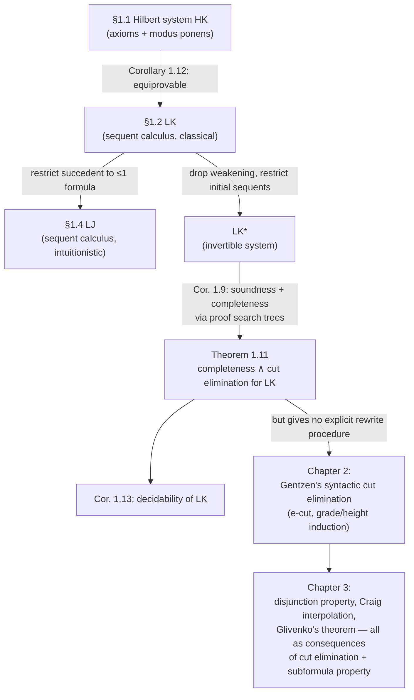

# Sequent Calculi for Classical and Intuitionistic Logic

[[book-guidelines|↩ Back to guidelines]]

## Why a formula alone isn't enough

Suppose you want to build a program that checks whether a logical argument is valid. The obvious first move is to write down formulas and a truth-table evaluator: given a formula with $m$ propositional variables, try all $2^m$ assignments, check the formula is $1$ on every one. This works — it's Ono's Lemma 1.1-and-converse territory — but it tells you *nothing about the argument's structure*. It answers "is this true," not "how would you actually derive this from these assumptions, step by step, using only local, mechanical moves." If you're building a theorem prover, the second question is the one that matters: you need a data structure that represents "a proof in progress" and a small set of rules for growing it, so that "provable" becomes "reachable by finitely many rule applications from a starting configuration" — a search problem a machine can attack.

That data structure is the **sequent**. Ono introduces two complementary formal systems in this chapter: a Hilbert-style system (axioms + one inference rule, modus ponens) and a sequent system (initial sequents + several rule families). Both prove exactly the tautologies of classical logic, but the sequent system is built for *proof search* in a way the Hilbert system fundamentally isn't — and understanding why is the throughline of the whole chapter.

## Hilbert systems: correct, but opaque to search

Ono first gives a Hilbert-style system $HK$ for classical logic (p. 4): one rule, modus ponens ("$\beta$ from $\alpha$ and $\alpha \to \beta$"), plus twelve axiom schemes — weakening, contraction, exchange, and double negation axioms among them, e.g.

$$\alpha \to (\beta \to \alpha) \quad \text{(left-weakening)}, \qquad \neg\neg\alpha \to \alpha \quad \text{(double negation)}.$$

Lemma 1.1 confirms soundness: every $HK$-provable formula is a tautology (each axiom scheme is a tautology, and modus ponens preserves tautology-hood).

**What breaks without more structure than this:** to prove something in $HK$, you have to *guess* which axiom instances and modus-ponens chains lead to your goal. There's no notion of "the goal formula tells you what to do next" — the system doesn't decompose along the syntax of the formula you're trying to prove. Compare a Rust type-checker built as "try every combination of typing-rule instantiations until one type-checks" versus one that pattern-matches on the AST node and dispatches to exactly one rule. Hilbert systems are the former. This is why Ono relegates $HK$ to a single illustrative section and moves immediately to sequent systems for everything that follows — $HK$ exists here mainly to be shown *equivalent* to the real workhorse, $LK$ (Corollary 1.12).

## The sequent: assumptions and goals as one object

A **sequent** is an expression

$$\alpha_1, \ldots, \alpha_m \Rightarrow \beta_1, \ldots, \beta_n$$

where the $\alpha_i$ (the **antecedent**) and $\beta_j$ (the **succedent**) are formulas, and the comma and $\Rightarrow$ are pure metalanguage — not logical connectives. Ono is explicit about the reading, and it's asymmetric in a way that trips people up on first contact:

- the antecedent is read **conjunctively**: $\alpha_1, \ldots, \alpha_m$ means "assuming $\alpha_1 \land \cdots \land \alpha_m$,"
- the succedent is read **disjunctively**: $\beta_1, \ldots, \beta_n$ means "$\beta_1 \lor \cdots \lor \beta_n$ follows."

So the whole sequent asserts $(\alpha_1 \land \cdots \land \alpha_m) \to (\beta_1 \lor \cdots \lor \beta_n)$. Two edge cases matter: an empty succedent, $\alpha_1,\ldots,\alpha_m \Rightarrow$, means "these assumptions are contradictory"; an empty antecedent, $\Rightarrow \beta_1,\ldots,\beta_n$, means "$\beta_1 \lor \cdots \lor \beta_n$ holds unconditionally." This is Ono's **corresponding formula** construction (Lemma 1.2, formalized on p. 12): a sequent is provable in $LK$ iff its corresponding formula $(\alpha_1 \land \cdots \land \alpha_m) \to (\beta_1 \lor \cdots \lor \beta_n)$ is provable as a formula (with the empty-antecedent/empty-succedent cases handled as $\neg(\ldots)$ and the bare disjunction, respectively, and the all-empty sequent standing for the falsum).

A **Rust** analogy that's exact rather than decorative: think of a sequent as a typing judgment with disjunctive *output* types — antecedent formulas are like a typing context `Γ: [Type]` (things you have), and succedent formulas are like a set of acceptable result types, any one of which discharges the goal. This is unusual from a programming-languages point of view (normally you check against *one* target type), and that oddity is precisely what makes the succedent worth tracking as a multiset rather than collapsing it early — Ono is setting up machinery where "how many things are in the succedent" becomes a meaningful, load-bearing quantity (this is exactly the fork point for $LJ$ below).

## LK: sequent system for classical logic

$LK$ (p. 7) has three components:

**Initial sequents.** Every sequent of the form $\alpha \Rightarrow \alpha$ is an axiom — read "$\alpha$ proves $\alpha$," trivially sound.

**Logical rules**, one left-rule and one right-rule per connective ($\lor, \land, \to, \neg$), each with one or two **upper sequents** and one **lower sequent**. E.g. for conjunction:

$$\frac{\alpha, \Gamma \Rightarrow \Pi}{\alpha \land \beta, \Gamma \Rightarrow \Pi}\,(\land_1{\Rightarrow}) \qquad \frac{\beta, \Gamma \Rightarrow \Pi}{\alpha \land \beta, \Gamma \Rightarrow \Pi}\,(\land_2{\Rightarrow}) \qquad \frac{\Gamma \Rightarrow \Lambda, \alpha \quad \Gamma \Rightarrow \Lambda, \beta}{\Gamma \Rightarrow \Lambda, \alpha \land \beta}\,({\Rightarrow}\land)$$

Terminology (p. 9): in a rule, the small-Greek-letter formulas ($\alpha, \beta$) that get consumed or produced are **active formulas**; the one explicitly written in the lower sequent ($\alpha \land \beta$ above) is the **principal formula**; everything else carried along unchanged ($\Gamma, \Pi, \Lambda$) is a **side formula**. This vocabulary is exactly what you need to describe *any* rule in *any* proof system uniformly, and it recurs constantly in Chapter 2's cut-elimination case analysis.

**Cut rule** — the odd one out, discussed on its own below.

**Structural rules** — exchange, contraction, weakening, left and right versions of each — which don't touch any connective; they only reshuffle, duplicate, or discard formulas:

$$\frac{\alpha,\alpha,\Gamma \Rightarrow \Pi}{\alpha, \Gamma \Rightarrow \Pi}\,(c{\Rightarrow}) \qquad \frac{\Gamma \Rightarrow \Pi}{\alpha, \Gamma \Rightarrow \Pi}\,(w{\Rightarrow})$$

Contraction says a hypothesis can be reused arbitrarily many times without penalty; weakening says an unused hypothesis can always be added for free. **What breaks without these as separate, explicit rules:** in ordinary informal mathematics you use a hypothesis as many times as you like and add irrelevant hypotheses without comment — those habits are invisible until you try to formalize "how many times was this assumption actually used," at which point you realize they're *rules*, not background facts, and a logic that drops one of them (as substructural logics do — flagged in the guidelines' Topic List item 5, a later chapter) behaves completely differently. This chapter is where that fact first becomes visible, even though Ono doesn't yet exploit it.

**A rare inference rule that is genuinely worth naming even though it's forbidden in a code fence:** the pattern "rule = upper sequent(s) over a horizontal bar over lower sequent, with a rule name at the right" is *notation*, not code — LaTeX, per the house style, not a fenced block. Read $(\land_1{\Rightarrow})$ as: "if $\alpha, \Gamma \Rightarrow \Pi$ is provable, then $\alpha \land \beta, \Gamma \Rightarrow \Pi$ is provable" — a sound, one-directional entailment between derivability facts.

A **proof** (Definition 1.1) is a finite tree: every leaf is an initial sequent, every internal node follows from its parent(s) by one rule application, and the root is the sequent being proved (the **end sequent**). This is *literally* an AST for a derivation, and every subtree is itself a valid proof of its own root (a **subproof**) — precisely the recursive structure you'd give an `Ast`/`Proof` type in Rust: an enum with one variant per rule, each variant holding boxed sub-proofs for its premises.

```rust
enum Proof {
    Initial { formula: Formula },                       // α ⇒ α
    AndLeft1 { premise: Box<Proof>, other: Formula },     // (∧1⇒)
    AndRight { left: Box<Proof>, right: Box<Proof> },     // (⇒∧)
    Cut { left: Box<Proof>, right: Box<Proof>, cut_formula: Formula },
    Contraction { premise: Box<Proof> },
    Weakening { premise: Box<Proof>, added: Formula },
    // … one variant per LK rule
}
```

This is not a strained illustration — it's close to literally how an interactive theorem prover's proof term or a resolution engine's derivation trace is represented, and it's the natural target shape for the checker/verifier project this book is being read for.

### Worked example: the distributive law

Ono works through a full $LK$-proof of $\alpha \land (\beta \lor \gamma) \Rightarrow (\alpha \land \beta) \lor (\alpha \land \gamma)$ (Example 1.2, p. 10). The shape is worth internalizing because it's the template for how *every* sequent proof looks: start from initial sequents $\alpha \Rightarrow \alpha$, $\beta \Rightarrow \beta$, weaken in the formulas you'll need later, combine with $(\Rightarrow \land)$ and disjunction-introduction rules, split on $\beta \lor \gamma$ with $(\lor{\Rightarrow})$, and finally use **contraction** to merge the two copies of $\alpha \land(\beta\lor\gamma)$ that accumulated on the left. That last contraction step is not cosmetic — it's exactly the kind of step that becomes the crux of [[Cut-Elimination|cut elimination]] in Chapter 2 (contraction acting on a cut formula is *the* obstruction Gentzen's proof has to work around).

## Cut rule: deduction as a rule, not a meta-theorem

$$\frac{\Gamma \Rightarrow \Lambda, \alpha \qquad \alpha, \Delta \Rightarrow \Pi}{\Gamma, \Delta \Rightarrow \Lambda, \Pi}\,(\text{cut})$$

Read with $\Lambda$ empty for simplicity: "if $\Gamma$ proves $\alpha$, and $\alpha$ together with $\Delta$ proves $\Pi$, then $\Gamma$ together with $\Delta$ proves $\Pi$." This is transitivity of entailment — chaining a lemma into a larger argument — turned into an object-level inference rule rather than left as an informal meta-theorem you'd prove once and use silently. Every mathematician uses this move constantly ("by the previous lemma, ... "); $LK$ makes it a first-class, explicitly-named rule, which is exactly what lets it later be *studied and eliminated* (Chapter 2) instead of just assumed safe.

## Multisets: making exchange disappear

Ono's "modified presentation" (p. 11) reinterprets $\Gamma$ and $\Delta$ throughout as **finite multisets** of formulas rather than sequences. A multiset $\{\alpha,\beta,\alpha\}$ equals $\{\beta,\alpha,\alpha\}$ but differs from $\{\alpha,\beta\}$ — order is irrelevant, multiplicity is not. Once sequents are built from multisets, the **exchange rule becomes redundant by definition**: there's no "wrong order" to permute out of, because order was never part of the data. This is a small move with an outsized methodological payoff — it strips one entire rule family out of every future case-analysis (Chapter 2's cut-elimination proof, in particular, would otherwise need an exchange case at every step) without losing any expressive power, since exchange was semantically inert anyway (Lemma 1.2 already reads antecedents/succedents as $\land$/$\lor$, which don't care about order). In a Rust implementation this is the difference between representing a context as `Vec<Formula>` (order matters, need explicit swap operations) versus a `Multiset<Formula>` / sorted `Vec` with a canonical ordering, or simply a `HashMap<Formula, usize>` counting multiplicities — the latter makes an entire rule of your proof system evaporate into "equality of representations."

## LK\*: an invertible system, and completeness by pure search

This is the chapter's engineering payoff. A rule is **invertible** (p. 14) when the upper sequent(s) are tautologies *if and only if* the lower sequent is — not just the "only if" direction ($LK$'s ordinary rules only guarantee soundness: upper tautology $\Rightarrow$ lower tautology). Some $LK$ rules genuinely aren't invertible: $(\Rightarrow \lor_2)$ takes $p \Rightarrow p$ (a tautology) to $p \Rightarrow p \lor q$ (also a tautology, fine) — but you could equally well have started from a *non*-tautology like $p \Rightarrow q$ and still landed on the tautology $p \Rightarrow q \lor p$... the point being that the lower sequent's truth doesn't pin down the upper sequent's truth. Right-$\lor$, left-$\land$, and left-$\to$ in $LK$ are all like this.

$LK^*$ (p. 14) fixes this by using genuinely reversible rule shapes — e.g. $LK^*$'s $(\Rightarrow \land)$ still needs both $\Gamma \Rightarrow \Delta, \alpha$ and $\Gamma \Rightarrow \Delta, \beta$, but its $(\lor {\Rightarrow})$, $(\land{\Rightarrow})$, and $({\to}{\Rightarrow})$ are reshaped so that *every* rule in the system is invertible in the strong two-way sense (Lemma 1.6).

**Why this matters — this is the "what problem does this solve" moment of the whole chapter:** invertibility means you can run every rule *backward* without ever needing to guess or backtrack. Read a compound formula, apply the (unique) rule that decomposes its main connective in reverse, and repeat — this generates a **proof search tree** deterministically (up to don't-care order of subgoals) until every leaf is **elementary**: a sequent $p_1,\ldots,p_m \Rightarrow q_1,\ldots,q_n$ built entirely from propositional variables. An elementary sequent is a tautology exactly when some variable appears on both sides (Lemma 1.8) — a trivial syntactic check. Because invertibility is two-directional, **the whole tree is a tautology iff every leaf is** (Corollary 1.7), so soundness-and-completeness of $LK^*$ (Corollary 1.9) falls out for free: no semantic argument beyond checking initial sequents is needed, only backward rule application until you hit variables.

This is precisely what a naive recursive-descent tautology checker does, and Ono's own worked examples make it concrete:

$$\cfrac{p \Rightarrow p, q}{\cfrac{\Rightarrow p, p \to q \qquad p \Rightarrow p}{(p \to q) \to p \Rightarrow p}}$$

is the unique (because every rule was invertible — no choices to make) proof search tree for $(p \to q) \to p \Rightarrow p$, terminating in two elementary sequents that are each trivially tautologies.

```python
# Illustrative sketch only — not load-bearing, real search lives in the Rust checker.
def search(seq):
    if is_elementary(seq):
        return all(shared_var(seq.antecedent, seq.succedent))
    rule, premises = decompose_main_connective(seq)  # unique choice: LK* is invertible
    return all(search(p) for p in premises)
```

Termination is guaranteed structurally: every $LK^*$ rule strictly decreases the total connective count from lower to upper sequent (p. 15), so the tree is always finite — this is a classic well-founded-recursion argument, the same one that justifies structural recursion on an AST terminating in Rust or Lean.

## Theorem 1.11: completeness and cut elimination for LK, in one shot

Ono chains three auxiliary systems — $LK_1$ (initial sequents restricted to variables, weakening merged into one schematic rule), $LK_2$ (weakening dropped entirely, initial sequents of the stronger form $p, \Gamma \Rightarrow \Delta, p$) — each shown equiprovable with $LK$ (Lemmas 1.4, 1.5), and each transformation preserving cut-freeness. Composing the chain: a tautology has an $LK^*$ proof (Corollary 1.9) $\to$ that translates to a **cut-free** $LK_2$ proof (since $LK^*$'s three non-primitive rules can be simulated in $LK_2$ purely structurally, Exercise 1.10) $\to$ which is a cut-free $LK$ proof. This yields **Theorem 1.11**, three-way equivalent for any sequent $S$:

1. $S$ is provable in $LK$,
2. $S$ is a tautology,
3. $S$ is provable in $LK$ *without using cut*.

The remarkable thing is that (1)$\Leftrightarrow$(3) — cut elimination — falls out as a corollary of a semantic completeness argument, with no explicit rewriting-of-proofs procedure at all. Ono flags this himself (p. 18): this proof tells you cut is *always eliminable*, but not *how* to eliminate it from an arbitrary given proof — that's the job of Gentzen's original, syntactic, procedure-producing proof, which is Chapter 2's entire subject. Corollary 1.13 (**decidability**) is the other immediate payoff: the same search procedure that builds a proof search tree either succeeds (giving a cut-free proof) or fails at some non-tautological elementary leaf (giving a falsifying assignment directly) — so provability in $LK$ is a decidable problem with an explicit algorithm, not just an abstract fact.

## LJ: intuitionistic logic by restricting the succedent

Now the payoff for having tracked succedent-cardinality as a real quantity all along. Brouwer's constructive standpoint (informally, p. 19): to prove $\alpha \lor \beta$ you must exhibit *which* disjunct holds and prove it (the **disjunction property**); to prove $\alpha \to \beta$ you need an actual transformation from proofs-of-$\alpha$ to proofs-of-$\beta$. Consequently the law of excluded middle $\alpha \lor \neg\alpha$ and double negation elimination $\neg\neg\alpha \to \alpha$ are *not* accepted as general principles — Ono gives the classical non-constructive existence proof (irrational $s,t$ with $s^t$ rational, via case-splitting on whether $\sqrt2^{\sqrt2}$ is rational, Example 1.7) as a concrete instance of a proof that establishes existence without ever producing a witness.

Gentzen's insight, and the single cleanest idea in the whole chapter: **you get intuitionistic logic from classical logic by a purely structural restriction, not by deleting or modifying any logical rule's content.** $LJ$'s sequents (p. 20) take the form

$$\alpha_1,\ldots,\alpha_m \Rightarrow \beta$$

with $\beta$ a single formula *or empty* — never more than one succedent formula. Every $LJ$ rule is literally the corresponding $LK$ rule with $\Pi$ pinned to "at most one formula" and $\Lambda$ pinned to empty. Concretely, this changes exactly two rules' shape (implication-right and negation-right go from "$\Gamma \Rightarrow \Lambda, \alpha \to \beta$" style to a single-succedent-only "$\Gamma \Rightarrow \alpha \to \beta$"), and the rest are unchanged in *statement*, only in what they're allowed to range over.

**This is the answer to Key Question 1 in the guidelines**, and it's worth stating precisely: the loss of excluded middle and double negation isn't stipulated by an axiom deletion (as it is, cruder, in $HJ$ = $HK$ minus one axiom scheme) — it *falls out* of no longer being able to carry two succedent formulas ($\alpha$ and $\neg\alpha$, say) side by side through a proof. You can check directly (Lemma 1.15 + its converse failing, Exercise 1.2/1.11 comparison) that any $LK$ proof which *happens* to keep every sequent single-succedent throughout is automatically a valid $LJ$ proof — intuitionistic provability is exactly "classical provability witnessed by a single-succedent-respecting derivation," a purely structural, checkable condition on the *shape* of the proof rather than a semantic side-condition bolted on afterward.

The multi-succedent variant $LJ_m$ (Remark 1.9, p. 22) shows this restriction can be relaxed back to $\to$ and $\neg$'s right-rules alone (keeping other rules multi-succedent) and still characterize the same logic — evidence that the single-succedent shape isn't sacred syntax, it's one convenient encoding of "at most one thing can be concluded outright" among several equivalent ones.

### Lean angle: this is proof-relevant discipline, for free

If your target is a bidirectional elaborator or a bidirectional type checker, $LJ$'s single-succedent restriction should look immediately familiar: it's the sequent-calculus cousin of **checking mode having exactly one target type**, versus **inference mode** potentially exploring a disjunction of candidates. A single-succedent judgment $\Gamma \Rightarrow \beta$ *is* a checking judgment `Γ ⊢ e ⇐ β`; $LK$'s multi-succedent judgments have no clean checking/inference reading precisely because "prove one of these $n$ things" isn't a mode a type checker normally has. This is also, not coincidentally, why constructive type theories (Martin-Löf-style, the ancestor of Lean's kernel) build naturally on intuitionistic rather than classical logic: a term of type $A \lor B$ *must* carry a tag saying which side and a witness for that side — exactly Brouwer's disjunction property, now showing up as `Sum.inl`/`Sum.inr` rather than as a proof-theoretic restriction on sequent shape.

## Corresponding formula, precisely

Worth flagging as its own small idea (Key Question 3 in the guidelines) because it's easy to blur: "the sequent $\Gamma \Rightarrow \Delta$ is provable" and "the corresponding formula $\bigwedge\Gamma \to \bigvee\Delta$ is provable [as a formula, i.e. the sequent $\Rightarrow \bigwedge\Gamma \to \bigvee\Delta$ is provable]" are equivalent (Lemma 1.2) but are not *notationally* the same claim, and the distinction only becomes visible once succedents can hold more than one formula — for a single-succedent ($LJ$-shaped) sequent, "provable sequent" and "provable formula" coincide trivially, but for $LK$ a multi-formula succedent is genuinely doing extra bookkeeping work (tracking a disjunction of *live goals* rather than one committed goal) that only gets collapsed into an actual $\lor$ when you explicitly form the corresponding formula.

## Where this leads



Everything downstream in Part I leans on the sequent-vs-formula, $LK$-vs-$LJ$, cut-vs-cut-free distinctions set up here. The multiset convention silently removes exchange from every future proof. The active/principal/side-formula vocabulary is reused verbatim in Chapter 2's case analysis. And Theorem 1.11's *semantic* completeness-and-cut-elimination proof is explicitly a warm-up Ono intends to be superseded: Chapter 2 redoes cut elimination *syntactically*, via the extended cut rule and a double induction on grade and height, precisely because that version generalizes to $LJ$ and to systems (modal, substructural) that have no invertible-system shortcut available.

For the standing project: the $LK/LJ$ distinction is the direct proof-theoretic ancestor of checking-vs-inference bidirectional typing, and $LK^*$'s invertible, backward-chaining proof search is close to literally the control-flow skeleton a small automated prover embedded in a Rust verifier would run — deterministic decomposition down to atomic (elementary) goals, with backtracking needed only where a rule genuinely isn't invertible (which, as this chapter shows, is exactly the rules whose $LK^*$-reshaping was the whole point).
