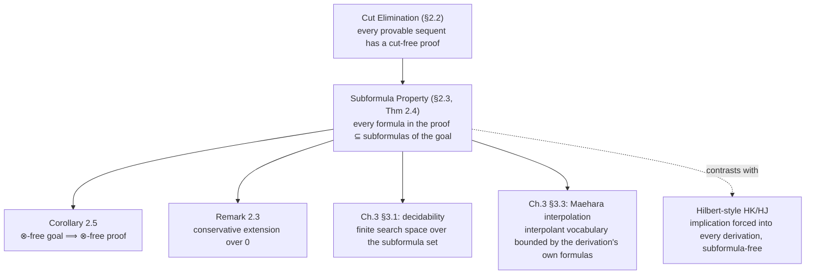

# The Subformula Property as a Consequence of Cut Elimination

[[book-guidelines|↩ Back to guidelines]]

## What you'd lose without it

Take any proof of a sequent $S$ that's allowed to use cut. Somewhere in that proof there can be a step

$$
\dfrac{\Gamma \Rightarrow \alpha \qquad \alpha, \Delta \Rightarrow \varphi}{\Gamma, \Delta \Rightarrow \varphi} \;\text{(cut)}
$$

and $\alpha$ — the *cut formula* — is completely unconstrained. It doesn't have to be related to anything in $S$ at all; it's a lemma you pull in, use once, and discard. That's exactly what makes cut a natural rule to reason with (it's how mathematicians actually write proofs — "by Lemma 7...") and exactly what makes a proof containing cut computationally opaque from the outside. If you're staring at $S$ and asking "is this provable, and if so how," a cut-containing proof gives you no bound on where to look: $\alpha$ could be any formula in the language, of any size, about any vocabulary.

[[Cut-Elimination]] establishes that this detour is never *necessary* — every LK/LJ-provable sequent has a cut-free proof. This note is about the one-paragraph theorem that turns that fact into something much stronger: not just "you don't need cut," but "once you don't have it, every single formula anywhere in the proof is a piece of what you're trying to prove." That second statement is the **subformula property**, and it's the reason cut elimination is worth an entire chapter rather than being a curiosity about proof length.

## Definition 2.2 — what the property actually says

> **Definition 2.2 (Subformula property).** A proof $P$ of a sequent $S$ in LK (or LJ) has the subformula property if every formula appearing in $P$ is a subformula of a formula in $S$. A sequent system $L$ *has* the subformula property when every sequent provable in $L$ has a proof in $L$ with this property.

Read the two clauses separately, because they're doing different work. The first is a property of one specific proof tree: walk every sequent in the tree, look at every formula occurring in it, and check each one is a subformula (not necessarily proper — $S$ itself counts) of some formula sitting in the end sequent $S$. The second lifts this to a property of the whole calculus: LK has the subformula property not because *every* proof obeys it (a proof that pointlessly cuts on an unrelated lemma still exists as an object), but because *whenever* a sequent is provable at all, *at least one* witnessing proof obeys it. It's an existence claim about proof search, not a claim about every derivation you could write down.

## Theorem 2.4 — why the proof is almost free

> **Theorem 2.4.** Each of the sequent systems LK and LJ has the subformula property.

Ono's proof is genuinely short, and it's worth seeing exactly why it's short, because the shortness is the point:

> *Proof.* Suppose $S$ is provable in LK (LJ). By Theorem 2.2 (Theorem 2.1) — the cut elimination theorems — $S$ has a cut-free proof $P$. It is easily seen that for each rule $J$ of LK (LJ) **except cut**, every formula in an upper sequent of $J$ appears as a subformula of a formula in the lower sequent. Thus, by induction on the length of $P$, every formula appearing in $P$ is a subformula of a formula in $S$. $\blacksquare$

Unpack the load-bearing sentence: *every rule except cut already respects subformulas locally.* Check this rule by rule and it's almost bookkeeping:

- **Initial sequents** $\alpha \Rightarrow \alpha$: nothing above them, nothing to check.
- **Structural rules** (weakening, contraction, exchange): by construction they only duplicate, delete, or reorder formulas that are *already present*. Weakening's premise $\Gamma \Rightarrow \varphi$ has strictly *fewer* formulas than its conclusion $\alpha, \Gamma \Rightarrow \varphi$ — trivially every formula above is a subformula of one below, since it's literally the same formula.
- **Logical rules**, e.g. $(\wedge \Rightarrow)$: $\dfrac{\alpha, \Gamma \Rightarrow \varphi}{\alpha \wedge \beta, \Gamma \Rightarrow \varphi}$. The premise contains $\alpha$, and $\alpha$ is a subformula of the conclusion's $\alpha \wedge \beta$ — that's what "principal formula" *means* for these rules. Every left and right rule for $\wedge, \vee, \to, \neg$ has exactly this shape: the premise's new material is a piece of the conclusion's principal formula, by construction. This is not a fact you have to prove about the rules; it's how the rules were *defined* back in Chapter 1.
- **Cut**, the sole exception: $\alpha$ appears in both premises, but need not appear in the conclusion $\Gamma, \Delta \Rightarrow \varphi$ at all. This is the only rule in the entire system where the induction step can fail.

So the "theorem" reduces to: take that one property — *upper-sequent formulas are subformulas of lower-sequent formulas, rule by rule* — which holds for everything except cut, remove cut (courtesy of the previous chapter), and chain the local property up the tree by ordinary structural induction on proof length. The formula in $S$ that any given formula in $P$ traces back to is found by literally walking down the proof from where that formula occurs to the end sequent, one rule application at a time, never losing the subformula relationship because no rule on the path is a cut.

This is worth pausing on precisely because it's *so* easy once cut elimination is granted — that ease is exactly the payoff of the whole double-induction argument in §2.2. The hard theorem was "cut can always be removed." This theorem is "removing cut is enough," and once you see the rule-by-rule fact above, there was really nothing left to prove.

## Corollary 2.5 — pruning the rule set, not just the proof

The subformula property isn't just a fact about which formulas can occur — it's a fact about which *rules* can occur, and this is where it starts paying rent immediately:

> **Corollary 2.5.** Let $\otimes$ be any logical connective. For any sequent $S$ not containing $\otimes$, if $S$ is provable in LK (LJ), then $S$ has a proof in LK (LJ) in which no rules for $\otimes$ are used.

Why this follows immediately: a rule for $\otimes$ only ever introduces $\otimes$ as a principal formula, and every principal formula introduced anywhere in a cut-free proof of $S$ is (by Theorem 2.4) a subformula of something in $S$. If $S$ doesn't mention $\otimes$, none of its subformulas mention $\otimes$ either, so no rule that introduces $\otimes$ could ever fire in a subformula-respecting proof of $S$. Ono's own example: the cut-free proof of the distributive law $\alpha \wedge (\beta \vee \gamma) \Rightarrow (\alpha \wedge \beta) \vee (\alpha \wedge \gamma)$ (Example 1.2, revisited as Example 2.2) uses *only* $\wedge$- and $\vee$-rules plus structural rules — never $\to$ or $\neg$, because the sequent itself never mentions them.

**The contrast Ono draws explicitly, and why it matters.** He flags this as "a big contrast to proofs in Hilbert-style systems in which implication plays a special and multiple role." A Hilbert-style proof of that same distributive law — built from axiom schemes and modus ponens — is essentially forced to route through implication at every step, even though the target sequent has nothing to do with $\to$: axiom schemes are themselves stated as implications, and modus ponens *is* an implication-elimination rule. There's no way to prove a $\to$-free theorem in HK without implication showing up as scaffolding throughout the derivation. Sequent calculus, once cut is gone, has no such scaffolding requirement — the proof genuinely stays inside the vocabulary of what's being proved. This is one of the cleanest illustrations in the book of *why* Gentzen-style systems are considered more "analytic" than Hilbert-style ones: analyticity, in the proof-theoretic sense, means exactly this — a proof of $S$ only ever touches the pieces $S$ is made of.

## Remark 2.3 — conservative extension, for free again

The same machine gives you a second theorem almost as cheaply. Extend LK/LJ with a new logical constant $0$ (read as falsum), governed by the single initial sequent $0 \Rightarrow{}$ (nothing else — no introduction or elimination rule needed, since $0$ is a nullary connective whose only job is to sit on the left and immediately close a branch). Call the extended systems $\mathrm{LK}_0, \mathrm{LJ}_0$. Cut elimination for these extended systems goes through by exactly the same double-induction argument as before (the new initial-sequent form doesn't disturb any of the four cases in §2.2), so Theorem 2.4 applies to them too.

Now run Corollary 2.5's argument with $\otimes = 0$:

> If a sequent $S$ doesn't contain $0$, and $S$ is provable in $\mathrm{LK}_0$ ($\mathrm{LJ}_0$), then $S$ is already provable in LK (LJ) — the constant was never needed.

This is a **conservative extension** result: adding $0$ to the language and to the proof system doesn't let you prove any *new* $0$-free sequent. It's a genuinely useful guarantee whenever you extend a logic with auxiliary machinery (a new constant, a defined connective, an axiom scheme introduced for convenience) — you want assurance that the extension is inert with respect to the fragment you already cared about, and here that assurance costs nothing beyond the subformula property you already have.

## Grounding: subformula-bounded proof objects as a trusted-kernel design pattern

The subformula property is exactly the invariant you want if you're building anything that has to *check* proofs rather than just search for them — which is squarely the standing-project territory of a proof-producing verifier with a small trusted kernel.

**Rust — computing the subformula closure as a static bound on a proof-search or checking pass.** If you're writing a sequent-calculus checker (or a bounded prover, or a saturation-style rule engine), the subformula property tells you the *entire* space of formulas any valid cut-free derivation of a goal could ever touch is computable in advance, before you run any search:

```rust
use std::collections::HashSet;

// The subformula closure of a goal sequent: every rule application in a
// cut-free proof of `goal` can only ever mention formulas from this set
// (Theorem 2.4). This is what makes proof *search* boundable, and what
// makes proof *checking* able to reject any step touching a formula
// outside the closure without inspecting the rest of the derivation.
fn subformula_closure(goal: &Sequent) -> HashSet<Formula> {
    let mut closure = HashSet::new();
    let mut stack: Vec<Formula> = goal.antecedent.iter()
        .chain(goal.succedent.iter())
        .cloned()
        .collect();
    while let Some(f) = stack.pop() {
        if !closure.insert(f.clone()) { continue; }
        match f {
            Formula::And(a, b) | Formula::Or(a, b) | Formula::Implies(a, b) => {
                stack.push(*a);
                stack.push(*b);
            }
            Formula::Not(a) => stack.push(*a),
            Formula::Atom(_) | Formula::Zero => {}
        }
    }
    closure
}

// A checker can now reject any inference whose principal formula falls
// outside the closure in O(1) — a direct, executable form of Corollary 2.5.
fn rule_is_admissible(rule: &Rule, closure: &HashSet<Formula>) -> bool {
    rule.principal_formulas().iter().all(|f| closure.contains(f))
}
```

Two things worth noticing about this design. First, `subformula_closure` is exactly the pruning Corollary 2.5 licenses at the level of *connectives*, not just formulas: if `goal` never contains `Formula::Implies`, the closure never contains an implication formula, so `rule_is_admissible` silently disables every $\to$-rule for that goal — you get the "don't bother searching with rules you don't need" optimization as a direct corollary of the theorem, not as a hand-tuned heuristic. Second, this is a genuinely *checker*-shaped use of the property, not just a search-shaped one: a proof certificate that only ever cites formulas from a precomputed closure is machine-verifiable in a way a certificate that can invoke arbitrary auxiliary lemmas is not — which is precisely the trusted-computing-base concern that motivates keeping a verification kernel small. [[Proof-Theoretic-Consequences-of-Cut-Elimination]] develops the search side of this in full (§3.1's reduced-proof decidability argument is the direct continuation of `subformula_closure` into a terminating decision procedure).

**Lean — bidirectional checking as the subformula property in disguise.** There's a structural analogy worth naming precisely because it's easy to miss: Lean's bidirectional elaborator has a *checking* mode (`elabTermEnsuringType`, roughly) that, given an expected type, only ever needs to look inside the syntactic shape of that expected type to decide what elaboration obligations to generate — it doesn't go hunting through the environment for an unrelated auxiliary type to unify against first. That's the elaboration-side echo of "cut-free proofs never introduce an unrelated formula and discard it later." The place this *breaks* is instructive too: **inference mode**, where the elaborator has to synthesize a type from a term with no expected type in hand, is closer to a proof *with* cut — it may need to consult definitions, instance search, or unification with a metavariable whose eventual solution isn't yet visible anywhere in the syntax you started from. Corollary 2.5's pruning has a direct elaboration-engineering analogue too: an elaborator that knows a goal's expected type contains no instance-implicit arguments can skip typeclass resolution entirely for that goal, the same way a subformula-bounded checker skips $\otimes$-rules for a $\otimes$-free sequent.

## Where this leads



Everything in Chapter 3 that Ono calls "proof-theoretic" rather than "semantic" leans on this one theorem, not on cut elimination directly — decidability (§3.1) needs the subformula set to be *finite* so backward search terminates; the disjunction property (§3.2) argument works by eliminating cases via exactly this property (a proof of $\Rightarrow \alpha \vee \beta$ can't end in weakening, because that would need a proof of the empty sequent, and the subformula property forbids that outright); Maehara's interpolation method (§3.3) synthesizes an interpolant whose vocabulary is controlled precisely because the derivation it's read off of never mentions anything outside the goal's own formulas. [[Proof-Theoretic-Consequences-of-Cut-Elimination]] is where those three payoffs get worked out in full; this note is about the one lemma all three of them cite.

For the standing project, the load-bearing idea to carry forward is this: **a small trusted kernel and a subformula-bounded proof object are the same design goal stated two ways.** Any time a verifier's kernel needs to check a derivation without re-deriving it, the property you actually want is "nothing in this derivation can smuggle in vocabulary from outside the goal" — that's what makes a proof checker's job local and syntactic instead of requiring it to re-run a whole search or trust an external oracle. Cut elimination is the *existence* argument (a proof-search engine, or an elaborator, never strictly needs to introduce unrelated intermediate lemmas); the subformula property is the *checking* argument (once it doesn't, a much dumber piece of code can verify that it didn't) — and a proof-producing architecture generally wants both, for different components of the pipeline.
