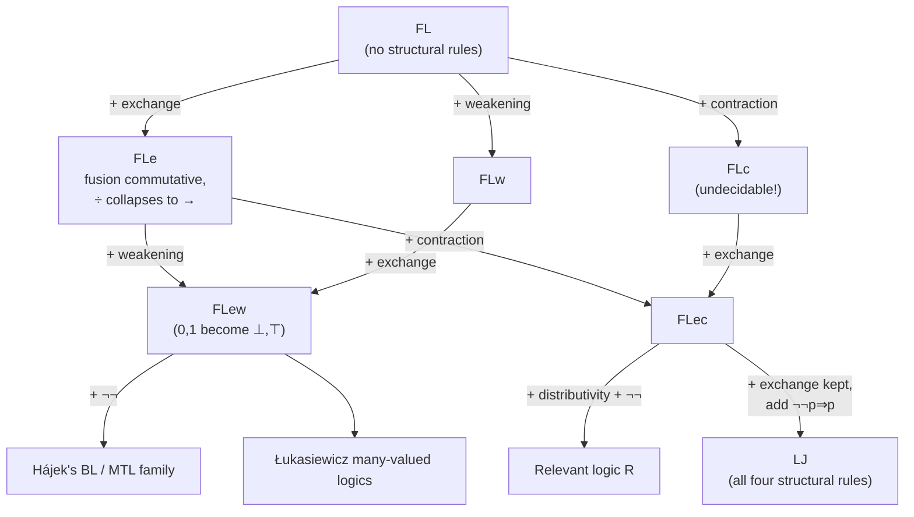

# Substructural Logics: Proof-Theoretic View

[[book-guidelines|↩ Back to guidelines]]

## What breaks if you take structural rules for granted

Up to this point in the book, the structural rules — exchange, contraction, weakening — have been treated the way a compiler treats garbage collection: always on, invisible, not part of the "real" logic. LJ and LK both have all three. Every proof you've seen so far has been allowed to reorder assumptions freely (exchange), use an assumption as many times as it wants (contraction), and throw assumptions away it doesn't need (weakening).

Ono's move in §4.2 is to stop treating these as bookkeeping and ask what each one is actually *doing*. His own gloss: exchange lets you use assumptions "in an arbitrary order," contraction lets you use "any formula in the assumptions more than once," and weakening lets you "ignore some formulas in the assumption." Once you say it that way, it's obvious these aren't neutral plumbing — they're a *policy* for how assumptions get consumed. And policies can be dropped. What happens to a logic if you drop one?

The book's example for why this isn't academic: the distributive law from Chapter 1 (Example 1.2) is provable in LJ only *because* contraction and weakening are both available — remove either one from LJ and the distributive law stops being provable. So which structural rules a system has is not incidental to what the system can prove; it's load-bearing.

This is the entry point into **substructural logics**: logics obtained from LJ (or LK) by deleting some or all of the structural rules.

## The comma stops meaning "and"

Here's the sharpest way to see what's at stake. In a sequent

$$\alpha_1, \ldots, \alpha_m \Rightarrow \beta,$$

what does the comma between the $\alpha_i$ actually *mean*? In LJ, the book shows this sequent is provable iff

$$\alpha_1 \land \cdots \land \alpha_m \Rightarrow \beta$$

is provable — but that equivalence only goes through *because* LJ has both contraction and left-weakening. Contraction is what lets you collapse two uses of the same assumption into one (matching $\alpha \land \alpha \Leftrightarrow \alpha$); weakening is what lets you discard an assumption you don't end up needing (matching the fact that $\alpha \land \beta \Rightarrow \alpha$ throws away $\beta$). Take either rule away and the comma can no longer be read as conjunction — provability of the sequent and provability of the conjoined formula come apart.

So: comma-as-conjunction is not a fact about sequents in general. It's a fact about sequents *in the presence of contraction and weakening specifically*. Without those, the comma needs its own semantics, and that's what forces a new connective into the language.

### Fusion: multiplicative conjunction

Ono introduces **fusion**, written $\cdot$, with rules

$$
\frac{\Gamma \Rightarrow \alpha \quad \Delta \Rightarrow \beta}{\Gamma, \Delta \Rightarrow \alpha \cdot \beta}\,(\Rightarrow\!\cdot)
\qquad
\frac{\Sigma, \alpha, \beta, \Delta \Rightarrow \phi}{\Sigma, \alpha \cdot \beta, \Delta \Rightarrow \phi}\,(\cdot\!\Rightarrow)
$$

Fusion is associative (both directions of $(\alpha\cdot\beta)\cdot\gamma \Leftrightarrow \alpha\cdot(\beta\cdot\gamma)$ are provable), so parentheses get dropped and you just write $\alpha\cdot\beta\cdot\gamma$. With fusion, cut, and *no structural rules at all*, the original sequent (4.1) turns out provable iff

$$\alpha_1 \cdot \alpha_2 \cdots \alpha_m \Rightarrow \beta$$

is provable. In other words: **the comma is always fusion**. Whether fusion happens to coincide with ordinary ($\land$) conjunction is a separate question that depends on which structural rules you add back in.

Ono is careful to flag that fusion is sometimes called *multiplicative conjunction*, with ordinary $\land$ then relabeled *additive conjunction* — terminology carried over wholesale from Girard's linear logic, which this section is quietly building toward.

### Why they differ: the $25 example

The book gives Girard's resource-reading example, which is worth internalizing precisely because it's the intuition every subsequent substructural-logic result is implicitly leaning on:

- $\alpha$ = "one has \$25"
- $\beta$ = "one can get this paperback" (costs \$25)
- $\gamma$ = "one can have lunch at that restaurant" (also costs \$25)

Both $\alpha \Rightarrow \beta$ and $\alpha \Rightarrow \gamma$ hold. With fusion: $\alpha \cdot \alpha \Rightarrow \beta \cdot \gamma$ is derivable (having \$50 buys the book *and* the lunch), but $\alpha \Rightarrow \beta \cdot \gamma$ is **not** (\$25 alone can't fund both). With ordinary conjunction: $\alpha \Rightarrow \beta \land \gamma$ *is* derivable — read correctly, this says "if you have \$25, you can get the book, and [separately, in another possible use of the same \$25] you can have lunch" — i.e. *either option is available*, not both simultaneously. Raise the lunch price to \$30 and $\alpha \Rightarrow \beta \land \gamma$ breaks (you can no longer guarantee the lunch option), while $\alpha \Rightarrow \beta \lor \gamma$ still holds.

This is the resource-consumption reading: once a resource is spent it's gone, and $\land$ vs. $\cdot$ diverge exactly on whether a single \$25 gets "reused" (additive, contraction-flavored) or genuinely consumed once per use (multiplicative, no contraction).

**What breaks without fusion:** without it, a system lacking contraction or weakening has no connective at all that faithfully represents "comma" — you'd either be forced to smuggle contraction/weakening back in through the semantics of $\land$, or lose the ability to talk about combining antecedents at all. Fusion is what lets the syntax stay honest about resource use.

```python
# A resource-counting sketch, not a formal model: fusion tracks *how many*
# units of a resource a derivation actually consumes, additive conjunction
# does not.
def has_fusion(resources, cost_a, cost_b):
    # alpha . alpha => beta . gamma: needs cost_b + cost_g total
    return resources >= cost_a + cost_b

def has_conjunction(resources, cost_a, cost_b):
    # alpha => beta & gamma: needs enough for *either*, not both at once
    return resources >= max(cost_a, cost_b)
```

## FL: the system with no structural rules at all

§4.3 assembles the substructural family systematically, starting from the floor: **FL**, the *full Lambek calculus*, obtained from LJ by deleting exchange, contraction, *and* weakening simultaneously. FL sequents are still single-succedent — $\Gamma \Rightarrow \phi$ — but $\Gamma$ is now a genuine *sequence*, not a multiset: order matters, because there's no exchange rule to permute it.

### Two implications, because order is real

This is where the chapter's central proof-theoretic insight lands. In LJ, $\alpha \to \beta$ is a single connective because $\alpha, \Gamma \Rightarrow \beta$ and $\Gamma, \alpha \Rightarrow \beta$ are interchangeable — exchange erases the distinction between "assumption on the left" and "assumption on the right" of $\Gamma$. Drop exchange and that distinction becomes real: an antecedent sequence $\alpha, \Gamma$ is not the same object as $\Gamma, \alpha$. So FL is *forced* to split implication into two connectives, **left-division** $\alpha\backslash\beta$ and **right-division** $\beta/\alpha$ (terminology borrowed deliberately from group theory — see the ordered-group analogy below):

$$
\frac{\alpha, \Gamma \Rightarrow \beta}{\Gamma \Rightarrow \alpha\backslash\beta}\,(\Rightarrow\backslash)
\qquad
\frac{\Gamma \Rightarrow \alpha \quad \Sigma, \beta, \Delta \Rightarrow \theta}{\Sigma, \Gamma, \alpha\backslash\beta, \Delta \Rightarrow \theta}\,(\backslash\!\Rightarrow)
$$
$$
\frac{\Gamma, \alpha \Rightarrow \beta}{\Gamma \Rightarrow \beta/\alpha}\,(\Rightarrow\!/)
\qquad
\frac{\Gamma \Rightarrow \alpha \quad \Sigma, \beta, \Delta \Rightarrow \theta}{\Sigma, \beta/\alpha, \Gamma, \Delta \Rightarrow \theta}\,(/\!\Rightarrow)
$$

Read $\alpha\backslash\beta$ as "what you still need on the *right* of an $\alpha$ to reach $\beta$" and $\beta/\alpha$ as "what you still need on the *left* of an $\alpha$ to reach $\beta$" — the slash literally points at which side $\alpha$ has to sit on. Lemma 4.6 makes this precise: $\alpha, \Gamma \Rightarrow \beta$ is provable iff $\Gamma \Rightarrow \alpha\backslash\beta$ is, and $\Gamma, \alpha \Rightarrow \beta$ iff $\Gamma \Rightarrow \beta/\alpha$.

The book flags the exact algebraic shadow of this (Remark 4.4): in an ordered group, $x \cdot y \le z \iff y \le x^{-1}\cdot z$ and $x \cdot y \le z \iff x \le z \cdot y^{-1}$. Division in FL *is* residuation in the algebraic sense — $\backslash$ and $/$ are literally the left and right residuals of fusion, the same relationship $-$ has to $+$ except fusion isn't commutative so there are two of them. This is worth sitting with: the reason FL needs two implications isn't a quirk of proof search, it's that fusion is a genuine (possibly noncommutative) monoid operation, and residuation of a noncommutative operation always splits into two residuals. Once you add exchange back (system FLe below), fusion becomes commutative, the two residuals collapse into one, and you recover ordinary $\to$.

FL also carries two logical constants, $0$ (initial sequent $0 \Rightarrow{}$, "the empty right side") and $1$ (initial sequent ${}\Rightarrow 1$, "the empty left side"), with weakening-flavored rules $(0w)$, $(1w)$ that become redundant once you actually have the corresponding weakening rule. These give FL two negations: $\sim\!\alpha := \alpha\backslash 0$ and $\lnot\alpha := 0/\alpha$ — again split in two for exactly the same order-sensitivity reason implication was.

### The family tree: adding structural rules back one at a time

FL is the base case; every other basic substructural logic is FL plus some subset of the structural rules, restated here for single-succedent sequents:

- **(e) exchange** — $\Gamma,\alpha,\beta,\Delta\Rightarrow\phi$ / $\Gamma,\beta,\alpha,\Delta\Rightarrow\phi$
- **(c) contraction** — $\Gamma,\alpha,\alpha,\Delta\Rightarrow\phi$ / $\Gamma,\alpha,\Delta\Rightarrow\phi$
- **(i) left weakening** — $\Gamma,\Delta\Rightarrow\phi$ / $\Gamma,\alpha,\Delta\Rightarrow\phi$
- **(o) right weakening** — $\Gamma\Rightarrow{}$ / $\Gamma\Rightarrow\alpha$



Once you add exchange (giving **FLe**), fusion becomes commutative and, as noted, $\alpha\backslash\beta$ and $\beta/\alpha$ become interderivable — you're licensed to write plain $\to$ and $\lnot$ again. Add weakening on top of FLe (**FLew**) and the constants $0, 1$ become genuinely the weakest/strongest formulas — relabeled $\bot, \top$. **FLw** and **FLc** add weakening/contraction without exchange first (order still matters). **FLec** is FLe plus contraction.

## Cut elimination and decidability: where the family splits

This is the section's payoff, and it's a genuinely important proof-theoretic fact: **the structural rules you keep determine whether [[Cut-Elimination|cut elimination]] even holds.**

**Theorem 4.7 (Ono):** Cut elimination holds for FL, FLe, FLw, FLew, and FLec. Consequently they all have the subformula property. For FL/FLe/FLw/FLew, ordinary cut elimination goes through directly (no need for the e-cut trick from Chapter 2, because there's no contraction to create the "deadlock case"); FLec needs e-cut elimination first, exactly as LJ did.

**Theorem 4.8:** FL, FLe, FLw, FLew are decidable — and for a cleaner reason than LJ's decidability proof in Chapter 3. Since none of these systems has contraction, *every* rule application shrinks the sequent (each premise is strictly shorter than the conclusion), so backward proof search terminates trivially — no loop-checking, no "reduced proof" machinery needed at all. This is the single biggest practical payoff of dropping contraction: proof search becomes structurally well-founded for free.

**Theorem 4.9:** FLec (has contraction, via a different route) is still decidable — but non-trivially. The implicational fragment was settled by Kripke (1959) with an "ingenious combinatorial method"; Ono states the full result without reproducing the proof.

**Theorem 4.10, the sharp negative result:** cut elimination *fails* for FLc (contraction without exchange), and — critically — this isn't just a proof-search inconvenience that a cleverer cut-free system might route around. Chvalovský and Horčik (2016) showed **FLc is outright undecidable**. So the presence of exchange isn't cosmetic: contraction interacts with a noncommutative fusion in a way that genuinely escapes decidability, whereas contraction plus commutativity (FLec) stays decidable. This is exactly the kind of result the book's Chapter Summary flags as a "key question" — why contraction-without-exchange crosses a hard boundary that contraction-with-exchange doesn't.

### Worked proof search (Example 4.5)

The book walks through deciding $p \to q,\ r \to p \Rightarrow r \to q$ in FLe by pure backward search — this is the mechanism Theorem 4.8 is asserting exists in general, made concrete:

1. Invert $(\Rightarrow\!\to)$: reduces to $p\to q,\ r\to p,\ r \Rightarrow q$.
2. Not an initial sequent; the last rule must be $(\to\!\Rightarrow)$ on either $r\to p$ or $p\to q$.
3. Branching on which premises are provable prunes all but one branch down to two initial sequents, $p\Rightarrow p$ and $q\Rightarrow q$.
4. The surviving cut-free proof:

$$
\begin{array}{c}
\dfrac{\dfrac{}{p\Rightarrow p}\quad \dfrac{}{q\Rightarrow q}}{r\Rightarrow r \quad p\to q, p \Rightarrow q} \\[2ex]
\dfrac{}{p\to q,\, r\to p,\, r \Rightarrow q} \\[2ex]
\dfrac{}{p\to q,\, r\to p \Rightarrow r\to q}
\end{array}
$$

This is worth pausing on from a checker-implementation angle: because every FLe rule strictly shrinks the sequent, this search tree is *finite by construction* — you never need a visited-set or loop detector, unlike LJ's decidability argument in Chapter 3, which had to introduce "reduced proofs" precisely to bound an otherwise-unbounded search space that contraction opens up. A backward-chaining proof search engine for FLe-family logics is close to a textbook depth-first search with no extra bookkeeping; the moment you add contraction (FLec, FLc) you're back to needing loop-checking, and past FLc you're in undecidable territory where no such engine can exist in general.

## Involutive substructural logics: what happens to LK's side of the family

§4.3 closes by asking the symmetric question: LJ minus structural rules gave FL and friends — what does *LK* minus structural rules give? Here Ono keeps multi-succedent sequents $\alpha_1,\ldots,\alpha_m \Rightarrow \beta_1,\ldots,\beta_n$ and exchange (on both sides, to avoid extra complication), giving **InFLe**, with fusion rules adapted to multi-succedent form and negation defined as $\lnot\alpha := \alpha \to 0$.

The distinguishing feature: $\lnot\lnot\alpha \Rightarrow \alpha$ (the law of double negation) *is* provable in InFLe, InFLew, InFLec — hence "involutive," the "In" prefix. This is genuinely surprising if you're tracking what's missing: these systems still lack contraction (InFLe) or have it in weakened company, yet double negation elimination survives, precisely because it's multi-succedent — the succedent side is doing work that single-succedent FLe cannot do (where, as Exercise 4.11 notes, $\lnot\lnot p \Rightarrow p$ is *not* provable for atomic $p$).

Theorem 4.11: cut elimination and decidability hold for all three involutive systems. Theorem 4.12/Corollary 4.13 then gives a Glivenko-style transfer theorem: $\Gamma\Rightarrow\Delta$ is provable in InFLe iff $\lnot\Delta,\Gamma\Rightarrow{}$ is provable in $\text{FL}_e^+$ (FLe plus $\lnot\lnot\beta\Rightarrow\beta$ as extra initial sequents) — an exact structural echo of Chapter 3's Glivenko's theorem connecting classical and intuitionistic provability, now transposed one level down into the substructural hierarchy. Ono is explicit that the analogy is not perfect, though: unlike Glivenko for Cl/Int, the transfer breaks in the other direction — $\lnot\lnot\beta\to\beta$ is provable in InFLe but $\lnot\lnot(\lnot\lnot\beta\to\beta)$ need not be provable in plain FLe.

## Where this leads

Substructural logics turn out to be less a curiosity and more an organizing frame: §5.5 (immediately following, outside this topic's page range but worth knowing as the payoff) shows Lambek calculus, linear logic's exponential-free fragment, relevant logics, fuzzy logics, Łukasiewicz's many-valued logics, and Johansson's minimal logic are *all* axiomatic extensions of FL or FLe — a single proof-theoretic skeleton unifying logics that were historically discovered for unrelated reasons (categorial grammar, resource semantics, avoiding paradoxes of material implication, fuzzy control theory). Chapter 5 immediately builds on this section's raw sequent systems by defining *deducibility* and *axiomatic extension* abstractly enough to make "a substructural logic" mean "a logic over FL" in the same sense "a superintuitionistic logic" means "a logic over Int" — turning this chapter's proof-theoretic zoo into a precise algebraic object. Part II (Chapter 9, Residuated Lattices and FL-Algebras) then gives the exact algebraic semantics for everything built here: fusion becomes the monoid operation, division becomes the two residuals of a residuated lattice, and FLe/FLew/FLec become named subvarieties.

**For the standing project:** this section is close to a direct blueprint for a resource-aware proof search engine. The decidability argument for FL/FLe/FLw/FLew — every rule strictly shrinks the sequent, so backward search terminates with no loop-checking — is exactly the kind of termination guarantee you want baked into a Rust-side proof search core for a Hoare-triple checker, especially if the checker ever needs to reason about linear/affine resources (ownership, capabilities, "this credential can be used once") rather than freely-duplicable propositions: that's precisely what dropping contraction buys you, and Rust's own ownership model is arguably already an informal fusion/⊸-flavored substructural logic running in the type checker. The two-division split ($\backslash$ vs. $/$) is also a clean illustration of a broader pattern worth carrying into the elaborator work: a single "meaning" (implication) splitting into two syntactic connectives exactly when an assumed structural symmetry (exchange) is removed — the same shape of question ("what breaks, and what has to compensate, when you remove an assumed structural rule") recurs when reasoning about which structural properties a definitional-equality or unification algorithm is implicitly relying on.
