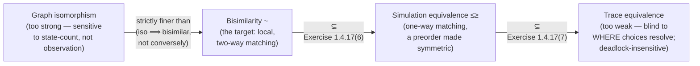

# Alternative Notions of Equality on Behaviour

[[book-guidelines|↩ Back to guidelines]]

## What problem is "equality of behaviour" even solving?

Once processes are modelled as [[Processes-and-Labelled-Transition-Systems#Labelled transition systems|labelled transition systems]] (LTSs) — states plus a transition relation $P \xrightarrow{\mu} P'$ — you immediately hit a question that has to be settled before anything else in the book can proceed: *when are two processes "the same"?* Not syntactically the same (that's trivial and useless — two differently-drawn LTSs can obviously describe the same machine), but behaviourally the same: indistinguishable by any way of interacting with them.

This is not a throwaway question. The whole enterprise of the book — bisimulation, the algebraic laws in Chapter 3, weak equivalence in Chapter 4, testing/failure/ready equivalence in Chapter 5 — is downstream of getting this definition right. And "right" turns out to be surprisingly hard to hit on the first try. §1.3 walks through two natural candidates, borrowed from two mature branches of mathematics (graph theory, automata theory), and shows both fail — one in each direction. Understanding *why* they fail is what motivates bisimulation's actual shape; skipping this section and jumping straight to Definition 1.4.2 would leave bisimulation looking like an arbitrary definition instead of the forced answer to two concrete counterexamples.

There is a third candidate worth knowing about too, even though the book only introduces it as an exercise here: **simulation** and **simulation equivalence** (Exercise 1.4.17), which sit at a different point on the same spectrum and matter a great deal once you start thinking about verification and refinement rather than pure equality.

## Candidate 1: graph isomorphism — too strong

LTSs *look* like graphs (states as nodes, transitions as labelled edges), so the obvious first move is to borrow graph theory's native equality: **isomorphism**. Two graphs are isomorphic if there is a bijection between their states that preserves the transition structure exactly — same edges, same labels, in both directions.

**What breaks:** isomorphism cares about the *shape* of the state space, not just what you can observe by interacting with it. The book's example (Fig. 1.2) is exactly this failure mode. Take $P_1$, a two-state LTS that cycles $a$-then-$b$-then-$a$-then-$b$-... forever by bouncing between two states, and $Q_1$, a three-state LTS that produces the *identical* infinite behaviour ($a, b, a, b, \ldots$ ad infinitum, forever) but does it by cycling through three states rather than two. No interaction — no sequence of button-presses — can ever tell $P_1$ and $Q_1$ apart: every $a$ you offer is accepted, every $b$ you offer is accepted, forever, on both. Yet there is no bijection between a 2-state and a 3-state LTS, so they are not isomorphic.

Sangiorgi's conclusion: graph isomorphism is **too strong** as a behavioural equivalence — it identifies fewer processes than it should, distinguishing machines that no observer could ever distinguish. It fails because it's sensitive to an *implementation detail* (how many internal states realize the behaviour) that has no observable trace whatsoever.

**Grounding it.** This is a very familiar shape of mistake if you've worked with structural vs. semantic equality in a compiler or type checker. Two Rust `enum` state machines can differ completely in their internal representation while being behaviourally interchangeable:

```rust
// P1: two states, ping-ponging a, b, a, b, ...
#[derive(Clone, Copy, PartialEq)]
enum P { S0, S1 }
fn p_step(s: P, action: char) -> Option<P> {
    match (s, action) {
        (P::S0, 'a') => Some(P::S1),
        (P::S1, 'b') => Some(P::S0),
        _ => None,
    }
}

// Q1: three states realizing the *same* observable a, b, a, b, ... behaviour,
// just by routing the cycle through an extra intermediate state.
#[derive(Clone, Copy, PartialEq)]
enum Q { T0, T1, T2 }
fn q_step(s: Q, action: char) -> Option<Q> {
    match (s, action) {
        (Q::T0, 'a') => Some(Q::T1),
        (Q::T1, 'b') => Some(Q::T2),
        (Q::T2, 'a') => Some(Q::T1),
        _ => None,
    }
}
```

No `#[derive(PartialEq)]` structural check, and no `enum` variant-count comparison, will ever certify `P` and `Q` as equal — `P` has 2 variants, `Q` has 3, so no bijection between them exists, yet nothing you can *observe* by feeding either one a sequence of `'a'`/`'b'` actions ever distinguishes them. You need an equivalence that quantifies over *behaviour* (what `p_step`/`q_step` produce, forever), not over representation (how many `enum` variants it took to produce it). In Lean terms, this is the difference between definitional/syntactic equality of two inductive types and an *equivalence* (`Equiv`) between them: isomorphism is a legitimate mathematical equality, just the wrong *kind* of equality for this job, because it doesn't abstract over redundant state.

## Candidate 2: trace equivalence — too weak

Having rejected the graph-theoretic notion for being too fine, the book tries the automata-theoretic one instead. Automata Theory already has a well-developed answer to "when are two automata equal": two automata are equal if they **accept the same language** — the same set of finite strings, tracked by whether a run over that string reaches a final state.

Transplanted to processes (which have no designated "final" states, just interaction sequences), this becomes **trace equivalence**: $P$ and $Q$ are trace equivalent if they can perform exactly the same finite sequences of actions —

$$
P \xrightarrow{\mu_1} P_1 \cdots P_{n-1} \xrightarrow{\mu_n} P_n
\iff
\exists\, Q_1,\ldots,Q_n.\ Q \xrightarrow{\mu_1} Q_1 \cdots Q_{n-1} \xrightarrow{\mu_n} Q_n
$$

for every finite sequence $\mu_1, \ldots, \mu_n$ and both directions.

**What breaks, and why it's a *different* kind of failure than isomorphism's:** in automata theory, a string is "accepted" if *some* run reaches a final state — other runs that fail (dead-end at a non-final state) are simply irrelevant, discarded. But a process is not being asked "does some path through you succeed?" — it is being *interacted with live*, one step at a time, with no ability to backtrack out of a bad nondeterministic choice once made. That distinction is invisible to trace equivalence and fatal to using it as a process equality.

The book's running illustration is two vending machines (Figs. 1.3–1.5) that are trace equivalent but not interchangeable in an office:

- **Machine (left, Fig. 1.4/1.5 left):** after you press "coin," it *nondeterministically* commits to one branch — either the one that lets you press "tea," or the one that lets you press "coffee" — and from that point on refuses the other. If it picks the coffee branch and you press "tea," the machine simply cannot respond: this is a **deadlock**.
- **Machine (right, Fig. 1.4/1.5 right):** after "coin," it offers *both* "tea" and "coffee" as live options; you choose. No deadlock is possible.

Trace-wise these are equal: every trace the left machine can perform, the right one can too, and vice versa — `coin,tea` and `coin,coffee` are both traces of both machines. But operationally they are opposite in the one property you actually care about when you're standing in front of a vending machine: *can pressing a legal-looking button ever get you stuck?* Trace equivalence is blind to *where in the branching structure* a choice resolves — only to *whether some path exists* — so it inherits automata theory's "some accepting run is enough" attitude, which is correct for language recognition and wrong for live interaction.

Sangiorgi's phrasing is precise about the deficiency: this equivalence is **non-local**. Establishing that two states are trace-equivalent requires examining sequences of states arbitrarily far away, not just the immediate one-step transitions available *right now*. That non-locality is exactly what later makes trace equivalence hard to reason about compositionally (the book returns to this in Ch. 5, showing complete trace equivalence isn't even preserved by parallel composition) and what the eventual bisimulation definition is engineered to fix by only ever inspecting one step at a time.

**[[Coinduction-and-the-Duality-with-Induction#What breaks without it|What breaks without it]] (concretely).** Suppose a client and a vending machine are trace equivalent to a spec that promises "you can always get tea after inserting a coin," but the *implementation* nondeterministically routes some coin-insertions into a coffee-only branch. Trace-equivalence-based testing of the implementation against the spec — checking that every recorded trace of the implementation is a trace the spec allows, and vice versa — will pass, and yet real users hit deadlock. This is the direct process-theoretic analogue of a spec/implementation conformance check that only inspects "language accepted" rather than "commitment structure preserved" — the same gap that shows up if you validate an API's request/response *sequences* in isolation without checking that each individual nondeterministic branch point in the implementation still offers everything the spec offers at that point.

```python
# A trace-equivalence checker: exactly what automata theory would ask for,
# and exactly why it is the wrong tool for process equality.
def traces(transitions, start, depth):
    """All action-sequences of length <= depth reachable from `start`."""
    frontier = {(start, ())}
    all_traces = {()}
    for _ in range(depth):
        nxt = set()
        for state, trace in frontier:
            for action, dest in transitions.get(state, []):
                nxt.add((dest, trace + (action,)))
                all_traces.add(trace + (action,))
        frontier = nxt
    return all_traces

# left / right vending machines from Fig. 1.4/1.5, collapsed to their
# essential branching structure:
left  = {"coin": [("tau", "committed_tea"), ("tau", "committed_coffee")],
         "committed_tea": [("tea", "done")],
         "committed_coffee": [("coffee", "done")]}
right = {"coin": [("offer", "choice")],
         "choice": [("tea", "done"), ("coffee", "done")]}

# traces(left, "coin", 2) == traces(right, "coin", 2) modulo the silent
# tau steps -- they can look trace-equivalent while only `right` guarantees
# that pressing "tea" after "coin" never deadlocks.
```

Trace equivalence is not useless — the book flags later (§5.7, on deterministic processes and safety-property verification) that it has real applications once you restrict to *deterministic* processes, where "some path" and "the path" coincide and the deadlock problem evaporates. But as a general behavioural equality for nondeterministic, interactively-observed processes, it is rejected for being **too weak**: it identifies processes — like the two vending machines above — that a live interaction can, and does, tell apart.

## The gap between too-strong and too-weak: two lessons carried forward

Putting §1.3's two rejections side by side gives the book's design brief for the "correct" equivalence, stated explicitly at the top of §1.4:

- it must demand a **tighter correspondence between transitions** than trace equivalence does (fixing the deadlock-insensitivity problem), *and*
- it must be based on the **information the transitions themselves convey**, not on the raw shape of the state graph (fixing the isomorphism problem).

Bisimulation (covered in depth in [[Bisimulation-and-Bisimilarity]]) is engineered to sit exactly between these two failure points: local like isomorphism-checking (only ever inspects one step), but abstracting over redundant state-count like trace equivalence does — while additionally requiring that the choice structure, not just the trace language, be preserved at every step.

## A third point on the spectrum: similarity and simulation equivalence

Before the book commits to bisimulation, Exercise 1.4.17 quietly introduces a fourth notion that will matter far more later (it gets an entire chapter, Ch. 6, "[[Refinements-of-Simulation|Refinements of Simulation]]") than its exercise-box treatment here suggests: **simulation**.

**Definition (Simulation, Exercise 1.4.17).** A process relation $R$ is a *simulation* if, whenever $P \mathrel{R} Q$:

$$
\text{for all } P' \text{ and } \mu \text{ with } P \xrightarrow{\mu} P', \text{ there is } Q' \text{ such that } Q \xrightarrow{\mu} Q' \text{ and } P' \mathrel{R} Q'.
$$

Compare this directly against Definition 1.4.2's bisimulation clauses — it is *exactly clause (1) of bisimulation, with clause (2) deleted*. Bisimulation demands a two-way matching obligation (each side must be able to answer every challenge from the other); simulation demands only a **one-way** obligation: $Q$ must be able to match everything $P$ does, but $P$ is under no matching obligation toward $Q$.

**Similarity**, written $\leq$, is the union of all simulations: $P \leq Q$ ("$Q$ simulates $P$") holds if some simulation relates them. Because clause (2) is gone, $\leq$ is not symmetric — it's a **preorder** (reflexive, transitive, but not symmetric), not an equivalence relation. That asymmetry is the entire point: $\leq$ expresses *"$Q$ can do at least everything $P$ can do"* — a refinement/subsumption relationship, not an equality. From a preorder you recover an equivalence in the usual way, by requiring both directions: **simulation equivalence**, $P \mathrel{\leq^{\geq}} Q$, holds iff $P \leq Q$ and $Q \leq P$ — $Q$ can match everything $P$ does *and* $P$ can match everything $Q$ does, just not necessarily via the *same* witnessing relation in both directions (that "same relation both ways" requirement is precisely what bisimulation adds on top and simulation equivalence lacks).

Two structural facts from the exercise are worth carrying forward explicitly, because they pin down exactly where similarity sits relative to the two rejected candidates and to bisimulation:

1. **$R$ is a bisimulation iff both $R$ and $R^{-1}$ are simulations** — bisimulation is literally "simulation in both directions, checked with the same relation," making the relationship between the two definitions completely transparent rather than a coincidence of similar-looking clauses.
2. **The strict hierarchy:** $\mathord{\sim} \subsetneq \mathord{\leq^{\geq}} \subsetneq (\text{trace equivalence})$. Bisimilarity is strictly finer than simulation equivalence, which is itself strictly finer than trace equivalence. The witnessing example is the same pair, $P_2, Q_2$, that Fig. 1.7 already used to demonstrate non-bisimilarity: $Q_2 \leq P_2$ holds (Exercise 1.4.17(3)) even though $P_2 \not\sim Q_2$ — simulation equivalence is coarse enough to conflate some processes bisimilarity correctly keeps apart, but still fine enough to reject some things trace equivalence would wrongly identify. It sits in the gap between the too-strong and too-weak candidates from §1.3, closer to the "too weak" end.

**Why this matters beyond being "one more equivalence in a list."** Simulation's asymmetry is not a defect — it's the useful case for a broad class of real questions that are inherently one-directional rather than symmetric:

- *"Does the implementation refine the spec?"* is naturally a simulation question, not a bisimulation question: you require the implementation to offer no behaviour the spec didn't sanction (or, dually, that the spec's every possibility is realized), but you often don't require the reverse commitment. A simulation-based conformance check is strictly what "the implementation is at least as capable, in every branch, as the spec demands" means.
- Exercise 1.4.17(2) notes that a process with no transitions at all is simulated by *every* process ($P \leq Q$ for all $Q$, when $P$ has no transitions) — the "does nothing" process is a valid, trivial refinement of everything, exactly the bottom element you'd expect a refinement preorder to have.

**This is precisely the shape of an abstraction (Galois-connection-style) relation in abstract interpretation, and it's worth naming that connection explicitly.** In abstract interpretation, you relate a concrete transition system to an abstract one by requiring that every concrete step be *matched* by some abstract step (soundness of the abstraction) — but you do **not** require the converse (the abstract domain is allowed extra, spurious behaviour introduced by over-approximation; that's exactly what makes it an *over*-approximation rather than an exact replica). That is a simulation, not a bisimulation, between the concrete and abstract semantics: concrete $\leq$ abstract. The one-directional matching clause you just read in Exercise 1.4.17 is the same shape of obligation a soundness proof for an abstract domain has to discharge, and the strict inclusion $\mathord\sim \subsetneq \mathord{\leq^{\geq}}$ is the formal reason "sound abstraction" is necessarily *lossy* relative to exact (bisimulation-level) equivalence — an abstract domain that achieved full bisimilarity with the concrete semantics wouldn't be abstracting anything. The same one-directional pattern also matches refinement-type subtyping: a refinement type $\{x : \tau \mid \phi(x)\}$ being a valid subtype of $\{x : \tau \mid \psi(x)\}$ is a one-way obligation (every state satisfying $\phi$ must satisfy $\psi$'s admissible transitions/behaviour), not a two-way equivalence — structurally, subtyping checks want a simulation-shaped proof obligation, not a bisimulation-shaped one.

```rust
// The single-clause difference between simulation- and bisimulation-checking,
// made structural: dropping the second `all(...)` is the entire distinction
// between "Q refines P" and "P and Q are behaviourally identical."
trait Lts {
    type State: Eq + Clone;
    type Action: Eq + Clone;
    fn step(&self, s: &Self::State) -> Vec<(Self::Action, Self::State)>;
}

fn is_simulation<L: Lts>(
    lts: &L,
    rel: &[(L::State, L::State)],
) -> bool {
    rel.iter().all(|(p, q)| {
        lts.step(p).iter().all(|(a, p_next)| {
            lts.step(q).iter().any(|(b, q_next)| {
                a == b && rel.contains(&(p_next.clone(), q_next.clone()))
            })
        })
        // No symmetric check on Q's transitions -- that omission IS simulation.
    })
}

fn is_bisimulation<L: Lts>(lts: &L, rel: &[(L::State, L::State)]) -> bool {
    is_simulation(lts, rel)
        && is_simulation(
            lts,
            &rel.iter().map(|(p, q)| (q.clone(), p.clone())).collect::<Vec<_>>(),
        )
    // Bisimulation = simulation in both directions -- exactly fact (1) above.
}
```

## The spectrum so far



## Where this leads

§1.3's two failures are the reason bisimulation (Definition 1.4.2, in [[Bisimulation-and-Bisimilarity]]) has exactly the shape it does: local one-step matching (learned from isomorphism's failure to abstract over state count) plus a *two-way* matching obligation at every step (learned from trace equivalence's blindness to where nondeterminism resolves). Simulation, introduced almost in passing here, resurfaces as a first-class subject in Chapter 6 ("Refinements of Simulation"), where complete simulation, ready simulation, and coupled simulation repair simulation's own residual deadlock-insensitivity problem (plain simulation equivalence, being coarser than bisimilarity, reinherits *some* of trace equivalence's blindness — Ch. 6 patches this the same way §1.3→§1.4 patched trace equivalence itself). It also resurfaces implicitly throughout Chapter 5, where the may/must testing preorders and the full linear-time/branching-time spectrum are organized around exactly this finer/coarser axis.

For the standing project: the simulation/bisimulation distinction is the direct process-theoretic ancestor of the soundness obligation an abstract-interpretation domain must discharge against concrete semantics (one-directional — "every concrete step has an abstract shadow" — not the two-directional bisimulation obligation), and of the one-directional proof obligation refinement-subtyping checks impose between a refinement type and its supertype. Whenever the compiler project needs to argue that an abstract domain (or a CHC over-approximation, or a widening operator) is *sound* rather than *exact*, that argument is a simulation proof, and the strict inclusion $\sim \subsetneq \leq^{\geq}$ is the formal statement of exactly how much precision that soundness-only requirement is allowed to give up.
