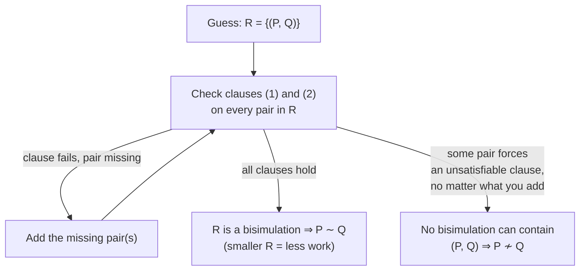
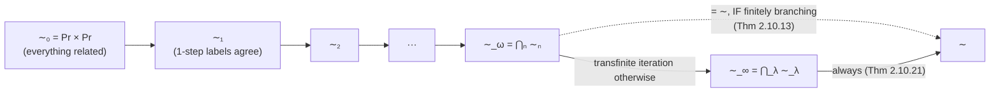
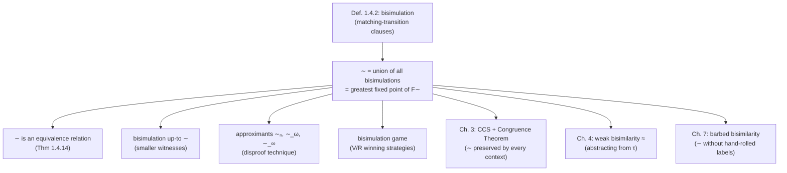

# Bisimulation and Bisimilarity

[[book-guidelines|↩ Back to guidelines]]

## What problem is bisimulation actually solving?

By the time §1.4 opens, the book has already rejected two candidate notions of "same behaviour" for processes modeled as [[Processes-and-Labelled-Transition-Systems#Labelled transition systems|labelled transition systems]] (LTSs): **graph isomorphism** is too fine (it distinguishes processes that no external observer could ever tell apart — e.g. relabelings of otherwise identical states), and **trace equivalence** is too coarse (it forgets *when* a choice was made, so it can't tell a vending machine that lets you pick tea-or-coffee freely from one that commits to a choice after taking your money and then might refuse the drink you wanted — the classic deadlock-sensitivity failure).

What's missing from trace equivalence specifically is this: two processes should count as equal not just because they can produce the same sequences of actions, but because *at every point where a choice is possible*, whatever one process can do, the other can also do, landing in states that are themselves equal by the same standard. That "themselves equal by the same standard" is doing something unusual — the definition of equality is *self-referential*. That's the whole difficulty and the whole point.

Bisimulation is the technical device that makes this self-reference precise instead of circular nonsense. It has two ingredients:

1. A checkable, *local* clause — given a claimed pair of equal states, look only at their immediate one-step transitions and demand that each be matched by the other side.
2. A definition of "equal" as the largest relation that survives that check applied to itself — which is exactly the coinductive move the book spends all of Chapter 2 justifying rigorously. §1.4 gives you the working definition and the proof method first, operationally, before Chapter 2 supplies the fixed-point theory underneath it.

## Definition of bisimulation via matching transitions

Recall an LTS is a triple $(Pr, Act, \rightarrow)$ — processes, actions, and a transition relation $P \xrightarrow{\mu} P'$. A **process relation** is just a binary relation $R$ on the states of one LTS (Def. 1.4.1 — the book insists on a *single* LTS so both sides share an action alphabet; no generality is lost, since the union of two LTSs is again an LTS).

**Definition 1.4.2 (Bisimulation).** A process relation $R$ is a *bisimulation* if, whenever $P \mathrel{R} Q$, for all $\mu$:

$$
\begin{aligned}
&(1)\ \text{for all } P' \text{ with } P \xrightarrow{\mu} P', \text{ there is } Q' \text{ such that } Q \xrightarrow{\mu} Q' \text{ and } P' \mathrel{R} Q'; \\
&(2)\ \text{the converse: for all } Q' \text{ with } Q \xrightarrow{\mu} Q', \text{ there is } P' \text{ such that } P \xrightarrow{\mu} P' \text{ and } P' \mathrel{R} Q'.
\end{aligned}
$$

Read the quantifier order carefully — $\forall$ transition, $\exists$ a match. $P$ *challenges* $Q$ with one of its transitions; $Q$ must *answer* with a matching one, landing back in $R$. Symmetrically for $Q$ challenging $P$. This challenge/answer reading is not just pedagogy — it becomes literally the rules of the **bisimulation game** in §2.13–2.14.

**Bisimilarity**, written $\sim$, is then the union of *all* bisimulations: $P \sim Q$ iff there exists some bisimulation $R$ with $P \mathrel{R} Q$.

Two things to flag immediately, because they're easy to blur together and the book is careful about the distinction:
- A *bisimulation* is any relation satisfying the clauses — there are usually many of them (the empty relation trivially is one; so, less trivially, is any subset that happens to close under the matching condition).
- *Bisimilarity* is one specific relation, built by unioning all of them.

**Grounding it in code.** In Rust, a bisimulation is a *witness* — a certificate that a claimed relation actually closes under the matching clauses — and checking it is a decidable, purely local computation over one step of transition structure:

```rust
use std::collections::HashSet;

trait Lts {
    type State: Eq + std::hash::Hash + Clone;
    type Action: Eq + Clone;
    fn transitions(&self, s: &Self::State) -> Vec<(Self::Action, Self::State)>;
}

/// Checks that `rel` is a bisimulation on `lts`: every pair in `rel` satisfies
/// both matching clauses. This does NOT compute bisimilarity — it only
/// verifies a proposed witness relation, which is exactly the proof method
/// the book develops next.
fn is_bisimulation<L: Lts>(lts: &L, rel: &HashSet<(L::State, L::State)>) -> bool {
    rel.iter().all(|(p, q)| {
        let p_matches_q = lts.transitions(p).iter().all(|(mu, p_prime)| {
            lts.transitions(q)
                .iter()
                .any(|(nu, q_prime)| nu == mu && rel.contains(&(p_prime.clone(), q_prime.clone())))
        });
        let q_matches_p = lts.transitions(q).iter().all(|(mu, q_prime)| {
            lts.transitions(p)
                .iter()
                .any(|(nu, p_prime)| nu == mu && rel.contains(&(p_prime.clone(), q_prime.clone())))
        });
        p_matches_q && q_matches_p
    })
}
```

This is deliberately not a bisimilarity *decision procedure* — it checks a witness, the way a type checker checks a proof term rather than searching for one. That distinction (checking vs. searching) is exactly the same one your elaborator's `isDefEq` sits on: verifying that a candidate relation (or a candidate equality derivation) is closed is cheap; *finding* the right relation (or the right unifier) is where the real work is.

## Bisimilarity as the union of all bisimulations

Definition 1.4.2's second half — "$\sim$ is the union of all bisimulations" — is what the book flags as **impredicative**: a definition that quantifies over a collection containing the very object being defined. $\sim$ is defined by unioning over "all bisimulations," and then (Theorem 1.4.14(2), below) it turns out $\sim$ *itself* is a bisimulation — so it's one of the very things being unioned to produce it.

This should feel uncomfortable if you're used to inductive definitions, where you build up from a base case with no self-reference. It's not incoherent, but it does mean the *existence* of $\sim$ as a well-defined object needs justification that trace equivalence or graph isomorphism never needed — that justification is precisely what Chapter 2's fixed-point theory supplies (§2.10 revisits this exact definition as $\gcd$'s of a monotone functional on a complete lattice — see below).

## The bisimulation proof method

Given the definition, the natural proof technique falls out immediately: **to show $P \sim Q$, exhibit some bisimulation $R$ with $P \mathrel{R} Q$.** You don't need to exhibit *the* union of all bisimulations — any single witness containing the pair suffices, since $R \subseteq \sim$ for every bisimulation $R$.

The book works this by trial and repair (Example 1.4.4): start with $R = \{(P_1, Q_1)\}$, close it under one-step derivatives, discover a missing pair when a clause fails, add it, repeat until stable. The failure mode to watch for (Example 1.4.5) is a clause failing on a transition with **no match at all** — e.g. $R_4 \xrightarrow{b} R_1$ has nothing on the $Q_2$ side, forcing you to add $(Q_3, R_1)$.

Two structural properties make this method tractable in a way trace equivalence never was:

- **Locality.** Each clause only inspects the *immediate* transitions out of the two states in the pair — you never have to chase a whole sequence, unlike trace equivalence, whose non-locality (computing traces starting from $s$ may require examining states arbitrarily far from $s$) is exactly why it needed rejecting in the first place.
- **No hierarchy.** Unlike an inductively-stated notion of process equality —

$$P = Q \text{ if, for all } \mu:\ \forall P'.\ P\xrightarrow{\mu}P' \Rightarrow \exists Q'.\ Q\xrightarrow{\mu}Q' \wedge P' = Q'\ (\text{and the converse})$$

  — which is *ill-founded* the moment the derivative structure is infinite or contains a loop (you'd need to already know $P' = Q'$ before you can conclude $P = Q$, with no base case to bottom out on), bisimulation clauses impose no temporal order between pairs. All pairs in the relation are checked "on a par." This is precisely what lets bisimilarity handle infinite or circular process behaviour, where induction structurally cannot.

**Practical hint:** prefer *small* bisimulations. A witness with fewer pairs means less proof obligation — this motivates the "up-to" enhancements below, whose entire purpose is shrinking the relation you need to exhibit.

**Non-bisimilarity is also provable**, but by a different route: to show $P_1 \not\sim Q_1$, you show *no* bisimulation can contain the pair — e.g. by finding that any relation forced to include $(P_1,Q_1)$ is also forced (by matching derivatives) to include a pair on which some clause is unsatisfiable (Example 1.4.6). This is harder to do directly; §2.10.2's approximants and §2.12's games both exist largely to make *disproving* bisimilarity tractable too.



## Bisimilarity as an equivalence relation

**Theorem 1.4.14(1).** $\sim$ is reflexive, symmetric, and transitive — and each proof is itself an instance of the bisimulation proof method, applied not to a single pair but to a *closure property of the class of bisimulations*:

- **Reflexivity:** the identity relation $\{(P,P) \mid P \text{ a process}\}$ is trivially a bisimulation (every transition matches itself), so $P \sim P$.
- **Symmetry:** if $R$ is a bisimulation, so is its converse $R^{-1}$ (swap the roles of clause (1) and (2)). So if $P \sim Q$ via some $R$, then $Q \mathrel{R^{-1}} P$, and $R^{-1}$ being a bisimulation gives $Q \sim P$.
- **Transitivity:** the *relational composition* of two bisimulations is again a bisimulation:
$$R = \{(P,R) \mid \exists Q.\ P \mathrel{R_1} Q \text{ and } Q \mathrel{R_2} R\}$$
  Chase a challenge $P \xrightarrow{\mu} P'$: since $P \mathrel{R_1} Q$, there's a matching $Q \xrightarrow{\mu} Q'$ with $P' \mathrel{R_1} Q'$; since $Q \mathrel{R_2} R$, there's a matching $R \xrightarrow{\mu} R'$ with $Q' \mathrel{R_2} R'$ — so $R'$ answers $P$'s challenge and $(P', R') \in R$. Composition of two closure witnesses is again a closure witness — this "closure properties are compositional" pattern recurs constantly in proof-search and constraint-propagation systems: it's the same shape as showing that composing two sound inference steps yields a sound inference step.

This is exactly the *union of two (or more) bisimulations is a bisimulation* fact (Exercise 1.4.13), generalized: $\{R_i\}_i$ bisimulations $\Rightarrow \bigcup_i R_i$ is a bisimulation. (The *intersection* of two bisimulations, by contrast, need **not** be one — matching is a disjunctive, existential condition, and existentials don't survive intersection the way they survive union.)

## Bisimilarity as the largest bisimulation

**Theorem 1.4.14(2) + Theorem 1.4.15.** Because bisimilarity is a union of bisimulations, and unions of bisimulations are bisimulations (just shown), $\sim$ *is itself a bisimulation* — and since every bisimulation is, by definition, a subset of $\sim$, it follows that **$\sim$ is the largest relation satisfying the matching clauses.**

This single fact is the hinge the entire chapter turns on. Restate the matching clauses as a function

$$F_\sim : \wp(Pr \times Pr) \to \wp(Pr \times Pr), \qquad F_\sim(R) = \{(P,Q) \mid \text{clauses (1),(2) hold w.r.t. } R\}$$

Then (§2.10.1, filling in the fixed-point vocabulary from earlier in Chapter 2):

- $R$ is a bisimulation $\iff R \subseteq F_\sim(R)$ — i.e. bisimulations are precisely the **post-fixed points** of $F_\sim$.
- $F_\sim$ is **monotone** on the complete lattice $(\wp(Pr\times Pr), \subseteq)$.
- By the Fixed-point Theorem, a monotone endofunction on a complete lattice has a *greatest* fixed point equal to the join (union) of all its post-fixed points. That greatest fixed point is exactly $\sim$.

So "bisimilarity is the largest bisimulation" is not a cute slogan — it's the operational meaning of "$\sim = \gfp(F_\sim)$." This reframing is why §1.4's impredicative-looking definition isn't circular nonsense: it's an instance of a well-understood mathematical object (the greatest fixed point of a monotone map), whose *existence* the Fixed-point Theorem guarantees independently of any circular-looking phrasing.

**Lean-side correspondence.** This is precisely the shape of a coinductive definition in a proof assistant. If you've seen Lean's (or Coq's) `CoInductive`/`coinductive` machinery, bisimilarity is the textbook motivating example: $F_\sim$ is the "one unfolding step" functor, and $\sim$ is its greatest fixed point — the type of (potentially infinite) bisimulation proofs is inhabited coinductively, checked by *guardedness* (every corecursive call must be "productive," i.e. must occur only after having produced at least one observation) rather than by well-founded structural recursion. Lean's kernel enforcing guardedness on `corec`-defined bisimulation proofs is doing, mechanically, exactly what Theorem 1.4.15 does mathematically: it only accepts proof objects that are actually witnessing a post-fixed point of the right functional.

## Bisimulation up-to techniques

Recall the practical hint: smaller witness relations are cheaper to check. **Bisimulation up-to $\sim$** (Exercise 1.4.18) formalizes a systematic way to shrink them. A relation $R$ is a bisimulation up-to $\sim$ if, whenever $P \mathrel{R} Q$, for all $\mu$:

$$
\text{for all } P' \text{ with } P\xrightarrow{\mu}P',\ \exists Q'.\ Q\xrightarrow{\mu}Q' \text{ and } P' \mathrel{(\sim R \sim)} Q'
$$

(and symmetrically), where $\sim R \sim$ is relational composition: $P' \mathrel{(\sim R \sim)} Q'$ iff $\exists P'', Q''$ with $P' \sim P''$, $P'' \mathrel{R} Q''$, $Q'' \sim Q'$. The relaxation: after a challenge, you're allowed to land anywhere *already known to be bisimilar* to a pair in $R$, not just back in $R$ exactly. **Soundness** (the exercise's punchline): if $R$ is a bisimulation up-to $\sim$, then $R \subseteq \sim$ — proved by showing $\sim R \sim$ itself is a full bisimulation.

Why this matters practically: it lets you certify bisimilarity of large or infinite state spaces using a witness relation that's much smaller than any *exact* bisimulation containing the same pair, because you're allowed to "reuse" bisimilarity already established elsewhere instead of re-deriving it inside $R$. This is the same cost/soundness tradeoff as memoized cycle-detection in a definitional-equality checker: caching "these two terms are already known equal" and consulting the cache mid-check (rather than requiring the raw equality-checking relation to be closed on its own) is *exactly* up-to reasoning — the cache plays the role of "$\sim$" being folded into the checking relation "$R$." Where [[Coinduction-and-the-Duality-with-Induction#The theorem|the theorem]] does the work is guaranteeing this shortcut doesn't silently admit unsound identifications.

## Stratification of bisimilarity by approximants

A second (complementary) analytical tool: instead of shrinking witness relations, *approximate* $\sim$ from above by counting how many rounds of the matching game two processes survive.

**Definition 2.10.9.**
$$
\sim_0\ \overset{\text{def}}{=}\ Pr \times Pr, \qquad
P \sim_{n+1} Q \iff \text{matching clauses hold with } \sim_n \text{ in place of } R,\qquad
\sim_\omega\ \overset{\text{def}}{=}\ \bigcap_{n\ge 0} \sim_n
$$

$\sim_0, \sim_1, \dots$ is a **decreasing** sequence (Exercise 2.10.10): $\sim_n = F_\sim^n(Pr\times Pr)$, the $n$-fold iteration of the functional starting from the top of the lattice — this is the standard "approximate the greatest fixed point from above by iterating the monotone map" construction, dual to the familiar least-fixed-point-from-below iteration you'd use for an inductively defined set.

**The trap: $\sim_\omega \ne \sim$ in general.** Example 2.10.11 is the load-bearing counterexample: build states $a^0$ (no transitions), $a^n$ (one transition to $a^{n-1}$), $a^\omega$ (one self-loop transition), and $P, Q$ where $P \xrightarrow{a} a^n$ for every $n$, and $Q$ has all of $P$'s transitions *plus* $Q \xrightarrow{a} a^\omega$. Every finite approximant is fooled: $P \sim_n Q$ holds for *all* $n$ (an $\omega$-round game can't ever expose the extra transition, since $a^\omega$ survives $n$ rounds against any finite $a^k$ for $k$ large enough), so $P \sim_\omega Q$ — yet $P \not\sim Q$, because $Q$'s move to $a^\omega$ can never be matched by any $a^n$ (only $a^\omega$ survives *every* round; every $a^n$ eventually runs out). The functional $F_\sim$ fails to be **cocontinuous** here (Exercise 2.10.12) — exactly because the LTS is not finitely branching (each state has infinitely many outgoing $a$-labelled possibilities to choose among across the whole family).

**Repair 1 — finite branching.** **Theorem 2.10.13:** on a finitely-branching LTS, $\sim$ and $\sim_\omega$ coincide. The direct proof is worth internalizing: $\subseteq$ is easy ($\sim$ is a bisimulation, hence sits inside every $\sim_n$); the converse uses finite branching essentially — given $P \sim_\omega Q$ and a challenge $P \xrightarrow{\mu} P'$, each $\sim_{n+1}$ supplies *some* matching $Q$-derivative $Q_n$, but since $Q$ has only finitely many $\mu$-derivatives total, by pigeonhole some single derivative $Q_i$ must serve as the match for infinitely many $n$ — and since the $\sim_n$ are decreasing, that means $P' \sim_n Q_i$ for *every* $n$, i.e. $P' \sim_\omega Q_i$. Finite branching is what turns "infinitely many rounds of *some* witness" into "one witness that survives every round."

**Repair 2 — beyond $\omega$.** Without finite branching (or its weakening to *image-finiteness*, or further to *image-finiteness up-to $\sim$*, Def. 2.10.19), you generally need to keep iterating **past $\omega$**, into the ordinals: $\sim_\lambda = \bigcap_{\beta<\lambda}\sim_\beta$ at limit ordinals, with $\sim_\infty = \bigcap_\lambda \sim_\lambda$. **Theorem 2.10.21:** $\sim = \sim_\infty$ always (no branching hypothesis needed) — this is just the general Cocontinuity/transfinite-iteration theorem from earlier in Chapter 2, instantiated to $F_\sim$.

**Why approximants are useful beyond theory:** they give a second disproof technique for non-bisimilarity — find the *least* $n$ at which a pair drops out of $\sim_n$ (Examples 2.10.15–2.10.16 replay the earlier non-bisimilarity examples this way), which is often mechanically easier than reasoning about "no bisimulation can exist."



Operationally this is *fuel-based approximation*, the same technique used to give a terminating small-step interpreter for a potentially-nonterminating language by bounding the number of steps: you get a decreasing sequence of ever-more-refined approximations, and equality of the "real," unbounded object is recovered only in the limit — with the finiteness side condition (finite branching / image-finiteness) playing exactly the role that termination/decreasing-measure side conditions play when you're trying to turn a fuel-bounded search into a decision procedure.

## The bisimulation game

§§2.12–2.14 recast everything above as a two-player game between a **verifier** V (trying to establish membership in a coinductively/inductively defined set) and a **refuter** R (trying to block it), building on the general rule/proof-tree machinery of §2.11 (Theorem 2.11.2: least-fixed-point membership $\iff$ a *well-founded* proof tree exists; Theorem 2.11.5: greatest-fixed-point membership $\iff$ *any* proof tree — possibly infinite — exists).

Specialized to bisimulation (§2.13), the simpler reformulation (§2.14) is the intuitive one: a play on the pair $(P_0, Q_0)$ is a (possibly infinite) sequence of pairs $(P_0,Q_0), (P_1,Q_1), \dots$ At pair $(P_i, Q_i)$, R picks a transition from *either* side (say $P_i \xrightarrow{\mu} P'$); V must answer with a matching transition on the other side ($Q_i \xrightarrow{\mu} Q'$); the next pair is $(P', Q')$. R wins a finite play if V ever can't answer. **V wins if the play stalls with no challenge possible, or if the play is infinite.**

**Theorem-level payoff (Exercises 2.14.1–2.14.2):** $P \sim Q$ iff V has a *winning strategy* for $(P,Q)$; $P \not\sim Q$ iff R has one. This is the coinductive game rule from §2.12 (infinite play = win for V) made concrete, and it gives a third proof technique, complementary to exhibiting a bisimulation (best for *proving* $\sim$) and to approximants (best for *disproving* $\sim$ on well-behaved LTSs): describing R's or V's strategy directly, which is often the most intuitive of the three when you're reasoning by hand (Examples 2.14.3, 2.14.6 walk concrete winning strategies for both players).

**Why this framing generalizes usefully:** the verifier/refuter split is the same adversarial structure underlying game-semantic accounts of program equivalence, and — closer to the compiler/verifier project — the same shape as **CEGAR-style refinement**: a "prover" trying to establish an invariant/contract holds, an "adversary" trying to exhibit a violating trace, with the loop terminating in the prover's favor exactly when no refuting play (counterexample) exists. Bisimulation games are a clean, minimal instance of this prover/refuter duality, before any of the complications (abstraction, spurious counterexamples, predicate refinement) that CEGAR adds on top.

## Where this leads

Structurally, everything downstream of Chapter 1 depends on the object built here:



Within the chapter, this is also the payoff example that Chapter 2's whole fixed-point apparatus (posets, complete lattices, the Fixed-point Theorem, rule induction/coinduction) was built to explain rigorously — §1.4 shows you the *phenomenon* (an impredicative-looking but well-founded definition, with a genuinely useful proof method), and §2.10–2.14 show you *why it's not a trick*: $\sim$ is a bona fide greatest fixed point, its approximants behave exactly as general fixed-point iteration theory predicts (including the cocontinuity failure mode), and its proof method has both a coinductive-game reading and a relational-composition-soundness reading.

For the compiler/elaborator project specifically: this chapter is the cleanest possible worked example of **coinductive definitional equality with a checkable, local, non-well-founded-safe matching rule** — precisely the property you want from a term-equality or type-equality check that must handle recursive/corecursive definitions (guarded recursion, infinite streams, or recursive type unfoldings) without looping forever or rejecting genuinely-equal infinite unfoldings. The "up-to" technique is the formal justification for memoizing/caching equality facts mid-check; the approximant machinery is the formal justification for "fuel"-bounded equality checks and for *why* a bound that works on finitely-branching structure can fail silently on infinitely-branching structure (a real risk if your elaborator ever unifies against types with unboundedly many instantiations, e.g. universe-polymorphic or dependently-indexed families); and the verifier/refuter game is a minimal, well-understood instance of the prover/counterexample-search duality that underlies CEGAR-based invariant synthesis.
