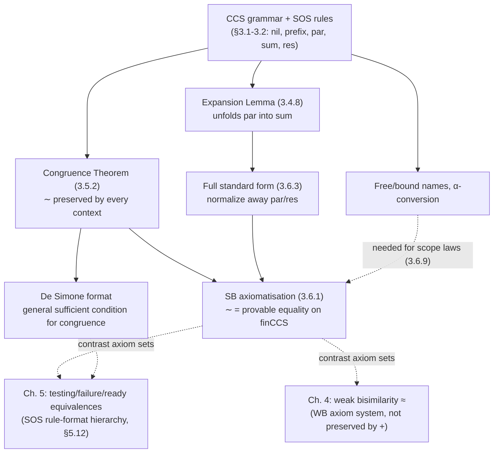

# CCS and Algebraic Properties of Bisimilarity

[[book-guidelines|↩ Back to guidelines]]

## Why bisimulation needs a language, not just LTSs

Chapter 1 gave you bisimilarity as a relation on *arbitrary* [[Processes-and-Labelled-Transition-Systems#Labelled transition systems|labelled transition systems]] — it never assumed processes had any internal structure. That was deliberate: it made bisimilarity's definition maximally general. But it also left a gap. If processes are just opaque nodes in a graph, you can't *build* new processes from old ones, and you can't ask the question that makes any equivalence relation actually useful in practice: is it a **congruence**? That is, if $P \sim Q$, can you always replace $P$ by $Q$ inside a larger system and be guaranteed the larger systems are still equivalent?

This is exactly the question a type checker asks about definitional equality: if two terms are equal, can you substitute one for the other in any context and preserve well-typedness and meaning? Without a compositionality (congruence) guarantee, an equivalence relation is close to useless as an engineering tool — you'd have to re-verify every enclosing context by hand every time you wanted to swap in an equal subterm.

To even *ask* the congruence question, you need syntax: a grammar of process expressions with **operators** you can nest, so that "context" becomes a meaningful, inductively defined notion (a process expression with a hole in it). Chapter 3 supplies that syntax — CCS (Calculus of Communicating Systems, Robin Milner's calculus) — and then spends the rest of the chapter proving that bisimilarity, this coinductively-defined relation from Chapter 1, is in fact a congruence for it. The proof is the chapter's centerpiece precisely because it has to reconcile two different flavors of reasoning: the syntax of contexts is defined **inductively** (built up from smaller pieces, well-founded), while bisimilarity itself is defined **coinductively** (the largest relation closed under a check, admitting circular/infinite justifications). Showing these two proof styles cooperate is not a formality — it's the load-bearing argument of the chapter.

## The core CCS operators

CCS processes are built from five operators. Each comes with its own **inference rules** — the book's way of saying "here is exactly how this operator contributes transitions to the LTS," following Plotkin's Structured Operational Semantics (SOS) style: one rule schema per operator, syntax-directed, so the semantics of a compound process is determined purely by the semantics of its parts. This is precisely the SOS-as-syntax-directed-typing-rules pattern you already know from typing judgments — a CCS transition rule and a typing rule are the same *shape* of object (premises above a line, a conclusion below), just deriving a different kind of judgment ($P \xrightarrow{\mu} P'$ instead of $\Gamma \vdash e : T$).

Before the operators: actions. $\mathit{Act} = \mathit{Names} \cup \mathit{Conames} \cup \{\tau\}$. A name $a$ is an *input* on port $a$ (think: a channel); the corresponding coname $\bar a$ is an *output* on the same port ($\bar{\bar a} = a$); $\tau$ is a distinguished, unobservable action representing internal computation — a synchronization between two subcomponents, or any other step (arithmetic evaluation, memory access) that doesn't require the environment's cooperation.

**Nil**, $0$: the terminated process. No rule, because it has no transitions — nil is simply the base case of the grammar with an empty set of inference rules.

**Prefixing**, $\mu.P$: forces $\mu$ to happen before anything in $P$ can. The rule is an *axiom* (empty premises):

$$
\text{Pre} \quad \dfrac{}{\mu.P \xrightarrow{\mu} P}
$$

**Parallel composition**, $P_1 \mid P_2$: run two processes side by side, letting them interleave freely and, when capable of complementary actions, synchronize.

$$
\text{ParL} \ \dfrac{P_1 \xrightarrow{\mu} P_1'}{P_1 \mid P_2 \xrightarrow{\mu} P_1' \mid P_2}
\qquad
\text{ParR} \ \dfrac{P_2 \xrightarrow{\mu} P_2'}{P_1 \mid P_2 \xrightarrow{\mu} P_1 \mid P_2'}
\qquad
\text{Com} \ \dfrac{P_1 \xrightarrow{\mu} P_1' \quad P_2 \xrightarrow{\bar\mu} P_2'}{P_1 \mid P_2 \xrightarrow{\tau} P_1' \mid P_2'}
$$

ParL/ParR say each side can still act independently (interaction is *possible*, never forced, by parallel composition alone — restriction is what forces it, see below). Com is the synchronization rule: complementary actions on both sides collapse into one internal $\tau$ step. Note $\mu \mathbin{opp} \nu$ notation used later ("$\mu$ and $\nu$ are complementary") is exactly this Com side condition abstracted out.

**Choice** (sum), $P_1 + P_2$: an alternative between two behaviours, resolved by whichever side moves first — the other is discarded (this is *external* choice, resolved by the environment/context, not by the process itself).

$$
\text{SumL} \ \dfrac{P_1 \xrightarrow{\mu} P_1'}{P_1 + P_2 \xrightarrow{\mu} P_1'}
\qquad
\text{SumR} \ \dfrac{P_2 \xrightarrow{\mu} P_2'}{P_1 + P_2 \xrightarrow{\mu} P_2'}
$$

**Restriction**, $\nu a\, P$: makes port $a$ private to $P$, hiding it from the environment. Notation borrowed from the $\pi$-calculus; in Milner's own CCS papers you'll see $P \backslash a$ instead. $\nu a$ is a **binder** — exactly like $\lambda x$ in the $\lambda$-calculus — with scope $P$.

$$
\text{Res} \ \dfrac{P \xrightarrow{\mu} P'}{\nu a\, P \xrightarrow{\mu} \nu a\, P'} \quad \mu \notin \{a, \bar a\}
$$

This is the one rule with a side condition instead of being uniformly schematic: any transition using the restricted port $a$ (in either direction) is simply blocked. This is also how restriction *forces* synchronization: in $\nu a\,(a.P \mid \bar a.Q)$, the visible $a$/$\bar a$ moves are blocked by Res, so the only way for this process to do anything at all is via Com's internal $\tau$ synchronization, producing $\nu a\,(P \mid Q)$ (Exercise 3.3.4 in the book makes this precise: $\nu a(a.P \mid \bar a.Q) \sim \tau.\nu a(P \mid Q)$).

**The full grammar** (§3.2): $P ::= P_1 \mid P_2 \;\mid\; P_1 + P_2 \;\mid\; \mu.P \;\mid\; \nu a\,P \;\mid\; 0 \;\mid\; K$, where $K$ ranges over **constants** — symbols with a fixed, pre-declared set of transitions $K \xrightarrow{\mu} P$, used to write processes with *infinite* behaviour (a constant can transition into a term that mentions itself, giving unboundedly long transition sequences without needing recursion in the grammar itself). The sublanguage with no constants at all is called **finCCS** — every finCCS process is finite: it cannot perform an infinite sequence of transitions. This distinction between full CCS and finCCS matters a great deal later in the chapter, because the axiomatisation result only holds for finCCS.

**Grounding it in code.** This grammar is a small-step operational semantics over an algebraic datatype — the shape should be completely familiar as an AST plus an evaluator, except the "evaluator" here is a *relation* (possibly one-to-many, because of choice) rather than a function:

```rust
use std::rc::Rc;

#[derive(Clone, PartialEq, Eq, Hash)]
enum Action { Name(String), Coname(String), Tau }

#[derive(Clone, PartialEq, Eq, Hash)]
enum Proc {
    Nil,
    Prefix(Action, Rc<Proc>),
    Par(Rc<Proc>, Rc<Proc>),
    Sum(Rc<Proc>, Rc<Proc>),
    Res(String, Rc<Proc>),
    // Const(name) would look up a fixed transition table for infinite behaviour.
}

fn complementary(a: &Action, b: &Action) -> bool {
    matches!((a, b),
        (Action::Name(x), Action::Coname(y)) | (Action::Coname(x), Action::Name(y)) if x == y)
}

/// The SOS rules as a step function: one Proc, possibly many (Action, Proc) results.
fn step(p: &Proc) -> Vec<(Action, Proc)> {
    match p {
        Proc::Nil => vec![],
        Proc::Prefix(mu, p1) => vec![(mu.clone(), (**p1).clone())], // Pre
        Proc::Par(p1, p2) => {
            let mut out = vec![];
            for (mu, p1p) in step(p1) { out.push((mu, Proc::Par(Rc::new(p1p), p2.clone()))) } // ParL
            for (mu, p2p) in step(p2) { out.push((mu, Proc::Par(p1.clone(), Rc::new(p2p)))) } // ParR
            for (mu1, p1p) in step(p1) {
                for (mu2, p2p) in step(p2) {
                    if complementary(&mu1, &mu2) {
                        out.push((Action::Tau, Proc::Par(Rc::new(p1p.clone()), Rc::new(p2p)))); // Com
                    }
                }
            }
            out
        }
        Proc::Sum(p1, p2) => {
            let mut out = step(p1); // SumL
            out.extend(step(p2));   // SumR
            out
        }
        Proc::Res(a, p1) => step(p1).into_iter()
            .filter(|(mu, _)| !matches!(mu, Action::Name(x) | Action::Coname(x) if x == a)) // Res
            .map(|(mu, p1p)| (mu, Proc::Res(a.clone(), Rc::new(p1p))))
            .collect(),
    }
}
```

`step` is literally an executable rendering of Pre/ParL/ParR/Com/SumL/SumR/Res; each match arm is one inference rule.

## Structured operational semantics via inference rules — why this style, specifically

It's worth pausing on *why* Sangiorgi presents the semantics this way instead of, say, a denotational function `Proc -> Set<(Action, Proc)>` written directly. The SOS/inference-rule style has two properties a hand-written function would obscure:

1. **Syntax-directedness.** Each rule's conclusion has a distinct head operator (Pre for prefixing, ParL/ParR/Com for parallel, etc.), so there is never ambiguity about which rule(s) can fire for a given process shape — exactly the property that makes a typing-rule presentation *algorithmic* rather than merely a spec. (Choice is the one place multiple rules can both fire — SumL and SumR are not mutually exclusive when both branches can move — which is exactly why choice is nondeterministic rather than functional.)
2. **Modularity by rule format.** Because each operator's rules are self-contained, you can ask structural questions about a rule format itself — "if every operator's rules look like *this* shape, what compositional properties are guaranteed for free?" That question is precisely what the **De Simone format** (below) answers, and it's the reason the book bothers to isolate the rule format as an object of study rather than just presenting CCS's rules and moving on.

## The Expansion Lemma

This is the chapter's single most useful working tool, and its motivation is completely concrete: parallel composition is *implicit* nondeterminism (you don't see, syntactically, which of the many possible interleavings/synchronizations are available — you'd have to unfold the ParL/ParR/Com rules to find out), while choice + prefixing is *explicit* nondeterminism (every one-step possibility is a visible summand). **Expanding** a process means rewriting a parallel composition into an equivalent sum that lists all one-step possibilities up front.

First, the target shape:

**Definition 3.4.7 (Head standard form).** A process of the form $\sum_{i \in I} \mu_i.P_i$ (where $I$ may be empty, giving $0$).

**Lemma 3.4.8 (Expansion Lemma).** If $P \overset{\text{def}}{=} \sum_i \mu_i.P_i$ and $P' \overset{\text{def}}{=} \sum_j \mu_j'.P_j'$, then
$$
P \mid P' \;\sim\; \sum_i \mu_i.(P_i \mid P') \;+\; \sum_j \mu_j'.(P \mid P_j') \;+\; \sum_{\mu_i\,\mathrm{opp}\,\mu_j'} \tau.(P_i \mid P_j')
$$
where $\mu_i \mathbin{\mathrm{opp}} \mu_j'$ means the two are complementary.

Read the three summand groups against the three SOS rules for parallel composition — this correspondence is not a coincidence, it's the whole content of the lemma: **ParL** contributes the first sum (left moves, right frozen in place), **ParR** contributes the second (right moves, left frozen), and **Com** contributes the third (synchronized $\tau$ moves, one per complementary pair). The lemma is exactly "unfold the SOS rules for $\mid$ into an explicit head standard form once and for all," and then you never have to re-derive it by hand again for a given pair of processes — you read the summands off syntactically.

**Corollary 3.4.11** packages this for reuse: *any* process $P$ is bisimilar to the sum of prefixed versions of its immediate transitions ($P \sim \sum_i \mu_i.P_i$ where $\{P \xrightarrow{\mu_i} P_i\}_i$ is literally its transition set) — this is really just "every process is bisimilar to its own one-step unfolding," an unsurprising-but-useful fact once bisimilarity's congruence properties (below) are in hand — and then part (2) restates Expansion using this unfolding directly on *any* $P, P'$, not just ones already syntactically in head standard form.

**Grounding it in code.** Expansion is the process-calculus analogue of computing the product/lockstep-composition automaton of two labelled automata and then flattening it to remove the "hidden" simultaneity — the same operation a compiler does when it schedules two independent instruction streams that may occasionally synchronize (a rendezvous/channel operation) into one explicit trace of interleavings plus synchronization points:

```python
def expand(summands1, summands2, complementary):
    """summands: list of (action, proc). Returns the expanded head-standard-form
    summand list for summands1 || summands2, per the Expansion Lemma."""
    out = []
    for (mu, p) in summands1:
        out.append((mu, ('par', p, ('sum', summands2))))          # ParL contribution
    for (nu, q) in summands2:
        out.append((nu, ('par', ('sum', summands1), q)))          # ParR contribution
    for (mu, p) in summands1:
        for (nu, q) in summands2:
            if complementary(mu, nu):
                out.append(('tau', ('par', p, q)))                 # Com contribution
    return out
```

This is a small illustrative sketch (Python, per the "quick sketch" tier), not load-bearing code — the point is just to make the three-part structure of the lemma mechanically obvious.

## Bisimilarity as a congruence

**Lemma 3.5.1** does the real work, one operator at a time: if $P \sim Q$ then $P \mid R \sim Q \mid R$, $P + R \sim Q + R$, $\nu a\,P \sim \nu a\,Q$, $\mu.P \sim \mu.Q$, for all $R, \mu, a$. The book proves the parallel-composition case explicitly and leaves the rest as (easy) exercises; the technique is worth internalizing because it's the template for *any* congruence proof of this shape: exhibit the relation
$$
\mathcal{R} \overset{\text{def}}{=} \{(P \mid R,\, Q \mid R) \mid P \sim Q\}
$$
and show $\mathcal{R}$ is itself a bisimulation. Every transition $P \mid R \xrightarrow{\mu} S$ comes from ParL, ParR, or Com; in each case, use $P \sim Q$ (an already-established bisimulation) to find $Q$'s matching move, then re-derive the same SOS rule on the $Q$ side to land back in $\mathcal{R}$.

**Theorem 3.5.2 (Congruence).** $\sim$ is a congruence relation on CCS: $P \sim Q \implies C[P] \sim C[Q]$ for every context $C$ (a process expression with one occurrence of a hole $[\cdot]$).

The proof is by structural **induction** on $C$ — base case the hole itself (handled by the hypothesis $P \sim Q$ directly), inductive case handled by Lemma 3.5.1 applied at the outermost operator of $C$. This is exactly the "reconciliation of induction and coinduction" flagged in the chapter's opening motivation: the *outer* argument walks down the *syntax* of $C$ by ordinary structural (well-founded) induction, while at each step it invokes a fact — $P' \sim Q'$ for some subterms — that was itself established coinductively (as membership in the bisimilarity relation, the union/greatest fixed point from Chapter 1). Congruence-of-bisimilarity proofs in general have this two-layer shape, and it's worth naming explicitly: **induction on context structure, discharging coinductive obligations at the leaves.**

One sharp boundary the book flags (Remark 3.5.4): Theorem 3.5.2 lets you replace subterms of process *expressions*, but not the bodies of constant definitions — rewriting inside a $K \xrightarrow{\mu} \dots$ declaration requires reasoning about processes with free (schematic) variables, which is out of scope here. Also (Exercise 3.5.11): bisimilarity is **not** preserved by name *substitution* (as opposed to context substitution) — a distinction that becomes sharply important once you move to calculi like the $\pi$-calculus whose semantics is built on name substitution.

## The De Simone format for transition rules

Having proved congruence for CCS specifically, the book immediately generalizes: what's the *general* property of an SOS rule set that guarantees the induced bisimilarity is a congruence, independent of which particular operators you chose? This is a format-level compositionality result, and it matters because it means you never have to redo the (inductive-on-context/coinductive-on-bisimilarity) congruence argument from scratch for every new operator you add to a language — you check a syntactic condition on the rule instead.

**Definition (De Simone format).** A transition rule is in De Simone format if it has the shape
$$
\dfrac{\{X_j \xrightarrow{\mu_j} Y_j\}_{j \in J}}{f(X_1,\dots,X_n) \xrightarrow{\mu} T}
$$
where $f$ is an $n$-ary operator symbol, $J \subseteq \{1,\dots,n\}$, the $X_r$ and $Y_j$ are *distinct* metavariables, and $T$ is a term built from $X_1,\dots,X_n$ (using $Y_r$ in place of $X_r$ wherever $r \in J$) in which **each variable occurs at most once**.

That linearity condition — each $X_i$ occurs at most once in the conclusion — is the crux of why the format guarantees congruence: it rules out rules that could *duplicate* a subprocess in the derivative (which would force you to reason about two independent copies of a bisimilarity witness simultaneously, breaking the simple substitution argument). Check it against CCS: ParL, written in the format's notation, is $\dfrac{X_1 \xrightarrow{\mu} Y_1}{X_1 \mid X_2 \xrightarrow{\mu} Y_1 \mid X_2}$ — exactly the shape, with $Y_1$ substituted for $X_1$ and $X_2$ passed through untouched. All the CCS rules fit (Res needs a side condition per restricted name/label, a minor bookkeeping wrinkle the format doesn't literally cover but can be encoded around).

The congruence proof for the general format mirrors Theorem 3.5.2's structure exactly, but now performed once, abstractly, for *any* language whose every operator's rules are in this format: take $\mathcal{R} = \{(C[P], C[Q]) \mid C \text{ a context}, P \sim Q\} \cup \mathcal I$ and show it's a bisimulation by induction on $C$, using linearity of the format precisely at the step where you need to know the "hole's" derivative isn't silently duplicated inside $T$.

**Why this matters for you specifically:** this is the historical ancestor of the whole "SOS rule formats classify which languages get compositional equivalences for free" research program (De Simone → GSOS → tyft/tyxt, surveyed later in §5.12) — the same meta-level move as asking "which *type system* rule formats guarantee substitution/weakening/preservation lemmas go through generically," a question your elaborator's typing-rule design will face directly. A rule format is, in effect, a *sufficient syntactic criterion* for a semantic compositionality property — exactly analogous to how e.g. "strictly positive" is a syntactic criterion sufficient for an inductive type's fixed point to exist, without needing a bespoke proof for every inductive type you define.

## Axiomatisation of strong bisimilarity on finite CCS

Bisimilarity, defined semantically (via the LTS), is in general **undecidable** — not even semi-decidable for Turing-complete calculi. But on finCCS (no constants, hence genuinely finite behaviour), the book proves a much stronger, purely syntactic characterization: an **axiomatisation**, a finite (well — see the caveat below) set of equational axioms plus the ordinary rules of equational reasoning (reflexivity, symmetry, transitivity, substitutivity) that prove *exactly* the valid bisimilarity equations, nothing more and nothing less.

**The axiom system $SB$** (Fig. 3.2):

| Group | Axioms |
|---|---|
| Summation | $P+0=P$, $P+Q=Q+P$, $P+(Q+R)=(P+Q)+R$, $P+P=P$ |
| Restriction | $\nu a\,0 = 0$; $\nu a\,\mu.P = 0$ if $\mu \in \{a,\bar a\}$; $\nu a\,\mu.P = \mu.\nu a\,P$ otherwise; $\nu a(P+Q) = \nu a\,P + \nu a\,Q$ |
| Expansion | the Expansion Lemma equation, for $P = \sum \mu_i.P_i$, $P' = \sum \mu_j'.P_j'$ |

Summation gives choice the laws of a commutative, idempotent monoid (Lemma 3.4.2 — parallel composition, by contrast, gets the *non*-idempotent commutative monoid laws in Lemma 3.4.1: $P \mid Q \sim Q \mid P$, associativity, $P \mid 0 \sim P$, but crucially **not** $P \mid P \sim P$, since running two independent copies of a process genuinely differs from running one, Exercise 3.4.3). Restriction's laws push $\nu a$ inward through the syntax, either annihilating it against a matching prefix or commuting past everything else. Expansion is the mechanism for eliminating $\mid$ altogether, in favor of sum.

**Theorem 3.6.1.** For $P, Q \in \mathrm{finCCS}$: $P \sim Q$ iff $SB \vdash P = Q$.

The proof strategy: rewrite every finCCS process into a canonical shape using $SB$'s equations, then compare canonical forms directly.

**Full standard form and head standard form.** Recall head standard form is $\sum_i \mu_i.P_i$ — only the *outermost* layer need be a sum-of-prefixes. **Full standard form** (Def. 3.6.3) strengthens this recursively: $P$ *and every subterm of $P$* must be in head standard form — no $\mid$ or $\nu$ survives anywhere in the term, only nested sums of prefixes all the way down. The **depth** of a full-standard-form process is its maximum nesting of prefixes.

Getting there is a three-lemma pipeline, each proved by induction on term depth, repeatedly applying Expansion (Lemma 3.6.4, eliminating $\mid$) or the restriction laws (Lemma 3.6.5, pushing $\nu a$ inward until it disappears against $0$ or a matching prefix), then combining both (Lemma 3.6.6) by structural induction on arbitrary $P \in \mathrm{finCCS}$ to reach full standard form for *any* finCCS term.

**Completeness proof shape**, once both sides are full standard forms: induct on the total number of prefixes in $P, Q$. Every summand $\mu.P'$ of $P$ corresponds, via $P \sim Q$ and the bisimulation matching clause, to some summand $\mu.Q'$ of $Q$ with $P' \sim Q'$ — by the induction hypothesis (fewer prefixes) $SB \vdash P' = Q'$, hence $SB \vdash \mu.P' = \mu.Q'$; do this for every summand on both sides, then use $S2$–$S4$ (commutativity, associativity, idempotence of $+$) to match up the multisets of summands exactly. Soundness (the easy direction) is just: each axiom in $SB$ is individually a valid bisimilarity law (already proved in Lemmas 3.4.1/3.4.2/3.4.4/3.4.8), and $\sim$ is a congruence (Theorem 3.5.2), so substitutivity is licensed.

**The finiteness caveat (Remark 3.6.2).** $SB$'s Expansion "axiom" is really an *axiom schema* — one instance per choice of $n$, $m$, and initial prefixes — so $SB$ is not, strictly, a *finite* axiomatisation. Bergstra and Klop repaired this by adding two auxiliary operators (**left merge** and **communication merge**) that let Expansion be replaced by finitely many genuine axioms. Faron Moller then proved this auxiliary machinery is *necessary*: bisimilarity on finCCS is provably **not finitely axiomatisable** without such extra operators. The proof rests on unique-decomposition results — every process factors (up to $\sim$) uniquely into **prime** processes (a process $P \not\sim 0$ is prime if $P \sim P_1 \mid P_2$ forces $P_1 \sim 0$ or $P_2 \sim 0$) — a parallel-composition analogue of unique factorization into primes, and a genuinely striking structural fact about bisimilarity that has downstream uses in decidability proofs for bisimilarity on richer calculi.

**Why axiomatisations matter beyond finCCS itself:** two reasons the book gives, both worth carrying forward. First, the axioms (especially Expansion) are useful *proof tools* independent of completeness — you reach for them exactly like algebraic simplification rules. Second, axiomatisations let you **compare equivalences** by comparing their axiom sets: an equivalence coarser than bisimilarity typically drops or weakens some of $SB$'s axioms, and isolating exactly which axiom differs is often the cleanest way to understand *why* two equivalences differ (a technique the book reuses across Chapters 4–6 for weak bisimilarity, testing equivalence, and the simulation-based equivalences).

**Grounding it in Rust and Lean.** The full-standard-form rewriting pipeline is exactly a normalization/canonicalization pass — the same shape of algorithm as normalizing a term to weak-head normal form before comparing for definitional equality, or as a term-rewriting-based decision procedure for an equational theory:

```rust
// A finCCS term normalized to full standard form: a flat sum of prefixed subterms,
// each of which is itself in full standard form (recursively — no Par/Res survive).
struct FullStandardForm {
    summands: Vec<(Action, FullStandardForm)>, // empty Vec == the process 0
}

// normalize(p) implements Lemma 3.6.6: structural induction on p, using
// expansion(fsf1, fsf2) [Lemma 3.6.4, ~ the Expansion Lemma rendered on FSFs]
// and restrict(a, fsf) [Lemma 3.6.5] to eliminate Par/Res bottom-up.
fn normalize(p: &Proc) -> FullStandardForm {
    match p {
        Proc::Nil => FullStandardForm { summands: vec![] },
        Proc::Prefix(mu, p1) => FullStandardForm { summands: vec![(mu.clone(), normalize(p1))] },
        Proc::Sum(p1, p2) => {
            let mut f1 = normalize(p1);
            f1.summands.extend(normalize(p2).summands);
            f1 // S1-S4 (dedup/reorder) would be applied by an equality check, not here
        }
        Proc::Par(p1, p2) => expansion(&normalize(p1), &normalize(p2)), // Lemma 3.6.4
        Proc::Res(a, p1) => restrict(a, &normalize(p1)),                 // Lemma 3.6.5
    }
}
```

In Lean terms, `SB ⊢ P = Q` is literally a *proof term* in the equational theory $SB$ — Theorem 3.6.1 is a **soundness and completeness theorem for a decision procedure**: soundness says every derivable $SB$-proof denotes a true semantic fact ($\sim$), completeness says the converse, every true semantic fact has an $SB$-proof. This is *exactly* the soundness/completeness pairing you want for a trusted-kernel definitional-equality checker: `isDefEq` (or here, "run the $SB$ rewriting pipeline and compare normal forms") is sound if it never claims two syntactically different-looking terms are equal unless they really are semantically equal, and complete if it never *fails* to notice a genuine semantic equality. finCCS's full standard form is playing the role your elaborator's normal form plays; $SB$'s rewriting steps are playing the role of your `whnf`/`rfl`-style reduction steps.

## Free and bound names

The chapter closes (§3.6, end) by making precise what "the restricted name $a$ in $\nu a\,P$" actually scopes over — needed for a further batch of restriction laws that involve *side conditions* mentioning which names are free or bound.

**Definition (free names, by structural induction).**
$$
fn(0) = \varnothing, \quad
fn(P \mid Q) = fn(P+Q) = fn(P)\cup fn(Q), \quad
fn(a.P) = fn(\bar a.P) = \{a\}\cup fn(P), \quad
fn(\tau.P) = fn(P), \quad
fn(\nu a\,P) = fn(P)\setminus\{a\}
$$

A name is **free** in $P$ if it labels some prefix of $P$ not underneath a restriction on that same name; it is **bound** in $P$ (set $bn(P)$) if some $\nu a$ occurs in $P$ at all — this is exactly the free-variable/bound-variable distinction from the $\lambda$-calculus, transplanted verbatim, because $\nu a$ is a binder in precisely the same technical sense $\lambda x$ is. Worked example: for $P = \bar c.\nu a\,\nu b\,(a \mid b \mid d)$, $fn(P) = \{c,d\}$, $bn(P) = \{a,b\}$.

**Lemma 3.6.8.** Transitions can only shrink free names ($P \xrightarrow{\mu} P' \implies fn(P') \subseteq fn(P)$), and any action performed must itself have been free ($\mu \in \{a,\bar a\} \implies a \in fn(P)$) — an invariant your Rust `step` function above respects automatically, since it only ever produces actions that already appear syntactically in $P$.

**Lemma 3.6.9 (further restriction laws, with free/bound-name side conditions).**
$$
\nu a\,P \sim P \ \text{ if } a \notin fn(P), \qquad
\nu a\,(P\mid Q) \sim (\nu a\,P)\mid Q \ \text{ if } a \notin fn(Q), \qquad
\nu a\,P \sim \nu b\,(P\{b/a\}) \ \text{ if } b \notin fn(P)\cup bn(P)
$$

The first two say restriction on an unused name is a no-op, and restriction can be "scoped down" past an unrelated parallel component (a **scope extrusion/retraction**-flavored law, though here without the dynamic name-passing that makes scope extrusion genuinely subtle in the $\pi$-calculus). The third is **α-conversion**: a bound name can always be renamed to a sufficiently fresh one — the exact same freshness-side-condition pattern you already know from renaming bound variables under a $\lambda$ or a $\forall$ to avoid **variable capture**. This is precisely the plumbing your elaborator's substitution routine has to get right: a naive textual substitution $P\{b/a\}$ is only safe (only preserves meaning) if $b$ avoids every name — free or bound — already present, exactly what the side condition $b \notin fn(P)\cup bn(P)$ enforces.

## Where this leads



This chapter is where bisimilarity stops being a purely relational curiosity and becomes an *algebraic* tool: once you have a congruence, you can reason equationally, replacing subterms freely, exactly as you reason with definitional or propositional equality inside a type theory. Three threads pick this up directly downstream: Chapter 4 shows weak bisimilarity (abstracting from $\tau$) *fails* to be a congruence for choice, motivating a repaired "rooted" version — a failure mode you can only appreciate having seen what a full, successful congruence proof (Theorem 3.5.2) actually requires. Chapter 5's whole taxonomy of behavioural equivalences is organized by *which* SOS rule formats (De Simone, GSOS, tyft/tyxt) induce which equivalences as congruences, directly generalizing this chapter's isolated De Simone result. And the axiomatisation machinery — canonical forms, soundness/completeness for an equational proof system — reappears (in weakened form) for rooted weak bisimilarity's own axiom system $WB$ in Chapter 4.

For the compiler/elaborator project: this chapter is the load-bearing example of proving a *congruence* result for an equality relation defined coinductively over an inductively structured syntax — precisely the shape of theorem you need for definitional equality in a dependent type theory to be usable at all (substitutivity under arbitrary contexts, including under binders — compare the α-conversion side condition here to capture-avoiding substitution in your elaborator). The De Simone format is worth remembering by name: it is a genuine historical precedent for "classify operator/rule shapes by which compositionality properties they buy you for free," which is exactly the kind of leverage you want when designing your own typing-rule and reduction-rule formats so that substitution/congruence lemmas don't have to be reproven by hand for every new construct. And the $SB$ axiomatisation — soundness plus completeness of a rewriting-based equational proof system against a semantic equivalence — is the direct blueprint for what "my elaborator's definitional-equality checker is correct" needs to mean.
