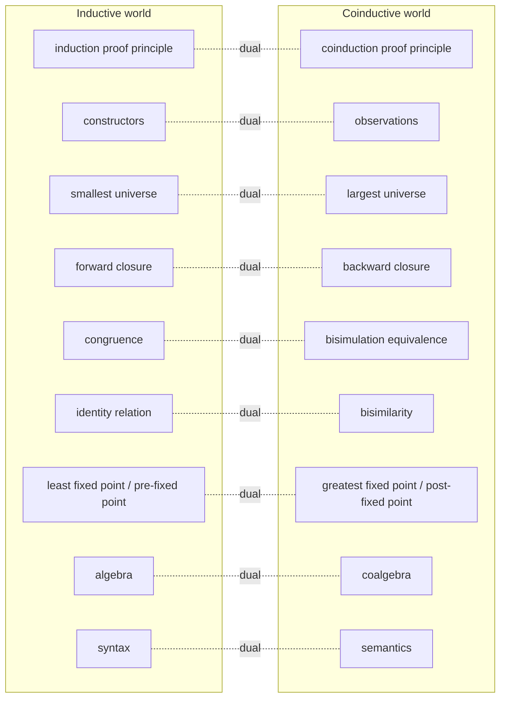

# Coinduction and the Duality with Induction

[[book-guidelines|↩ Back to guidelines]]

## Why this chapter exists

Chapter 1 of the book defines bisimilarity $\sim$ as *the union of all bisimulations* — a set defined in terms of itself. That's an **impredicative** definition: you can't build $\sim$ by first constructing its members and only afterward checking closure, the way you build up, say, the set of well-typed terms one derivation at a time. Sangiorgi flags this oddity and defers the explanation. Chapter 2 is that explanation, generalized far beyond bisimulation.

The problem it solves: **ordinary induction only knows how to define the smallest set satisfying some closure property.** That's exactly the right tool for *finite, well-founded, constructor-built* things — natural numbers, finite lists, terminating derivations, syntax trees. It is the *wrong* tool the moment you want to talk about objects that are infinite, or defined by mutual, circular reference: an infinite stream, a non-terminating process, two processes that are "equal" only because neither one can ever exhibit behavior the other can't match, forever. If you try to force such an object into "smallest set closed under these rules," you get the empty set, because there's no finite bottom-up construction that reaches it.

What breaks without a dual notion: you'd have no principled way to *define* bisimilarity (you'd have to accept it as a primitive, unprovable "it's the right notion, trust me"), and no way to *prove* two infinite-behavior objects equal except by an infinite case analysis that never terminates. Coinduction fixes both problems at once. It defines the **largest** set consistent with a closure property (rather than the smallest), and it gives a *finite* proof technique — exhibit a suitable relation, once — for facts about literally infinite objects.

The vehicle Sangiorgi uses to make this rigorous is **fixed-point theory over complete lattices**: the Knaster–Tarski theorem. This is the same theorem, and the same machinery, that underlies abstract interpretation's collecting semantics, Datalog/CHC solving, and dataflow analysis in compilers — so if you're building a verifier, this chapter is not background reading, it's the load-bearing wall.

---

## 1. Posets and complete lattices: the arena where fixed points live

### The intuitive picture before the symbols

To talk about "smallest" and "largest" sets satisfying a property, you need an ordering on the space of candidate sets, and you need that ordering to be rich enough that "smallest set with property $P$" and "largest set with property $P$" are guaranteed to *exist*, not just be wishful phrases. A **poset** (partially ordered set) gives you the ordering; a **complete lattice** gives you the guarantee.

### The formalism

**Poset** (Def. 2.3.1): a set $L$ with a relation $\leq$ that is reflexive, antisymmetric, and transitive. Write $x \leq y$ as "$x$ is below $y$." Reversing $\leq$ everywhere gives you the **dual poset** — this is why so much of the chapter comes in matched pairs (upper bound / lower bound, join / meet, least / greatest, pre-fixed / post-fixed): every definition and theorem about $\leq$ has a mechanically-dual statement about $\geq$, and Sangiorgi exploits this relentlessly instead of proving things twice.

- **Upper/lower bound** (Def. 2.3.4), **join/meet** (Def. 2.3.5): the join $\bigcup S$ of a subset $S \subseteq L$ is its least upper bound; the meet $\bigcap S$ is its greatest lower bound. (Sangiorgi overloads $\cup, \cap$ for join/meet in general posets, not just for set union/intersection — a deliberate notational choice, because the main complete lattices in this book *are* powersets, where join and meet literally are union and intersection.)
- **Complete lattice** (Def. 2.3.10): a poset in which *every* subset has a join (which, it turns out, forces every subset to also have a meet — Exercise 2.3.17). Taking the join/meet of the empty set gives you the bottom $\bot$ and top $\top$ elements for free.

The canonical complete lattice in this chapter, and the one that will matter for everything downstream, is the **powerset lattice**: for a set $X$, $(\wp(X), \subseteq)$ is a complete lattice with $\bot = \emptyset$, $\top = X$, join = union, meet = intersection. Almost every inductive or coinductive set in the book — finite traces, bisimulations, sets of terms — lives inside a powerset lattice.

### Monotone functions and fixed points

**Definition 2.3.8.** For an endofunction $F: L \to L$ on a poset:
- $F$ is **monotone** if $x \leq y \implies F(x) \leq F(y)$.
- $x$ is a **pre-fixed point** if $F(x) \leq x$; a **post-fixed point** if $x \leq F(x)$.
- $x$ is a **fixed point** if $F(x) = x$ (both pre- and post-).

This is the entire vocabulary you need. Everything else in the chapter is built from "monotone endofunction on a complete lattice."

### Grounding: a lattice as a trait

The book's complete lattice is, in Rust terms, exactly the shape of a bounded join-semilattice with all-subset joins — closest in spirit to the lattices used in dataflow analysis frameworks (`salsa`-style fixpoint engines, Rust borrow-checker's region inference, or any classic worklist solver):

```rust
trait CompleteLattice: PartialOrd + Clone + Eq {
    fn bottom() -> Self;
    fn top() -> Self;
    fn join(&self, other: &Self) -> Self; // binary join suffices when we only ever
    fn meet(&self, other: &Self) -> Self; // iterate over finite/countable chains
}

trait Monotone<L: CompleteLattice> {
    fn apply(&self, x: &L) -> L;
    // Contract the type does NOT enforce, but the algorithm below requires:
    //   x <= y  implies  apply(x) <= apply(y)
}
```

`Vec<bool>` (a bitset over program points, ordered by inclusion) instantiating `CompleteLattice` with `bottom = all false`, `join = elementwise or`, is precisely the lattice a reaching-definitions or liveness analysis runs over — and `Monotone` there is the transfer function of the analysis. This is not an analogy stretched to fit; it is the same theorem, reused.

In Lean, the corresponding structure is `CompleteLattice` in Mathlib, and `OrderHom` is a bundled monotone function — Lean's own `OrderHom.lfp` and `OrderHom.gfp` are literally implementations of the theorem below, which is worth knowing if you ever want to check a construction against a trusted kernel instead of hand-rolling it.

---

## 2. The Fixed-point Theorem (Knaster–Tarski)

### What breaks without it

Monotonicity alone (Definition 2.3.8) doesn't guarantee a fixed point exists at all on an arbitrary poset — you need completeness. And even granting existence, "the fixed point" is ambiguous unless you specify *which* one; a monotone function on a complete lattice can have many fixed points (Example 2.3.9: on $(\mathbb{N}^+, \mid)$ with $F$ = "sum of proper divisors," both $1$ and $6$ are fixed points). Induction and coinduction are, respectively, the *recipe* for picking out the extreme ones — least and greatest — and the theorem below is what guarantees those extremes exist and characterizes them concretely.

### The theorem

> **Theorem 2.3.21 (Fixed-point Theorem).** On a complete lattice, a monotone endofunction $F$ has a complete lattice of fixed points. In particular:
> $$\mathrm{lfp}(F) = \bigcap\{x \mid F(x) \le x\} \qquad \mathrm{gfp}(F) = \bigcup\{x \mid x \le F(x)\}$$

In words: **the least fixed point is the meet of all pre-fixed points**, and **the greatest fixed point is the join of all post-fixed points**. On powerset lattices this specializes to
$$\mathrm{lfp}(F) = \bigcap\{S \mid F(S) \subseteq S\}, \qquad \mathrm{gfp}(F) = \bigcup\{S \mid S \subseteq F(S)\}.$$

This immediately gives you two facts that look asymmetric but are exact duals:
- $\mathrm{lfp}(F)$ is itself a pre-fixed point (it's the *least* pre-fixed point).
- $\mathrm{gfp}(F)$ is itself a post-fixed point (it's the *greatest* post-fixed point).

**Why this is the engine of the whole chapter:** it turns "define the smallest/largest set with property $P$" from an existence question into a *computation recipe over pre-/post-fixed points*, and — critically — it directly hands you a proof principle for free (next section).

### The abstract-interpretation and CHC connection, made explicit

If you've seen abstract interpretation, this theorem *is* the reason a static analysis's fixed point exists and is well-defined: the collecting semantics of a program is $\mathrm{lfp}(F)$ where $F$ propagates abstract states one step along the CFG, over the lattice of abstract states ordered by $\sqsubseteq$ (implication/inclusion). Soundness of an over-approximate invariant $I$ — "prove $I$ contains all reachable states" — is *exactly* Corollary 2.4.3's induction principle below, instantiated with $F$ = one step of concrete/abstract transition: show $F(I) \le I$ (i.e. $I$ is inductive/a pre-fixed point) and conclude $\mathrm{lfp}(F) \le I$. This is also, verbatim, what solving a system of **Constrained Horn Clauses (CHCs)** means: each CHC clause is a ground rule in the sense of §4 below, the CHC solver is searching for an inductive invariant (a pre-fixed point of the clause functional) that both over-approximates $\mathrm{lfp}$ and refutes the query clauses. Section 4 makes the rule-based version of this precise.

### Grounding: computing $\mathrm{lfp}$ in Rust

The theorem is non-constructive as stated (it defines $\mathrm{lfp}$ via an intersection over *all* pre-fixed points, which you can't enumerate). §5 below gives the constructive version — Kleene iteration — which is what you'd actually implement:

```rust
fn lfp<L: CompleteLattice>(f: &impl Monotone<L>) -> L {
    let mut x = L::bottom();
    loop {
        let next = f.apply(&x).join(&x); // F(x) ∨ x, monotone-safe even if apply
                                          // isn't perfectly extensive
        if next == x { return x; }
        x = next;
    }
}
```

This terminates on any finite-height lattice (guaranteed by monotonicity + finite height, no continuity needed) — the same loop, with the transfer function replaced, is a worklist dataflow solver, and with the lattice replaced by a formula lattice ordered by implication, it's the skeleton of a naive CHC/Datalog fixpoint engine.

---

## 3. Inductively and coinductively defined sets, and their proof principles

### The duality, stated precisely

> **Definition 2.4.1.** For a complete lattice $L$ of sets and endofunction $F$:
> $$F_{\mathrm{ind}} \stackrel{\mathrm{def}}{=} \bigcap\{x \mid F(x) \le x\} = \mathrm{lfp}(F), \qquad F_{\mathrm{coind}} \stackrel{\mathrm{def}}{=} \bigcup\{x \mid x \le F(x)\} = \mathrm{gfp}(F).$$

So: **an inductively defined set just *is* a least fixed point; a coinductively defined set just *is* a greatest fixed point.** That's the whole definition. Everything that felt informal in §2.1's worked examples (finite traces vs. $\omega$-traces, convergence vs. divergence in the $\lambda$-calculus, finite vs. infinite lists) now has a single formal home.

Directly from the theorem you get the two central proof principles, first in general form:

> **Corollary 2.4.3.** For monotone $F$ on a complete lattice:
> $$\text{if } F(x) \le x \text{ then } \mathrm{lfp}(F) \le x \qquad \textbf{(induction)}$$
> $$\text{if } x \le F(x) \text{ then } x \le \mathrm{gfp}(F) \qquad \textbf{(coinduction)}$$

Read the coinduction principle carefully, because it is the single most useful sentence in the chapter: *to prove some set $x$ is contained in the coinductively-defined set, you don't need to explore $x$'s elements one at a time forever — you only need to show $x$ is a post-fixed point, once.* That is what makes bisimilarity provable at all: exhibiting a bisimulation relation $R$ (a post-fixed point of the bisimulation functional) with $(P,Q) \in R$ proves $P \sim Q$ in one finite step, even though $P$ and $Q$ might have infinite behavior.

### Forward closure vs. backward closure

Before formalizing rules (§4), §2.1–2.2 already isolate the intuitive shape of each direction:

- **Forward closure** (inductive): $T$ is closed forward if, for every rule, whenever the *premises* hold in $T$, the *conclusion* is also in $T$. You use the rules top-down, premises $\to$ conclusion. $\mathrm{Find}$ is the *smallest* forward-closed set.
- **Backward closure** (coinductive): $T$ is closed backward if every *element* of $T$ can be justified as the conclusion of some rule whose premises are, again, in $T$. You use the rules bottom-up, conclusion $\to$ premises. $\mathrm{Fcoind}$ is the *largest* backward-closed set.

Sangiorgi states the quantifier-order contrast explicitly (§2.2), and it's worth internalizing exactly this way, because the swap of "for each / there is" is the entire technical content of the induction/coinduction split:

- Forward closure: *for each rule* whose premises are satisfied in $T$, *there is* an element of $T$ that is the conclusion.
- Backward closure: *for each* element of $T$, *there is* a rule whose premises are satisfied in $T$, of which the element is the conclusion.

### The duality table (Table 2.1)



Two of these rows are worth flagging for the elaborator/checker project specifically: **identity vs. bisimilarity** is the duality between *syntactic* equality and *semantic/behavioral* equality — which is exactly the tension a dependently-typed elaborator lives inside constantly, between two-terms-are-literally-the-same-AST (structural, inductively checkable) and two-terms-are-definitionally-equal (may require unfolding, reduction, potentially non-terminating search — closer in spirit, if not identical, to the coinductive/observational reading). **Congruence vs. bisimulation equivalence**: a congruence is the *smallest* forward-closed equivalence containing syntactic identity; this is the correct mental model for why proving that a type-checker's definitional equality respects substitution (a congruence property) is an *inductive* argument on term structure, even in a system whose reduction semantics can be non-terminating.

---

## 4. Definitions by rules: rule induction and rule coinduction

### From informal rules to a monotone functional

Every inference-rule system you've written (typing rules, small-step semantics, `⇑`/`⇓` for the $\lambda$-calculus, bisimulation's matching-transitions clauses) is, underneath the notation, a set of pairs — **ground rules** (Def., §2.5): a rule on a set $X$ is a pair $(S, x)$ with $S \subseteq X$, $x \in X$, read "from premises $S$, conclude $x$." An *open* rule with metavariables (the kind you actually write down) stands for the set of all its ground instances. A finite table of open rules can therefore denote an infinite — even uncountable — set of ground rules.

A set $R$ of ground rules on $X$ induces a **rule functional** $\Phi_R$, a monotone endofunction on $\wp(X)$:
$$\Phi_R(T) = \{x \mid (S, x) \in R \text{ for some } S \subseteq T\}$$
— "the conclusions you can derive in one step from premises already in $T$." Monotonicity of $\Phi_R$ (Exercise 2.5.2) is basically free: enlarging $T$ can only make more premise sets $S \subseteq T$ available, never fewer. And the converse also holds (Exercise 2.5.3): *every* monotone operator on a powerset lattice is expressible as the functional of some set of rules. Rules and monotone functionals are, extensionally, the same object viewed two ways.

Given $\Phi_R$, plug straight into Definition 2.4.1 and Corollary 2.4.3, and you get:

$$\mathrm{lfp}(\Phi_R) \text{ is the set inductively defined by } R \text{ (rule induction target)}$$
$$\mathrm{gfp}(\Phi_R) \text{ is the set coinductively defined by } R \text{ (rule coinduction target)}$$

and the corresponding **rule induction** (2.1) / **rule coinduction** (2.2) principles:
$$\text{if } \Phi_R(T) \subseteq T \text{ then } \mathrm{lfp}(\Phi_R) \subseteq T \qquad \text{if } T \subseteq \Phi_R(T) \text{ then } T \subseteq \mathrm{gfp}(\Phi_R)$$

Unpacked, rule induction is exactly the induction on derivations you already know: (i) every axiom's conclusion is in $T$ (base case), (ii) whenever a rule's premises are all in $T$, so is its conclusion (inductive step). Rule coinduction is exactly the "exhibit a post-fixed set" recipe: every element of $T$ must be *justifiable*, right now, by some rule whose premises are already in $T$ — no infinite regress required in the proof, even though the object being proven-about (e.g. an infinite stream) is itself infinite.

### Why this is exactly CHC solving and Datalog

A CHC (or a Datalog rule, or a typing rule read as "generates the set of well-typed terms") *is* a ground rule $(S, x)$ in this sense, and the functional $\Phi_R$ is exactly the one-step consequence operator ($T_P$-operator, in logic-programming terminology) that a Datalog engine or CHC solver iterates. Finding the least model of a Horn program is $\mathrm{lfp}(\Phi_R)$; finding a safe inductive invariant that entails a query's negation is finding *some* pre-fixed point of $\Phi_R$ above the actual reachable-states $\mathrm{lfp}$ — this is precisely what a CHC solver like Spacer/Eldarica is doing, dressed in different notation. If you ever wondered why CHC solving and abstract interpretation feel like the same problem wearing different clothes, this is the reason: both are literally instances of Corollary 2.4.3.

### FP and FC: when the functional is well-behaved enough to iterate

$\Phi_R$ need not be continuous or cocontinuous in general (§2.9 gives explicit counterexamples both ways). Two syntactic conditions restore good behavior:

- **FP** (finite in premises, Def. 2.9.1): every rule's premise set $S$ is finite. This gives *continuity* of $\Phi_R$ (Exercise 2.9.2), hence $\mathrm{lfp}(\Phi_R) = \bigcup_n \Phi_R^n(\emptyset)$ — you can compute the inductive set by finite forward iteration.
- **FC** (finite in conclusions, Def. 2.9.3): for every $x$, only finitely many rules conclude $x$. This gives *cocontinuity* (Theorem 2.9.4), hence $\mathrm{gfp}(\Phi_R) = \bigcap_n \Phi_R^n(X)$.

Note the asymmetry: FP (about premises) buys you continuity/induction; FC (about *conclusions*) buys you cocontinuity/coinduction — not the naive mirror-image guess. Sangiorgi flags this as "the duality is less obvious, and needs some care" (§2.9), and it's worth sitting with the two counterexamples in the text (an infinite premise set collapsing the join, and infinitely many rules concluding the same atom collapsing the meet) rather than just memorizing the labels.

### Rust: a rule engine that computes both fixed points

```rust
use std::collections::HashSet;
use std::hash::Hash;

/// A ground rule (S, x): from premises S, derive x.
struct Rule<X> { premises: Vec<X>, conclusion: X }

fn phi_r<X: Eq + Hash + Clone>(rules: &[Rule<X>], t: &HashSet<X>) -> HashSet<X> {
    rules.iter()
        .filter(|r| r.premises.iter().all(|p| t.contains(p)))
        .map(|r| r.conclusion.clone())
        .collect()
}

// Rule induction target (needs FP for this naive loop to terminate on infinite X):
fn lfp_by_rules<X: Eq + Hash + Clone>(rules: &[Rule<X>]) -> HashSet<X> {
    let mut t = HashSet::new();
    loop {
        let next: HashSet<X> = t.union(&phi_r(rules, &t)).cloned().collect();
        if next.len() == t.len() { return t; }
        t = next;
    }
}

// Rule coinduction target: only well-defined to compute this way on a *finite* universe X
// (needs FC in the infinite case, plus a starting universe to shrink from).
fn gfp_by_rules<X: Eq + Hash + Clone>(rules: &[Rule<X>], universe: HashSet<X>) -> HashSet<X> {
    let mut t = universe;
    loop {
        let next: HashSet<X> = t.iter().filter(|x| {
            rules.iter().any(|r| &r.conclusion == *x && r.premises.iter().all(|p| t.contains(p)))
        }).cloned().collect();
        if next.len() == t.len() { return t; }
        t = next;
    }
}
```

`lfp_by_rules` is precisely a semi-naive Datalog evaluator's inner loop. `gfp_by_rules`, run to a fixed point on a finite universe, is precisely the classic *partition-refinement* bisimilarity algorithm: start with the universe of all pairs, repeatedly discard pairs that can no longer be backward-justified, until stable. Section 2.10 (just past this chapter's official range but directly downstream of it) instantiates exactly this for bisimulation.

---

## 5. Constructive iteration: reaching fixed points over $\mathbb{N}$ and the ordinals

### What breaks without a constructive route

The Fixed-point Theorem tells you $\mathrm{lfp}(F)$ and $\mathrm{gfp}(F)$ *exist* and equal certain meets/joins over *all* pre-/post-fixed points — but you can't enumerate "all pre-fixed points" to actually compute anything. You need an iterative schema starting from a concrete point ($\bot$ or $\top$) that provably converges to the fixed point.

### Continuity and cocontinuity (Def. 2.8.1)

$F$ is **continuous** if it commutes with joins of increasing chains: $F(\bigcup_i \alpha_i) = \bigcup_i F(\alpha_i)$ for $\alpha_0 \le \alpha_1 \le \cdots$. **Cocontinuous** is the dual, over decreasing chains and meets. These are strictly stronger than monotonicity (Exercise 2.8.2/2.8.3; Fig. 2.3 shows monotone $\supset$ {continuous $\cup$ cocontinuous}, and neither of the latter two contains the other).

> **Theorem 2.8.5 (Continuity/Cocontinuity Theorem).** If $F$ is continuous, $\mathrm{lfp}(F) = F^{\cup\omega}(\bot) = \bigcup_n F^n(\bot)$. If $F$ is cocontinuous, $\mathrm{gfp}(F) = F^{\cap\omega}(\top) = \bigcap_n F^n(\top)$.

This is **Kleene iteration**: start at $\bot$ (resp. $\top$), apply $F$ repeatedly, and after (at most) $\omega$ steps you've hit the fixed point — this is precisely why the `lfp` Rust loop above terminates: on a finite-height lattice, monotonicity alone already forces the chain to stabilize in finitely many steps, and continuity is what lets you *justify* that the limit you reach really is $\mathrm{lfp}(F)$ rather than merely a bound on it.

### When continuity fails: iterate over the ordinals instead

If $F$ is *only* monotone (no continuity), $\omega$ steps of Kleene iteration might not be enough — you get $\mathrm{gfp}(F) \le F^{\cap\omega}(\top)$ but possibly strict inequality (Example 2.8.7 gives an explicit monotone, non-cocontinuous $F$ where $F^{\cap\omega}(\top) = -\omega \ne \mathrm{gfp}(F) = -(\omega+1)$). The fix (Theorem 2.8.8) is **transfinite iteration**:
$$F^0(\top) = \top, \qquad F^{\lambda+1}(\top) = F(F^\lambda(\top)) \text{ (successor)}, \qquad F^\lambda(\top) = \bigcap_{\beta<\lambda} F^\beta(\top) \text{ (limit)}$$
and $F^\infty(\top) = \mathrm{gfp}(F)$ is reached at *some* ordinal — a genuine, cardinality-based existence argument (there must be an ordinal where the strictly-decreasing-until-fixed chain stabilizes, or you'd inject a proper class into a set).

**Why this matters for the CSP/abstract-interpretation project specifically:** this is the precise theoretical reason abstract interpretation needs **widening operators** on infinite-height lattices (e.g. intervals, polyhedra) — those lattices are monotone but *not* continuous in general, so naive $\omega$-iteration doesn't converge in finitely many concrete steps, and you either (a) iterate transfinitely (not computable) or (b) force early convergence with a widening $\nabla$ that trades precision for termination, then refine with narrowing. Sangiorgi doesn't discuss widening — it's not in this book — but Theorem 2.8.8 is exactly the theorem whose constructive failure widening is designed to route around.

### Grounding: transfinite iteration is just "iterate until it stops changing, then union"

```rust
// On a finite-height lattice this collapses to the ω-Kleene loop from §2.
// On an infinite-height lattice, this is the mathematical statement, not a
// literal terminating program — real analyzers substitute a widening here.
fn gfp_transfinite<L: CompleteLattice>(f: &impl Monotone<L>, chain: &mut Vec<L>) {
    chain.push(L::top());
    loop {
        let last = chain.last().unwrap().clone();
        let next = f.apply(&last);
        if next == last { return; } // reached a fixed point at this stage
        chain.push(next);
        // at a "limit stage" you'd instead push the meet of the whole chain so far;
        // finite-height lattices never actually reach a limit stage
    }
}
```

---

## 6. Proof trees: well-founded vs. non-well-founded membership

### The idea before the formalism

Two more equivalent readings of $\mathrm{lfp}$ and $\mathrm{gfp}$, in terms of the *derivation trees* rules produce (§2.11). A **proof tree** for $x$ under rules $R$: root labeled $x$, and every non-leaf node's children are exactly the premises of some rule concluding that node's label.

> **Theorem 2.11.2.** $x \in \mathrm{lfp}(\Phi_R)$ iff there is a **well-founded** proof tree for $x$ (all paths finite length; under FP, this means simply a *finite* tree).
> **Theorem 2.11.5.** $x \in \mathrm{gfp}(\Phi_R)$ iff there is *any* proof tree for $x$ — finite or infinite, well-founded or not.

This is the cleanest possible statement of the induction/coinduction asymmetry: the inductive set is exactly the elements with a terminating, bottom-up justification; the coinductive set additionally admits elements whose only "justification" is an infinite regress that never bottoms out but also never gets stuck — a circular argument that is nonetheless *coherent*, because at every finite depth it's still correctly following the rules. The proof of Theorem 2.11.5 builds the tree via **König's Lemma**-style reasoning: pick one justifying rule per node (needs some choice, hence the FP/FC assumptions Sangiorgi imposes to keep things simple) and the resulting tree is automatically a legitimate coinductive witness.

### Why the two proofs are not symmetric

The book flags (Remark 2.11.6) that the *proof strategy* for Theorem 2.11.2 (approximants $\Phi_R^n(\emptyset)$, increasing, union) does not dualize cleanly to Theorem 2.11.5, because $\mathrm{lfp}$ is an intersection over pre-fixed points while $\mathrm{gfp}$ is a union over post-fixed points — trees "partially correct up to depth $n$" can be built consistently for the increasing inductive approximants but conflict with each other (different rule choices at the same node) when you try to run the same trick for the decreasing coinductive approximants. This is a genuinely asymmetric fact about the duality, not a gap in exposition — worth remembering the next time a "just dualize the proof" argument feels too easy.

### Grounding: this is exactly the well-founded-recursion termination argument

In Lean, a `WellFoundedRecursion`/structural-recursion definition is accepted by the kernel precisely because the *call tree* it generates is guaranteed well-founded — Theorem 2.11.2 in different clothing: your function's recursive calls are the "proof tree," and Lean's termination checker is verifying, syntactically, that this tree cannot have an infinite path. A Lean `partial def` or an (eventual) coinductive `codata` definition is the Theorem 2.11.5 side: you're accepting definitions whose "unfolding tree" is allowed to be infinite, provided it's still *productive* — every finite prefix is well-formed — which is exactly "there is a proof tree," full stop, no well-foundedness required.

---

## 7. Game-theoretic characterizations

### The idea

§2.12–2.14 recast membership in $\mathrm{lfp}$/$\mathrm{gfp}$ as a two-player game between a **Verifier** V (trying to show $x_0$ has a proof) and a **Refuter** R (trying to show it doesn't). A play alternates: V picks a rule justifying the current element, R picks one of its premises to challenge next, and so on — building exactly a path down a proof tree, one node at a time, adversarially.

> **Theorem 2.12.5.** $x_0 \in \mathrm{lfp}(\Phi_R)$ iff V has a winning strategy in $G^{\mathrm{ind}}(R, x_0)$; $x_0 \in \mathrm{gfp}(\Phi_R)$ iff V has a winning strategy in $G^{\mathrm{coind}}(R, x_0)$.

The *entire* semantic content of induction vs. coinduction collapses to one rule about how to score infinite plays: **in the inductive game, an infinite play is a win for the Refuter** (matches Theorem 2.11.2 — no infinite path may exist in a valid least-fixed-point proof tree); **in the coinductive game, an infinite play is a win for the Verifier** (matches Theorem 2.11.5 — infinite paths are fine). Everything else about the two games is identical.

§2.13–2.14 specialize this directly to bisimulation: the simpler version (2.14) has R pick a transition from either process, V must match it in the other, and the play continues; $P \sim Q$ iff V has a winning strategy, $P \not\sim Q$ iff R does. This is *the* standard operational picture of bisimulation-checking tools, restated as a coinductive game instance.

### Why this is directly useful for the CSP/counterexample project

This verifier/refuter framing is a clean formal ancestor of **CEGAR** (counterexample-guided abstraction refinement): the Refuter's role in the *inductive* game — hunting for the path that breaks the candidate proof — is structurally the same move as a model checker or CHC solver searching for a concrete counterexample trace that refutes a proposed invariant; the Verifier's role in the *coinductive* game — needing only a single, once-and-for-all justifying strategy, never re-litigated — is the same shape as exhibiting a bisimulation witness or a safety invariant once, rather than re-proving safety at every reachable state. Game semantics of this kind is also the standard technique for characterizing modal $\mu$-calculus model checking, which is the theoretical home of the fixed-point reasoning your CSP/lattice-propagation kernel will eventually need for anything beyond purely first-order constraints.

---

## Where this leads

**Backward**, this chapter retroactively justifies Chapter 1: bisimilarity's impredicative "union of all bisimulations" definition is now visibly an instance of $F_{\mathrm{coind}} = \mathrm{gfp}(F)$ for the bisimulation functional (worked out explicitly in the book's §2.10, just past this excerpt's range), and [[Bisimulation-and-Bisimilarity#The bisimulation proof method|the bisimulation proof method]] — exhibit one relation, done — is a direct instance of the coinduction proof principle (Corollary 2.4.3). The impredicativity that looked suspicious in Chapter 1 is now just: "$\sim$ is defined as a join of post-fixed points, which is guaranteed to exist and be well-behaved by Theorem 2.3.21." Nothing circular about it once you have the lattice.

**Forward**, essentially the entire rest of the book leans on this chapter's vocabulary without re-deriving it: the stratification of bisimilarity into approximants $\sim_n, \sim_\omega$ (§2.10.2, Ch. 2) is Kleene/transfinite iteration (§5 above) applied to the bisimulation functional; "bisimulation up-to" techniques (mentioned here as enhancement principles, §2.7.3, and used throughout Chapters 3–7) are instances of the *up-to* coinduction principles ($x \le F(x \cup y)$); every later congruence proof (bisimilarity is preserved by CCS's operators, Chapter 3) is an induction-on-syntax argument dual to the coinduction-on-behavior arguments used to establish bisimilarity itself in the first place — the "constructors vs. observations" row of the duality table, worked out in full for a real language.

**For the compiler/elaborator/CSP project**, three threads are directly load-bearing, not incidental:
1. **Typing judgments and inductive proof search** are $\mathrm{lfp}$ of a rule functional in exactly the sense of §4 — a bidirectional typing/elaboration algorithm *is* a (partial, syntax-directed) proof-search procedure for membership in that least fixed point, and termination arguments for it are well-founded induction (§6) on some measure (usually term/type structure).
2. **Definitional equality and unification**, when they must handle recursive or lazy definitions, sit closer to the coinductive side: two possibly-infinite unfoldings are "equal" if no finite observation distinguishes them, checkable via the coinduction principle — exhibit a relation containing the pair that's closed under one step of unfolding-and-comparing, exactly the shape of a bisimulation-up-to argument. This is the precise sense in which "checking `isDefEq` on two terms with recursive definitions" is doing a bisimulation-style coinductive check, even when no textbook calls it that.
3. **The CHC/CSP kernel's fixed-point solving, and its CEGAR loop**, are literally Corollary 2.4.3 (finding an inductive/pre-fixed-point invariant) plus the verifier/refuter game of §7 (a refuter search for a counterexample when the candidate invariant fails to be inductive) — the theory in this chapter is the correctness argument you'll eventually want to cite when you claim your invariant-generation engine is sound.
