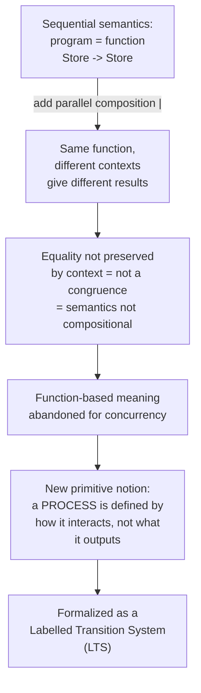

[[book-guidelines|↩ Back to guidelines]]

# Processes and Labelled Transition Systems

## Why "programs are functions" collapses under concurrency

Every working programmer already has a semantics for sequential code, even if they've never
named it: a program is a function from inputs to outputs. A pure function `f : Store -> Store`
that reads and writes a memory, or `f : Int -> Int` for something purely functional — either
way, what a program *means* is the transformation it performs, and two programs are "the same"
if they compute the same transformation. This is denotational semantics in miniature, and it's
exactly the intuition Scott and Strachey formalized for sequential languages in the 1970s.
Sangiorgi opens the book by showing this intuition dies the moment you add concurrency, and the
death is instructive because it's what forces the entire coinductive apparatus of the rest of the
book into existence.

**What breaks:** take two imperative fragments,
$$
X := 2 \qquad\text{and}\qquad X := 1;\, X := X + 1.
$$
As functions from stores to stores, these are identical — both map any initial store to a store
where $X = 2$. Under the "meaning = function" view, they're equal, full stop, and equality should
be substitutable: replacing one by the other anywhere shouldn't change anything, because that's
what it means for a semantics to be *compositional* (equivalently, for the induced equality to
be a *congruence* — preserved by every context you can plug the term into).

Now put a parallel-composition operator $P \mid Q$ into the language and place each fragment in
the context $[\cdot] \mid X := 2$:

- $X := 2 \mid X := 2$ always terminates with $X = 2$.
- $(X := 1;\, X := X + 1) \mid X := 2$ can terminate with $X = 2$ *or* $X = 3$, depending on
  when the parallel assignment interleaves with the two-step sequence.

Two terms that were "equal" as functions now produce observably different results once dropped
into an identical context. The function-based equality is not preserved by parallel composition
— it is not a congruence. And a non-compositional semantics is close to useless for reasoning:
you lose the ability to swap a subcomponent for an "equal" but simpler one, prove properties of
a system from properties of its pieces, or do any kind of modular reasoning at all. This is the
central engineering complaint, not a pedantic mathematical one.

There are two more independent reasons the function view fails for concurrent systems, both
worth internalizing because they recur as design constraints all the way through the book:

1. **Non-termination is not failure.** A sequential program that never returns is broken (an
   infinite loop, a bug). An operating system, a network controller, or a train signalling
   system is *supposed* to run forever while still doing something meaningful the whole time.
   Modeling it as "the function it computes" throws away everything interesting, because there's
   no well-defined output to speak of — the mathematical object one would extract is `undefined`
   on exactly the executions that matter.
2. **Non-determinism resists the powerset trick, but only up to a point.** Sequential
   non-determinism (e.g., `λx. x ⊕ (x+1)`, an internal choice) can be encoded denotationally by
   returning a *set* of possible results — the program becomes a function into a powerdomain.
   This is workable, if awkward, for pure choice. It does not scale to the non-determinism that
   *specifically arises from parallel interleaving* — the vending-machine-style branching you get
   from two components racing against each other — which is the harder, structural kind of
   non-determinism concurrency theory actually needs to model.

So: if parallel programs aren't functions, what are they? Sangiorgi's answer is **processes** —
entities whose defining property is that they *interact* with an environment over time, rather
than transform an input into an output once. The rest of §1.2 is about finding the right
mathematical object to represent "interactive behaviour," and the answer is the labelled
transition system.



## Interaction as the unit of computation

Why did $X := 2$ and $X := 1; X := X + 1$ actually differ, once observed from outside? Because
they touch the shared memory in different patterns over time: one writes $X$ once, the other
writes it twice, with a window in between where another process can interleave. In a purely
sequential setting this difference is invisible — only the initial and final states are ever
observed. But once other entities share the same memory, *every* interaction with it is a point
where behaviour can diverge from another process's behaviour, and so every such point needs to
be part of what we call "the meaning" of a process.

This is the slogan Sangiorgi states directly: **in concurrency, computation is interaction.** Not
"computation produces a result and interaction is a side detail" — interaction *is* the thing
being modeled. A memory access, a database query, pressing a button on a washing machine — these
are all instances of the same basic phenomenon: some process performs a visible action, and that
action is potentially significant to something else observing or participating in it.

The book commits early to a simplifying restriction that holds through most of the text: the
interactions considered are **pure handshake synchronizations, without exchange of values** — no
data flowing along with the synchronization, just the bare fact that a labelled event occurred.
(Value-passing — where a communication event carries a datum — is deferred to Chapter 7, in
the treatment of barbed bisimilarity for richer interaction models.) This is a genuine
simplification, not a cop-out: it lets the theory of bisimulation be developed against the
simplest possible notion of "observable event" before layering on complications like data,
higher-order communication, or asynchrony.

## Labelled transition systems

### The running example: a vending machine

Sangiorgi's worked example — a machine that takes one coin, then dispenses tea or coffee on
request — is worth carrying through because it is the concrete object every subsequent
definition is abstracting away from.

- State $P_1$: waiting for a coin.
- On action `1c` (insert coin), $P_1$ becomes $P_2$.
- From $P_2$, action `request-tea` leads to $P_3$; action `request-coffee` leads to $P_4$.
- From $P_3$, action `tea` (dispense tea) returns to $P_1$; from $P_4$, action `coffee` returns to
  $P_1$.

What's observable about the machine is *only* this pattern of states and labelled arcs — not its
color, its shape, or anything about its internal wiring. This is the informal content that
Definition 1.2.1 pins down.

### Definition 1.2.1 (Labelled transition system)

> A **labelled transition system (LTS)** is a triple $(Pr, Act, {\longrightarrow})$ where $Pr$
> is a non-empty set called the **domain** of the LTS (its elements are called **states** or
> **processes**), $Act$ is the set of **actions** (or **labels**), and
> $\longrightarrow \subseteq Pr \times Act \times Pr$ is the **transition relation**.

For the vending machine: $Pr = \{P_1, P_2, P_3, P_4\}$,
$Act = \{\texttt{1c}, \texttt{request-tea}, \texttt{request-coffee}, \texttt{tea},
\texttt{coffee}\}$, and $\longrightarrow$ is the explicit five-tuple set of labelled edges
described above.

Notation: we write $P \xrightarrow{\mu} Q$ for $(P, \mu, Q) \in {\longrightarrow}$, call $Q$ a
**$\mu$-derivative** of $P$ (or just a derivative), and use $P, Q, R$ to range over processes and
$\mu$ to range over actions. It's worth pausing on how thin this definition really is: an LTS is
*nothing more* than a set, a set of labels, and a ternary relation. There is no notion of "final
state," no notion of "output," no algebraic structure imposed at all. That minimalism is
deliberate — it's exactly general enough to be the common target that every process calculus in
the book (starting with CCS in Chapter 3) will be compiled into via its operational semantics
rules, and general enough that bisimulation, once defined on top of it, applies to *any* system
describable this way — not just CCS terms.

**What breaks without the "no algebraic structure" restraint:** if the definition of LTS baked
in, say, a distinguished halting state or an assumption that $\longrightarrow$ is a partial
function (determinism), it would exclude exactly the phenomena — nondeterministic branching,
processes with no terminal state — that motivated leaving functions behind in the first place.

A useful reframing worth internalizing here, because it recurs constantly in the "how would I
implement this" reading: an LTS is precisely a labelled directed graph, and $\longrightarrow$ is
exactly a ternary relation you'd represent, in code, as an indexed set of edges. There is no
extra machinery — the entire semantic apparatus of process equivalence that the rest of the book
builds is erected on top of this one graph-shaped primitive.

### Multi-step derivatives

Definition 1.2.1 only tells you about single labelled steps. The book extends $\longrightarrow$
to finite sequences of actions in the expected way: for $s = \mu_1 \cdots \mu_n$,
$$
P \xrightarrow{s} P' \iff \exists\, P_1, \dots, P_{n-1}.\;
P \xrightarrow{\mu_1} P_1 \xrightarrow{\mu_2} \cdots \xrightarrow{\mu_n} P'.
$$
$P'$ is then a **multi-step derivative** of $P$ under $s$. Two shorthand notations recur
throughout the book: $P \xrightarrow{\mu}$ means "$P$ can perform $\mu$" (i.e., $\exists P'.\,
P \xrightarrow{\mu} P'$), and $P \not\xrightarrow{\mu}$ its negation; likewise
$P \xrightarrow{s}\!\!\xrightarrow{\mu}\!P'$ abbreviates "there is some $P''$ with
$P \xrightarrow{s} P''$ and $P'' \xrightarrow{\mu} P'$."

**Definition 1.2.3** then packages this into an object you'll want constantly: given an LTS
$L$ and a process $P$ of $L$, *the LTS generated by* $P$ has as states exactly the multi-step
derivatives of $P$, the same actions as $L$, and as transitions those of $L$ restricted to pairs
of derivatives of $P$. In other words: the reachable sub-transition-system rooted at $P$. Every
subsequent classification of processes (image-finite, finitely branching, etc.) is defined by
first passing to this generated LTS and then applying the corresponding LTS-level property — so
it's really a property about the *reachable behaviour* of $P$, not about the ambient LTS as a
whole.

## Structural classes of LTSs: image-finiteness, branching, determinism

These definitions matter for a very concrete reason that shows up two chapters later: several of
the book's central theorems (bisimilarity coinciding with its finite stratification $\sim_\omega$,
in particular) only hold under a finite-branching hypothesis. So this section is building the
vocabulary for exactly the boundary conditions those later theorems will need.

**Definition 1.2.4 (Image-finite relation).** A relation $R$ on a set $S$ is **image-finite** if
for every $s \in S$, the set $\{s' \mid s \mathrel{R} s'\}$ is finite.

**Definition 1.2.5** applies this at the level of a whole LTS, giving a hierarchy of increasingly
strong finiteness conditions:

- **Image-finite**: for every process $P$ and *every fixed action* $\mu$, the set
  $\{P' \mid P \xrightarrow{\mu} P'\}$ is finite. (Finitely many ways to resolve any *one* given
  action.)
- **Finitely branching**: image-finite, *and* for every $P$ the set of actions it can perform at
  all, $\{\mu \mid P \xrightarrow{\mu}\}$, is finite. (Finitely many actions available, each with
  finitely many outcomes — so the *total* branching at each state is finite.)
- **Finite-state**: the LTS has finitely many states outright.
- **Finite**: finite-state *and* acyclic — no infinite sequence
  $P_0 \xrightarrow{\mu_0} P_1 \xrightarrow{\mu_1} P_2 \xrightarrow{\mu_2} \cdots$. (A process
  that necessarily terminates after finitely many steps, on every path.)
- **Deterministic**: every process $P$ is deterministic, meaning for every action $\mu$,
  $P \xrightarrow{\mu} P'$ and $P \xrightarrow{\mu} P''$ together force $P' = P''$ — a given
  action, from a given state, has at most one outcome.

The book leaves as **Exercise 1.2.6** the implication structure among these — worth stating
because it clarifies which finiteness notion is doing the real work: finite-state implies
finitely branching *when the action alphabet is finite*; deterministic implies image-finite (no
branching at all is a degenerate case of finite branching per action); and none of the converses
hold — in particular, image-finite does **not** imply finitely branching, because a process could
have infinitely many *distinct enabled actions* even though each one individually has only
finitely many outcomes.

The reason this whole hierarchy exists, structurally, is that "finite branching" is really two
independent constraints stacked together — bounded fan-out *per action* (image-finiteness) and
bounded fan-out *across all actions* (finitely many enabled actions) — and it's easy to satisfy
one without the other. A process that can receive any natural number as a label but then behaves
identically regardless is image-finite-per-label yet not finitely branching. This is exactly the
kind of "obvious in code, subtle in the math" distinction that's worth sitting with.

### Sort of a process

**Definition 1.2.7 (Sort).** $\mu$ is in the **sort** of $P$, written $\mu \in \mathrm{sort}(P)$,
if there is some sequence $s$ and process $P'$ with
$P \xrightarrow{s}\!\!\xrightarrow{\mu}\!P'$ — i.e., $\mu$ is *reachably* possible for $P$, not
necessarily possible immediately. The sort of a process is the full alphabet of actions it can
ever perform, from its current state or any state reachable from it. It is not restricted to the
actions enabled right now; it's the *reachable* action alphabet.

## Grounding: what this looks like as code

**Rust.** An LTS translates almost verbatim into a small state-transition structure. The
generated-LTS-of-$P$ construction (Definition 1.2.3) is exactly a reachability BFS/DFS over this
graph:

```rust
use std::collections::{HashMap, HashSet, VecDeque};
use std::hash::Hash;

/// A labelled transition system: Pr = P, Act = A, and the transition
/// relation is represented as an adjacency map keyed by (state, action).
struct Lts<P: Eq + Hash + Clone, A: Eq + Hash + Clone> {
    transitions: HashMap<(P, A), Vec<P>>,
}

impl<P: Eq + Hash + Clone, A: Eq + Hash + Clone> Lts<P, A> {
    /// Definition 1.2.5: image-finite is automatic here since every
    /// bucket is a Vec (always finite in a concrete implementation) --
    /// the *interesting* question is whether the number of distinct
    /// actions enabled at a state is finite (finitely branching).
    fn enabled_actions(&self, p: &P, all_actions: &[A]) -> Vec<A> {
        all_actions
            .iter()
            .filter(|a| self.transitions.contains_key(&(p.clone(), (*a).clone())))
            .cloned()
            .collect()
    }

    /// Definition 1.2.3: the LTS generated by p -- reachable derivatives
    /// via a multi-step BFS, i.e. exactly the semantics of P --s--> P'.
    fn generated_from(&self, p: &P, all_actions: &[A]) -> HashSet<P> {
        let mut seen = HashSet::new();
        let mut queue = VecDeque::new();
        seen.insert(p.clone());
        queue.push_back(p.clone());
        while let Some(cur) = queue.pop_front() {
            for a in &self.enabled_actions(&cur, all_actions) {
                if let Some(nexts) = self.transitions.get(&(cur.clone(), a.clone())) {
                    for n in nexts {
                        if seen.insert(n.clone()) {
                            queue.push_back(n.clone());
                        }
                    }
                }
            }
        }
        seen
    }
}
```

Note what's *absent* from this struct: there is no `Output` type, no `fn run(&self, input:
Input) -> Output`. That absence is the entire point of §1.1 — the type signature of "a process"
has no input/output shape at all; it only has a *transition* shape. If you're building a
verifier or an elaborator, this is the same move as modeling a small-step operational semantics
as a relation `Config -> Label -> Config` rather than as a big-step evaluator `Config -> Value` —
the LTS view is the strictly more general one, and it's the one that supports reasoning about
non-termination and interaction rather than collapsing everything to a final answer.

**Connection to your compiler project:** this is worth being explicit about, because it's easy to
read "LTS" as pure concurrency-theory furniture and miss that it's the same object as a small-step
operational semantics relation used for type soundness proofs (progress + preservation are
statements *about* an LTS: progress says every well-typed non-final state has an outgoing
transition; preservation says every transition lands on a well-typed state). If your dependent/
refinement-type compiler's soundness argument goes through an operational semantics — which
Hoare-triple soundness typically does — you are, structurally, working with an LTS, and
bisimulation-style reasoning (Chapter 3 onward) is the natural tool for proving that two
different reductions of a term (e.g., a source term and its elaborated/compiled counterpart) are
observationally equivalent.

**Python**, for a quick illustrative sketch of the sort-of-a-process query (reachable action
alphabet) without Rust's type ceremony:

```python
def sort_of(process, transitions, actions):
    """transitions: dict[(state, action)] -> list[state]
       Returns the set of actions reachable from `process` (Definition 1.2.7)."""
    seen_states, frontier, sort = {process}, [process], set()
    while frontier:
        p = frontier.pop()
        for a in actions:
            targets = transitions.get((p, a), [])
            if targets:
                sort.add(a)
            for q in targets:
                if q not in seen_states:
                    seen_states.add(q)
                    frontier.append(q)
    return sort
```

**Lean** doesn't add much *here* specifically — an LTS as a bare relation is more naturally
Rust/Python-shaped than type-theory-shaped, and forcing a Lean encoding would be exactly the
"strained analogy" the style guide asks to avoid. The place Lean-style thinking becomes primary
is one topic later, once bisimulation itself is defined as a coinductively-characterized relation
— that's where the connection to greatest fixed points, and to how a proof assistant represents
coinductive relations, becomes load-bearing rather than decorative.

## Where this leads

This section supplies the *object level* that everything else in the book reasons about: no
later chapter revisits "what is a process," they all just work over LTSs as given here. The
immediate next move (§1.3, covered under a different topic) is to ask what "two processes are
equal" should mean, and shows that the two obvious candidates borrowed from adjacent fields —
graph isomorphism and trace equivalence — both fail (isomorphism is too fine, trace equivalence
is too coarse, famously failing to distinguish the vending machine above from a variant that can
deadlock after accepting a coin). That failure is what motivates bisimulation in §1.4, and
bisimulation is in turn defined *directly* in terms of the transition relation $\longrightarrow$
introduced here — the "matching transitions" clause of Definition 1.4.2 quantifies exactly over
the $\mu$-derivatives this section defines. The finite-branching classification from §1.2 also
resurfaces concretely in Chapter 2, where bisimilarity is shown to coincide with its
$\omega$-stratified approximation $\sim_\omega$ precisely under a finite-branching hypothesis —
so the taxonomy built here isn't idle bookkeeping, it's the exact condition that later theorem
needs.
