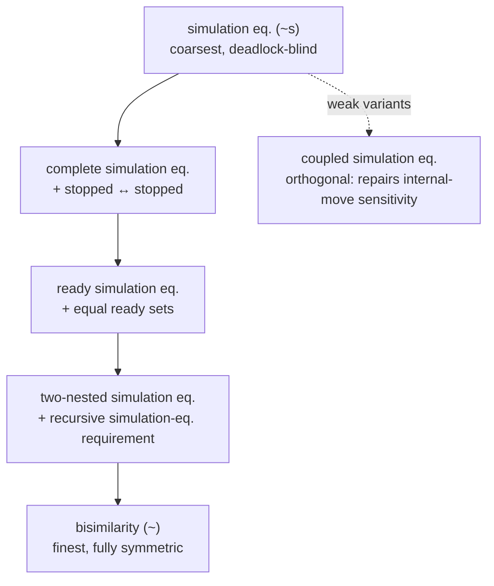
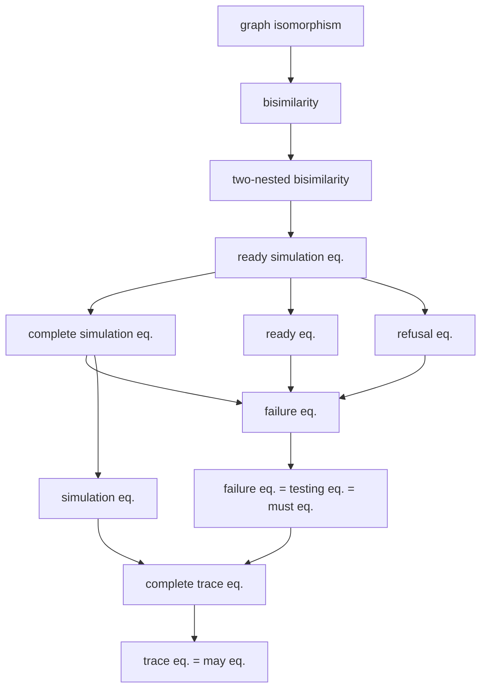

[[book-guidelines|↩ Back to guidelines]]

# Refinements of Simulation

## Why simulation equivalence isn't enough on its own

Simulation was introduced back in Exercise 1.4.17 as bisimulation with the symmetry knocked out: a relation $R$ is a **simulation** if $P\,R\,Q$ and $P\xrightarrow{\mu}P'$ implies there's a $Q'$ with $Q\xrightarrow{\mu}Q'$ and $P'\,R\,Q'$ — only $P$'s transitions get challenged, $Q$ is never required to challenge back. **Similarity** $\leq$ is the union of all simulations, and **simulation equivalence** $P \sim_s Q$ holds when $P \leq Q$ and $Q \leq P$ — note this is *not* the same as $\leq$ being symmetric; two processes can simulate each other mutually without any single relation between them being a bisimulation.

Two things make this attractive as a design point distinct from bisimilarity:

1. **It's still coinductive.** $\leq$ is a greatest fixed point exactly like $\sim$, so you keep the whole coinduction proof method — pick a relation, check the (one-sided) simulation clause, conclude every pair in it is related. You aren't forced back to inductive, trace-enumerating reasoning.
2. **$\leq$ is a genuine preorder, not just an equivalence relation.** That's new leverage: a preorder lets you say "$Q$ can do at least what $P$ can do" without insisting on exact behavioural parity — which is exactly the shape you want for a *specification/implementation* relationship, or for a notion of one process being safely substitutable for a less-capable one.

But simulation equivalence inherits a defect we already diagnosed for trace equivalence (§1.3.2): it is **insensitive to deadlock**. The same style of example that broke trace equivalence breaks it here — a process that can reach a stuck state can be simulation-equivalent to one that can't, because a simulation only has to match *transitions that exist*; a stopped process (no outgoing transitions at all) trivially satisfies the simulation clause against anything. This is the "[[Coinduction-and-the-Duality-with-Induction#What breaks without it|what breaks without it]]" case for the whole chapter: **if you want a coinductive relation with preorder structure that's actually useful for verification, you need to repair the deadlock blindness without giving up coinduction or the preorder.**

Sangiorgi's response mirrors, point for point, the earlier repair of trace equivalence into complete-trace/failure/ready equivalence (Ch. 5) — you'll see the same three moves (observe stopped-ness, observe ready sets, observe with more lookahead) replayed at the level of *states* rather than *traces*, plus one genuinely new relation, coupled simulation, that has no trace-based analogue because it's specifically about internal (silent) moves. If you're coming from a subtyping or refinement-types mindset: simulation is exactly a **behavioural subtyping preorder** — "$Q$ subtypes $P$" reads naturally as "$Q\leq P$: $Q$ can substitute for $P$ everywhere $P$'s guaranteed transitions are used" — and this chapter's whole arc is about how much extra structure that preorder needs to preserve before it's *sound* to use for substitution, which is precisely the question a refinement-type subtyping judgment has to answer for any base relation weaker than syntactic equality.



## 1. Complete simulation: patching in deadlock-sensitivity

The cheapest possible fix, mirroring complete trace equivalence exactly:

**Definition 6.1.1 (Complete similarity).** A simulation $R$ is a *complete simulation* if whenever $P\,R\,Q$: if $P$ is stopped, then $Q$ is stopped too. Complete similarity $\leq_{\mathrm{comp}}$ is the union of all complete simulations; $P \sim_{\mathrm{comp}} Q$ (**complete simulation equivalent**) iff $P \leq_{\mathrm{comp}} Q$ and $Q \leq_{\mathrm{comp}} P$.

This is a one-clause addition to the simulation definition, and it buys exactly what you'd expect: complete simulation equivalence implies complete trace equivalence (Exercise 6.1.4), since a "stopped-matches-stopped" clause at every related state forces the same maximal-sequence structure that Definition 5.10.1 observes at the trace level.

It does *not* buy compositionality, though — and the book is explicit that this is the same failure mode as complete trace equivalence. Exercise 6.1.3 shows the equality between the book's running example processes $P_2$ and $R_2$ (Fig. 1.7) is broken by the restriction operator: $\nu b\,P_2 \not\sim_{\mathrm{comp}} \nu b\,R_2$. And complete simulation equivalence sits strictly below failure equivalence in discriminating power — the book's example builds a third process that's complete-simulation-equivalent to $P_2$ and $R_2$ but has visibly different branching structure (different points where a choice between $b$ and $c$ becomes available), which failure equivalence tells apart but complete simulation does not. So: cheap fix, incomplete repair. It's here mainly as the base case for the next, more useful, refinement.

## 2. Ready simulation: the load-bearing refinement

**Definition 6.2.1 (Ready similarity).** A simulation $R$ is a *ready simulation* if whenever $P\,R\,Q$, also $\mathrm{readies}(P) = \mathrm{readies}(Q)$, where $\mathrm{readies}(P) = \{\mu \mid P\xrightarrow{\mu}\}$ is the set of actions $P$ can immediately perform (Definition 5.11.1, reused verbatim). Ready similarity $\leq_{\mathrm{rs}}$ is the union of all ready simulations; $P \sim_{\mathrm{rs}} Q$ iff both directions hold.

Two structural points worth internalizing:

- **The failure/ready distinction from Chapter 5 collapses here.** At the trace level, failure equivalence (observe a refusal set *after* a trace) and ready equivalence (observe the *maximal* accepted set after a trace) are genuinely different relations. At the simulation level they coincide, because the observation is made *pointwise on related states*, not after a whole trace — observing "the refused actions at this state" and observing "the accepted actions at this state" are complementary views of the same set, so there's no separate "complete-simulation-plus-refusals" relation distinct from ready simulation.
- **Equivalent reformulation (Exercise 6.2.2).** $R$ is a ready simulation iff $P\,R\,Q$ implies, for every action $\mu$: $Q$ has a $\mu$-transition only if $P$ does too. Read this as a **two-sided existence check with one-sided derivative tracking** — it's the shape you'd actually implement: you don't need to compare full ready sets as sets each time, you just need "$Q$'s enabled-action alphabet is a subset of $P$'s" as a side-condition alongside the ordinary one-sided simulation clause.

**Example 6.2.3** is the sharpest illustration of what ready simulation buys over plain similarity: $\mu.P \leq_{\mathrm{rs}} \mu.P + \mu.Q$ **fails** — even though $\mu.P \leq \mu.P+\mu.Q$ trivially holds for ordinary similarity (the right side can always answer $\mu$ by choosing the $P$-branch). Ready simulation blocks this because the ready sets differ at the root: $\{\mu\}$ vs. potentially $\{\mu\}$ too if $Q$ starts with the same first action, but the definition also forces every *derivative* pair to match ready sets, which propagates the distinction down the tree whenever $P$ and $Q$ ever expose different alternatives. This one inequality, together with the bisimilarity axioms, gives a sound and complete axiomatisation of ready similarity on finCCS ([Blo89], cited in the text) — a strikingly small algebraic signature for what the relation adds on top of bisimilarity's laws.

### Why ready simulation is *the* canonical answer, not just *a* refinement

This is the chapter's most important theorem, stated informally via Table 5.3 (reproduced from §5.12) and elaborated in §6.2's text:

**Ready simulation equivalence is exactly the congruence induced by complete-trace equivalence on the class of operators definable in the GSOS format.** Bloom, Istrail and Meyer argue GSOS is the "largest reasonable format" generalizing CCS's operators (allowing negative premises and argument-copying, but not lookahead — see §5.12's format taxonomy), and conclude that ready simulation equivalence is *the finest equivalence that makes computationally meaningful distinctions* under that generosity of operator definition. Concretely: if you build *any* language whose operators are GSOS-definable, and you want the coarsest congruence that's still sensitive to deadlock (i.e. respects complete traces), you get ready simulation equivalence — not something coarser, not something finer. This is a genuine theorem about the *ceiling* of what deadlock-sensitive congruences over GSOS languages can achieve, which is a much stronger claim than "here's a relation that happens to respect deadlock."

**Example 6.2.6 (lossy delay links, from [BIM95])** makes the payoff concrete with a realistic system, not a toy counterexample. Two implementations of a lossy delay link:
$$K_1 \xrightarrow{v} d.v.K_1 + d.z.K_1 \qquad (\text{loses } v \text{ only during the delay})$$
$$K_2 \xrightarrow{v} d.v.K_2 + d.z.K_2, \qquad K_2 \xrightarrow{v} d.z.K_2 \qquad (\text{may also lose } v \text{ at reception})$$
$K_1$ and $K_2$ are **ready simulation equivalent but not bisimilar** — bisimilarity distinguishes them because $K_2$ has an extra transition (the immediate-loss branch) that $K_1$ can't match step for step, but that extra branch never changes what's *eventually observable* in a way ready simulation cares about. The book's point: under ready similarity these two links are interchangeable in any system built from GSOS-definable operators; under bisimilarity they're not, and using one for the other could in principle be observed. This is the practical argument for choosing a coarser-than-bisimilarity equivalence when the extra discriminating power of bisimilarity isn't buying you anything the application cares about.

**Rust grounding: ready simulation as a checkable refinement relation.** The reformulation from Exercise 6.2.2 turns directly into an algorithm — this is the shape you'd want if you were implementing a simulation-preorder checker for, say, verifying a compiled process against its specification:

```rust
use std::collections::HashSet;

type State = u32;
type Action = String;

struct Lts {
    edges: Vec<(State, Action, State)>, // (source, label, target)
}

impl Lts {
    fn successors(&self, s: State, mu: &str) -> Vec<State> {
        self.edges.iter()
            .filter(|(src, a, _)| *src == s && a == mu)
            .map(|(_, _, tgt)| *tgt)
            .collect()
    }

    fn readies(&self, s: State) -> HashSet<&str> {
        self.edges.iter()
            .filter(|(src, _, _)| *src == s)
            .map(|(_, a, _)| a.as_str())
            .collect()
    }

    /// Greatest fixed point computation: start from the full relation
    /// (every P related to every Q) and iteratively remove pairs that
    /// violate the ready-simulation clause, until no more can be removed.
    /// This is the coinductive "largest post-fixed point" reading of ≤rs
    /// made operational — the same partition-refinement shape used for
    /// bisimilarity-checking algorithms, specialized to a one-sided clause
    /// plus a ready-set side-condition.
    fn ready_simulation(&self, states: &[State]) -> HashSet<(State, State)> {
        let mut rel: HashSet<(State, State)> = states.iter()
            .flat_map(|&p| states.iter().map(move |&q| (p, q)))
            .collect();

        loop {
            let mut to_remove = Vec::new();
            for &(p, q) in &rel {
                // ready-set clause: Q's enabled actions ⊆ P's enabled actions
                let ready_p = self.readies(p);
                let ready_q = self.readies(q);
                if !ready_q.is_subset(&ready_p) {
                    to_remove.push((p, q));
                    continue;
                }
                // one-sided transition-matching clause
                let all_actions: HashSet<&str> = self.edges.iter()
                    .filter(|(src, _, _)| *src == p)
                    .map(|(_, a, _)| a.as_str())
                    .collect();
                let mut ok = true;
                for mu in all_actions {
                    for p_prime in self.successors(p, mu) {
                        let matched = self.successors(q, mu).into_iter()
                            .any(|q_prime| rel.contains(&(p_prime, q_prime)));
                        if !matched { ok = false; break; }
                    }
                    if !ok { break; }
                }
                if !ok { to_remove.push((p, q)); }
            }
            if to_remove.is_empty() { break; }
            for pair in to_remove { rel.remove(&pair); }
        }
        rel
    }
}
```

This loop is the same "start from everything, refine down to a greatest fixed point" pattern you'd use for any coinductively-defined checkable relation — including a refinement-type subtyping checker that needs to verify "every capability the spec requires, the implementation also provides" while additionally tracking a side-condition (here, ready sets; in a refinement-type checker, typically a logical entailment between refinement predicates).

## 3. Two-nested simulation equivalence

**Definition 6.3.1.** A *two-nested simulation* is a simulation $R$ with $R \subseteq {\sim_s}$ (contained in ordinary simulation equivalence). Two-nested similarity $\leq_{2n}$ is the union of all two-nested simulations; $P \sim_{2n} Q$ iff both directions hold.

This is Groote and Vaandrager's answer ([GV92]) to the same congruence question, but for a *richer* operator format: **two-nested simulation equivalence is the congruence induced by complete-trace equivalence on the tyft/tyxt format** (which adds *lookahead* — premises whose target feeds another premise's source — over GSOS; see §5.12). Table 5.3's second row lines up exactly: GSOS ↦ ready simulation, tyft/tyxt ↦ two-nested simulation, ntyft/ntyxt ↦ bisimilarity. Each step up the format hierarchy (more expressive operator definitions admitted) forces a finer congruence.

**A two-nested simulation is automatically a ready simulation** (§6.3, following Def. 6.3.1): if two processes are simulation-equivalent, they necessarily have the same ready sets, so the extra constraint "$R \subseteq {\sim_s}$" already implies the ready-set-equality clause. This gives the strictly decreasing chain shown in the diagram above.

The book is candid that this relation's *practical* interest is thin — "the differences with ready simulation equivalence and bisimilarity are rather artificial" — and proving membership is genuinely more tedious: you need two simulations $R, S$ witnessing $P\sim_s Q$, and then, for **every pair added by $S$ beyond $R^{-1}$**, a *separate* proof that that pair is itself in simulation equivalence. The worked example ($P = a.(b.c+b)$, $Q = P + a.b.c$) shows this concretely: proving $P \sim_s Q$ needs $R = \{(P,Q)\}\cup I$ and $S = R^{-1}\cup\{(b.c,\, b.c+b)\}$, and the *extra* pair $(b.c, b.c+b)$ in $S$ needs its own simulation-equivalence proof before you can call $P\sim_{2n}Q$ established.

**The general pattern: $n$-nested simulation, by transfinite induction on $n$.** This is worth internalizing as a schema, since it recurs (in spirit) anywhere a relation is built by "iteratively strengthening a base relation by nesting a simulation-equivalence requirement inside itself":

$$
\leq_0^n \;=\; \sim_0^n \;\stackrel{\text{def}}{=}\; \mathrm{Pr}\times\mathrm{Pr}, \qquad
P \leq_{n+1}^n Q \iff \exists\, R\subseteq {\sim_n^n} \text{ a simulation with } P\,R\,Q, \qquad
P \sim_{n+1}^n Q \iff (P\leq_{n+1}^n Q \wedge Q\leq_{n+1}^n P).
$$

The $\sim_n^n$ form a strictly decreasing chain in set-containment as $n$ grows (Exercise 6.3.6), and **on image-finite LTSs, $\bigcap_n \sim_n^n = {\sim}$** — bisimilarity is recovered exactly as the limit of ever-more-nested simulation approximations. This is structurally the *same* stratification-by-approximants move Chapter 2 used for $\sim_n, \sim_\omega$, just indexed by *simulation nesting depth* instead of *bisimulation-game round number* — two independent ways of approaching bisimilarity as a limit, one via finite unrolling of the game tree, the other via finite iteration of "require the next level down to already agree up to simulation equivalence."

One sharp negative algebraic result: for $n \geq 2$, neither $\sim_n^n$ nor $\leq_n^n$ is finitely axiomatizable — not even on the trivial sublanguage of finite trees (nil, prefixing, choice only) where *bisimilarity itself* has a clean four-axiom presentation ($S_1$–$S_4$, Fig. 3.2). Nesting simulation equivalence inside itself, past depth 1, produces a family of relations that are individually well-defined but collectively resist any finite equational summary — a caution against assuming "coarser than bisimilarity" automatically means "algebraically simpler than bisimilarity."

## 4. Weak simulation variants

The pattern from Chapter 4 (strong $\to$ weak bisimilarity, by swapping $\xrightarrow{\mu}$ for $\stackrel{\mu}{\Rightarrow}$) repeats here with one added subtlety: since similarity is already one-sided, "weak simulation equivalence" needs *two separate* simulations, not one relation checked both ways.

**Definition 6.4.1 (Weak simulation).** Weak simulation replaces the challenged transition $Q\xrightarrow{\mu}Q'$ in the strong definition with the weak transition $Q\stackrel{\mu}{\Rightarrow}Q'$. Weak similarity is the union (= the largest) of all weak simulations. $P\approx_{se}Q$ (**weakly simulation equivalent**) iff there exist simulations $R_1, R_2$ with $P\,R_1\,Q$ and $Q\,R_2\,P$ — deliberately *two* relations, not one checked in both directions, because a single weak simulation relation need not be symmetric-closable the way strong similarity's union-of-all-simulations construction is.

Two harmless simplifications (Exercise 6.4.2) that don't change the resulting equivalence: you can special-case $\mu=\tau$ to use $Q\stackrel{}{\Rightarrow}Q'$ (no forced middle $\tau$) instead of the composite $\stackrel{\tau}{\Rightarrow}$, and you can restrict the *challenge* side to visible actions only (matching $\tau$-challenges is subsumed). These are conveniences for proofs, not changes of substance.

**Carrying the refinements over — with one non-trivial adjustment each:**

- *Weak complete similarity*: "stopped" has to mean "will never perform a visible action" (no reachable state has an outgoing visible transition), **not** "has no transitions at all" — otherwise a process like $\tau.\tau.\tau.\cdots$ that spins forever internally wouldn't count as stuck even though it's behaviourally dead to any observer. Under this reading, $\mathbf 0$, $\tau.\mathbf 0$, $\tau$ (the divergent constant), and $\tau+\tau$ are *all* "stopped" despite behaving very differently operationally — a reminder that "deadlock" and "livelock/divergence" get conflated once you're abstracting over $\tau$, and the book flags this explicitly as a modeling choice you might want to refine further (§4.4/§4.6–4.9's divergence-sensitivity machinery is the natural place to do that).
- *Weak ready similarity*: the ready set becomes $\{\mu \mid P \stackrel{\mu}{\Rightarrow}\}$ — actions reachable via a weak transition, not just an immediate strong one. One consequence worth flagging: **weak ready and weak failure similarity no longer coincide** the way their strong counterparts did in §6.2 — abstracting over $\tau$ reintroduces exactly the distinction between "maximal accepted set" and "some refused set" that collapsed at the strong level, because now there's real freedom in *which* internal path you take before checking readiness.
- *Weak two-nested similarity*: needs no further modification beyond "simulation" meaning "weak simulation" throughout — it inherits cleanly.

Exercise 6.4.5 flags a genuine defect: **weak complete similarity is not preserved by the choice operator** — the same congruence failure that motivated rooted weak bisimilarity in Chapter 4 recurs here, and for the identical structural reason (a process that's "weakly stopped" can still contribute a visible root-level alternative once placed under a $+$). The book is candid that the whole family of weak refinements is *less* compelling than their strong counterparts, precisely because the motivating theorem (congruence-induced-by-a-format) doesn't transport cleanly to weak semantics — the format theory for weak equivalences is, in the book's words, "less sharp and elegant." This sets up coupled simulation as the one relation in this chapter that's *specifically* designed for the weak setting rather than being a weak-transition retrofit of a strong idea.

## 5. Coupled simulation: repairing sensitivity to internal choice points

### The motivating failure: atomic vs. gradual commitment

This is the chapter's most substantial worked example, and it's worth reconstructing in full because it isolates a real defect of weak bisimilarity that neither ready nor two-nested simulation touches.

Parrow and Sjödin [PS92] needed to verify a distributed implementation of *multi-way synchronization* using only asynchronous binary communication. The specification commits to a choice among $n$ alternatives **atomically**, in one $\tau$-step:
$$M_0 \stackrel{\mathrm{def}}{=} \tau.a + \tau.b + \tau.c.$$
The implementation coordinates the same commitment through pairwise competitions for shared channels $e, f$, and needs **more than one internal step** to narrow down which branch wins:
$$N_0 \stackrel{\mathrm{def}}{=} (\nu e,f)\big(\bar e.\bar f \mid e.a \mid e.(f.b \mid f.c)\big).$$
Both processes reach the same three possible futures ($a$, $b$, or $c$), but $N_0$ passes through an intermediate, distinguishable choice point (the book calls it $BC$, "before commitment") on the way to resolving whether $b$ or $c$ will be offered — a state $M_0$ simply has no counterpart for, since $M_0$'s commitment is instantaneous.

**Every weak bisimilarity variant from Chapter 4 fails to relate $M_0$ and $N_0$**: the transition $N_0 \Rightarrow BC$ has nothing on $M_0$'s side to match it against, because $M_0$ never occupies an intermediate "still deciding between $b$ and $c$" state. (The book notes one technical exception — the variant of weak bisimilarity that drops the challenge on $\tau$-actions entirely, from §4.6 — but that variant was already discarded earlier in the book for failing to be preserved by parallel composition, so it's not a real option.)

**Why this matters beyond the toy example:** this is exactly the shape of mismatch you get whenever a *specification* commits to something in one atomic step that any *real, distributed implementation* can only approximate through a sequence of local negotiations — "particularly relevant in protocols for distributed systems," as the book puts it. If your target system's specification is written at a more abstract granularity than its implementation's internal moves, plain weak bisimilarity is simply the wrong tool for proving them equal, no matter how faithfully the implementation actually realizes the spec.

$M_0$ and $N_0$ *are* simulation-equivalent (via relations $S_1 = \{(M_i, N_i) \mid 0\leq i\leq 6\}$ and $S_2 = \{(M_0, BC)\}\cup S_1$), but that alone isn't a satisfying answer — simulation equivalence was already rejected as too weak (deadlock-blind). Coupled simulation is built to be *strictly stronger than plain simulation equivalence while still relating $M_0$ and $N_0$* — the sweet spot Parrow and Sjödin were after.

### The definition and the coupling picture

**Definition 6.5.3 (Coupled simulation).** A *coupled simulation* is a pair $(R_1, R_2)$ where $R_1$ and $R_2^{-1}$ are both (weak) simulations, and:

1. $P\,R_1\,Q$ implies there's a $Q'$ with $Q\stackrel{}{\Rightarrow}Q'$ and $P\,R_2\,Q'$;
2. (converse) $P\,R_2\,Q$ implies there's a $P'$ with $P\stackrel{}{\Rightarrow}P'$ and $P'\,R_1\,Q$.

Coupled similarity is the union of all coupled simulations; $P\approx_{cs}Q$ iff some coupled simulation relates $(P,Q)$ in *both* components.

The coupling condition is best read as a diagram (reproduced from the text):

$$
\begin{array}{ccc}
P \xrightarrow{R_1} Q & \qquad & P \xrightarrow{R_2} Q \\
\Big\Uparrow{R_2} & & \Big\Uparrow{R_1} \\
Q' & & P'
\end{array}
$$

If $P$ and $Q$ are related in $R_1$, then $Q$ must be able to reach, via purely internal moves, some $Q'$ that's related to $P$ in $R_2$ — and symmetrically for $R_2$-related pairs reaching a derivative related in $R_1$. This is a genuinely different mechanism from anything in §§6.1–6.3: instead of adding an *observation* (stopped-ness, ready sets) at every related state, it adds a **reachability handshake between the two directions of the simulation**, forcing the "forward" and "backward" views of the relationship to periodically resynchronize via silent moves. Two related processes never have to be bisimilar at any single instant, but they're never allowed to drift permanently apart either — every so often, an internal move brings the two "views" back into a checkable correspondence.

Fixing up the near-miss $(S_1, S_2)$ pair from the atomic-vs-gradual example makes this concrete: the only pair violating coupling is $(M_0, BC) \in S_2$, so $S_1$ needs exactly one extra pair (e.g. $(M_2, BC)$) added to satisfy the coupling requirement, after which $(S_1, S_2)$ genuinely is a coupled simulation — one targeted repair, not a wholesale redesign.

### S-coupled simulation and the practical variant

**Definition 6.5.14 (S-coupled simulation)** restricts the coupling requirement to only fire when the *source* side is already stable (cannot perform $\tau$): $P\,R_1\,Q$ and $P$ stable implies $P\,R_2\,Q$ directly (no reachability needed — stability makes the handshake immediate). Written $\approx_{Scs}$. On divergence-free LTSs the two notions coincide (Exercise 6.5.15), and S-coupled simulations tend to need fewer pairs in practice — on $M_0, N_0$, the *original* $(S_1, S_2)$ (no extra pair) already witnesses S-coupled equivalence, because the only violating case involves the non-stable state $M_0$, which the stability guard simply exempts.

The catch: **$\approx_{Scs}$'s good behaviour depends on divergence-freedom** — transitivity itself can break in its presence (Exercise 6.5.16's hint: $a.b \approx_{Scs} a.b + a.\tau \approx_{Scs} a.b + a$, but $a.b \not\approx_{Scs} a.b + a$). This is a useful cautionary data point for building any verification relation on top of a "stable-state shortcut": the shortcut is only sound once you've separately established the system can't diverge.

### The rooted version, and why it's needed for CCS

As with weak bisimilarity in Chapter 4, coupled simulation equivalence on its own is **not** preserved by the choice operator, so a "root" repair is needed for a genuine CCS congruence — but the repair is phrased differently here, via *stability* rather than *matching the very first move*:

**Definition 6.5.10 (Rooted coupled simulation).** $P$ and $Q$ are rooted coupled simulation equivalent iff (1) $P \approx_{cs} Q$, and (2) $P$ is stable iff $Q$ is stable.

The distinguishing algebraic law is $\tau.(\tau.P + Q) = \tau.P + Q$ — **valid** for rooted coupled simulation but **not** for rooted weak bisimilarity. Read operationally: this says an outer $\tau$ that merely offers a choice between "commit now to $\tau.P$'s eventual behaviour" and "do $Q$" is redundant once one of the alternatives is itself just a delayed version of resolving the same commitment — exactly the kind of internal-choice-point insensitivity coupled simulation is built to permit, and rooted weak bisimilarity, being strictly finer, refuses.

Coupled simulation equivalence is preserved by every CCS operator *except* summation; the rooted variant repairs exactly that gap and — mirroring the analogous theorem for rooted weak bisimilarity — **is the largest congruence contained in coupled simulation equivalence** (Exercise 6.5.12).

### Where coupled simulation sits, and the stable-bisimulation/contrasimulation coda

Coupled simulation equivalence is strictly coarser than weak bisimilarity, and (on divergence-free LTSs) strictly finer than testing equivalence — but it's **incomparable** with weak ready simulation and weak two-nested simulation equivalence: these are genuinely orthogonal refinements, one about internal-move sensitivity, the others about ready-set/lookahead observation, and neither dominates the other. On LTSs with no internal moves at all, coupled simulation collapses exactly to bisimilarity, since the coupling condition becomes vacuous once there's nothing to reach via $\tau$.

The chapter closes §6.5 by sketching two related relations that fix specific defects of coupled simulation's proof ergonomics: **stable bisimulation** (Exercise 6.5.19) requires matching on *sequences* of visible actions ending in a stable state, and is shown to sit strictly between coupled simulation equivalence and testing equivalence — but it inherits the same transitivity fragility under divergence that S-coupled simulation has. **Contrasimulation** patches this by reversing the order on derivatives in the simulation game (a challenge $P\stackrel{s}{\Rightarrow}P'$ must be matched by $Q\stackrel{s}{\Rightarrow}Q'$ with $Q'\,R\,P'$, not $P'\,R\,Q'$) — both are due to van Glabbeek, and the book flags them as the more robust choice once divergence is in play, without working out their full theory here.

## 6. The equivalence spectrum: the payoff diagram

**Figure 6.2** (reproduced structurally below) is the book's synthesis of *every* behavioural equivalence introduced across Chapters 1, 5, and 6, ordered by strict fineness (an arrow $X \to Y$ means $X$ is strictly finer than $Y$):



Read this as the chapter's — and much of the book's — final scorecard, and note what it makes precise:

- **Ready simulation equivalence sits directly under two-nested bisimilarity and directly above complete simulation, ready, and refusal equivalence** — it's simultaneously the finest of the "cheap" trace/failure-style equivalences *and* the natural stopping point before you'd need full bisimilarity's symmetric game.
- **Complete simulation equivalence and ready equivalence are incomparable siblings**, both refining trace-style reasoning from different angles (one from the simulation/coinductive side, one from the trace/refusal side) but neither subsuming the other — this is exactly the "two orthogonal refinements of the same coarse relation" pattern you also saw between coupled simulation and ready/two-nested simulation in §6.4.
- **Simulation equivalence itself sits far down the lattice**, barely above complete-trace equivalence — a reminder of just how much work the refinements in this chapter (complete-, ready-, two-nested-, coupled-) are doing to lift a deadlock-blind relation up toward something usable.
- The diagram is stated under an **image-finiteness assumption**, consistent with every non-coinductive characterisation theorem elsewhere in the book, and (per §6.6's closing remark) remains valid unchanged on divergence-free, image-finite *weak* LTSs — the strong-LTS picture transports cleanly once those two side-conditions are in place.

The book's own summary judgment (echoed from the end of Ch. 5, and restated here): **bisimilarity remains the default despite being the finest relation on this whole lattice**, because its robustness (preserved by essentially every operator class you'd want, per the SOS-format results of §5.12) and its efficient decision procedures outweigh the extra discriminating power you give up by not moving to a coarser point on the spectrum. The refinements of this chapter earn their place only when a specific application need — GSOS-format congruence, deadlock-sensitivity without full symmetry, or (for coupled simulation) internal-move-granularity mismatches between spec and implementation — makes bisimilarity's extra precision either unnecessary or actively an obstacle, as in the atomic-vs-gradual-commitment example.

## Where this leads

Chapter 7 moves to an entirely different axis of generalization — not "how much can we weaken bisimilarity's requirements," but "how do we define *any* labelled- or barbed-bisimilarity uniformly for a language that doesn't come pre-packaged with a convenient LTS," picking up the strong/weak distinction and the $\Rightarrow$-closure machinery from Chapter 4 essentially unchanged and applying it to a reduction-based semantics instead. The equivalence-spectrum diagram of §6.6 is effectively the book's closing statement on "which relation should I use" for ordinary labelled LTSs, and everything from here on (barbed bisimilarity, barbed congruence) can be read as extending that same design-space question — precision vs. robustness vs. tractability — to languages where you don't get to write the LTS by hand in the first place.

**For your compiler/verifier project specifically:** this chapter is the clearest place in the book to see **behavioural preorders doing double duty as refinement/subtyping relations**, which is exactly the shape a refinement-type or Hoare-style subtyping judgment needs. A few load-bearing connections worth keeping explicit:

- **Similarity as one-directional refinement.** $P \leq Q$ ("$Q$ simulates $P$") is structurally the same judgment as "$Q$'s behavioural contract is at least as permissive as $P$'s" — precisely the direction a subtyping rule for behavioural/session-typed refinement types needs (an implementation subtypes its spec by being able to do at least what the spec promises). The chapter's whole progression — bare similarity is too coarse (deadlock-blind), so you add observations (stopped-ness, ready sets) until the preorder is *sound to use for substitution* — is the same soundness-hardening story that a refinement-type checker's subtyping rule has to go through: naive structural comparison of two refinement predicates is deadlock-blind in exactly the same sense (it can accept an implementation that goes wrong in ways the type alone doesn't see) until you add the right side-conditions (here: ready sets; there: entailment between the refinement predicates plus frame/separation conditions).
- **Ready simulation's GSOS-congruence theorem is a template for compositionality proofs of type systems.** The result "ready simulation is the *finest* congruence achievable over GSOS-definable operators, no finer" is the same shape of theorem you'd want for a refinement-type system's subtyping relation with respect to your language's term formers: a precise characterization of *how much* precision your subtyping judgment can retain while still being safely compositional (preserved by every constructor in your grammar), rather than an ad hoc "we checked congruence for the operators we happened to think of."
- **Coupled simulation's coupling condition is a decoupled soundness argument**, structurally similar to how a CEGAR loop or an abstract-interpretation soundness proof handles *granularity mismatches* between an abstract/specification-level transition and the possibly-many concrete steps that realize it: you don't require lockstep correspondence at every micro-step, only a periodic resynchronization guarantee (here: reachability via internal moves; in CEGAR, refinement of the abstraction until the abstract and concrete traces resynchronize on the property being checked). If your CSP kernel or abstract-interpretation invariant-generator ever needs to relate a coarse-grained specification transition to a finer-grained sequence of concrete solver steps, coupled simulation's "eventually reconciles, not lockstep" discipline is the right conceptual model to reach for.
- **The greatest-fixed-point / partition-refinement computation pattern** used in the Rust sketch for ready simulation (start from the full relation, remove violating pairs until stable) is the same algorithmic shape you'll want for computing a subtyping or definitional-equality relation over a large, possibly cyclic, type universe — it's the operational meaning of "coinductively defined" that a real implementation has to compute, not just state.
