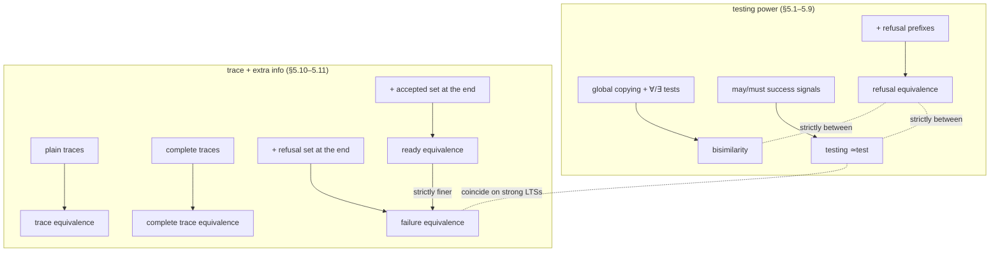

# Testing and Trace-Based Behavioural Equivalences

[[book-guidelines|↩ Back to guidelines]]

## Why bisimilarity needs a rival family of definitions at all

Every equivalence in this chapter is an answer to the same nagging question: bisimilarity was defined *coinductively*, as the largest relation closed under one-step matching. That definition is elegant, but it is also completely internal to the LTS formalism — it says nothing about what an external, physically realizable observer could actually notice about a process. If someone asks "why should I trust that two processes are 'the same'?", pointing at a fixed-point definition is not a satisfying answer. What would be satisfying is: here is a battery of experiments you could actually run, and two processes are equivalent exactly when no experiment tells them apart.

That is the move Chapter 5 makes twice, from two different directions:

1. **Testing.** Build a language of *tests* — think of a test as a program that pokes at a process and eventually reports success or failure — and declare two processes equivalent when they pass exactly the same tests. Turn the *power* of the tester up, and you recover bisimilarity exactly (§5.2). Turn it down, and you get a whole spectrum of coarser, more "realistic" equivalences: may, must, testing, refusal (§5.4–5.9).
2. **Traces plus extra structure.** Independently, ask what happens if you stick with trace equivalence (which Chapter 1 already showed is too coarse — it can't see deadlock) but patch the missing ingredient back in: not by adding a fixed point, but by recording, alongside a trace, *what happens at the end of it* — a refused action set (failure equivalence, §5.10) or an accepted action set (ready equivalence, §5.11).

The chapter's real payoff is that these two very different-looking programs — "weaken a testing scenario" and "enrich a trace" — turn out to land on almost the same equivalences, and moreover that the whole spectrum can be organized by a third, completely different lens: **how expressive is the class of process operators (the SOS rule format) that has to respect the equivalence as a congruence?** (§5.12). Richer operators force finer equivalences, and pushed far enough, you're back at bisimilarity again. Three independent roads — testing power, trace-plus-refusal information, congruence with operator classes — converge on the same map. That convergence is the chapter's thesis.



## Part 1: bisimilarity as the strongest possible testing equivalence

### The testing scenario, formalized (§5.1)

A **test** is applied to a **process**, and the application is a run — a possibly infinite sequence of *configurations* $E_0, E_1, \dots$ starting at $E_0 = \langle T, P\rangle$ ("test $T$ applied to process $P$"), stepping by a reduction relation $E_i \to E_{i+1}$. The run is maximal: if finite, it stops at a configuration with no further reductions, which must be one of two designated terminal configurations, $\checkmark$ (success) or $\bot$ (explicit failure). Because processes are non-deterministic, a single test can produce different outcomes on different runs, so the **outcome of an experiment** is a *set*:

$$\mathcal{O}(T, P) \subseteq \{\checkmark, \bot\}$$

Two processes $P, Q$ are behaviourally equivalent under this scenario iff $\mathcal{O}(T, P) = \mathcal{O}(T, Q)$ for every test $T$ in the language. Note this formula is a template, not a single definition — the whole chapter is instances of it with different test languages $T$ plugged in. The book gives outcomes both **denotationally** (structural induction on the test) and **operationally** (step-by-step configuration reduction), and proves the two coincide (Theorem 5.2.14) — a sanity check that the compositional definition and the "what would actually happen if you ran it" definition agree, the same discipline the book applies throughout to bisimulation itself.

**What breaks without a rich enough test language.** If a test can only observe single actions in sequence (no conjunction, no branching-observation), it degenerates into checking trace membership — which Chapter 1 already showed conflates a vending machine that lets you choose freely with one that commits early and might deadlock. To recover a testing equivalence as fine as bisimilarity, the test language needs machinery strong enough to *replay a choice point twice* and check both branches independently — that's exactly what the conjunction/disjunction and $\forall/\exists$ constructs below are for.

### The test language for bisimilarity (§5.2)

$$T ::= \mathsf{SUCC} \mid \mathsf{FAIL} \mid \mu.T \mid \overline{\mu}.T \mid T_1 \wedge T_2 \mid T_1 \vee T_2 \mid \forall T \mid \exists T$$

Four groups of constructs, each buying a specific piece of discriminating power:

- **Trace constructs** ($\mathsf{SUCC}$, $\mathsf{FAIL}$, $\mu.T$): the baseline — "can you do $\mu$, then satisfy $T$?"
- **Refusal** ($\overline{\mu}.T$): "are you *unable* to do $\mu$ right now?" — this is what lets a test see the absence of a transition, not just its presence.
- **Copying** ($\wedge$, $\vee$): running $T_1$ and $T_2$ on *two independent copies* of the current process state. This is the mechanism that recovers the discriminating power lost by plain trace tests — it can re-examine the same choice point along two different continuations.
- **Global testing** ($\forall$, $\exists$): "do *all* runs of $T$ succeed?" / "does *some* run succeed?" — this requires enumerating every non-deterministic branch, i.e. having, in Sangiorgi's phrase (borrowed from Milner), "control of the weather."

The denotational semantics (Table 5.1 in the source) defines $\mathcal{O}^{den}$ by structural recursion; the clause for refusal is worth internalizing because it is the one place non-determinism and negative information meet:

$$\mathcal{O}^{den}(\overline{\mu}.T, P) = \begin{cases} \{\checkmark\} & \text{if } P \operatorname{ref}(\mu) \\ \bigcup_{\{P' \mid P \xrightarrow{\mu} P'\}} \mathcal{O}^{den}(T, P') & \text{otherwise} \end{cases}$$

where $P \operatorname{ref}(\mu)$ ("$P$ refuses $\mu$") means $P$ has no $\mu$-transition at all.

**[[Coinduction-and-the-Duality-with-Induction#The theorem|The theorem]] that makes all of this worth doing (Corollary 5.2.18):** the equivalence induced by this test language, written $P \simeq_{test} Q$ (careful: this local "$\simeq_{test}$" for the bisimulation-characterizing scenario is not the same symbol as the later, coarser testing-equivalence relation — the book overloads the name because the two really are historically and technically related, as §5.4–5.7 show), coincides *exactly* with strong bisimilarity $\sim$. The proof is a two-way squeeze:

- **Lemma 5.2.15** (tests separate everything bisimilarity separates): by induction on the stratification $\sim_n$ from Chapter 2 — if $P \not\sim_{n+1} Q$ because some $\mu$-move of $P$ can't be matched by any of $Q$'s finitely many $\mu$-derivatives (image-finiteness is used here), build the distinguishing test as $\exists\, \mu.(\bigwedge_i T_i)$ where each $T_i$ separates $P'$ from one of $Q$'s derivatives, recursively.
- **Lemma 5.2.16** (tests never separate more than bisimilarity does): induction on test structure, given $P \sim Q$.

This is not a coincidence to file away — it is the chapter's central technical fact. It says: *strong bisimilarity is precisely what you get when your observer has unlimited copying power and can quantify over all non-deterministic outcomes.* Every equivalence in the rest of the chapter is obtained by **taking something away from this observer** and watching how much distinguishing power is lost.

**Connection to Hennessy–Milner logic.** The test grammar is, syntactically, modal logic in disguise: $[[true]] = \mathsf{SUCC}$, $[[F_1 \wedge F_2]] = [[F_1]] \wedge [[F_2]]$, $[[\Box\mu F]] = \forall\, \overline{\mu}.[[F]]$, $[[\Diamond\mu F]] = \exists\, \mu.[[F]]$ (§5.2, Exercise 5.2.20). This is the same phenomenon the reader will meet again if they study modal characterizations of bisimulation elsewhere: *bisimilarity = logical equivalence in a sufficiently expressive modal logic*, here derived by a testing argument instead of a game argument.

**Why weak bisimilarity resists this treatment (§5.3).** Adapting the scenario to weak LTSs (with $\tau$-moves) is genuinely awkward, and the book is explicit about why: a refusal test like $\overline{a}.\mathsf{FAIL}$ has a clean experimental reading on strong LTSs ("I tried $a$ and it was refused"), but its naive weak analogue breaks down. Consider $a\tau$ (a process that can always do $a$, but can also always choose instead to silently loop via $\tau$ forever). No finite observation can certify "this process refuses $a$ forever," because at every point it might still take the $a$ later. The fix requires committing to *some* notion of divergence-sensitivity (as in §4.7) before refusal tests make operational sense at all — a nice illustration of how much of this chapter's cleanliness depends on the strong-LTS Assumption 5.0.1 (image-finiteness) stated at the chapter's outset.

## Part 2: weakening the observer — may, must, and testing preorders

### Processes as testers (§5.4) and the powerdomain trichotomy (§5.5)

A more down-to-earth testing scenario drops the logic-flavored test grammar and makes testers *ordinary processes* equipped with a distinguished success action $\omega$. A test succeeds when the tester–process pair synchronizes to fire $\omega$. This alone — without global $\forall/\exists$ — already gives up bisimilarity's full power, but it raises a new question: given that a test run can produce a *set* of outcomes $\{\checkmark, \bot\}$ (because of non-determinism), what does it mean to compare two such sets when defining a *preorder* $P \le Q$ ("$Q$ is at least as good as $P$")?

The book's answer is a small but genuinely illuminating detour into **powerdomain theory** (Remark 5.5.1). Given the two-point order $\bot \sqsubset \checkmark$, there are three canonical ways to lift a partial order from points to (finite, non-empty) sets of points:

| Powerdomain | Ordering intuition | Reading |
|---|---|---|
| **Upper / Smyth** ($\wp_{Must}$) | only *worst* outcomes matter | "the test **must** succeed — no run may fail" |
| **Lower / Hoare** ($\wp_{May}$) | only *best* outcomes matter | "the test **may** succeed — some run succeeds" |
| **Convex / Plotkin** ($\wp_{Testing}$) | both extremes matter | refines both of the above simultaneously |

This yields three preorders $\le_{may}, \le_{must}, \le_{test}$ and their induced equivalences $\simeq_{may}, \simeq_{must}, \simeq_{test}$, related by

$$P \le_{test} Q \iff (P \le_{may} Q \text{ and } P \le_{must} Q), \qquad P \simeq_{test} Q \iff (P \simeq_{may} Q \text{ and } P \simeq_{must} Q)$$

(Remark 5.5.3). Note Remark 5.5.2's sharp observation: the *bisimilarity*-characterizing test language of §5.2 needed the **convex** powerdomain — with only $\wp_{May}$ or $\wp_{Must}$ (two elements), the $\forall/\exists$ clauses collapse and you lose the power to characterize bisimilarity at all. So the choice of powerdomain isn't cosmetic; it's exactly the parameter controlling how much of bisimilarity survives.

Formally (Definition 5.5.5): $P$ **may pass** $T$ if $\checkmark \in \mathcal{O}^{op}(T,P)$; $P$ **must pass** $T$ if $\{\checkmark\} = \mathcal{O}^{op}(T,P)$ (i.e. *every* run succeeds — a single failing run disqualifies it). $P \le_{may} Q$ then means: whatever $P$ may pass, $Q$ may pass too. $P \le_{must} Q$: whatever $P$ must pass, $Q$ must pass too.

**What breaks without the must/may split.** If you only had a single notion of "passes," you couldn't express the asymmetry that matters most in practice: a specification $P$ typically has *more* non-determinism than an implementation $Q$ refining it, so $Q$ should be able to do everything $P$ *must* eventually do (no implementation should drop a mandatory behaviour), while $Q$ is allowed to *drop* optional behaviours $P$ merely *may* exhibit. That's precisely the specification-refinement reading the book flags in §5.5's motivation — must-testing is a genuine model of "the implementation is at least as reliable," may-testing of "the implementation offers at least this much possibility."

**Grounding it in Rust — this is literally partial vs. total correctness.** "May pass" (some run succeeds) is exactly a *partial-correctness* claim about a non-deterministic search; "must pass" (every run succeeds) is a *total-correctness* claim. If you model a process's runs as a search tree, the two preorders fall out as two different tree-traversal predicates over the same structure:

```rust
enum RunOutcome { Succ, Fail }

trait Testable {
    /// All possible one-step continuations of running `self` against a test.
    /// A leaf (empty vec) means the run has terminated with `outcome()`.
    fn step(&self) -> Vec<Self> where Self: Sized;
    fn outcome(&self) -> Option<RunOutcome>; // Some(_) only at a leaf
}

/// "may pass": some run reaches Succ  — a partial-correctness / reachability check.
fn may_pass<T: Testable>(state: &T) -> bool {
    if let Some(RunOutcome::Succ) = state.outcome() { return true; }
    state.step().iter().any(may_pass)
}

/// "must pass": every run reaches Succ — a total-correctness check.
/// (In the book, an infinite run also counts as failing must-pass — a diverging
/// search is exactly a non-terminating recursive call here, which is why must-
/// testing needs the same well-foundedness argument a WP-calculus soundness
/// proof needs for loops/recursion.)
fn must_pass<T: Testable>(state: &T) -> bool {
    match state.outcome() {
        Some(RunOutcome::Succ) => true,
        Some(RunOutcome::Fail) => false,
        None => {
            let children = state.step();
            !children.is_empty() && children.iter().all(must_pass)
        }
    }
}
```

`may_pass` is an `∃`-quantified reachability query (the same shape as a bug-finding CSP search over an under-approximated state space); `must_pass` is a `∀`-quantified invariant check (the same shape as an abstract-interpretation soundness argument over an over-approximation). That's not a loose analogy — §5.14's own discussion of complexity (testing equivalence is PSPACE-complete, bisimilarity is polynomial) is precisely the cost of the `∀`-branch in `must_pass` compounding across a whole equivalence check rather than a single query.

### The trace-based characterization that makes these tractable (§5.7)

Quantifying over *all tests* to prove an equivalence is exactly as unpleasant as it sounds. §5.7 gives an equivalent, checkable characterization purely in terms of traces:

**Definition 5.7.1–5.7.2.**
- $s \in \mathrm{Traces}(P)$ if $P \xrightarrow{s}$.
- $P \operatorname{after} s \;=\; \{P' \mid P \xrightarrow{s} P'\}$.
- For a finite action set $A$: $P \operatorname{must} A$ holds if $P$ has *some* transition into $A$ (i.e. $\exists\, \mu \in A,\ P \xrightarrow{\mu} P'$); $P \operatorname{after} s \operatorname{must} A$ holds if *every* $P'$ reachable via $s$ satisfies $P' \operatorname{must} A$.
- $P \le_{may} Q$ iff $\mathrm{Traces}(P) \subseteq \mathrm{Traces}(Q)$ — **may-preorder is literally trace inclusion.**
- $P \le_{must} Q$ iff for every $s, A$: $P \operatorname{after} s \operatorname{must} A \implies Q \operatorname{after} s \operatorname{must} A$.

Theorem 5.7.3 proves these characterizations coincide with the original testing-based definitions. This is a big simplification in complexity terms too: $\le_{may}$ needs only quantify over traces, $\le_{must}$ over traces *and* finite action sets — both dramatically cheaper than quantifying over the full test grammar. And it yields, almost for free, **Corollary 5.7.4**: $\simeq_{must}$ and $\simeq_{test}$ coincide on strong LTSs (they only diverge once you add divergence-sensitivity on weak LTSs, §5.8) — one of several places this chapter shows superficially different-looking equivalences are secretly the same relation viewed through different definitions.

One more anchor point: on **deterministic** processes, bisimilarity collapses to trace equivalence (Exercise 5.7.8) — a useful sanity check, since it says the whole hierarchy of equivalences in this chapter only has bite in the presence of genuine non-determinism.

### Divergence and weak LTSs (§5.8)

On weak LTSs the may/must split becomes the chapter's cleanest illustration of *why* divergence matters operationally. Must-testing treats divergence as catastrophic — a process that can loop forever without ever definitely succeeding *fails* the must-test, symmetric to how a specification-refinement reading treats "might never terminate" as unacceptable. May-testing is divergence-*insensitive* — "some run succeeds" survives even if other runs loop. The book's worked equalities crystallize this:

$$P + \tau_\omega = \tau_\omega \text{ holds for } \simeq_{must} \text{ but not } \simeq_{may}, \qquad P + \tau_\omega = P \text{ holds for } \simeq_{may} \text{ but not } \simeq_{must}$$

(where $\tau_\omega$ diverges). This is also where testing equivalence and weak bisimilarity provably part ways: $a_\tau$ (can always do $a$, or always loop) and $P_a = a.0$ are weakly bisimilar (Chapter 4's fair-abstraction stance treats the divergence as harmless) but **not** testing equivalent, because a must-test can catch the divergence and testing equivalence refuses to be "fair" about it (Exercise 5.8.3). This exact tension — bisimulation's fairness assumption versus testing's strict catastrophic reading of divergence — is a live methodological debate the book flags explicitly, and it's the motivation for *fair* (a.k.a. *should*) *testing*, where success only requires that the run *could still* reach $\checkmark$, not that it already did.

## Part 3: trace-plus-refusal equivalences

### Refusal equivalence (§5.9): the missing "copy" capability

Bisimilarity's testing characterization needed copying (the $\wedge/\vee$ constructs) to re-examine a branch point along two futures independently. Refusal equivalence adds *only* the ability to observe a refusal mid-trace — a prefix $\overline{\mu}\hspace{-2pt}.T$ that succeeds when the tested process currently cannot do $\mu$ — without adding copying. The result sits **strictly between testing equivalence and bisimilarity**: it separates pairs that testing equivalence conflates (e.g. the classic $P_4, Q_4$ pair from Figure 2.4, distinguished by a test that checks "$a$, then no $b$, then $a$, then no further $a$"), but it still conflates pairs that differ only because of a branch point that would require making two copies of a shared prefix to distinguish (Remark 5.9.1 — this is exactly the $P_3, Q_3$ pattern from Chapter 1's original trace-equivalence counterexample).

### Failure equivalence (§5.10): patching trace equivalence directly

This is the equivalence with independent historical roots (Brookes–Hoare–Roscoe, developed for CSP) and it's worth understanding as a *separate derivation* of essentially the same idea, arrived at without any testing scenario at all.

Start from the observation (already made in Chapter 1) that plain trace equivalence can't see deadlock. The fix: instead of comparing *all* traces, compare **complete traces** — maximal sequences, i.e. either infinite, or finite sequences ending in a *stopped* process (no further transitions):

> **Definition 5.10.1.** $P, Q$ are *complete trace equivalent* if they have the same sets of complete traces.

This is already a strict refinement of ordinary trace equivalence — e.g. $P_1, Q_1$ of Figure 1.4 are trace equivalent but not complete-trace equivalent, because only one of them has the *shorter* trace $a$ as a maximal (deadlocking) behaviour.

**What breaks: compositionality.** Complete trace equivalence still isn't preserved by restriction or CSP-style synchronous parallel composition — the book's example: $P_2, Q_2$ (Figure 1.7) have the same complete traces, but $\nu_b\,P_2$ and $\nu_b\,Q_2$ don't, once the restriction operator prunes some of the branches that were making the traces line up. So complete-trace equivalence alone is not a usable behavioural equivalence for compositional reasoning — exactly the same failure mode that motivated bisimulation in Chapter 1, now recurring one level up.

**The CSP fix — record refusals at the end of a trace:**

> **Definition 5.10.3.** A **failure** is a pair $(s, A)$ — a finite trace $s$ and an action set $A$ — belonging to $P$ if there is some $P'$ with $P \xrightarrow{s} P'$ and $P' \not\xrightarrow{\mu}$ for every $\mu \in A$ (i.e. $P'$ refuses every action in $A$). $P, Q$ are **failure equivalent** if they have the same set of failures.

A failure $(s,A)$ certifies a *possible deadlock*: if the environment allows exactly the trace $s$ and then offers only actions in $A$, the system can get stuck. This is precisely a trace annotated with a refusal-set snapshot — the same information a refusal test extracts, but recorded as static data rather than obtained by an interactive protocol. And indeed:

> **Theorem 5.10.6.** On strong LTSs, failure equivalence coincides with testing equivalence.

— which follows immediately from the trace-based characterization of §5.7, since $P \operatorname{after} s \operatorname{must} A$ is by construction the negation of "$(s,A)$ is a failure of $P$." Three roads (weaken the tester to must/may; patch traces with refusals; independently invented for CSP) converge on one relation.

**Grounding it in Lean — a failure is a refinement-type-shaped predicate.** Definition 5.10.3 is exactly a dependent pair of "a trace occurred" and "a set-membership condition holds afterward" — the same shape as a refinement type $\{s : \mathrm{Trace} \mid \phi(s)\}$ pairing a base value with a proof-relevant side condition:

```lean
def Trace (Act : Type) := List Act

-- `P.After s` is the (possibly empty) set of states reachable via trace `s`.
-- `Failure P s A` bundles: s is a trace of P, and every state reached via s
-- refuses every action in A. This is definitionally an ∀-quantified refinement
-- on `P.After s`, mirroring how a refinement type's predicate is checked
-- against every inhabitant an elaborator admits.
def Failure {Act : Type} (P : Proc Act) (s : Trace Act) (A : Set Act) : Prop :=
  s ∈ P.traces ∧ ∀ P' ∈ P.after s, ∀ μ ∈ A, ¬ P'.canDo μ

def FailureEquiv {Act : Type} (P Q : Proc Act) : Prop :=
  ∀ s A, Failure P s A ↔ Failure Q s A
```

Two things worth carrying forward: (1) `Failure` is a `Prop`, not data — matching the book's own move of treating $(s,A)$-membership as a *derivable fact* rather than a computed value, exactly the trusted-kernel discipline a proof-producing verifier needs when checking a refinement obligation rather than executing it; (2) the $\forall P' \in \mathrm{after}$ quantifier is where must-testing's total-correctness flavor resurfaces — proving `FailureEquiv` for two concrete processes requires the same universally-quantified case analysis a Hoare-triple soundness proof needs over all reachable states, not just witnesses.

**On weak LTSs (§5.10.1):** only refusals of *stable* processes (no pending $\tau$) count, for the same reason discussed for refusal testing — a process mid-$\tau$-transition hasn't definitively refused anything yet. And failure equivalence treats *any* divergence as catastrophic, collapsing all divergent processes into one class (so $a \mid \tau_\omega \simeq_{fail} \tau_\omega$) — a real loss of information the book is candid about, motivating later divergence-aware refinements ([BR84] et al.) that also track a process's *divergence traces*.

### Ready equivalence (§5.11): refusal's dual, and strictly finer

Swap "the maximal set the process **refuses**" for "the maximal set it **accepts**":

> **Definition 5.11.1.** $\mathrm{readies}(P) = \{\mu \mid P \xrightarrow{\mu}\}$. $(s, A)$ is a **ready pair** for $P$ if some $P' $ reachable via $s$ has $\mathrm{readies}(P') = A$. $P, Q$ are **ready equivalent** if they share the same ready pairs.

Because a ready set determines the corresponding failure set (a process refuses exactly the complement of what it's ready for, restricted to the process's sort), ready equivalence is at least as fine as failure equivalence, and the inclusion is *strict* — since ready sets are the maximal accepted sets, they carry information a refusal set alone discards (Exercise 5.11.2 exhibits two failure-equivalent, non-ready-equivalent processes). Refusal equivalence and ready equivalence are, however, **incomparable** with each other (Exercises 5.11.3, Figures 5.2–5.3 in the source) — refinement along one axis (accept vs. refuse) doesn't dominate refinement along the other. This non-linearity is itself a lesson: "add more observational power" is not a single dial, it's a partial order of design choices, each buying a different, sometimes incommensurable, kind of distinguishing power.

## Part 4: the format lens — congruence forces the equivalence

### Why this is a genuinely different way of carving up the same space (§5.12)

Every equivalence above was defined by *what an observer can see*. §5.12 asks a structurally different question: **fix a class of process operators, described by a syntactic restriction on their SOS inference rules, and ask what's the coarsest equivalence that remains a congruence for every operator expressible in that class?** The point is not academic — even failure equivalence, deadlock-sensitive as it is, breaks compositionality once you add operators outside CCS/CSP's reach, such as a **priority operator** that prunes lower-priority transitions:

$$\dfrac{P \xrightarrow{\mu} P' \qquad (P \xrightarrow{\mu'} \text{ for no } \mu' > \mu)}{f(P) \xrightarrow{\mu} f(P')}$$

The book's counterexample: with priority order $b < c < d$, $P = a.b + a.(c+d)$ and $Q = a.b + a.(c+d) + a.(b+c)$ are failure equivalent — yet $f(P)$ and $f(Q)$ aren't even trace equivalent, because priority-pruning interacts with the summands differently depending on which alternatives were syntactically present (Exercise 5.12.1 contrasts this with bisimilarity, which the priority operator *does* respect).

**The format hierarchy**, each strictly more permissive than the last:

- **De Simone** — the format sufficient for ordinary CCS/CSP operators (used already in Ch. 3's Congruence Theorem for bisimilarity); positive premises only, no argument-copying restrictions beyond distinctness.
- **GSOS** — adds *negative premises* (transitions conditioned on the *absence* of other transitions — exactly what priority needs) and *copying* (a source variable may recur on the right of the conclusion or in multiple premises).
- **tyft/tyxt** — adds *lookahead*: a premise's target variable can feed as the source of another premise, letting a rule "see into the future" of a subterm before committing to a transition. This is powerful enough to encode the $\tau$-absorption behind weak bisimilarity as ordinary strong-transition rules.
- **ntyft/ntyxt** — tyft/tyxt plus negative premises. Getting negative premises and lookahead together right requires care (Remark 5.12.2): naive rule sets with negative premises can be non-monotone (the book's example: $f \xrightarrow{a}$ derivable exactly when $f' \xrightarrow{a}$ is *not* derivable, and vice versa — a genuinely contradictory rule pair with no consistent least fixed point). The standard fix, borrowed from logic programming's stratified negation (Przymusinski, transported by Groote), assigns transitions a *weight* such that a rule's conclusion always outweighs its positive premises and strictly outweighs any transition denying a negative premise — recovering a well-defined LTS by resolving negative information in weight-order, layer by layer, rather than all at once.

**Table 5.3, the chapter's payoff table** — the coarsest congruence induced by each format, split by whether you're preserving plain traces or complete traces:

| Format | Traces | Complete traces |
|---|---|---|
| De Simone | trace equivalence | failure equivalence |
| GSOS | ready simulation equivalence | ready simulation equivalence |
| tyft/tyxt | simulation equivalence | 2-nested simulation equivalence |
| ntyft/ntyxt | bisimilarity | bisimilarity |

Read down the right column and you're re-tracing the entire chapter, but now *derived* from a congruence requirement rather than an observational one: De Simone's complete-trace congruence *is* failure equivalence (independently confirming §5.10's derivation from a totally different angle); push to ntyft/ntyxt (negative premises + lookahead + copying together give you the discriminating power of Hennessy–Milner logic, echoing §5.2's test-language characterization) and you recover bisimilarity exactly. **This is the chapter's strongest single claim:** bisimilarity is the *only* equivalence among all discussed that is compositional with respect to every one of these formats, no matter how permissive. That robustness — not just fineness — is the real argument for treating bisimilarity as the default.

### Non-interleaving equivalences, briefly (§5.13)

A caveat applying to *everything* in the chapter (and to bisimilarity itself, as defined so far): all of it treats parallel composition via **interleaving** — $a.0 \mid b.0$ and $a.b.0 + b.a.0$ are considered equal, because the LTS semantics only records the *order* in which actions happen, not whether two actions were causally independent or genuinely concurrent. Non-interleaving equivalences reject this identification, tracking either causal dependency between transitions (the two actions in $a.b.0+b.a.0$ are causally linked — the first prefix's firing is a precondition for the second's — while the two sides of $a.0 \mid b.0$ are not) or the raw degree of parallelism exhibited. The book flags this only as a pointer to further reading (van Glabbeek, Best–Petri–Studer), not a topic it develops — worth knowing this frontier exists, but it's explicitly out of scope for the interleaving semantics used throughout the rest of the book.

## Part 5: synthesizing the spectrum (§5.14)

The chapter's closing move is to name the actual criteria that should drive a choice of equivalence in practice, rather than just presenting more relations:

1. the level of abstraction the application needs (which properties of a process actually matter?),
2. how compositional you need to be (does your process live inside an evolving, extensible language of operators?),
3. what reasoning techniques are available (does an equational theory or a proof method exist?),
4. tool support and algorithmic efficiency.

On (4) specifically, the book is candid about a real practical tension: testing equivalence is **PSPACE-complete** to decide on finite-state processes, while bisimilarity is decidable in **polynomial time** via partition refinement — yet in practice, testing equivalence is usually *computed* by transforming it into a bisimilarity problem first (Cleaveland–Hennessy), because the transformation, while theoretically expensive, tends to behave well on the instances that arise in practice. This is a concrete, load-bearing instance of a pattern worth internalizing for any verification toolchain: a coarser, more semantically appealing equivalence is sometimes *operationalized* by reduction to a finer one with better algorithms, not the other way around.

The book's own summary judgment: bisimilarity remains the field's default not chiefly because it's the finest relation on offer (graph isomorphism is finer still, and useless, as Chapter 1 already showed), but because of the *combination* of robust compositionality (Table 5.3's right column), efficient decision procedures, and a clean proof method (the coinductive bisimulation-up-to techniques of Chapter 2/3). Failure equivalence is flagged as the one serious rival with comparable staying power, specifically in the CSP tradition, where deadlock-sensitivity without full bisimilarity's overhead is often exactly the right amount of discriminating power.

## Where this leads

Structurally, this chapter sits as a *detour* between the two core chapters on bisimulation (Ch. 1–4, culminating in weak bisimilarity) and the further coinductive refinements of Chapter 6 (simulation-based equivalences — complete, ready, and coupled simulation, which the format table above already anticipates via "ready simulation equivalence" and "2-nested simulation equivalence"). Chapter 6 closes with a single diagram (Figure 6.2) placing *every* equivalence from both chapters — bisimilarity, the simulation refinements, and everything derived here — into one ordered spectrum by relative fineness; this article's Table 5.3 and testing hierarchy are half of what that diagram summarizes.

**Load-bearing for the compiler/elaborator project:** this chapter is a sustained worked example of a pattern that recurs directly in building a trusted verifier — *deriving the "right" equivalence/relation from what an external checker is allowed to observe, then proving that definition coincides with an independently-motivated fixed-point or algebraic characterization.* Concretely:

- The **testing-scenario-as-observer** framing (§5.1–5.2) is structurally the same move as deriving *observational/contextual equivalence* for a verifier's intermediate language — "two program states are equivalent iff no context (test) distinguishes them" is exactly the shape of the equivalence a soundness proof for refinement-type erasure or abstract-interpretation collapsing needs to respect. The must/may split (§5.5) is the same distinction as a Hoare-logic **partial-vs-total-correctness** split — "must pass" (every run succeeds, divergence is catastrophic) is a total-correctness reading; "may pass" (some run succeeds) is partial correctness. That's a direct, reusable connection to weakest-precondition reasoning.
- **Rule formats and monotonicity of negative premises** (§5.12, Remark 5.12.2) is precisely the concern that arises when a CHC-solving or abstract-interpretation fixed-point engine allows negation in constraint generation — the stratification discipline described there (weights ensuring conclusions strictly outweigh denied negative premises) is the operational-semantics analogue of stratified Datalog/ASP semantics used to keep CEGAR-style refinement loops and constraint propagation well-defined when "absence of a fact" is itself a premise.
- **Trace inclusion as the may-preorder** (§5.7) is the simplest possible instance of the general "safety property = trace-set inclusion" idea underlying reachability analysis; the must-preorder's finite-set-of-refused-actions machinery is a toy version of the refinement-relation bookkeeping (ready sets, failure sets) that shows up in symbolic execution when tracking which continuations remain live along a path.
