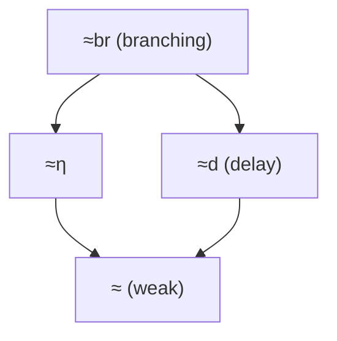

[[book-guidelines|↩ Back to guidelines]]

# Weak Bisimulation and Internal Activity

## Why strong bisimilarity is too strict

Strong bisimilarity $\sim$ (Chapter 1) treats every transition — including the special silent action $\tau$ — as an equally observable event. That's fine as a *definition*, but it's a bad *equality* once $\tau$ actually means "internal, unobservable computation." Consider

$$P \stackrel{\text{def}}{=} \nu a\,(b.a \mid a.c).$$

You can check $P \sim b.\tau.c$: the process receives on the restricted name $a$ internally, so a $\tau$ shows up between the visible actions $b$ and $c$. But nobody outside the system can see that $\tau$ — it's just two components synchronizing on a name nobody else can name. So we *want* $P$ to equal $b.c$, and strong bisimilarity refuses to grant it, because $b.\tau.c$ and $b.c$ have different transition counts.

Sangiorgi's sequential-programming analogy makes the stakes concrete (p. 108): compare `print(5)` against `if true then print(5) else skip`. Operationally, the second program takes an extra step — evaluating the (trivially true) conditional is a $\tau$-transition before the real action:

$$\texttt{if true then print(5) else skip} \xrightarrow{\tau} \texttt{print(5)} \xrightarrow{\text{print(5)}} \mathbf{0}.$$

Both programs *do the same thing* as far as any observer of the printed output is concerned, but strong bisimilarity distinguishes them because it counts steps, not observable steps. The same failure shows up in the $\lambda$-calculus: $(\lambda x.x)\,3 \xrightarrow{\tau} 3$ needs one reduction to reach the value $3$, and again the term and its value are behaviourally identical to any external test but not strongly bisimilar. This is the "[[Coinduction-and-the-Duality-with-Induction#What breaks without it|what breaks without it]]" case: **any calculus with an internal reduction step needs an equivalence that quotients out finite amounts of that step**, or you can never prove that "eventually does X" processes equal "immediately does X" processes — which is most of what real program equivalence proofs need to say.

This chapter's whole arc is: define that quotienting relation (*weak bisimilarity*), discover it has a genuine defect (it isn't a congruence for choice), patch the defect (*rooted weak bisimilarity*), axiomatize the patched version algebraically, and then survey a family of stricter siblings that trade some of the abstraction back for better algebraic or branching-structure properties.

## 1. Weak transitions: building the closure relation

The key move is definitional, not proof-theoretic: instead of changing what a *bisimulation* is, change what counts as a *transition*. Define (Def. 4.1.1, p. 109–110):

$$P \Rightarrow P' \quad\text{iff}\quad P \xrightarrow{\tau} \cdots \xrightarrow{\tau} P' \ \ (n \geq 0 \text{ steps}),$$

i.e. $\Rightarrow$ is the reflexive-transitive closure of $\xrightarrow{\tau}$. Then for a visible action $\mu$,

$$P \stackrel{\mu}{\Rightarrow} P' \quad\text{iff}\quad P \Rightarrow P_1 \xrightarrow{\mu} P_2 \Rightarrow P'$$

— any amount of internal work, then the one visible action, then any more internal work. Note $\stackrel{\tau}{\Rightarrow}$ (composite, "at least conceptually zero or more $\tau$'s around one $\tau$") is *not* the same relation as $\Rightarrow$ (zero or more $\tau$'s, full stop): $\Rightarrow$ can take zero steps, $\stackrel{\tau}{\Rightarrow}$'s definition forces at least the "middle" $\tau$ if you unfold the composition — this distinction is exactly what separates ordinary weak bisimilarity from *dynamic bisimilarity* later in §4.8.

**A property to keep in mind for any implementation:** the weight (number of $\tau$-steps) of a $\Rightarrow$-transition is *not unique* — $\tau.\mathbf{0} + \tau.\tau.\mathbf{0} \Rightarrow \mathbf{0}$ has both a weight-1 and a weight-2 derivation — and the *supremum* of weights need not exist (a looping process $\tau \xrightarrow{\tau} \tau$ gives $\tau \Rightarrow \tau$ at every weight $n \geq 0$, with no maximum). Any algorithm computing $\Rightarrow$ is therefore computing a genuine reachability closure over the $\tau$-subgraph, not a canonical "distance."

**Rust grounding.** This closure computation is a completely ordinary reachability problem over the induced $\tau$-subgraph — the exact same shape as any fixpoint worklist algorithm you'd write for a dataflow/abstract-interpretation pass:

```rust
use std::collections::{HashMap, HashSet, VecDeque};

type ProcId = u32;
type Action = String; // "tau" reserved for internal

struct Lts {
    // adjacency: process -> (action, target)
    edges: HashMap<ProcId, Vec<(Action, ProcId)>>,
}

impl Lts {
    /// P =>  : the tau-reachable set from P (reflexive-transitive closure of --tau-->)
    fn weak_tau_closure(&self, start: ProcId) -> HashSet<ProcId> {
        let mut reached = HashSet::new();
        let mut frontier = VecDeque::from([start]);
        reached.insert(start);
        while let Some(p) = frontier.pop_front() {
            if let Some(succs) = self.edges.get(&p) {
                for (act, q) in succs {
                    if act == "tau" && reached.insert(*q) {
                        frontier.push_back(*q);
                    }
                }
            }
        }
        reached
    }

    /// P =mu=> Q'  : set of Q' reachable via  =>  --mu-->  =>
    fn weak_action_targets(&self, start: ProcId, mu: &str) -> HashSet<ProcId> {
        let mut result = HashSet::new();
        for p1 in self.weak_tau_closure(start) {
            if let Some(succs) = self.edges.get(&p1) {
                for (act, p2) in succs {
                    if act == mu {
                        result.extend(self.weak_tau_closure(*p2));
                    }
                }
            }
        }
        result
    }
}
```

This is a small but genuine instance of the *abstraction-by-closure* pattern that recurs throughout your CSP/abstract-interpretation project: `weak_tau_closure` is exactly the shape of computing the reachable states under "invisible" internal transitions before checking an invariant — the same closure step that shows up when you abstract away scheduling nondeterminism, or when a CHC solver saturates a relation under an internal derivation step before checking a query.

## 2. Weak bisimilarity: the equivalence itself

**Definition 4.2.1 (p. 110).** $R$ is a *weak bisimulation* if $P\,R\,Q$ implies:

1. for all $\mu \neq \tau$ and $P'$ with $P \stackrel{\mu}{\Rightarrow} P'$, there is $Q'$ with $Q \stackrel{\mu}{\Rightarrow} Q'$ and $P'\,R\,Q'$;
2. for $P'$ with $P \stackrel{\tau}{\Rightarrow} P'$, there is $Q'$ with $Q \Rightarrow Q'$ and $P'\,R\,Q'$;
3. the symmetric clauses on $Q$'s transitions.

$P \approx Q$ ("$P$ and $Q$ are *weakly bisimilar*") iff $P\,R\,Q$ for some weak bisimulation $R$. Mechanically, weak bisimilarity is nothing more than *strong* bisimilarity replayed on the graph whose edges are $\Rightarrow$ and $\stackrel{\mu}{\Rightarrow}$ instead of $\xrightarrow{\tau}$ and $\xrightarrow{\mu}$ — all the strong-bisimilarity machinery (equivalence relation, largest-fixed-point characterization, bisimulation game) transfers unchanged (Lemma 4.2.9 packages the two clauses above into one, using $\stackrel{\hat\mu}{\Rightarrow} := \stackrel{\mu}{\Rightarrow}$ if $\mu \neq \tau$, else $\Rightarrow$).

**Worked example (Example 4.2.3).** $\tau.a \approx a$: take $R = \{(\tau.a, a), (a,a), (\mathbf 0,\mathbf 0)\}$. Both of $\tau.a$'s weak transitions ($\tau.a \stackrel{\tau}{\Rightarrow} a$ and $\tau.a \stackrel{a}{\Rightarrow} \mathbf 0$) are matched by $a$'s corresponding weak transitions, and vice versa. Also $\nu a\,(b.a \mid a.c) \approx b.c$ — the motivating equality from §0 above is now provable.

**Why clause (2) survives at all — the point that trips people up.** If your goal is "ignore $\tau$'s," why does the definition still demand a *response* to a $\tau$-move? Because $\tau$'s can *pre-empt* other actions, and pre-emption is externally visible even when the pre-empting step itself isn't. Take

$$P \stackrel{\text{def}}{=} \tau.a.\mathbf 0 + \tau.b.\mathbf 0 \qquad Q \stackrel{\text{def}}{=} a.\mathbf 0 + b.\mathbf 0.$$

Without clause (2), these would be identified. But $P$ is a machine that *internally and irrevocably commits* to offering only $a$ or only $b$ before the customer ever presses a button; $Q$ genuinely offers both buttons simultaneously to the customer. That's the same distinction (internal choice vs. external choice) that made trace equivalence too coarse for the original vending-machine example in Chapter 1 — weak bisimilarity has to preserve it or it collapses into something strictly weaker than what we actually want.

**The proof-engineering subtlety (Lemma 4.2.10).** Definition 4.2.1 puts weak transitions on *both* sides of the game — the challenger can play any $\stackrel{\mu}{\Rightarrow}$, which for a looping process like $K \xrightarrow{\tau} a \mid K$ means infinitely many challenge transitions ($K \Rightarrow (a \mid \cdots \mid a) \mid K$ for every $n$) all needing a response. Sangiorgi shows (by induction on minimum weight) that it suffices to let the *challenger* only ever play single strong transitions:

$$P \xrightarrow{\mu} P' \implies \exists Q'.\ Q \stackrel{\hat\mu}{\Rightarrow} Q' \wedge P' R Q'.$$

This "sw-bisimulation" formulation is what any real bisimulation-checking implementation (partition refinement, etc.) actually uses — checking $\stackrel{\mu}{\Rightarrow}$ challenges directly would be enormously redundant. It's the same "restrict the adversary's moves to a generating set, then extend by induction" trick you'll reuse constantly: it's structurally identical to why, in a proof search or CHC-solving setting, you only need to case on the *rule* used to derive a strong transition rather than closing under an unbounded family of derived facts before starting the game.

**A structural cost you pay for the abstraction.** Because $\Rightarrow$ (and hence $\stackrel{\mu}{\Rightarrow}$) is generally *not image-finite* even when $\xrightarrow{\mu}$ is (Exercise 4.1.4) — a $\tau$-loop that can escape at any point gives infinitely many weak successors — weak bisimilarity loses the cocontinuity property that let strong bisimilarity be reconstructed as the limit $\sim_\omega$ of finite approximants (recall §2.10 of Chapter 2). You cannot, in general, compute $\approx$ by iterating a monotone functional finitely many times; you genuinely need the full coinductive (greatest-fixed-point) definition. This is a concrete illustration of a fact that matters for any coinductive definitional-equality checker you build: **abstraction operations can destroy the finitary approximability that makes naive fixed-point iteration terminate**, even when the underlying strong relation was well-behaved.

**Lean grounding.** Because weak bisimilarity genuinely is "strong bisimilarity replayed on a different transition relation," the cleanest way to see its coinductive nature is to define it exactly the way Lean would define $\sim$, just parametrized by whichever transition relation you hand it:

```lean
-- A generic notion of bisimulation parametrized over the transition relation used
-- (instantiate `step` with strong --μ--> for ∼, with weak =μ=> for ≈).
def IsBisimulation {Proc Act : Type} (step : Proc → Act → Proc → Prop)
    (R : Proc → Proc → Prop) : Prop :=
  ∀ p q, R p q → ∀ a p', step p a p' →
    ∃ q', step q a q' ∧ R p' q'  -- plus the symmetric clause in a full definition

-- Weak bisimilarity as the *union of all weak bisimulations* — a genuine
-- coinductive (greatest fixed point) definition, not a recursive function.
-- This is exactly Sangiorgi's "the largest R satisfying the clauses" idiom,
-- and mirrors how Lean's own `Eq`/definitional-equality machinery is itself
-- ultimately a fixed point of a monotone operator on the ambient relation
-- lattice — coinduction, quietly, all the way down.
```

The book's own remark (Exercise 4.2.11) that weak bisimilarity should be re-derived via the Chapter 2 fixed-point schema is precisely this: $\approx$ is $F_{\mathrm{coind}}$ for the monotone functional induced by the weak-transition clauses, on the complete lattice of process relations ordered by inclusion — the same machinery your kernel's `isDefEq`/definitional-equality relation ultimately rests on when it has to handle recursive/corecursive unfoldings.

## 3. Divergence and "fair abstraction"

A process **diverges** ($P \Uparrow$) if it has an infinite run of pure $\tau$-steps — formally, $\Uparrow$ is the *largest* predicate closed under "performs a further $\tau$" (Def. 4.3.1, itself another coinductive definition, dual to well-founded induction).

Weak bisimilarity is **insensitive to $\tau$-cycles**. The headline example: $a \mid \boldsymbol{\tau} \approx a.\mathbf 0$, where $\boldsymbol\tau$ is the purely-divergent process $\boldsymbol\tau \xrightarrow{\tau} \boldsymbol\tau$. The left process can loop forever internally and never do anything else — yet it's declared equal to a process that provably terminates after one action. Sangiorgi gives three justifications (p. 116) worth internalizing because they recur as design choices any time you build an abstraction that hides scheduling:

1. **Distribution:** the diverging component might be running on a different machine — its looping doesn't block the other component's progress.
2. **Fairness:** even on one machine, a *fair* scheduler cannot let one branch of a parallel composition starve the other forever — the visible action will eventually fire (this is "Koomen's fair abstraction rule").
3. **The abstraction was already committed:** weak bisimilarity abstracts from *any finite* amount of internal work; abstracting from an unbounded family of finite amounts is, in the limit, abstracting from the possibility of an infinite amount too.

This isn't consequence-free, though: a $\tau$-cycle *can't always be removed* (Exercise 4.3.4: $a + \tau \approx a + \mathbf 0$ fails — a pure $\tau$ competing at top level under choice is observably different from doing nothing, because of the pre-emption issue from §2). And there exist genuinely divergence-sensitive alternatives (§4.7 below, and testing/failure equivalences in Chapter 5) for exactly the settings where "fair abstraction" is the wrong assumption — e.g. reasoning about liveness rather than safety, or about a lossy medium where you actually care whether retransmission is guaranteed to eventually succeed rather than assumed to (Exercise 4.3.6's busy-waiting/lossy-medium discussion is the book's own real-world framing).

**Connection to your project.** This is the *soundness-vs-completeness knob* of over-approximating abstract interpretation in miniature: fair abstraction from divergence is a **choice to treat a class of behaviors (looping-but-escapable) as equal to their eventual outcome**, exactly the kind of judgment call your Hoare-triple / weakest-precondition machinery has to make explicit when deciding whether non-termination inside a `while` loop should be treated as `⊥` (crashes verification) or quietly abstracted away — the same choice CEGAR loops face when deciding whether a spurious counterexample trace involving unbounded internal iteration should be refined away or accepted as a real divergence.

## 4. The congruence failure, and its repair

**The defect.** $\approx$ *is* preserved by parallel composition, restriction, and prefixing (Lemma 4.4.1 — the proof for parallel composition is a clean case analysis on the SOS rule used, `ParL`/`ParR`/`Com`, each closed under $\approx$ by definition). It is **not** preserved by choice:

$$\tau.a \approx a \quad\text{but}\quad \tau.a + b \not\approx a + b.$$

Why: $\tau.a + b$ can silently commit ($\tau$) to discarding the $b$-branch entirely, reaching $a$ — a state $a + b$ can never reach, because $a + b$'s only way to lose the $b$-option is to actually perform $a$ (which also discards $b$'s specification, but *is itself the visible commitment*, observable as such). This is the same pre-emption phenomenon from §2, now showing up specifically at the top level, under $+$.

**The fix — root condition (Def. 4.4.5).** *Rooted weak bisimilarity* $\approx^c$ requires the **first** step of the game to be matched strongly-shaped: $P \xrightarrow{\mu} P'$ must be answered by $Q \stackrel{\mu}{\Rightarrow} Q'$ with $P' \approx Q'$ — note $\stackrel{\mu}{\Rightarrow}$ here, not the plain $\Rightarrow$ that a $\tau$-challenge would get under ordinary $\approx$. After that one root step, [[Bisimulation-and-Bisimilarity#The bisimulation game|the bisimulation game]] proceeds with ordinary $\approx$ on the derivatives. Concretely this blocks exactly the bad case: $\tau.a + b$'s root $\tau$-move to $a$ has no matching root move from $a+b$ (its own root $\tau$... it *has* no root $\tau$-move at all, since $a + b$ is stable), so $\approx^c$ correctly separates them.

$\approx^c$ recovers everything: $\sim\ \subseteq\ \approx^c\ \subseteq\ \approx$ (Lemma 4.4.7, both inclusions strict), and — this is the real payoff — **Theorem 4.4.12**: $P \approx^c Q$ **iff** $C[P] \approx C[Q]$ for every CCS context $C[\cdot]$. That's a genuinely important theorem shape to recognize: it says $\approx^c$ is *exactly* the largest congruence contained in $\approx$, characterized both by a syntactic root-condition and, equivalently, by closure under all contexts. This is precisely the shape of a **Context Lemma** — the same proof-engineering device the book later uses for barbed congruence (Ch. 7) and that shows up constantly in any setting (yours included) where you want "provably equal under any observing context" reduced to a locally-checkable syntactic condition, so you don't have to universally quantify over an unbounded space of contexts at proof time.

## 5. Axiomatisation: the $\tau$-laws

Because $\approx^c$ (not $\approx$) is a congruence, it — not $\approx$ — is what equational reasoning (substitution of equals for equals inside any context) can soundly manipulate. On top of $SB$, the strong-bisimilarity axiom system from Chapter 3, add three **$\tau$-laws** (Fig. 4.3, p. 120), giving system $WB$:

$$
\begin{aligned}
\textbf{T1: } &\mu.\tau.P = \mu.P \\
\textbf{T2: } &P + \tau.P = \tau.P \\
\textbf{T3: } &\mu.(P + \tau.Q) = \mu.(P + \tau.Q) + \mu.Q
\end{aligned}
$$

Note what's conspicuously *absent*: the naive law $\tau.P = P$. That would be unsound for $\approx^c$ (it's exactly what root-sensitivity forbids — $\tau.a \not=^{}_c a$ although $\tau.a \approx a$). T1 says a $\tau$ can be absorbed *only once it's already under a visible prefix* (i.e., no longer at the root). T2 says a $\tau$-branch that's "redundant" (present again, prefixed, as an alternative) can be dropped in favor of committing to it. T3 is the "saturation" law: whatever a process can reach by internal steps under a prefix can be pulled up as an explicit alternative, making the weak transition's existence syntactically visible.

**Theorem 4.5.3**: on finCCS, $P \approx^c Q$ iff $WB \vdash P = Q$. The completeness proof's shape is worth knowing even without reproducing it in full, because it's a template you'll see again in any "normalize, saturate, then compare normal forms" completeness argument (e.g. in decision procedures for equational theories, or congruence closure in an SMT core): rewrite both sides to *full standard form* (Ch. 3's normal form, using $SB \subseteq WB$), then **saturate** — repeatedly apply T2/T3 until every summand the process can reach via a weak transition is present as an explicit strong summand — and finally compare the saturated forms by structural induction on syntactic depth. The saturation step is the load-bearing one: it's turning an *implicit* semantic closure ($\Rightarrow$-reachability) into an *explicit* syntactic one, which is exactly the "make the abstraction's consequences syntactically checkable" move that a proof-producing verifier needs whenever it wants a trusted-kernel-checkable certificate instead of an appeal to an untrusted decision procedure.

## 6. Variants: what happens if you tune the definition's knobs

Sangiorgi frames the rest of the chapter as "the same game, played with different rules for what the response transition is allowed to look like" — genuinely orthogonal design choices, several of which combine (§4.9's exercise references). This is the closest the chapter comes to an explicit *design space*, and it's worth reading that way.

### 6a. No challenge on $\tau$'s at all: $\approx_\tau$ (§4.6)

Drop clause (2) of Def. 4.2.1 entirely — never require a response to a $\tau$-challenge. This is strictly more permissive: $\tau.a + b \approx_\tau a + b$ now holds. But it's **not preserved by parallel composition** (Exercise 4.6.2(3)) — and that's fatal, because parallel composition is the one operator whose preservation you cannot sacrifice if you want compositional reasoning about distributed/concurrent structure at all. The book treats $\approx_\tau$ mainly as a cautionary counterexample: dropping too much of the $\tau$-sensitivity breaks the property you actually needed most.

### 6b. Divergence-sensitive: prebisimilarity with divergence $\leq_\Uparrow$ (§4.7)

Rather than the coinductive $\Uparrow$ predicate wholesale, use the finer family $P \Uparrow_\mu$ ("$P$ may diverge before or after doing $\mu$"). Definition 4.7.1 requires ordinary weak matching, *plus*: if $P$ is not divergent-at-$\mu$, then $Q$ must not be either, and $Q$'s $\mu$-successors must be matched by $P$'s. This makes $\leq_\Uparrow$ a genuine **preorder**, not an equivalence — $P \leq_\Uparrow Q$ reads as "$Q$ is at least as defined/progressing as $P$; $P$ is allowed to diverge exactly where $Q$ accepts an action." This is the closest thing in the chapter to a **refinement relation** in the program-verification sense (a specification $P$ refined by an implementation $Q$ that resolves more of $P$'s underspecification) — directly relevant if you ever want a *refinement*-typed notion of "this refinement-typed program subtypes that specification" that's sensitive to non-termination rather than fair-abstracting it away.

### 6c. Dynamic bisimilarity $\approx_{\mathrm{dyn}}$ (§4.8)

Keep clause (1) requiring a *strong* challenge step $P \xrightarrow{\mu} P'$ (like the root condition), but answer it with $Q \stackrel{\mu}{\Rightarrow} Q'$ (not the strong-then-relate-loosely shape of $\approx^c$) — and require *this at every step*, not just the root. The result is simultaneously a genuine bisimulation *and* a congruence, at the cost of losing some desirable equalities like $\mu.\tau.P = \mu.P$ (T1 fails — a $\tau$ nested one level down is no longer erasable, because dynamic bisimilarity's challenger side is always strong).

### 6d. Branching, $\eta$-, and delay bisimilarity (§4.9)

The subtlest and most consequential variants. Van Glabbeek and Weijland's objection to $\approx$: when $Q$ answers a challenge $P \xrightarrow{\mu} P'$ with $Q \Rightarrow Q_1 \xrightarrow{\mu} Q_2 \Rightarrow Q'$, **nothing constrains the intermediate states** $Q_1, Q_2$ — they can be behaviourally unrelated to $P$, $Q$, or each other. Concretely: $P = a.(b + \tau.b + d)$ and $Q = a.(\tau.b + d)$ are $\approx$ (and $\approx_{\mathrm{dyn}}$), but the intermediate state $b.\mathbf 0$ that $Q$ passes through en route to answering $P$'s $b$-move is unrelated to $Q$'s own class — a "branching time" purist objects that $\approx$ doesn't faithfully track *when* a process commits to a choice.

**Branching bisimulation** (Def. 4.9.1) closes this gap by additionally requiring the intermediate states $Q_1$ (before the matched $\mu$-step) and $Q_2$ (after it) to *already* be related to $P$ (before) and $P'$ (after) respectively:

$$P\xrightarrow{\mu}P': \quad \mu=\tau \wedge P\,R\,Q, \quad\text{or}\quad \exists Q\Rightarrow Q_1 \xrightarrow{\mu} Q_2 \Rightarrow Q'\ \text{with } P\,R\,Q_1,\ P'\,R\,Q_2,\ P'\,R\,Q'.$$

This is strong enough to prove a genuinely useful structural fact, the **Stuttering Lemma** (4.9.2): if $P_0 \xrightarrow{\tau} P_1 \xrightarrow{\tau} \cdots \xrightarrow{\tau} P_n$ and $P_0 \approx_{br} P_n$, then *every* $P_i$ in between is also $\approx_{br}$ to every other — a $\tau$-chain that starts and ends equivalent is equivalent throughout, "stuttering" rather than genuinely changing behaviour. This is precisely the kind of invariant a model checker relies on to collapse silent-step chains without losing branching-time (CTL-style) distinctions — branching bisimilarity is, not coincidentally, the equivalence most model-checking tools actually implement when they need $\tau$-abstraction that preserves CTL$^*$-minus-next properties.

$\eta$-bisimilarity and delay bisimilarity are the two "half-strength" variants — impose only the *before* constraint ($P\,R\,Q_1$, giving delay bisimilarity $\approx_d$) or only the *after* constraint ($P\,R\,Q_2$, giving $\eta$-bisimilarity $\approx_\eta$). The resulting strict hierarchy:



Delay bisimilarity has a genuinely practical motivation beyond "stricter is more careful": in value-passing calculi, once a process commits to receiving on a channel it *cannot* meaningfully continue evaluating until the value actually arrives and gets substituted — so forbidding $\tau$-steps *after* a visible action's substitution point (which is exactly what delay bisimilarity does, via Lemma 4.9.6's simplified two-clause form) matches how substitution-based operational semantics actually behaves. This is directly the same constraint your elaborator faces with metavariable instantiation: you cannot "evaluate ahead" of a metavariable that hasn't been solved yet, only after unification supplies its value — delay bisimulation's before/after asymmetry is a bisimulation-theoretic mirror of that same substitution-ordering discipline.

Each of these four gets its own rooted/congruence version (the general schema: pick which of the four `⟨▷⟩` clauses to keep at the root, exactly as $\approx^c$ picked the strong-then-weak shape), and its own $\tau$-law subset (T1–T3, plus a new axiom **B**: $\mu.(\tau.(P+Q)+P) = \mu.(P+Q)$, needed once T2 fails) — summarized in the book's table (p. 132), reproduced here as the load-bearing takeaway: **which $\tau$-laws survive is a direct, checkable signature of which branching-sensitivity variant you're axiomatizing.** If you ever need to pick or design an internal-step-abstraction for a verifier, this table is the right template for stating precisely what your chosen abstraction gives up.

## Where this leads

Weak bisimilarity (rooted, for the congruence you actually need) is the equivalence CCS work uses by default from here on — Chapter 5 revisits the *entire* equivalence question from a different angle (testing/failure/ready equivalences, generated by weakening what an external observer can detect), explicitly cross-referencing back to where bisimilarity sits in that spectrum; Chapter 6's simulation-based refinements (coupled simulation in particular) reuse the same "rooted"-repair pattern seen here for choice-preservation; and Chapter 7's barbed bisimilarity generalizes the whole strong/weak distinction to arbitrary reduction-based calculi that don't come with a pre-packaged labelled transition system, again needing a "weak barbed" variant built on exactly the $\Rightarrow$-closure machinery introduced here.

**For your compiler/verifier project specifically:** the chapter's central methodological lesson — *build an abstraction as a closure operator on transitions first, discover it breaks compositionality (congruence) in one specific operator, and repair it with a minimal syntactic root condition rather than throwing away the abstraction* — is the general pattern behind CEGAR refinement, behind why abstract-interpretation domains need to be checked for compositionality across program composition (sequencing, branching) and not just soundness in isolation, and behind why a trusted kernel's definitional-equality relation (its own "weak bisimilarity," abstracting over reduction steps the way $\approx$ abstracts over $\tau$) has to be proven a congruence over every term former before it can be trusted to justify substitution inside arbitrary contexts.
