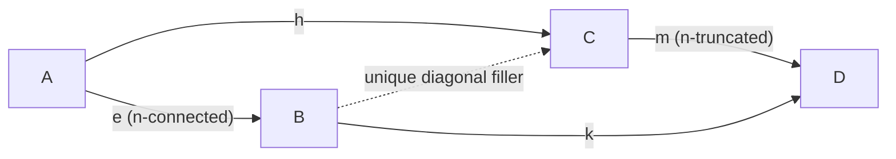
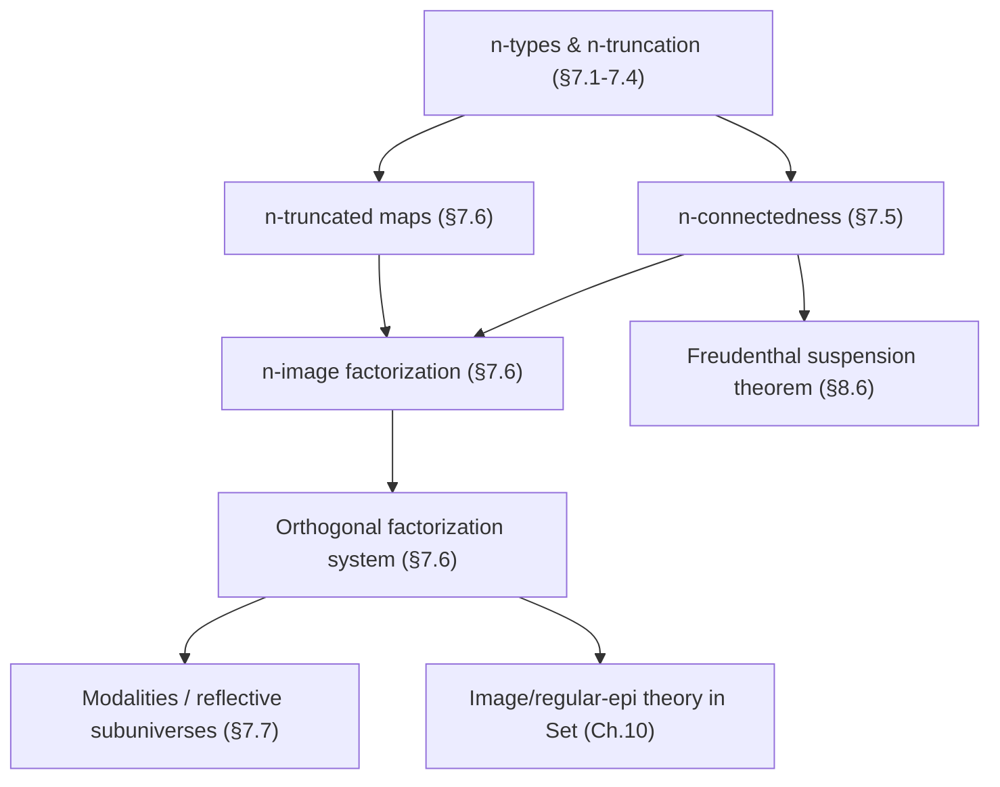

[[book-guidelines|↩ Back to guidelines]]

> Prerequisite: this article assumes you already have the $n$-type / truncation hierarchy from [[Homotopy-n-Types-and-Truncation-Levels]] — what a $(-2)$-type, $(-1)$-type, $0$-type are, and what $\|\!-\!\|_n$ does. Here we build the *other half* of that hierarchy — types and maps that have "nothing interesting *below* a dimension" instead of "nothing interesting *above* it" — and show that the two halves fit together into a factorization system, which itself turns out to be one instance of a much larger pattern: a *modality*.

## 1. The problem: truncation only tells half the story

An $n$-type has no interesting structure **above** dimension $n$: its $(n{+}1)$-fold and higher path spaces are all contractible. But that constraint says nothing about what happens **below** $n$. A type could be perfectly 0-truncated (a set) and still be enormous — $\mathbb{N}$ is a set, and so is $\mathbf{1}$, and truncation-level alone can't distinguish "one point" from "countably many disjoint points."

To capture *that* distinction — "how many pieces does this thing have, and how connected are they" — the book introduces a second, complementary notion: **connectedness**. And once you have both notions, a natural question appears, the same one you'd ask in ordinary set theory: every function $f: A \to B$ between sets factors as a surjection followed by an injection,
$$ A \twoheadrightarrow \mathrm{im}(f) \hookrightarrow B, $$
and that factorization is essentially unique. Does something like this survive at every truncation level, with "surjection" replaced by some homotopical analogue? The chapter's answer is yes — and the very abstract machine that makes it work (a *reflective subuniverse* with a idempotent "modal" operator $\#$) turns out to describe something you already know from functional programming: a monad.

This is the throughline of §§7.5–7.7: connected maps generalize surjections, truncated maps generalize injections, their combination gives a genuine orthogonal factorization system, and the *entire pattern* is really an instance of the far more general notion of a modality.

---

## 2. $n$-connected types and functions

### 2.1 What breaks without it

Suppose you only had truncation levels. You could say "$S^1$ (the circle, as a higher inductive type) is a 1-type" — true, but useless for distinguishing $S^1$ from a disjoint union of two circles, or from a point. Truncation caps the *upper* dimensions; it says nothing about whether the *lower*-dimensional data (its $\pi_0$, its $\pi_1$, …) is trivial. Connectedness is exactly the dual notion, built the same way n-types are built — recursively, starting from a base case — but pointed in the opposite direction.

### 2.2 Definition, by way of fibers

> **Definition 7.5.1.** A function $f : A \to B$ is **$n$-connected** if for every $b : B$, the truncated fiber $\| \mathrm{fib}_f(b) \|_n$ is contractible:
> $$ \mathrm{conn}_n(f) :\equiv \prod_{b:B} \mathrm{isContr}(\| \mathrm{fib}_f(b) \|_n). $$
> A type $A$ is **$n$-connected** if the unique map $A \to \mathbf{1}$ is $n$-connected — equivalently, if $\|A\|_n$ is contractible.

Read this the way the book wants you to read it: an $n$-connected function is one whose fibers "look like a point" once you can no longer see detail above dimension $n$. Every function is trivially $(-2)$-connected (contractibility of a truncated fiber at level $-2$ is vacuous once you truncate at $(-2)$ — everything truncates to the point). The first interesting case is $n = -1$:

> **Lemma 7.5.2.** $f$ is $(-1)$-connected iff $f$ is surjective (in the sense of §4.6: every fiber is *merely* inhabited).

So $n$-connectedness for $n \geq 0$ is literally "surjective, but with higher coherence": not just *some* point in each fiber, but a whole contractible ($n$-truncated) space of witnesses. This matches the informal vocabulary the book fixes here: a $0$-connected type is called **connected**, a $1$-connected type is called **simply connected** — exactly the words you already use informally for "one path component" and "trivial $\pi_1$."

**Caution on indexing** (Remark 7.5.3): classical homotopy theory is off by one from this book's convention — what the book calls "$f$ is $n$-connected" (fibers are $n$-connected), classical topologists often call "$(n{+}1)$-connected" (a historical artifact of focusing on cofibers rather than fibers). Keep this in mind if you ever cross-reference Lurie or Rezk.

### 2.3 The closure properties that make it usable

The book proves a small toolkit you'll reuse constantly (Lemmas 7.5.4–7.5.6, 7.5.12–7.5.14):

- $n$-connectedness is preserved under **retracts** and under **homotopy** — it's a coherent, not a strict, property.
- **2-out-of-3-style composition**: if $f$ is $n$-connected, then $g \circ f$ is $n$-connected iff $g$ is (Lemma 7.5.6) — the connected part of a composite can be "cancelled."
- **Fiberwise transformations** of $n$-connected maps assemble into $n$-connected maps on total spaces (Lemma 7.5.12–7.5.13) — the connectivity analogue of the fact that a fiberwise equivalence on $\Sigma$-types is an equivalence.
- $n$-connected maps induce **equivalences on $n$-truncations**: $\|A\|_n \simeq \|B\|_n$ (Lemma 7.5.14) — though the converse fails (the inclusion $0_2 : \mathbf{1} \to \mathbf{2}$ induces a $(-1)$-truncation equivalence without being surjective — truncation-equivalence is strictly weaker).

### 2.4 The characterization that actually matters: connectivity is an induction principle

The single most load-bearing result of §7.5 is **Lemma 7.5.7**, and it's worth internalizing precisely because it reframes "connected" from a *fiber-shape* condition into an *elimination-principle* condition — the same move HoTT makes everywhere (recall: propositional truncation is characterized not by what it *is* but by what you're allowed to *map out of it into*).

> **Lemma 7.5.7.** For $f : A \to B$ and $n \geq -2$, TFAE:
> (i) $f$ is $n$-connected.
> (ii) For every $P : B \to n\text{-}\mathrm{Type}$, precomposition $\lambda s.\, s \circ f : \big(\prod_{b} P(b)\big) \to \big(\prod_a P(f(a))\big)$ is an **equivalence**.
> (iii) The same map merely has a **section**.

In words: $f$ is $n$-connected exactly when "every section of an $n$-type-valued family over $B$ can be recovered uniquely from its restriction along $f$." This is precisely a **generalized induction principle**: for a surjection ($n=-1$), it says "to prove a mere proposition about every $b:B$, it suffices to prove it about $f(a)$ for every $a:A$" — the familiar principle you already use to reason about quotients and images. Corollary 7.5.9 packages the cleanest special case: **$A$ is $n$-connected iff every map from $A$ into an $n$-type is (merely) constant** — literally "there is nothing to see" phrased as an elimination property, not an existence claim.

### 2.5 Rust and Lean grounding

Connectedness-as-elimination-principle is exactly the shape of a **trait-based visitor / fold**, and it's exactly what Lean's `Trunc`/`Squash` recursors demand: you can only produce something *out of* a truncated type if your target doesn't care about the extra path structure you threw away.

```rust
// A function f: A -> B is "(-1)-connected" (surjective) precisely when
// every predicate P: B -> Prop that holds for all f(a) also holds for all b.
// We can't literally check contractibility of a fiber at the type level in
// Rust, but the *induction-principle* reading (Lemma 7.5.7) translates directly
// into a trait bound: "you may only build a Section<B> from a Section<A>
// along f if f is surjective onto the b's you care about."
trait FiberInduction<A, B> {
    fn connected_witness(&self, b: &B) -> Option<A>; // "surjective" = always Some
}

fn lift_along<A, B, P: Clone>(
    f: &dyn FiberInduction<A, B>,
    section_on_a: impl Fn(&A) -> P,
    b: &B,
) -> Option<P> {
    // (iii) => (i) direction of Lemma 7.5.7, specialized to n = -1:
    // a section over B is recoverable from a section over A precisely
    // when f has a (propositional) fiber witness for every b.
    f.connected_witness(b).map(|a| section_on_a(&a))
}
```

```lean
-- Lean's `Trunc` is literally `‖ · ‖ (-1 truncation-ish, actually the "mere"
-- truncation used for propositional erasure). The eliminator `Trunc.lift`
-- IS Lemma 7.5.7(ii)-(iii): you may map *out of* Trunc α into any type β
-- exactly when β doesn't see the erased structure (is a subsingleton, or
-- you supply a proof the choice doesn't matter).
def liftConnected {α β : Type} (h : Subsingleton β)
    (f : α → β) : Trunc α → β :=
  Trunc.lift f (fun a b => Subsingleton.elim (f a) (f b))
-- This is precomposition-with-`Trunc.mk` being an equivalence — Lemma 7.5.7(ii)
-- specialized to n = -1, with β playing the role of an n-type P(b).
```

---

## 3. $n$-truncated maps: the other half

### 3.1 Definition, and the recursive characterization

> **Definition 7.6.1.** $f : A \to B$ is **$n$-truncated** if $\mathrm{fib}_f(b)$ is an $n$-type for every $b : B$.

This is the exact dual move: instead of asking fibers to be *contractible after truncation* (connectedness), we ask fibers to already *be* $n$-types (truncatedness) — "no interesting information *above* dimension $n$ in each fiber." A $(-2)$-truncated map is exactly an equivalence (contractible fibers). A type $A$ is an $n$-type iff $A \to \mathbf{1}$ is $n$-truncated.

Just like $n$-types themselves, $n$-truncated maps admit a **recursive characterization** (Lemma 7.6.2):
$$ f \text{ is } (n{+}1)\text{-truncated} \iff \forall x,y:A,\; \mathrm{ap}_f : (x=y) \to (f(x)=f(y)) \text{ is } n\text{-truncated}. $$
In particular, $f$ is $(-1)$-truncated iff it is an **embedding** — the map $\mathrm{ap}_f$ is an equivalence, i.e. $f$ reflects and preserves path structure faithfully. So [[Type-Theory-as-a-Foundational-System-Qwen#The hierarchy|the hierarchy]] "$n$-truncated map" specializes at the bottom exactly to the classical inclusion-of-a-subtype picture: embeddings generalize injections the same way $(-1)$-connected generalizes surjections.

### 3.2 What breaks without both halves

If you only had "surjective" and "injective" as bare (untyped-in-dimension) predicates, you'd have no way to talk about factoring a map $S^1 \to \mathbf{1}$ in a way that's aware of *how much* higher path structure survives at each stage. The point of indexing both connectedness and truncatedness by the *same* $n$ is that they become dual halves of one classifying scale, letting you factor a map at whatever resolution ($n = -1$ for sets-style images, $n=0$ for "components," etc.) the problem actually needs.

---

## 4. The $n$-image factorization

> **Definition 7.6.3.** For $f : A \to B$, the **$n$-image** is
> $$ \mathrm{im}_n(f) :\equiv \sum_{b:B} \| \mathrm{fib}_f(b) \|_n. $$
> ($n = -1$: just "the image," matching the classical set-theoretic image.)

The factorization writes itself once you have the pieces:

> **Lemma 7.6.4.** The canonical map $\tilde f : A \to \mathrm{im}_n(f)$, $a \mapsto (f(a), |(a, \mathrm{refl})|_n)$, is $n$-connected, and $\mathrm{pr}_1 : \mathrm{im}_n(f) \to B$ is $n$-truncated. **Every function factors as an $n$-connected map followed by an $n$-truncated map.**

This is the direct homotopical lift of "every set function factors as surjection then injection" — $\tilde f$ is the "quotient onto the (higher) image," $\mathrm{pr}_1$ is the "inclusion of the image into the codomain," and the fiber of $\mathrm{pr}_1$ over $b$ is literally $\|\mathrm{fib}_f(b)\|_n$, which is $n$-truncated by construction.

```python
# n = -1 case, concretely: factor f: A -> B as A -> im(f) -> B.
# im(f) is exactly {b in B : exists a, f(a) = b} — the image as a subset,
# paired with (merely) a witness. This is the untyped shadow of Definition 7.6.3.
def image_factor(f, A):
    image = {f(a) for a in A}                 # pr1(im(f)) subset of B
    surj  = {a: f(a) for a in A}               # A -> im(f), the "n-connected" half
    incl  = list(image)                        # im(f) -> B, the "n-truncated" (embedding) half
    return surj, incl
```

---

## 5. Orthogonal factorization: uniqueness and the lifting property

Existence of *a* factorization is cheap; what makes this a genuine **factorization system** (in the sense used throughout higher category theory — Rezk, Lurie, and the classical orthogonal factorization systems of ordinary category theory) is that it's **essentially unique**, and that the two classes ("$n$-connected," "$n$-truncated") are *orthogonal* to each other in a precise lifting sense.

### 5.1 Uniqueness: the space of factorizations is contractible

> **Theorem 7.6.6.** For $f : A \to B$, the type
> $$ \mathrm{fact}_n(f) :\equiv \sum_{(X:\mathcal U)} \sum_{(g:A\to X)} \sum_{(h:X\to B)} (h \circ g \sim f) \times \mathrm{conn}_n(g) \times \mathrm{trunc}_n(h) $$
> is **contractible**, centered at $(\mathrm{im}_n(f), \tilde f, \mathrm{pr}_1, \ldots)$.

This is a strong statement, well beyond "unique up to iso": the *entire space* of (middle object, connected part, truncated part, compatibility homotopy) is contractible, i.e. any two such factorizations are connected by an essentially unique equivalence of middle objects compatible with everything in sight. The proof (via Lemma 7.6.5) constructs that equivalence explicitly from a fiberwise comparison $\mathrm{fib}_{h_1}(b) \simeq \mathrm{fib}_{h_2}(b)$, using that $g_1, g_2$ are $n$-connected (so their truncated fibers are contractible) and $h_1, h_2$ are $n$-truncated (so truncating their fibers is a no-op). This is the technical heart of the section — it's what "essentially unique" *means* once you refuse to collapse equalities to a bare proposition.

### 5.2 Orthogonality: the lifting property

> **Theorem 7.6.7.** For $e : A \to B$ $n$-connected and $m : C \to D$ $n$-truncated, the map
> $$ \varphi : (B \to C) \to \sum_{h:A\to C} \sum_{k:B\to D} (m \circ h \sim k \circ e) $$
> is an **equivalence**.

This is the categorical definition of orthogonality, stated as a homotopy-coherent unique lifting property: given a commuting square with an $n$-connected map on the left and an $n$-truncated map on the right, there is an essentially unique diagonal filler.



If this diagram looks like the standard "lifting problem" picture from model category theory or from ordinary orthogonal factorization systems in category theory — that's exactly the point. The book is showing that $(n\text{-connected}, n\text{-truncated})$ literally *is* an orthogonal factorization system on the $(\infty,1)$-category of types, with the same defining property (unique diagonal fillers) as the surjection/injection factorization system on $\mathbf{Set}$.

### 5.3 Stability under pullback

Rounding out the package, images are **stable under pullback** (Lemma 7.6.8, Theorem 7.6.9): if the outer rectangle of
$$
\begin{array}{ccc} A & \to & C \\ \downarrow{\scriptstyle f} & & \downarrow{\scriptstyle g} \\ B & \xrightarrow{h} & D \end{array}
$$
is a pullback, then so is the square formed from $\mathrm{im}_n(f) \to B$ and $\mathrm{im}_n(g) \to D$ — exactly the property you'd expect an "image" to have (pulling back a subobject along any map gives you the image of the pullback), and exactly the property that makes factorization systems well-behaved enough to build a theory of classifying maps and subobject-style reasoning on top of.

```rust
// Orthogonality as a Rust type: given e: A -> B (n-connected, think "quotient
// map") and m: C -> D (n-truncated, think "embedding"), a commuting square
// has an essentially unique diagonal filler. We can't express "essentially
// unique up to a contractible space of choices" in Rust's type system, but
// we CAN express the lifting problem itself precisely — this is the shape
// every "elaborate this metavariable against a spec" step in a unifier has:
// e is the surjective-onto-goals part, m is the injective-into-context part.
fn unique_filler<A, B, C, D>(
    e: impl Fn(&A) -> B,             // n-connected: "surjective enough"
    m: impl Fn(&C) -> D,             // n-truncated: "injective enough"
    h: impl Fn(&A) -> C,
    k: impl Fn(&B) -> D,
    // precondition: m(h(a)) == k(e(a)) for all a   (the commuting square)
) -> impl Fn(&B) -> C {
    // In the b = e(a) case the filler is forced to be h(a); orthogonality
    // says this is well-defined (independent of the choice of preimage a)
    // and unique — which is exactly what "e is n-connected" buys you.
    move |_b: &B| unimplemented!("filler exists and is unique by orthogonality")
}
```

---

## 6. Modalities and reflective subuniverses: the general pattern

### 6.1 Why generalize at all

The book is explicit: "nearly all of the theory of $n$-types and connectedness can be done in much greater generality" — and then spends §7.7 extracting exactly what made §§7.5–7.6 work, stripped of any reference to a specific truncation level $n$. This matters because $n$-truncation is *one* instance of the pattern, but the pattern itself — an idempotent operation with a universal mapping-out property — is the same shape as a closure operator in a Galois connection, and the same shape as a monad in functional programming. Seeing the general shape is what lets you recognize it later in unrelated settings.

### 6.2 Reflective subuniverses

> **Definition 7.7.1.** A **reflective subuniverse** is a predicate $P : \mathcal{U} \to \mathrm{Prop}$ together with, for every $A$, a type $\#A$ with $P(\#A)$ and a map $\eta_A : A \to \#A$, such that for every $B$ with $P(B)$,
> $$ (\#A \to B) \xrightarrow{\;-\circ \eta_A\;} (A \to B) $$
> is an **equivalence**.

Compare this directly to propositional truncation's universal property from Chapter 3, or to $n$-truncation's from §7.3 — those are the two examples you already know; this definition is just the pattern with the specific $n$ erased. Consequences fall out immediately and are worth naming because they're exactly the properties you rely on with truncation without usually stopping to ask why they hold:

- $A$ already lies in the subuniverse iff $\eta_A$ is an equivalence.
- The subuniverse is closed under **retracts**.
- $\#$ is a **functor** (up to coherent homotopy).
- The subuniverse is closed under **all limits** — in particular products and pullbacks, hence identity types of modal types are modal (Theorem 7.7.2 upgrades this to *dependent products*, i.e. the subuniverse is an **exponential ideal**: $(A \to B) \in \mathcal{U}_P$ whenever $B \in \mathcal{U}_P$, for *any* $A$).
- The reflector preserves finite products: $\#(A \times B) \simeq \#A \times \#B$ (Corollary 7.7.3).

**This is precisely a Galois-connection closure operator.** If you think of $\mathcal U_P$ as the "abstract domain" and every type as living in the "concrete domain" $\mathcal U$, then $\eta_A : A \to \#A$ is the abstraction map, $\#$ is idempotent up to equivalence, and the universal property is exactly the adjunction defining a Galois insertion: maps out of the abstraction correspond bijectively to maps out of the concrete object landing in the abstract codomain. If you've worked with abstract-interpretation closure operators or Lawvere–Tierney-style modal operators, this *is* that pattern, transported into type theory.

### 6.3 What's missing from a bare reflective subuniverse: $\Sigma$-closure

Two properties of $n$-types are *not* automatic for an arbitrary reflective subuniverse: closure under $\Sigma$-types, and a genuine **induction principle** (as opposed to just a recursion/universal-mapping-out principle). Theorem 7.7.4 shows these two gaps are actually the *same* gap — closure under $\Sigma$ is logically equivalent to having a dependent elimination principle "modulo modal types." This is the same recursion-vs-induction distinction from §5.5 (inductive types: a recursor lets you map out uniformly, an inductor lets you map out *depending on the input* — strictly more powerful when it's available).

### 6.4 Modalities: definition-as-induction-principle

> **Definition 7.7.5.** A **modality** is an operation $\# : \mathcal U \to \mathcal U$ with
> (i) $\eta_A^\# : A \to \#A$,
> (ii) an **induction principle**: for $B : \#A \to \mathcal U$, $\mathrm{ind}^\# : \big(\prod_a \#(B(\eta_A^\#(a)))\big) \to \prod_{z:\#A} \#(B(z))$,
> (iii) the expected computation rule $\mathrm{ind}^\#(f)(\eta^\#_A(a)) = f(a)$,
> (iv) for all $z, z' : \#A$, $\eta^\#_{z=z'} : (z=z') \to \#(z=z')$ is an equivalence.
>
> $A$ is **modal** if $\eta_A^\#$ is an equivalence; $\mathcal U_\# :\equiv \{X : \mathcal U \mid X\text{ is }\#\text{-modal}\}$.

Corollary 7.7.8 closes the loop: **modalities are exactly reflective subuniverses closed under $\Sigma$-types.** So $n$-truncation is a modality (with $\mathcal U_\# = n\text{-Type}$); propositional truncation is the $n=-1$ case; the **identity modality** $\#A :\equiv A$ (with $\eta = \mathrm{id}$) is the trivial case, and the book notes the adverb for it is "purely" — deliberately echoing the vocabulary of *pure* functions in functional programming, because:

### 6.5 The punchline the book states outright: this is a monad

> *(Notes, §7.7)*: "monads (and hence modalities) are used to model computational effects in functional programming. A computation is said to be pure if its execution results in no side effects… There exist 'purely functional' programming languages, such as Haskell, in which it is technically only possible to write pure functions: side effects are represented by applying 'monads' to output types."

This is not a loose analogy the article is adding — it's the book's own framing. A modality $\#$ with $\eta_A : A \to \#A$ and the induction principle is precisely (the type-theoretic incarnation of) an **idempotent monad**: $\eta$ is `pure`/`return`, the induction principle is a dependent `bind`, and modal types are the types where "running the effect" is a no-op. The one caveat the book flags: the modalities arising here are all **idempotent** ($\#\#A \simeq \#A$), whereas garden-variety programming monads (`IO`, `State`) generally aren't — but the algebraic shape (unit + a way to eliminate into the same class of targets + coherence) is identical.

```lean
-- Lean's own `Trunc n α` / `Squash α` are literal instances of Definition 7.7.5.
-- `Trunc.mk` is η, `Trunc.rec`/`Trunc.lift` is the induction/recursion
-- principle, and idempotence (`Trunc (Trunc α) ≃ Trunc α`) is definitional
-- reflective-subuniverse-style closure.
-- Reading a modality as a monad, in Lean's own monadic vocabulary:
def PureModality (α : Type) := α          -- "purely": # A :≡ A, η :≡ id

-- A genuinely idempotent reflective example, matching Definition 7.7.1 exactly:
instance : Monad Trunc where
  pure   := Trunc.mk                       -- η_A
  bind t f := Trunc.lift (fun a => f a) (fun a b => Trunc.eq _ _) t  -- ind#
```

```rust
// The "reflective subuniverse as idempotent monad" pattern, made concrete:
// a `Reflect` trait is a monad whose `bind` target is always required to
// already be "modal" (already reflected) — exactly Definition 7.7.1's
// requirement that the universal property only quantifies over B : P.
trait Modal {}                       // marker: "this type is already #-modal"

trait Reflector<A> {
    type Reflected: Modal;
    fn eta(a: A) -> Self::Reflected;                       // η_A
    fn rec<B: Modal>(f: impl Fn(A) -> B) -> impl Fn(Self::Reflected) -> B; // rec#
}
```

---

## 7. Synthesis: where this sits in the book, and why it matters for a verifier

**Backward dependencies.** This topic leans on the truncation hierarchy (§7.1–§7.4, [[Homotopy-n-Types-and-Truncation-Levels]]) for the notion of $n$-type and $\|\!-\!\|_n$, on fiber/equivalence machinery from Chapter 4 ([[Equivalences-and-Their-Characterizations]]) for [[Type-Theory-as-a-Foundational-System-Qwen#The definition|the definition]] of $\mathrm{fib}_f$, and on higher inductive types (Chapter 6, [[Higher-Inductive-Types]]) for the concrete truncation constructors used throughout the proofs.

**Forward dependencies.** The book tells you directly where this goes next: §8.6's proof of the **Freudenthal suspension theorem** is built on exactly the connectivity machinery of §7.5 (in particular the induction-principle characterization, Lemma 7.5.7). More broadly, the orthogonal factorization system here is the type-theoretic seed of the image/regular-epimorphism theory used for $\mathbf{Set}$ in Chapter 10, and the reflective-subuniverse language reappears whenever the book needs a "closure under a universal property" argument (categories as a reflective subuniverse of precategories, in spirit, in Chapter 9's Rezk completion).



**Why this is load-bearing for a verifier/elaborator project.** Three threads worth flagging explicitly, tying back to the standing project:

1. **Connectivity-as-induction-principle (Lemma 7.5.7) is the same move as your proof-obligation discharge.** "To prove something about every $b$ in the codomain of an $n$-connected map, it suffices to prove it about the image of every $a$" is exactly the shape of a soundness argument that discharges an obligation on a *derived* judgment by discharging it on the *generating* judgments — the same pattern that shows up when proving a Hoare-triple invariant is preserved by reducing to preservation at the syntactic constructors that generate a term.
2. **The orthogonal factorization system's unique-lifting property (Theorem 7.6.7) is literally the shape of unification with a metavariable.** A commuting square with a connected map on one leg and a truncated (embedding-like) map on the other, admitting an essentially unique diagonal filler, is structurally the same problem as: "given constraints that determine a metavariable up to the information a pattern-unification problem is allowed to see, produce the (unique, when it exists) filler." Recognizing factorization systems as *the* categorical language for "solve uniquely, when a well-posedness condition holds" is directly transferable to reasoning about when your elaborator's unifier has a unique solution versus none versus many.
3. **Modalities as idempotent monads (§6.5 above) are your closure-operator vocabulary for abstract interpretation.** A reflective subuniverse's $\eta_A : A \to \#A$, with the universal mapping-out property restricted to already-abstract targets, is precisely a Galois-insertion abstraction map. If your abstract-interpretation invariant-generation pass is going to reason about "the smallest abstract element above a concrete one, and functions that only care about the abstraction," this section is the type-theoretic vocabulary for exactly that closure-operator idea — right down to the idempotence condition.
