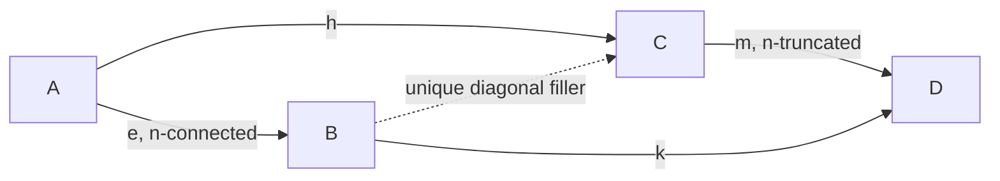
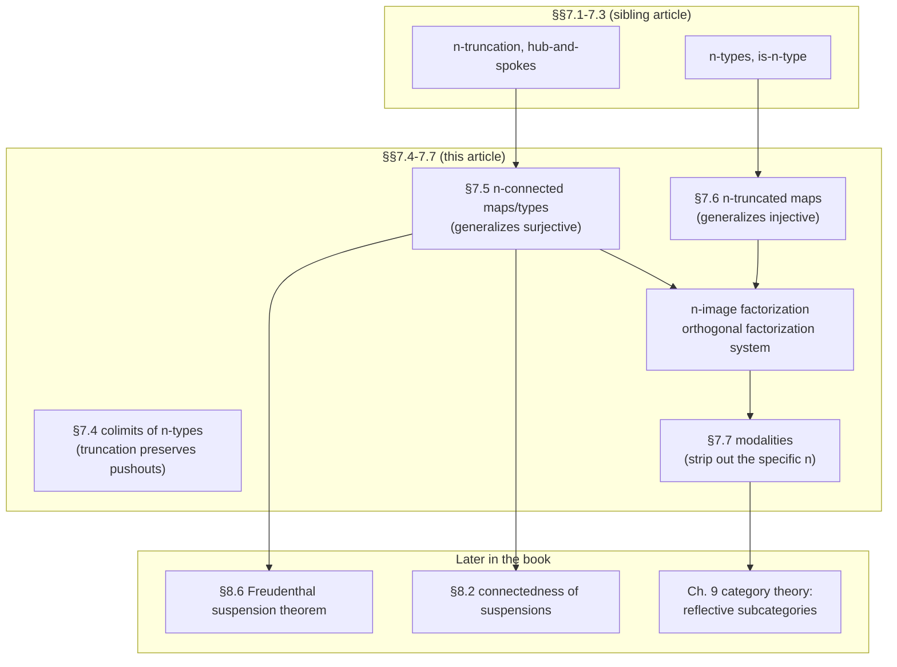

# Connectedness and Orthogonal Factorization

[[book-guidelines|↩ Back to guidelines]]

## What problem does this solve?

The sibling article [[Homotopy-n-Types-and-Truncation-Levels|Homotopy n-Types and Truncation Levels]] built the ladder of $n$-types — types with no interesting homotopical information *above* dimension $n$ — and the machinery of $n$-truncation, $\|A\|_n$, which crushes a type down onto that ladder. That machinery answers "how do I make a type simple enough," but it leaves a dual question completely untouched: given a *function* $f : A \to B$, how much of $A$'s structure does $f$ actually see, and how much does it throw away?

This chapter section answers that with a genuinely elegant piece of algebra. Ordinary set theory has one clean fact everyone learns early: every function between sets factors uniquely as a surjection followed by an injection — first collapse the domain onto its image, then include that image into the codomain. It seems like a fact about sets specifically. It isn't. It's a shadow, at truncation level $-1$, of a fact that holds at *every* truncation level simultaneously: every function factors as an "$n$-connected" map (a vast generalization of "surjective") followed by an "$n$-truncated" map (a vast generalization of "injective"), and this factorization is unique up to equivalence. That's an **orthogonal factorization system**, and it's one of the cleanest structural theorems the book proves.

**What breaks without this generalization:** without a uniform notion of connectedness, you'd have no systematic way to say "this map is surjective, but also doesn't merge any of the higher path structure" — statements essential to computing homotopy groups in Chapter 8 (the encode–decode method leans directly on connected maps' induction principle) and to recognizing the same factorization pattern recurring across completely different mathematical settings (category theory's essential-surjective/full-and-faithful split, topos theory's images, and — as the closing section shows — arbitrary "modalities" that needn't come from truncation at all).

---

## Colimits of $n$-types: truncation preserves pushouts (§7.4)

Before connectedness, the book closes a loose end from truncation: does $n$-truncating commute with taking a pushout? Concretely, given a span $A \xleftarrow{f} C \xrightarrow{g} B$ with pushout $D$, is $\|D\|_n$ the pushout of the *truncated* span $\|A\|_n \leftarrow \|C\|_n \to \|B\|_n$ (computed inside $n$-types, i.e. universal among $n$-types rather than among all types)?

**Theorem 7.4.12.** Yes. If $(D, c)$ is the pushout of a span $\mathcal{D}$, then $(\|D\|_n, \|c\|_n)$ is the pushout of $\|\mathcal{D}\|_n$ *within the category of $n$-types* — meaning it satisfies the universal property that for every $n$-type $E$, maps $\|D\|_n \to E$ correspond exactly to cocones out of $\|\mathcal{D}\|_n$ into $E$.

The proof is a careful diagram chase built from the truncation-recursion machinery already in place (Lemma 7.3.5, the naturality of $|-|_n$): you show a square of "precompose with the projection maps" arrows commutes and that enough of its edges are equivalences to conclude, by 2-out-of-3, that the remaining edge is too. Nothing conceptually new is invented here — it's a payoff of the truncation machinery, confirming that $n$-**Type** is closed under the colimits that matter (this is the technical fact that lets Chapter 8 freely build spheres and suspensions and then truncate them without worrying about whether truncation "sees" the gluing correctly).

*[[Homotopical-Interpretation-of-Type-Theory#Grounding|Grounding]].* There isn't a natural Rust/Python code shape for a pushout-of-quotients coherence proof — this is genuinely a "prove the diagram commutes" result with no computational content to demonstrate outside of a proof assistant. In **Lean**, though, the shape is completely recognizable: it's exactly the kind of `Quot`-of-a-`Quot` naturality lemma you prove when relating a `HigherIndType` built from a pushout, or `Quotient` types stacked on `Trunc`, to their images under further quotienting. The load-bearing idea to carry forward — "truncation is a left adjoint (a reflector), and left adjoints preserve colimits" — is the one-sentence category-theoretic summary; the chapter proves it by hand because it hasn't introduced adjoints yet.

---

## Connectedness: the dual of truncatedness (§7.5)

### The intuition before the symbol

An $n$-type has no interesting information *above* dimension $n$: past that level, all the higher path spaces are contractible (trivial). An **$n$-connected** type is the mirror image — no interesting information *at or below* dimension $n$. Concretely:

- **$0$-connected** ("connected") means the type has exactly one path-component — it's "all one piece."
- **$1$-connected** ("simply connected") additionally means every loop is contractible — no interesting $\pi_1$.
- In general, $n$-connectedness kills off structure in dimensions $0$ through $n$ and leaves everything from $n+1$ up untouched.

So truncatedness and connectedness are literally dual thresholds on the same ladder: one says "nothing interesting above here," the other says "nothing interesting at or below here." A type that is both $n$-truncated and $n$-connected is, informally, exactly at the boundary — it's forced to be contractible (nothing above $n$, nothing at or below $n$, so nothing at all).

**What breaks without extending this to functions, not just types:** you constantly want to say things like "this map merges path components but is otherwise faithful to the higher structure" — that's a statement about a *map*, and "the map's target, viewed as a type, is connected" doesn't capture it (the target could easily be connected for reasons unrelated to $f$). You need connectedness to be a property of the map's *fibers*.

### The formal definition

**Definition 7.5.1.** A function $f : A \to B$ is **$n$-connected** if every fiber, once truncated, is contractible:
$$
\mathsf{conn}_n(f) :\equiv \prod_{b:B} \mathsf{isContr}\big(\|\mathrm{fib}_f(b)\|_n\big).
$$
A type $A$ is **$n$-connected** if the unique map $A \to \mathbf{1}$ is $n$-connected, equivalently if $\|A\|_n$ is contractible.

Unwind the base case ($n = -1$): $\|\mathrm{fib}_f(b)\|_{-1}$ contractible just means $\mathrm{fib}_f(b)$ is merely inhabited, i.e. $f$ is **surjective** in the §4.6 sense (Lemma 7.5.2). So $n$-connectedness for $n \geq 0$ is a strictly stronger condition than surjectivity: not only does every $b$ have *some* preimage, but the *space of preimages*, once you truncate away structure above level $n$, collapses to a single point. Every function is trivially $(-2)$-connected (every truncated fiber is contractible because $(-2)$-truncation of anything is contractible by definition).

**A subtlety worth flagging explicitly** (Remark 7.5.3): the book's indexing for connected *functions* is off-by-one from classical algebraic topology's convention (which counts by cofibers, historically), even though the indexing for connected *types* matches the classical one. This is exactly the kind of footgun that bites you when cross-referencing other homotopy theory sources — the book's $f$ being "$n$-connected" is classically called "$(n+1)$-connected" in some textbooks.

### Closure properties — connectedness survives composition and retraction

A short chain of lemmas establishes connectedness behaves the way you'd hope a well-designed property should:

- **Lemma 7.5.4 / Corollary 7.5.5.** Retracts and homotopic maps of $n$-connected maps are $n$-connected — connectedness is an invariant of the map "up to the same flexibility" as equivalence itself.
- **Lemma 7.5.6 (2-out-of-3-flavored).** If $f : A \to B$ is $n$-connected, then $g : B \to C$ is $n$-connected iff $g \circ f$ is. This is proved by unwinding the fiber of a composite as a $\Sigma$-type over the fiber of $g$, using that $f$'s truncated fibers vanish — a nice example of "chase the fibers through the $\Sigma$-type identity for composites" (Exercise 4.4) combined with the truncation idempotence fact from §7.3.

### The induction principle — the real payoff

The single most useful characterization in this section is **Lemma 7.5.7**, because it turns "is this map $n$-connected" from a fiber-contractibility check into a *universal property* — and universal properties are what you actually use in later proofs (most importantly, the Freudenthal suspension theorem in §8.6).

**Lemma 7.5.7.** For $f : A \to B$ and any $n$-type-valued family $P : B \to n\text{-}\mathsf{Type}$, consider the "restrict along $f$" map
$$
\lambda s.\, s \circ f \;:\; \Big(\prod_{b:B} P(b)\Big) \to \Big(\prod_{a:A} P(f(a))\Big).
$$
The following are equivalent:
(i) $f$ is $n$-connected;
(ii) this restriction map is an equivalence for every such $P$;
(iii) this restriction map merely has a section for every such $P$.

Read (ii) in words: *if $f$ is $n$-connected, then to define a dependent function over all of $B$ landing in $n$-types, it's enough to define it on $A$ and check it respects $f$ — the values on $B$ are uniquely determined.* This is precisely the shape of an induction principle: $f$-connectedness licenses "prove it on the pieces $f$ hits, get it everywhere for free," as long as your target is truncated enough not to see whatever $f$ collapsed. **Corollary 7.5.8** applies this immediately to the canonical map into a truncation: $|-|_n : A \to \|A\|_n$ is always $n$-connected — truncation doesn't just crush structure above level $n$, the crushing map itself is exactly as connected as it needs to be to make that crushing "the best possible approximation from below."

**Corollary 7.5.9** restates $n$-connectedness of a *type* $A$ in the same universal-property language: $A$ is $n$-connected iff every map from $A$ into any $n$-type is *constant* — "every function out of $A$, once you can't see past level $n$, might as well be a constant function," which is a satisfying way to say "$A$ has no non-trivial structure that an $n$-type could possibly detect."

*Grounding — the induction principle as a trait bound.* This is exactly the shape of "if I can build something on the generators, and the target respects a coherence law, I get it on the whole quotient" — the same pattern behind `HashMap::entry`-style total functions from a coarser equivalence, or more precisely, Rust's typical pattern for defining a function out of a quotient type by matching on representatives and proving the choice doesn't matter. In **Lean**, this is close kin to `Quot.lift`/`Quot.ind`: giving a function on the "generators" that's compatible with the connectedness content is exactly `Quot.lift`'s hypothesis, and Lemma 7.5.7 is the general-$n$, general-target statement of the same idea, just replacing "quotient by a relation" with "collapse everything above level $n$."

### Connected pointed types, and connectivity of the basepoint

**Lemma 7.5.11** ties type-level and function-level connectivity together via basepoints: a pointed type $(A, a_0)$ is $n$-connected iff the inclusion $a_0 : \mathbf{1} \to A$ is $(n-1)$-connected. Specialized to $n=0$: $A$ is connected iff $a_0$'s inclusion is $(-1)$-connected, i.e. surjective — every point of $A$ merely equals $a_0$, which is just "everything is in the same path component as the basepoint," recovering the intuitive picture of connectedness directly.

Two more closure lemmas (**7.5.12**, **7.5.13**) extend connectedness to maps between total spaces of families — if $f : A \to B$ is $n$-connected and a fiberwise family of maps $g_a$ is also $n$-connected, the induced map on $\Sigma$-types is $n$-connected, and there's a clean converse when the family is a genuine fiberwise transformation (Lemma 7.5.13, via Theorem 4.7.6's fiber-of-`total` identity). These are the technical lemmas that make connectedness compose well through the $\Sigma$-type constructions used throughout the rest of the book.

Finally, **Lemma 7.5.14**: $n$-connected maps induce equivalences on $n$-truncations, $\|A\|_n \simeq \|B\|_n$ — but the book is careful to flag (right after) that the converse is *false*. Take the inclusion $0_2 : \mathbf{1} \to \mathbf{2}$ of the first element into the two-element type: both $\mathbf{1}$ and $\mathbf{2}$ are merely inhabited, so $\|\mathbf{1}\|_{-1} \to \|\mathbf{2}\|_{-1}$ is trivially an equivalence between two contractible propositional truncations — yet $0_2$ plainly misses the second element of $\mathbf{2}$, so it isn't surjective, i.e. not $(-1)$-connected. Connectedness is a genuinely stronger, more structural condition than "induces an equivalence on truncations."

---

## $n$-truncated maps and the $n$-image factorization (§7.6)

### The dual notion, and why it generalizes injections

Where $n$-connectedness generalized surjectivity, this section's **$n$-truncated map** generalizes injectivity.

**Definition 7.6.1.** $f : A \to B$ is **$n$-truncated** if $\mathrm{fib}_f(b)$ is an $n$-type for every $b : B$.

At $n = -2$: fibers are all contractible, i.e. $f$ is an equivalence. At $n = -1$: fibers are all mere propositions, i.e. $f$ is an **embedding** in the §4.6 sense — the type-theoretic analogue of an injective function, where "at most one preimage" is witnessed not just as a truth value but as the fiber being a mere proposition (so any two proofs that $b$ is hit are themselves equal). **Lemma 7.6.2** gives a recursive characterization mirroring the one for $n$-types themselves: $f$ is $(n+1)$-truncated iff $\mathrm{ap}_f : (x=y) \to (f(x)=f(y))$ is $n$-truncated for all $x,y$ — truncatedness of a map, like truncatedness of a type, bottoms out by looking one dimension up at path spaces.

### The $n$-image: the generalized image of a function

**Definition 7.6.3.** The **$n$-image** of $f : A \to B$ is
$$
\mathrm{im}_n(f) :\equiv \sum_{b:B} \|\mathrm{fib}_f(b)\|_n.
$$
When $n = -1$ this is exactly the ordinary set-theoretic image: $\sum_{b:B} \|\mathrm{fib}_f(b)\|_{-1}$ is "the $b$'s that are merely hit by $f$," which is precisely $f(A)$ construed as a subtype of $B$.

**Lemma 7.6.4** is [[Homotopical-Interpretation-of-Type-Theory#The construction|the construction]] step: the canonical map $\tilde f : A \to \mathrm{im}_n(f)$, sending $a$ to $(f(a), |(a, \mathrm{refl})|_n)$, is $n$-connected, and the projection $\mathrm{pr}_1 : \mathrm{im}_n(f) \to B$ is $n$-truncated (its fibers are literally $\|\mathrm{fib}_f(b)\|_n$, an $n$-type by construction). So *every function factors*:
$$
A \xrightarrow{\;\tilde f\; (n\text{-connected})} \mathrm{im}_n(f) \xrightarrow{\;\mathrm{pr}_1\; (n\text{-truncated})} B.
$$
This is the direct generalization of "surjection followed by injection" — replace $-1$ with any $n$, and "the image as a subset" with "the $n$-image as an $n$-truncated approximation of the fiber structure."

### Uniqueness: the factorization is essentially the only one

Existence of *a* factorization is easy; the real theorem is that it's *the* factorization, unique up to a contractible space of choices.

**Theorem 7.6.6.** For fixed $f : A \to B$, the type
$$
\mathrm{fact}_n(f) :\equiv \sum_{X:\mathcal U} \sum_{g:A\to X} \sum_{h:X \to B} (h \circ g \sim f) \times \mathsf{conn}_n(g) \times \mathsf{trunc}_n(h)
$$
— literally "the space of all ways to factor $f$ through an $n$-connected map followed by an $n$-truncated map" — is **contractible**. Its center is exactly the $n$-image factorization above.

This is the type-theoretic way of saying "unique up to unique isomorphism" without needing to talk about isomorphism classes: the *entire space of factorizations*, packaged as a single $\Sigma$-type, is contractible, meaning any two factorizations aren't just abstractly the same — there's a canonical, essentially-unique equivalence between them (constructed explicitly via **Lemma 7.6.5**'s fiber-comparison machinery, which builds the equivalence $\mathrm{fib}_{h_1}(b) \simeq \mathrm{fib}_{h_2}(b)$ between the two candidate truncated maps' fibers, given only a homotopy $h_1 \circ g_1 \sim h_2 \circ g_2$).

**What breaks without uniqueness:** existence alone would leave you unable to say "*the* $n$-image" meaningfully — there could be many inequivalent ways to split a map into connected-then-truncated pieces, and nothing would justify treating $\mathrm{im}_n(f)$ as canonical. Contractibility of $\mathrm{fact}_n(f)$ is what lets later chapters casually refer to "the $n$-image" as if it were a well-defined gadget, the same way you casually say "the kernel" of a group homomorphism rather than "a kernel."

### Orthogonality — the property that names the whole system

**Theorem 7.6.7** packages the factorization's uniqueness into the classical shape of an **orthogonal factorization system**: for $e : A \to B$ $n$-connected and $m : C \to D$ $n$-truncated, the "lifting square" map
$$
\varphi : (B \to C) \;\longrightarrow\; \sum_{h : A \to C} \sum_{k : B \to D} (m \circ h \sim k \circ e)
$$
is an equivalence. In words: given a commuting square with an $n$-connected map on the left edge and an $n$-truncated map on the right edge, there is a *unique* diagonal filler making both triangles commute (up to the expected homotopy). This is the literal type-theoretic incarnation of "orthogonality" from category theory — $e \perp m$ meaning every commuting square between them has a unique diagonal.

**Lemma 7.6.8 / Theorem 7.6.9** close the section with a stability result: $n$-images are stable under pullback — pulling back the target of $f$ along any $h : B' \to B$ commutes with taking $n$-images. This is the kind of "well-behaved under base change" property you expect from any construction deserving to be called canonical, and it's what lets you reason about images locally (fiber by fiber) rather than needing global information about $f$.

*Grounding — this is a real design pattern, not just abstract nonsense.* The connected/truncated split is precisely the shape of **typestate**: a "raw" value ($A$) gets normalized through a connected (information-preserving-up-to-level-$n$, "no loss below the cut") stage into a canonical intermediate form (the $n$-image), then included into the target type via a truncated (injective-up-to-level-$n$) embedding. In **Rust**, this is the `enum`-with-newtype-wrapper pattern for validated data: a constructor function `fn normalize(raw: Raw) -> Canonical` that's "surjective onto the canonical forms" (connected), composed with `impl From<Canonical> for Target` that never merges two distinct canonical values (truncated/injective). In **Lean**, the closest literal analogue is `Quotient.mk` (the connected half — it's surjective onto the quotient by construction) composed with an embedding of the quotient into some ambient type when one exists (the truncated half) — and the orthogonal-factorization uniqueness theorem is exactly why `Quotient.lift`'s output doesn't depend on which representative you picked: the factorization through the quotient is the *unique* connected-then-truncated factorization, so any two functions agreeing on that basis must agree everywhere the theory can see.

---

## Modalities: the same theorem, stripped of truncation (§7.7)

The book's closing move in this chapter is a generalization gambit: *how much of §§7.5–7.6 actually used the specific fact that $\|-\|_n$ comes from truncation?* The surprising answer is: almost none of it. Everything generalizes to an arbitrary **reflective subuniverse**.

### Reflective subuniverses

**Definition 7.7.1.** A reflective subuniverse is a predicate $P : \mathcal U \to \mathrm{Prop}$ together with, for every $A$, a type $\#A$ satisfying $P(\#A)$ and a map $\eta_A : A \to \#A$, such that for every $B$ with $P(B)$,
$$
(\#A \to B) \xrightarrow{\;-\circ \eta_A\;} (A \to B)
$$
is an equivalence. Write $\mathcal U_P$ for the subuniverse of types satisfying $P$.

This is exactly the categorical shape of a **reflective subcategory**: $\#$ is a reflector (left adjoint to the inclusion $\mathcal U_P \hookrightarrow \mathcal U$), and the universal property says "mapping out of $\#A$ into anything already in $\mathcal U_P$ is the same as mapping out of $A$ directly." $n$-truncation, $\#A :\equiv \|A\|_n$ with $P :\equiv \mathsf{is}\text{-}n\text{-}\mathsf{type}$, is the running example — but the definition never mentions $n$ at all.

The book proves a batch of standard reflective-subcategory facts hold automatically: $\mathcal U_P$ is closed under retracts, $\#$ is functorial, $\mathcal U_P$ is closed under all limits (products, pullbacks — in particular identity types of types already in $\mathcal U_P$, Theorem 7.7.2 extends this to *dependent products*, i.e. $\mathcal U_P$ is an **exponential ideal**: $B \in \mathcal U_P \Rightarrow (A \to B) \in \mathcal U_P$ for *any* $A$, not just $A \in \mathcal U_P$).

### Modalities — the $\Sigma$-closed reflective subuniverses

The one thing that does *not* come for free is closure under $\Sigma$-types (Theorem 7.1.8 for $n$-types specifically) or the corresponding truncation-induction principle (Theorem 7.3.2). **Theorem 7.7.4** shows these two extra properties are equivalent to each other for a reflective subuniverse, and **Definition 7.7.5** packages "reflective subuniverse with these extra properties" into a self-contained notion called a **modality**: an operation $\# : \mathcal U \to \mathcal U$ with unit maps $\eta_A$, an induction principle $\mathsf{ind}_\#$ (playing the role of $\Sigma$-closure without needing to phrase it via $P$ directly), its computation rule, and the requirement that $\#$ act like an equivalence on identity types of already-modal types.

A type $A$ is **modal** (previously "in $\mathcal U_P$") if $\eta_A : A \to \#A$ is itself an equivalence — the type is already "at the fixed point" of the reflector, nothing left to collapse. The book explicitly connects this vocabulary to modal logic's $\Diamond$/$\Box$ operators and, delightfully, to functional programming: **Haskell-style monads for side effects are the same shape as a modality**, with the identity modality $\#A :\equiv A$ corresponding to "purely functional" and the book's adverb "purely" chosen for exactly that reason. The chapter is explicit that the modalities considered here are all *idempotent* (applying $\#$ twice is the same as once) — real-world effect monads like `IO` usually aren't idempotent, but the underlying algebraic shape (a unit map plus a lifting/binding operation) is the same.

Finally, **§7.7** notes (without proof, flagged as beyond scope) that all of §§7.5–7.6's theory of connected/truncated maps and their orthogonal factorization system carries over *verbatim* to any modality — replace "$n$-connected" with "$\#$-connected" ($\#(\mathrm{fib}_f(b))$ contractible) and "$n$-truncated" with "$\#$-truncated" ($\mathrm{fib}_f(b)$ modal), and the entire factorization-system machinery still holds. The book singles out **left exact modalities** (those where $\#$ preserves pullbacks, not just products) as an important subclass corresponding to Lawvere–Tierney topologies / sub-$(\infty,1)$-toposes, but explicitly defers that theory.

*Grounding.* This is the cleanest match to programming intuition in the whole chapter: a **monad** in the Haskell/Rust sense (`Option`, `Result`, a custom `Validated<T>`) is a *non-idempotent* cousin of a modality. `Option::Some` is a unit map $\eta$; the fact that `flatten : Option<Option<T>> -> Option<T>` exists (idempotence-ish) makes `Option` closer to an actual modality than something like `Vec` (whose "unit" `vec![x]` doesn't have that fixed-point property in the same clean sense). In **Rust**, the exponential-ideal fact (Theorem 7.7.2 — $A \to B$ is modal whenever $B$ is) is the categorical reason `impl<T> SomeMarkerTrait for fn(_) -> T where T: SomeMarkerTrait` patterns work out: if your return type carries a validity guarantee, functions returning it inherit that guarantee "for free," without needing the argument type to carry any guarantee at all. In **Lean**, `Squash`/`Trunc` (Lean's built-in propositional-truncation-like modality) and the general `Quotient` mechanism are direct instances; and the elaborator's own treatment of `Decidable` instances (does *this* proposition reduce to a decided one) has the same "already at the fixed point vs. needs lifting" flavor as modal vs. non-modal types, though the book's monad connection is the more precise match, not a strained analogue.

---

## Synthesis: how this section fits into the book's structure

The dependency chain is tight and one-directional: connectedness and truncatedness are dual notions built directly on top of the $n$-truncation from §7.3; the $n$-image factorization is where they meet and cancel out into a single clean theorem; and modalities are the book's parting gesture that everything just proved is really a statement about reflective subcategories, with $n$-truncation as one instance among many. The single most consequential export forward is **Lemma 7.5.7's induction principle for connected maps** — Chapter 8 leans on it directly to prove the Freudenthal suspension theorem, which in turn is the engine behind computing $\pi_n(S^n) = \mathbb Z$ and the stable homotopy groups of spheres.

**[[Equivalences-and-Their-Characterizations#Where this leads|Where this leads]].** Chapter 8 opens by computing that $n$-connected types have suspensions that are $(n+1)$-connected (§8.2) — the very first substantial use of the connectedness machinery built here — and builds up to the Freudenthal suspension theorem (§8.6), whose proof is essentially "run the induction principle of Lemma 7.5.7 at the right connectivity level." Chapter 9's treatment of category theory will retroactively make precise what was informally flagged throughout this section: reflective subuniverses *are* reflective subcategories, and modalities are (idempotent, monadic) reflective subcategories closed under $\Sigma$-types — the categorical vocabulary this chapter was visibly reaching for without yet having the machinery to state.

For the standing project of building a Rust verifier and a Lean-style elaborator: the orthogonal factorization system is the single most transferable idea in this section. Any time your elaborator normalizes a raw term into a canonical form before comparing it against a target (definitional-equality checking, metavariable instantiation, unifying two terms up to a chosen reduction strategy), you are implicitly relying on a connected/truncated split — "normalization is surjective onto normal forms, and normal-form equality is as fine-grained as it needs to be to make comparison decidable." Making that split explicit, the way this chapter does, is a good discipline for making sure your own normalization procedure is provably canonical rather than merely believed to be.
