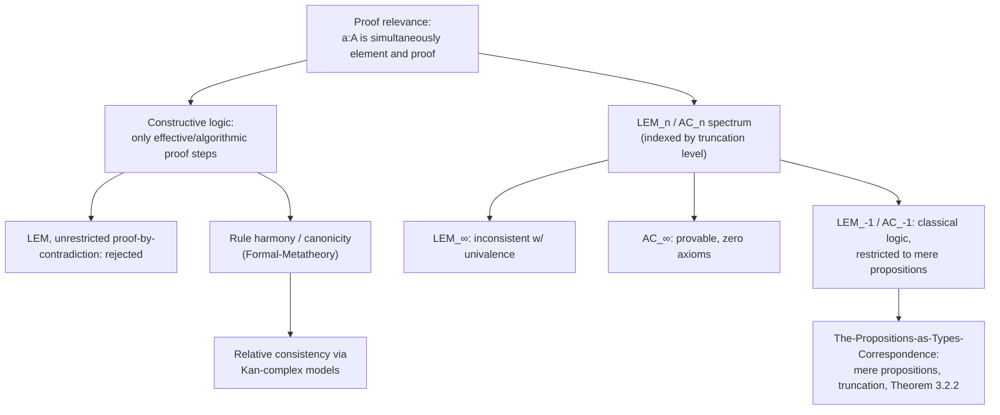

[[book-guidelines|↩ Back to guidelines]]

# Constructive Logic and Proof Relevance

## Two ideas that are easy to conflate, and shouldn't be

[[The-Propositions-as-Types-Correspondence]] already laid out the mechanics: connectives become type formers, quantifiers become $\Pi$/$\Sigma$, and Chapter 3 eventually restricts to *mere propositions* to recover classical reasoning safely. This article steps back one level, to two ideas the book treats as logically prior to all of that machinery, and which are worth pulling apart explicitly because they're easy to blur together:

- **Proof relevance** is a claim about what *kind of object* a proof is: not a yes/no verdict external to the mathematics, but a first-class mathematical object, exactly on par with numbers or groups, that you can compute with, compare, and — critically — *recover information from*.
- **Constructive logic** is a claim about what counts as a *valid proof step*: only those that could, in principle, be carried out algorithmically, which is why it rejects the law of excluded middle (LEM) and the axiom of choice (AC) in their unrestricted form.

These are related but independent. Proof-relevance is what makes constructivity *automatic* rather than a separately-imposed restriction — you get constructive logic "for free" the moment you commit to proofs-as-data, without ever writing down an intuitionistic proof calculus by hand. Seeing exactly why that implication holds, and exactly where it stops holding, is the content of this topic.

## Proof relevance: proofs as data, not verdicts

The book's Introduction states the core move in one sentence: in type theory, mathematical statements *and their proofs* become first-class mathematical objects. A term $a : A$ is simultaneously "$a$ is an element of type $A$" and "$a$ is a proof of proposition $A$" — the same judgment, read two ways, with no translation step between them.

The book's own illustration is worth sitting with because it shows the payoff isn't cosmetic. Consider "$A$ is isomorphic to $B$" for sets $A, B$:

$$\mathrm{Iso}(A,B) :\equiv \sum_{(f:A\to B)}\sum_{(g:B\to A)} \Big(\prod_{(x:A)} g(f(x))=x\Big) \times \Big(\prod_{(y:B)} f(g(y))=y\Big)$$

Read the $\Sigma$s and $\Pi$s and $\times$ as "there exists," "for all," and "and," and you get exactly the standard logical statement "$A$ and $B$ are isomorphic." Read them instead as sum and product types, and you get *the type of all isomorphisms between $A$ and $B$* — actual functions, actual witnesses, actual data. **These are not two different things that happen to look alike; they are the same type, under two names.** To prove the proposition is, mechanically, to construct the data: you don't get to assert "an isomorphism exists" without in the same breath having built one. This is what "proving a proposition is the same as constructing an element of some particular type" means, stated as plainly as the book ever states it.

**Rust/Lean framing.** This is the difference between a function returning `bool` and a function returning a witness type. `fn is_isomorphic(a: A, b: B) -> bool` discards everything except a verdict — even if the implementation *internally* builds an isomorphism to decide the answer, that isomorphism is gone the moment the function returns. `fn find_isomorphism(a: A, b: B) -> Option<Iso<A,B>>`, by contrast, hands the caller the actual pair of functions and their inverse-witnesses — proof-relevant, in exactly the book's sense. Lean's `Prop`-vs-`Type` distinction (taken up properly by [[The-Propositions-as-Types-Correspondence]] via mere propositions) is the disciplined version of choosing, deliberately, which of these two shapes a given statement should have — but the *default*, undecorated propositions-as-types reading is always the data-carrying one, `Type`, not `Prop`.

### The concrete consequence: `Or` remembers which side, `Exists` remembers the witness

Two structural facts fall directly out of proof-relevance, stated explicitly by the book at the close of §1.11:

- If you have $p : A + B$ — a proof of "$A$ or $B$" — you *know which disjunct held*: $p$ is either $\mathrm{inl}(a)$ for some $a:A$ or $\mathrm{inr}(b)$ for some $b:B$, and the coproduct's induction principle can case-split on which. Classical logic's "$A$ or $B$" carries no such information — the disjunction is true, full stop, with no residue of *why*.
- If you have $p : \sum_{(x:A)} P(x)$ — a proof of "there exists $x:A$ such that $P(x)$" — you *know a specific witness*: $\mathrm{pr}_1(p)$ hands it to you directly. Classical existence proofs (e.g. non-constructive ones via contradiction) assert existence without producing anything you could extract a witness from.

### Where proof-relevance silently costs you something: "N iff 1" versus "N equivalent to 1"

The book closes §1.11 with a small example that's easy to skip past but is exactly the right place to see proof-relevance's boundary. It's easy to prove "$\mathbb{N}$ if and only if $\mathbf{1}$" — meaning $(\mathbb{N}\to\mathbf{1})\times(\mathbf{1}\to\mathbb{N})$ is inhabited (trivially: the constant map one way, the constant-zero map the other). But $\mathbb{N}$ and $\mathbf{1}$ are obviously *not* the same type — one is infinite, one has a single element. **Logical equivalence** ("if and only if," a statement about the *propositions*, treating both $\mathbb{N}$ and $\mathbf{1}$ as merely-true propositions) and **type equivalence** (a statement about the actual *data*, requiring an honest isomorphism) genuinely diverge here. This is the precise reason Chapter 3 has to introduce mere propositions at all: for a *mere* proposition, logical equivalence and type equivalence provably coincide (Lemma 3.3.3, worked out in [[The-Propositions-as-Types-Correspondence#Mere propositions: the $(-1)$-truncated fix|the sibling article]]), but for a general, proof-relevant type they do not — and knowing which regime you're in ($\mathbb{N}$-like, data-carrying, or $\mathbf{1}$-like, evidence-only) is exactly the judgment call your compiler has to make every time it decides whether a piece of derived information should be a `Prop`-style mere proposition or a genuine, inspectable `Type`.

## Constructive logic: what "effective" actually requires

The book is explicit about the philosophical content, not just the formal restriction: constructive logic "confines itself to constructions that can be carried out effectively" — informally, there must be *some algorithm*, step by step, for producing the object in question (a proof of a theorem being the special case where the "object" is a witness of truth). Two concrete casualties follow directly from this:

- **The law of excluded middle** ($A + \neg A$, for arbitrary $A$) fails to hold in general, because there is no effective procedure that decides, for an arbitrary proposition, whether it's true or false — LEM asserts a disjunction *without* telling you which side, and effectiveness demands exactly the thing LEM refuses to supply.
- **Proof by contradiction in its strong form** — assume $\neg A$, derive absurdity, conclude $A$ — is disallowed, while the *weak* form — assume $A$, derive absurdity, conclude $\neg A$ — remains perfectly valid (it's just the meaning of $\neg A :\equiv A \to \mathbf{0}$, an ordinary function). The book stresses this distinction because it's the single most common point of confusion for a reader arriving from classical mathematics: constructive logic doesn't ban "proof by contradiction" wholesale, only the direction that would let you manufacture a witness of $A$ out of nothing but the absurdity of its negation. From $\neg\neg A$ you get only $\neg\neg A$ — there is, provably, no general route back down to $A$.

The de Morgan law worked out in §1.11 makes the boundary concrete: "if not $A$ and not $B$, then not ($A$ or $B$)" is provable — it's a direct case-split, purely constructive, and [[The-Propositions-as-Types-Correspondence#Worked example: a de Morgan law, term by term|the sibling article walks the full term derivation]]. But "if not ($A$ and $B$), then (not $A$) or (not $B$)" is **not** provable — you'd need to already know which of $A$ or $B$ fails, which is exactly a LEM-shaped question, and there's no algorithm for deciding it in general.

**Why constructivity matters beyond philosophical purity.** The book is direct about this: constructive proofs carry intrinsic computational content — "every proof that something exists carries with it enough information to actually find such an object; and every proof that '$A$ or $B$' holds is either a proof that $A$ holds or a proof that $B$ holds. Thus, from every proof we can automatically extract an algorithm." This is precisely why type theory doubles as a programming language, and why a proof assistant's kernel and a compiler's type checker can be the same code path, per [[The-Propositions-as-Types-Correspondence]]'s framing — the extractability isn't a bonus feature bolted onto a separately-designed logic, it's a structural consequence of insisting every proof step be effective in the first place.

## The LEM$_n$/AC$_n$ spectrum: constructive and classical as two ends of one dial

This is the piece of the Introduction that doesn't appear in the sibling article, and it's the sharpest formal statement of "constructive vs. classical" the book gives. Because HoTT stratifies all types by homotopy level ($n$-types, from $(-2)$ up through $\infty$), LEM and AC aren't a binary choice — they come in an **indexed family**, one instance per truncation level:

$$\mathrm{LEM}_n :\equiv \prod_{(A:\mathcal{U})} \big(\mathrm{is}\text{-}n\text{-}\mathrm{type}(A) \to (A + \neg A)\big) \qquad \mathrm{AC}_n \text{ (analogously indexed)}$$

The two extremes are the ones you'd expect from everything discussed above:

- $\mathrm{LEM}_\infty$ — LEM with *no* truncation restriction, applied to arbitrary types — is **inconsistent** with univalence (the same naturality-under-automorphisms obstruction that [[The-Propositions-as-Types-Correspondence#The crack: why proof-relevance breaks classical reasoning|the sibling article proves formally via Theorem 3.2.2]]).
- $\mathrm{AC}_\infty$, by contrast, is **provable outright**, with zero axioms — the pure propositions-as-types reading of "there exists" is strong enough that choice is just projection, no assumption required (worked out concretely in the sibling article's "axiom of choice, both ways" section).
- $\mathrm{LEM}_{-1}$ and $\mathrm{AC}_{-1}$ — restricted to mere propositions, the $(-1)$-types — are exactly the classical LEM and AC familiar to a classically-trained mathematician, and are the versions the book means whenever it drops the subscript.

Between these extremes sits "an infinite number of possibilities" — systems where classical principles hold only for types up to some intermediate homotopy level, and remain genuinely constructive above it. **The philosophical upshot the book wants you to take away: constructive and classical logic are not two incompatible worldviews requiring you to pick a side — they are two named points on a continuous spectrum indexed by how much homotopical information you're willing to truncate away**, and homotopy type theory is expressive enough to state, and work in, any point on that spectrum simultaneously, even mixing them (some types classical, others left constructive) within a single development.

## Why the book still tells you to avoid LEM/AC when you can

Univalent foundations does not *require* constructive reasoning — you can assume $\mathrm{LEM}_{-1}$ and $\mathrm{AC}_{-1}$ and get ordinary classical mathematics back, no different in practice from ZFC. But the book gives two concrete, non-philosophical reasons to avoid them when unnecessary, both of which transfer directly to a compiler/verifier design:

1. **Model generality.** A theorem proved without LEM/AC is valid in every model where those principles might fail — sheaf toposes, higher toposes — not just the "standard" one. A proof avoiding unnecessary axioms is a strictly more general theorem, in exactly the sense a soundness proof that avoids unnecessary hypotheses applies to more implementations.
2. **Computability.** Type theory is simultaneously a foundation for mathematics *and* a theory of computation, and its rules must maintain **harmony** — enough coherence between introduction and elimination rules that every proof can be "executed" as a program (this is the same harmony discipline [[Formal-Metatheory]] formalizes as the formation/introduction/elimination/computation rule template). LEM and AC are "fundamentally antithetical to computability" precisely because they assert existence with no attached way to compute the witness — admitting them unrestrictedly breaks the property that every well-typed closed term reduces to something concrete (canonicity, again per [[Formal-Metatheory]]).

The book backs this with four concrete cases (referenced forward to later chapters) where avoiding LEM/AC isn't just principled but *actively simplifies the mathematics*: (i) transfinite constructions in homotopy/category theory, classically requiring AC, become direct and constructive via [[Higher-Inductive-Types|higher inductive types]] (Chapter 8's [[Synthetic-Homotopy-Theory]] needs neither); (ii) "every fully faithful, essentially surjective functor is an equivalence of categories" — classically equivalent to AC — becomes *just true* under univalence, no axiom needed ([[Univalent-Category-Theory]]); (iii) cardinal and ordinal numbers, which classically need choice or foundation to get canonical representatives, fall out directly from truncating the universe ([[Sets-in-Univalent-Foundations]]); (iv) the classical definition of real numbers via Cauchy-sequence equivalence classes needs LEM or countable choice to behave well, but a higher-inductive-inductive reformulation avoids both ([[Real-Numbers-and-Analysis]]). In each case the book is careful to note the constructive version has independent advantages regardless of whether you ultimately care about constructivity itself — "constructivity, if attained, will be an added bonus," not the point of the exercise.

**Directly load-bearing for your project.** This is the precise design question you face every time your refinement-type compiler's constraint solver or abstract interpreter needs to assert "a fixpoint/model/invariant exists" — SAT/SMT solving, Craig interpolation, invariant generation via abstract interpretation are all, structurally, existence claims. The LEM$_n$/AC$_n$ framing gives you the right vocabulary for what you're actually doing when you accept a solver's verdict: are you working at a truncation level where the existence claim is *proof-irrelevant* (a mere proposition — "SAT," yes/no, with the witness discardable once checked), or do you need the *witness itself* preserved for downstream use (the satisfying assignment, the interpolant, the concrete invariant — proof-relevant, $\Sigma$-shaped data)? Getting this distinction wrong in either direction either throws away information your elaborator needed, or forces you to carry proof-relevant baggage through parts of the pipeline that only ever needed a yes/no answer.

## Consistency: what grounds all of this

The Introduction closes the Constructivity discussion by addressing the obvious worry: adding univalence, higher inductive types, and (optionally) LEM/AC on top of a base type theory — does the resulting system stay consistent? The answer given is **relative, semantic consistency**: every construction and axiom in the book has a model in the category of Kan complexes (Voevodsky, for univalence; Lumsdaine–Shulman, for higher inductive types), which makes the whole system consistent relative to ZFC (with enough inaccessible cardinals to support nested univalent universes). This is the *semantic* route flagged in [[Formal-Metatheory]] as the fallback once the *syntactic* canonicity argument breaks under axioms with no computation rule — the same tradeoff surfaces here from the logic side rather than the metatheory side: you can have unrestricted classical existence, but you pay for it by dropping out of the syntactic, purely-rule-derived consistency proof and into a model-theoretic one instead.

## Where this leads

This topic is the conceptual root that [[The-Propositions-as-Types-Correspondence]] builds its formal machinery on top of: mere propositions, propositional truncation, and the truncated axiom of choice are all *engineering responses* to the tension identified here — proof-relevance gives you a powerful, computational logic for free, but that same power is exactly what makes unrestricted classical reasoning inconsistent with univalence, forcing the $(-1)$-truncation machinery as the disciplined way to recover it. For the compiler project, this topic is where the vocabulary comes from: every time you decide whether some piece of your elaborator's output should be a discardable verdict or a data-carrying witness, you are choosing a point on the LEM$_n$/AC$_n$ spectrum, whether or not you name it that way.
