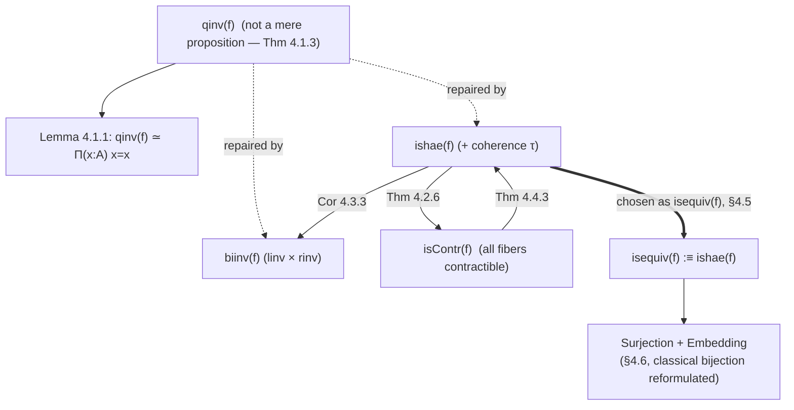

# Equivalences and Their Characterizations

[[book-guidelines|↩ Back to guidelines]]

## The problem: "equivalence" needs to be a proposition, and the obvious definition isn't

Chapter 2 needed a notion of "$A$ and $B$ are the same type" to even *state* the [[Formal-Metatheory#Univalence|univalence]] axiom — $(A =_{\mathcal U} B) \simeq (A \simeq B)$ makes no sense until $\simeq$ means something. The obvious candidate, introduced there provisionally, is: $f : A \to B$ is an equivalence if it has a **quasi-inverse**, i.e. a function going back the other way that cancels $f$ on both sides. That's the everyday mathematical meaning of "invertible," and it's the right *idea*. This article is about why the *literal formalization* of that idea is broken, and what the book replaces it with.

Here's the shape of the requirement, stated up front (the book restates it at the top of Chapter 4, and it's worth keeping visible throughout): whatever type $\mathrm{isequiv}(f)$ ends up meaning, it has to satisfy three properties simultaneously:

1. $\mathrm{qinv}(f) \to \mathrm{isequiv}(f)$ — anything that's quasi-invertible counts as an equivalence,
2. $\mathrm{isequiv}(f) \to \mathrm{qinv}(f)$ — anything that's an equivalence has an actual quasi-inverse you can extract,
3. $\mathrm{isequiv}(f)$ is a **mere proposition** — for any fixed $f$, there is at most one way to inhabit $\mathrm{isequiv}(f)$; being-an-equivalence is a *property* $f$ either has or doesn't, not extra data attached to it.

The tension is entirely in property (3). Properties (1) and (2) say $\mathrm{isequiv}(f)$ has to be logically equivalent to $\mathrm{qinv}(f)$. Property (3) says it can't just *be* $\mathrm{qinv}(f)$ — because, as this chapter proves with an explicit counterexample, $\mathrm{qinv}(f)$ itself is not a mere proposition. You need a type that's logically equivalent to $\mathrm{qinv}(f)$ but *better behaved* than it. Chapter 4 builds three different such types — half adjoint equivalences, bi-invertible maps, and contractible maps — proves each one works, proves they're all equivalent to each other, and then picks one as the official definition.

**What breaks without this move.** If you used $\mathrm{isequiv}(f) :\equiv \mathrm{qinv}(f)$ as the definition baked into $A \simeq B :\equiv \sum_{f:A\to B}\mathrm{qinv}(f)$, then univalence would be transporting not just "$A$ and $B$ are equivalent" but a specific, possibly-non-unique *witness* of how, along an identity of universes — and worse, a path $p : A = B$ would carry strictly more information than "some" equivalence, because different (but propositionally equal as functions) quasi-inverse packages would give genuinely different elements of the total quasi-inverse type. The clean statement "$A = B$ is the same thing as $A$ and $B$ being equivalent" needs "equivalent" to mean something *canonical* — one bit of information (yes, equivalent) plus one witness, not a witness-with-redundant-extra-structure. Mere-propositionhood is what makes $\simeq$ behave like the intuitive, size-one notion of "these are interchangeable" rather than a graph of interconnections.

## Why quasi-inverses fail

### The bare definition

Recall $\mathrm{qinv}(f)$, spelled out in full:
$$\mathrm{qinv}(f) :\equiv \sum_{g:B\to A} (f\circ g \sim \mathrm{id}_B)\times(g\circ f\sim \mathrm{id}_A).$$
An inhabitant is a triple $(g,\epsilon,\eta)$: a function $g$ going back, a homotopy $\epsilon$ witnessing $f\circ g \sim \mathrm{id}_B$, and a homotopy $\eta$ witnessing $g\circ f \sim \mathrm{id}_A$. (By [[Formal-Metatheory#Function extensionality|function extensionality]] this is equivalent to the version with $=$ instead of $\sim$; the book moves freely between the two.)

At first glance this looks exactly like "invertible" should look — three pieces of evidence, no more, no less. The problem only shows up once you ask: *given that $f$ is an equivalence, how much redundancy is sitting inside $\mathrm{qinv}(f)$?*

### Lemma 4.1.1: quasi-inverses collapse to a loop space

The book's first move is to show that if $f$ is already known to have *some* quasi-inverse, the whole type $\mathrm{qinv}(f)$ is equivalent to something much smaller — and much more suspicious:
$$\mathrm{qinv}(f) \simeq \prod_{x:A}(x=x).$$

The proof is a clean illustration of the "reduce to the identity function via univalence" trick that recurs constantly in this book. Since $f$ is an equivalence, $(f,e) : A\simeq B$ for some $e$, and by univalence this pair is $\mathrm{idtoeqv}(p)$ for some path $p : A=B$. Path induction lets you assume $p$ is $\mathrm{refl}_A$, which forces $f$ to literally be $\mathrm{id}_A$ — so it suffices to compute $\mathrm{qinv}(\mathrm{id}_A)$. Unwinding definitions and applying function extensionality twice, $\mathrm{qinv}(\mathrm{id}_A)$ turns out to be (up to equivalence) the type of pairs $(h, p)$ where $h : A \to A$ is equal to $\mathrm{id}_A$ *twice over*, and by Lemma 3.11.9 (paths out of a contractible type's center are equivalent to paths between its endpoints), this collapses to $\mathrm{id}_A = \mathrm{id}_A$, which by function extensionality again is $\prod_{x:A}(x=x)$.

Read this the way the book intends: two out of the three data in $(g,\epsilon,\eta)$ — the function $g$ and one of the two homotopies — are, once you know $f$ is invertible at all, *contractible choices*: essentially forced, no real freedom. All the actual "wiggle room" left in $\mathrm{qinv}(f)$ collapses into a single leftover piece of data, a self-map of $\prod_{x:A}(x=x)$: for every point of $A$, a specific way of looping back to itself.

### Theorem 4.1.3: an explicit counterexample

$\prod_{x:A}(x=x)$ being nontrivial is exactly the failure mode the book needs, because that type is (thinking of $A$ as a higher groupoid) the type of natural transformations from the identity functor to itself — the **center** of $A$, in the same sense that the center of a group is the subgroup of elements commuting with everything. If $A$, viewed as a one-object groupoid, is a nontrivial abelian group, its center is the whole group — which can certainly have more than one element.

The book builds exactly this: $X :\equiv \sum_{A:\mathcal U}\lVert \mathbf 2 = A\rVert$ (types merely equal to the booleans — this is the same construction used in §3.8 to build a non-split surjection), a basepoint $a :\equiv (\mathbf 2, |\mathrm{refl}_{\mathbf 2}|)$, and shows $a = a$ is equivalent to $\mathbf 2\simeq \mathbf 2$, a *set* with two elements: the identity equivalence and the "swap" equivalence $e$ sending $0_{\mathbf 2}\leftrightarrow 1_{\mathbf 2}$. Lemma 4.1.2 — a genuinely delicate piece of propositional-truncation bookkeeping, gluing together a locally-defined function across merely-existing witnesses using the fact that swap commutes with itself — then produces an actual $f : \prod_{x:X}(x=x)$ with $f(a) = q$, the path corresponding to $e$. Since $e \neq \mathrm{id}_{\mathbf 2}$, this $f$ is a genuinely different loop-assignment than the trivial one $\lambda x.\mathrm{refl}_x$.

Conclusion: $\prod_{x:X}(x=x)$ has at least two distinct elements, so by Lemma 4.1.1, $\mathrm{qinv}(\mathrm{id}_X)$ has at least two distinct elements. **The identity function on $X$ — which is unambiguously an equivalence — has more than one "proof" of quasi-invertibility.** $\mathrm{qinv}(f)$ is not a mere proposition, full stop, and the book notes the pattern generalizes: any Eilenberg–Mac Lane space $K(G,1)$ for nontrivial abelian $G$ gives another counterexample, and (once the circle is constructed in Chapter 6) $S^1 = K(\mathbb Z,1)$ is the easiest one to picture — a loop space with $\pi_1 = \mathbb Z$ has infinitely many distinct self-loops at every point, hence infinitely many distinct "quasi-inverses" of the identity map.

**[[Homotopical-Interpretation-of-Type-Theory#Grounding|Grounding]] — why this matters for anything that checks "are these the same":** think of $\mathrm{qinv}(f)$ as *evidence* your elaborator's unifier would carry around after solving "is $f$ invertible?" If that evidence type isn't provably a singleton, you have no principled way to say two derivations of invertibility are "the same solution" — you'd need to separately track and compare *which* quasi-inverse witness you have, which is exactly the kind of proof-irrelevance failure that makes definitional equality checking (`isDefEq`-style) intractable: you want "is an equivalence" to collapse to a boolean-shaped fact the kernel can check once and cache, not an open-ended space of alternative proofs it has to keep distinguishing.

## Fix #1: half adjoint equivalences

### Diagnosing exactly what to cut

Lemma 4.1.1's proof is also a diagnosis: of the three data $(g,\eta,\epsilon)$ in $\mathrm{qinv}(f)$, two ($g$ and $\eta$) are jointly contractible once $f$ is known invertible — but *removing* them (i.e. quantifying them away via $\Sigma$-contractibility) leaves the third ($\epsilon$) as genuinely free data, and that's exactly where the nontriviality of $\prod_x (x=x)$ leaks in. The fix: don't remove $\epsilon$. Instead, pin it down by adding **one further coherence datum** relating it to the other two — a datum which, together with $\epsilon$, itself forms a contractible type once more.

**Definition 4.2.1.** $f:A\to B$ is a **half adjoint equivalence** if there exist $g:B\to A$, $\eta: g\circ f\sim \mathrm{id}_A$, $\epsilon: f\circ g\sim\mathrm{id}_B$, and additionally a homotopy
$$\tau : \prod_{x:A} f(\eta_x) = \epsilon_{f(x)}$$
tying the two homotopies together through $f$. The resulting type is
$$\mathrm{ishae}(f) :\equiv \sum_{g:B\to A}\sum_{\eta:g\circ f\sim \mathrm{id}_A}\sum_{\epsilon:f\circ g\sim \mathrm{id}_B}\prod_{x:A} f(\eta_x)=\epsilon_{f(x)}.$$

The name "half adjoint" comes from category theory: this is exactly the triangle-identity data of an adjoint equivalence, but only *one* of the two triangle identities (there's a symmetric version $\tau' : \prod_y g(\epsilon_y) = \eta_{gy}$ using $g$ instead of $f$, and Lemma 4.2.2 proves the two conditions are logically equivalent — but critically, the book does *not* include both in the definition). Forgetting $\tau$ recovers $\mathrm{qinv}(f)$ immediately, so $\mathrm{ishae}(f)\to\mathrm{qinv}(f)$ is free. The real content, and the reason this whole apparatus exists, is the converse direction and the mere-propositionhood proof.

**What breaks if you add both $\tau$ and $\tau'$.** The book flags this explicitly: doing so leaves one more piece of leftover, uncanceled data — you'd need yet another coherence condition to soak it up, and so on forever. The rule of thumb stated here (and load-bearing for the rest of the book's higher-coherence arguments) is: *you get a well-behaved type by cutting off after an odd number of coherences.* One homotopy each way plus one triangle identity is the minimal odd-numbered stopping point.

### The engine: fibers are contractible

Everything downstream — the mere-propositionhood of $\mathrm{ishae}$, and the entire "contractible fibers" characterization in §4.4 — runs through one central object, the **fiber**:
$$\mathrm{fib}_f(y) :\equiv \sum_{x:A}(f(x)=y).$$
This is the type-theoretic incarnation of the topologist's "preimage," except proof-relevant: an element isn't just "some $x$ with $f(x)=y$," it's a specific $x$ *bundled with a specific witness* that $f(x)=y$. Paths in a fiber have a clean characterization (Lemma 4.2.5, following from the path lemmas for $\Sigma$-types in §2.7):
$$(x,p)=(x',p') \;\simeq\; \sum_{\gamma:x=x'} f(\gamma)\cdot p' = p.$$

**Theorem 4.2.6.** If $f$ is a half adjoint equivalence, every fiber $\mathrm{fib}_f(y)$ is contractible.

The proof is a small gem: take $(gy,\epsilon_y)$ as the center of contraction, and for any other $(x,p)$ in the fiber, build the connecting path using $\gamma :\equiv g(p)^{-1}\cdot\eta_x$ — precisely the kind of path you can only assemble because $\tau$ is available to make the two sides of the required equation ($f(\gamma)\cdot p = \epsilon_y$) actually meet. Take away $\tau$ and this proof has a hole in it exactly where the counterexample from §4.1 would live.

From here, the book builds up the mere-propositionhood proof of $\mathrm{ishae}(f)$ almost mechanically:

- $\mathrm{linv}(f) :\equiv \sum_{g:B\to A}(g\circ f\sim \mathrm{id}_A)$ and $\mathrm{rinv}(f) :\equiv \sum_{g:B\to A}(f\circ g\sim \mathrm{id}_B)$ (left- and right-inverse data separately) are each equivalent to a fiber of the pre-/post-composition maps $(-\circ f)$ and $(f\circ -)$ — and those composition maps are themselves shown to have quasi-inverses whenever $f$ does (Lemma 4.2.8), hence (by the theorem just proved, applied one level up) contractible fibers, hence $\mathrm{linv}(f)$ and $\mathrm{rinv}(f)$ are **contractible** (Lemma 4.2.9) whenever $f$ has a quasi-inverse at all.
- The remaining coherence data ($\tau$, sitting on top of a chosen right inverse) is *also* shown contractible (Lemma 4.2.12), again by relating it to a path space inside an already-contractible fiber.
- Chaining these via associativity of $\Sigma$ (the same "peel off a contractible layer" move used throughout Chapter 3 for mere propositions) gives **Theorem 4.2.13: $\mathrm{ishae}(f)$ is a mere proposition**, whenever $f$ actually is one.

So $\mathrm{ishae}$ clears all three bars: it's logically equivalent to $\mathrm{qinv}$ (Theorem 4.2.3 constructs the missing direction $\mathrm{qinv}(f)\to\mathrm{ishae}(f)$ by explicitly repairing a plain quasi-inverse's $\epsilon$ into a coherent $\epsilon'$ using a naturality square), and it's provably a mere proposition. Problem solved — but at a cost: the definition now carries a 2-dimensional path ($\tau$) as first-class data, which is exactly the kind of "Greek-letter soup" that's easy to write down and hard to hold in your head.

## Fix #2: bi-invertible maps

The second fix takes the opposite tack: instead of adding higher coherence, add *more separated low-dimensional data*.

**Definition 4.3.1.** $f:A\to B$ is **bi-invertible** if it has a left inverse *and* a right inverse, independently:
$$\mathrm{biinv}(f) :\equiv \mathrm{linv}(f)\times \mathrm{rinv}(f).$$

This is, verbatim, the definition of equivalence the book used provisionally back in §2.4, now given a name. Logical equivalence with $\mathrm{qinv}(f)$ is elementary algebra (a two-sided inverse gives you both a left and a right inverse trivially; and if $g$ is a left inverse and $h$ is a right inverse of $f$, the standard "$g = g\circ(f\circ h) = (g\circ f)\circ h = h$" argument shows $g$ and $h$ agree up to homotopy, so either one serves as a genuine two-sided quasi-inverse). Mere-propositionhood (Theorem 4.3.2) is now free: given that $f$ is bi-invertible, it has a quasi-inverse, so by Lemma 4.2.9 (proved above) *both* $\mathrm{linv}(f)$ and $\mathrm{rinv}(f)$ are separately contractible, and a product of contractible types is contractible.

Notice the family resemblance to $\mathrm{ishae}$: both definitions take the "combine $g$ and one homotopy into a contractible chunk, then add one more datum that pairs with the leftover homotopy to form another contractible chunk" recipe from Lemma 4.1.1's diagnosis. The difference is *where* the extra datum lives: $\mathrm{ishae}$ adds a 2-dimensional path ($\tau$) sitting above the existing homotopies; $\mathrm{biinv}$ instead adds a whole second 0-dimensional function (an independent right inverse) sitting alongside them. Higher-dimensional coherence versus more separated low-dimensional structure — two different currencies for paying the same debt.

**Corollary 4.3.3.** $\mathrm{biinv}(f)\simeq \mathrm{ishae}(f)$ — immediate once you know $\mathrm{biinv}(f)\to\mathrm{qinv}(f)\to\mathrm{ishae}(f)$ and back, and both sides are mere propositions (so, per Lemma 3.3.3 from Chapter 3, logical equivalence between two mere propositions upgrades automatically to a full type equivalence).

$\mathrm{biinv}$'s selling point is *practical*, not conceptual: no 2-dimensional paths, and its two "halves" (left-invertibility, right-invertibility) can be established completely independently of each other, which the book notes is often the easier proof strategy in practice even though $\mathrm{ishae}$ is the more informative package to *have* once proved.

## Fix #3: contractible fibers as the definition

The proof of Theorem 4.2.6 already revealed the real invariant underneath both $\mathrm{ishae}$ and $\mathrm{biinv}$: fibers being contractible. The book's third fix promotes that observation to a definition in its own right.

**Definition 4.4.1.** $f:A\to B$ is **contractible** (as a map) if every fiber is a contractible *type*:
$$\mathrm{isContr}(f) :\equiv \prod_{y:B}\mathrm{isContr}(\mathrm{fib}_f(y)).$$

This is a small but conceptually important terminology overload, flagged explicitly by the book: "contractible" said of a *type* (§3.11) means it has a center and every point is connected to it; said of a *map*, it means every one of its (homotopy) fibers, individually, is a contractible type. This is exactly the standard homotopy-theoretic convention of lifting a property of types to a property of maps by quantifying over fibers — the same move that later gives "$n$-truncated map," "$n$-connected map," and so on in Chapters 7–11. As a sanity check, a type $A$ is contractible exactly when the unique map $A\to\mathbf 1$ is a contractible map — the "map" notion strictly generalizes the "type" notion.

Theorem 4.2.6 already gives $\mathrm{ishae}(f)\to\mathrm{isContr}(f)$. The converse (**Theorem 4.4.3**) is a genuinely constructive recipe, and it's worth internalizing because it's the cleanest illustration in the chapter of "extracting a function from contractibility": given $P:\mathrm{isContr}(f)$, define $g(y)$ to be the first component of the center of contraction of $\mathrm{fib}_f(y)$ — literally, "the point $\mathrm{fib}_f(y)$ contracts onto, projected down to its $A$-coordinate" — and $\epsilon(y)$ the accompanying witness that $f(g(y))=y$. Since every fiber is contractible, in particular $\mathrm{fib}_f(f(x))$ is, which hands you (uniquely up to the contraction) exactly the path needed to supply $\eta$ and the coherence $\tau$ in one stroke.

$\mathrm{isContr}(f)$ is a mere proposition essentially by definition (Lemma 4.4.4: it's a product of mere propositions, since contractibility of a fixed type is itself always a mere proposition — Lemma 3.11.4 from Chapter 3), so **Theorem 4.4.5** closes the loop:
$$\mathrm{isContr}(f) \;\simeq\; \mathrm{ishae}(f) \;\simeq\; \mathrm{biinv}(f).$$

All three notions are pairwise equivalent, all three satisfy the three desiderata from the opening of the chapter, and (§4.5) the book simply *picks one* as canonical:
$$\mathrm{isequiv}(f) :\equiv \mathrm{ishae}(f),$$
chosen because it carries the most directly useful data for formalization (you get an actual inverse function and coherent homotopies out of it immediately), while noting $\mathrm{biinv}(f)$ is often more convenient to *establish* in practice, precisely because its two halves decompose. This is a genuinely pragmatic choice among three formally interchangeable options — the book is explicit that for its purposes "the specific choice will make little difference," which is itself worth noticing as a design principle: once you've proven three characterizations pairwise equivalent *and* each individually a mere proposition, you've earned the right to stop caring which one you literally wrote down, and go back to just saying "equivalence."

One immediate practical payoff of having the contractible-fibers definition available (**Corollary 4.4.6**): if $B\to\mathrm{isequiv}(f)$ — i.e., merely knowing $B$ is inhabited already implies $f$ is an equivalence — then $f$ actually *is* an equivalence, full stop, with no further hypothesis needed. You get to *assume* the codomain is nonempty while proving invertibility, which is a freedom none of the other formulations makes so immediately available.

**Grounding — Lean's `Equiv` and why "which definition" is a real engineering choice, not just an aesthetic one.** Lean's mathlib defines structural equivalences (`Equiv`, often written `≃`) essentially as bi-invertible-flavored data — a forward map, a backward map, and two separate proofs `left_inv`/`right_inv` that the round-trips are `id` — which is closer to $\mathrm{biinv}$ than to $\mathrm{ishae}$:

```lean
structure Equiv (α : Sort u) (β : Sort v) where
  toFun    : α → β
  invFun   : β → α
  left_inv  : Function.LeftInverse invFun toFun   -- invFun ∘ toFun = id
  right_inv : Function.RightInverse invFun toFun  -- toFun ∘ invFun = id
```

This is a live instance of exactly the choice §4.5 discusses: mathlib's `Equiv` doesn't bundle a $\tau$-style coherence, because for *doing ordinary mathematics* you almost never need it — you need "here's a map, here's its inverse, here's proof they cancel," and you separately prove `Equiv.toFun` is injective/surjective when you need that. But whenever mathlib needs to prove two equivalences are *equal as terms* (an extensionality lemma), it has to reach for essentially the same contractibility argument this section works out by hand, because raw `left_inv`/`right_inv` data (like $\mathrm{qinv}$) is *not* automatically a subsingleton without extra work — mathlib's route is showing `Equiv` is determined entirely by its underlying function via `Equiv.ext`, which does the "one side of the data is redundant" collapse this section proves abstractly.

## Surjections and embeddings: the classical decomposition, reformulated

Once equivalence has a settled definition, §4.6 checks it against the oldest characterization of "isomorphism" there is: injective-and-surjective. Because "injective" clashes with the proof-relevant setting (an injective function between non-set types can still identify points in higher-dimensional, non-trivial ways), the book renames it:

**Definition 4.6.1.**
- $f:A\to B$ is a **surjection** if for every $b:B$, $\lVert \mathrm{fib}_f(b)\rVert$ — the fiber is *merely* inhabited. Unpacked, this is exactly the classical $\forall b.\exists a. f(a)=b$, with $\exists$ read as the truncated $\Sigma$ from Chapter 3.
- $f:A\to B$ is an **embedding** if for every $x,y:A$, the action-on-paths map $\mathrm{ap}_f : (x=_A y)\to(f(x)=_B f(y))$ (from §2.2) is itself an equivalence.

Embedding is the genuinely new idea here, and it's worth sitting with why it's the *right* generalization of injectivity rather than the naive "if $f(x)=f(y)$ then $x=y$" (which, notice, would only produce a *function* $f(x)=f(y) \to x=y$, of unspecified quality — nothing stops it from losing information). Demanding that $\mathrm{ap}_f$ be a full *equivalence* says something much stronger and much more homotopically honest: not merely "equal outputs imply equal inputs," but "the *space of proofs* that $x=y$ is faithfully mirrored by the space of proofs that $f(x)=f(y)$" — an embedding doesn't just preserve the fact of equality, it preserves the entire path structure between points. For plain sets, where every identity type is automatically a mere proposition, this collapses back down to ordinary injectivity exactly — which is why the book reserves "injection"/"bijection" language specifically for the set case and uses "embedding" for the general one.

**Split vs. merely surjective — where choice bites.** The book is careful to distinguish surjectivity (merely-existing preimages) from being a **split surjection**: $\prod_{b:B}\sum_{a:A}(f(a)=b)$, i.e. an honest, computable section. A split surjection is exactly a retraction in the sense of §3.11, and being split is strictly stronger than being (merely) surjective — the axiom of choice from §3.8 is *precisely* the statement that every surjection between **sets** is split, and the book points out that under univalence this is genuinely false for surjections in general: reusing the type family $Y:X\to\mathcal U$ from Lemma 3.8.5 (merely-inhabited but not globally choosable), the first projection $\sum_{x:X}Y(x)\to X$ is a surjection with no section.

**Grounding.** This is a clean, concrete instance of a distinction that matters directly for building a proof search / unifier: "there merely exists a solution" (surjective) and "here is a total, computable procedure producing one" (split surjective) are not the same claim, and conflating them is exactly the gap between a *decidability* result and an *algorithm*. A completeness theorem for a unification procedure ("if a unifier exists, my algorithm finds one") is asserting something split-surjection-shaped; a bare existence proof of most-general-unifiers in the abstract is merely-surjection-shaped. The book's insistence on keeping these grammatically distinct (`∃` vs. `Σ`, `∥−∥` vs. bare) is the same discipline a from-scratch elaborator needs to keep "a metavariable assignment exists" separate from "here is the assignment my algorithm actually produced."

Although this section doesn't prove it outright (that's §4.6's closing remark, developed further via the closure properties in §4.7), it flags the target result plainly: $f$ is an equivalence if and only if it is both a surjection and an embedding — the type-theoretic reconstruction of "bijective = injective + surjective," now stated in a form that degrades gracefully (via mere propositions and embeddings) when $A$ and $B$ are not sets.

## Where this leads



This chapter is load-bearing in a very literal sense: every later use of "$A\simeq B$" in the book — starting immediately with the statement of univalence itself, and continuing through the object classifier (§4.8), the structure identity principle (Chapter 9), the equivalence-of-categories machinery, and the $n$-connected/$n$-truncated map hierarchy of Chapter 7 — is quietly relying on $\mathrm{isequiv}$ being a mere proposition, established here and nowhere else. Univalence's own well-behavedness (that $A=B$ really does carry exactly one bit of "are they equivalent" plus one canonical witness, not a redundant pile of alternative proofs) is inherited entirely from this chapter's work. The closure properties taken up next (§4.7 — the 2-out-of-3 property, retracts of equivalences, fiberwise-to-total-space equivalence) are all proved by the same fiber-contractibility toolkit assembled here, and the entire truncation-level hierarchy of Chapter 7 is, at bottom, a generalization of exactly the pattern seen in this chapter: contractible ($(-2)$-types) sits at the bottom, mere propositions ($(-1)$-types) one level up, and "$n$-truncated map" is defined the same way $\mathrm{isContr}(f)$ was defined here — by quantifying a type-level truncation condition over fibers.

For the standing project, the throughline is proof-irrelevance engineering, not homotopy theory for its own sake (this book stays background material, per the non-goals list, and none of the above requires taking the homotopical reading literally to be useful). The actual transferable content is the *pattern*: when a "does X hold" question naturally produces a type of witnesses that isn't automatically a mere proposition, the fix is not to wish it away but to either (a) find the minimal extra coherence datum that makes it one — the $\mathrm{ishae}$ move — or (b) find an equivalent but structurally different formulation that's a mere proposition for free — the $\mathrm{isContr}(f)$ move, which is the one that generalizes best. A kernel's `isDefEq` check and a unifier's "does this constraint have a solution" check are both, underneath, asking exactly this kind of question, and the fiber-contractibility idiom — rephrase "does a solution exist" as "is the space of solutions a single point" — is a genuinely reusable design pattern for making such checks decidable and their positive answers canonical, independent of whatever specific proof procedure discovers them.
