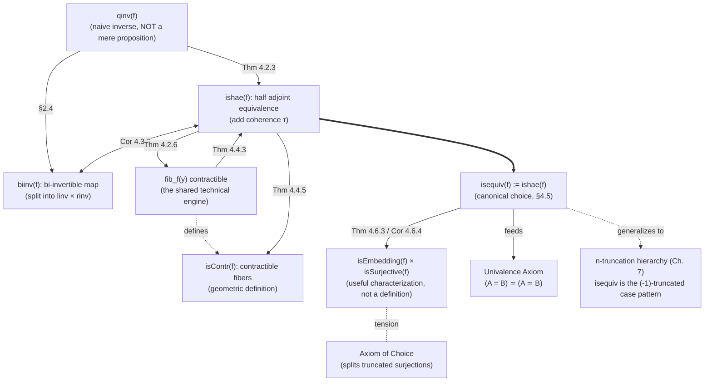

[[book-guidelines|↩ Back to guidelines]]

# Equivalences and Their Characterizations

## The problem: "has an inverse" is not the same as "is uniquely invertible"

Chapter 2 introduced a working notion of equivalence between types just well enough to state the univalence axiom. Chapter 4 goes back and does the job properly, because the naive definition turns out to be broken in a way that matters a great deal once you start doing actual proofs with it.

Here is the naive definition. A function $f : A \to B$ has a **quasi-inverse** if there is a $g : B \to A$ that undoes it in both directions:

$$
\mathrm{qinv}(f) :\equiv \sum_{g:B\to A} \big( (f \circ g \sim \mathrm{id}_B) \times (g \circ f \sim \mathrm{id}_A) \big)
$$

(Here $\sim$ is pointwise homotopy: $f \circ g \sim \mathrm{id}_B$ means $\prod_{y:B} f(g(y)) = y$.) This is exactly what a working programmer would write down instinctively for "invertible function" — a witness `g`, a proof that `f(g(y)) == y` for all `y`, and a proof that `g(f(x)) == x` for all `x`. If you were writing this in Rust as a trait, it would look like:

```rust
trait QuasiInverse<A, B> {
    fn g(&self, b: B) -> A;
    // proof obligations, informally:
    // forall b: B, f(g(b)) == b
    // forall a: A, g(f(a)) == a
}
```

The trouble is not that this definition is *wrong* — it's that the *type of evidence* `qinv(f)` is badly behaved. We want a function to "be an equivalence" in **at most one way** — i.e. we want $\mathrm{isequiv}(f)$ to be a *mere proposition* (at most one inhabitant up to equality, no extra data floating around inside the proof of invertibility). This matters practically: if "$f$ is an equivalence" carried around genuinely different proofs, then propositions built out of "there exists an equivalence $A \simeq B$" would be ambiguous about *which* equivalence witness they're talking about, and univalence — which identifies $A = B$ with $A \simeq B$ — would be identifying $A=B$ with a type that has structure, not just a truth value. The three desiderata the book sets out for any acceptable definition of `isequiv(f)` are:

$$
\text{(i) } \mathrm{qinv}(f) \to \mathrm{isequiv}(f) \qquad \text{(ii) } \mathrm{isequiv}(f) \to \mathrm{qinv}(f) \qquad \text{(iii) } \mathrm{isequiv}(f) \text{ is a mere proposition}
$$

Note [[Real-Numbers-and-Analysis#The trap|the trap]]: (i) and (ii) together say `isequiv(f)` should be **logically equivalent** to `qinv(f)` — same truth value, same information content in terms of "does an inverse exist." But (iii) additionally demands `isequiv(f)` behave like a well-behaved predicate, no more informative than "true or false." `qinv(f)` itself typically fails (iii). This is the crux of the whole chapter: to find something that carries exactly as much information as "an inverse exists" and no more.

**Why does `qinv` fail to be a mere proposition?** Concretely: if $f$ is a quasi-inverse of itself in more than one inequivalent way, then $\mathrm{qinv}(f)$ has (at least) two different inhabitants that aren't equal — like a checker holding two structurally different certificates for the same fact and being unable to tell you they're "the same proof." Lemma 4.1.1 makes this precise: if $f$ has *some* quasi-inverse (equivalently, is an equivalence), then

$$
\mathrm{qinv}(f) \simeq \prod_{x:A} (x = x)
$$

The proof leans on univalence to reduce to the case $f = \mathrm{id}_A$, then uses that $\sum_{g:A\to A}(g = \mathrm{id}_A)$ is contractible (a general fact about "based path spaces") to strip away the $g$ and $\eta$ data, leaving exactly $\mathrm{id}_A = \mathrm{id}_A$, i.e. $\prod_{x:A} x = x$ by function extensionality. Intuitively: the choice of inverse function $g$ and the proof $\eta$ that it's a left-inverse are *not* independent extra freedom — once $f$ is fixed as an equivalence, $g$ and $\eta$ together form a contractible bundle (there's essentially one canonical choice). What's left over, the proof $\epsilon$ that $g$ is also a right-inverse, is where the extra, unwanted freedom lives.

So the type $\prod_{x:A}(x=x)$ — "for every point, a self-path" — being non-trivial is exactly what makes `qinv` misbehave. Reading $A$ as a higher groupoid (objects = points, morphisms = paths), an element of $\prod_{x:A}(x=x)$ is a natural transformation from the identity functor to itself: this is precisely the algebraic notion of the **center** of a group (or groupoid) — the elements that commute with everything. Theorem 4.1.3 exhibits an actual type $X :\equiv \sum_{A:\mathcal U}\|2 =A\|$ (essentially the type $K(\mathbb Z_2, 1)$, an Eilenberg–Mac Lane space — you'll meet this family again in Chapter 8) where this center is non-trivial: there's a "twist" path $q$ (coming from the non-identity self-equivalence of the two-element type) that is genuinely different from the trivial reflexivity path. That non-triviality is a real obstruction, not a technicality — it means `qinv(id_X)` has at least two distinct proofs, so `qinv` cannot be the right definition of `isequiv`.

**What breaks without a fix:** every downstream theorem that wants to reason "let $e$ be the (unique) proof that $f$ is an equivalence" silently fails — there might be several proofs, and any construction that pattern-matches on the specific inverse/homotopy data risks depending on *which* proof you picked, which is exactly the kind of proof-irrelevance violation that makes formalized mathematics unusable. In Lean or a Coq-like kernel, this is the difference between a `Prop`-valued predicate (definitionally irrelevant, one canonical proof) and a `Type`/`Sort`-valued structure carrying genuine data — `qinv(f)` behaves like the latter when you wanted the former.

## Fix #1: Half-adjoint equivalences — add exactly one more coherence datum

The insight (§4.2) is surgical. `qinv(f)` bundles three data: $g$, $\eta : g\circ f \sim \mathrm{id}_A$, and $\epsilon: f \circ g \sim \mathrm{id}_B$. It turns out $g$ and $\eta$ together are *already* contractible once $f$ is known to be an equivalence — the badness lives entirely in the leftover $\epsilon$. Rather than removing data, the fix is to **add one more piece**: a coherence path relating $\eta$ and $\epsilon$ through $f$, so that $\epsilon$ together with this new datum becomes contractible too.

**Definition 4.2.1 (half adjoint equivalence).** $f : A \to B$ is a half adjoint equivalence if there exist $g$, $\eta : g\circ f \sim \mathrm{id}_A$, $\epsilon : f \circ g \sim \mathrm{id}_B$, and a homotopy of *paths between paths*

$$
\tau : \prod_{x:A} f(\eta_x) = \epsilon_{f(x)}
$$

$$
\mathrm{ishae}(f) :\equiv \sum_{g:B\to A}\sum_{\eta:g\circ f\sim \mathrm{id}_A}\sum_{\epsilon:f\circ g\sim \mathrm{id}_B} \prod_{x:A} f(\eta_x) = \epsilon(f(x))
$$

This is the type-theoretic transcription of the classical notion of an **adjoint equivalence** in category theory — $f$ and $g$ form a pair of adjoint functors between one-object categories where the unit and counit satisfy one triangle identity. (It's called "half" adjoint because a genuine categorical adjoint equivalence asks for *both* triangle identities — the symmetric condition $\upsilon : \prod_{y:B} g(\epsilon_y) = \eta(gy)$ — but Lemma 4.2.2 shows the two conditions are logically equivalent given the rest of the data, so imposing either one alone suffices, and imposing **both** would just reintroduce one extra unconstrained datum after cancellation. There's a real pattern here: cut off the tower of coherences after an odd number of levels and things stay well-behaved; this is the same phenomenon that eventually motivates the $n$-truncation hierarchy in Chapter 7.)

Getting from `qinv` to `ishae` is Theorem 4.2.3: given any quasi-inverse $(g,\eta,\epsilon)$, you keep $g,\eta$ as-is but must *redefine* $\epsilon$ (call it $\epsilon'$) using a specific formula built from naturality of $\epsilon$ and $\eta$, so that the required $\tau$ exists by construction:

$$
\epsilon'(b) :\equiv \epsilon(f(g(b)))^{-1} \cdot \big(f(\eta(g(b))) \cdot \epsilon(b)\big)
$$

This is a genuinely fiddly 2-dimensional path calculation (whiskering and naturality squares) — the book's proof is essentially "chase the diagram," and it's the first place in the book where you're really forced to think of paths between paths as first-class objects you compute with, not just as an abstract existence statement.

### The payoff: fibers of an equivalence are contractible

The **fiber** of $f$ over a point $y : B$ packages "the preimages of $y$, remembered together with their witnessing path":

$$
\mathrm{fib}_f(y) :\equiv \sum_{x:A} (f(x) = y)
$$

Theorem 4.2.6: if $f$ is a half adjoint equivalence, $\mathrm{fib}_f(y)$ is contractible for every $y$ — there is essentially exactly one preimage, with essentially exactly one witnessing path. This single fact is the technical engine of the entire chapter: contractibility of fibers is what lets you *prove* `ishae(f)` is itself a mere proposition (Theorem 4.2.13), by decomposing `ishae(f)` via $\Sigma$-associativity into a sum of contractible pieces (`rinv(f)` contractible by Lemma 4.2.9, and — given a right inverse — the remaining coherence datum `rcoh_f(g,ε)` contractible by Lemma 4.2.12, itself because it reduces to a path space inside the already-contractible fiber). "Contractible $\Sigma$ of contractible fibers is contractible" is the load-bearing lemma-composition pattern throughout — the same pattern you'll want when proving a bidirectional type checker's synthesized type is *unique up to definitional equality*: you show the space of valid derivations is contractible rather than merely inhabited.

```rust
// Half-adjoint equivalence as a Rust-shaped structure. The "coherence" field
// is the part that has no naive analogue in ordinary software: it is a proof
// obligation, not data you'd ever inspect at runtime, but it's what makes
// the *type* of "is-an-equivalence" evidence behave like a boolean flag
// rather than an arbitrary payload.
struct Ishae<A, B, F: Fn(A) -> B> {
    f: F,
    g: Box<dyn Fn(B) -> A>,
    eta: /* proof: forall a, g(f(a)) == a */ (),
    epsilon: /* proof: forall b, f(g(b)) == b */ (),
    tau: /* proof: forall a, f(eta(a)) == epsilon(f(a)) */ (),
}
```

In Lean's own kernel, the analogous move shows up whenever `Eq.mpr`/`rfl`-based proofs of a bijection need to be shown proof-irrelevant: Lean's `Prop` universe makes this whole problem structurally disappear for propositions (any two proofs of a `Prop` are definitionally equal), but `isequiv` here is being built as a `Type`-level structure precisely because HoTT has no separate proof-irrelevant `Prop` universe as a primitive — mere-proposition-hood has to be *proved*, not assumed by fiat. This is a genuine foundational difference worth sitting with: Lean gets propositional irrelevance for free from a stratified universe hierarchy; HoTT earns the analogous guarantee, lemma by lemma, from univalence and truncation.

## Fix #2: Bi-invertible maps — split it into two independent halves

**Definition 4.3.1.** $f$ is bi-invertible if it has a left inverse *and* a right inverse, independently:

$$
\mathrm{biinv}(f) :\equiv \mathrm{linv}(f) \times \mathrm{rinv}(f), \qquad
\mathrm{linv}(f) :\equiv \sum_{g:B\to A}(g\circ f \sim \mathrm{id}_A), \qquad
\mathrm{rinv}(f) :\equiv \sum_{g:B\to A}(f\circ g \sim \mathrm{id}_B)
$$

This is the "obvious" algebraic fact from ordinary mathematics — a function is invertible iff it has a left inverse and a right inverse (which then must agree) — reformulated so it type-checks. Crucially, `biinv(f)` does **not** need any 2-dimensional coherence path: it fixes the `qinv` problem not by adding a coherence datum (as `ishae` did) but by *decoupling* the two homotopies into separate existence statements, each of which is individually contractible once $f$ is known invertible (Lemma 4.2.9, reused here). Theorem 4.3.2 gets mere-propositionhood essentially for free: a product of two contractible types is contractible.

The two fixes are not competing hacks — they're the same phenomenon viewed from two angles, and Corollary 4.3.3 proves $\mathrm{biinv}(f) \simeq \mathrm{ishae}(f)$ (via the interderivability $\mathrm{qinv} \to \mathrm{ishae}$, $\mathrm{qinv}\to\mathrm{biinv}$, and the general fact that any two mere propositions that are logically equivalent are equivalent as types — Lemma 3.3.3). Practically: `ishae` is what you want when *constructing* proofs (it hands you the most directly usable data — a concrete inverse plus a concrete coherence witness), while `biinv` is nicer when you want to *reason about* invertibility abstractly, because its two halves (`linv`, `rinv`) can be established completely independently — no synchronization needed between them. The book picks `ishae` as the official definition of `isequiv(f)` for exactly this reason (better data for formalization), while flagging that the choice mostly doesn't matter downstream.

## Fix #3: Contractible fibers — go straight to the geometric picture

The proofs above kept leaning on "fibers of an equivalence are contractible" as a *consequence*. Section 4.4 promotes it to a **definition**:

$$
\mathrm{isContr}(f) :\equiv \prod_{y:B} \mathrm{isContr}(\mathrm{fib}_f(y))
$$

This says: $f$ is an equivalence exactly when every fiber is contractible — not just inhabited (that would be surjectivity, see below), but contractible: exactly one point up to a unique path. This is the homotopy-theorist's native definition, and it generalizes cleanly: HoTT's convention is that a map "has property P" when all of its homotopy fibers have property P, so a *type* $A$ being contractible is recovered as the special case that the unique map $A \to \mathbf 1$ is a contractible map. (From Chapter 7 on, contractible maps and types are also called $(-2)$-truncated — the base case of the truncation hierarchy.)

Theorem 4.4.3 constructs `ishae(f)` directly from `isContr(f)`: given that every fiber has a contraction center, define $g(y)$ as the first component of the center of $\mathrm{fib}_f(y)$, and $\epsilon(y)$ as its witnessing path — and then the *remaining* coherence data (η and τ) follow because they amount to a path inside an already-contractible fiber, which trivially exists. Combined with the earlier direction (Theorem 4.2.6: `ishae → isContr`), and both being mere propositions (Lemma 4.4.4, `isContr(f)`; Theorem 4.2.13, `ishae(f)`), Theorem 4.4.5 gives:

$$
\mathrm{isContr}(f) \simeq \mathrm{ishae}(f) \simeq \mathrm{biinv}(f)
$$

three pairwise-equivalent, individually-mere-propositional characterizations of "equivalence," any of which can serve as `isequiv(f)`. The book fixes $\mathrm{isequiv}(f) :\equiv \mathrm{ishae}(f)$ by convention (§4.5) — but the *content* of "being an equivalence" is now genuinely characterization-independent, which is exactly the robustness property you want out of a foundational definition.

One immediate practical payoff of the `isContr` viewpoint (Corollary 4.4.6): to prove $f$ is an equivalence, it suffices to show $B \to \mathrm{isequiv}(f)$ — i.e., you're allowed to *assume the codomain is inhabited* while proving invertibility. This kind of "assume what you're trying to produce, to prove a proposition about it" move only works because `isequiv(f)` is a mere proposition — this is the general lemma "$B \to \mathrm{isProp}(B) $ actually proves $\mathrm{isProp}(B)$" (Exercise 3.5) applied to $\mathrm{isequiv}$.

```python
# The three characterizations as three different runtime checks you *could*
# perform to convince yourself f is a bijection — none is "the" right one,
# they're extensionally interchangeable once mere-propositionhood is known.
def is_contr_fiber(f, y, domain):
    preimages = [x for x in domain if f(x) == y]
    return len(preimages) == 1          # isContr(f) reading: exactly one preimage

def has_qinv(f, g, domain, codomain):
    return (all(f(g(y)) == y for y in codomain) and
            all(g(f(x)) == x for x in domain))   # naive qinv reading
```

## Surjections and embeddings: recovering "injective and surjective" honestly

Section 4.6 asks the question a working mathematician asks immediately: in ordinary set theory, bijective = injective + surjective. Does that survive the move to general types (not just sets)?

**Definition 4.6.1.**
- $f$ is **surjective** if $\prod_{b:B} \| \mathrm{fib}_f(b) \|$ — every fiber is *merely* inhabited (propositionally truncated: "there merely exists a preimage," with no commitment to *which* one, or how many).
- $f$ is an **embedding** if $\mathrm{ap}_f : (x =_A y) \to (f(x) =_B f(y))$ is an equivalence for every $x,y : A$ — informally, $f$ doesn't just avoid collisions, it identifies the *paths between* points as faithfully as the points themselves.

The truncation in the surjectivity definition is not decorative — it is the entire point, and it's exactly the same discipline that made `isequiv` need fixing in the first place. Compare:

$$
\text{surjective: } \prod_{b:B}\big\|\mathrm{fib}_f(b)\big\| \qquad\text{vs.}\qquad \text{split surjective: } \prod_{b:B}\sum_{a:A}(f(a)=b)
$$

The untruncated ($\Sigma$) version demands a *specific, chosen* preimage-with-witness for every $b$ — that's a section of $f$, i.e. $f$ has a genuine right inverse, which the book identifies with "retraction" from §3.11. Truncating collapses "there could be many different choices of preimage, and I refuse to commit to one" down to a bare yes/no. **This is precisely where the axiom of choice lives in type theory**: AC (§3.8) says exactly that every surjection between sets *is* split — i.e., that the truncation can always be safely removed for sets. But the book is explicit that under univalence, this is not a free lunch: Lemma 3.8.5 exhibits an actual surjection (the first projection out of $\sum_{x:X} Y(x)$ for a suitable non-split family $Y$) that provably has no section. Univalence and "every surjection splits" are in genuine tension unless you're willing to assume full AC. This is worth internalizing if you're building a metatheory: **truncated existence and Σ-witnessed existence are not interchangeable**, and any place in a formal system that silently converts "we know a valid X exists" into "here is a specific X" is smuggling in a choice principle.

**Theorem 4.6.3 (the payoff): $f$ is an equivalence iff it is a surjective embedding.**
- Forward direction is easy: an equivalence has contractible (hence merely-inhabited) fibers, and Theorem 2.11.1 already showed any equivalence is an embedding.
- Backward direction is the interesting one: given surjectivity, the fiber over any $b$ is merely inhabited — truncation-eliminate to get an actual point $(x,p)$ in it (legal here because "the fiber is contractible" is itself a mere proposition, so you're allowed to destruct a truncated hypothesis when proving a further mere proposition). Given a second point $(y,q)$ in the same fiber, embedding-ness (ap$_f$ being an equivalence) supplies a path $r : x = y$ with $\mathrm{ap}_f(r) = p \cdot q^{-1}$, which after rearranging via the $\Sigma$-path characterization shows $(x,p) = (y,q)$. So the fiber is inhabited *and* any two of its points are equal — exactly `isContr`.

And since both `isSurjective` and `isEmbedding` are themselves mere propositions, Corollary 4.6.4 upgrades the "iff" to a genuine type equivalence:

$$
\mathrm{isequiv}(f) \simeq \big(\mathrm{isEmbedding}(f) \times \mathrm{isSurjective}(f)\big)
$$

with the caveat the book flags explicitly: this can't serve as *the* definition of equivalence, because "embedding" is itself defined in terms of `ap_f` being an equivalence — it's circular as a foundational definition, but it's a genuinely useful *characterization* once `isequiv` already exists (used later for the "object classifier" material in §4.8, and generalized to all $n$-types in Chapter 7). The book also drops the classically-loaded words "injective"/"bijection" for general types — reserving them for the special case where $A, B$ are sets, where embedding collapses to the familiar $\prod_{x,y}(f(x)=f(y)) \to (x=y)$ — precisely because for higher types that formula is "ill-behaved": it throws away exactly the path-level information that `ap_f`-is-an-equivalence preserves.

```lean
-- Sketch in Lean-style pseudocode. Note how truncation (‖·‖, Lean's `Nonempty`
-- or `Trunc`/`Squash`) is doing real work distinguishing the two notions —
-- this is the same distinction between "the elaborator found *a* solution to
-- this metavariable" (existence, truncated) and "here is the specific
-- unification substitution" (a witnessed Σ-type) that shows up in a
-- pattern-unification algorithm: soundness only needs the truncated
-- statement, but the algorithm itself must construct actual witnesses.
def IsSurjective (f : A → B) : Prop := ∀ b, Nonempty (Fiber f b)   -- ‖fib_f(b)‖
def IsSplitSurj  (f : A → B) : Type := ∀ b, Fiber f b              -- Σ-witnessed
def IsEmbedding  (f : A → B) : Prop := ∀ x y, IsEquiv (fun p : x = y => congrArg f p)
```

## Where this leads



This chapter is pure scaffolding for everything that follows, and it earns its density: `isequiv(f)` as defined here (via `ishae`) is exactly the type that appears on the right of $A \simeq B :\equiv \sum_{f:A\to B}\mathrm{isequiv}(f)$, which is what the univalence axiom equates with $A = B$ — the companion article "[[The-Univalence-Axiom-and-Its-Consequences|The Univalence Axiom and Its Consequences]]" builds on `isequiv(f)` as a black box being a mere proposition; that black-box property is *exactly* what this chapter spent its effort proving, not assuming. Contractibility-of-fibers is the technical idea that resurfaces as the base case of the $n$-truncation hierarchy in Chapter 7 (contractible = $(-2)$-truncated, mere propositions = $(-1)$-truncated, sets = $0$-truncated, and so on), and the "surjective + embedding" characterization is what gets reused, generalized, and made precise for higher $n$ there. It's also the technical backbone behind Chapter 9's category theory: "fully faithful and essentially surjective functors are equivalences" — the categorical analogue of this chapter's Theorem 4.6.3, proved without needing the axiom of choice.

For the elaborator/verifier project this workbench is oriented toward, the load-bearing takeaway is the **mere-proposition discipline itself**, not the HoTT-specific machinery: any time you design a judgment or a proof-object type meant to answer a yes/no question (`isEquiv`, but just as easily `HasType(Γ, e, τ)` in a bidirectional checker, or `Unifies(t₁, t₂, σ)` in a Miller-pattern unifier), you should ask the same question this chapter asked of `qinv`: does the *type of evidence* actually carry no more information than the proposition it witnesses, or is it secretly a data structure with multiple inequivalent inhabitants masquerading as a boolean? Lean's kernel sidesteps this by fiat via the `Prop` universe and definitional proof-irrelevance; a from-scratch verifier that doesn't have that stratification available has to *earn* the same guarantee the way this chapter did — by explicit contractibility arguments — or risk exactly the ambiguity (which witness did the elaborator actually commit to?) that `qinv(f)`'s failure illustrates. The surjective/split-surjective distinction is the same warning in miniature for constraint solving: "a solution exists" (truncated) and "here is the substitution" (a $\Sigma$-witness a unification algorithm must actually produce) are different claims, and conflating them is exactly the choice-principle trap Lemma 3.8.5 exhibits.
