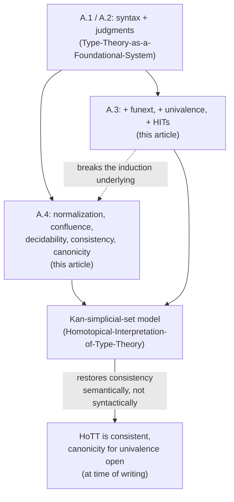

# Formal Metatheory

[[book-guidelines|↩ Back to guidelines]]

## Why this section exists, and why it's short

Every other appendix topic in this book builds a machine. This one asks whether the machine
actually runs — and the book's honest answer is: *mostly, we can prove it does, but only for the
part that predates homotopy*. That asymmetry is the whole story of §§A.3–A.4, and it's worth
sitting with before the details, because it's easy to read a four-page appendix section and assume
brevity means triviality. It doesn't. It means the book is telling you exactly where the frontier of
open research sits.

This article assumes you've already read [[Type-Theory-as-a-Foundational-System]], which covers
the two formal presentations of Martin-Löf type theory from Appendix A.1–A.2: the untyped-λ-
calculus-with-constants presentation (terms, primitive/defined constants, convertibility $t \downarrow t'$),
and the natural-deduction-with-contexts presentation (judgments $\Gamma \vdash a : A$ and
$\Gamma \vdash a \equiv b : A$, inference rules with explicit contexts $x_1:A_1,\dots,x_n:A_n$). Nothing here
re-derives that machinery. What this article covers is what the book adds on top of it in §A.3
(the three axioms/rule-schemes that turn plain Martin-Löf type theory into *homotopy* type
theory), and what it can and cannot prove about the resulting system in §A.4.

## What breaks without a formal metatheory at all

The book spends the whole of Chapters 1–11 reasoning informally — "let $f$ be a function," "by
induction," "this type is contractible" — the way any working mathematician reasons. That
informal style is only trustworthy if, somewhere, someone has nailed down precisely which
strings of symbols count as valid derivations, and shown that the informal arguments could in
principle be replayed as formal ones. Appendix A is that "somewhere." Without it you could not:

- ask whether the system is even **consistent** — i.e., whether it's possible to derive a proof of
  the empty type $\mathbf{0}$ (in which case *everything* would be provable, and the whole book would be
  vacuous),
- **implement** the theory in a proof assistant like Coq or Agda, since an implementation needs a
  syntax and a decision procedure, not an informal style guide,
- **construct models** — semantic interpretations (in simplicial sets, model categories, higher
  toposes) that justify the axioms by exhibiting a mathematical universe in which they hold.

The book flags this need explicitly with a concrete cautionary example: univalence is a strong
axiom, and if the definition of "equivalence" it's built on had been chosen carelessly — say, one
under which $\mathbf{0} \simeq \mathbf{1}$ actually held — univalence would let you transport the element of
$\mathbf{1}$ across that equivalence and produce an element of $\mathbf{0}$, i.e. a proof of *false*. Getting the
definitions right is not a formality; an error here poisons the entire foundation.

## §A.3 — The three additions that make it *homotopy* type theory

Standard Martin-Löf type theory (Appendix A.2) already has $\Pi$, $\Sigma$, coproducts, the finite
types, $\mathbb{N}$, $W$-types, and identity types. Appendix A.3 states, formally, the three additional
ingredients that turn that system into *homotopy* type theory. All three share a structural
feature worth naming up front: none of them introduces new judgmental equalities. They only
assert that a type is *inhabited* — that some previously-existing map is an equivalence, or that
some new higher-dimensional constructor exists — without giving the type theory a new
computation rule to reduce it. That single fact is the hinge on which all of §A.4's results turn.

### Function extensionality

Recall (from `happly`, defined in §2.9 of the book) that there's always a canonical map from
$f \equiv_A g$ (well, from the identity type $f =_{\prod_{(x:A)} B} g$) to "$f$ and $g$ agree pointwise."
Function extensionality is the assertion that this canonical map is itself an equivalence — going
pointwise-equal to equal isn't just possible, it's as good as being equal outright. Formally,
introduced as a new primitive constant `funext` governed by the rule

$$
\frac{\Gamma \vdash f : \prod_{(x:A)} B \qquad \Gamma \vdash g : \prod_{(x:A)} B}
     {\Gamma \vdash \mathsf{funext}(f,g) : \mathsf{isequiv}(\mathsf{happly}_{f,g})}
$$

**What breaks without it:** in plain intensional Martin-Löf type theory, two functions can agree
on every input and still fail to be judgmentally *or* propositionally equal — nothing forces it.
That's disastrous for any downstream reasoning that wants "same behavior implies same object,"
which is exactly the kind of extensional reasoning ordinary mathematics (and ordinary
programming, when you reason about referential transparency) takes for granted.

### Univalence

The book's central axiom, here given its formal introduction rule. Recall $\mathsf{idtoeqv}$ (§2.10):
the canonical map from $A =_{\mathcal{U}} B$ to $A \simeq B$, built by transporting along the identity type.
Univalence asserts that map is an equivalence:

$$
\frac{\Gamma \vdash A : \mathcal{U}_i \qquad \Gamma \vdash B : \mathcal{U}_i}
     {\Gamma \vdash \mathsf{univalence}(A,B) : \mathsf{isequiv}(\mathsf{idtoeqv}_{A,B})}
$$

Note the pattern is identical in shape to `funext` — a new constant witnessing that an already-
definable map is an equivalence. This is deliberate: the book prefers adding a primitive constant
that *inhabits* the axiom over the alternative (proving every theorem that needs it by
hypothesizing an extra variable of that type) because it wants the HoTT axioms treated as part
of the core theory, not as optional side-hypotheses threaded through every proof — see
[[The-Univalence-Axiom-and-Its-Consequences]] for the axiom's mathematical content and
consequences; this article is only about its place in the formal syntax.

### Higher inductive types, via the worked example of $S^1$

Rather than give a general schema for [[Higher-Inductive-Types|higher inductive types]] (the book explicitly says it doesn't
have one — see below), §A.3.2 works through the circle $S^1$ as the paradigm case. Compare its
rule shape to an ordinary inductive type like $\mathbb{N}$ (formation/introduction/elimination/
computation) and notice exactly where it diverges:

$$
\frac{\Gamma \; \mathsf{ctx}}{\Gamma \vdash S^1 : \mathcal{U}_i}\ S^1\text{-}\mathrm{FORM}
\qquad
\frac{\Gamma \; \mathsf{ctx}}{\Gamma \vdash \mathsf{base} : S^1}\ S^1\text{-}\mathrm{INTRO}_1
\qquad
\frac{\Gamma \; \mathsf{ctx}}{\Gamma \vdash \mathsf{loop} : \mathsf{base} =_{S^1} \mathsf{base}}\ S^1\text{-}\mathrm{INTRO}_2
$$

$$
\frac{\Gamma, x{:}S^1 \vdash C : \mathcal{U}_i \quad \Gamma \vdash b : C[\mathsf{base}/x] \quad \Gamma \vdash \ell : b =^{\mathsf{loop}}_{C} b \quad \Gamma \vdash p : S^1}
     {\Gamma \vdash \mathsf{ind}_{S^1}(x.C,b,\ell,p) : C[p/x]}\ S^1\text{-}\mathrm{ELIM}
$$

The point-computation rule ($S^1$-COMP$_1$) is ordinary and judgmental:
$\mathsf{ind}_{S^1}(x.C,b,\ell,\mathsf{base}) \equiv b$. But the *loop*-computation rule ($S^1$-COMP$_2$) is
different in kind:

$$
S^1\text{-}\mathsf{loopcomp} : \mathsf{apd}_{\lambda y.\, \mathsf{ind}_{S^1}(x.C,b,\ell,y)}(\mathsf{loop}) =_{\dots} \ell
$$

This is stated as a *term of an identity type* — a **propositional** equality, witnessed by a proof —
not a judgmental one like every computation rule you've seen up to this point (§A.1's $\downarrow$, or
§A.2's $\equiv$ rules for $\mathbb{N}$, coproducts, $\Sigma$). The book flags this explicitly as one of the
respects in which higher inductive types depart from the uniform pattern of ordinary inductive
types. This single difference — judgmental vs. merely propositional computation on the new
higher constructor — is exactly what detonates the metatheory in §A.4.

```rust
// A conversion checker (isDefEq) can decide judgmental equality by
// *computing*: reduce both sides and compare normal forms. That's
// mechanical, syntax-directed, and terminates (given normalization).
// It CANNOT decide a propositional equality this way, because a
// propositional equality is a *term* — a proof object you have to be
// handed or search for — not a reduction the checker can just run.
//
// S1-COMP1 (point case) is the kind of thing isDefEq handles for free:
fn beta_reduce_base(term: &Term) -> Term { /* mechanical rewrite */ todo!() }

// S1-loopcomp is NOT something isDefEq can discharge by reduction —
// it names a proof term the checker must be given, not compute.
struct LoopCompWitness(/* a term of the identity type, supplied, not derived */);
```

In Lean terms: `S1-COMP1` is the kind of equation the kernel accepts via `rfl` /
definitional unfolding, exactly like `Nat.rec` on `0`. `S1-loopcomp` is not — it's the sort
of thing you'd need to state as a `theorem` and prove (or postulate as an `axiom`), because
there is no reduction rule that produces it automatically. Lean's actual HIT support (e.g. in
experimental cubical extensions) has to solve precisely this problem: how to make higher
path-computations *compute*, not just *hold propositionally*. That gap is not a Lean
limitation — it's the open mathematical question the book names next.

## §A.4 — What can actually be proved, and what can't

Everything in this section is stated for the system of **Appendix A.1** (untyped-λ-calculus-with-
constants) specifically, though the book notes "similar results hold for Appendix A.2." The
reason A.1 is the vehicle: its notion of computation is completely explicit — a single rewriting
rule, $(\lambda x.\,t)(u) :\equiv t[u/x]$, plus the defining equations for each defined constant — so
metatheoretic properties can be stated as properties of that rewriting system.

### The rewriting system, confluence, and $\downarrow$

The computation rule together with each defined constant's defining equations form a **rewriting
system**: each rule has a natural direction (you *simplify* $(\lambda x.\,t)(u)$ to $t[u/x]$, never the
reverse), so terms genuinely compute rather than just relate. The book states — without proof,
citing it as standard — that this system is **confluent**: if $a$ reduces in some number of steps to
both $a'$ and $a''$, there is some $b$ that both $a'$ and $a''$ further reduce to. Confluence is exactly
what licenses defining $t \downarrow u$ ("$t$ and $u$ simplify to the same term") as well-behaved — without
it, "the" normal form of a term wouldn't be unique, and judgmental equality (defined in A.1 as:
$t \equiv u : A$ holds iff $t:A$, $u:A$, and $t \downarrow u$) would depend on evaluation order.

**This is precisely `isDefEq`.** Every dependently-typed kernel — Lean's, Coq's, Agda's — has to
decide $\Gamma \vdash a \equiv b : A$ somehow, and confluent, terminating reduction to normal form
followed by syntactic comparison (up to congruence and, in the second presentation, $\eta$) is
*the* standard implementation strategy. If you're building the Rust verifier from your learning
goals, this section is the closest thing the book gives to a specification of what your conversion
checker must be correct with respect to: reduce, and compare — and confluence is the theorem
that makes "the" normal form a well-defined thing to compare against.

### Normalization: Theorems A.4.1–A.4.2

$$
\textbf{Theorem A.4.1.}\quad \text{If } A:\mathcal{U} \text{ and } A \downarrow A' \text{ then } A':\mathcal{U}.
\text{ If } t:A \text{ and } t \downarrow t' \text{ then } t':A.
$$

This is a **subject reduction** / type-preservation result: reduction never changes a term's type.
Any Rust type-checker author will recognize this as the property that makes it *safe* to normalize
a term before comparing it — you're not accidentally leaving its type behind.

$$
\textbf{Theorem A.4.2.}\quad \text{If } A:\mathcal{U} \text{ then } A \text{ is strongly normalizable.}
\text{ If } t:A \text{ then } A \text{ and } t \text{ are strongly normalizable.}
$$

*Strongly* normalizable means **every** reduction sequence terminates, not merely that some
clever strategy finds a terminating one. This is the theorem that makes "just keep reducing until
you can't" a safe, terminating algorithm rather than a gamble — for any well-typed term, no
matter how you reduce it, you always reach a normal form in finitely many steps. The book
states this without proof ("using standard techniques from type theory") — this is the appendix's
briefest, most citation-shaped moment, and honestly representing that means not pretending a
proof sketch exists where the book gives none. The standard techniques referenced are the usual
reducibility/computability-predicate arguments from the Girard–Tait tradition (Gödel's System T
being the direct ancestor, per the appendix's own Notes section).

### Canonical/normal forms: Lemma A.4.3

The book then *characterizes* what a normal form actually looks like, syntactically:

$$
v ::= k \mid \lambda x.\,v \mid c(\vec v) \mid f(\vec v), \qquad
k ::= x \mid k(v) \mid f(\vec v)(k)
$$

— where $f(\vec v)$ is a partial application of a defined constant. In particular, **a normal type is
either a $k$-form or a primitive constant applied to closed normal terms**, $c(\vec v)$. A *closed*
normal type in particular has to be exactly $c(\vec v)$ for some primitive constant $c$ — there's
nowhere else for it to come from, since a closed term has no free variable to bottom out a
$k$-form. This lemma is the load-bearing fact underneath everything that follows: it turns "is this
term well-typed / equal to that one / a proof of this proposition" into a *syntactic* question about
a term you can pattern-match on, once it's in normal form.

### Decidability of type-checking: Theorem A.4.4

$$
\text{If } A \text{ is in normal form then } A:\mathcal{U} \text{ is decidable.
If } A:\mathcal{U} \text{ and } t \text{ is normal, then } t:A \text{ is decidable.}
$$

Combine this with strong normalization (every term *has* a normal form you can reach) and you
get: **type-checking is decidable, full stop** — normalize, then apply this theorem. This is the
single fact your Rust verifier most needs from this appendix, stated explicitly: it is not merely
*possible* to write a type-checker for (this presentation of) Martin-Löf type theory that always
halts with a correct yes/no — it's a proved theorem that one exists, and the proof is structural
(induct over Lemma A.4.3's grammar).

### Consistency and canonicity: Corollaries A.4.5–A.4.6

$$
\textbf{Corollary A.4.5 (logical consistency).}\quad \text{The system of Appendix A.1 is logically consistent.}
$$

The proof is a two-line composition of what's already been established: suppose $a : \mathbf{0}$ in the
empty context. By Theorem A.4.2, $a$ strongly normalizes to some normal $a'$; by Theorem A.4.1,
$a' : \mathbf{0}$ too. But Lemma A.4.3 says every closed normal term of a primitive type has the shape
$c(\vec v)$ for a primitive constant of that type — and $\mathbf{0}$ has *no* introduction-form primitive
constant at all. Contradiction; no such $a$ exists. This is what "logical consistency relative to
ZFC" cashes out to concretely in this appendix: not a comparison to ZFC's own consistency
(which nobody can prove from within, by Gödel), but a self-contained syntactic argument that
*this* system cannot prove $\mathbf{0}$ inhabited, given the assumption that its rewriting system
normalizes.

$$
\textbf{Corollary A.4.6 (canonicity).}\quad \text{If } a:\mathbb{N} \text{ in the empty context, } a \text{ simplifies to } \mathsf{succ}^k(\mathbf{0})
\text{ for some numeral } k.
$$

**Canonicity** is the property that closed terms of an inductive type always reduce to a genuine
constructor form — not just *some* well-typed term of type $\mathbb{N}$, but one you can read off as an
actual number by counting `succ`s. This is the theorem that gives computation its intuitive
meaning: proving $\exists n{:}\mathbb{N}.\, P(n)$ constructively and then *running* the proof term really does
hand you a specific numeral, not an inscrutable stuck expression.

$$
\textbf{Corollary A.4.7 (decidability of proof-checking).}\quad \text{If } a, A \text{ are normal, } a:A \text{ is decidable.}
$$

The book glosses this as: type-checking amounts to verifying the correctness of a proof (under
propositions-as-types), so this is "we can always recognize a correct proof when we see one" —
made precise.

### Where it all stops: the open problem

This is the section's real payload, and the reason the whole appendix opens by flagging
consistency as "not obvious." **None of Theorems A.4.1–Corollary A.4.7 apply to the full system of
homotopy type theory** (A.1/A.2 extended by A.3's axioms and HITs). The reason traces directly
back to the structural feature flagged in §A.3: univalence and higher-inductive-type constructors
(like `loop`) **never simplify** — there is no rewriting rule for them, because they were added as
axioms/rules that inhabit a type without introducing new judgmental equalities. That breaks
Lemma A.4.3's grammar at the root: a closed normal term can now be, e.g., `univalence(A,B)`
applied to something, or built from `loop`, and neither has the shape the lemma's induction relies
on. Once the syntactic characterization of normal forms fails, everything downstream — decidable
type-checking, consistency-by-contradiction, canonicity — loses its proof, not necessarily its truth.

The book is explicit that this is an **open question**, not a known negative result: "It is an open
question whether one can simplify applications of these constants in order to restore
canonicity." It further notes there isn't yet a general schema for *all* permissible higher inductive
types (only worked examples like $S^1$), nor certainty about whether higher constructors' rules
should be judgmental or propositional. This is the passage the exercise brief calls out by name:
**Voevodsky's conjecture** that univalence might genuinely *break* canonicity for booleans — i.e.,
that there might be a closed term of type $\mathsf{Bool}$ (in a system with univalence) that provably
does not reduce to either $\mathsf{true}$ or $\mathsf{false}$. (This was, in fact, later resolved — canonicity for
univalence was proved via *cubical* type theory models, years after this book's 2013 publication —
but the book is a faithful snapshot of the question as an open problem at the time it was written,
and represents it honestly as such rather than retrofitting a later result.)

**What the book falls back on instead of a normalization proof:** semantic (model-theoretic)
consistency proofs.

$$
\textbf{Theorem (cited, uncredited to a number).}\quad
\text{HoTT is consistent because it has a model.}
$$

Specifically:

- **Univalence** — consistent via a model in **Kan complexes**, due to Voevodsky [KLV12]. A Kan
  complex is a simplicial set satisfying the horn-filling condition; interpreting types as Kan
  complexes and paths as actual simplicial paths gives a mathematical structure in which the
  univalence axiom is a *theorem*, not a leap of faith — this is the "models in Kan simplicial
  sets" the topic list names, and it is the appendix's answer to "how do we know univalence
  doesn't secretly imply $\mathbf{0}$" when syntactic normalization can't answer that question. (The full
  construction of this model belongs to [[Homotopical-Interpretation-of-Type-Theory]]; this
  appendix only cites its existence as the consistency argument of last resort.)
- **Higher inductive types** — consistent via a model due to Lumsdaine and Shulman [LS17].

The shift from *syntactic* proof (normalize-and-inspect) to *semantic* proof (exhibit a model) is
itself worth internalizing as a general pattern: when a rewriting-theoretic argument for
consistency is unavailable — because the system genuinely lacks the reduction behavior the
argument needs — model theory is the fallback, at the cost of a much heavier mathematical
apparatus (simplicial sets, model categories) to set up.

## Synthesis: where this sits in the book, and in your two projects



Structurally, §A.4 is the appendix's closing argument: everything else in the book — every
informal proof, every "let $x:A$," every use of univalence to transport a structure across an
equivalence — is only as trustworthy as this section's claim that the underlying rules don't let you
prove $\mathbf{0}$. The book earns that trust for plain Martin-Löf type theory by direct, syntactic proof,
and earns it for full HoTT only by pointing to a model, honestly leaving open whether a direct,
computational proof (with genuine canonicity) is even possible.

For the two engineering targets these articles track toward: **this is the theoretical floor under
`isDefEq`.** A Rust verifier that normalizes terms and compares them for conversion is implicitly
relying on exactly Theorems A.4.1–A.4.4 to be *sound* (every reduction preserves type, every
term reaches a normal form, decidability follows) — and this appendix is the only place in the
book that states those requirements as theorems rather than assuming them silently. It's also a
warning label: the moment your verifier's type theory grows a HoTT-shaped feature — univalence,
or any higher-inductive-type-like construct whose computation rule is propositional rather than
judgmental — the normalization-based argument for decidable type-checking stops working, and
you inherit the appendix's open question rather than its theorem. For the Lean-elaborator target,
the lesson is narrower but sharper: §A.2.11's remark that implicit-argument inference,
typical-ambiguity resolution, and "ensuring symbols are only defined once" are collectively
**elaboration**, performed *prior to* core type-checking and not part of the formal rules themselves,
is exactly the boundary Lean's own architecture draws between its elaborator and its (much
smaller, much more trusted) kernel — the kernel is the part these decidability theorems are about;
the elaborator is deliberately outside that guarantee.
