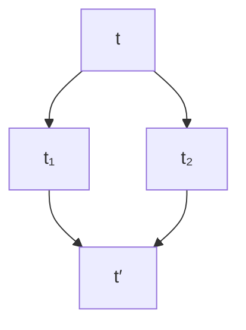
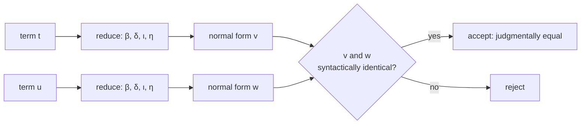
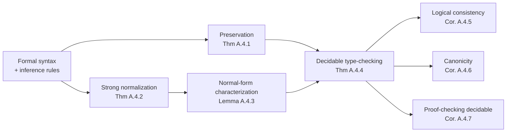

# [[Formal-Metatheory|Formal Metatheory]]

[[book-guidelines|↩ Back to guidelines]]

## Why an informal book ends with a formal appendix

The HoTT book spends four hundred pages doing mathematics informally, then closes with an appendix of grammars and inference rules. That is not an afterthought. It is the book checking its own contract.

The contract is this: every informal proof in the book is claimed to be *in principle* expandable into a formal derivation in a precisely specified system. Informal mathematics always rides on such a contract — a classical proof is "rigorous" when it could, given enough patience, be formalized in ZFC. Homotopy type theory makes the same claim about a different formal system. The metatheory in Appendix A answers three questions about that system:

1. **Can proofs be checked mechanically?** Is type-checking decidable?
2. **Is the system consistent?** Can we prove there is no term of the empty type $\mathbf{0}$?
3. **Does computation behave?** Does every closed natural number actually evaluate to a numeral?

For the base type theory, the appendix proves all three. Then it delivers the bad news: adding the two innovations the rest of the book is *about* — univalence and [[Higher-Inductive-Types|higher inductive types]] — breaks the proof technique, converts theorems into open problems, and forces consistency to be established by models instead of syntax.

That arc — clean core, expressive extension, metatheoretic debt — is the single most important engineering lesson in the book for anyone building a proof checker or an elaborator. You will make exactly this tradeoff, in miniature, the first time you add a postulate to your own system.

**[[Sets-in-Univalent-Foundations#What breaks without this|What breaks without this]].** Without a formal specification, "this proof is correct" is an appeal to vibes. Without metatheory, you do not even know whether your checker *terminates* — a type-checker that loops forever on well-formed input is not a checker, it is a suggestion box.

## Object language versus metalanguage: the three judgments

The first thing the formal presentation fixes is what kind of thing we are even talking about. There are two layers:

- The **object language**: the type theory itself — terms, types, the expressions you would write in a proof assistant.
- The **metalanguage**: the ordinary mathematics (and, in practice, the Rust or OCaml code) we use to *talk about* the object language — its grammar, its rules, its properties.

The bridge between the two layers is the notion of a **judgment**. As §1.1 of the book emphasizes, type theory has two basic judgments, and the formal appendix works with three:

$$
\Gamma~\mathrm{ctx} \qquad \Gamma \vdash a : A \qquad \Gamma \vdash a \equiv b : A
$$

Reading the symbols aloud: $\Gamma$ (capital gamma) is a **context**, an ordered list of assumptions; $\mathrm{ctx}$ asserts that this list is well-formed; $\vdash$ (the "turnstile") separates assumptions from conclusion; $:$ reads "has type"; $\equiv$ (the triple bar) reads "is judgmentally equal to". So the three judgments say:

1. "$\Gamma$ is a well-formed context."
2. "Under assumptions $\Gamma$, the term $a$ has type $A$."
3. "Under assumptions $\Gamma$, the terms $a$ and $b$ are definitionally equal at type $A$."

The crucial design decision, inherited from §1.1: **judgments are external, propositions are internal.** You cannot negate a judgment. You cannot assume a judgment as a hypothesis inside the theory. "$a : A$" is something the *checker* establishes about the system, not something the system can reason about. This is the exact boundary your Rust verifier will live on: judgments are what your program returns derivations *of*; propositions are data *inside* the terms.

This is also why the judgment form is the shared ancestor of "type checker" and "proof checker." Since propositions are types, checking a derivation of $\Gamma \vdash a : A$ *is* proof-checking when $A$ is a proposition, and type-checking when $A$ is a data type. One mechanism, two readings. Everything else in the metatheory hangs off this.

## Two presentations of one system

Appendix A gives two formulations of the same core theory, and they correspond to the two halves of any real implementation.

### A.1: the evaluator's view (syntax plus conversion)

The first presentation defines the raw syntax as an extension of the untyped $\lambda$-calculus:

$$
t ::= x \mid \lambda x.\, t \mid t(t') \mid c \mid f
$$

A term is a variable $x$, or a $\lambda$-abstraction $\lambda x.\, t$ ("the function that maps $x$ to $t$"), or an application $t(t')$, or a **primitive constant** $c$ (the built-in type formers), or a **defined constant** $f$ (a named function with defining equations). Defined constants come in two flavors: *explicit* ones with a single equation $f(x_1, \ldots, x_n) :\equiv t$, and *recursive* ones defined by one equation per constructor of an inductive type (primitive recursion on $\mathbb{N}$ being the paradigm).

Then there is exactly one semantic relation: **convertibility**, written $t \downarrow t'$. It is the equivalence relation generated by:

- the defining equations of constants,
- the $\beta$-rule $(\lambda x.\, t)(u) :\equiv t[u/x]$ ("apply a lambda by substituting the argument"),
- congruence under application and $\lambda$ ("equal parts make equal wholes").

Judgmental equality is then *derived from* typing plus conversion: from $t : A$, $u : A$, and $t \downarrow u$, conclude $t \equiv u : A$.

This presentation is an **evaluator specification**: terms rewrite to terms, and equality means "reduce to the same thing." Here it is as Rust:

```rust
/// Object-language syntax, a tiny fragment. de Bruijn indices make
/// capture-avoiding substitution structural instead of delicate.
enum Term {
    Var(usize),                  // bound variable, by nesting depth
    Lam(Box<Term>),              // λx. t
    App(Box<Term>, Box<Term>),   // t(u)
    Const(&'static str),         // primitive constants: Nat, Zero, Succ, ...
}

/// One-step reduction: β (application), δ (unfolding definitions),
/// ι (recursor computation), η (function extensionality, judgmental).
fn reduce_one_step(t: &Term) -> Option<Term> { /* ... */ }

/// Normalize by repeated reduction.
///
/// NOTE: termination of this loop is NOT a local fact about the loop.
/// It is Strong Normalization (Thm A.4.2) doing the work: every
/// well-typed term has no infinite reduction sequence.
fn normalize(t: Term) -> Term {
    let mut cur = t;
    while let Some(next) = reduce_one_step(&cur) {
        cur = next;
    }
    cur
}

/// Judgmental equality = same normal form.
/// Decidable because normalization terminates (Thm A.4.2) and normal
/// forms have a simple, syntax-comparable shape (Lemma A.4.3).
fn is_def_eq(a: Term, b: Term) -> bool {
    normalize(a) == normalize(b)
}
```

One honest footnote, which the book itself flags: this presentation **omits the η-rule** $f \equiv \lambda x.\, f(x)$ ("a function equals its pointwise re-abstraction"). Convertibility here is type-independent — the rewriter never knows whether a term is a function — and η only makes sense for terms known to have function type. The second presentation fixes this.

### A.2: the checker's view (natural deduction with contexts)

The second presentation is the one your verifier will actually implement. Judgments are derived by **inference rules** of the form

$$
\frac{J_1 \quad \cdots \quad J_k}{J}\;\text{RuleName}
$$

read: "from premises $J_1$ through $J_k$, conclude $J$," sometimes with side conditions. A **derivation** is a tree built out of these rules; the judgment being derived sits at the root.

Here is the book's own example: a full derivation that the identity function on the unit type has type $1 \to 1$ (where $\cdot$ denotes the empty context).

<svg viewBox="0 0 760 330" width="760" height="330" xmlns="http://www.w3.org/2000/svg" role="img">
  <title>Derivation tree for the judgment: empty context proves lambda x. x has type 1 to 1</title>
  <g font-family="-apple-system, BlinkMacSystemFont, 'Segoe UI', Roboto, sans-serif">
    <rect x="120" y="18" width="150" height="34" rx="6" fill="#e8e6e1" stroke="#8a8f98" stroke-width="1.4"/>
    <text x="195" y="40" text-anchor="middle" font-size="14" fill="#26292e">· ctx</text>
    <rect x="490" y="18" width="150" height="34" rx="6" fill="#e8e6e1" stroke="#8a8f98" stroke-width="1.4"/>
    <text x="565" y="40" text-anchor="middle" font-size="14" fill="#26292e">x : 1 ctx</text>
    <rect x="95" y="118" width="200" height="34" rx="6" fill="#e8e6e1" stroke="#8a8f98" stroke-width="1.4"/>
    <text x="195" y="140" text-anchor="middle" font-size="14" fill="#26292e">· ⊢ 1 : 𝕌₀</text>
    <rect x="465" y="118" width="200" height="34" rx="6" fill="#e8e6e1" stroke="#8a8f98" stroke-width="1.4"/>
    <text x="565" y="140" text-anchor="middle" font-size="14" fill="#26292e">x : 1 ⊢ x : 1</text>
    <rect x="190" y="238" width="380" height="34" rx="6" fill="#dfe6e0" stroke="#8a8f98" stroke-width="1.8"/>
    <text x="380" y="260" text-anchor="middle" font-size="14" fill="#26292e">· ⊢ λx. x : 1 → 1</text>
    <line x1="195" y1="52" x2="195" y2="118" stroke="#8a8f98" stroke-width="1.4"/>
    <line x1="565" y1="52" x2="565" y2="118" stroke="#8a8f98" stroke-width="1.4"/>
    <line x1="230" y1="152" x2="330" y2="238" stroke="#8a8f98" stroke-width="1.4"/>
    <line x1="530" y1="152" x2="430" y2="238" stroke="#8a8f98" stroke-width="1.4"/>
    <text x="205" y="92" font-size="12" font-style="italic" fill="#b07d3a">ctx-EMP</text>
    <text x="575" y="92" font-size="12" font-style="italic" fill="#b07d3a">ctx-EXT</text>
    <text x="252" y="196" text-anchor="end" font-size="12" font-style="italic" fill="#b07d3a">1-FORM</text>
    <text x="508" y="196" font-size="12" font-style="italic" fill="#b07d3a">Vble</text>
    <text x="380" y="298" text-anchor="middle" font-size="12" font-style="italic" fill="#b07d3a">Π-INTRO</text>
  </g>
</svg>

Two things are worth noticing. First, the derivation is genuinely a tree: the right branch's `ctx-EXT` step (extending the empty context with $x : 1$) reuses the fact $\cdot \vdash 1 : \mathcal{U}_0$ established on the left — the book draws it as a leaf, but its premise is shared. Second, every node is *mechanically checkable*: given a candidate tree, you verify each node against its rule. That is the whole job of a proof checker. In Rust, derivations are literally a recursive enum:

```rust
/// A derivation is a tree whose variants are the rule names of A.2.
/// Checking a proof = walking this tree, validating each node.
enum Derivation {
    CtxEmp,                                          // · ctx
    CtxExt { premise: Box<Derivation> },             // Γ ⊢ A : 𝕌ᵢ  ⇒  Γ, x:A ctx
    Var { index: usize },                            // Vble
    OneForm,                                         // 1-FORM
    PiIntro { body: Box<Derivation> },               // Π-INTRO
    PiElim { func: Box<Derivation>, arg: Box<Derivation> },
    Conv { term: Box<Derivation>, ty_eq: Box<Derivation> }, // A ≡ B ⇒ a : B
    // ... one variant per rule in the system ...
}

/// The checker. Returns the judgment derived at the root, or the first
/// rule violation found. Note the flavor: every constructor is checked
/// against a *given* type — these are checking rules, not synthesis rules.
fn check(d: &Derivation) -> Result<Judgment, CheckError> { /* ... */ }
```

(Implementation note, beyond the book: rules like Π-INTRO as stated are *checking* rules — the conclusion asserts a given type. A real implementation usually splits each into a [[Inductive-Definitions-and-Initial-Algebras#Synthesis|synthesis]] mode and a checking mode, bidirectional style, so that type information flows in the right direction. The book's presentation supports reading it this way, and it is the standard first move when turning A.2 into code.)

The context rules deserve a moment on their own, because they encode the plumbing that everything else relies on:

$$
\frac{}{\cdot~\mathrm{ctx}}\;\text{ctx-EMP}
\qquad
\frac{x_1 : A_1, \ldots, x_{n-1} : A_{n-1} \vdash A_n : \mathcal{U}_i}{(x_1 : A_1, \ldots, x_n : A_n)~\mathrm{ctx}}\;\text{ctx-EXT}
$$

with the side condition that $x_n$ is distinct from the earlier variables. Contexts are *ordered*, because later assumptions may depend on earlier ones — you can only assume $x : A$ after the variables appearing in $A$ are in scope. The appendix also establishes, by induction over derivations, that **substitution** and **weakening** are *admissible*: they are not rules you add, they are theorems you prove about the rules you have. Substitution admissibility is the formal version of "plugging a term into a context never breaks typing" — which, in practice, means substitution must be capture-avoiding.

**[[Type-Theory-as-a-Foundational-System-Qwen#What breaks without this|What breaks without this]].** Get variable binding wrong and you get capture: substituting into $\lambda y.\, x + y$ naively with $y$ turns a free variable into a bound one and silently changes the meaning of the term (§1.2 gives exactly this example). In a verifier, that is not a bug — it is unsoundness with a compiler warning nobody reads. de Bruijn indices, named weak references, or explicit substitutions are the standard engineering answers; the metatheorem you need *afterwards*, either way, is substitution admissibility.

## The rule kit: formation, introduction, elimination, computation, uniqueness

Every type former in A.2 comes with the same five-part kit (the pattern named in Remark 1.5.1 of the book):

- **Formation**: when the type itself is well-formed.
- **Introduction**: how to build inhabitants.
- **Elimination**: how to consume inhabitants (the induction principle in dependent form).
- **Computation**: what happens when elimination meets introduction — always a *judgmental* equality.
- **Uniqueness** (optional): every inhabitant is determined by how it is consumed.

For dependent function types, the full kit, with the symbols named as you meet them: $\prod_{(x:A)} B$ ("product over $x$ in $A$ of $B$", the type of dependent functions), $\lambda(x:A).\, b$ ("lambda abstraction"), and $f(a)$ (application):

$$
\frac{\Gamma \vdash A : \mathcal{U}_i \qquad \Gamma, x : A \vdash B : \mathcal{U}_i}{\Gamma \vdash \prod_{(x:A)} B : \mathcal{U}_i}\;\Pi\text{-FORM}
\qquad
\frac{\Gamma, x : A \vdash b : B}{\Gamma \vdash \lambda(x:A).\, b : \prod_{(x:A)} B}\;\Pi\text{-INTRO}
$$

$$
\frac{\Gamma \vdash f : \prod_{(x:A)} B \qquad \Gamma \vdash a : A}{\Gamma \vdash f(a) : B[a/x]}\;\Pi\text{-ELIM}
\qquad
\frac{\Gamma \vdash f : \prod_{(x:A)} B}{\Gamma \vdash f \equiv (\lambda x.\, f(x)) : \prod_{(x:A)} B}\;\Pi\text{-UNIQ}
$$

plus the computation rule $(\lambda(x:A).\, b)(a) \equiv b[a/x]$. Note that Π-UNIQ — the η-rule missing from the first presentation — is right here, as a *judgmental* equality, because in this presentation the checker knows the type of $f$.

For the natural numbers, introduction gives $0 : \mathbb{N}$ and $\mathrm{succ}(n) : \mathbb{N}$; elimination is the induction principle $\mathrm{ind}_{\mathbb{N}}$ ("induction for naturals"); computation says $\mathrm{ind}_{\mathbb{N}}(x.C,\, c_0,\, x.y.c_s,\, 0) \equiv c_0$ and the successor case reduces by one step of recursion. For identity types, introduction is $\mathrm{refl}_a : a =_A a$ ("reflexivity at $a$"), elimination is path induction $\mathrm{ind}_{=_A}$, and computation says inducting on reflexivity returns the base case.

One small notational idea makes the eliminator rules precise and worth stealing: **binders written into the arguments**. In $\mathrm{ind}_{\mathbb{N}}(x.C,\, c_0,\, x.y.c_s,\, n)$, the notation $x.C$ means "$C$ with $x$ bound", and $x.y.c_s$ binds both $x$ and $y$ in $c_s$. The eliminator is not a function taking functions; it is a syntactic operation that substitutes into bodies. Your implementation will feel the difference the moment you try to represent $\mathrm{ind}_{\mathbb{N}}$ as a Rust closure and realize the recursion hypothesis has to be injected *into the body*, not passed as a value.

**What breaks without this.** Without computation rules, eliminators have no specified behavior and normalization has no $\iota$-reductions to perform: the system still types terms, but nothing computes. Without uniqueness principles, you lose judgmental η, and every conversion check on functions becomes weaker than it should be — two pointwise-identical functions fail to compare equal, and downstream type checking rejects programs that are obviously fine.

## Definitional equality: what it is, what it is not, and how it is decided

Judgmental equality $\equiv$ is the most load-bearing concept in the whole appendix, so it deserves a careful tour.

**What is in it.** Four kinds of reduction, using the traditional names your Lean sessions will surface:

- **$\beta$**: applying a $\lambda$ — $(\lambda x.\, t)(u)$ reduces to $t[u/x]$.
- **$\delta$**: unfolding defined constants — $\mathrm{double}(2)$ unfolds to $2 + 2$ via its defining equation.
- **$\iota$**: computation rules of eliminators — $\mathrm{ind}_{\mathbb{N}}(\ldots, \mathrm{succ}(n))$ reduces to the successor clause applied to the recursive call.
- **$\eta$**: function extensionality at the judgmental level — $f \equiv \lambda x.\, f(x)$.

**What is not in it.** Any equality that requires *reasoning*. The book's Remark 1.12.2 is the canonical demonstration: addition of naturals is commutative only propositionally. For a variable $n$, the judgment $n + 1 \equiv 1 + n$ is **not** derivable — you must use the identity type and induction. But for a specific numeral, $3 + 1 \equiv 1 + 3$ **is** judgmental, because both sides reduce to $4$. Associativity of addition is the same story. Judgmental equality is computation; propositional equality is mathematics.

Here is [[Type-Theory-as-a-Foundational-System-Qwen#The distinction|the distinction]] made concrete in Lean, where the kernel's conversion checker — the procedure internally called `isDefEq` — is precisely the decision procedure for this judgment:

```lean
-- Judgmentally equal: β-reduction + ι (Nat.add computes on numerals).
-- `rfl` succeeds exactly when the kernel's isDefEq accepts the two sides.
example : (fun x => x + 1) 2 = 3 := rfl
#reduce (fun x => x + 1) 2        -- 3

-- δ: unfolding a defined constant is judgmental.
def double (n : Nat) : Nat := n + n
example : double 2 = 4 := rfl

-- NOT judgmentally equal — only propositionally so. `rfl` fails:
example (n : Nat) : n + 1 = 1 + n := Nat.add_comm n 1

-- ...yet every *particular* instance is judgmental (both sides compute):
example : 3 + 1 = 1 + 3 := rfl
```

**How it is decided.** The algorithm is the one sketched in Rust above: normalize both sides, compare normal forms. Two metatheorems make this legitimate:

- **Confluence** (the diamond property): if a term reduces to $t_1$ and to $t_2$, both reduce further to a common term. So the normal form is unique when it exists.



- **Strong normalization** (Theorem A.4.2): well-typed terms have no infinite reduction sequences. So normalization terminates.

Then Lemma A.4.3 characterizes what normal forms actually look like, which is what makes the final comparison cheap:

$$
v ::= k \mid \lambda x.\, v \mid c(\vec{v}) \mid f(\vec{v})
\qquad
k ::= x \mid k(v) \mid f(\vec{v})(k)
$$

Reading it: a normal form is an abstraction, a fully-applied primitive constant, a fully-applied defined constant, or a **neutral** term $k$ — a variable, or a neutral applied to an argument, or a partial application of a defined constant stuck on a variable argument. The key consequence: a *type* in normal form is either neutral or headed by a primitive constant. You never need to look inside binders to compare types.



**What breaks without this.** Types are compared up to judgmental equality (the conversion rule: from $a : A$ and $A \equiv B$, conclude $a : B$). If $\equiv$ were undecidable, type checking would be undecidable, and the entire premise of machine-checked proof collapses — you could not even say whether a derivation is well-formed. This is why the book insists (§1.1) that judgmental equality is a *meta-theoretic*, algorithmic matter, never something you can assume or negate inside the theory.

## The metatheorem chain

Appendix A.4 now runs the argument that everything so far was built to support. Each result feeds the next:



The results, one sentence each, with what each one buys you:

- **Preservation (Theorem A.4.1).** Reduction preserves typing: if $t : A$ and $t \downarrow t'$, then $t' : A$ (and similarly for types in universes). Without it, evaluation could smuggle a term out of its type, and your checker's verdict would depend on how far you chose to compute.
- **Strong normalization (Theorem A.4.2).** Every well-typed term is strongly normalizing. This is the heavyweight; the book notes the proof uses Tait's computability method. It buys termination of conversion, hence termination of the whole checker.
- **Normal forms (Lemma A.4.3).** The syntax of normal forms above. It buys cheap, structural comparison.
- **Decidability of type-checking (Theorem A.4.4).** Whether $a : A$ holds is decidable for normal forms, and combined with normalization, in general. This is the product requirement: "we should be able to recognize a proof when we see one" (Introduction, p. 12).
- **Logical consistency (Corollary A.4.5).** There is no closed term of type $\mathbf{0}$. The proof is a beautiful one-liner of a normal-form argument: if $\vdash a : \mathbf{0}$, normalize $a$ to $a'$; by Lemma A.4.3, a normal inhabitant of $\mathbf{0}$ would have to be a neutral or a constant-headed term — and $\mathbf{0}$ has neither constructors nor constants that produce it. No such normal form exists. Contradiction.
- **Canonicity (Corollary A.4.6).** Every closed term $a : \mathbb{N}$ reduces to a numeral $\mathrm{succ}^k(0)$. Computation actually delivers answers; the system cannot prove "there exists a natural number" without being able to exhibit one.
- **Decidability of proofhood (Corollary A.4.7).** Being a proof in the system is decidable. Checking a submitted derivation is a bounded mechanical task.

**What breaks without this.** Drop normalization and consistency becomes unprovable by this method — you can no longer argue "any proof of $\mathbf{0}$ would normalize to an impossible normal form." Drop canonicity and your "verified" compiler might certify a program whose output it can never compute. These are not aesthetic properties; they are the difference between a foundation and a toy.

## What homotopy type theory does to this clean picture

Now the appendix turns to the part of the book you actually came for, and the metatheory gets honestly messier. Homotopy type theory is the base theory plus two features, and both are introduced in ways that the normalization machinery cannot digest.

### Axioms are inhabitants with no reduction

Function extensionality and univalence enter the formal system (Appendix A.3) as **primitive constants with no computation rules**:

$$
\Gamma \vdash \mathrm{funext}(f, g) : \mathrm{isequiv}(\mathrm{happly}_{f,g})
\qquad
\Gamma \vdash \mathrm{univalence}(A, B) : \mathrm{isequiv}(\mathrm{idtoeqv}_{A,B})
$$

Read aloud: $\mathrm{funext}$ is a constant witnessing that pointwise equality of functions makes them equal; $\mathrm{univalence}$ is a constant witnessing that $\mathrm{idtoeqv}$ ("identity to equivalence", the canonical map from paths between types to equivalences) is an equivalence. These are *axioms* in the precise sense of §1.1: atomic inhabitants declared to exist, with no rules governing their behavior beyond their type.

The contrast with rules is the point. Rules are **procedural**: they tell you how to compute. Axioms are **opaque**: a term stuck on $\mathrm{univalence}(A,B)$ simply stops. There is no $\delta$, no $\iota$, nothing to fire. The appendix is blunt about the consequence: occurrences of univalence and of higher-inductive constructors never simplify, which breaks the normal-form characterization of Lemma A.4.3 outright.

There is a middle option the book uses for everything else in Chapters 2–11: *propositional* computation rules, where the computation behavior holds as an inhabitant of an identity type rather than as a judgmental equality. You saw this pattern in §2.9–§2.10, where $\mathrm{ua}$ (the inverse of $\mathrm{idtoeqv}$, "univalence as an introduction rule for equality of types") satisfies $\mathrm{transport}^{X \mapsto X}(\mathrm{ua}(f), x) = f(x)$ only propositionally. The system gets the mathematics; the computation stops being definitional.

### Higher inductive types split the computation rules

The circle $S^1$ (Appendix A.3) shows the compromise in its final form. Point constructors stay judgmental:

$$
\mathrm{ind}_{S^1}(x.C,\, b,\, \ell,\, \mathrm{base}) \equiv b : C[\mathrm{base}/x]
$$

Path constructors become propositional: the rule S1-COMP2 does not say the induction principle computes on $\mathrm{loop}$ judgmentally; it gives you a *term* witnessing that the dependent application of the induced function to $\mathrm{loop}$ equals $\ell$. The reasons (from §6.2 and the Chapter 6 notes) are worth knowing: the operation $\mathrm{ap}$ ("action on paths") is itself defined via identity elimination, not primitive, and judgmental equalities should not depend on such choices; and semantically, left and right homotopies are equal only *up to homotopy*, so demanding judgmental computation asks for more than the semantics can give.

### The open problem: canonicity for univalence

With normalization unproven and normal forms gone, what survives? Consistency does — but by a completely different route. The book establishes it **semantically**: all the constructions have a model in Kan simplicial sets (Voevodsky's model), higher inductive types included (work of Lumsdaine and Shulman). Therefore the theory is consistent *relative to* ZFC with sufficiently many inaccessible cardinals (one per universe level). Note the shape of the guarantee: no longer "the syntax cannot produce $\mathbf{0}$," but "if ZFC is consistent, so is this." A model-theoretic proof replaces the syntactic one.

Canonicity, meanwhile, becomes a conjecture. From the Introduction's open problems (posed by Voevodsky): given a closed term of type $\mathbb{N}$ in the theory extended with univalence, can one always find a numeral and a proof that the term equals that numeral — where the proof of equality may itself use univalence? More broadly: is there a constructive justification of univalence at all? As of the book, open.

**What breaks without this** — or rather, what breaks *because* of this, and why you should care: every postulate you add to a checker is a place where computation stops. Add a function extensionality constant with no reduction, and suddenly terms like $(\mathrm{funext}(\ldots))(x)$ are stuck forever: your evaluator cannot run certified programs that touch them, and any canonicity argument about your system dies with it. The design space is exactly the book's: judgmental rules (computational, restrictive) → propositional computation (mathematically smooth, computationally inert) → opaque axioms (maximum power, zero computation). Budget your axioms like memory.

## The guardrails that keep the core sane

Two syntactic restrictions protect the base system, and both are stated in the book precisely because violating them produces inconsistency rather than mere inconvenience.

**Strict positivity** (§5.6). In an inductive definition of a type $W$, the type $W$ may appear in constructor argument types only *strictly positively*: roughly, each constructor argument is either a type not mentioning $W$, or an iterated function type with codomain $W$. The motivating failures are staged. First, a constructor $g : (C \to \mathbb{N}) \to C$ is not even *formulable* — the recursion principle would need to "apply the function being defined to an argument of function type," which has no meaning. Second, and worse, a constructor $k : ((D \to \mathrm{Prop}) \to \mathrm{Prop}) \to D$ is formulable (the occurrence of $D$ is negative twice, hence covariant overall) and **inconsistent**: you can define an "injection" from the "power set" of $D$ into $D$, then diagonalize to get a proposition equivalent to its own negation. (There is a universe-level caveat: the full contradiction uses propositional resizing, but the warning stands.) Double negation is not forgiveness.

**Higher inductive syntax** (§6.13) is, by contrast, admitted to be unsettled. Point constructors and 1-path constructors with sources and targets built from earlier constructors cover all the examples, but the general condition — that source and target expressions be *natural*, i.e., preserved by all functions — is stated informally, and the book shows why some condition is mandatory: a path constructor $\sigma : f_K(a) = f_K(b)$ for an arbitrary family $f : \prod_{X : \mathcal{U}} (X \to X)$ would make the induction principle unstatable, because there is no way to say what a dependent path over $\sigma$ should connect. If your future system grows HIT-like features (and quotient/quotient-like features are the usual gateway), this is the cliff to survey first.

**What breaks without this.** Without strict positivity, the system proves false. There is no "without this" horror story to tell, because the story *is* the horror: a derivation of $\mathbf{0}$, at which point every metatheorem above is simultaneously void.

## Elaboration: the invisible front end

There is one more formal layer, mentioned almost apologetically in A.2.11, and it is arguably the most relevant section of the appendix for an elaborator builder. Consider function composition. Formally, the constant must take the types as explicit arguments:

$$
\circ :\equiv \lambda(A:\mathcal{U}).\, \lambda(B:\mathcal{U}).\, \lambda(C:\mathcal{U}).\, \lambda(g:B \to C).\, \lambda(f:A \to B).\, \lambda(x:A).\, g(f(x))
$$

But nobody writes $\circ(A, B, C, g, f)$. Everyone writes $g \circ f$, and a front end figures out $A, B, C$ from the types of $g$ and $f$. The appendix names this front end **elaboration**: inferring implicit arguments, resolving typical ambiguity in universe levels, ensuring symbols are defined once — all performed *before* derivation checking. The core theory, as presented, never sees it.

This division of labor is exactly how a real proof assistant is structured, and it tells you where unification enters the picture. In Lean, the same kernel procedure `isDefEq` that decides definitional equality also runs *during elaboration*, with metavariables standing in for not-yet-known implicit arguments: solving "what must $A$ be so that $g \circ f$ type-checks?" is a unification problem whose tractable core is pattern unification over the kind of metavariable applications these constraints produce. The book does not discuss this machinery — it is outside the core formalism — but the appendix's observation lands exactly on the seam: the rules describe what checking *means*, elaboration describes how human input gets translated into something checkable, and the translation is where unification lives.

**What breaks without this.** Nothing breaks *logically* — elaboration is sugar. What breaks is *usability at scale*: without implicit inference, every derived judgment carries a linear amount of bookkeeping that humans will not write and that error messages will drown in. Every real system rebuilds this layer; the only choice is whether you design it or inherit it.

## Where this leads

**In the book.** Everything in Part I is developed inside exactly the rule system of A.2; Chapters 6–11 then stretch it. Axioms interact: §4.9 proves univalence *implies* function extensionality, so one of the two constants is in principle eliminable. The Chapter 7 truncation machinery and the Chapter 8 homotopy calculations all run on HIT rules whose computation is only propositional — which is why the encode-decode proofs there are so careful about which equalities are judgmental. And the canonicity question left open here gates any future *computational* interpretation of univalence, which the Introduction names as the field's most pressing problem.

**Backward references.** §1.1 for judgments versus propositions and the two equalities; §5.6 for the general grammar of inductive definitions; Remark 1.12.2 for the judgmental-versus-propositional boundary in practice.

**For your project — both targets, load-bearing.**
- *The Rust verifier.* Appendix A.2 is, line for line, the specification of your checker: contexts are your environment, the judgment forms are your public API, the rule names are the variants of your derivation enum, and the metatheorems are the properties you will want about it — preservation and normalization as your termination and soundness story, decidability as your UX guarantee. When you later add Hoare-triple judgments, you are *extending this judgment set*; the admissibility-of-substitution proof pattern is the template for showing your extended system still behaves under substitution of program variables.
- *The elaborator.* Section A.2.11 plus §1.1 is your requirements document: elaboration as a pre-pass over a core with decidable conversion, implicit-argument inference as unification, typical ambiguity as universe-level resolution. Your planned Miller-pattern-unification core is precisely the standard tractable fragment for the metavariable problems that pass generates, run through a kernel whose `isDefEq` is the normalization algorithm of A.4.

If you remember one sentence from the appendix, make it the one the book buries in the metatheory section: the base theory is consistent because normal forms cannot lie; the extended theory is consistent because someone built a model. Everything between those two facts is the engineering of foundations.

[[book-guidelines|↩ Back to guidelines]]