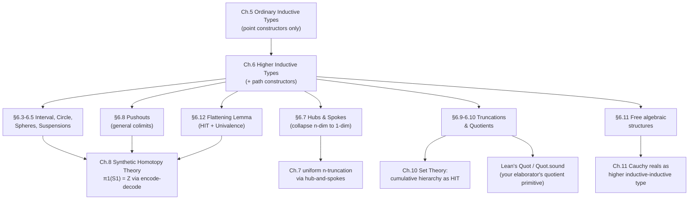

# Higher Inductive Types

[[book-guidelines|↩ Back to guidelines]]

## The problem an ordinary inductive type can't solve

Chapter 5 gave you inductive types as freely generated structures: you list some constructors, and the type is exactly what those constructors reach — no more, no less, and the induction principle lets you prove things "by cases on how an element was built." That machinery is airtight for `Nat`, `List`, trees — anything whose values are *just points*.

But HoTT's whole premise is that types carry *paths* too — a type is a space, and equality is a path in that space. So a natural question falls out immediately: can a type be freely generated not just by points, but by paths? Could you write down a constructor whose output isn't a term of the type, but a term of an *identity type* over it?

Concretely: what breaks if you only have ordinary inductive types and you want to build, say, "the smallest space consisting of one point going around a loop"? You could try `data S1 = Base` — but that's just the one-point type, with no loop. There's no way, in Chapter 5's inductive-type syntax, to *ask* for a nontrivial term of `Base = Base`. The type former can only manufacture new points; it never manufactures new proofs of equality between points it already has (those come for free as `refl`, or via `ap`/`transport` off already-nontrivial paths elsewhere — never brand new). That's the wall this chapter kicks down. A **higher inductive type (HIT)** generalizes the schema to also allow **path constructors**: generators whose output is a term of an identity type in the type being defined, not a term of the type itself.

The book states this side by side with $\mathbf{2}$ and $\mathbb{N}$ to underline how uniform the idea is once you see it (Ch. 6.1, p. 179): the circle $S^1$ is generated by

$$
\texttt{base} : S^1, \qquad \texttt{loop} : \texttt{base} =_{S^1} \texttt{base},
$$

exactly the same shape of definition as $\mathbf{2}$ generated by $0_\mathbf{2}, 1_\mathbf{2} : \mathbf{2}$, except one of the two generators lands in dimension 1 (a path) instead of dimension 0 (a point). This is genuinely new expressive power, not decoration: the book's own emphasis (p. 180) is that `loop` is *not a priori equal* to $\mathrm{refl}_{\texttt{base}}$ — proving they're actually different requires real work (Lemma 6.4.1, via univalence), but the point constructor/path constructor split is what makes the question even askable.

**Rust/Python grounding.** There is no faithful Rust or Python encoding of a path constructor, because neither language has identity *types* — `==` is a boolean-valued function, not itself a type you can pattern-match on or whose inhabitants you construct. This is one of the places the style config's "say so rather than forcing a strained analogy" applies directly: the honest statement is that HITs are precisely the piece of type theory that has no classical-programming-language shadow. The closest gesture is a quotient by an explicit equivalence relation (Rust's `PartialEq` override, or a Python `__eq__`), and we'll use exactly that comparison later for set-quotients (§6.10), where it *is* apt.

**Lean grounding.** Lean's kernel does support (a restricted form of) this: `Quot` is a built-in higher-inductive-like primitive — `Quot.mk` is the point constructor, and `Quot.sound : r a b → Quot.mk r a = Quot.mk r b` is literally a path constructor, producing a genuine element of an `Eq` type from a relation, not derived from `rfl`. Lean does not support general HITs (no user-defined `S1` with a `loop` path constructor and judgmental point-computation, propositional path-computation, the way the book wants) — but `Quot`/`Quot.sound` is exactly the special case corresponding to §6.10's set-quotients, and it's worth having open in your head from the first page of this chapter, because it's the one place your target elaborator project already needs this exact mechanism.

## Point constructors, path constructors, and what "freely generated" really buys you

Before the formalism, sit with what "generation" costs you. The book is emphatic (p. 180) that HITs really are *free* generation, in the same sense a group is freely generated by a set of generators: you get exactly `loop`, plus whatever the ambient path algebra ($\infty$-groupoid structure — concatenation, inversion, associativity) forces to exist from it. So $S^1$ automatically also contains $\texttt{loop} \cdot \texttt{loop}$, $\texttt{loop}^{-1}$, $\texttt{loop} \cdot \texttt{loop} \cdot \texttt{loop}$, and so on — all provably distinct — even though only one path was declared as a constructor. **[[Sets-in-Univalent-Foundations#What breaks without this|What breaks without this]] free-generation discipline:** if you instead let yourself impose an *axiom* like "$\texttt{loop} \cdot \texttt{loop} = \mathrm{refl}$", you'd have some other type (a "presented," not freely generated, type) — book emphasizes (p. 180) that presentation and free generation come apart in general theories, but in the world of $\infty$-groupoids you don't lose anything: any presentation can be recovered as a free HIT by turning would-be axioms into extra 2-dimensional path constructors that force the identification up to homotopy. This is the trick behind truncation constructors later in the chapter (§6.9, §6.10) — "make $A$ into a set" is achieved not by adding an axiom on the side, but by adding a path constructor that manufactures a 2-path between any two parallel 1-paths.

Second load-bearing subtlety (p. 181): the HIT's *own* induction principle is new, but its identity types don't get a new induction principle — they still only have ordinary path induction. That means describing the identity type of a HIT concretely (e.g. "is every path `base = base` in $S^1$ just some composite of `loop`s?") is genuinely hard; it's the seed of Chapter 8's computation of $\pi_1(S^1) \cong \mathbb{Z}$, which needs the encode-decode method precisely because path induction alone won't hand you the answer.

## Computation rules: judgmental for points, propositional for paths

This is one of the sharpest formal distinctions in the chapter, and it is exactly the kind of "why here, why like this" question the learning-goals file asks to surface, because it is a direct ancestor of the trusted-kernel design question in any dependently-typed checker: **which equalities does the kernel decide by computation (definitional/judgmental) vs. which does it merely accept as an inhabited proof obligation (propositional)?**

For $S^1$'s recursion principle: given a type $B$ with $b : B$ and $\ell : b =_B b$, you get $f : S^1 \to B$ with

$$
f(\texttt{base}) \equiv b \qquad (\text{judgmental}), \qquad \mathrm{ap}_f(\texttt{loop}) = \ell \qquad (\text{propositional}).
$$

The book's own justification (p. 181–182) is worth internalizing rather than just citing: $\mathrm{ap}_f$ is not a primitive of the type theory — it's *defined* using identity-type induction, and could have been defined some other equivalent way. A judgmental equality is supposed to be part of the deductive system itself, not hostage to which of several equivalent definitions of a derived operation you happened to pick. So the book draws the line at: point constructors get judgmental computation (this is cheap — it's just "the value this function returns on this input"), path constructors get only propositional computation (an inhabitant of an equality type, introduced by notation $f(\texttt{loop}) \mathrel{:=} \ell$, deliberately distinct from $\mathrel{:\equiv}$ to flag the difference, Remark 6.2.1).

**Why this is load-bearing for your project.** A bidirectional type checker's `isDefEq` (definitional-equality check) is exactly the judgmental side of this line — it's what the kernel is allowed to decide by *computation alone*, cheaply and without appeal to a proof term. The propositional side is what needs a proof object flowing through elaboration (a metavariable, a hole to be filled by unification or explicit tactic script) — it cannot be discharged by normalization. If you ever design your own HIT-like construct (say, quotient types in a refinement-type compiler, which is precisely what §6.10 is), this chapter is telling you in advance: the point-constructor computation rule belongs in `isDefEq`; the path-constructor computation rule belongs in the elaborator's obligation-generation machinery (a metavariable to be solved by `Quot.sound`-style evidence), not in the kernel's fast path. Getting this wrong either bloats the kernel with undecidable equality checks, or forces users to write `rfl` proofs by hand for things that should reduce.

## Dependent paths: the notation that makes induction principles typeable at all

To state $S^1$'s *induction* principle (dependent version of recursion) you immediately hit a typing problem: given $P : S^1 \to \mathcal{U}$ and $b : P(\texttt{base})$, what does it even mean to give "a path from $b$ to $b$ lying over `loop`"? It can't be a literal path $b = b$ in $P(\texttt{base})$ — that would be a path lying over the *constant* path at `base`, not over `loop` itself (topologically: a path in the fiber, not a path connecting different points of the total space along the base path). The book resolves this (p. 182–183) by recycling the transport machinery from Chapter 2: a path from $u : P(x)$ to $v : P(y)$ "lying over" $p : x = y$ is represented as an ordinary path $\mathrm{transport}^P(p, u) = v$ in the single fiber $P(y)$. This gets its own notation because it recurs constantly through the chapter:

$$
(u =^P_p v) :\equiv \big(\mathrm{transport}^P(p, u) = v\big).
$$

With that in hand, $S^1$'s induction principle is: given $P : S^1 \to \mathcal{U}$, $b : P(\texttt{base})$, and $\ell : b =^P_{\texttt{loop}} b$, there is $f : \prod_{(x:S^1)} P(x)$ with $f(\texttt{base}) \equiv b$ and $\mathrm{apd}_f(\texttt{loop}) = \ell$.

**What breaks without dependent paths:** you literally cannot state the induction principle — "a path from $b$ to $b$" is ill-typed without specifying which fiber it lives in, and "lying over `loop`" is meaningless without a notion of transport connecting fibers. This is the general shape of every dependent-elimination principle for every HIT in the chapter: point constructors get their fiber, path constructors get a dependent-path equation using `transport`, and (for 2-dimensional constructors like $S^2$'s `surf`) 2-paths get an analogous `transport2` (Lemma 6.4.5, p. 188) — the pattern just keeps recursing one dimension at a time.

```rust
// A Rust sketch of *why* dependent paths are needed, using the closest
// classical analogue: a fiberwise-typed vector indexed by position.
// This is NOT a faithful HIT encoding — Rust's type system can't express
// "path constructor" — but it makes the fiber/transport shape concrete.
enum S1Point { Base }

// P : S1 -> Type, represented as a trait object keyed by point (informally;
// real dependent typing needs a proper DTT, not Rust's generics).
trait Fiber<P> {
    fn at_base(&self) -> P;
}

// "transport along loop" would need to relate P(base) to itself via some
// endo-map determined by the loop's witness -- Rust has no primitive for
// this because it has no path/identity *type*, only a boolean Eq trait.
fn transport_along_loop<P: Clone>(loop_action: impl Fn(P) -> P, u: P) -> P {
    loop_action(u) // this *is* what `transport^P(loop, u)` computes to,
                    // once you know P(loop) as an equivalence (see §6.12)
}
```

```lean
-- Lean has no user-declarable path constructors, but the *shape* of
-- Circle.rec below is a faithful transcription of the book's recursion
-- principle for S¹, matching mathlib's own axiomatized presentation:
-- axiom Circle.rec {B : Sort*} (b : B) (l : b = b) : Circle → B
-- with the defining/computation equations
--   Circle.rec b l Circle.base = b            -- judgmental, as the book requires
--   congrArg (Circle.rec b l) Circle.loop = l  -- propositional, as the book requires
-- This is literally 6.2's split, encoded as an *axiom block* because Lean's
-- kernel doesn't natively support higher inductive schemas.
```

## Uniqueness and the universal property: $S^1$ isn't just "generated," it's initial

The recursion/induction principles are elimination rules, stated case-by-case. The book closes the loop (pun intended) by proving these amount to a genuine universal property (Lemma 6.2.9, p. 185):

$$
(S^1 \to A) \simeq \sum_{x : A} (x = x).
$$

Reading this as a compiler engineer: "a function out of $S^1$" is *equivalent as data* to "a choice of point plus a self-loop at that point" — no more, no less. This is proved via a genuine two-sided inverse (not just logical equivalence) using a **uniqueness lemma** (Lemma 6.2.8): two maps out of $S^1$ that agree on `base` and agree, appropriately transported, on `loop`, are equal *everywhere*. That's the "freely generated, nothing extra" property made precise and provable, not just asserted. Every other HIT in the chapter (interval, spheres, suspensions, pushouts, truncations, quotients) gets an analogous universal-property statement, and the book explicitly delegates most of the proofs to the reader once the pattern is established (p. 185) — which tells you the pattern, not the individual instances, is the actual content.

## The interval: the simplest nontrivial path constructor, and a free proof of function extensionality

Before spheres in earnest, §6.3 gives the interval $I$: two points $0_I, 1_I$ and one path $\texttt{seg} : 0_I =_I 1_I$. Up to homotopy $I$ is boring — Lemma 6.3.1 proves it's *contractible* (everything is $I$-equal to $1_I$), by exactly the "point case + path case" recipe the induction principle demands: define $f(0_I) :\equiv \texttt{seg}$, $f(1_I) :\equiv \mathrm{refl}_{1_I}$, then discharge the path case using the cancellation law for inverses.

But type-theoretically it's not boring at all: it gives a slick, first-principles proof of function extensionality (Lemma 6.3.2) — genuinely worth walking through because it's a template for "turn a pointwise proof into a global equality via a path-shaped auxiliary type," a pattern that recurs constantly in proof engineering. Given $p : \prod_{x:A}(f(x) = g(x))$, define for each $x$ a map $p_x^e : I \to B$ by $p_x^e(0_I) :\equiv f(x)$, $p_x^e(1_I) :\equiv g(x)$, $p_x^e(\texttt{seg}) \mathrel{:=} p(x)$ — then curry: $q(i) :\equiv \lambda x.\, p_x^e(i)$ gives $q : I \to (A \to B)$ with $q(0_I) \equiv f$, $q(1_I) \equiv g$, so $q(\texttt{seg})$ is exactly the desired path $f = g$. **What breaks without the interval:** you'd otherwise need to *assume* funext as a bare axiom (as Chapter 2 originally does) with no internal justification of why it should hold; the interval shows it's actually a *theorem* about paths in a simple HIT, which is philosophically satisfying and practically useful (it tells an implementer that funext is not an independent kernel axiom to bolt on, but a derivable consequence of having any nontrivial path-generating HIT available at all).

## The circle and the 2-sphere: nontriviality is a theorem, not a hope

Lemma 6.4.1 (p. 187) proves $\texttt{loop} \neq \mathrm{refl}_{\texttt{base}}$ by a clean contradiction: if they were equal, then for *any* type $A$ with $x:A$, $p:x=x$, the recursion principle would give $f : S^1 \to A$ with $f(\texttt{loop}) = f(\mathrm{refl}_{\texttt{base}}) = \mathrm{refl}_x$ — forcing $p = \mathrm{refl}_x$ for an *arbitrary* self-path $p$ of an *arbitrary* type, i.e. forcing every type to be a set. Since Chapter 3 already established not every type is a set (the universe itself isn't), `loop` really is nontrivial. This is a nice worked instance of "prove a specific fact by deriving an absurdly strong general fact from its negation" — a proof-search-flavored move worth having in your toolkit.

$S^2$ (p. 187–188) bumps everything up one dimension: one point `base`, and a **2-dimensional** path constructor $\texttt{surf} : \mathrm{refl}_{\texttt{base}} = \mathrm{refl}_{\texttt{base}}$ — a path between two (necessarily-equal-looking, but not judgmentally forced) elements of the loop space, i.e. a 2-path. Stating its induction principle needs $\mathrm{ap}^2_f$ and `transport2`, dependent analogues of $\mathrm{ap}$/`transport` one dimension up (Lemmas 6.4.4–6.4.6) — the same fiber-and-transport idea from §6.2, just iterated. The book flags (p. 188) something genuinely surprising here: `surf`, despite having *no* higher-dimensional input, still forces a nontrivial 3-dimensional path to exist ($\mathrm{refl}_{\mathrm{refl}_{\texttt{base}}} = \mathrm{refl}_{\mathrm{refl}_{\texttt{base}}}$, non-trivially) — an incarnation of the Hopf fibration. Dimension of constructor input and dimension of resulting nontrivial homotopy are not the same number; a 2-dimensional generator can still ripple into a 3-dimensional consequence, because the ambient $\infty$-groupoid structure (associativity/unit laws as *operations*, not properties — recall Eckmann–Hilton from Chapter 2) keeps raising dimension on its own.

## Suspensions: the systematic way to build all the spheres at once

Writing $S^n$ directly (one point, one $n$-dimensional loop constructor, defined via iterated loop spaces $\Omega^n$) gets unmanageable fast — you'd need "dependent $n$-loops" for every $n$ (Exercise 6.4 leaves this to the reader precisely because it's unpleasant). §6.5 gives a dramatically better construction: the **suspension** $\Sigma A$, generated by

$$
N, S : \Sigma A, \qquad \texttt{merid} : A \to (N =_{\Sigma A} S).
$$

Read this as: suspension is "the universal way of turning points of $A$ into paths" — every point of $A$ becomes a meridian connecting a north and south pole. The key computational payoff: $\Sigma\mathbf{2} \simeq S^1$ (Lemma 6.5.1, proved by an explicit quasi-inverse pair using two meridians to build `loop` and vice versa), which lets you define *all* spheres uniformly and recursively:

$$
S^0 :\equiv \mathbf{2}, \qquad S^{n+1} :\equiv \Sigma S^n,
$$

with $S^{-1} :\equiv \mathbf{0}$ closing the induction from below ($\Sigma\mathbf{0} \simeq \mathbf{2}$). This recursive definition is then shown to have the *right* universal property via a genuinely elegant adjunction (Lemma 6.5.4, the type-theoretic loop-space/suspension adjunction):

$$
\mathrm{Map}_*(\Sigma A, B) \simeq \mathrm{Map}_*(A, \Omega B),
$$

proved by a careful chain of $\Sigma$-type manipulations and contractibility arguments (using $\sum_{(b_n:B)}(b_n = b_0)$ being contractible — the "based path space is contractible" fact you'll see reused constantly). Chaining the adjunction $n$ times gives $\mathrm{Map}_*(S^n, B) \simeq \Omega^n B$, matching the loop-space-based definition of spheres from §6.4 — two definitions of "the same" space, agreeing on their universal property, which is the HoTT-native replacement for "prove they're isomorphic."

**Why this is a template worth keeping.** Suspension is a special case (p. 195, foreshadowing §6.8) of a *pushout* along the maps $1 \leftarrow A \to 1$. Once you have pushouts as a primitive, suspensions, joins, cofibers, wedges, and smash products all fall out as instances (the chapter is deliberately building toward "a small number of general colimit constructors reused everywhere," the same design instinct you want in a compiler's IR — a handful of orthogonal core constructs, everything else derived).

## Cell complexes: the torus, and why explicit induction principles for high-dimensional HITs are painful

§6.6's torus $T^2$ — generated by one point $b$, two loops $p, q : b = b$, and a 2-path $t : p \cdot q = q \cdot p$ — is used deliberately as a worked example of *how bad* explicit induction principles get once you have genuine 2-dimensional path constructors: the induction principle needs a "composition operation for dependent paths" and something like "$\mathrm{apd}^2_f(t) = t'$" that the book admits (p. 193) "is not well-typed as it stands," because $\mathrm{apd}_f$ only preserves concatenation *up to homotopy*, not judgmentally. This is not a defect in the exposition — it's the book being honest that explicit $n$-dimensional HIT definitions do not scale, which motivates the next section.

## Hubs and spokes: collapsing every higher path constructor to dimension 1

§6.7 is the chapter's cleanest piece of engineering. The idea, borrowed from CW-complex topology: an $n$-disc glued in along its boundary $(n{-}1)$-sphere is the same data as a **cone** on that sphere — a single new "hub" point plus a continuous family of 1-dimensional "spokes" connecting the hub to every point of the boundary. Concretely, the torus's 2-path constructor $t$ can be replaced by:

- a new point `h : T²`, and
- for every `x : S¹`, a path `s(x) : f(x) = h`, where `f : S¹ → T²` sends `base ↦ b` and `loop ↦ p·q·p⁻¹·q⁻¹`.

**What this buys you:** *any* higher-dimensional path constructor can be re-expressed using only point constructors and 1-dimensional path constructors, at the cost of one extra "hub" point and one extra spoke-family indexed by the appropriate lower sphere. This is why the rest of the book only ever needs to give induction principles for 1-dimensional HITs (Remark 6.7.2 concedes you lose judgmental computation rules for the collapsed dimension, keeping only propositional ones — an explicit, named tradeoff). The book also explains (Remark 6.7.1, with its two figures) *why* you need a genuine extra hub point rather than just gluing spokes directly onto one existing boundary point: without the hub, you get a cone whose vertex is twisted and glued onto its own base, and the resulting "path from that point to itself" is not forced to be reflexivity — introducing a real gap you'd then need yet another 2-path constructor to fix. The hub sidesteps the whole regress. If your compiler ever needs to support a family of proof obligations indexed by an arbitrary type (not just a finite enumeration), the hub-and-spokes idea — introduce one canonical "collector" node/metavariable and route everything else to it via first-order constraints — is a directly transferable design pattern.

## Pushouts: the one colimit that generates (almost) everything

§6.8 introduces pushouts as the type theory's answer to "how do you build colimits, not just limits, of types." (Limits — products, pullbacks — you already had via $\Sigma$-types and identity types; colimits *need* higher inductives because they identify elements coming from *different* types, something ordinary type formers can't express.) Given a span $A \xleftarrow{f} C \xrightarrow{g} B$, the pushout $A \sqcup_C B$ is generated by

$$
\texttt{inl} : A \to A \sqcup_C B, \quad \texttt{inr} : B \to A \sqcup_C B, \quad \texttt{glue} : \prod_{c:C} \big(\texttt{inl}(f(c)) = \texttt{inr}(g(c))\big).
$$

The universal property (Lemma 6.8.2) is stated in exactly the categorical shape you'd expect, via **cocones**: for any $E$, $(A \sqcup_C B \to E) \simeq \mathrm{cocone}_D(E)$, where a cocone bundles two maps out of $A$ and $B$ plus a homotopy witnessing they agree on the image of $C$. This is worked as a genuine equivalence (explicit two-sided inverse, p. 197) — not asserted, and it is the templated proof every later universal-property claim in the chapter follows.

The book's real payoff is the catalog of standard constructions that all collapse to pushout special cases (p. 198):

| Construction | Pushout of |
|---|---|
| Suspension $\Sigma A$ | $1 \leftarrow A \to 1$ |
| Join $A * B$ | $A \xleftarrow{\mathrm{pr}_1} A \times B \xrightarrow{\mathrm{pr}_2} B$ |
| Cone/cofiber of $f$ | $1 \leftarrow A \xrightarrow{f} B$ |
| Wedge $A \vee B$ | $A \xleftarrow{a_0} 1 \xrightarrow{b_0} B$ |
| Smash product $A \wedge B$ | cofiber of $A \vee B \to A \times B$ |

This is a strong instance of the "few orthogonal primitives, everything else derived" discipline mentioned earlier — worth carrying into any IR design: get colimits (pushouts) right once, get everything downstream almost for free.

One sharp warning the book flags explicitly (Remark 6.8.4, p. 198): **colimits don't preserve truncation level**. $S^0$ and $\mathbf{1}$ are both sets, but their pushout is $S^1$ — not a set. This single fact is the entire motivation for the truncation machinery that follows.

## Truncations: recovering "the colimit as a set" — and HITs recursive in their own type

§6.9 shows propositional truncation $\|A\|$ (introduced informally back in §3.7) is *itself* a HIT: generated by $|\!-\!| : A \to \|A\|$ and, for all $x,y : \|A\|$, a path $x = y$. Note the second constructor's inputs are elements of $\|A\|$ *itself* — the first genuinely self-referential (recursive) HIT in the chapter, structurally like `succ : Nat → Nat` but one dimension up (a path constructor recursing on the type being built). Its recursion principle exactly recovers the "map into a mere proposition" universal property from Chapter 3, now derived rather than postulated.

Generalizing to $n = 0$ (sets, not just propositions) exposes a real wrinkle: the natural 0-truncation constructor needs, for every $x,y:\|A\|_0$ and every $p,q : x=y$, a 2-path $p = q$ — a constructor whose inputs are themselves *paths* in the type being defined, not points. The book (p. 200–201) shows how to tame this using the same "parametrize funny inputs by an auxiliary inductive type" trick from ordinary induction (recall: `N → W` arguments for infinitary constructors, Chapter 5): introduce an auxiliary HIT $S$ (two points, two parallel paths between them — which the book notes is equivalent to $S^1$!) and replace the awkward constructor with "for every $f : S \to \|A\|_0$, a path $\mathrm{ap}_f(p) = \mathrm{ap}_f(q)$." This foreshadows §7.3's uniform $n$-truncation via hub-and-spokes, and it's a genuinely useful engineering lesson: when a constructor's signature looks pathological, look for an auxiliary type that reduces it to a clean map-out-of statement.

Lemma 6.9.3 then delivers the fix for the colimit-truncation-level problem flagged in §6.8: given a span of *sets*, $A \sqcup_C B$ may fail to be a set, but its 0-truncation $\|A \sqcup_C B\|_0$ — the **set-pushout** — satisfies the correct universal property with respect to other sets.

## Quotients: the construction you already half-know from `Quot`

§6.10's set-quotient is where the abstract machinery cashes out into something immediately familiar. Given a set $A$ and a mere relation $R : A \times A \to \mathrm{Prop}$, the quotient $A/R$ is generated by

- $q : A \to A/R$,
- for each $a,b:A$ with $R(a,b)$, a path $q(a) = q(b)$, and
- the 0-truncation constructor (making $A/R$ a set by fiat).

The universal property (Lemma 6.10.3) is precisely "coequalizer of the two projections $\sum_{(a,b:A)} R(a,b) \rightrightarrows A$":

$$
(A/R \to B) \simeq \sum_{f:A\to B} \prod_{a,b:A} \big(R(a,b) \to (f(a)=f(b))\big).
$$

The book also proves the impredicative alternative — quotient as "the type of equivalence classes as predicates," $A \mathbin{/\!/} R :\equiv \{P : A \to \mathrm{Prop} \mid P \text{ is an equivalence class of } R\}$ — and shows it's *equivalent* to the HIT quotient (Theorem 6.10.6) whenever $R$ is an equivalence relation, at the cost of bumping a universe level (unless you assume propositional resizing, §3.5). Worth noting for a compiler builder: this is the classic "HIT-native construction vs. classical set-of-classes construction" pairing, and the fact that they coincide up to universe bookkeeping tells you the HIT isn't adding *mathematical* content over the classical quotient — it's giving you the *construction* directly, with a computable universal property, instead of the usual "quotient exists by an appeal to power-set/choice" black box.

The chapter constructs $\mathbb{Z} :\equiv (\mathbb{N} \times \mathbb{N})/{\sim}$ with $(a,b)\sim(c,d) :\equiv (a+d = b+c)$ as the running worked example, and proves a genuinely useful "induction principle for the integers" (Lemma 6.10.12) by exploiting that this particular relation has an explicit idempotent normal-form function $r$ (Lemma 6.10.8, Corollary 6.10.10/6.10.11) — a nice illustration that when you *can* exhibit canonical representatives via an idempotent retraction, you get a strictly simpler quotient construction for free, without invoking the general HIT machinery at all.

**Rust grounding — the load-bearing one for this chapter, per the style config's checker-shaped priority.** A verifier or refinement-type checker constantly needs "quotient by a decidable equivalence" (e.g. canonicalizing terms up to $\alpha$-equivalence, up to a rewriting-normal-form, or up to a congruence closure in an SMT-adjacent decision procedure):

```rust
// Set-quotient A/R when R has an idempotent normal-form function r,
// exactly Lemma 6.10.8's construction — this is the shape every
// "canonicalize, then compare" routine in a checker takes.
trait Idempotent {
    fn normalize(&self) -> Self;
}

#[derive(Clone, PartialEq, Eq, Hash)]
struct Quotient<T: Idempotent + Clone + PartialEq> {
    representative: T, // the r(x) from Lemma 6.10.8
}

impl<T: Idempotent + Clone + PartialEq> Quotient<T> {
    fn of(x: T) -> Self {
        Quotient { representative: x.normalize() } // q(x) :≡ (r(x), i(x))
    }
    // q(x) = q(y)  iff  x ~ y   — Lemma 6.10.8's central equivalence,
    // and exactly what makes `derive(PartialEq)` above sound *as a
    // decision procedure for R*, not just for syntactic identity.
}
```

```lean
-- Lean's `Quot`/`Quotient` is literally this chapter's HIT quotient,
-- built into the kernel because general HITs are not:
--   Quot.mk r a       -- the point constructor q
--   Quot.sound h       -- the path constructor: R a b → Quot.mk r a = Quot.mk r b
--   Quot.lift f h      -- the recursion principle of §6.10 verbatim:
--                      -- f : A → B together with a proof f respects R
--                      -- yields a map A/R → B
-- This is worth reading as literally as possible: Quot.sound is a path
-- constructor with a judgmental point-computation rule and a propositional
-- (indeed, definitionally *opaque*) path-computation rule -- exactly
-- section 6.2's split, hard-baked as a Lean primitive rather than derived
-- from a general HIT schema.
```

## Algebra: free groups without canonical forms

§6.11 makes the case that HITs are not just a homotopy-theory curiosity — they let you construct *free algebraic structures* even when (unlike `List(A)` as the free monoid) no computable canonical form exists. The free group $F(A)$ on a set $A$ is presented directly as a HIT: generators $\eta, m, e, i$ (the group operations), path constructors asserting associativity/unit/inverse laws, and a 0-truncation constructor making it a set. Theorem 6.11.6 proves the universal property — $\hom_{\mathrm{Group}}(F(A), G) \simeq (A \to G)$ — purely from the recursion/induction principles, *without ever constructing an explicit representative of a group element*. The book is explicit about why this matters (p. 208): "we have proven that the free group on any set exists without giving an explicit construction of it... type theory builds such constructions into the foundations of mathematics" — where set theory needs an appeal to the adjoint functor theorem as an external black box.

This directly generalizes: amalgamated free products, group presentations (generators-and-relations), and colimits of any algebraic structure are all instances of the same "operations as constructors, axioms as path constructors, truncation constructor at the end" recipe (p. 209–211). The book flags the boundary precisely: this works for *algebraic* theories (equations over total operations) and extends to *essentially algebraic* theories (partial operations defined on an equationally-specified domain), but not to theories like fields where an operation (inversion) is partial on a domain cut out by an *apartness*, not an equation — the category of fields, notably, has no initial object at all. **This boundary is directly relevant to refinement types**: a refinement predicate is exactly a partiality condition on a domain, so if you ever want "the free refinement-typed algebra on a signature," this section is telling you in advance which constructions will and won't transfer cleanly.

## The flattening lemma: where HITs and univalence actually meet

§6.12 is the chapter's payoff for everything preceding it, and the place univalence stops being a separate topic and starts being *load-bearing machinery for defining type families over HITs*. The setup: because a HIT's path constructors are proofs of an identity type, and univalence says $(X = Y) \simeq (X \simeq Y)$ in a universe, you can define a family $P : W \to \mathcal{U}$ over a HIT $W$ by sending path constructors to `ua(e)` for some equivalence $e$ — literally using an equivalence to manufacture the type-level path the recursion principle demands. The canonical example (p. 211):

$$
P(\texttt{base}) :\equiv X, \qquad P(\texttt{loop}) \mathrel{:=} \mathrm{ua}(e) \qquad \text{for a self-equivalence } e : X \simeq X,
$$

and Lemma 6.12.1 confirms this does what you'd hope: transporting along `loop` in this family literally *computes* $e$. This is the mechanism Chapter 8 will exploit to compute $\pi_1(S^1) \cong \mathbb{Z}$ (the "universal cover" of the circle is exactly a type family built this way, with $e$ the successor equivalence on $\mathbb{Z}$).

The **flattening lemma** itself (Lemma 6.12.2) generalizes this: if $P : W \to \mathcal{U}$ is defined recursively over a HIT $W$ presented as a coequalizer of $f,g : B \to A$, then the total space $\sum_{(x:W)} P(x)$ is itself equivalent to a "flattened" HIT $\widetilde{W}$ whose constructors bundle $A$'s points with $C$-fibers and $B$'s paths with the equivalence data $D$. Categorically this is the Grothendieck construction of $P$, and the lemma says it satisfies the universal property of a *lax colimit* (which, because HoTT types are $\infty$-groupoids with invertible paths, coincides with a pseudo-colimit). The proof (worked through pp. 212–214) is a genuinely instructive exercise in juggling `apd`, `transport`, and `pair=` — worth reading closely once, since it's the template every later "identify the total space of a recursively-defined family over a HIT" argument in the book will reuse without re-deriving.

## Synthesis: where this sits in the book, and what it feeds forward



Structurally, this chapter is one of the book's two central innovations (the Introduction says so explicitly, alongside univalence) — and you can see why: Chapter 5 gives you *initial algebras for ordinary signatures*; this chapter gives you *initial algebras for signatures that include path-shaped generators*, which is exactly what's needed to internalize colimits, quotients, and truncation as constructions rather than axioms bolted onto the theory from outside. Everything from Chapter 7 onward leans on it directly: $n$-truncation (Ch. 7) is built via this chapter's hub-and-spokes idea generalized uniformly; the fundamental-group computations of Chapter 8 are only possible because §6.12's flattening lemma lets you build the universal cover as a HIT-indexed family; the cumulative hierarchy of Chapter 10 and the Cauchy reals of Chapter 11 are both, explicitly, higher-inductive(-inductive) types.

For your standing project, three threads from this chapter are directly load-bearing, not incidental:

- **Judgmental vs. propositional computation rules for point vs. path constructors (§6.2)** is the same design decision your kernel's `isDefEq` will have to make the moment you add *any* quotient-like or coercion-like construct — this chapter is the textbook case study for where to draw that line and why.
- **Set-quotients (§6.10) and Lean's `Quot`/`Quot.sound`** are, concretely, the mechanism you'll reach for whenever your refinement-type checker needs to canonicalize terms up to a proof-relevant equivalence rather than syntactic identity — and the idempotent-normal-form special case (Lemma 6.10.8) is precisely the "canonicalize, then structurally compare" pattern most real implementations actually use instead of the general HIT.
- **The flattening lemma (§6.12)** is the first place in the book where univalence is used *operationally*, to manufacture type-level paths from equivalences inside a recursive definition — worth remembering as the prototype for any place your own elaborator needs to build a type family whose "transport" behavior is specified by an equivalence rather than proved after the fact.
