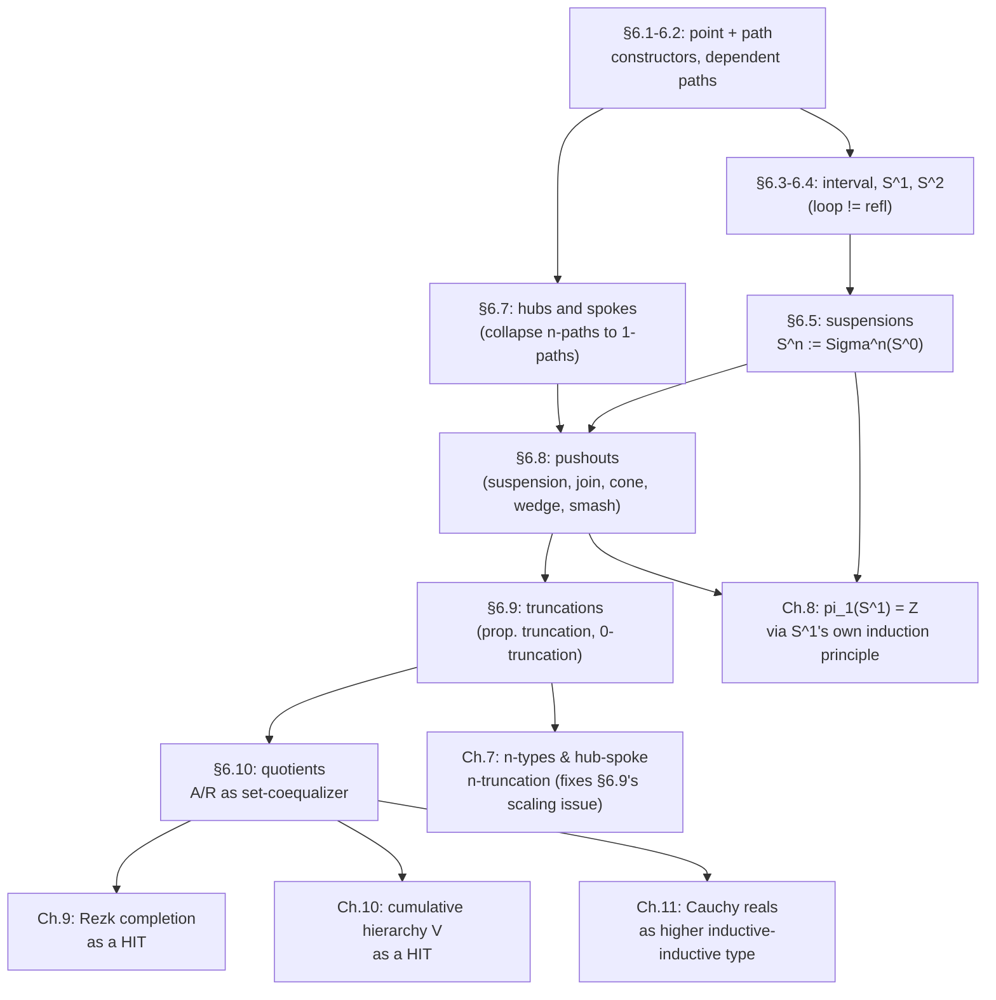

# Higher Inductive Types

[[book-guidelines|↩ Back to guidelines]]

## The problem: ordinary inductive types can only generate points

[[Type-Formers-and-Their-Universal-Properties]] and the general theory of inductive definitions gave you a recipe: pick some constructors, and you get the free type generated by them, together with a recursion/induction principle that lets you eliminate out of it. $\mathbb{N}$ is freely generated by $0$ and $\mathrm{succ}$; $\mathbf{2}$ is freely generated by $0_\mathbf{2}$ and $1_\mathbf{2}$. But every constructor of an ordinary inductive type produces a *point* — an element of the type. Once you've adopted the homotopical picture from [[Homotopical-Interpretation-of-Type-Theory]] and [[Identity-Types-and-Path-Structure]] — a type is a space, or an $\infty$-groupoid, with elements as points, $=$-proofs as paths, proofs of proofs as 2-paths, and so on — a glaring asymmetry appears. If a higher groupoid is a "multi-sorted object" with generators living in every dimension (points, paths, paths between paths, ...), why should type-generation only ever be allowed to produce dimension-0 generators?

Concretely: how would you define, as a type, the mathematician's circle $S^1$? You'd want "a point, and a loop at that point" — but a loop *is a path*, an element of an identity type, not an element of the type you're building. There is no way to write this down with the inductive-type machinery from Chapter 5. Nor can you write down, say, "the free group on a point," or "the quotient of $A$ by an equivalence relation $R$," as inductive types in the ordinary sense, because both require *imposing new path-level equations* ($x \cdot x^{-1} = e$; $a \sim b \Rightarrow q(a) = q(b)$) as part of the type's definition, not as after-the-fact theorems about an already-built type.

**Higher inductive types (HITs)** are the fix: a schema for inductive definitions whose constructors are allowed to produce not just points of the type being defined, but also *paths*, and higher paths, in that type. This chapter is where HoTT's second big innovation (after [[Formal-Metatheory#Univalence|univalence]]) lives — Chapters 8–11 build spheres, the fundamental group, categories via the Rezk completion, the cumulative hierarchy of ZF, and the real numbers, entirely as instances of the constructions developed here.

## Point constructors and path constructors (§6.1)

The paradigm example, introduced immediately, is the circle:

$$S^1 \text{ is generated by } \begin{cases} \text{a point } \mathrm{base} : S^1, \\ \text{a path } \mathrm{loop} : \mathrm{base} =_{S^1} \mathrm{base}. \end{cases}$$

The book is careful to present this as "entirely analogous" to $\mathbf{2}$ (generated by two points) or $\mathbb{N}$ (generated by a point and a function $\mathbb{N} \to \mathbb{N}$) — the only novelty is that a constructor's *codomain* can now be an identity type of the type under construction, rather than the type itself. Terminology: constructors that produce elements of $S^1$ itself (like $\mathrm{base}$) are **point constructors** or **ordinary constructors**; constructors that produce paths (like $\mathrm{loop}$) are **path constructors** or **higher constructors**. Every path constructor must name its **source** and **target** — for $\mathrm{loop}$, both are $\mathrm{base}$.

Four things need to be internalized before any of the constructions below make sense:

1. **"Generation" is free generation**, in the same sense a group is freely generated by a set of generators. Because a higher groupoid carries operations on paths (inversion, concatenation, the higher coherences from the [[Identity-Types-and-Path-Structure|Eckmann–Hilton]] toolkit), those operations act on whatever the constructors hand you and produce *more* paths that were never directly "put in." $S^1$ doesn't just contain $\mathrm{loop}$; it contains $\mathrm{loop} \cdot \mathrm{loop}$, $\mathrm{loop} \cdot \mathrm{loop} \cdot \mathrm{loop}$, $\mathrm{loop}^{-1}$, and so on, all provably distinct. This is a real departure from ordinary inductive types, where nothing exists except what the constructors put in directly.
2. **HITs cannot impose axioms**, only generate freely. You cannot directly force $\mathrm{loop} \cdot \mathrm{loop} = \mathrm{refl}_{\mathrm{base}}$ inside the definition of $S^1$. But in the $\infty$-groupoid world, "free generation" and "presentation" collapse into the same thing up to homotopy: to force two paths equal, add a *new 2-dimensional generator* relating them. This is exactly the trick §6.9's truncation constructors exploit.
3. A HIT is still, ultimately, **the inductive definition of a single type** — it is the type itself, not its identity types, that gets a universal property (an induction principle). The identity types of $S^1$ retain their ordinary path induction and get no new induction principle of their own; that's precisely why "is every path $\mathrm{base} = \mathrm{base}$ a composite of copies of $\mathrm{loop}$?" is a hard question (it's the seed of Chapter 8's computation of $\pi_1(S^1)$), not something you get for free.
4. **Constructor dimension and resulting homotopical complexity are decoupled.** A constructor $A \to B$ with no paths in sight still drags in every path and higher path of $A$. And, strikingly, a higher inductive type can generate homotopy in dimensions its constructors never mention directly — the 2-sphere $S^2$ (generated by a point and a single 2-path $\mathrm{surf}$) contains a nontrivial *3*-dimensional path, an incarnation of the Hopf fibration you'll meet again in the synthetic-homotopy-theory chapter.

**What breaks without path constructors, concretely (Rust).** A Rust `enum` is exactly an ordinary inductive type — it can only manufacture *values*:

```rust
enum Bool2 { Zero, One }        // fine: point constructors only

enum Circle {
    Base,                        // a point constructor: fine
    // Loop(Base, Base),         // NOT EXPRESSIBLE: Rust has no type
                                  // of "proofs that Base == Base" to
                                  // return a fresh inhabitant of;
                                  // Rust's equality is either derived
                                  // structural equality (decidable,
                                  // proof-irrelevant) or nothing.
}
```
There is no slot in Rust's type system for "a new, freely-generated witness of an equality" — equality in Rust (via `PartialEq`/`Eq`) is a boolean-valued *relation you check*, never a *type you inhabit with a specific, trackable proof term*. This is the single cleanest illustration of why proof-relevant identity types (from [[Identity-Types-and-Path-Structure]]) are a prerequisite for this entire chapter: HITs are only expressible in a system where "$x = y$" is itself a type that can have interesting, distinguishable inhabitants.

## Induction principles and dependent paths (§6.2)

Constructors give you introduction rules for free; the hard part is stating the *elimination* rule — the induction principle — for something whose constructors range over multiple dimensions. The book doesn't attempt a fully general syntax here (that's deferred to §6.13); instead it builds up the pattern through the running example of $S^1$.

**Recursion principle (non-dependent case) — easy.** Given any type $B$ equipped with the same shape of structure the constructors produce — a point $b:B$ and a path $\ell : b = b$ — there's a function $f : S^1 \to B$ with
$$f(\mathrm{base}) \equiv b \qquad \text{and} \qquad \mathrm{ap}_f(\mathrm{loop}) = \ell.$$

A subtlety the book flags immediately: should these computation rules be *judgmental* or merely *propositional*? For point constructors, judgmental is unproblematic and is what's adopted: $f(\mathrm{base}) \equiv b$. For path constructors, judgmental equality doesn't even typecheck cleanly (recall $\mathrm{ap}_f$ is itself something *defined* via path induction, not primitive syntax — it would be strange for the deductive system to hard-wire equalities in terms of a derived operation), so the rule for $\mathrm{loop}$ is only **propositional**: $\mathrm{ap}_f(\mathrm{loop}) = \ell$ as a path, not a judgmental identity. This is the general policy for the whole chapter: *point-constructor computation rules are judgmental; path-constructor computation rules are propositional.* The book introduces a hybrid notation for this — $f(\mathrm{loop}) \mathrel{\mathop:}= \ell$ — signaling "propositional equality by definition."

**Dependent paths.** To state the *induction* principle (proving $\prod_{(x:S^1)} P(x)$), you need to say what it means for a path $\mathrm{loop}$ to have a path "lying over" it in a fibration $P : S^1 \to \mathcal{U}$. A path from $u : P(x)$ to $v : P(y)$ lying over $p : x = y$ is *not* simply some $u = v$ (that wouldn't even typecheck unless $P(x) \equiv P(y)$) — it's exactly the transport-mediated equality already characterized back in §2.3:
$$(u =_p^P v) :\equiv \big(\mathrm{transport}^P(p, u) = v\big). \tag{6.2.2}$$
This single piece of notation is the load-bearing device for the entire chapter — every induction principle for every HIT below is stated using it.

**Induction principle for $S^1$.** Given $P : S^1 \to \mathcal{U}$ together with a point $b : P(\mathrm{base})$ and a dependent path $\ell : b =^P_{\mathrm{loop}} b$, there is $f : \prod_{(x:S^1)} P(x)$ with $f(\mathrm{base}) \equiv b$ and $\mathrm{apd}_f(\mathrm{loop}) = \ell$. Informally: to define a section of a fibration over the circle, give a point in the fiber over $\mathrm{base}$, and a path from that point back to itself that "lies over" $\mathrm{loop}$ — i.e. is the identification, in the fiber over $\mathrm{base}$, between $\mathrm{loop}_*(b)$ and $b$ induced by transporting $b$ around the loop. This is genuinely the type-theoretic incarnation of a very concrete topological picture (a fibration over the circle, unrolled, is a mapping torus): a section is a choice of fiber point plus a path witnessing that going around the loop brings you back to where you started, up to a specified identification.

The book proves two supporting lemmas worth internalizing because their *proof technique* — not just their statements — recurs for every subsequent HIT:

- **Lemma 6.2.5** derives the non-dependent recursion principle from the (harder-looking) dependent induction principle, by instantiating $P$ at the *constant* family $\lambda x.\,A$. The subtlety is that $\mathrm{transport}^{\mathrm{const}}$ has to be threaded through explicitly, because a dependent path in a constant family isn't syntactically the same type as an ordinary path — merely equivalent to it.
- **Lemma 6.2.8 / 6.2.9** establish a *uniqueness principle* (two maps out of $S^1$ agreeing on $\mathrm{base}$ and on how they act on $\mathrm{loop}$ are equal everywhere) and package both together into the circle's **universal property**:
$$(S^1 \to A) \simeq \sum_{x:A} (x = x).$$
This equivalence is the real payoff: it says a map out of the circle is *nothing more or less than* a choice of point of $A$ together with a self-path at that point — the recursion data, repackaged as a $\Sigma$-type, is already an equivalent characterization of $S^1 \to A$, exactly the "eliminator = universal property" pattern from the h-initial-algebra treatment of ordinary inductive types.

**[[Homotopical-Interpretation-of-Type-Theory#Grounding|Grounding]] (Lean).** Lean's kernel has no primitive support for genuine higher inductive types (no path constructors) — this is a real, honest gap, not something to paper over with a strained analogy. What Lean *does* give you is `Eq.mpr`/`▸` for transporting along an ordinary equality, which is precisely `transport`, and the recursor for any inductive type is precisely the type-theoretic recursion principle described above, minus the path-constructor case. The closest Lean gets to a HIT in this book's sense is its primitive `Quotient` type, which is exactly §6.10's set-quotient — covered below, where the correspondence is exact rather than approximate.

## The interval, briefly (§6.3)

Before circles, the book warms up with the simplest possible HIT with a genuine path constructor: the interval $I$, generated by two points $0_I, 1_I : I$ and a path $\mathrm{seg} : 0_I =_I 1_I$. Two facts matter:

1. **$I$ is contractible** (Lemma 6.3.1) — up to homotopy it's just a point, exactly like the topological unit interval. The proof constructs $f : \prod_{(x:I)}(x =_I 1_I)$ by cases: $f(0_I) :\equiv \mathrm{seg}$, $f(1_I) :\equiv \mathrm{refl}_{1_I}$, and the path-constructor case reduces (after unwinding the dependent-path definition) to the trivial fact that $\mathrm{seg}^{-1}\cdot\mathrm{seg} = \mathrm{refl}_{1_I}$.
2. **Even though it's contractible, $I$ is not type-theoretically inert** — it gives an easy constructive proof of **[[Formal-Metatheory#Function extensionality|function extensionality]]** (Lemma 6.3.2), by building, for $f, g : A \to B$ with a pointwise homotopy $p$, a family of maps $p_x^e : I \to B$ sending $0_I \mapsto f(x)$, $1_I \mapsto g(x)$, $\mathrm{seg} \mapsto p(x)$, then currying: $q : I \to (A \to B)$ with $q(i) :\equiv \lambda x.\,p_x^e(i)$ interpolates from $f$ at $0_I$ to $g$ at $1_I$, and $q(\mathrm{seg})$ is exactly the desired path $f = g$.

This is the first real demonstration that HITs aren't just a way to *describe* spaces — they let you *derive* axioms (like funext, which Chapter 2 had to postulate) as theorems, provided you're willing to accept a HIT as primitive instead.

## The circle and spheres (§6.4)

**$\mathrm{loop} \neq \mathrm{refl}_\mathrm{base}$ (Lemma 6.4.1).** This is the first payoff of having a genuine induction/recursion apparatus for $S^1$: if $\mathrm{loop}$ were equal to $\mathrm{refl}_\mathrm{base}$, then for *any* type $A$ with $x:A$, $p:x=x$, the recursively-defined $f : S^1 \to A$ (with $f(\mathrm{loop}) \mathrel{\mathop:}= p$) would force $p = f(\mathrm{loop}) = f(\mathrm{refl}_\mathrm{base}) = \mathrm{refl}_x$ — i.e. *every* type would be a set (every self-path trivial). But we already know (from univalence's interaction with automorphisms, [[The-Univalence-Axiom-and-Its-Consequences]]) that not every type is a set. So $\mathrm{loop}$ is a genuinely new, nontrivial path — the circle really does have nontrivial topology, type-theoretically, not just by analogy.

**Lemma 6.4.2** sharpens this: there's an element of $\prod_{(x:S^1)}(x=x)$ not equal to the constant $x \mapsto \mathrm{refl}_x$ (built by setting $f(\mathrm{base}) :\equiv \mathrm{loop}$ and checking the path-constructor obligation reduces, via the conjugation formula $\mathrm{transport}^{x\mapsto x=x}(p,q) = p^{-1}\cdot q\cdot p$, to the trivial cancellation $\mathrm{loop}^{-1}\cdot\mathrm{loop}\cdot\mathrm{loop} = \mathrm{loop}$). The corollary is sharp: **if the universe $\mathcal U$ contains $S^1$, then $\mathcal U$ is not a 1-type** — univalence turns $S^1 =_\mathcal{U} S^1$ into $S^1 \simeq S^1$, whose identity type (self-equivalences of $\mathrm{id}_{S^1}$) is exactly the type Lemma 6.4.2 showed to be non-trivial-pathed. Higher inductive types are, concretely, what forces the universe to have genuinely higher homotopical structure.

**$S^2$ and beyond.** The 2-sphere is generated by a point $\mathrm{base}$ and a *2-dimensional* path constructor $\mathrm{surf} : \mathrm{refl}_\mathrm{base} = \mathrm{refl}_\mathrm{base}$ (a path between the two "trivial" paths in $\mathrm{base}=\mathrm{base}$). Stating its induction principle honestly requires machinery the book builds on the spot: $\mathrm{ap}^2_f$ (the action of $f$ on 2-paths, Lemma 6.4.4), a two-dimensional `transport` (Lemma 6.4.5), dependent 2-paths (defined analogously to 6.2.2 but one dimension up), and $\mathrm{apd}^2_f$ (Lemma 6.4.6) — each constructed by path induction, exactly mirroring the 1-dimensional story. The pattern is clear but the bookkeeping visibly explodes with dimension, which is precisely the motivation for the next two sections (suspensions, then hubs-and-spokes): find a *systematic* way to build higher spheres that doesn't require reinventing $\mathrm{ap}^n$ and dependent $n$-paths by hand each time.

The systematic alternative sketched here: define $S^n$ directly as generated by $\mathrm{base}$ and an **$n$-loop** $\mathrm{loop}_n : \Omega^n(S^n, \mathrm{base})$, using the iterated loop space $\Omega^n$ from [[Homotopical-Interpretation-of-Type-Theory]] — but the book defers the *good* construction of spheres to suspensions.

## Suspensions (§6.5)

The **suspension** $\Sigma A$ is "the universal way of turning points of $A$ into paths" — generated by two points $N, S : \Sigma A$ (north/south pole) and a *function* $\mathrm{merid} : A \to (N =_{\Sigma A} S)$ assigning a meridian path to every point of $A$. This single mechanism is doing something more powerful than it looks: because $\mathrm{merid}$ is a *function into a path type*, points of $A$ become paths in $\Sigma A$, and — automatically, for free, via the higher-groupoid structure — paths in $A$ become 2-paths in $\Sigma A$, and so on up the dimension ladder. This is exactly the "hubs and spokes" idea one section early, applied to the domain of the generator rather than to a separate cone construction.

**$\Sigma \mathbf{2} \simeq S^1$ (Lemma 6.5.1).** With $A = \mathbf{2} = S^0$, the two meridians $\mathrm{merid}(0_\mathbf{2})$ and $\mathrm{merid}(1_\mathbf{2})$ from $N$ to $S$ glue together (concatenate one, invert the other) into exactly one loop at a single basepoint — the proof is a genuinely nontrivial back-and-forth induction (constructing mutually-inverse maps $f: \Sigma\mathbf 2 \to S^1$ and $g: S^1 \to \Sigma\mathbf 2$ and checking both composites are homotopic to the identity by induction on each HIT), but the topological intuition ("collapse two meridians of a bigon into one loop") is exactly right. This licenses the beautifully economical recursive definition of *all* the spheres:
$$S^0 :\equiv \mathbf{2}, \qquad S^{n+1} :\equiv \Sigma S^n,$$
(you can even push one dimension further, $S^{-1} :\equiv \mathbf{0}$, with $\Sigma\mathbf{0} \simeq \mathbf{2}$ closing the pattern). No more hand-rolled dependent-$n$-path bookkeeping is needed — every sphere is built from one uniform two-generator-plus-a-function schema, applied iteratively.

**The universal property, via based maps.** Writing $\mathrm{Map}_*(A,B) :\equiv \sum_{f:A\to B}(f(a_0)=b_0)$ for based maps between pointed types, the pushout-style universal property of $\Sigma A$ (Lemma 6.5.3, 6.5.4) delivers the adjunction
$$\mathrm{Map}_*(\Sigma A, B) \simeq \mathrm{Map}_*(A, \Omega B),$$
proved by a genuinely satisfying chain of $\Sigma$-type re-associations and contractibility arguments (Lemma 3.11.8/3.11.9 collapsing $\sum_{b:B}(b=b_0)$ to a point). Chaining this $n$ times over $S^n = \Sigma^n S^0$ recovers $\mathrm{Map}_*(S^n,B) \simeq \Omega^n B$ — the loop-space characterization of spheres from §6.4 falls out as a *corollary* of the suspension-based one, rather than needing to be built by hand. This suspension–loop-space adjunction is the type-theoretic seed of the Freudenthal suspension theorem in Chapter 8.

**Grounding (Rust as contrast, Lean as parallel).** There is no Rust encoding of $\Sigma A$ worth writing down — Rust genuinely cannot express "a function into a proof type," for the same reason it couldn't express $\mathrm{loop}$ directly. The honest analogy that *does* transfer is structural: `merid : A -> (N = S)` is a *dependently-typed higher-order constructor* — closest in spirit to a Rust `enum` variant that would need to carry, as a field, a proof term of a propositional-equality GADT that Rust's type system has no way to express. This is worth sitting with rather than forcing past: it's a genuine boundary of what mainstream typed functional/systems languages can encode, which is part of why HITs are interesting as a foundational device.

## Cell complexes (§6.6) and hubs and spokes (§6.7)

**Cell complexes.** Any finite CW complex — built classically by attaching $n$-discs along $(n-1)$-boundary spheres — becomes a HIT by turning discs into $n$-paths whose source/target are composites of lower-dimensional path constructors. The book's example is the torus $T^2$, generated by a point $b$, two loops $p, q : b = b$, and a **2-path** $t : p \cdot q = q \cdot p$ (the classic "$aba^{-1}b^{-1}$" relator of the torus's fundamental group, expressed not as an algebraic relation on an already-built group but as a literal generator of the space itself). Its induction principle already requires a *composition operation for dependent paths* to even state — the bookkeeping visibly compounds with every extra dimension of constructor, echoing the $S^2$ experience above.

**Hubs and spokes: the fix.** Rather than accept ever-more-baroque machinery for $n$-dimensional path constructors, §6.7 shows every higher path constructor is *equivalent* to a bundle of ordinary 1-dimensional ones, via a cone construction: an $n$-dimensional disc = a cone point (the **hub**) plus a continuous family of 1-dimensional paths (the **spokes**) connecting the hub to every point of an $(n-1)$-dimensional boundary sphere. Concretely, the torus's 2-path $t$ can be replaced by:

- an extra point $h : T^2$ (the hub),
- for each $x : S^1$, a 1-dimensional path $s(x) : f(x) = h$, where $f : S^1 \to T^2$ sends $\mathrm{base} \mapsto b$ and $\mathrm{loop} \mapsto p\cdot q\cdot p^{-1}\cdot q^{-1}$ (i.e. the boundary loop the 2-cell was meant to fill).

This buys back everything — no dependent 2-paths, no $\mathrm{apd}^2$ — at the cost of one extra point and a family of ordinary path constructors indexed by $S^1$. (The book flags a subtlety worth remembering: you genuinely need the separate hub point; naively gluing the boundary directly to a point *on* the boundary, without a fresh hub, produces a twisted cone whose vertex loop needn't be reflexivity — Figures 6.4/6.5 in the source make the failure mode vivid.) The one thing this translation *doesn't* preserve is judgmental computation rules for the collapsed higher paths — they degrade to propositional, though the propositional content is preserved exactly.

The suspension of §6.5 is retroactively recognizable as a special case of exactly this idea (a "1-dimensional path constructor parametrized by the type being suspended"), which is why suspension alone was already powerful enough to build every sphere without needing $n$-loops directly.

## Pushouts (§6.8)

Ordinary type formers already gave you categorical *limits* — products, and (via $\Sigma$-types and identity types) pullbacks. **Colimits**, which require identifying elements from *different* types, are where HITs become indispensable, because "identifying $f(c)$ and $g(c)$" is precisely a path constructor.

Given a span $D = (A \xleftarrow{f} C \xrightarrow{g} B)$, the **pushout** $A \sqcup_C B$ is the HIT generated by:
$$\mathrm{inl} : A \to A\sqcup_C B, \qquad \mathrm{inr} : B \to A\sqcup_C B, \qquad \mathrm{glue}(c) : \mathrm{inl}(f(c)) =_{A\sqcup_C B} \mathrm{inr}(g(c)) \text{ for each } c:C.$$

The recursion principle needs, for a target $D$: values on $\mathrm{inl}$ and $\mathrm{inr}$, and for each $c:C$ a path witnessing $s(\mathrm{inl}(f(c))) = s(\mathrm{inr}(g(c)))$ — call this data a **cocone** under $D$ with vertex $D$, $\mathrm{cocone}_D(D) :\equiv \sum_{i:A\to D}\sum_{j:B\to D}\prod_{c:C}(i(f(c))=j(g(c)))$. **Lemma 6.8.2** is the universal property proper:
$$(A \sqcup_C B \to E) \simeq \mathrm{cocone}_D(E),$$
proved (as with the circle) by exhibiting explicit, mutually-inverse maps `t ↦ t∘c⊔` and `c ↦ s(c)`, and checking both round-trips by cases/induction — the same shape of proof recurs across the whole chapter because the *shape* of a HIT's universal property is always "eliminators are equivalent to structured data on the target," proved by unfolding the recursion principle's defining equations in both directions.

**Pushouts subsume a family of familiar constructions**, each a special-case span:

| Span | Pushout |
|---|---|
| $\mathbf 1 \leftarrow A \to \mathbf 1$ | suspension $\Sigma A$ |
| $A \xleftarrow{\mathrm{pr}_1} A\times B \xrightarrow{\mathrm{pr}_2} B$ | join $A * B$ |
| $\mathbf 1 \leftarrow A \xrightarrow{f} B$ | cone / cofiber of $f$ |
| $A \xleftarrow{a_0} \mathbf 1 \xrightarrow{b_0} B$ (pointed) | wedge $A \vee B$ |
| cone of $A\vee B \to A\times B$ | smash product $A \wedge B$ |

This table is worth internalizing as a small dictionary rather than a curiosity — Chapters 7 and 8 build on it directly (e.g. connectedness of suspensions, the Hopf fibration via joins).

**Colimits don't preserve truncatedness (Remark 6.8.4).** The pushout of the *sets* $\mathbf 1 \leftarrow S^0 \to \mathbf 1$ is $S^1$ — not a set! This single observation is the motivating crack that forces the next section: if you want colimits *within* the category of sets (or of $n$-types generally), you can't just take the naive homotopy pushout — you have to truncate.

## Truncations (§6.9)

The propositional truncation $\|A\|$ from [[The-Propositions-as-Types-Correspondence]] turns out to *be* a HIT — a genuinely illuminating unification, since it reduces "understanding truncation" to "understanding HITs," which are at least amenable to a uniform treatment. Definition:
$$\|A\| \text{ generated by} \begin{cases} |{-}| : A \to \|A\|, \\ \text{for each } x,y:\|A\|,\ \text{a path } x=y. \end{cases}$$

The second constructor is, by construction, exactly the assertion "$\|A\|$ is a mere proposition" — it's a path constructor whose source and target *range over the type being defined itself* (the first genuinely recursive HIT in the chapter, alongside $\mathrm{succ}:\mathbb N\to\mathbb N$ as the recursive-input archetype for ordinary inductive types). Its recursion principle recovers exactly the §3.7 formulation (map into a mere proposition), and the accompanying induction principle turns out to be nearly vacuous, since any two functions into a mere proposition automatically agree.

**Generalizing to $n$-truncation.** The natural next move — generate $\|A\|_0$ (the "**0-truncation**," i.e. the free set on $A$) by $|{-}|_0 : A \to \|A\|_0$ plus, for all $x,y:\|A\|_0$ and $p,q:x=y$, a path $p=q$ — works, and yields the expected universal property $(\|A\|_0 \to B) \simeq (A \to B)$ for any *set* $B$ (**Lemma 6.9.2**, proved via a genuinely useful intermediate result, **Lemma 6.9.1**, that induction into any *set*-valued family only needs the point-constructor case). This is immediately useful: it lets you truncate any pushout of sets down to a genuine set-pushout, restoring the colimit you lost in Remark 6.8.4.

But the book is candid about two real defects of this presentation, worth flagging because they motivate later machinery (§7.3's hub-and-spoke-based $n$-truncation):

1. The second constructor's inputs ("for any $x,y$ and any $p,q:x=y$...") range over *paths* in the type being defined, which doesn't fit cleanly into a "constructor takes points, produces points-or-paths" schema — though it can be tamed by an auxiliary parametrizing type $S$ (two points, two parallel paths — itself equivalent to $S^1$!) reducing it to "for every $f:S\to\|A\|_0$, a path $\mathrm{ap}_f(p)=\mathrm{ap}_f(q)$."
2. Worse, this style of definition **doesn't scale in $n$**: an $n$-truncation constructor generalizing this pattern would need an ever-growing number of arguments as $n$ grows. Chapter 7 replaces this whole approach with a uniform hub-and-spoke construction — which is exactly why §6.7 was worth building carefully now.

## Quotients (§6.10)

The set-quotient is the higher-inductive-type payoff with the most direct, load-bearing connection to ordinary programming and to Lean specifically. For a set $A$ and a mere relation $R : A \to A \to \mathrm{Prop}$, the **set-quotient** $A/R$ is generated by:
$$q : A \to A/R, \qquad \text{for each } a,b:A \text{ with } R(a,b),\ \text{an equality } q(a)=q(b), \qquad \text{plus a 0-truncation constructor.}$$

Two structural facts anchor everything downstream: $q$ is **surjective** (Lemma 6.10.2 — trivial by induction since surjectivity is a mere proposition, so it automatically respects the path constructors) and $A/R$ has the expected **universal property of a (set-)coequalizer**:
$$(A/R \to B) \simeq \sum_{f:A\to B}\prod_{a,b:A} \big(R(a,b) \to (f(a)=f(b))\big) \quad \text{for any set } B. \tag{Lemma 6.10.3}$$

When $R$ is a genuine equivalence relation (reflexive, symmetric, transitive), an alternative "impredicative" construction mimics classical set theory's equivalence-classes-as-subsets: $A\,/\!\!/R :\equiv \{P : A \to \mathrm{Prop} \mid P \text{ merely equals some } R(a,{-})\}$ with $q'(a) :\equiv R(a,{-})$. **Theorem 6.10.6** proves $A\,/\!\!/R \simeq A/R$, but flags a genuine cost of the impredicative route: it *raises universe level* (you need $\mathrm{Prop}_{\mathcal U_i}$ to quantify over predicates valued in $\mathrm{Prop}_{\mathcal U_i}$, landing $A\,/\!\!/R : \mathcal U_{i+1}$), unless you assume propositional resizing — the HIT-based $A/R$ has no such cost, which is a real, practical argument in its favor, not just an aesthetic one.

**The integers, and when you can skip the general machinery.** $\mathbb{Z} :\equiv (\mathbb{N}\times\mathbb{N})/\!\sim$ with $(a,b)\sim(c,d) :\equiv (a+d=b+c)$ is the running example (a pair $(a,b)$ represents $a - b$). But $\mathbb Z$ also has *canonical representatives* ($(n,0)$ or $(0,n)$), and **Lemma 6.10.8** captures exactly when this shortcut is available: if there's an idempotent $r : A \to A$ with $(r(x)=r(y)) \simeq (x\sim y)$, then $\sum_{x:A}(r(x)=x)$ — literally, "the fixed points of $r$" — already satisfies the quotient's universal property, with no HIT required at all. This is worth internalizing as a general design pattern: *a quotient by an equivalence relation can be replaced by a subset of canonical forms whenever a computable normalizing idempotent exists* — a statement that generalizes cleanly to **Corollary 6.10.10** (any retraction $p:A\to B$ between sets exhibits $B$ as the quotient of $A$ by "same image under $p$").

**Grounding (Lean — exact, not approximate).** This is the one construction in the chapter Lean supports *natively and exactly*, because Lean's kernel has a primitive `Quotient` type built for precisely this universal property:

```lean
-- Lean's kernel-primitive quotient, matching A/R from §6.10 exactly:
--   Quotient.mk    : A → Quotient r                  (this is `q`)
--   Quotient.sound : r a b → Quotient.mk a = Quotient.mk b   (the path constructor)
--   Quotient.lift  : (f : A → B) → (∀ a b, r a b → f a = f b) → Quotient r → B
--                    -- this IS Lemma 6.10.3's right-to-left direction, verbatim

def IntPair := Nat × Nat

def intPairRel (p q : IntPair) : Prop :=
  p.1 + q.2 = p.2 + q.1        -- (a,b) ~ (c,d) :≡ a + d = b + c

def MyInt := Quotient (Setoid.mk intPairRel (by constructor <;> intros <;> omega))

def myAdd : MyInt → MyInt → MyInt :=
  Quotient.lift₂
    (fun p q => Quotient.mk _ (p.1 + q.1, p.2 + q.2))
    (by intros; simp_all [intPairRel]; omega)
```
`Quotient.sound` *is* the book's path constructor; `Quotient.lift` *is* Lemma 6.10.3's universal-property map; the 0-truncation constructor is implicit in Lean because `Quotient` is specified to land in `Prop`-irrelevant/proof-irrelevant equality territory by fiat (Lean doesn't need to state it as a separate generator the way the book must, because Lean's `Eq` on a `Quotient` is already handled at the kernel level). If you're building the elaborator described in your learning goals, this is the one piece of this chapter worth treating as **directly transferable, not background**: any time your unifier needs to decide $t_1 \overset{?}{=} t_2$ where $t_1,t_2$ are quotient-typed terms, it is doing exactly the job `Quotient.lift`'s side-condition proof discharges here — checking that a putative function respects the relation before it's allowed to descend to the quotient.

## Where this leads



Within the book's own arc, this chapter is the direct prerequisite for essentially everything homotopically interesting that follows: Chapter 7's $n$-truncation is built by patching exactly the scaling defect flagged in §6.9, using the hub-and-spoke idea from §6.7; Chapter 8's headline computation $\pi_1(S^1)\cong\mathbb Z$ is proved by an encode–decode argument that is *literally an application of $S^1$'s induction principle from §6.2*, nothing more exotic; Chapter 9's Rezk completion, Chapter 10's cumulative hierarchy $V$, and Chapter 11's Cauchy reals are all presented, explicitly, as higher (inductive-inductive) types built from the same constructor vocabulary developed here.

**Relative to the standing project:** per the current learning-goals scope, this chapter's spaces-and-spheres content (circles, suspensions, cell complexes) is background rather than a direct target — you're not building a homotopy-theory library. But two pieces of mechanism here *are* directly load-bearing and worth carrying forward explicitly: (1) the point/path-constructor split, and its "judgmental for points, propositional for paths" computation-rule policy, is a clean illustration of exactly the definitional-vs-propositional-equality boundary your elaborator's `isDefEq` has to draw everywhere, not just for HITs; and (2) §6.10's set-quotient, as shown above, is *identical* to Lean's primitive `Quotient`, and the discipline of "a function out of a quotient must be proved to respect the relation before it descends" is the same discipline your unifier needs whenever it treats definitionally-related terms as interchangeable.
