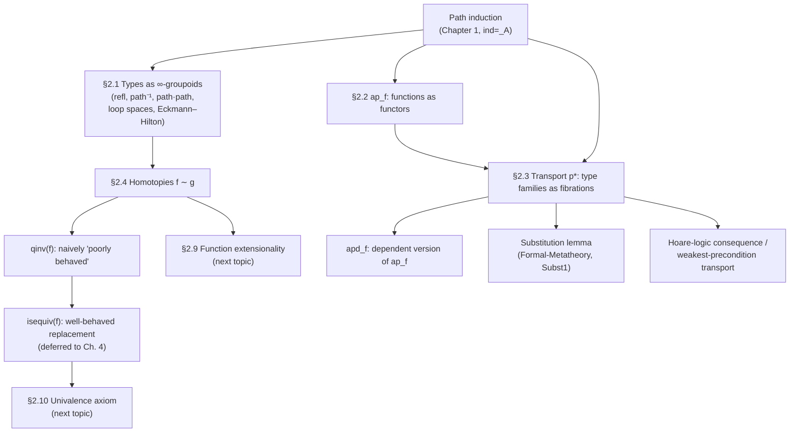

[[book-guidelines|↩ Back to guidelines]]

# Homotopical Interpretation of Type Theory

## What this chapter is actually doing

[[Type-Theory-as-a-Foundational-System]] established that propositional equality $a =_A b$ is a *type*, not a truth value — you don't check it, you inhabit it. What that earlier topic deliberately left open is: what *is* an element of $x =_A y$, structurally? Chapter 1's answer was purely operational — you get one via path induction, you can compose and invert them — but it never said what kind of mathematical object a proof of equality *is*.

This chapter answers that question by *reinterpreting* everything from Chapter 1 through a single lens: **types are spaces, and elements of $x =_A y$ are paths between the points $x$ and $y$.** This is not a metaphor bolted on afterward — the chapter's central claim, proved rather than asserted, is that the entire apparatus of paths-and-homotopies falls out *automatically* from the induction principle for identity types you already have. Nothing new is postulated. The homotopical structure was already implicit in the rules from Chapter 1; this chapter just makes it explicit.

## Why classical homotopy theory needs a *coarser* notion of "same path"

Before touching type theory, the source motivates the whole apparatus with an observation from classical topology. A path in a space $X$ is a continuous map $p : [0,1] \to X$. Two natural operations exist: **concatenation** $p \cdot q$ (walk $p$, then walk $q$) and **inversion** $p^{-1}$ (walk $p$ backwards). But these don't satisfy the equations you'd want *on the nose*: $p \cdot p^{-1}$ (walk out and immediately back) is a different *function* $[0,1]\to X$ than the constant path at the start point — even though intuitively "you end up back where you started and nothing happened." Strict, pointwise function equality is too fine-grained to capture this intuition.

The fix is **homotopy**: a continuous deformation $H : [0,1]\times[0,1] \to X$ from one path to another, itself thought of as a "2-dimensional path between paths." Iterating — homotopies between homotopies, and so on forever — produces an **($\infty$-)groupoid**: a structure with objects, morphisms between objects, morphisms between morphisms, etc., where composition/identity/inverses hold only *up to* the next level up (a *weak* groupoid), which is exactly why you need coherence data like Mac Lane's pentagon for associativity-of-associativity.

**Why this matters for you specifically:** this is the conceptual seed of proof-relevance. In classical (extensional) logic, "$a$ equals $b$" is a *fact* — true or false, with no internal structure. Here, "$a$ equals $b$" is a *space of evidence*, and different pieces of evidence can themselves be non-equal in interesting ways. This is precisely the discipline that makes proof terms first-class, checkable, and composable objects rather than opaque yes/no oracle answers — the same discipline a proof-producing verification pipeline needs if it wants to certify, not just assert, that a verification condition holds.

## Types as higher groupoids: the free lunch from path induction

The remarkable claim opening §2.1 is that you get *all* of this $\infty$-groupoid structure for free, purely from the recursion principle for identity types stated in Chapter 1 (path induction / `ind_{=_A}`, called `J` in most modern presentations). Concretely, from path induction alone the chapter derives, as genuine theorems with genuine (if verbose) constructive proofs:

- **Symmetry / inversion** (Lemma 2.1.1): for every $p : x =_A y$ there is $p^{-1} : y =_A x$, with $\mathrm{refl}_x^{-1} \equiv \mathrm{refl}_x$ *judgmentally*.
- **Transitivity / concatenation** (Lemma 2.1.2): for $p : x=_Ay$, $q : y=_Az$, there is $p \cdot q : x =_A z$, with $\mathrm{refl}_x \cdot \mathrm{refl}_x \equiv \mathrm{refl}_x$.
- **Groupoid laws, but only propositionally** (Lemma 2.1.4): $p \cdot \mathrm{refl}_y = p$, $p^{-1}\cdot p = \mathrm{refl}_y$, $(p^{-1})^{-1} = p$, associativity $p\cdot(q\cdot r) = (p\cdot q)\cdot r$ — every one of these holds only up to a *further* path, not judgmentally. This is the crucial departure from set-theoretic intuition, where "equality is transitive" is a bare fact with no internal witness worth naming.

[[Sets-in-Univalent-Foundations#The construction|The construction]] pattern is always the same: define a motive $D$ over $(x,y,p)$, supply a base case at $(x,x,\mathrm{refl}_x)$, and let path induction do the rest. Here it is once, in full, for inversion (Lemma 2.1.1):

$$D(x,y,p) :\equiv (y =_A x) \qquad d :\equiv \lambda x.\, \mathrm{refl}_x : \prod_{x:A} D(x,x,\mathrm{refl}_x) \qquad p^{-1} :\equiv \mathrm{ind}_{=_A}(D,d,x,y,p)$$

**Lean framing — this is `Eq.rec`/`J`, not a metaphor for it.** In Lean, `Eq.rec` (the eliminator generated automatically for the inductively-defined `Eq` type, and the term `cases h` or `subst h` compile down to) *is* $\mathrm{ind}_{=_A}$. The book's "First proof" style, spelling out $D$ and $d$ explicitly, is literally what happens under the hood when you write `Eq.symm`:

```lean
theorem eq_symm {A : Type} {x y : A} (p : x = y) : y = x :=
  p ▸ rfl   -- `▸` is transport/rewriting by `p`; here it specializes to symmetry
            -- via the motive Lean infers, exactly the D(x,y,p) := (y = x) above

-- or, spelled out via the eliminator directly, matching the book's "first proof":
theorem eq_symm' {A : Type} {x y : A} (p : x = y) : y = x :=
  Eq.rec (motive := fun y _ => y = x) rfl p
```

The book's "second proof" style — "by induction, it suffices to assume $p$ is $\mathrm{refl}_x$" — is exactly what a `cases p` or `subst p` tactic invocation does informally: it's the *user-facing* shorthand for the same `Eq.rec` application, which is why Lean tactics can get away with never mentioning the motive explicitly in the easy cases (elaboration infers $D$ by unification against the goal).

## Proof-relevance made concrete: which proof of transitivity?

The chapter makes a point that's easy to skate past but is exactly the kind of thing that bites you in a real implementation: Lemma 2.1.2 (transitivity/concatenation) has *three* different valid proofs — induct on $p$ only, induct on $q$ only, or induct on both — and they are **not judgmentally equal**, even though they're all propositionally equal and prove the same *statement*. Inducting only on $p$ gives the computation rule $\mathrm{refl}_y \cdot q \equiv q$ (right side reduces "for free"); inducting only on $q$ gives $p \cdot \mathrm{refl}_y \equiv p$; inducting on both gives only the symmetric, weaker $\mathrm{refl}_x \cdot \mathrm{refl}_x \equiv \mathrm{refl}_x$.

**Why this is load-bearing, not a curiosity.** This is a direct, concrete instance of something you will hit constantly when writing an elaborator or a proof-term-producing tactic: *the term you produce is part of the specification, not just the type it inhabits.* Two tactics that both "prove associativity" can hand the kernel definitionally different terms, and which one you pick determines what reduces judgmentally later (i.e., what the `isDefEq` check accepts for free versus what needs an explicit rewrite). A proof-search or tactic-elaboration engine that doesn't track this can produce technically-correct-but-computationally-inconvenient proof terms — this is precisely why real systems care about *definitional* unfolding behavior of standard library lemmas, not just their logical content.

## Loop spaces, iterated loops, and the Eckmann–Hilton argument

A path from a point to *itself*, $\Omega(A,a) :\equiv (a=_Aa)$, is uninteresting classically ($a=a$ is just "true") but carries real structure homotopically — concatenation gives $\Omega(A,a)\times\Omega(A,a)\to\Omega(A,a)$, a "higher group" operation. Iterating, $\Omega^{n+1}(A,a) :\equiv \Omega^n(\Omega(A,a))$, gives the **$n$-fold iterated loop space**.

The chapter's showpiece result here is the **Eckmann–Hilton argument** (Theorem 2.1.6): the composition operation on the *second* loop space $\Omega^2(A)$ is **commutative**, $\alpha \cdot \beta = \beta \cdot \alpha$. The proof is a genuinely elegant piece of 2-dimensional path algebra — it defines a "horizontal composition" $\star$ via whiskering (composing a 2-path with a 1-path on either side), shows that when everything degenerates to loops-at-a-point, ordinary concatenation $\cdot$ and horizontal composition $\star$ coincide *both* ways round ($\alpha\star\beta = \alpha\cdot\beta$ and $\alpha\star'\beta = \beta\cdot\alpha$), and concludes $\alpha\cdot\beta = \alpha\star\beta = \alpha\star'\beta = \beta\cdot\alpha$. This is the type-theoretic reconstruction of the classical topological fact that $\pi_n$ is abelian for $n\ge 2$ — and the source flags explicitly that it will be reused later ([[Synthetic-Homotopy-Theory]]) to show higher homotopy groups are always abelian.

## Functions are functors: `ap`

Once types carry groupoid structure, an ordinary function $f : A \to B$ must act on that structure, not just on points — this is `ap` (**a**ction on **p**aths, Lemma 2.2.1):

$$\mathrm{ap}_f : (x=_Ay) \to (f(x) =_B f(y)), \qquad \mathrm{ap}_f(\mathrm{refl}_x) \equiv \mathrm{refl}_{f(x)}$$

and it obeys exactly the laws you'd demand of a functor between groupoids (Lemma 2.2.2): $\mathrm{ap}_f(p\cdot q) = \mathrm{ap}_f(p)\cdot\mathrm{ap}_f(q)$, $\mathrm{ap}_f(p^{-1}) = \mathrm{ap}_f(p)^{-1}$, $\mathrm{ap}_g(\mathrm{ap}_f(p)) = \mathrm{ap}_{g\circ f}(p)$, $\mathrm{ap}_{\mathrm{id}_A}(p)=p$ — identity and composition preserved, exactly the functor laws. This is *why* the book calls every function "continuous": in the homotopical reading, "continuous" just means "acts coherently on paths," and every function in type theory does this automatically, for free, by construction — you never have to separately verify continuity the way you would for an arbitrary set-theoretic function.

**Rust framing.** This is the same shape as a lawful `Functor`/`Map` implementation: `map` on `Option<T>`, `Vec<T>`, `Result<T, E>` all have to satisfy `map(id) == id` and `map(g ∘ f) == map(g) ∘ map(f)` — the functor laws — and a buggy `map` implementation that violates them is exactly analogous to a hypothetical `ap_f` that didn't compose correctly. The difference is that in HoTT these laws aren't things you have to *test* or *trust the implementer* on — they're *proved*, once, generically, for every function, as a direct consequence of path induction.

## Type families are fibrations: transport

Here's the genuinely new machinery this chapter introduces, and it's the single most consequential idea in the topic for your project. `ap_f` only handles *non-dependent* functions $f:A\to B$. For a dependent function $f : \prod_{x:A} P(x)$, the naive question "$f(x) = f(y)$?" doesn't even typecheck when $x \ne y$ judgmentally — $f(x) : P(x)$ and $f(y) : P(y)$ live in *different types*. A path $p : x=_Ay$ has to first supply a way of relating $P(x)$ and $P(y)$ before any comparison is possible.

That relating function is **transport** (Lemma 2.3.1):

$$p_* : P(x) \to P(y) \qquad \text{for } p : x=_Ay,\; P : A \to \mathcal{U}$$

defined by path induction exactly like everything else — in the reflexivity case, $(\mathrm{refl}_x)_*$ is just the identity function on $P(x)$. Topologically, $P : A \to \mathcal{U}$ is read as a **fibration**: $A$ is the base space, $P(x)$ is the fiber over $x$, and $\sum_{x:A}P(x)$ (with its first projection to $A$) is the total space. Transport is exactly **path lifting**: given a path $p$ in the base and a point $u:P(x)$ in the fiber over its start, $p_*(u)$ is the endpoint of the unique lift of $p$ starting at $u$ — made fully explicit in type theory (Lemma 2.3.2, `lift(u,p) : (x,u) = (y,p_*(u))` in $\sum_{x:A}P(x)$), where classical homotopy theory only *postulates* that such liftings exist.

The dependent version of `ap` is then `apd` (Lemma 2.3.4):

$$\mathrm{apd}_f : \prod_{p:x=y} \big(p_*(f(x)) =_{P(y)} f(y)\big)$$

— you transport $f(x)$ forward along $p$ *first*, and only then compare it to $f(y)$, since now both sides live in $P(y)$. When $P$ is a *constant* family ($P(x):\equiv B$), transport reduces to the identity up to a coherence path (`transportconst`, Lemma 2.3.5), and `apd` and `ap` become interderivable (Lemma 2.3.8) — the dependent machinery specializes correctly back down to the non-dependent case.

**This is where your project's "substitution" thread lives, made maximally general.** Transport is the type-theoretic generalization of substitution: `Subst1` from [[Formal-Metatheory]] — "if $\Gamma\vdash a:A$ and $\Gamma,x{:}A,\Delta \vdash b:B$ then $\Gamma,\Delta[a/x]\vdash b[a/x]:B[a/x]$" — is exactly transport along the judgmental-equality-degenerate case of a path. More strikingly for the verification side of your project: `transportP(p, –) : P(x) → P(y)` is *precisely* the shape of a Hoare-logic consequence rule or a weakest-precondition transformer restricted to a single substitution step — "if property $P$ held relative to state/witness $x$, and $p$ certifies $x$ and $y$ are interchangeable, then $P$ transported along $p$ holds relative to $y$." A refinement-type checker's handling of `{v : A | φ(v)}` under a substitution `[a/x]` is doing transport on the refinement predicate viewed as a type family $P : A \to \mathcal{U}$ (or $A \to \mathrm{Prop}$) — get the transport/substitution machinery right here and you get substitution-based soundness arguments largely for free, because they're the *same* lemma, just instantiated at different targets (types-as-propositions vs. types-as-spaces).

## Homotopies between functions, and why "isomorphism" needed replacing

Two (possibly dependent) functions $f,g:\prod_{x:A}P(x)$ are compared pointwise via a **homotopy** (Definition 2.4.1):

$$(f \sim g) :\equiv \prod_{x:A} \big(f(x) =_{P(x)} g(x)\big)$$

Crucially, $f\sim g$ is *not the same type* as the identification $f=g$ (that equivalence — function extensionality — is a genuine additional axiom, taken up in the [[The-Univalence-Axiom-and-Its-Consequences|next topic]]'s §2.9). Homotopy is an equivalence relation (Lemma 2.4.2) and is automatically **natural** (Lemma 2.4.3): $H(x)\cdot g(p) = f(p)\cdot H(y)$ for $H:f\sim g$ and $p:x=y$ — a homotopy behaves exactly like a natural transformation between the functors $f$ and $g$, commuting square and all.

This sets up the chapter's final, most consequential definitional move. The naive "isomorphism" — $f:A\to B$ with $g:B\to A$ such that $f\circ g\sim \mathrm{id}_B$ and $g\circ f\sim\mathrm{id}_A$ — is called a **quasi-inverse** (Definition 2.4.6), and the type of *all* quasi-inverses of a fixed $f$, $\mathrm{qinv}(f)$, turns out to be **poorly behaved**: a single $f$ can have multiple, genuinely non-equal quasi-inverse witnesses. Proof-relevance bites here in a way it didn't for symmetry/transitivity: you don't just want *some* type expressing "f is invertible," you want one with the right *proof-theoretic* properties (in particular, being a mere proposition — at most one proof, up to equivalence). The chapter defines the fix, `isequiv(f)`, only by its required properties for now (logically equivalent to `qinv(f)`, but itself contractible-when-inhabited) and defers the actual construction and its correctness proof to [[Equivalences-and-Their-Characterizations|Chapter 4]] — flagging explicitly that several different-looking definitions of `isequiv` all turn out to be equivalent, which is itself a nontrivial theorem.

**Why this general shape recurs in unification.** The gap between "some evidence of a relationship exists" (`qinv`, existential, badly behaved) and "a *canonical*, subsingleton witness of the relationship exists" (`isequiv`, well-behaved) is structurally the same gap between *unification succeeding non-uniquely* (multiple incomparable substitutions solve a constraint) and *most-general-unifier* existence (Miller pattern unification's whole appeal is that, within its fragment, solutions are unique up to the obvious equivalence, not just "some solution exists"). Whenever your elaborator needs "is this the/a correct instantiation" rather than merely "does *an* instantiation exist," you are re-deriving this same qinv-vs-isequiv distinction in a different guise.

## Where this leads



Everything downstream of Chapter 1 in this book routes through this chapter's four constructions — groupoid structure, `ap`, transport, homotopy/quasi-inverse — because they're what makes the rest of the homotopical vocabulary (equivalences, univalence, fibrations-as-type-families, the encode-decode method for computing homotopy groups) expressible at all. Concretely: [[The-Univalence-Axiom-and-Its-Consequences]] takes the unresolved "$f\sim g$ vs $f=g$" gap from §2.4 and closes it as an axiom; [[Equivalences-and-Their-Characterizations]] finally builds `isequiv` properly and proves the equivalence-of-definitions theorem this chapter deferred; and transport specifically resurfaces constantly — in [[Higher-Inductive-Types]]'s dependent elimination rules, in [[Synthetic-Homotopy-Theory]]'s encode-decode arguments, and, for your compiler project, every time a refinement-type checker needs to carry a proof obligation across a substitution boundary, it is invoking this section's `transportP` lemma, whether or not the implementation names it that.
