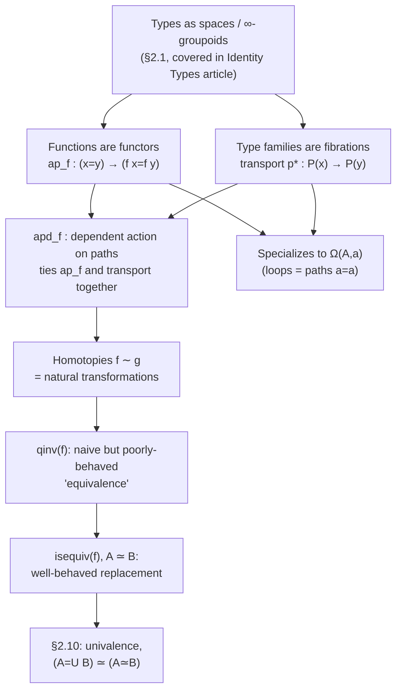

# Homotopical Interpretation of Type Theory

[[book-guidelines|↩ Back to guidelines]]

## Picking up where the groupoid structure leaves off

[[Identity-Types-and-Path-Structure]] established the headline metaphor: a type $A$ is a space, its elements are points, and $a =_A b$ is the type of paths between them — with reflexivity, inversion, and concatenation giving every type the structure of a (weak) $\infty$-groupoid, generated for free by path induction. That article stopped at the *static* picture: a single type, sitting there, already possessed of this rich internal path structure.

The question this article answers is: what happens when you have more than one type, connected by a function? If $A$ is a space and $B$ is a space, and $f : A \to B$ is an ordinary type-theoretic function, does $f$ respect the path structure — does it act sensibly on paths, not just on points? And if $B$ isn't a fixed type but a *family* $P : A \to \mathcal{U}$ varying over $A$ (the dependent-function case), what does it even mean to compare $P(x)$ and $P(y)$ when $x$ and $y$ are merely *path-equal*, not the same point? Finally: once you have functions and dependent functions in the picture, what's the right notion of "these two functions are the same," and what's the right notion of "these two types are the same" via a function between them?

These three questions are exactly Awodey–Coquand–Voevodsky's §§2.2–2.4: functions are functors, type families are fibrations, and homotopies/equivalences generalize function- and type-sameness. **What breaks without this material:** without it, the groupoid structure from §2.1 is an isolated fact about single types — useless for actually *doing* anything, because doing type theory means constantly applying functions to things, substituting along paths, and comparing functions to each other. This is the machinery that makes the groupoid picture operational.

## Functions are functors: $\mathrm{ap}_f$

### The problem functoriality solves

Suppose $f : A \to B$ and you have a path $p : x =_A y$. In ordinary (non-homotopical) type theory, you already know from "indiscernibility of identicals" that you can substitute $x$ for $y$ anywhere — so in particular $f(x)$ and $f(y)$ ought to be equal. But now equality is proof-relevant: it isn't enough to know that $f(x) =_B f(y)$ is *inhabited*; you want a specific, canonical way of turning the specific path $p$ into a specific path between $f(x)$ and $f(y)$, and you want that construction to interact well with the groupoid operations (inversion, concatenation) already established.

Topologically this is just the statement that **every function in type theory is automatically continuous** — it takes paths to paths, not just points to points. Categorically, it's the statement that $f$ acts as a **functor**: something that sends objects ($A$'s points) to objects ($B$'s points) *and* morphisms ($A$'s paths) to morphisms ($B$'s paths), in a way that respects identities and composition.

### The construction

**Lemma 2.2.1.** For $f : A \to B$ and any $x,y:A$, there's an operation
$$\mathrm{ap}_f : (x =_A y) \to (f(x) =_B f(y)), \qquad \mathrm{ap}_f(\mathrm{refl}_x) \equiv \mathrm{refl}_{f(x)}.$$

The proof is the same recipe used for symmetry and concatenation in §2.1: by path induction, it suffices to handle $p \equiv \mathrm{refl}_x$, and in that case $f(x) =_B f(x)$ is trivially discharged by $\mathrm{refl}_{f(x)}$. There is nothing more to it — $\mathrm{ap}_f$ (read "action on paths of $f$," or informally just "$f$ applied to a path") falls straight out of the induction principle, exactly the way inversion and concatenation did. The book often abbreviates $\mathrm{ap}_f(p)$ as just $f(p)$, borrowing the category-theory convention of overloading a functor's name for both its object-map and its morphism-map.

**Lemma 2.2.2 (functoriality).** For $f:A\to B$, $g:B\to C$, $p:x=_Ay$, $q:y=_Az$:

$$
\begin{aligned}
\text{(i)}\quad & \mathrm{ap}_f(p \cdot q) = \mathrm{ap}_f(p)\cdot\mathrm{ap}_f(q) &&\text{— respects composition}\\
\text{(ii)}\quad & \mathrm{ap}_f(p^{-1}) = \mathrm{ap}_f(p)^{-1} &&\text{— respects inverses}\\
\text{(iii)}\quad & \mathrm{ap}_g(\mathrm{ap}_f(p)) = \mathrm{ap}_{g\circ f}(p) &&\text{— respects composition of functors}\\
\text{(iv)}\quad & \mathrm{ap}_{\mathrm{id}_A}(p) = p &&\text{— respects identity}
\end{aligned}
$$

These four laws are exactly the functor laws from category theory, restated for the "functor from the groupoid $A$ to the groupoid $B$" that $f$ induces. And, as with every equation encountered so far in a proof-relevant setting, each of (i)–(iv) is itself a *path* (an equation between elements of an identity type), which in turn has its own higher coherence laws, all provable the same way — the tower never stops, but you also never have to climb it by hand.

### What breaks without $\mathrm{ap}_f$

Without a canonical $\mathrm{ap}_f$, you'd have no principled way to transport a specific proof of $x = y$ through a function application. You could still *prove* $f(x) = f(y)$ is inhabited (indiscernibility of identicals already gives you that), but you'd lose any way to relate *which* proof of $f(x)=f(y)$ you get to *which* proof of $x=y$ you started with — and it's exactly that fine-grained tracking that lets Lemma 2.2.2 state (and prove) that $f$ is well-behaved as a structure-preserving map between the groupoids $A$ and $B$, not merely a function on points that happens to preserve an external equivalence relation.

### Grounding

**Lean.** `ap_f` is *literally* `congrArg` in Lean's core library:

```lean
theorem congrArg {α β} (f : α → β) {a₁ a₂ : α} (h : a₁ = a₂) : f a₁ = f a₂ :=
  h ▸ rfl
```

Read this the same way as `Eq.symm`/`Eq.trans` in the sibling article: it's `Eq.rec` (based path induction) applied with the motive $C(y, p) :\equiv f(a_1) = f(y)$, discharged in the `rfl` case by `rfl : f a₁ = f a₁`. The functoriality laws of Lemma 2.2.2 are exactly the lemmas `congrArg`-chains satisfy inside `calc` blocks and inside the `simp` normal-form machinery — `congrArg (g ∘ f) h` and `congrArg g (congrArg f h)` being interchangeable is (iii), used constantly (often invisibly, via `simp`) whenever Lean rewrites under a function application.

**Rust.** There's no proof term to construct, but the *shape* — "given a witness that two values are interchangeable, produce a witness that applying the same function to each side still holds" — is exactly what a substitution-based verifier needs when propagating an equality fact through an expression tree:

```rust
// A minimal analogue: given a proof that `a` and `b` denote the
// same abstract value, and any pure function of that value,
// derive that f(a) and f(b) are also interchangeable.
fn ap<A, B>(proof_a_eq_b: Refl<A>, f: impl Fn(A) -> B) -> Refl<B>
where
    A: Clone,
{
    // In a real verifier this would carry the *specific* path,
    // not just witness existence — this sketch only shows the shape.
    Refl::refl()
}
```
The honest caveat: this Rust sketch can state "a proof transports across `f`" but can't express *which* path you get out as a function of *which* path you put in, the way `ap_f(p) : f(x) = f(y)` for a *specific* `p` does — that per-proof tracking is exactly the proof-relevance Rust's `bool`-flavored equality erases.

**Python.** Illustrative only: `ap_f` is the same shape as `map` applied to a single-element "proof" — apply `f` to both witnesses of a claimed equality and get a new claimed equality for free. Not load-bearing; Python has no proof objects to actually check this against.

## Type families are fibrations: transport

### The problem transport solves

$\mathrm{ap}_f$ handles non-dependent $f : A \to B$. But dependent functions $f : \prod_{(x:A)} P(x)$ are the type theory's bread and butter, and here the same question — "what happens to $f(x)$ as $x$ moves along a path $p : x =_A y$?" — runs into a real obstacle: $f(x) : P(x)$ and $f(y) : P(y)$ are elements of *different types* ($P(x)$ and $P(y)$ need not even be judgmentally equal). You can't ask "$f(x) = f(y)$?" at all until you have some way to relate the types $P(x)$ and $P(y)$ themselves. The path $p$ is exactly the missing ingredient — this is precisely "indiscernibility of identicals" from §1.12, now given its own name and a much richer topological reading.

**Lemma 2.3.1 (Transport).** For a type family $P : A \to \mathcal{U}$ and $p : x =_A y$, there's a function
$$p_* : P(x) \to P(y), \qquad (\mathrm{refl}_x)_* \equiv \mathrm{id}_{P(x)}.$$

By now the proof pattern should feel automatic: by path induction it suffices to handle $p \equiv \mathrm{refl}_x$, where the identity function on $P(x)$ trivially does the job. When it's necessary to disambiguate which family is being transported in, the book writes $\mathrm{transport}^P(p, -)$.

### The topological reading: fibrations and path lifting

This is the section that gives the article its name. Think of $P : A \to \mathcal{U}$ as a **fibration**: $A$ is the *base space*, $P(x)$ is the *fiber* over the point $x$, and $\sum_{(x:A)} P(x)$ is the *total space*, equipped with a projection $\mathrm{pr}_1 : \sum_{(x:A)} P(x) \to A$ forgetting the fiber component. Classically, the defining feature of a fibration is the **path-lifting property**: given a path $p$ in the base and a point $u$ in the fiber over its starting point, you can lift $p$ to a path in the total space starting at $u$ — continuously.

**Lemma 2.3.2 (Path lifting).** For $u : P(x)$ and $p : x =_A y$, there's a path $\mathrm{lift}(u,p) : (x,u) =_{\sum P} (y, p_*(u))$ in the total space, with $\mathrm{pr}_1(\mathrm{lift}(u,p)) = p$.

The book flags something philosophically sharp here: classically, being a fibration is a *property* a map might or might not have (you have to prove lifts exist). In type theory, **every** type family comes *equipped* with its lifting function, built by path induction — you never have to separately verify the fibration property, because constructive mathematics only lets you assert existence by exhibiting a witness, and the witness (`transport`) is handed to you for free. This is a recurring theme worth internalizing: what's an extra hypothesis in classical mathematics is often free structure in type theory, precisely because type theory refuses "exists but I can't show you" as a valid proof.

A useful vocabulary that follows: a dependent function $f : \prod_{(x:A)} P(x)$ is a **section** of the fibration $P$, and something holding "fiberwise" means it holds separately for each $P(x)$.

### The dependent version of $\mathrm{ap}_f$: $\mathrm{apd}_f$

Given $f : \prod_{(x:A)}P(x)$ and $p : x=_Ay$, you'd like a path "lying over $p$" connecting $f(x)$ and $f(y)$ — but they live in different fibers, so the honest way to state it is: transport $f(x)$ into the fiber over $y$ via $p_*$, and *then* ask whether it equals $f(y)$.

**Lemma 2.3.4 (Dependent map).** For $f : \prod_{(x:A)} P(x)$, there's
$$\mathrm{apd}_f : \prod_{p:x=y} \big(p_*(f(x)) =_{P(y)} f(y)\big).$$

Proved exactly like $\mathrm{ap}_f$: by path induction, reduce to $p \equiv \mathrm{refl}_x$, where $(\mathrm{refl}_x)_*(f(x)) \equiv f(x)$ judgmentally, so the goal collapses to $f(x)=f(x)$, closed by reflexivity. Paths that "lie over" other paths this way are called **dependent paths**, and they become central once [[Higher-Inductive-Types|higher inductive types]] (Chapter 6) start defining path constructors over base spaces like the circle.

When $P$ happens to be a *constant* family $P(x) :\equiv B$ (i.e. $f$ is secretly non-dependent), $\mathrm{apd}_f$ and $\mathrm{ap}_f$ ought to agree — but their *stated types* don't even match ($\mathrm{apd}_f(p)$ lives in $\mathrm{transport}^B(p,f(x))=f(y)$, while $\mathrm{ap}_f(p)$ lives in $f(x)=_B f(y)$), so the book proves a coherence lemma bridging them:

**Lemma 2.3.5.** For constant $P(x):\equiv B$: $\mathrm{transportconst}_p^B(b) : \mathrm{transport}^P(p,b) = b$.

**Lemma 2.3.8.** $\mathrm{apd}_f(p) = \mathrm{transportconst}_p^B(f(x)) \cdot \mathrm{ap}_f(p)$.

Both proved, as always, by reducing to $\mathrm{refl}_x$ and observing everything collapses to reflexivity. Three further transport identities round out the toolkit and get used constantly in later chapters without re-proof:

- **Lemma 2.3.9** (transport composes with concatenation): $q_*(p_*(u)) = (p\cdot q)_*(u)$ — transporting along $p$ then $q$ is the same as transporting along the single composite path $p\cdot q$.
- **Lemma 2.3.10** (transport along a composed path family): $\mathrm{transport}^{P\circ f}(p,u) = \mathrm{transport}^P(\mathrm{ap}_f(p), u)$.
- **Lemma 2.3.11** (transport commutes with fiberwise maps): $\mathrm{transport}^Q(p, f_x(u)) = f_y(\mathrm{transport}^P(p,u))$.

### What breaks without transport

Without a canonical $p_*$, dependent types would be nearly unusable in the presence of nontrivial paths: you could still *state* $\prod_{(x:A)}P(x)$, but you'd have no principled way to move an element of $P(x)$ into $P(y)$ once you know $x=y$, which is exactly what's needed the moment identity-type reasoning meets dependent types — e.g. proving something about a $\Sigma$-type, or (much later) defining a section over a higher inductive type like $S^1$, where the base space itself has nontrivial loops.

### Grounding — this is the general substitution principle, made computational

This is the single most load-bearing piece of §§2.2–2.4 for the compiler/elaborator project, so it's worth stating plainly: **transport is the type-theoretic name for the general substitution lemma** that every soundness proof for a Hoare-logic-style verifier eventually needs — "if two program states (or two types) are provably equal, any well-typed fact about one carries over to the other, along an explicit, checkable path." $p_*$ is not a metatheoretic side lemma bolted onto the system; it's a first-class term of the theory, constructed the same way as every other piece of path-structure, by path induction.

**Lean.** `▸` *is* `transport`, used constantly and often invisibly:

```lean
-- Eq.mpr / ▸ specialized to a type family P and a proof h : a = b
-- moves a term of type `P a` to a term of type `P b`.
example {A : Type} (P : A → Prop) {a b : A} (h : a = b) (pa : P a) : P b :=
  h ▸ pa
```

When Lean's elaborator unifies two types up to definitional equality and then needs to reuse a term typed against one side for a goal stated against the other, it is doing transport — `isDefEq` decides *whether* a path exists at the judgmental level, and once elaboration produces (or the kernel checks) a propositional witness `h : a = b`, `▸` is the mechanism that actually moves data across it. The path-lifting reading (Lemma 2.3.2) is the precise justification for why this move is *safe*, not just convenient: the lift is a genuine, well-typed path in the total space, not an unchecked cast.

**Rust.** The verifier use case is direct: a Hoare-triple checker that tracks "the program state currently satisfies predicate `P` at program point `x`" and needs to carry that fact across a provably-equal rewrite of the state (`x = y`) is implementing transport, whether or not it's named that:

```rust
// P : State -> Prop, represented as a checkable predicate.
// `proof` witnesses that states `x` and `y` are interchangeable
// (e.g. produced by a rewrite/simplification pass).
fn transport<S>(proof: Refl<S>, fact: impl Fn(&S) -> bool, x: &S, y: &S) -> bool {
    // In the book, this is *not* a runtime check — it's a proof
    // term. Here we can only simulate it operationally: the real
    // guarantee (fact holds at x implies it holds at y) has to be
    // established once, structurally, by the same kind of argument
    // as Lemma 2.3.1 — not re-verified at every call site.
    fact(x) // stand-in: a genuine verifier proves this equals fact(y)
}
```
The honest gap, again: Rust can express *that* a transport-shaped operation exists but can't make the type system enforce that it's actually sound for a caller-supplied `proof` — that soundness argument is exactly the payload a from-scratch verifier's kernel has to carry, mirroring what Lean's kernel checks about every `▸`.

**Python.** Skipped as non-load-bearing beyond a one-line gloss: transport is "just" `dict`-style rekeying of a fact from one key to a provably-equal key, with no type-checker enforcing the equality is genuine — illustrative only, not worth a snippet here.

## Homotopies and equivalences

### The problem: when are two functions "the same"?

Chapter 1 never had to ask this question. Now that functions are first-class citizens with their own internal path structure (via $\mathrm{ap}_f$), it's natural to ask what it means for $f, g : \prod_{(x:A)}P(x)$ to be equal — and, relatedly, what it means for two *types* $A, B$ to be "the same" via some function between them, which is the question that eventually motivates [[Formal-Metatheory#Univalence|univalence]].

The traditional answer — $f$ and $g$ agree pointwise — translates directly under propositions-as-types:

**Definition 2.4.1 (Homotopy).** $(f \sim g) :\equiv \prod_{(x:A)} (f(x) = g(x))$.

Note immediately: a homotopy is emphatically *not* the same thing as an identification $f = g$ — they're different types, related only later (§2.9, [[Formal-Metatheory#Function extensionality|function extensionality]]) by an axiom asserting they're equivalent. Under the topological reading, $f\sim g$ is literally a continuous family of paths from $f(x)$ to $g(x)$, one for each $x$ — exactly what a topologist calls a homotopy between two continuous maps, hence the name.

**Lemma 2.4.2.** Homotopy is an equivalence relation: reflexive, symmetric, transitive — each fact provable directly from the corresponding groupoid law on each individual path $f(x)=g(x)$.

### Homotopies are natural transformations

Just as functions are automatically functors, homotopies are automatically **natural transformations** between them:

**Lemma 2.4.3 (Naturality).** For $H : f\sim g$ (with $f,g:A\to B$) and $p:x=_Ay$:
$$H(x)\cdot g(p) = f(p)\cdot H(y).$$

This is exactly the commuting-square condition for a natural transformation between the "functors" $f$ and $g$, drawn as a square with $f(p)$ and $g(p)$ on the top/bottom and $H(x)$, $H(y)$ on the sides. The proof is the by-now-familiar move: induct on $p$, reduce to $\mathrm{refl}_x$, and the claim collapses to $H(x)\cdot\mathrm{refl} = \mathrm{refl}\cdot H(x)$, true by the unit laws from §2.1.

**Corollary 2.4.4** specializes this to $f\sim\mathrm{id}_A$: $H(f(x)) = \mathrm{ap}_f(H(x))$ — a fact that resurfaces repeatedly in Chapter 4's proofs that various definitions of "equivalence" coincide.

### From isomorphism to quasi-inverse — and why quasi-inverses aren't good enough

Traditionally, $f:A\to B$ is an isomorphism if some $g:B\to A$ satisfies $f\circ g \sim \mathrm{id}_B$ and $g\circ f\sim\mathrm{id}_A$. Packaging this as a type:

**Definition 2.4.6 (Quasi-inverse).** $\mathrm{qinv}(f) :\equiv \sum_{(g:B\to A)} (f\circ g\sim\mathrm{id}_B)\times(g\circ f\sim\mathrm{id}_A)$.

This looks like exactly the right definition of "equivalence" — and for many purposes it is (Examples 2.4.7–2.4.9 show $\mathrm{id}_A$, path-concatenation, and transport are all quasi-invertible, each via essentially the construction already used to prove those operations were groupoid-like in the first place). But under proof-relevance it has a serious defect the book flags without yet fully diagnosing (that's Chapter 4's job): **a single function $f$ can have multiple, genuinely *unequal* inhabitants of $\mathrm{qinv}(f)$.** $\mathrm{qinv}(f)$ is not, in general, a mere proposition — it can carry real, distinguishable information beyond "$f$ is invertible," which is exactly the wrong behavior for a notion that's supposed to express a *property* of $f$ rather than *extra structure* on it.

### Repairing it: $\mathrm{isequiv}(f)$ and $A\simeq B$

The book wants a replacement notion $\mathrm{isequiv}(f)$ satisfying three properties that jointly say "logically equivalent to $\mathrm{qinv}(f)$, but well-behaved":

1. $\mathrm{qinv}(f) \to \mathrm{isequiv}(f)$
2. $\mathrm{isequiv}(f) \to \mathrm{qinv}(f)$
3. any two inhabitants of $\mathrm{isequiv}(f)$ are equal — i.e. it *is* a mere proposition.

Chapter 4 will present several candidate definitions and prove them all equivalent; for now the book offers the easiest one to state:
$$\mathrm{isequiv}(f) :\equiv \Big(\sum_{g:B\to A} (f\circ g\sim\mathrm{id}_B)\Big) \times \Big(\sum_{h:B\to A} (h\circ f\sim\mathrm{id}_A)\Big). \tag{2.4.10}$$
Splitting the two-sided quasi-inverse into a separately-witnessed *left* inverse and *right* inverse (rather than reusing a single $g$ for both) is precisely the trick that kills the extra unwanted information — properties (i) and (ii) are proved directly (given a quasi-inverse $(g,\alpha,\beta)$, take $(g,\alpha,g,\beta)$; conversely, given separate $g,h$, a short homotopy-algebra argument $g\sim h\circ f\circ g\sim h$ manufactures a single two-sided witness). Property (iii) is deferred to §4.3, once §§2.6–2.7 supply the tools for identifying identity types of $\Sigma$-types and products.

With $\mathrm{isequiv}$ in hand, an **equivalence** is a function bundled with a proof it's one:
$$(A\simeq B) :\equiv \sum_{f:A\to B}\mathrm{isequiv}(f).$$

**Lemma 2.4.12.** $\simeq$ is an equivalence relation on $\mathcal{U}$: $\mathrm{id}_A$ is always an equivalence; equivalences invert; equivalences compose. This is exactly what makes $\simeq$ a candidate meaning for "type $A$ and type $B$ are the same," and it's the notion the univalence axiom will directly relate to the identity type of the universe itself — but establishing *that* connection is the sibling topic "[[The-Univalence-Axiom-and-Its-Consequences|The Univalence Axiom and Its Consequences]]," not this one.

### What breaks without separating $\mathrm{qinv}$ from $\mathrm{isequiv}$

If you tried to define "$A\simeq B$" directly as "$\exists$ an $f$ with a quasi-inverse," you'd get a type that's technically inhabited exactly when you want it to be, but whose *proofs* carry junk data that later constructions (especially univalence, which needs $A=_{\mathcal{U}}B \simeq A\simeq B$ to be an equivalence of *mere data*, not an equivalence hiding extra unrecorded choices) can't tolerate. This is the same proof-relevance lesson as Lemma 2.1.2's two-sided induction in the sibling article, one level up: a proposition and a type of proofs for it can come apart, and when they do, you have to engineer the "right" type by hand.

### Grounding

**Lean.** Homotopy is exactly `funext`'s hypothesis type before you invoke the axiom:

```lean
-- `Function.funext_iff` / the raw hypothesis shape:
example (f g : A → B) (H : ∀ x, f x = g x) : True := trivial
-- H : ∀ x, f x = g x  is exactly (f ∼ g); funext turns H into f = g.
```

And `isequiv`/`qinv` map directly onto Lean's `Function.LeftInverse`/`Function.RightInverse`/`Function.Bijective` versus the bundled `Equiv` (`≃`) type:

```lean
structure Equiv (α β : Sort*) where
  toFun    : α → β
  invFun   : β → α
  left_inv : Function.LeftInverse invFun toFun
  right_inv : Function.RightInverse invFun toFun
```

Mathlib's `Equiv` bundles a function with *both-sided* inverse data much like `qinv`, while `Equiv.Perm`/subsingleton-style lemmas about when two `Equiv`s are equal play the role of property (iii) above — worth recognizing directly if you ever consult Mathlib's `Logic/Equiv/Defs.lean` for a real implementation of this exact design decision.

**Rust.** The quasi-inverse-versus-well-behaved-equivalence distinction maps onto a real API design question for the verifier: a trait with a *single* method that "proves" invertibility by supplying one function...

```rust
trait Iso<A, B> {
    fn forward(&self, a: A) -> B;
    fn backward(&self, b: B) -> A;
    // Laws (not enforced by the compiler, exactly as `qinv`'s
    // laws aren't automatically well-behaved): forward/backward
    // must actually be mutually inverse up to the equality this
    // trait is meant to witness.
}
```

...is the `qinv` shape, and is exactly the design that later needs hardening (splitting `left_inverse`/`right_inverse` witnesses, or proving uniqueness of the inverse) the moment you need to compare two `Iso` instances for a given pair of types — the same fix the book applies in going from (2.4.5) to (2.4.10).

**Python.** For illustration only: `f_inv = {v: k for k, v in f.items()}` on a `dict` is a quasi-inverse in the naive sense (round-trips), with no type-level tracking of *which* proof of bijectivity you have — useful only as a one-line intuition pump, not a load-bearing analogue.

## Closing the loop: back to $\Omega^n$

The sibling article's iterated loop spaces $\Omega^n(A,a)$ — defined at the very end of §2.1 by $\Omega^0(A,a):\equiv(A,a)$ and $\Omega^{n+1}(A,a):\equiv\Omega^n(\Omega(A,a))$ — are not a separate topic from what's been built here; they're the special case where everything above collapses onto a single point. A loop $p:\Omega(A,a)$ is just a path $a=_Aa$, so:

- $\mathrm{ap}_f$ restricted to loops gives a map $\Omega(A,a)\to\Omega(B,f(a))$ — a function between loop spaces induced by any $f:A\to B$, i.e. $f$ acting as a "functor" on the one-object groupoid $\Omega(A,a)$.
- transport along a loop $p:a=_Aa$ specializes to an *automorphism* $p_*:P(a)\to P(a)$ of a single fiber — the monodromy action that becomes central once Chapter 8 studies the fundamental group of the circle by understanding exactly this action for the universal-cover family over $S^1$.
- homotopy and quasi-inverse, applied to the identity function on $\Omega(A,a)$, is precisely the statement that loop-concatenation makes $\Omega(A,a)$ into a genuine (higher) group — invertible, associative up to higher paths, exactly the "higher group" language the sibling article used going into Eckmann–Hilton.

Nothing new needs proving here — this is only to make explicit that "functions are functors," "type families are fibrations," and "homotopies generalize sameness" are not independent chapter sections so much as three facets of one machine, all of which specialize cleanly onto the loop-space picture the previous article already built out toward Eckmann–Hilton.



## Where this leads

Within Chapter 2 itself, §§2.2–2.4 are the toolbox every later section reuses without re-deriving: §2.5 onward characterizes the identity types of every Chapter 1 type former (products, $\Sigma$-types, the unit type, $\Pi$-types, the universe) by combining $\mathrm{ap}$, transport, and the machinery of equivalences built here — and §2.9's function extensionality axiom is precisely the assertion that the homotopy type $(f\sim g)$ from this article and the identification type $(f=g)$, kept carefully distinct in Definition 2.4.1, are in fact equivalent. **The univalence axiom** (the sibling topic "The Univalence Axiom and Its Consequences") is the same move one level up: it asserts $A =_{\mathcal U} B \simeq A\simeq B$, using exactly the $\simeq$ built in §2.4 as the right-hand side. None of that statement is even well-formed without $\mathrm{isequiv}$ already being the *correct*, well-behaved notion established here. Further out, transport and its path-lifting reading (Lemma 2.3.2) are the direct ancestor of [[Synthetic-Homotopy-Theory#The encode-decode method|the encode-decode method]] in Chapter 8 — computing $\pi_1(S^1)$ is, at bottom, transport along loops in a cleverly chosen family over the circle.

For the standing project: **transport is the single most transferable idea in this article.** It is the type-theoretic, fully-formalized version of "substitute an equal for an equal and carry every fact along with it" — exactly the operation a Hoare-triple soundness proof needs when rewriting one program-state description into a provably-equal one, and exactly what Lean's `▸` does under the hood when the elaborator has already established `isDefEq` (or a propositional equality proof) between two types it needs to unify terms across. $\mathrm{ap}_f$ is the same idea one level more basic — propagating a proof of equality through a *pure function application*, which is the substitution step underlying any rewrite-based unification pass. And the $\mathrm{qinv}$-versus-$\mathrm{isequiv}$ split is a concrete, worked example of a recurring design problem for the elaborator project: a "this holds" proposition and its "here's the data proving it" witness type are not automatically the same shape, and getting that distinction right — building the *mere-proposition* version by hand when the naive one leaks extra structure — is exactly the discipline Miller-pattern unification needs when deciding whether two metavariable solutions are the *same* solution or merely two different, unequal proofs that a solution exists.
