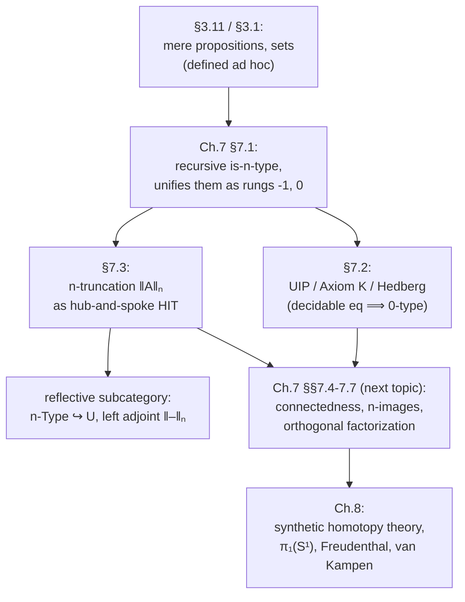

# Homotopy n-Types and Truncation Levels

[[book-guidelines|↩ Back to guidelines]]

## What problem does this solve?

By the time you reach Chapter 7, the book has already smuggled in two special cases of a pattern without naming the pattern itself. Back in §3.1 and §3.11 it singled out **mere propositions** — types with at most one inhabitant up to path — and **sets** — types where any two parallel paths are themselves connected by a path (so equality proofs don't matter beyond their existence). Those looked like two unrelated definitions bolted on for logic (propositions) and for recovering ordinary mathematics (sets). Chapter 7's job is to show they're the bottom two rungs of a single infinite ladder, and to give that ladder a uniform, recursive definition.

The motivating picture is genuinely geometric, and worth taking seriously before any formula: a **homotopy $n$-type** is a space with no interesting homotopical structure *above* dimension $n$. A $0$-type is a set of points with no interesting paths between them (any two parallel paths coincide). A $1$-type can have honest, distinguishable paths (like loops on a circle) but no interesting *paths between those paths* — a groupoid, in the language of category theory. In general, as $n$ climbs, you're allowing more and more layers of "proofs that two proofs are equal" to matter, before finally declaring the hierarchy trivial from that point up. This is also called **$n$-truncatedness**, and its dual is **connectedness** (no interesting structure *at or below* dimension $n$) — the two notions will later assemble into an orthogonal factorization system (that's the next topic in the book; this article stays inside the $n$-type hierarchy itself).

**What breaks without a uniform definition:** without it, every time you wanted "sets," "groupoids," "2-groupoids," and so on to behave consistently under products, function spaces, dependent sums, and equivalence, you'd have to reprove the same closure lemma once per level, by hand, forever. A recursive definition lets you prove *one* lemma by induction on $n$ and get the whole ladder at once — this is precisely the move Theorem 7.1.8 makes for $\Sigma$-types, Theorem 7.1.9 for $\Pi$-types, and Theorem 7.1.10 for the predicate "is an $n$-type" itself.

---

## The recursive definition: bootstrapping from contractibility

The book starts the hierarchy two rungs *below* zero, at $n = -2$, because that's where the induction actually bottoms out cleanly.

**Definition 7.1.1.** For $n \geq -2$, define $\mathsf{is\text{-}n\text{-}type} : \mathcal{U} \to \mathcal{U}$ by recursion on $n$:
$$
\mathsf{is\text{-}n\text{-}type}(X) :\equiv
\begin{cases}
\mathsf{isContr}(X) & \text{if } n = -2, \\
\prod_{(x,y:X)} \mathsf{is\text{-}n'\text{-}type}(x =_X y) & \text{if } n = n' + 1.
\end{cases}
$$
$X$ is an **$n$-type** (or **$n$-truncated**) if $\mathsf{is\text{-}n\text{-}type}(X)$ is inhabited.

Read this the way you'd read a recursive function definition, because that's exactly what it is: the base case says "a $(-2)$-type is a contractible type" (one point, and every other point is connected to it by a *unique* path up to higher coherence — contractibility, from earlier chapters, already bundles that "unique up to homotopy" content). The recursive case says "an $(n+1)$-type is a type whose *identity types* — its path spaces $x =_X y$ — are all $n$-types." So each level is defined entirely in terms of the level one below it, applied one dimension up (to *paths* instead of *points*).

Unwinding two steps confirms the two special cases you already knew:

- **$(-1)$-types are mere propositions.** By definition, $X$ is a $(-1)$-type iff for all $x, y : X$, the type $x =_X y$ is a $(-2)$-type, i.e. contractible — which just says "any two elements have a unique-up-to-coherence path between them," which is Lemma 3.11.10's characterization of a mere proposition. (This is the object the sibling article [[The-Propositions-as-Types-Correspondence|The Propositions as Types Correspondence]] studies from the *logic* side, as the truncated home of "true or false" statements; here it's simply rung $-1$ of the ladder.)
- **$0$-types are sets.** $X$ is a $0$-type iff for all $x, y : X$, the type $x =_X y$ is a $(-1)$-type, i.e. a mere proposition — meaning any two proofs $p, q : x = y$ are themselves equal. That's exactly the book's Chapter 2/3 definition of a set.

So "contractible," "proposition," and "set" are not three separately-invented ideas — they are $\mathsf{is\text{-}(-2)\text{-}type}$, $\mathsf{is\text{-}(-1)\text{-}type}$, and $\mathsf{is\text{-}0\text{-}type}$, unfolded. The book flags (Example 7.1.3) that it will later exhibit types that are *not* $n$-types for any finite $n$ — the $(n+1)$-sphere $S^{n+1}$ fails to be an $n$-type (Chapter 8), and there's even a type that fails to be an $n$-type for *every* finite $n$ (§8.8) — so the hierarchy is genuinely infinite and non-collapsing; it isn't a formal nicety that happens to stop mattering after sets.

### Closure properties: why the recursion pays for itself

Chapter 7 spends its early pages proving that the $n$-type property survives the usual type-forming operations, each time by induction on $n$ with the $n=-2$ case supplied by earlier contractibility lemmas:

- **Retracts** (Theorem 7.1.4) and hence **equivalences** (Corollary 7.1.5): if $X \simeq Y$ and $X$ is an $n$-type, so is $Y$.
- **Embeddings** (Theorem 7.1.6): if $f : X \to Y$ is an embedding and $Y$ is an $n$-type ($n \geq -1$), so is $X$ — note the theorem explicitly fails at $n = -2$ (the map $\mathbf{0} \to \mathbf{1}$ is an embedding into a contractible type, but the empty type isn't contractible).
- **Cumulativity** (Theorem 7.1.7): every $n$-type is automatically an $(n+1)$-type. The hierarchy only ever adds structure as you go up; nothing is lost by "over-truncating" your expectations.
- **$\Sigma$-types** (Theorem 7.1.8), **$\Pi$-types** (Theorem 7.1.9), and hence products and pullbacks: if the pieces are $n$-types, so is the whole — in particular, $A \to B$ is an $n$-type whenever $B$ is.
- **The predicate itself** (Theorem 7.1.10): $\mathsf{is\text{-}n\text{-}type}(X)$ is always a mere proposition, for any $X$ — being $n$-truncated is not extra *data* you carry around, it's a *property*, provable-or-not, exactly like being a set.

That last fact licenses a genuinely elegant move: bundle the type together with a proof of its truncation level into a single type of "$n$-types,"
$$
n\text{-}\mathrm{Type} :\equiv \sum_{X : \mathcal{U}} \mathsf{is\text{-}n\text{-}type}(X),
$$
recovering $\mathrm{Prop} :\equiv (-1)\text{-}\mathrm{Type}$ and $\mathrm{Set} :\equiv 0\text{-}\mathrm{Type}$ from earlier chapters as instances of one construction. And then the hierarchy closes over itself in a satisfying way:

**Theorem 7.1.11.** $n\text{-}\mathrm{Type}$ is itself an $(n+1)$-type.

The type of all $n$-types lives one level up in its own hierarchy — the same self-referential shape as "the type of all sets is a $1$-type (a groupoid), not a set" you'd expect from [[Formal-Metatheory#Univalence|univalence]] (equality of $n$-types is equivalence of the underlying types, by the same $\mathsf{ua}$-flavored argument used for $\mathrm{Set}$ and $\mathrm{Prop}$ in earlier chapters).

---

## Uniqueness of identity proofs, Axiom K, and Hedberg's theorem

Sets ($0$-types) are common enough — most of ordinary mathematics lives there — that the book gives their defining property three interchangeable faces, and then a powerful sufficient condition for reaching it.

**Face 1 — UIP.** $X$ is a set iff for all $x,y:X$ and $p,q:x=_X y$, we have $p = q$. This is literally $\mathsf{is\text{-}0\text{-}type}(X)$ unfolded: **uniqueness of identity proofs**.

**Face 2 — Axiom K** (Theorem 7.2.1, after Streicher). $X$ satisfies Axiom K if for all $x:X$ and $p : x =_X x$, we have $p = \mathsf{refl}_x$ — every self-path is trivial. UIP trivially implies Axiom K; the converse follows by path induction on $q$, reducing the general UIP goal to the $K$-special-case where the two endpoints coincide. The book is careful to stress neither is being *assumed* as an axiom here — they're properties a type may or may not have (Example 3.1.9 already exhibited a type, the circle-flavored construction from univalence, that is *not* a set).

**Face 3 — a reflexive relation implying identity** (Theorem 7.2.2). If $R$ is a reflexive mere relation on $X$ (each $R(x,y)$ a mere proposition) and there's a map $f : \prod_{x,y} R(x,y) \to (x =_X y)$, then $X$ is a set *and* $R(x,y) \simeq (x =_X y)$ for all $x,y$. The proof is a continuity/naturality argument: the witness function $f$ has to interact coherently with transport along any self-path $p : x = x$, and grinding that out forces $p = \mathsf{refl}_x$ by cancellation — Axiom K falls out mechanically. This is the workhorse lemma; everything else in the section is a corollary of it.

**The payoff — Hedberg's theorem (7.2.5).** If $X$ has **decidable equality** — for all $x,y:X$, $(x =_X y) + \neg(x =_X y)$ — then $X$ is a set.

The proof chains two small facts: (a) for any type $A$, $(A + \neg A) \to (\neg\neg A \to A)$ (Lemma 7.2.4 — a decision procedure lets you strip a double negation, by case-splitting on the decision and using $\mathsf{ex\ falso}$ in the negative case); apply this pointwise to get $\neg\neg(x=y) \to (x=y)$ for every $x,y$; then (b) that double-negation-elimination property is itself enough to trigger Theorem 7.2.2's machinery (take $R(x,y) :\equiv \neg\neg(x=_X y)$, which is automatically a mere proposition and reflexive), so $X$ is a set. As a worked instance, $\mathbb{N}$ has decidable equality by a completely elementary double induction (Theorem 7.2.6: compare $\mathrm{zero}$/$\mathrm{succ}$ constructors pairwise), so Hedberg's theorem hands you "the natural numbers are a set" for free, without needing the full computation of $\mathbb{N}$'s identity types from §2.13.

**Why this matters as a theorem, not just a fact about $\mathbb{N}$:** in a type theory without univalence-style exotic identity types, you might expect *every* type to satisfy UIP — that was the classical assumption before HoTT. Hedberg's theorem is the precise boundary: it doesn't say "all types are sets," it isolates *exactly* the sufficient condition (a decision procedure for equality) that forces set-hood, and the book is careful to contrast this with the *inconsistent* statement $\mathrm{LEM}_\infty$ ("every type merely satisfies $A + \neg A$"), which Corollary 3.2.7 already ruled out. Ordinary consistent LEM only gives you *merely* decidable equality ($\|a=b\| + \neg\|a=b\|$), which is not enough to run this argument — the decision needs to be an actual, non-truncated case split.

### Axiom K generalizes: the $n$-type ladder as iterated loop spaces

The book then shows Axiom K was never really about sets specifically — it's the $n=0$ instance of a pattern about **loop spaces** $\Omega(X,x) :\equiv (x =_X x)$.

**Theorem 7.2.7.** For $n \geq -1$, $X$ is an $(n+1)$-type iff $\Omega(X,x)$ is an $n$-type for every $x:X$.

**Theorem 7.2.9** (the full generalization). For $n \geq -1$, $X$ is an $n$-type iff $\Omega^{n+1}(X,a)$ — the $(n{+}1)$-fold iterated loop space at any basepoint — is *contractible* for every $a:X$. Axiom K is exactly this statement at $n=0$ ($\Omega^1$ contractible means every self-loop is $\mathsf{refl}$); UIP is $n=-1$ read through Exercise 3.5. So "how many layers of loops-on-loops does this space have before everything collapses to a point" *is* the $n$-type hierarchy, stated purely homotopically, with no reference to a specific level's name (proposition, set, groupoid, …).

---

## $n$-truncation: turning any type into its best $n$-type approximation

Knowing which types already sit at level $n$ is only half the story. The book already built one truncation — propositional truncation $\|A\|$, forcing any type down to a mere proposition (§3.7), constructed as a higher inductive type in §6.9. §7.3 generalizes this to **$n$-truncation**, $\|A\|_n$, for every $n \geq -2$: the "best approximation from below" of $A$ by an $n$-type, classically the type's $n$th Postnikov section.

**[[Homotopical-Interpretation-of-Type-Theory#The construction|The construction]] idea.** Theorem 7.2.9 said $X$ is an $n$-type exactly when $\Omega^{n+1}(X,a)$ is contractible at every point, and a lemma from §6.5 identifies $\Omega^{n+1}(X,a) \simeq \mathrm{Map}_*(S^{n+1},(X,a))$ — iterated loops are the same data as basepoint-preserving maps out of the $(n{+}1)$-sphere. So "make $X$ into an $n$-type" reduces to "make every map $S^{n+1} \to X$ contractible as a based map," and *that* is something you can force directly with path constructors, using the same **hub-and-spoke** trick from §6.7 that handles other higher-dimensional gluing.

**Definition (hub and spoke).** For $n \geq -1$, $\|A\|_n$ is the higher inductive type generated by:
- $|\text{--}|_n : A \to \|A\|_n$,
- for every $r : S^{n+1} \to \|A\|_n$, a **hub point** $h(r) : \|A\|_n$,
- for every such $r$ and every $x : S^{n+1}$, a **spoke path** $s_r(x) : r(x) = h(r)$.

Every map from the sphere into the truncation gets an explicit "cone point" glued in (the hub), with a path from every point of the sphere's image straight to it (the spokes) — literally forcing $\mathrm{Map}_*(S^{n+1}, -)$ to contract, by fiat, as a constructor rather than as something proved after the fact. (At $n=-2$ this construction doesn't typecheck — spheres of dimension $-1$ don't make sense — so the book just sets $\|A\|_{-2} :\equiv \mathbf{1}$ directly, the contractible unit type.)

**Lemma 7.3.1** confirms the construction does what it promises: $\|A\|_n$ is an $n$-type, by unwinding $\Omega^{n+1}(\|A\|_n, b) \simeq \mathrm{Map}_*(S^{n+1}, (\|A\|_n,b))$ and showing the constant map at $b$ is its center of contraction — the spokes are exactly the homotopy needed to connect any based map back to that constant one.

### The universal property: $n$-types as a reflective subcategory

The induction principle extracted from the constructors (Theorem 7.3.2) says: to define a section out of $\|A\|_n$ landing in an $n$-type-valued family, you only need to handle the point constructor case — the hub and spoke cases are automatically dischargeable *because* the target is already $n$-truncated (the hub case needs a "contraction" that the $n$-type-ness of the codomain supplies for free, and the spoke case is then automatic). Specializing to a constant codomain $E$ gives the plain **recursion principle**: any $f : A \to E$ into an $n$-type $E$ extends uniquely (up to the induction principle's uniqueness clause) to $\mathrm{ext}(f) : \|A\|_n \to E$.

That "uniquely" sharpens into an honest universal property (Lemma 7.3.3): for $B$ an $n$-type,
$$
(\|A\|_n \to B) \;\xrightarrow{\ \simeq\ }\; (A \to B), \qquad g \mapsto g \circ |\text{--}|_n.
$$
In categorical language — the book says this explicitly — **the $n$-types form a reflective subcategory of the category of all types**, with $\|\text{--}\|_n$ as the reflector left adjoint to the inclusion. Two consequences the book draws out that are worth internalizing on their own:

- **Functoriality** (7.3.4–7.3.6): the universal property forces $\|\text{--}\|_n$ to act on morphisms too, $\|f\|_n : \|A\|_n \to \|B\|_n$, compatibly with composition and identities, and even up to homotopy ($\|g\circ f\|_n = \|g\|_n \circ \|f\|_n$, with coherent higher data for homotopic $f \sim g$).
- **$A$ is already an $n$-type iff $|\text{--}|_n : A \to \|A\|_n$ is an equivalence** (Corollary 7.3.7) — truncating a type that's already at the right level does nothing, up to equivalence, exactly as you'd want a reflector to behave.
- **The reflector preserves finite products** (Theorem 7.3.8): $\|A \times B\|_n \simeq \|A\|_n \times \|B\|_n$ — truncating a pair is the same as truncating each half separately, proved directly from the universal property via a chain of currying equivalences, no direct construction needed.

### Path spaces of truncations, and cumulativity

The last structural fact worth carrying forward (Theorem 7.3.12, via [[Synthetic-Homotopy-Theory#The encode-decode method|the encode-decode method]] reused from earlier equality-type computations) is that truncation commutes with taking path spaces one level down:
$$
\big\|x =_A y\big\|_n \;\simeq\; \big(|x|_{n+1} =_{\|A\|_{n+1}} |y|_{n+1}\big).
$$
In words: the paths *inside* the $(n{+}1)$-truncation of $A$ are exactly the $n$-truncations of the paths of $A$ itself. This is what you'd expect from the recursive definition of $n$-types in the first place — bumping the truncation level up by one is precisely "truncate the paths one level lower" — and it's what lets the book later compute homotopy groups of truncated spaces (Chapter 8) by induction on dimension rather than re-deriving each case from scratch. The book closes the section by noting truncations are **cumulative**: truncating to level $n$ and then to level $k \leq n$ is the same as truncating directly to level $k$ — no information is recoverable by truncating in two smaller steps versus one big one.

---

## Grounding: what this hierarchy corresponds to outside HoTT

**Lean — primary, because this material is definitionally about proof-relevance.** Lean's `Prop` sort is *judgmentally* proof-irrelevant: any two proofs `p q : P` of `P : Prop` are definitionally equal, full stop, no theorem required. That's Lean baking in "every `Prop` is a $(-1)$-type" as a kernel rule rather than deriving it. HoTT can't do that as a primitive — the univalence axiom means some types genuinely *do* have nontrivial higher path structure (equivalences between them count as distinct paths), so "this type has no interesting proof-of-equality structure" has to be *earned*, per type, by an actual theorem. Hedberg's theorem is exactly the earning mechanism for the case Lean's `Decidable` instances live in: whenever you write `deriving DecidableEq` on a Lean `structure` or `inductive` in `Type` (not `Prop`), you are constructing precisely the decision procedure Theorem 7.2.5 needs, and Hedberg's theorem is *why* that's enough to conclude the type behaves like a set — why, e.g., `Nat`'s `Decidable (a = b)` instance justifies treating `Nat` as having no interesting structure above its points, matching `Nat.decEq` plus a Hedberg-shaped argument in Lean's own core library (`Subsingleton (a = b)`, i.e. proof irrelevance for *that* equality, derived rather than assumed). This is a genuinely load-bearing correspondence for your elaborator project: definitional-equality checking on inductively-defined data (constructors, de Bruijn indices, metavariable identifiers) is exactly the "decidable equality on a $0$-type" situation, and Hedberg's theorem is the theorem that licenses treating equality proofs there as irrelevant — you never have to worry about *which* proof of `a = b` a unifier produced, only *that* one exists, as long as the type in question has decidable equality. `n-Type` and the reflector `∥–∥ₙ` also has a direct Lean shadow: `Trunc` in Lean/mathlib-style libraries (and `Quot`/`Squash` in Lean 4's core) is a computational stand-in for propositional truncation, i.e. $\|A\|_{-1}$, the $n=-1$ case of exactly this construction — Lean gives you one rung of the ladder as a built-in; HoTT Chapter 7 shows you how to build every rung.

**Rust — secondary, for the decidable-equality half.** `#[derive(PartialEq, Eq)]` on a Rust `enum`/`struct` with purely structural comparison (no `f32`/`f64` fields, whose `PartialEq` deliberately isn't reflexive) is a decision procedure for equality in exactly Hedberg's sense: it's a total, computable answer to "are these two values equal," and `Eq`'s contract (reflexive, symmetric, transitive) is the classical shadow of "this type behaves like a set." The type-level distinction Rust doesn't make, but HoTT insists on, is that Rust's `Eq` says nothing about *how many ways* two values can be equal — it can't, because Rust has no notion of a proof of equality as a first-class value at all. That erasure is fine for ordinary programming precisely because the types you `derive(Eq)` on are, in HoTT terms, always intended to be $0$-types; Hedberg's theorem is the reason that intention is *safe* rather than merely conventional, whenever the derived equality is actually decidable.

**Python — illustrative only.** Python's `__eq__`/`__hash__` contract (equal objects must hash equal) is a loose, dynamically-checked analogue of the same idea — a `frozenset` or `dict` key type is implicitly assumed to be "set-like" (no interesting structure in *how* two keys came to be equal), and violating that assumption (e.g. defining `__eq__` inconsistently with `__hash__`) is the classic Python bug whose type-theoretic diagnosis is "this type isn't actually a $0$-type the way the container assumed." Not load-bearing for your two target projects, but a useful gut-check example.

---

## Where this leads

This topic is the load-bearing generalization that makes the rest of Part III of the book possible: [[Connectedness-and-Orthogonal-Factorization|connectedness and orthogonal factorization]] (the very next topic) are literally defined as the dual notion to $n$-truncatedness applied to *maps* rather than types, and every homotopy-group computation in Chapter 8 leans on the fact that $n$-truncation commutes with path spaces (Theorem 7.3.12) to reduce a computation about a complicated space to an induction on dimension.

For your own projects, the most concrete takeaway is Hedberg's theorem: it is the formal justification, inside a proof-relevant type theory, for the informal assumption every ordinary type checker already makes — that once you've established equality is decidable on some class of terms, you can stop worrying about *which* proof of an equality a piece of code produced. If you ever extend a Rust verifier or a Lean-style elaborator to reason about types with genuinely nontrivial identity types (quotients, HITs, setoids), Hedberg's theorem is precisely the boundary marking where that extra care becomes necessary versus where ordinary decidable-equality reasoning remains sound.
